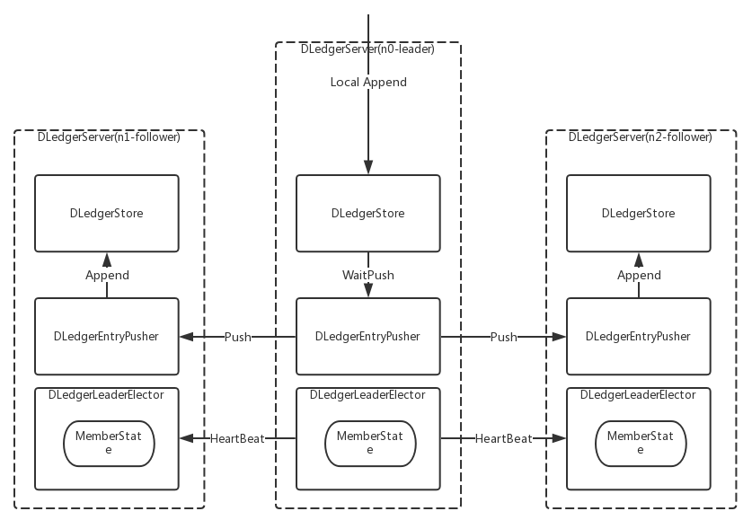
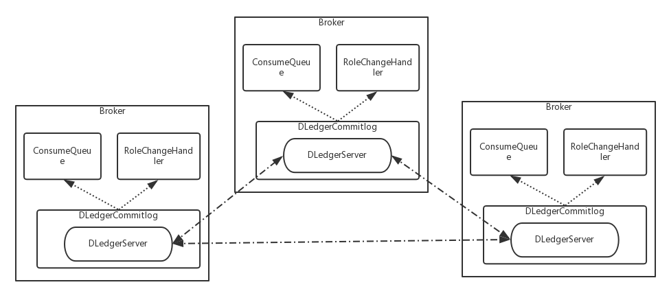
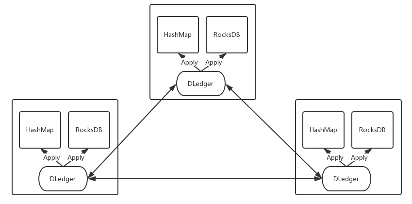
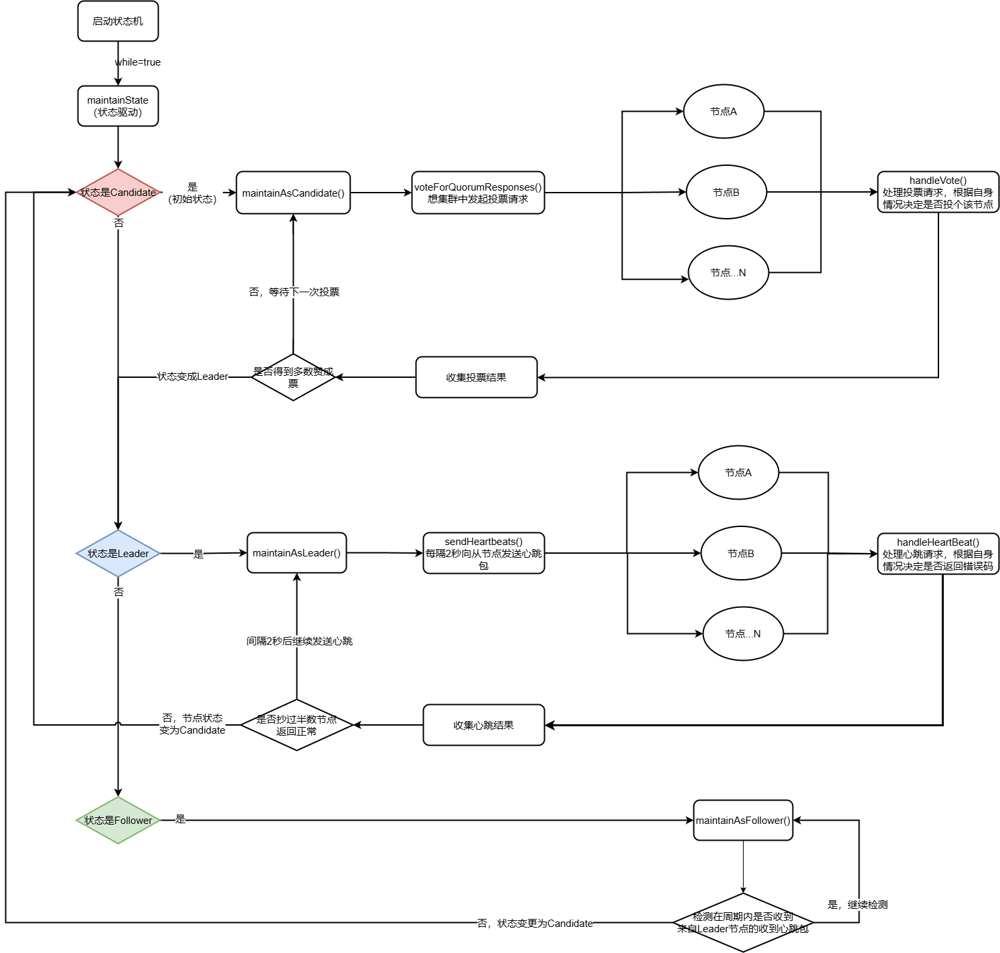
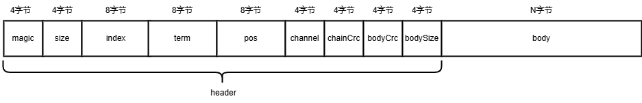
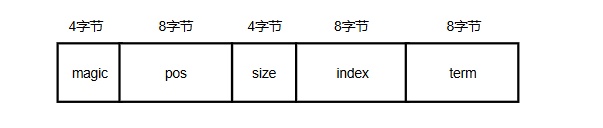
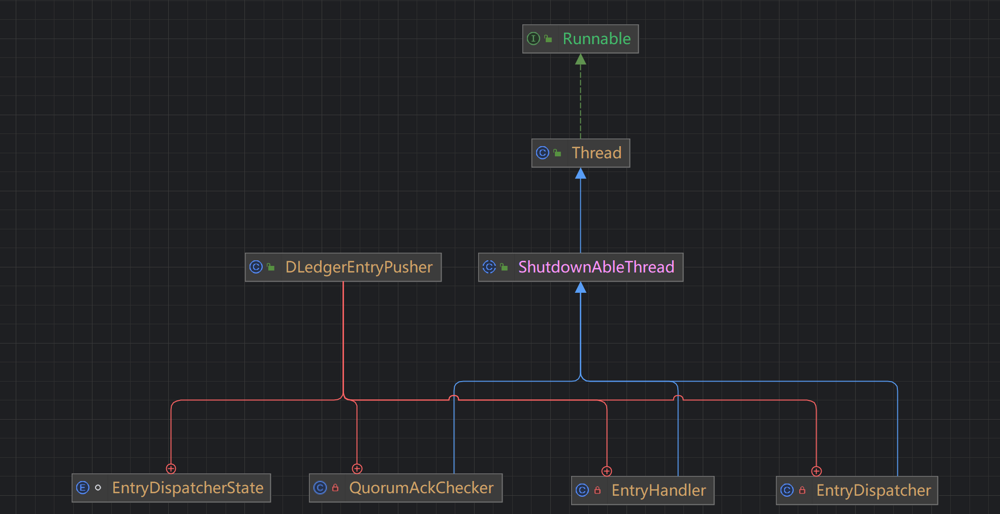
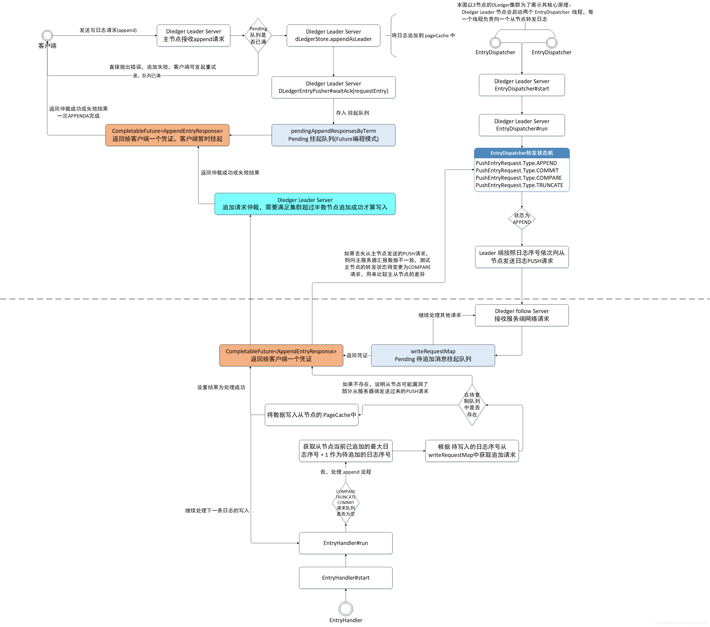
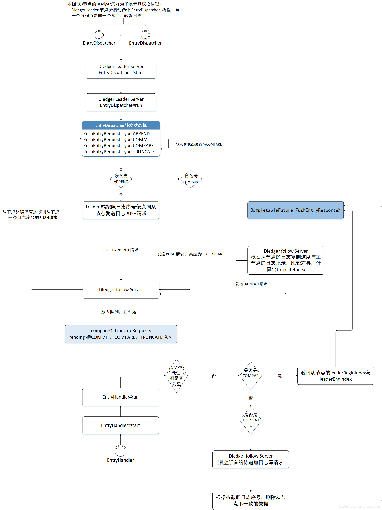

# RocketMQ基于Raft协议的主从切换原理

> 本文所涉及的注释源码：[bigcoder84/dledger](https://github.com/bigcoder84/dledger)
>
> 参考：《RocketMQ技术内幕 第二版》

RocketMQ 4.5版本之前，可以采用主从架构进行集群部署，但是如果 master 节点挂掉，不能自动在集群中选举出新的 master 节点，需要人工介入，在4.5版本之后提供了 DLedger 模式，DLedger 是 Open Messaging 发布的一个基于 Raft 协议实现的Java类库，可以方便引用到系统中，满足其高可用、高可靠、强一致的需求，其中在 RocketMQ 中作为消息 Broker 存储高可用实现的一种解决方案。使用Raft算法，如果 master 节点出现故障，可以自动选举出新的 master 进行切换。

## 一. Raft协议概述

在分布式系统应用中，高可用、一致性是经常面临的问题，针对不同的应用场景，我们会选择不同的架构方式，比如master-slave、基于`ZooKeeper` 选主。随着时间的推移，出现了基于Raft算法自动选主的方式，Raft 是在 Paxos 的基础上，做了一些简化和限制，大大简化了算法的复杂度。Raft协议是目前分布式领域一个非常重要的一致性协议，RocketMQ 的主从切换机制也是介于Raft协议实现的。Raft 协议主要包含两个部分：Leader选举和日志复制。

### 1.1 Leader选举

Raft协议的核心思想是在一个复制组内选举一个Leader节点，后续统一由Leader节点处理客户端的读写请求，从节点只是从Leader节点复制数据，即一个复制组在接收客户端的读写请求之前，要先从复制组中选择一个Leader节点，这个过程称为Leader选举。

Raft协议的选举过程如下：

1. 各个节点的初始状态为Follower，每个节点会设置一个计时器，每个节点的计时时间是150～300ms的一个随机值。
2. 节点的计时器到期后，状态会从Follower变更为Candidate， 进入该状态的节点会发起一轮投票，首先为自己投上一票，然后向集群中的其他节点发起“拉票”，期待得到超过半数的选票支持。
3. 当集群内的节点收到投票请求后，如果该节点本轮未进行投票，则投赞成票，否则投反对票，然后返回结果并重置计时器继续倒数计时。如果计算器到期，则状态会由Follower变更为Candidate。
4. 当集群内的节点收到投票请求后，如果该节点本轮未进行投票，则投赞成票，否则投反对票，然后返回结果并重置计时器继续倒数计时。如果计算器到期，则状态会由Follower变更为Candidate。
5. 主节点会定时向集群内的所有从节点发送心跳包。从节点在收到心跳包后重置计时器，这是主节点维持其“统治地位”的手段。因为从节点一旦计时器到期，就会从Follower变更为Candidate，以此来尝试发起新一轮选举。

Raft是一个分布式领域的一致性协议，只是一个方法论，需要使用者根据协议描述通过编程语言具体实现。

### 1.2 日志复制

客户端向DLedger集群发起一个写数据请求，Leader节点收到写请求后先将数据存入Leader节点，然后将数据广播给它所有的从节点。从节点收到Leader节点的数据推送后对数据进行存储，然后向主节点汇报存储的结果。Leader节点会对该日志的存储结果进行仲裁，如果超过集群数量的一半都成功存储了该数据，则向客户端返回写入成功，否则向客户端返回写入失败。

## 二. DLedger概述

### 2.1 什么是DLedger

DLedger 定位是一个工业级的 Java Library，可以友好地嵌入各类 Java 系统中，满足其高可用、高可靠、强一致的需求，和这一定位比较接近的是 [Ratis](https://github.com/apache/incubator-ratis)。

Ratis 是一个典型的"日志 + 状态机"的实现，虽然其状态机可以自定义，却仍然不满足消息领域的需求。 在消息领域，如果根据日志再去构建“消息状态机”，就会产生 Double IO 的问题，造成极大的资源浪费，因此，在消息领域，是不需要状态机的，日志和消息应该是合二为一。
相比于 Ratis，DLedger 只提供日志的实现，只拥有日志写入和读出的接口，且对顺序读出和随机读出做了优化，充分适应消息系统消峰填谷的需求。

DLedger 的纯粹日志写入和读出，使其精简而健壮，总代码不超过4000行，测试覆盖率高达70%。而且这种原子化的设计，使其不仅可以充分适应消息系统，也可以基于这些日志去构建自己的状态机，从而适应更广泛的场景。

综上所述，DLedger 是一个基于 Raft 实现的、高可靠、高可用、强一致的 Commitlog 存储 Library。

DLedger 的实现大体可以分为以下两个部分： 

1.选举 Leader 

2.复制日志 

其整体架构如下图：



后文我们将详细介绍 DLedger 的实现细节以及它是如何整合进RocketMQ中使得RocketMQ集群也能拥有分布式强一致性集群模式。

### 2.2 DLedger应用

在 Apache RocketMQ 中，DLedger 不仅被直接用来当做消息存储，也被用来实现一个嵌入式的 KV 系统，以存储元数据信息。

#### 2.2.1 DLedger 作为 RocketMQ 的消息存储



1. DLedgerCommitlog 用来代替现有的 Commitlog 存储实际消息内容，它通过包装一个 DLedgerServer 来实现复制；
2. 依靠 DLedger 的直接存取日志的特点，消费消息时，直接从 DLedger 读取日志内容作为消息返回给客户端；
3. 依靠 DLedger 的 Raft 选举功能，通过 RoleChangeHandler 把角色变更透传给 RocketMQ 的Broker，从而达到主备自动切换的目标；

#### 2.2.2 利用 DLedger 实现一个高可用的嵌入式 KV 存储



1. DLedger 用来存储 KV 的增删改日志；
2. 通过将日志一条条 Apply 到本地 Map，比如 HashMap 或者 第三方 的 RocksDB等；

## 三. RocketMQ DLedger Leader选举流程

RocketMQ 实现Raft协议Leader选举，其代码并不在 RocketMQ 工程中，而是在 openmessaging 标准中。

代码仓库：[openmessaging/dledger](https://github.com/openmessaging/dledger)

DLedger选主模块中主要涉及如下类：

- DLedgerConfig：主从切换模块相关的配置信息

- DLedgerClientProtocol：DLedger客户端协议。

- DLedgerRaftProtocol：DLedger Raft协议。

- DLedgerClientProtocolHandler：DLedger客户端协议处理器。

- DLedgerProtocolHandler：DLedger服务端协议处理器。

- DLedgerRpcService：DLedger节点之前的网络通信，默认基于Netty实现，默认实现类为DLedgerRpcNettyService。

- DLedgerLeaderElector：基于Raft协议的Leader选举类（重点）。

- DLedgerServer：基于Raft协议的集群内节点的封装类。

### 3.1 DLedgerLeaderElector核心类及核心属性

```java
/**
 * 基于Raft协议的Leader选举类
 */
public class DLedgerLeaderElector {

    private static final Logger LOGGER = LoggerFactory.getLogger(DLedgerLeaderElector.class);

    /**
     * 随机数生成器，对应Raft协议中选举超时时间，是一个随机数
     */
    private final Random random = new Random();
    /**
     * 配置参数
     */
    private final DLedgerConfig dLedgerConfig;
    /**
     * 节点状态机
     */
    private final MemberState memberState;
    /**
     * RPC服务，实现向集群内的节点发送心跳包、投票的RPC。默认是基于Netty实现的：DLedgerRpcNettyService
     */
    private final DLedgerRpcService dLedgerRpcService;

    //as a server handler
    //record the last leader state
    /**
     * 上次收到心跳包的时间戳
     */
    private volatile long lastLeaderHeartBeatTime = -1;
    /**
     * 上次发送心跳包的时间戳
     */
    private volatile long lastSendHeartBeatTime = -1;
    /**
     * 上次成功收到心跳包的时间戳
     */
    private volatile long lastSuccHeartBeatTime = -1;
    /**
     * 一个心跳包的周期，默认为2s
     */
    private int heartBeatTimeIntervalMs = 2000;
    /**
     * 允许最大的n个心跳周期内未收到心跳包，状态为Follower的节点只有超过maxHeartBeatLeak *
     * heartBeatTimeIntervalMs的时间内未收到主节点的心跳包，才会重新
     * 进入Candidate状态，进行下一轮选举。
     */
    private int maxHeartBeatLeak = 3;
    //as a client
    /**
     * 下一次可发起投票的时间，如果当前时间小于该值，说明计时器未过期，此时无须发起投票
     */
    private long nextTimeToRequestVote = -1;
    /**
     * 是否应该立即发起投票。
     * 如果为true，则忽略计时器，该值默认为false。作用是在从节点
     * 收到主节点的心跳包，并且当前状态机的轮次大于主节点轮次（说明
     * 集群中Leader的投票轮次小于从节点的轮次）时，立即发起新的投票
     * 请求
     */
    private volatile boolean needIncreaseTermImmediately = false;
    /**
     * 最小的发送投票间隔时间，默认为300ms
     */
    private int minVoteIntervalMs = 300;
    /**
     * 最大的发送投票间隔时间，默认为1000ms。
     */
    private int maxVoteIntervalMs = 1000;
    /**
     * 注册的节点状态处理器，通过addRoleChangeHandler方法添加
     */
    private final List<RoleChangeHandler> roleChangeHandlers = new ArrayList<>();

    private VoteResponse.ParseResult lastParseResult = VoteResponse.ParseResult.WAIT_TO_REVOTE;
    /**
     * 上一次投票的开销
     */
    private long lastVoteCost = 0L;
    /**
     * 状态机管理器
     */
    private final StateMaintainer stateMaintainer;

    private final TakeLeadershipTask takeLeadershipTask = new TakeLeadershipTask();
}
```

### 3.2 选举状态管理器初始化

通过DLedgerLeaderElector的startup()方法启动状态管理机：

```java
    public void startup() {
        /**
         * stateMaintainer是Leader选举内部维护的状态机，即维护节
         * 点状态在Follower、Candidate、Leader之间转换，需要先调用其
         * start()方法启动状态机。
         */
        stateMaintainer.start();
        for (RoleChangeHandler roleChangeHandler : roleChangeHandlers) {
            // 依次启动注册的角色转换监听器，即内部状态机的状态发生变更后的事件监听器，是Leader选举的功能扩展点
            roleChangeHandler.startup();
        }
    }
```

实现关键点如下:

1. stateMaintainer是Leader选举内部维护的状态机，即维护节点状态在Follower、Candidate、Leader之间转换，需要先调用其start()方法启动状态机。

2. 依次启动注册的角色转换监听器，即内部状态机的状态发生变更后的事件监听器，是Leader选举的功能扩展点。

StateMaintainer的父类为ShutdownAbleThread，继承自Thread，故调用其start()方法最终会调用run()方法：

```java
	//io.openmessaging.storage.dledger.common.ShutdownAbleThread#run
	@Override
    public void run() {
        while (running.get()) {
            try {
                doWork();
            } catch (Throwable t) {
                if (logger != null) {
                    logger.error("Unexpected Error in running {} ", getName(), t);
                }
            }
        }
        latch.countDown();
    }
```

StateMaintainer状态机的实现要点就是 “无限死循环”调用doWork()方法，直到该状态机被关闭。doWork() 方法在 ShutdownAbleThread 被声明为抽象方法，具体由各个子类实现，我们将目光投向StateMaintainer的doWork()方法：

```java
    public class StateMaintainer extends ShutdownAbleThread {

        public StateMaintainer(String name, Logger logger) {
            super(name, logger);
        }

        @Override
        public void doWork() {
            try {
                // 如果当前节点参与Leader选举，则调用maintainState()方法驱动状态机，并且每一次驱动状态机后休息10ms
                if (DLedgerLeaderElector.this.dLedgerConfig.isEnableLeaderElector()) {
                    DLedgerLeaderElector.this.refreshIntervals(dLedgerConfig);
                    DLedgerLeaderElector.this.maintainState();
                }
                sleep(10);
            } catch (Throwable t) {
                DLedgerLeaderElector.LOGGER.error("Error in heartbeat", t);
            }
        }

    }
```

如果当前节点参与Leader选举，则调用maintainState()方法驱动状态机，并且每一次驱动状态机后休息10ms。

```java
    private void maintainState() throws Exception {
        // 如果是leader状态
        if (memberState.isLeader()) {
            // leader状态、主节点，该状态下需要定时向从节点发送心跳包，用于传播数据、确保其领导地位
            maintainAsLeader();
        } else if (memberState.isFollower()) {
            // follower状态，该状态下会开启定时器，尝试进入Candidate状态，以便发起投票选举，一旦收到主节点的心跳包，则重置定时器
            maintainAsFollower();
        } else {
            // Candidate（候选者）状态，该状态下的节点会发起投票，尝试选择自己为主节点，选举成功后，不会存在该状态下的节点
            maintainAsCandidate();
        }
    }
```

状态机的驱动实现思路比较简单，就是根据状态机当前状态对应的方法，在该状态下检测状态机是否满足状态变更的条件，如果满足则变更状态。接下来对上述3个方法进行详细介绍，帮助读者理解节点在各个状态时需要处理的核心逻辑。为便于理解，先给出在3个状态下需要处理的核心逻辑点。

1. Leader：领导者、主节点，该状态下需要定时向从节点发送心跳包，用于传播数据、确保其领导地位。
2. Follower：从节点，该状态下会开启定时器，尝试进入Candidate状态，以便发起投票选举，一旦收到主节点的心跳包，则重置定时器。
3. Candidate：候选者，该状态下的节点会发起投票，尝试选择自己为主节点，选举成功后，不会存在该状态下的节点。

### 3.3 选举状态机状态流转

MemberState的初始化，发现其初始状态为Candidate。接下来深入学习maintainAsCandidate()方法，以此探究实现原理。

#### 3.3.1 maintainAsCandidate

根据状态机的流转代码可知，当集群中节点的状态为Candidate时会执行该方法，处于该状态的节点会发起投票请求。

```java
// io.openmessaging.storage.dledger.DLedgerLeaderElector#maintainAsCandidate

// 下一次可发起投票的时间，如果当前时间小于该值，说明计时器未过期，此时无须发起投票
if (System.currentTimeMillis() < nextTimeToRequestVote && !needIncreaseTermImmediately) {
    return;
}
// 投票轮次
long term;
// Leader节点当前的投票轮次。
long ledgerEndTerm;
// 当前日志的最大序列，即下一条日志的开始index
long ledgerEndIndex;
if (!memberState.isCandidate()) {
    return;
}
```

第一步，先介绍几个变量的含义。

1. long nextTimeToRequestVote：下一次可发起投票的时间，如果当前时间小于该值，说明计时器未过期，此时无须发起投票。
2. long needIncreaseTermImmediately：是否应该立即发起投票。如果为true，则忽略计时器，该值默认为false。作用是在从节点收到主节点的心跳包，并且当前状态机的轮次大于主节点轮次（说明 集群中Leader的投票轮次小于从节点的轮次）时，立即发起新的投票 请求。
3. long term：投票轮次。
4. long ledgerEndTerm：Leader节点当前的投票轮次。
5. long ledgerEndIndex：当前节点日志的最大序列号，即下一条日志的开始index。

```java
// io.openmessaging.storage.dledger.DLedgerLeaderElector#maintainAsCandidate
synchronized (memberState) {
    // 双重校验锁，对状态机加锁后再次校验状态机状态是否为Candidate，既保证了并发性能，又能解决并发安全问题
    if (!memberState.isCandidate()) {
        return;
    }
    if (lastParseResult == VoteResponse.ParseResult.WAIT_TO_VOTE_NEXT || needIncreaseTermImmediately) {
        long prevTerm = memberState.currTerm();
        term = memberState.nextTerm();
        LOGGER.info("{}_[INCREASE_TERM] from {} to {}", memberState.getSelfId(), prevTerm, term);
        lastParseResult = VoteResponse.ParseResult.WAIT_TO_REVOTE;
    } else {
        // 如果上一次的投票结果不是WAIT_TO_VOTE_NEXT，则投票轮次依然为状态机内部维护的投票轮次。
        term = memberState.currTerm();
    }
    ledgerEndIndex = memberState.getLedgerEndIndex();
    ledgerEndTerm = memberState.getLedgerEndTerm();
}
```

第二步：初始化team、ledgerEndIndex、ledgerEndTerm属性，其实现关键点如下：

投票轮次的初始化机制：如果上一次的投票结果为WAIT_TO_VOTE_NEXT（等待下一轮投票）或应该立即发起投票，则通过状态机获取新一轮投票的序号，默认在当前轮次递增1，并将lastParseResult更新为WAIT_TO_REVOTE（等待投票）。

如果上一次的投票结果不是WAIT_TO_VOTE_NEXT，则投票轮次依然为状态机内部维护的投票轮次。

```java
// io.openmessaging.storage.dledger.DLedgerLeaderElector#maintainAsCandidate
if (needIncreaseTermImmediately) {
    // 如果needIncreaseTermImmediately为true，则重置该标
    //记位为false，并重新设置下一次投票超时时间，其实现逻辑为当前时
    //间戳+上次投票的开销+最小投票间隔之间的随机值，这里是Raft协议
    //的一个关键点，即每个节点的投票超时时间引入了随机值
    nextTimeToRequestVote = getNextTimeToRequestVote();
    needIncreaseTermImmediately = false;
    return;
}
```

第三步：如果 needIncreaseTermImmediately 为 true，则重置该标记位为 false，并重新设置下一次投票超时时间，其实现逻辑为当前时间戳+上次投票的开销+最小投票间隔之间的随机值，这里是Raft协议 的一个关键点，即每个节点的投票超时时间引入了随机值。

```java
// io.openmessaging.storage.dledger.DLedgerLeaderElector#maintainAsCandidate

// 向集群其他节点发起投票请求求，并等待各个节点的响应结果。
final List<CompletableFuture<VoteResponse>> quorumVoteResponses = voteForQuorumResponses(term, ledgerEndTerm, ledgerEndIndex);
```

第四步：向集群内的其他节点发起投票请求，并等待各个节点的响应结果。在这里我们先将其当作黑盒，详细过程我们在后文阐述。

```java
// io.openmessaging.storage.dledger.DLedgerLeaderElector#maintainAsCandidate

// 已知的最大投票轮次
final AtomicLong knownMaxTermInGroup = new AtomicLong(term);
// 所有投票数
final AtomicInteger allNum = new AtomicInteger(0);
// 有效投票数
final AtomicInteger validNum = new AtomicInteger(0);
// 赞成票数量
final AtomicInteger acceptedNum = new AtomicInteger(0);
// 未准备投票的节点数量，如果对端节点的投票轮次小于发起投票的轮次，则认为对端未准备好，对端节点使用本轮次进入Candidate状态。
final AtomicInteger notReadyTermNum = new AtomicInteger(0);
// 发起投票的节点的ledgerEndTerm小于对端节点的个数
final AtomicInteger biggerLedgerNum = new AtomicInteger(0);
// 是否已经存在Leader
final AtomicBoolean alreadyHasLeader = new AtomicBoolean(false);
```

在进行投票结果仲裁之前，先介绍几个局部变量的含义：

1. knownMaxTermInGroup：已知的最大投票轮次
2. allNum：所有投票数
3. validNum：有效投票数
4. acceptedNum：赞成票数量
5. notReadyTermNum：未准备投票的节点数量，如果对端节点的投票轮次小于发起投票的轮次，则认为对端未准备好，对端节点使用本轮次进入Candidate状态。
6. biggerLedgerNum：发起投票的节点的ledgerEndTerm小于对端节点的个数
7. alreadyHasLeader：是否已经存在Leader

上述变量值都来自当前节点向集群内其他节点发送投票请求的响应结果，即投票与响应投票。

```java
// io.openmessaging.storage.dledger.DLedgerLeaderElector#maintainAsCandidate

CountDownLatch voteLatch = new CountDownLatch(1);
for (CompletableFuture<VoteResponse> future : quorumVoteResponses) {
    future.whenComplete((VoteResponse x, Throwable ex) -> {
        try {
            if (ex != null) {
                throw ex;
            }
            LOGGER.info("[{}][GetVoteResponse] {}", memberState.getSelfId(), JSON.toJSONString(x));
            if (x.getVoteResult() != VoteResponse.RESULT.UNKNOWN) {
                validNum.incrementAndGet();
            }
            synchronized (knownMaxTermInGroup) {
                switch (x.getVoteResult()) {
                    case ACCEPT:
                        // 赞成票（acceptedNum）加1，只有得到的赞成票超过集群节点数量的一半才能成为Leader。
                        acceptedNum.incrementAndGet();
                        break;
                    case REJECT_ALREADY_HAS_LEADER:
                        // 拒绝票，原因是集群中已经存在Leaer节点了。alreadyHasLeader设置为true，无须再判断其他投票结果了，结束本轮投票。
                        alreadyHasLeader.compareAndSet(false, true);
                        break;
                    case REJECT_TERM_SMALL_THAN_LEDGER:
                        // 拒绝票，原因是自己维护的term小于远端维护的ledgerEndTerm。如果对端的team大于自己的
                        // team，需要记录对端最大的投票轮次，以便更新自己的投票轮次
                    case REJECT_EXPIRED_VOTE_TERM:
                        // 拒绝票，原因是自己维护的投票轮次小于远端维护的投票轮次，并且更新自己维护的投票轮次
                        if (x.getTerm() > knownMaxTermInGroup.get()) {
                            knownMaxTermInGroup.set(x.getTerm());
                        }
                        break;
                    case REJECT_EXPIRED_LEDGER_TERM:
                        // 拒绝票，原因是自己维护的ledgerTerm小于对端维护的ledgerTerm，此种情况下需要增加计数器
                        //biggerLedgerNum的值。
                    case REJECT_SMALL_LEDGER_END_INDEX:
                        // 拒绝票，原因是对端的ledgerTeam与自己维护的ledgerTeam相等，但自己维护的
                        //dedgerEndIndex小于对端维护的值，这种情况下需要增加biggerLedgerNum计数器的值。
                        biggerLedgerNum.incrementAndGet();
                        break;
                    case REJECT_TERM_NOT_READY:
                        // 拒绝票，原因是对端的投票轮次小于自己的投票轮次，即对端还未准备好投票。此时对端节点使用自己
                        // 的投票轮次进入Candidate状态。
                        notReadyTermNum.incrementAndGet();
                        break;
                    case REJECT_ALREADY_VOTED:
                        // 拒绝票，原因是已经投给了其他节点
                    case REJECT_TAKING_LEADERSHIP:
                    default:
                        break;

                }
            }
            if (alreadyHasLeader.get()
                    || memberState.isQuorum(acceptedNum.get())
                    || memberState.isQuorum(acceptedNum.get() + notReadyTermNum.get())) {
                voteLatch.countDown();
            }
        } catch (Throwable t) {
            LOGGER.error("vote response failed", t);
        } finally {
            allNum.incrementAndGet();
            if (allNum.get() == memberState.peerSize()) {
                // 统计完成后调用countDown，唤醒被阻塞的主线程
                voteLatch.countDown();
            }
        }
    });

}
```

第五步：统计投票结果，后续会根据投票结果决定是否可以成为Leader，从而决定当前节点的状态，具体实现逻辑如下：

1. ACCEPT：赞成票（acceptedNum）加1，只有得到的赞成票超过集群节点数量的一半才能成为Leader。

2. REJECT_ALREADY_HAS_LEADER：拒绝票，原因是集群中已经存在Leaer节点了。alreadyHasLeader设置为true，无须再判断其他投票结果了，结束本轮投票。

3. REJECT_TERM_SMALL_THAN_LEDGER：拒绝票，原因是自己维护的term小于远端维护的ledgerEndTerm。如果对端的 term 大于自己的 term，需要记录对端最大的投票轮次，以便更新自己的投票轮次。

4. REJECT_EXPIRED_VOTE_TERM：拒绝票，原因是自己维护的投票轮次小于远端维护的投票轮次，并且更新自己维护的投票轮次。

5. REJECT_EXPIRED_LEDGER_TERM：拒绝票，原因是自己维护的 ledgerTerm 小于对端维护的 ledgerTerm ，此种情况下需要增加计数器biggerLedgerNum的值。

6. REJECT_SMALL_LEDGER_END_INDEX：拒绝票，原因是对端的ledgerTeam与自己维护的ledgerTeam相等，但自己维护的dedgerEndIndex小于对端维护的值，这种情况下需要增加biggerLedgerNum计数器的值。

7. REJECT_TERM_NOT_READY：拒绝票，原因是对端的投票轮次小于自己的投票轮次，即对端还未准备好投票。此时对端节点使用自己的投票轮次进入Candidate状态。

8. REJECT_ALREADY_VOTED：拒绝票，原因是已经投给了其他节点。

9. REJECT_TAKING_LEADERSHIP：拒绝票，原因是对端的投票轮次和自己相等，但是对端节点的ledgerEndIndex比自己的ledgerEndIndex大，这意味着对端节点的日志比自己更新。Raft协议中规定，节点不能将自己手中票额投给比自己日志落后的节点。

   > **每个 candidate 必须在 RequestVote RPC 中携带自己本地日志的最新 (term, index)，如果 follower 发现这个 candidate 的日志还没有自己的新，则拒绝投票给该 candidate**。
   >
   > Candidate 想要赢得选举成为 leader，必须得到集群大多数节点的投票，那么**它的日志就一定至少不落后于大多数节点**。又因为一条日志只有复制到了大多数节点才能被 commit，因此**能赢得选举的 candidate 一定拥有所有 committed 日志**。

```java
// io.openmessaging.storage.dledger.DLedgerLeaderElector#maintainAsCandidate
try {
    // 因为投票结果的统计是异步的，这里等待投票结果统计完成。
    voteLatch.await(2000 + random.nextInt(maxVoteIntervalMs), TimeUnit.MILLISECONDS);
} catch (Throwable ignore) {

}
```

第六步：前面在获取投票响应时是在CompletableFuture.whenComplete中实现的，统计过程是异步完成的，所以这里需要等待投票结果统计完成。

```java
// io.openmessaging.storage.dledger.DLedgerLeaderElector#maintainAsCandidate

// 投票耗时
lastVoteCost = DLedgerUtils.elapsed(startVoteTimeMs);
VoteResponse.ParseResult parseResult;
if (knownMaxTermInGroup.get() > term) {
    // 如果对端的投票轮次大于当前节点维护的投票轮次，则先重置
    // 投票计时器，然后在定时器到期后使用对端的投票轮次重新进入
    //Candidate状态。
    parseResult = VoteResponse.ParseResult.WAIT_TO_VOTE_NEXT;
    nextTimeToRequestVote = getNextTimeToRequestVote();
    changeRoleToCandidate(knownMaxTermInGroup.get());
} else if (alreadyHasLeader.get()) {
    // 如果集群内已经存在Leader节点，当前节点将继续保持
    //Candidate状态，重置计时器，但这个计时器还需要增加
    //heartBeatTimeIntervalMs*maxHeartBeatLeak，其中
    //heartBeatTimeIntervalMs为一次心跳间隔时间，maxHeartBeatLeak为
    //允许丢失的最大心跳包。增加这个时间是因为集群内既然已经存在
    //Leader节点了，就会在一个心跳周期内发送心跳包，从节点在收到心
    //跳包后会重置定时器，即阻止Follower节点进入Candidate状态。这样
    //做的目的是在指定时间内收到Leader节点的心跳包，从而驱动当前节
    //点的状态由Candidate向Follower转换
    parseResult = VoteResponse.ParseResult.WAIT_TO_REVOTE;
    nextTimeToRequestVote = getNextTimeToRequestVote() + (long) heartBeatTimeIntervalMs * maxHeartBeatLeak;
} else if (!memberState.isQuorum(validNum.get())) {
    // 如果收到的有效票数未超过半数，则重置计时器并等待重新投
    //票，注意当前状态为WAIT_TO_REVOTE，该状态下的特征是下次投票时
    //不增加投票轮次。
    parseResult = VoteResponse.ParseResult.WAIT_TO_REVOTE;
    nextTimeToRequestVote = getNextTimeToRequestVote();
} else if (!memberState.isQuorum(validNum.get() - biggerLedgerNum.get())) {
    parseResult = VoteResponse.ParseResult.WAIT_TO_REVOTE;
    nextTimeToRequestVote = getNextTimeToRequestVote() + maxVoteIntervalMs;
} else if (memberState.isQuorum(acceptedNum.get())) {
    // 如果得到的赞同票超过半数，则成为Leader节点，
    parseResult = VoteResponse.ParseResult.PASSED;
} else if (memberState.isQuorum(acceptedNum.get() + notReadyTermNum.get())) {
    // 如果得到的赞成票加上未准备投票的节点数超过半数，则立即
    //发起投票，故其结果为REVOTE_IMMEDIATELY。
    parseResult = VoteResponse.ParseResult.REVOTE_IMMEDIATELY;
} else {
    parseResult = VoteResponse.ParseResult.WAIT_TO_VOTE_NEXT;
    nextTimeToRequestVote = getNextTimeToRequestVote();
}
lastParseResult = parseResult;
LOGGER.info("[{}] [PARSE_VOTE_RESULT] cost={} term={} memberNum={} allNum={} acceptedNum={} notReadyTermNum={} biggerLedgerNum={} alreadyHasLeader={} maxTerm={} result={}",
        memberState.getSelfId(), lastVoteCost, term, memberState.peerSize(), allNum, acceptedNum, notReadyTermNum, biggerLedgerNum, alreadyHasLeader, knownMaxTermInGroup.get(), parseResult);

if (parseResult == VoteResponse.ParseResult.PASSED) {
    LOGGER.info("[{}] [VOTE_RESULT] has been elected to be the leader in term {}", memberState.getSelfId(), term);
    // 调用changeRoleToLeader方法驱动状态机向Leader状态转换。
    changeRoleToLeader(term);
}
```

第七步：根据投票结果进行仲裁，从而驱动状态机：

1. 如果对端的投票轮次大于当前节点维护的投票轮次，则先重置投票计时器，然后在定时器到期后使用对端的投票轮次重新进入Candidate状态。
2. 如果集群内已经存在Leader节点，当前节点将继续保持 Candidate 状态，重置计时器，但这个计时器还需要增加 `heartBeatTimeIntervalMs*maxHeartBeatLeak`，其中 `heartBeatTimeIntervalMs` 为一次心跳间隔时间，maxHeartBeatLeak为允许丢失的最大心跳包。增加这个时间是因为集群内既然已经存在Leader节点了，就会在一个心跳周期内发送心跳包，从节点在收到心跳包后会重置定时器，即阻止Follower节点进入Candidate状态。这样做的目的是在指定时间内收到Leader节点的心跳包，从而驱动当前节点的状态由Candidate向Follower转换

3. 如果收到的有效票数未超过半数，则重置计时器并等待重新投票，注意当前状态为WAIT_TO_REVOTE，该状态下的特征是下次投票时不增加投票轮次。
4. 如果得到的赞同票超过半数，则成为Leader节点。
5. 如果得到的赞成票加上未准备好投票的节点数超过半数，则立即发起投票，故其结果为REVOTE_IMMEDIATELY，因为此处没有更新 nextTimeToRequestVote 字段，所以下次进入循环又会进入投票逻辑。

maintainAsCandidate()方法的流程就介绍到这里了，下面介绍maintainAsLeader()方法。

#### 3.3.2 maintainAsLeader

经过 maintainAsCandidate 投票选举被其他节点选举为Leader后， 在该状态下会执行maintainAsLeader()方法，其他节点的状态还是Candidate，并在计时器过期后，又尝试发起选举。接下来重点分析成为Leader节点后，该节点会做些什么。

```java
// io.openmessaging.storage.dledger.DLedgerLeaderElector#maintainAsLeader
private void maintainAsLeader() throws Exception {
    if (DLedgerUtils.elapsed(lastSendHeartBeatTime) > heartBeatTimeIntervalMs) {
        // 如果当前时间与上一次发送心跳包的间隔时间大于一个心跳包周期（默认为2s），则进入心跳包发送处理逻辑，否则忽略。
        long term;
        String leaderId;
        synchronized (memberState) {
            if (!memberState.isLeader()) {
                // 如果当前状态机的状态已经不是Leader，则忽略。
                //stop sending
                return;
            }
            term = memberState.currTerm();
            leaderId = memberState.getLeaderId();
            // 记录本次发送心跳包的时间戳。
            lastSendHeartBeatTime = System.currentTimeMillis();
        }
        // 调用sendHeartbeats()方法向集群内的从节点发送心跳包
        sendHeartbeats(term, leaderId);
    }
}
```

Leader状态的节点主要按固定频率向集群内的其他节点发送心跳包，实现细节如下：

1. 如果当前时间与上一次发送心跳包的间隔时间大于一个心跳包周期（默认为2s），则进入心跳包发送处理逻辑，否则忽略。
2. 如果当前状态机的状态已经不是Leader，则忽略。
3. 记录本次发送心跳包的时间戳。
4. 调用sendHeartbeats()方法向集群内的从节点发送心跳包。该方法我们在后文详细介绍。

#### 3.3.3 maintainAsFollower

Candidate状态的节点在收到Leader节点发送的心跳包后，状态变更为Follower，我们先来看在Follower状态下，节点会做些什么：

```java
//io.openmessaging.storage.dledger.DLedgerLeaderElector#maintainAsFollower

private void maintainAsFollower() {
    // 如果节点在maxHeartBeatLeak个心跳包（默认为3个）周期内未收
    // 到心跳包，则将状态变更为Candidate。从这里也不得不佩服RocketMQ
    // 在性能方面如此追求极致，即在不加锁的情况下判断是否超过了2个心
    // 跳包周期，减少加锁次数，提高性能。
    if (DLedgerUtils.elapsed(lastLeaderHeartBeatTime) > 2L * heartBeatTimeIntervalMs) {
        synchronized (memberState) {
            if (memberState.isFollower() && DLedgerUtils.elapsed(lastLeaderHeartBeatTime) > (long) maxHeartBeatLeak * heartBeatTimeIntervalMs) {
                LOGGER.info("[{}][HeartBeatTimeOut] lastLeaderHeartBeatTime: {} heartBeatTimeIntervalMs: {} lastLeader={}", memberState.getSelfId(), new Timestamp(lastLeaderHeartBeatTime), heartBeatTimeIntervalMs, memberState.getLeaderId());
                // 将节点状态更改为 Candidate
                changeRoleToCandidate(memberState.currTerm());
            }
        }
    }
}
```

如果节点在maxHeartBeatLeak个心跳包（默认为3个）周期内未收到心跳包，则将状态变更为Candidate。从这里也不得不佩服RocketMQ 在性能方面如此追求极致，即在不加锁的情况下判断是否超过了2个心跳包周期，减少加锁次数，提高性能。

上面3个方法就是状态机在当前状态下执行的处理逻辑，主要是结合当前实际的运行情况将状态机进行驱动，例如调用changeRoleToCandidate() 方法将自身状态变更为 Candidate，调用 changeRoleToLeader() 方法将状态变更为 Leader，调用 changeRoleToFollower() 方法将状态变更为 Follower。这3个方法的实现类似，接下来以 changeRoleToLeader() 方法为例进行讲解。

#### 3.3.4 changeRoleToLeader

当状态机从Candidate状态变更为Leader节点后会调用该方法，即当处于Candidate状态的节点在得到集群内超过半数节点的支持后将进入该状态，我们来看该方法的实现细节：

```java
// io.openmessaging.storage.dledger.DLedgerLeaderElector#changeRoleToLeader
public void changeRoleToLeader(long term) {
    synchronized (memberState) {
        if (memberState.currTerm() == term) {
            memberState.changeToLeader(term);
            lastSendHeartBeatTime = -1;
            // 执行节点变换扩展点代码
            handleRoleChange(term, MemberState.Role.LEADER);
            LOGGER.info("[{}] [ChangeRoleToLeader] from term: {} and currTerm: {}", memberState.getSelfId(), term, memberState.currTerm());
        } else {
            LOGGER.warn("[{}] skip to be the leader in term: {}, but currTerm is: {}", memberState.getSelfId(), term, memberState.currTerm());
        }
    }
}
```

首先更新状态机（MemberState）的角色为Leader，并设置leaderId为当前节点的ID，然后调用 handleRoleChange 方法触发角色状态转换事件，从而执行扩展点的逻辑代码。

选举状态机状态的流转就介绍到这里，在上面的流程中我们忽略了两个重要的过程：发起投票请求与投票请求响应、发送心跳包与心跳包响应，接下来重点介绍这两个过程

### 3.4 发送投票请求与处理投票请求

节点的状态为Candidate时会向集群内的其他节点发起投票请求（个人认为理解为拉票更好），向对方询问是否愿意选举“我”为Leader，对端节点会根据自己的情况对其投赞成票或拒绝票，如果投拒绝票，还会给出拒绝的原因，具体由voteForQuorumResponses()、handleVote()这两个方法实现，接下来我们分别对这两个方法进行详细分析

#### 3.4.1 voteForQuorumResponses（发起投票请求）

```java
// io.openmessaging.storage.dledger.DLedgerLeaderElector#voteForQuorumResponses

/**
 * 异步向集群其他节点发起投票请求求，并等待各个节点的响应结果
 * @param term
 * @param ledgerEndTerm
 * @param ledgerEndIndex
 * @return
 * @throws Exception
 */
private List<CompletableFuture<VoteResponse>> voteForQuorumResponses(long term, long ledgerEndTerm,
                                                                     long ledgerEndIndex) throws Exception {
    List<CompletableFuture<VoteResponse>> responses = new ArrayList<>();
    for (String id : memberState.getPeerMap().keySet()) {
        VoteRequest voteRequest = new VoteRequest();
        voteRequest.setGroup(memberState.getGroup());
        voteRequest.setLedgerEndIndex(ledgerEndIndex);
        voteRequest.setLedgerEndTerm(ledgerEndTerm);
        voteRequest.setLeaderId(memberState.getSelfId());
        voteRequest.setTerm(term);
        voteRequest.setRemoteId(id);
        voteRequest.setLocalId(memberState.getSelfId());
        CompletableFuture<VoteResponse> voteResponse;
        if (memberState.getSelfId().equals(id)) {
            // 如果投票人是自己，则直接调用handleVote()方法处理投票请求，并返回处理结果。
            voteResponse = handleVote(voteRequest, true);
        } else {
            //async
            // 如果投票人不是自己，则调用dLedgerRpcService.vote()方法发起投票请求，并返回处理结果。
            voteResponse = dLedgerRpcService.vote(voteRequest);
        }
        responses.add(voteResponse);

    }
    return responses;
}
```

各参数含义如下。

1. long term：发起投票节点当前维护的投票轮次。

2. long ledgerEndTerm：发起投票节点当前维护的最大投票轮次。

3. long ledgerEndIndex：发起投票节点维护的最大日志条目索引。

遍历集群内的所有节点，依次构建投票请求并通过网络异步发送到对端节点，发起投票节点会默认为自己投上一票，投票逻辑被封装在handleVote()方法中。

#### 3.4.2 handleVote(响应投票请求)

因为一个节点可能会收到多个节点的“拉票”请求，存在并发问 题，所以需要引入synchronized机制，锁定状态机memberState对象。接下来我们详细了解其实现逻辑：

```java
// io.openmessaging.storage.dledger.DLedgerLeaderElector#handleVote

            if (!memberState.isPeerMember(request.getLeaderId())) {
                // 如果拉票的节点不是集群已知的成员，则直接拒绝拉票
                LOGGER.warn("[BUG] [HandleVote] remoteId={} is an unknown member", request.getLeaderId());
                return CompletableFuture.completedFuture(new VoteResponse(request).term(memberState.currTerm()).voteResult(VoteResponse.RESULT.REJECT_UNKNOWN_LEADER));
            }
            if (!self && memberState.getSelfId().equals(request.getLeaderId())) {
                // 如果不是自己给自己拉票，但是拉票节点的ID和自己又一致，则直接拒绝拉票。（异常情况，配置有误，才会走入此分支）
                LOGGER.warn("[BUG] [HandleVote] selfId={} but remoteId={}", memberState.getSelfId(), request.getLeaderId());
                return CompletableFuture.completedFuture(new VoteResponse(request).term(memberState.currTerm()).voteResult(VoteResponse.RESULT.REJECT_UNEXPECTED_LEADER));
            }
```

第一步：先进行一些基础校验。

1. 检查此次拉票请求是否是集群中的一直节点，如果不是则决绝拉票。
2. 如果不是自己给自己拉票，但是拉票节点的ID和自己又一致，则直接拒绝拉票。（异常情况，配置有误，才会走入此分支）

```java
// io.openmessaging.storage.dledger.DLedgerLeaderElector#handleVote

            if (request.getLedgerEndTerm() < memberState.getLedgerEndTerm()) {
                // 如果拉票节点的ledgerEndTerm小于当前节点的ledgerEndTerm，则直接拒绝拉票。
                // 原因是发起投票节点的日志复制进度比当前节点低，这种情况是不能成为主节点的，否则会造成数据丢失。
                return CompletableFuture.completedFuture(new VoteResponse(request).term(memberState.currTerm()).voteResult(VoteResponse.RESULT.REJECT_EXPIRED_LEDGER_TERM));
            } else if (request.getLedgerEndTerm() == memberState.getLedgerEndTerm() && request.getLedgerEndIndex() < memberState.getLedgerEndIndex()) {
                // 如果拉票节点的ledgerEndTerm等于当前节点的ledgerEndTerm，但是ledgerEndIndex小于当前节点的ledgerEndIndex，则直接拒绝拉票
                // 原因同样是发起投票节点的日志复制进度比当前节点低，这种情况是不能成为主节点的，否则会造成数据丢失。
                return CompletableFuture.completedFuture(new VoteResponse(request).term(memberState.currTerm()).voteResult(VoteResponse.RESULT.REJECT_SMALL_LEDGER_END_INDEX));
            }

            if (request.getTerm() < memberState.currTerm()) {
                // 发起投票节点的投票轮次小于当前节点的投票轮次：投拒绝票，也就是说在Raft协议中，term越大，越有话语权。
                return CompletableFuture.completedFuture(new VoteResponse(request).term(memberState.currTerm()).voteResult(VoteResponse.RESULT.REJECT_EXPIRED_VOTE_TERM));
            } else if (request.getTerm() == memberState.currTerm()) {
                // 发起投票节点的投票轮次等于当前节点的投票轮次：说明两者都处在同一个投票轮次中，地位平等，接下来看该节点是否已经投过票。
                if (memberState.currVoteFor() == null) {
                    // 当前还未投票
                } else if (memberState.currVoteFor().equals(request.getLeaderId())) {
                    // 当前已经投过该节点了
                } else {
                    if (memberState.getLeaderId() != null) {
                        // 如果该节点已存在Leader节点，则拒绝并告知已存在Leader节点
                        return CompletableFuture.completedFuture(new VoteResponse(request).term(memberState.currTerm()).voteResult(VoteResponse.RESULT.REJECT_ALREADY_HAS_LEADER));
                    } else {
                        // 如果该节点还未有Leader节，如果发起投票节点的投票轮次小于ledgerEndTerm，则以同样
                        //的理由拒绝点，但已经投了其他节点的票，则拒绝请求节点，并告知已投票。
                        return CompletableFuture.completedFuture(new VoteResponse(request).term(memberState.currTerm()).voteResult(VoteResponse.RESULT.REJECT_ALREADY_VOTED));
                    }
                }
            } else {
                // 发起投票节点的投票轮次大于当前节点的投票轮次：拒绝发起投票节点的投票请求，并告知对方自己还未准备投票，会使用发起投票节点的投票轮次立即进入Candidate状态。
                //stepped down by larger term
                changeRoleToCandidate(request.getTerm());
                needIncreaseTermImmediately = true;
                //only can handleVote when the term is consistent
                return CompletableFuture.completedFuture(new VoteResponse(request).term(memberState.currTerm()).voteResult(VoteResponse.RESULT.REJECT_TERM_NOT_READY));
            }

            if (request.getTerm() < memberState.getLedgerEndTerm()) {
                // 如果发起投票节点的投票轮次小于ledgerEndTerm，则拒绝
                return CompletableFuture.completedFuture(new VoteResponse(request).term(memberState.getLedgerEndTerm()).voteResult(VoteResponse.RESULT.REJECT_TERM_SMALL_THAN_LEDGER));
            }

            if (!self && isTakingLeadership() && request.getLedgerEndTerm() == memberState.getLedgerEndTerm() && memberState.getLedgerEndIndex() >= request.getLedgerEndIndex()) {
                // 如果发起投票节点的ledgerEndTerm等于当前节点的ledgerEndTerm，并且ledgerEndIndex大于等于发起投票节点的ledgerEndIndex，因为这意味着当前节点的日志虽然和发起投票节点在同一轮次，但是当前节点的日志比投票发起者的更新，所以拒绝拉票。
                return CompletableFuture.completedFuture(new VoteResponse(request).term(memberState.currTerm()).voteResult(VoteResponse.RESULT.REJECT_TAKING_LEADERSHIP));
            }

            // 投票给请求节点
            memberState.setCurrVoteFor(request.getLeaderId());
            return CompletableFuture.completedFuture(new VoteResponse(request).term(memberState.currTerm()).voteResult(VoteResponse.RESULT.ACCEPT));
        }
```

第二步：根据发起投票节点、当前响应节点维护的投票轮次进行投票仲裁，投票仲裁有如下情况：

1. 如果发起投票节点的 ledgerEndTerm 小于当前节点 ledgerEndTerm，说明发起投票节点的日志复制进度比当前节点低，这种情况是不能成为主节点的，否则会造成数据丢失。所以这种情况会投反对票。
2. 如果发起投票节点和当前节点的 ledgerEndTerm 相等，但是发起投票节点的 ledgerEndIndex 小于当前节点 ledgerEndIndex，这同样说明发起投票节点的日志复制进度比当前节点低，所以拒绝投票。
3. 发起投票节点的投票轮次小于当前节点的投票轮次：投拒绝票，也就是说在Raft协议中，term越大，越有话语权。
4. 起投票节点的投票轮次等于当前节点的投票轮次：说明两者都处在同一个投票轮次中，地位平等，接下来看该节点是否已经投过票。如果该节点已经投过其他节点，则拒绝。
5. 发起投票节点的投票轮次大于当前节点的投票轮次，则拒绝投票请求，并告知对方自己还未准备好投票，会使用发起投票节点的投票轮次立即进入Candidate状态。
6. 如果发起投票节点的投票轮次小于ledgerEndTerm，则拒绝。
7. 如果发起投票节点的ledgerEndTerm等于当前节点的ledgerEndTerm，并且ledgerEndIndex大于等于发起投票节点的ledgerEndIndex，因为这意味着当前节点的日志虽然和发起投票节点在同一轮次，但是当前节点的日志比投票发起者的更新，所以拒绝拉票。
8. 如果以上校验都通过，则将自己的这一票投给这一个投票发起者。

### 3.5 发送心跳包与处理心跳包

经过几轮投票，其中一个节点会被推举出来成为Leader节点。Leader节点为了维持其领导地位，会定时向从节点发送心跳包，接下来我们重点看心跳包的发送与响应

#### 3.5.1 sendHeartbeats

```java
// io.openmessaging.storage.dledger.DLedgerLeaderElector#sendHeartbeats

    /**
     * 向集群内从节点发送心跳包
     * @param term
     * @param leaderId
     * @throws Exception
     */
    private void sendHeartbeats(long term, String leaderId) throws Exception {
		// 集群内节点个数
        final AtomicInteger allNum = new AtomicInteger(1);
        // 收到成功响应的节点个数
        final AtomicInteger succNum = new AtomicInteger(1);
        // 收到对端没有准备好反馈的节点数量
        final AtomicInteger notReadyNum = new AtomicInteger(0);
        // 当前集群中各个节点维护的最大的投票轮次
        final AtomicLong maxTerm = new AtomicLong(-1);
        // 是否存在leader节点不一致的情况
        final AtomicBoolean inconsistLeader = new AtomicBoolean(false);
        // 用于等待异步请求结果
        final CountDownLatch beatLatch = new CountDownLatch(1);
```

介绍一下局部变量的含义：

1. allNum：集群内节点个数
2. succNum：收到成功响应的节点个数
3. notReadyNum：收到对端没有准备好反馈的节点数量
4. maxTerm：当前集群中各个节点维护的最大的投票轮次
5. inconsistLeader：是否存在leader节点不一致的情况
6. beatLatch：用于等待异步请求结果

```java
// io.openmessaging.storage.dledger.DLedgerLeaderElector#sendHeartbeats        

		for (String id : memberState.getPeerMap().keySet()) {
            if (memberState.getSelfId().equals(id)) {
                continue;
            }
            HeartBeatRequest heartBeatRequest = new HeartBeatRequest();
            heartBeatRequest.setGroup(memberState.getGroup());
            heartBeatRequest.setLocalId(memberState.getSelfId());
            heartBeatRequest.setRemoteId(id);
            heartBeatRequest.setLeaderId(leaderId);
            heartBeatRequest.setTerm(term);
            CompletableFuture<HeartBeatResponse> future = dLedgerRpcService.heartBeat(heartBeatRequest);
            future.whenComplete((HeartBeatResponse x, Throwable ex) -> {
                try {
                    if (ex != null) {
                        memberState.getPeersLiveTable().put(id, Boolean.FALSE);
                        throw ex;
                    }
                    // 当收到一个节点的响应结果后触发回调函数，统计响应结果
                    switch (DLedgerResponseCode.valueOf(x.getCode())) {
                        case SUCCESS:
                            succNum.incrementAndGet();
                            break;
                        case EXPIRED_TERM:
                            // 节点的投票轮次，小于从节点的投票轮次
                            maxTerm.set(x.getTerm());
                            break;
                        case INCONSISTENT_LEADER:
                            // 从节点已经有了新的主节点
                            inconsistLeader.compareAndSet(false, true);
                            break;
                        case TERM_NOT_READY:
                            // 从节点未准备好
                            notReadyNum.incrementAndGet();
                            break;
                        default:
                            break;
                    }

                    // 根据错误码，判断节点是否存活
                    if (x.getCode() == DLedgerResponseCode.NETWORK_ERROR.getCode())
                        memberState.getPeersLiveTable().put(id, Boolean.FALSE);
                    else
                        memberState.getPeersLiveTable().put(id, Boolean.TRUE);

                    // 如果收到SUCCESS的从节点数量超过集群节点的半数，唤醒主线程，
                    if (memberState.isQuorum(succNum.get())
                            || memberState.isQuorum(succNum.get() + notReadyNum.get())) {
                        beatLatch.countDown();
                    }
                } catch (Throwable t) {
                    LOGGER.error("heartbeat response failed", t);
                } finally {
                    allNum.incrementAndGet();
                    if (allNum.get() == memberState.peerSize()) {
                        // 如果收到所有从节点响应，唤醒主线程，
                        beatLatch.countDown();
                    }
                }
            });
        }
```

1. 遍历集群中所有的节点，构建心跳数据包并异步向集群内的从节点发送心跳包，心跳包中主要包含Raft复制组名、当前节点ID、远程节点ID、当前集群中的leaderId、当前节点维护的投票轮次。
2. 当收到一个节点的响应结果后触发回调函数，统计响应结果，先介绍一下对端节点的返回结果。
   1. SUCCESS：心跳包成功响应。
   2. EXPIRED_TERM：节点的投票轮次小于从节点的投票轮次。
   3. INCONSISTENT_LEADER：从节点已经有了新的主节点。
   4. TERM_NOT_READY：从节点未准备好。
3. 根据错误码，判断节点是否存活。

如果收到SUCCESS的从节点数量超过集群节点的半数，或者收到集群内所有节点的响应结果后调用CountDownLatch的countDown()方法从而唤醒了主线程，则继续执行后续流程。

```java
// io.openmessaging.storage.dledger.DLedgerLeaderElector#sendHeartbeats  

		if (maxTerm.get() > term) {
            // 如果从节点的选举周期大于当前节点，则立即将当前节点的状态更改为Candidate
            LOGGER.warn("[{}] currentTerm{} is not the biggest={}, deal with it", memberState.getSelfId(), term, maxTerm.get());
            changeRoleToCandidate(maxTerm.get());
            return;
        }
		if (memberState.isQuorum(succNum.get())) {
            // 如果当前Leader节点收到超过集群半数节点的认可(SUCCESS)，表示集群状态正常，则正常按照心跳包间隔发送心跳包。
            lastSuccHeartBeatTime = System.currentTimeMillis();
        } else {
            LOGGER.info("[{}] Parse heartbeat responses in cost={} term={} allNum={} succNum={} notReadyNum={} inconsistLeader={} maxTerm={} peerSize={} lastSuccHeartBeatTime={}",
                    memberState.getSelfId(), DLedgerUtils.elapsed(startHeartbeatTimeMs), term, allNum.get(), succNum.get(), notReadyNum.get(), inconsistLeader.get(), maxTerm.get(), memberState.peerSize(), new Timestamp(lastSuccHeartBeatTime));
            if (memberState.isQuorum(succNum.get() + notReadyNum.get())) {
                // 如果当前Leader节点收到SUCCESS的响应数加上未准备投票的节点数超过集群节点的半数，则立即发送心跳包。
                lastSendHeartBeatTime = -1;
            } else if (inconsistLeader.get()) {
                // 如果leader变成了其他节点，则将当前节点状态更改为Candidate。
                changeRoleToCandidate(term);
            } else if (DLedgerUtils.elapsed(lastSuccHeartBeatTime) > (long) maxHeartBeatLeak * heartBeatTimeIntervalMs) {
                // 最近成功发送心跳的时间戳超过最大允许的间隔时间，则将当前节点状态更改为Candidate。
                changeRoleToCandidate(term);
            }
        }
```

心跳响应结果有下列情况：

1. 如果从节点的选举周期大于当前节点，则立即将当前节点的状态更改为Candidate
2. 如果当前Leader节点收到超过集群半数节点的认可(SUCCESS)，表示集群状态正常，则正常按照心跳包间隔发送心跳包。
3. 如果当前Leader节点收到SUCCESS的响应数加上未准备投票的节点数超过集群节点的半数，则立即发送心跳包。
4. 如果leader变成了其他节点，则将当前节点状态更改为Candidate。
5. 最近成功发送心跳的时间戳超过最大允许的间隔时间，则将当前节点状态更改为Candidate。

#### 3.5.2 handleHeartBeat

该方法是从节点在收到主节点的心跳包后的响应逻辑。

```java
// io.openmessaging.storage.dledger.DLedgerLeaderElector#handleHeartBeat
	/**
     * 该方法时从节点在收到主节点心跳包后的响应逻辑
     * @param request
     * @return
     * @throws Exception
     */
    public CompletableFuture<HeartBeatResponse> handleHeartBeat(HeartBeatRequest request) throws Exception {
		if (!memberState.isPeerMember(request.getLeaderId())) {
            LOGGER.warn("[BUG] [HandleHeartBeat] remoteId={} is an unknown member", request.getLeaderId());
            return CompletableFuture.completedFuture(new HeartBeatResponse().term(memberState.currTerm()).code(DLedgerResponseCode.UNKNOWN_MEMBER.getCode()));
        }

        if (memberState.getSelfId().equals(request.getLeaderId())) {
            LOGGER.warn("[BUG] [HandleHeartBeat] selfId={} but remoteId={}", memberState.getSelfId(), request.getLeaderId());
            return CompletableFuture.completedFuture(new HeartBeatResponse().term(memberState.currTerm()).code(DLedgerResponseCode.UNEXPECTED_MEMBER.getCode()));
        }
```

这一部分代码做了一些基础的校验，校验收到的这个请求是否是当前集群中的节点。

```java
// io.openmessaging.storage.dledger.DLedgerLeaderElector#handleHeartBeat
		if (request.getTerm() < memberState.currTerm()) {
            // 如果Leader节点发出的心跳的任期小于当前节点的任期，则返回EXPIRED_TERM，这样主节点会立即变成Candidate状态
            return CompletableFuture.completedFuture(new HeartBeatResponse().term(memberState.currTerm()).code(DLedgerResponseCode.EXPIRED_TERM.getCode()));
        } else if (request.getTerm() == memberState.currTerm()) {
            if (request.getLeaderId().equals(memberState.getLeaderId())) {
                // 如果Leader发出的心跳任期和自己的任期相同，则更新lastLeaderHeartBeatTime，表示收到心跳包，并更新lastLeaderHeartBeatTime
                lastLeaderHeartBeatTime = System.currentTimeMillis();
                return CompletableFuture.completedFuture(new HeartBeatResponse());
            }
        }
```

第一步：如果发送心跳包的节点（Leader节点）的投票轮次小于从节点的投票轮次，返回EXPIRED_TERM，告知对方它的投票轮次已经过期，需要重新进入选举。如果Leader节点的投票轮次与当前从节点的投票轮次相同，并且发送心跳包的节点（Leader节点）是当前从节点的主节点，则返回成功。这一步中的校验并没有加锁，目的是为了提高并发性能。

```java
// io.openmessaging.storage.dledger.DLedgerLeaderElector#handleHeartBeat
        //abnormal case
        //hold the lock to get the latest term and leaderId
        synchronized (memberState) {
            if (request.getTerm() < memberState.currTerm()) {
                // 再一次判断一次，防止在第一次判断后，节点状态发生了变化
                // 如果Leader节点发出的心跳的任期小于当前节点的任期，则返回EXPIRED_TERM，这样主节点会立即变成Candidate状态
                return CompletableFuture.completedFuture(new HeartBeatResponse().term(memberState.currTerm()).code(DLedgerResponseCode.EXPIRED_TERM.getCode()));
            } else if (request.getTerm() == memberState.currTerm()) {
                if (memberState.getLeaderId() == null) {
                    // 当前节点还不知道谁是Leader时，收到心跳包，则将leader节点设置为该心跳发送的节点
                    changeRoleToFollower(request.getTerm(), request.getLeaderId());
                    return CompletableFuture.completedFuture(new HeartBeatResponse());
                } else if (request.getLeaderId().equals(memberState.getLeaderId())) {
                    //  如果Leader发出的心跳任期和自己的任期相同，则更新lastLeaderHeartBeatTime，表示收到心跳包，并更新lastLeaderHeartBeatTime
                    lastLeaderHeartBeatTime = System.currentTimeMillis();
                    return CompletableFuture.completedFuture(new HeartBeatResponse());
                } else {
                    // 心跳发送的LeaderId和当前节点LeaderId并不一致，则返回INCONSISTENT_LEADER，这样主节点会立即变成Candidate状态
                    //this should not happen, but if happened
                    LOGGER.error("[{}][BUG] currTerm {} has leader {}, but received leader {}", memberState.getSelfId(), memberState.currTerm(), memberState.getLeaderId(), request.getLeaderId());
                    return CompletableFuture.completedFuture(new HeartBeatResponse().code(DLedgerResponseCode.INCONSISTENT_LEADER.getCode()));
                }
            } else {
                // 如果心跳中的任期大于当前节点的任期，则将自己的状态更改为Candidate，并进入新的任期选举状态，
                // 并返回TERM_NOT_READY，这样主节点可能会立即再发一次心跳
                changeRoleToCandidate(request.getTerm());
                needIncreaseTermImmediately = true;
                //TOOD notify
                return CompletableFuture.completedFuture(new HeartBeatResponse().code(DLedgerResponseCode.TERM_NOT_READY.getCode()));
            }
        }
```

第二步：通常情况下第一步将直接返回，本步骤主要用于处理异常情况，需要加锁以确保线程安全，核心处理逻辑如下：

1. 如果发送心跳包的节点（Leader节点）的投票轮次小于当前从节点的投票轮次，返回EXPIRED_TERM，告知对方它的投票轮次已经过期，需要重新进入选举，对端节点将会立即变为Candidate状态。
2. 如果发送心跳包的节点的投票轮次等于当前从节点的投票轮次，需要根据当前从节点维护的leaderId来继续判断下列情况：
   1. 当前节点还不知道谁是Leader时，收到心跳包，则将leader节点设置为该心跳发送的节点
   2. 如果Leader发出的心跳任期和自己的任期相同，则更新lastLeaderHeartBeatTime，表示收到心跳包，并更新lastLeaderHeartBeatTime。
   3. 如果当前从节点的维护的主节点ID与发送心跳包的节点ID不同， 说明集群中存在另外一个Leader节点，则返回INCONSISTENT_LEADER，对端节点将进入Candidate状态
3. 如果心跳中的任期大于当前节点的任期，则将自己的状态更改为Candidate，并进入新的任期选举状态，并返回TERM_NOT_READY，这样主节点可能会立即再发一次心跳。

### 3.6 整体流程

至此，我们从源码的角度分析了DLedger是如何实现Raft选主功能的，以及如何在一个节点发生宕机后进行主从切换。



## 四. RocketMQ DLedger 存储实现

### 4.1 存储实现核心类

介绍完Raft选主实现原理，我们现在来看看Raft第二部分“日志复制”的实现原理。下面先介绍一次Raft存储的核心实现类：

- DLedgerStore：存储抽象类，该类有如下核心抽象方法：
  - getMemberState： 获取节点状态机
  - appendAsLeader：向主节点追加日志（数据）
  - appendAsFollower：向从节点广播日志（数据）
  - get：根据日志下标查找日志
  - getLedgerEndTerm：获取Leader节点当前最大的投票轮次
  - getLedgerEndIndex：获取Leader节点下一条日志写入的日志序号
  - truncate：删除日志
  - getFirstLogOfTargetTerm：从endIndex开始，向前追溯targetTerm任期的第一个日志
  - updateLedgerEndIndexAndTerm：更新 Leader 节点维护的ledgerEndIndex和ledgerEndTerm
  - startup：启动存储管理器
  - shutdown：关闭存储管理器

- DLedgerMemoryStore：DLedger基于内存实现的日志存储实现类。
- DLedgerMmapFileStore：基于文件内存映射机制的存储实现，核心属性如下：
  - ledgerBeforeBeginIndex：日志的起始序号
  - ledgerBeforeBeginTerm：日志起始的投票轮次
  - ledgerEndIndex：下一条日志下标（序号）
  - ledgerEndTerm：当前最大的投票轮次
- DLedgerConfig：DLedger的配置信息

RocketMQ DLedger的上述核心类与RocketMQ存储模块的对应关系

| RocketMQ存储模块                          | DLedger存储模块                        | 描述                       |
| ----------------------------------------- | -------------------------------------- | -------------------------- |
| MappedFile                                | DefaultMmapFile                        | 表示一个物理文件           |
| MappedFileQueue                           | MmapFileList                           | 表示逻辑上连续多个物理文件 |
| DefaultMessageStore                       | DLedgerMmapFileStore                   | 存储实现类                 |
| CommitLog#FlushCommitLogService           | DLedgerMmapFileStore#FlushDataService  | 实现文件刷盘机制           |
| DefaultMessageStore#CleanCommitLogService | DLedgerMmapFileStore#CleanSpaceService | 清理过期文件               |

### 4.2 数据存储协议

RocketMQ DLedger数据存储协议如下图：




1. magic：魔数，4字节。

2. size：条目总长度，包含header（协议头）+body（消息体），占4字节。

3. index：当前条目的日志序号，占8字节。
4. term：条目所属的投票轮次，占8字节。
5. pos：条目的物理偏移量，类似CommitLog文件的物理偏移量，占8字节。
6. channel：保留字段，当前版本未使用，占4字节。
7. chain crc：当前版本未使用，占4字节。
8. body crc：消息体的CRC校验和，用来区分数据是否损坏，占4字节。
9. body size：用来存储消息体的长度，占4个字节。
10. body：消息体的内容。

RocketMQ DLedger 中日志实例用 `DLedgerEntry` 表示：

```java
public class DLedgerEntry {

    public final static int POS_OFFSET = 4 + 4 + 8 + 8;
    public final static int HEADER_SIZE = POS_OFFSET + 8 + 4 + 4 + 4;
    public final static int BODY_OFFSET = HEADER_SIZE + 4;

    private int magic = DLedgerEntryType.NORMAL.getMagic();
    private int size;
    private long index;
    private long term;
    private long pos; //used to validate data
    private int channel; //reserved
    private int chainCrc; //like the block chain, this crc indicates any modification before this entry.
    private int bodyCrc; //the crc of the body
    private byte[] body;
}
```

解码流程参考：io.openmessaging.storage.dledger.entry.DLedgerEntryCoder#decode(java.nio.ByteBuffer, boolean)：

```java
    public static DLedgerEntry decode(ByteBuffer byteBuffer, boolean readBody) {
        DLedgerEntry entry = new DLedgerEntry();
        entry.setMagic(byteBuffer.getInt());
        entry.setSize(byteBuffer.getInt());
        entry.setIndex(byteBuffer.getLong());
        entry.setTerm(byteBuffer.getLong());
        entry.setPos(byteBuffer.getLong());
        entry.setChannel(byteBuffer.getInt());
        entry.setChainCrc(byteBuffer.getInt());
        entry.setBodyCrc(byteBuffer.getInt());
        int bodySize = byteBuffer.getInt();
        if (readBody && bodySize < entry.getSize()) {
            byte[] body = new byte[bodySize];
            byteBuffer.get(body);
            entry.setBody(body);
        }
        return entry;
    }
```

### 4.3 索引存储协议

RocketMQ DLedger索引的存储协议如下图：



存储协议中各个字段的含义如下。

1. magic：魔数。
2. pos：条目的物理偏移量，类似CommitLog文件的物理偏移量，占8字节。
3. size：条目长度。
4. index：当前条目的日志序号，占8字节。
5. term：条目所属的投票轮次，占8字节。

**索引条目采用定长的方式进行的存储，目的是为了加速日志条目的查找的速度**。

我们假设一种场景需要查询 index 下标对应的日志数据，由于日志条目时变长的，如果没有索引文件，我们需要在索引文件上一个一个条目的去遍历查找，这样的效率很低。

有了索引文件后，我们可以通过 `index * 32` 找到Index所对应的索引存储的物理偏移量，这样我们可以轻松获取日志索引中存储的索引所处理的物理偏移量pos，然后通过日志的物理偏移量就可以直接获取到日志记录了。

RocketMQ DLedger 中索引实例用 `DLedgerIndexEntry` 表示：

```java
public class DLedgerIndexEntry {

    private int magic;

    private long position;

    private int size;

    private long index;

    private long term;
}
```

解码流程参考：io.openmessaging.storage.dledger.entry.DLedgerEntryCoder#decodeIndex：

```java
    public static DLedgerIndexEntry decodeIndex(ByteBuffer byteBuffer) {
        DLedgerIndexEntry indexEntry = new DLedgerIndexEntry();
        indexEntry.setMagic(byteBuffer.getInt());
        indexEntry.setPosition(byteBuffer.getLong());
        indexEntry.setSize(byteBuffer.getInt());
        indexEntry.setIndex(byteBuffer.getLong());
        indexEntry.setTerm(byteBuffer.getLong());
        return indexEntry;
    }
```

## 五. RocketMQ DLedger主从切换之日志追加

Raft协议负责组主要包含两个步骤：Leader选举和日志复制。使用Raft协议的集群在向外提供服务之前需要先在集群中进行Leader选举，推举一个主节点接受客户端的读写请求。Raft协议负责组的其他节点只需要复制数据，不对外提供服务。当Leader节点接受客户端的写请求后，先将数据存储在Leader节点上，然后将日志数据广播给它的从节点，只有超过半数的节点都成功存储了该日志，Leader节点才会向客户端返回写入成功。

### 5.1 日志追加流程概述

Leader节点处理日志写入请求的入口为DLedgerServer的handleAppend()方法：

```java
    // io.openmessaging.storage.dledger.DLedgerServer#handleAppend

	@Override
    public CompletableFuture<AppendEntryResponse> handleAppend(AppendEntryRequest request) throws IOException {
        try {
            // 如果请求目的节点不是当前节点，返回错误
            PreConditions.check(memberState.getSelfId().equals(request.getRemoteId()), DLedgerResponseCode.UNKNOWN_MEMBER, "%s != %s", request.getRemoteId(), memberState.getSelfId());
            // 如果请求的集群不是当前节点所在的集群，则返回错误
            PreConditions.check(memberState.getGroup().equals(request.getGroup()), DLedgerResponseCode.UNKNOWN_GROUP, "%s != %s", request.getGroup(), memberState.getGroup());
            // 如果当前节点不是leader节点，则抛出异常
            PreConditions.check(memberState.isLeader(), DLedgerResponseCode.NOT_LEADER);
            PreConditions.check(memberState.getTransferee() == null, DLedgerResponseCode.LEADER_TRANSFERRING);
            long currTerm = memberState.currTerm();
            // 消息的追加是一个异步的过程，会将内容暂存到内存队列中。首先检查内存队列是否已满，如果已满则向客户端返回错误码，表示本次发送失败。如果未满，
            // 则先将数据追加到Leader节点的PageCache中，然后转发到Leader的所有从节点，最后Leader节点等待从节点日志复制结果。
            if (dLedgerEntryPusher.isPendingFull(currTerm)) {
                AppendEntryResponse appendEntryResponse = new AppendEntryResponse();
                appendEntryResponse.setGroup(memberState.getGroup());
                appendEntryResponse.setCode(DLedgerResponseCode.LEADER_PENDING_FULL.getCode());
                appendEntryResponse.setTerm(currTerm);
                appendEntryResponse.setLeaderId(memberState.getSelfId());
                return AppendFuture.newCompletedFuture(-1, appendEntryResponse);
            }
            AppendFuture<AppendEntryResponse> future;
            if (request instanceof BatchAppendEntryRequest) {
                BatchAppendEntryRequest batchRequest = (BatchAppendEntryRequest) request;
                if (batchRequest.getBatchMsgs() == null || batchRequest.getBatchMsgs().isEmpty()) {
                    throw new DLedgerException(DLedgerResponseCode.REQUEST_WITH_EMPTY_BODYS, "BatchAppendEntryRequest" +
                        " with empty bodys");
                }
                // 将消息追加到Leader节点中
                future = appendAsLeader(batchRequest.getBatchMsgs());
            } else {
                // 将消息追加到Leader节点中
                future = appendAsLeader(request.getBody());
            }
            return future;
        } catch (DLedgerException e) {
            LOGGER.error("[{}][HandleAppend] failed", memberState.getSelfId(), e);
            AppendEntryResponse response = new AppendEntryResponse();
            response.copyBaseInfo(request);
            response.setCode(e.getCode().getCode());
            response.setLeaderId(memberState.getLeaderId());
            return AppendFuture.newCompletedFuture(-1, response);
        }
    }
```

第一步：验证请求的合理性。

1. 如果请求目的节点不是当前节点，返回错误。
2. 如果请求的集群不是当前节点所在的集群，则返回错误。
3. 如果当前节点不是leader节点，则抛出异常。

第二步：消息的追加是一个异步过程，会将内容暂存到内存队列中。首先检查内存队列是否已满，如果已满则向客户端返回错误码，表示本次消息发送失败。如果队列未满，则先将数据追加到Leader节点的PageCache中，然后转发给Leader的所有从节点，最后Leader节点等待从节点日志复制的结果。

```java
	// io.openmessaging.storage.dledger.DLedgerServer#appendAsLeader(java.util.List<byte[]>)
	public AppendFuture<AppendEntryResponse> appendAsLeader(List<byte[]> bodies) throws DLedgerException {
        // 判断当前节点是否是Leader，如果不是则报错
        PreConditions.check(memberState.isLeader(), DLedgerResponseCode.NOT_LEADER);
        // 消息不能为空
        if (bodies.size() == 0) {
            return AppendFuture.newCompletedFuture(-1, null);
        }
        AppendFuture<AppendEntryResponse> future;
        StopWatch watch = StopWatch.createStarted();
        DLedgerEntry entry = new DLedgerEntry();
        long totalBytes = 0;
        if (bodies.size() > 1) {
            long[] positions = new long[bodies.size()];
            // 追加多个消息
            for (int i = 0; i < bodies.size(); i++) {
                totalBytes += bodies.get(i).length;
                DLedgerEntry dLedgerEntry = new DLedgerEntry();
                dLedgerEntry.setBody(bodies.get(i));
                entry = dLedgerStore.appendAsLeader(dLedgerEntry);
                positions[i] = entry.getPos();
            }
            // only wait last entry ack is ok
            future = new BatchAppendFuture<>(positions);
        } else {
            DLedgerEntry dLedgerEntry = new DLedgerEntry();
            totalBytes += bodies.get(0).length;
            dLedgerEntry.setBody(bodies.get(0));
            // 底层调用 appendAsLeader 追加日志
            entry = dLedgerStore.appendAsLeader(dLedgerEntry);
            future = new AppendFuture<>();
        }
        final DLedgerEntry finalResEntry = entry;
        final AppendFuture<AppendEntryResponse> finalFuture = future;
        final long totalBytesFinal = totalBytes;
        finalFuture.handle((r, e) -> {
            if (e == null && r.getCode() == DLedgerResponseCode.SUCCESS.getCode()) {
                Attributes attributes = DLedgerMetricsManager.newAttributesBuilder().build();
                // 监控上报
                DLedgerMetricsManager.appendEntryLatency.record(watch.getTime(TimeUnit.MICROSECONDS), attributes);
                DLedgerMetricsManager.appendEntryBatchCount.record(bodies.size(), attributes);
                DLedgerMetricsManager.appendEntryBatchBytes.record(totalBytesFinal, attributes);
            }
            return r;
        });
        Closure closure = new Closure() {
            @Override
            public void done(Status status) {
                AppendEntryResponse response = new AppendEntryResponse();
                response.setGroup(DLedgerServer.this.memberState.getGroup());
                response.setTerm(DLedgerServer.this.memberState.currTerm());
                response.setIndex(finalResEntry.getIndex());
                response.setLeaderId(DLedgerServer.this.memberState.getLeaderId());
                response.setPos(finalResEntry.getPos());
                response.setCode(status.code.getCode());
                finalFuture.complete(response);
            }
        };
        dLedgerEntryPusher.appendClosure(closure, finalResEntry.getTerm(), finalResEntry.getIndex());
        return finalFuture;
    }
```

日志追加时会有两种模式：单条追加和批量追加。`appendAsLeader` 方法主要将两种模式的追加进行统一封装，最后调用 `DLedgerStore#appendAsLeader` 将日志存储到指定位置。

### 5.2 Leader节点日志存储

Leader节点的数据存储主要由DLedgerStore的appendAsLeader() 方法实现。DLedger提供了基于内存和基于文件两种持久化实现，本节重点关注基于文件的存储实现方法，其实现类为 DLedgerMmapFileStore。

```java
    // io.openmessaging.storage.dledger.store.file.DLedgerMmapFileStore#appendAsLeader

    @Override
    public DLedgerEntry appendAsLeader(DLedgerEntry entry) {
        // 第一步：判断当前节点是否是Leader，如果不是则报错
        PreConditions.check(memberState.isLeader(), DLedgerResponseCode.NOT_LEADER);
        // 第二步：判断磁盘是否已满
        PreConditions.check(!isDiskFull, DLedgerResponseCode.DISK_FULL);
        // 从本地线程变量中获取一个存储数据用的ByteBuffer和一个存储索引用的ByteBuffer。存储数据用的ByteBuffer大小为4MB，存储索引用的ByteBuffer大小为64B。
        ByteBuffer dataBuffer = localEntryBuffer.get();
        ByteBuffer indexBuffer = localIndexBuffer.get();
        // 对客户端发来的日志进行编码，并将编码后的日志数据写入ByteBuffer中。
        DLedgerEntryCoder.encode(entry, dataBuffer);
        int entrySize = dataBuffer.remaining();
        // 锁定状态机
        synchronized (memberState) {
            // 再一次判断是否是Leader节点
            PreConditions.check(memberState.isLeader(), DLedgerResponseCode.NOT_LEADER, null);
            PreConditions.check(memberState.getTransferee() == null, DLedgerResponseCode.LEADER_TRANSFERRING, null);
            // 为当前日志条目设置序号、投票轮次等信息
            long nextIndex = ledgerEndIndex + 1;
            entry.setIndex(nextIndex);
            entry.setTerm(memberState.currTerm());
            // 将当前日志（包括序号、投票轮次等）写入索引ByteBuffer中。
            DLedgerEntryCoder.setIndexTerm(dataBuffer, nextIndex, memberState.currTerm(), entry.getMagic());
            // 计算消息的起始物理偏移量，与CommitLog文件的物理偏移量设计思想相同
            long prePos = dataFileList.preAppend(dataBuffer.remaining());
            entry.setPos(prePos);
            PreConditions.check(prePos != -1, DLedgerResponseCode.DISK_ERROR, null);
            // 将该偏移量写入数据ByteBuffer中
            DLedgerEntryCoder.setPos(dataBuffer, prePos);
            for (AppendHook writeHook : appendHooks) {
                writeHook.doHook(entry, dataBuffer.slice(), DLedgerEntry.BODY_OFFSET);
            }
            // 调用DataFileList的append方法，将日志追加到PageCache中，此时数据还没有刷写到硬盘中。
            long dataPos = dataFileList.append(dataBuffer.array(), 0, dataBuffer.remaining());
            PreConditions.check(dataPos != -1, DLedgerResponseCode.DISK_ERROR, null);
            PreConditions.check(dataPos == prePos, DLedgerResponseCode.DISK_ERROR, null);
            DLedgerEntryCoder.encodeIndex(dataPos, entrySize, DLedgerEntryType.NORMAL.getMagic(), nextIndex, memberState.currTerm(), indexBuffer);
            // 将索引的ByteBuffer写入PageCache中
            long indexPos = indexFileList.append(indexBuffer.array(), 0, indexBuffer.remaining(), false);
            PreConditions.check(indexPos == entry.getIndex() * INDEX_UNIT_SIZE, DLedgerResponseCode.DISK_ERROR, null);
            if (LOGGER.isDebugEnabled()) {
                LOGGER.info("[{}] Append as Leader {} {}", memberState.getSelfId(), entry.getIndex(), entry.getBody().length);
            }
            // 日志序号+1
            ledgerEndIndex++;
            // 记录当前最大的投票轮次
            ledgerEndTerm = memberState.currTerm();
            updateLedgerEndIndexAndTerm();
            return entry;
        }
    }
```

在该方法中，主要执行以下逻辑：

1. **检查Leader状态**：首先，方法检查当前节点是否是集群中的Leader节点，如果不是则抛出错误。
2. **检查磁盘空间**：接着，检查磁盘是否已满，如果已满则抛出错误。
3. **获取缓冲区**：从本地线程变量中获取用于存储数据和索引的ByteBuffer，数据缓冲区大小为4MB，索引缓冲区大小为64B。
4. **编码日志条目**：将传入的日志条目进行编码，并写入数据ByteBuffer中。
5. **设置日志条目信息**：在同步块中，再次检查Leader状态，确保没有发生领导者转移。然后为日志条目设置索引、投票轮次等信息。
6. **计算物理偏移量**：计算日志条目的起始物理偏移量，并设置到日志条目中。
7. **执行写入钩子**：如果有注册的写入钩子（AppendHook），则执行这些钩子。
8. **追加数据到PageCache**：将编码后的数据追加到PageCache中，需要注意此时数据尚未写入硬盘。
9. **编码索引信息**：将索引信息编码，包括数据位置、日志大小、日志类型、索引和投票轮次。
10. **写入索引到PageCache**：将索引信息追加到索引文件列表的PageCache中。
11. **日志和索引位置检查**：检查索引写入的位置是否正确。
12. **更新日志存储状态**：更新日志的结束索引和投票轮次，并将这些信息持久化。
13. **返回日志条目**：最后，方法返回追加的日志条目。

日志追加到Leader节点的PageCache后，将异步转发给它所有的从节点，然后等待各从节点的反馈，并对这些反馈结果进行仲裁，只有集群内超过半数的节点存储了该条日志，Leader节点才可以向客户端返回日志写入成功，日志的复制将在后面详细介绍，在介绍Leader节点如何等待从节点复制、响应ACK之前，我们再介绍一下与存储相关的两个核心方法：DataFileList的preAppend()与append()方法。

#### 5.2.1 DataFileList#preAppend

DataFileList的preAppend()方法为预写入，主要是根据当前日志的长度计算该条日志的物理偏移量：

```java
    // io.openmessaging.storage.dledger.store.file.MmapFileList#preAppend(int, boolean)

    /**
     * 日志预写入，主要是根据当前日志的长度计算该条日志的物理偏移量，该方法主要处理写入动作处于文件末尾的场景。
     * 因为会存在日志写入时，当前文件容纳不下的情况，如果出现这种情况会新建一个新的文件，并返回新文件的起始位置作为写入位置。
     *
     * @param len 需要申请的长度
     * @param useBlank 是否需要填充
     * @return
     */
    public long preAppend(int len, boolean useBlank) {
        // 获取逻辑文件中最后一个物理文件
        MmapFile mappedFile = getLastMappedFile();
        if (null == mappedFile || mappedFile.isFull()) {
            mappedFile = getLastMappedFile(0);
        }
        if (null == mappedFile) {
            LOGGER.error("Create mapped file for {}", storePath);
            return -1;
        }
        int blank = useBlank ? MIN_BLANK_LEN : 0;
        if (len + blank > mappedFile.getFileSize() - mappedFile.getWrotePosition()) {
            // 如果当前文件剩余空间已不足以存放一条消息
            if (blank < MIN_BLANK_LEN) {
                // 如果当前文件剩余的空间少于MIN_BLANK_LEN，将返回-1，表 示存储错误，需要人工干预，正常情况下是不会出现这种情况的，
                // 因为写入一条消息之前会确保能容纳待写入的消息，并且还需要空余MIN_BLANK_LEN个字节，因为一个独立的物理文件，
                // 默认会填充文件结尾魔数（BLANK_MAGIC_CODE）。
                LOGGER.error("Blank {} should ge {}", blank, MIN_BLANK_LEN);
                return -1;
            } else {
                // 如果空余空间大于MIN_BLANK_LEN，会首先写入文件结尾魔数（4字节），然后将该文件剩余的字节数写入接下来的4个字节，表示该文件全部用完。
                // 后面创建一个新文件，使得当前日志能够写入新的文件中。
                ByteBuffer byteBuffer = ByteBuffer.allocate(mappedFile.getFileSize() - mappedFile.getWrotePosition());
                byteBuffer.putInt(BLANK_MAGIC_CODE);
                byteBuffer.putInt(mappedFile.getFileSize() - mappedFile.getWrotePosition());
                if (mappedFile.appendMessage(byteBuffer.array())) {
                    //need to set the wrote position
                    // 将写指针置入文件末尾，这样在下一次调用 getLastMappedFile 方法时就会创建一个新的文件
                    mappedFile.setWrotePosition(mappedFile.getFileSize());
                } else {
                    LOGGER.error("Append blank error for {}", storePath);
                    return -1;
                }
                // 如果文件以写满，这里会创建一个新的文件，
                mappedFile = getLastMappedFile(0);
                if (null == mappedFile) {
                    LOGGER.error("Create mapped file for {}", storePath);
                    return -1;
                }
            }
        }
        // 如果当前文件有剩余的空间容纳当前日志，则返回待写入消息的物理起始偏移量
        return mappedFile.getFileFromOffset() + mappedFile.getWrotePosition();
    }

```

1. 如果当前文件剩余的空间少于MIN_BLANK_LEN，将返回-1，表示存储错误，需要人工干预，正常情况下是不会出现这种情况的，因为写入一条消息之前会确保能容纳待写入的消息，并且还需要空余 MIN_BLANK_LEN 个字节，因为一个独立的物理文件，默认会填充文件结尾魔数（BLANK_MAGIC_CODE）。
2. 如果空余空间大于MIN_BLANK_LEN，会首先写入文件结尾魔数（4字节），然后将该文件剩余的字节数写入接下来的4个字节，表示该文件全部用完。然后创建一个新的文件，并返回新文件的起始位置，表示这条日志写入新文件起始位置。

#### 5.2.2 DataFileList#append

```java
    
	//io.openmessaging.storage.dledger.store.file.MmapFileList#append(byte[], int, int, boolean)
	public long append(byte[] data, int pos, int len, boolean useBlank) {
        if (preAppend(len, useBlank) == -1) {
            return -1;
        }
        MmapFile mappedFile = getLastMappedFile();
        long currPosition = mappedFile.getFileFromOffset() + mappedFile.getWrotePosition();
        // 追加数据至文件末尾
        if (!mappedFile.appendMessage(data, pos, len)) {
            LOGGER.error("Append error for {}", storePath);
            return -1;
        }
        return currPosition;
    }


	// io.openmessaging.storage.dledger.store.file.DefaultMmapFile#appendMessage(byte[], int, int)
    /**
     * Content of data from offset to offset + length will be written to file.
     *
     * @param offset The offset of the subarray to be used.
     * @param length The length of the subarray to be used.
     */
    @Override
    public boolean appendMessage(final byte[] data, final int offset, final int length) {
        int currentPos = this.wrotePosition;

        if ((currentPos + length) <= this.fileSize) {
            ByteBuffer byteBuffer = this.mappedByteBuffer.slice();
            byteBuffer.position(currentPos);
            byteBuffer.put(data, offset, length);
            WROTE_POSITION_UPDATER.addAndGet(this, length);
            return true;
        }
        return false;
    }
```

## 六. RocketMQ DLedger 主从切换之日志复制

Leader节点首先将客户端发送过来的日志按照指定格式存储在Leader节点上，但此时并不会向客户端返回写入成功，而是需要将日志转发给它的所有从节点，只有超过半数的节点都存储了该条日志，Leader节点才会向客户端返回日志写入成功。

日志的复制主要包括如下3个步骤：

1. Leader节点将日志推送到从节点。
2. 从节点收到Leader节点推送的日志并存储，然后向Leader节点汇报日志复制结果。
3. Leader节点对日志复制进行仲裁，如果成功存储该条日志的节点超过半数，则向客户端返回写入成功。

### 6.1 日志复制设计理念

#### 6.1.1 日志编号

为了方便对日志进行管理与辨别，Raft协议对每条日志进行编号，每一条消息到达主节点时会生成一个全局唯一的递增号，这样可以根据日志序号来快速判断日志中的数据在主从复制过程中是否保持一致，在 DLedger 的实现中对应 DLedgerMemoryStore 中的 ledgerBeforeBeginIndex、ledgerEndIndex，分别表示当前节点最小的日志序号与最大的日志序号，下一条日志的序号为ledgerEndIndex+1。

#### 6.1.2 日志追加与提交机制

Leader节点收到客户端的数据写入请求后，先通过解析请求提取数据，构建日志对象，并生成日志序号，用seq表示。然后将日志存储到Leader节点内，将日志广播（推送）给其所有从节点。这个过程存在网络延时，如果客户端向主节点查询日志序号为seq的日志，日志已经存储在Leader节点中了，直接返回给客户端显然是有问题的，这是因为网络等原因导致从节点未能正常存储该日志，导致数据不一致，该如何避免出现这个问题呢？

为了解决上述问题，DLedger引入了已提交指针（committedIndex）。当主节点收到客户端的请求时，先将数据进行存储，此时数据是未提交的，这一过程被称为日志追加（已在第四节中介绍了），此时该条日志对客户端不可见，只有当集群内超过半数的节点都将日志追加完成后，才会更新committedIndex指针，该条日志才会向客户端返回写入成功。一条日志被提交成功的充分必要条件是已超过集群内半数节点成功追加日志。

#### 6.1.3 保证日志一致性

一个拥有3个节点的Raft集群，只需要主节点和其中一个从节点成功追加日志，就可以认为是成功提交了日志，客户端即可通过主节点访问该日志。因为部分数据存在延迟，所以在DLedger的实现中，读写请求都将由Leader节点负责。那么落后的从节点如何再次跟上集群的进度呢？

DLedger的实现思路是按照日志序号向从节点源源不断地转发日志，从节点接收日志后，将这些待追加的数据放入一个待写队列。从节点并不是从挂起队列中处理一个个追加请求的，而是先查找从节点当前已追加的最大日志序号，用ledgerEndIndex表示，然后尝试追加ledgerEndIndex+1的日志，根据日志序号从待写队列中查找日志，如果该队列不为空，并且待写日志不在待写队列中，说明从节点未接收到这条日志，发生了数据缺失。从节点在响应主节点的append请求时会告知数据不一致，然后主节点的日志转发线程状态变更为COMPARE，向该从节点发送COMPARE命令，用来比较主从节点的数据差异。根据比较出的差异重新从主节点同步数据或删除从节点上多余的数据，最终达到一致。同时，主节点也会对推送超时的消息发起重推，尽最大可能帮助从节点及时更新到主节点的数据。

### 6.2 日志复制类设计体系



DledgerEntryPusher 是 DLedger 日志转发与处理核心类，该类构建如下3个对象，每一个对象对应一个线程，复制处理不同的事情：

1. EntryDispatcher：日志转发线程，当前节点为主节点时追加。

2. QuorumAckChecker：日志追加ACK投票仲裁线程，当前节点为主节点时激活。
3. EntryHandler：日志接收处理线程，当节点为从节点时激活。

DLedger的日志复制使用推送模式，其核心入口为DLedgerEntryPusher，下面逐一介绍上述核心类及核心属性：

```java
public class DLedgerEntryPusher {

    private static final Logger LOGGER = LoggerFactory.getLogger(DLedgerEntryPusher.class);

    /**
     * 多副本相关配置。
     */
    private final DLedgerConfig dLedgerConfig;
    /**
     * 存储实现类。
     */
    private final DLedgerStore dLedgerStore;
    /**
     * 节点状态机。
     */
    private final MemberState memberState;
    /**
     * RPC 服务实现类，用于集群内的其他节点进行网络通讯。
     */
    private final DLedgerRpcService dLedgerRpcService;

    /**
     * 每个节点基于投票轮次的当前水位线标记。
     * 用于记录从节点已复制的日志序号
     */
    private final Map<Long/*term*/, ConcurrentMap<String/*peer id*/, Long/*match index*/>> peerWaterMarksByTerm = new ConcurrentHashMap<>();

    /**
     * 正在处理的 apend 请求的回调函数。放在这里的index所指向的日志是待确认的日志，也就是说客户端目前正处在阻塞状态，等待从节点接收日志。
     *
     * 当日志写入Leader节点后，会异步将日志发送给Follower节点，当集群中大多数节点成功写入该日志后，会回调这里暂存的回调函数，从而返回客户端成功写入的状态。
     */
    private final Map<Long/*term*/, ConcurrentMap<Long/*index*/, Closure/*upper callback*/>> pendingClosure = new ConcurrentHashMap<>();

    /**
     * 从节点上开启的线程，用于接收主节点的 push 请求（append、commit）。
     */
    private final EntryHandler entryHandler;
    /**
     * 日志追加ACK投票仲裁线程，用于判断日志是否可提交，当前节点为主节点时激活
     */
    private final QuorumAckChecker quorumAckChecker;
    /**
     * 日志请求转发器，负责向从节点转发日志，主节点为每一个从节点构建一个EntryDispatcher，EntryDispatcher是一个线程
     */
    private final Map<String/*peer id*/, EntryDispatcher/*entry dispatcher for each peer*/> dispatcherMap = new HashMap<>();
    /**
     * 当前节点的ID
     */
    private final String selfId;
    /**
     * 通过任务队列修改状态机状态，保证所有修改状态机状态的任务按顺序执行
     */
    private StateMachineCaller fsmCaller;
}
```

通常了解一个类需要从其构造函数开始，我们先看一下DLedgerEntryPusher的构造函数：

```java
    public DLedgerEntryPusher(DLedgerConfig dLedgerConfig, MemberState memberState, DLedgerStore dLedgerStore,
        DLedgerRpcService dLedgerRpcService) {
        this.dLedgerConfig = dLedgerConfig;
        this.selfId = this.dLedgerConfig.getSelfId();
        this.memberState = memberState;
        this.dLedgerStore = dLedgerStore;
        this.dLedgerRpcService = dLedgerRpcService;
        // 为每一个Follower节点创建一个EntryDispatcher线程，复制向Follower节点推送日志
        for (String peer : memberState.getPeerMap().keySet()) {
            if (!peer.equals(memberState.getSelfId())) {
                dispatcherMap.put(peer, new EntryDispatcher(peer, LOGGER));
            }
        }
        this.entryHandler = new EntryHandler(LOGGER);
        this.quorumAckChecker = new QuorumAckChecker(LOGGER);
    }
```

这里主要是根据集群的配置，为每一个从节点创建一个 EntryDispatcher 转发线程，即每一个从节点的日志转发相互不干扰。

接下来我们看一下 `startup` 方法：

```java
    // io.openmessaging.storage.dledger.DLedgerEntryPusher#startup
	public void startup() {
        // 启动 EntryHandler，负责接受Leader节点推送的日志，如果节点不是Follower节点现成也会启动，但是不会执行任何逻辑，直到身份变成Follower节点。
        entryHandler.start();
        // 启动 日志追加ACK投票仲裁线程，用于判断日志是否可提交，当前节点为Leader节点时激活
        quorumAckChecker.start();
        // 启动 日志分发线程，用于向Follower节点推送日志，当前节点为Leader节点时激活
        for (EntryDispatcher dispatcher : dispatcherMap.values()) {
            dispatcher.start();
        }
    }
```

在 EntryDispatcher 启动时会启动三类线程：

- EntryDispatcher：日志请求转发器，负责向从节点转发日志，主节点为每一个从节点构建一个 EntryDispatcher 线程，每个从节点独立发送互不干扰；
- QuorumAckChecker：日志追加ACK投票仲裁线程，用于判断日志是否可提交，当前节点为主节点时激活；
- EntryHandler：从节点上开启的线程，用于接收主节点的 push 请求（append、commit）；

需要注意的是由于节点身份的不同所生效的线程类型也并不相同，你如如果是Follower节点，那就只有 EntryHandler 现成生效，没有生效的线程会间隔1ms进行空转，这样做的目的是当节点身份发生变化时能及时反应。

### 6.3 日志转发（Leader向Follower发送日志）

#### 6.3.1 EntryDispatcher核心属性

日志转发由 EntryDispatcher 实现，EntryDispatcher 有如下核心属性：

```java
    private class EntryDispatcher extends ShutdownAbleThread {

        /**
         * 向从节点发送命令的类型
         */
        private final AtomicReference<EntryDispatcherState> type = new AtomicReference<>(EntryDispatcherState.COMPARE);
        /**
         * 上一次发送commit请求的时间戳。
         */
        private long lastPushCommitTimeMs = -1;
        /**
         * 目标节点ID
         */
        private final String peerId;

        /**
         * 已写入的日志序号
         */
        private long writeIndex = DLedgerEntryPusher.this.dLedgerStore.getLedgerEndIndex() + 1;

        /**
         * the index of the last entry to be pushed to this peer(initialized to -1)
         */
        private long matchIndex = -1;

        private final int maxPendingSize = 1000;
        /**
         * Leader节点当前的投票轮次
         */
        private long term = -1;
        /**
         * Leader节点ID
         */
        private String leaderId = null;
        /**
         * 上次检测泄露的时间，所谓泄露，指的是挂起的日志请求数量超过了maxPendingSize。
         */
        private long lastCheckLeakTimeMs = System.currentTimeMillis();

        /**
         * 记录日志的挂起时间，key表示日志的序列（entryIndex），value表示挂起时间戳。
         */
        private final ConcurrentMap<Long/*index*/, Pair<Long/*send timestamp*/, Integer/*entries count in req*/>> pendingMap = new ConcurrentHashMap<>();
        /**
         * 需要批量push的日志数据
         */
        private final PushEntryRequest batchAppendEntryRequest = new PushEntryRequest();

        private long lastAppendEntryRequestSendTimeMs = -1;

        /**
         * 配额。
         */
        private final Quota quota = new Quota(dLedgerConfig.getPeerPushQuota());
     
        .........
    }
```

#### 6.3.2 推送请求类型

在详细介绍日志转发流程之前，先介绍一下主节点向从节点发送推送请求的类型，在 PushEntryRequest.Type 中定义，可选值如下：

```java
    // io.openmessaging.storage.dledger.protocol.PushEntryRequest.Type
	public enum Type {
        APPEND,
        COMMIT,
        COMPARE,
        TRUNCATE,
        INSTALL_SNAPSHOT
    }
```

1. APPEND：将日志条目追加到从节点。
2. COMMIT：通常Leader节点会将提交的索引附加到append请求， 如果append请求很少且分散，Leader节点将发送一个单独的请求来通 知从节点提交索引。
3. COMPARE：如果Leader节点发生变化，新的Leader节点需要与它的从节点日志条目进行比较，以便截断从节点多余的数据。
4. TRUNCATE：如果Leader节点通过索引完成日志对比后，发现从节点存在多余的数据（未提交的数据），则 Leader 节点将发送 TRUNCATE给它的从节点，删除多余的数据，实现主从节点数据一致性。
5. INSTALL_SNAPSHOT：将从节点数据存入快照。

#### 6.3.3 Leader节点日志转发入口

EntryDispatcher 是一个线程类，继承自 ShutdownAbleThread，其 run() 方法会循环执行 doWork() 方法：

```java
        // io.openmessaging.storage.dledger.DLedgerEntryPusher.EntryDispatcher#doWork
        @Override
        public void doWork() {
            try {
                // 检查当前节点状态
                if (checkNotLeaderAndFreshState()) {
                    waitForRunning(1);
                    return;
                }
                switch (type.get()) {
                    // 根据类型，做不同的操作
                    case COMPARE:
                        doCompare();
                        break;
                    case TRUNCATE:
                        doTruncate();
                        break;
                    case APPEND:
                        doAppend();
                        break;
                    case INSTALL_SNAPSHOT:
                        doInstallSnapshot();
                        break;
                    case COMMIT:
                        doCommit();
                        break;
                }
                waitForRunning(1);
            } catch (Throwable t) {
                DLedgerEntryPusher.LOGGER.error("[Push-{}]Error in {} writeIndex={} matchIndex={}", peerId, getName(), writeIndex, matchIndex, t);
                changeState(EntryDispatcherState.COMPARE);
                DLedgerUtils.sleep(500);
            }
        }
```

该方法主要完成如下两件事。

1. 检查当前节点的状态，确定当前节点状态是否可以发送 append、compare、truncate 请求。

2. 根据当前转发器的状态向从节点发送 append、compare、truncate 请求。

checkAndFreshState()方法不只是简单地检测一下状态，而是会根据运行状态改变日志转发器的状态，从而驱动转发器是发送 append 请求还是发送compare请求，下面详细看一下该方法的实现细节：

```java
        // io.openmessaging.storage.dledger.DLedgerEntryPusher.EntryDispatcher#checkNotLeaderAndFreshState
        private boolean checkNotLeaderAndFreshState() {
            if (!memberState.isLeader()) {
                // 如果当前节点的状态不是Leader则直接返回。
                return true;
            }
            if (term != memberState.currTerm() || leaderId == null || !leaderId.equals(memberState.getLeaderId())) {
                // 如果日志转发器（EntryDispatcher）的投票轮次为空或与状态机的投票轮次不相等，
                // 将日志转发器的term、leaderId与状态机同步，即发送compare请求。这种情况通常
                // 是由于集群触发了重新选举，当前节点刚被选举成 Leader节点。
                synchronized (memberState) {
                    if (!memberState.isLeader()) {
                        return true;
                    }
                    PreConditions.check(memberState.getSelfId().equals(memberState.getLeaderId()), DLedgerResponseCode.UNKNOWN);
                    logger.info("[Push-{}->{}]Update term: {} and leaderId: {} to new term: {}, new leaderId: {}", selfId, peerId, term, leaderId, memberState.currTerm(), memberState.getLeaderId());
                    term = memberState.currTerm();
                    leaderId = memberState.getSelfId();
                    // 改变日志转发器的状态，该方法非常重要
                    changeState(EntryDispatcherState.COMPARE);
                }
            }
            return false;
        }
```

如果当前节点的状态不是Leader则直接返回；如果日志转发器（EntryDispatcher）的投票轮次为空或与状态机的投票轮次不相等，这种情况通常是由于集群触发了重新选举，当前节点刚被选举成 Leader节点，此时需要将日志转发器的term、leaderId与状态机同步，然后将同步模式改为Compare，目的是让新上任的Leader节点寻找自己与Follower节点的共识点在哪，说白了就是找到其他 Follower 节点多余未提交的的日志Index，为后续 truncate 请求做铺垫。

changeState改变日志转发器的状态，该方法非常重要，我们来看一下状态转换过程中需要处理的核心逻辑：

```java
        // io.openmessaging.storage.dledger.DLedgerEntryPusher.EntryDispatcher#changeState
        private synchronized void changeState(EntryDispatcherState target) {
            logger.info("[Push-{}]Change state from {} to {}, matchIndex: {}, writeIndex: {}", peerId, type.get(), target, matchIndex, writeIndex);
            switch (target) {
                case APPEND:
                    resetBatchAppendEntryRequest();
                    break;
                case COMPARE:
                    if (this.type.compareAndSet(EntryDispatcherState.APPEND, EntryDispatcherState.COMPARE)) {
                        writeIndex = dLedgerStore.getLedgerEndIndex() + 1;
                        pendingMap.clear();
                    }
                    break;
                default:
                    break;
            }
            type.set(target);
        }
```

#### 6.3.4 Leader节点发送Compare请求（doCompare）

日志转发器EntryDispatcher的初始状态为 COMPARE，当一个节点被选举为Leader后，日志转发器的状态同样会先设置为COMPARE，Leader节点先向从节点发送该请求的目的是比较主、从节点之间数据的差异，以此确保发送主从切换时不会丢失数据，并且重新确定待转发的日志序号。

通过EntryDispatcher的doWork()方法可知，如果节点状态为COMPARE，会调用 doCompare() 方法。doCompare()方法内部代码都是while(true)包裹，在查看其代码时注意其退出条件:

```java
       // io.openmessaging.storage.dledger.DLedgerEntryPusher.EntryDispatcher#doCompare 
        /**
         * 该方法用于Leader节点向从节点发送Compare请求，目的是为了找到与从节点的共识点，
         * 也就是找到从节点未提交的日志Index，从而实现删除从节点未提交的数据。
         *
         * @throws Exception
         */
        private void doCompare() throws Exception {
            // 注意这里是while(true)，所以需要注意循环退出条件
            while (true) {
                if (checkNotLeaderAndFreshState()) {
                    break;
                }
                // 判断请求类型是否为Compare，如果不是则退出循环
                if (this.type.get() != EntryDispatcherState.COMPARE) {
                    break;
                }
                // ledgerEndIndex== -1 表示Leader中没有存储数据，是一个新的集群，所以无需比较主从是否一致
                if (dLedgerStore.getLedgerEndIndex() == -1) {
                    break;
                }

                // compare process start from the [nextIndex -1]
                PushEntryRequest request;
                // compareIndex 代表正在比对的索引下标，对比前一条日志，term 和 index 是否一致
                long compareIndex = writeIndex - 1;
                long compareTerm = -1;
                if (compareIndex < dLedgerStore.getLedgerBeforeBeginIndex()) {
                    // 需要比较的条目已被压缩删除，只需更改状态即可安装快照
                    changeState(EntryDispatcherState.INSTALL_SNAPSHOT);
                    return;
                } else if (compareIndex == dLedgerStore.getLedgerBeforeBeginIndex()) {
                    compareTerm = dLedgerStore.getLedgerBeforeBeginTerm();
                    request = buildCompareOrTruncatePushRequest(compareTerm, compareIndex, PushEntryRequest.Type.COMPARE);
                } else {
                    // 获取正在比对的日志信息
                    DLedgerEntry entry = dLedgerStore.get(compareIndex);
                    PreConditions.check(entry != null, DLedgerResponseCode.INTERNAL_ERROR, "compareIndex=%d", compareIndex);
                    // 正在比对的日志所处的选举轮次
                    compareTerm = entry.getTerm();
                    request = buildCompareOrTruncatePushRequest(compareTerm, entry.getIndex(), PushEntryRequest.Type.COMPARE);
                }
                CompletableFuture<PushEntryResponse> responseFuture = dLedgerRpcService.push(request);
                PushEntryResponse response = responseFuture.get(3, TimeUnit.SECONDS);
                PreConditions.check(response != null, DLedgerResponseCode.INTERNAL_ERROR, "compareIndex=%d", compareIndex);
                PreConditions.check(response.getCode() == DLedgerResponseCode.INCONSISTENT_STATE.getCode() || response.getCode() == DLedgerResponseCode.SUCCESS.getCode()
                    , DLedgerResponseCode.valueOf(response.getCode()), "compareIndex=%d", compareIndex);

                // fast backup algorithm to locate the match index
                if (response.getCode() == DLedgerResponseCode.SUCCESS.getCode()) {
                    // 证明找到了与Follower节点的共识点
                    matchIndex = compareIndex;
                    // 此时更新这个Follower节点的水位线
                    updatePeerWaterMark(compareTerm, peerId, matchIndex);
                    // 将发送模式改成truncate，以将从节点的未提交的日志删除
                    changeState(EntryDispatcherState.TRUNCATE);
                    return;
                }

                // 证明在compareIndex日志上，Follower与当前Leader所处选举轮次并不一致，证明从节点这条日志是需要被删除，然后才会将主节点已提交的日志再次同步到follower上
                if (response.getXTerm() != -1) {
                    // response.getXTerm() != -1 代表当前对比index 所处的任期和Leader节点不一致，
                    // 此时 response.getXIndex() 返回的是当前对比任期在从节点结束的位置，所以将指针移到从节点在当前轮次的结束处，再次进行对比。
                    writeIndex = response.getXIndex();
                } else {
                    // response.getXTerm() == -1 代表从节点上的 leaderEndIndex 比当前对比的index小，
                    // 则把对比指针，移到从节点末尾的 leaderEndIndex上
                    writeIndex = response.getEndIndex() + 1;
                }
            }
        }
```

在该方法中首先是对基本状态做了一些校验:

1. 如果当前节点的状态不是 Leader 则退出循环；
2. 判断请求类型是否为 Compare，如果不是则退出循环；
3. ledgerEndIndex== -1 表示Leader中没有存储数据，是一个新的集群，所以无需比较主从是否一致；

然后构建当前正在比对的compareIndex所对应的日志的所处轮次信息，将compareIndex对应的存储轮次发送给Follower节点后，Follower节点会对比自己与Leader在相同的Index上的存储轮次信息是否相同：

- 如果相同则证明此条日志与Leader节点保持一致，返回SUCCESS，此时则证明找到了共识点，将状态改成truncate模式以删除从节点多余日志；
- 如果不同会有两种情况：
  - 主节点发送的index在从节点上还不存在，这样从节点会将自己的末尾指针返回给Leader，Leader会从Follower节点的末尾指针重新开始对比；
  - 主节点发送的index在从节点上存在，但是所处的轮次并不一致，证明从节点这条日志是需要被删除，Follower节点会找到Leader对比轮次所在的最后一个日志索引并返回给Leader，Leader会从这个索引位置继续开始对比，直到找对最终的共识点。

#### 6.3.5 Leader节点发送truncate请求（doTruncate）

Leader节点在发送compare请求后，得知与从节点的数据存在差异，将向从节点发送truncate请求，指示从节点应该将truncateIndex 及以后的日志删除：

```java
        //io.openmessaging.storage.dledger.DLedgerEntryPusher.EntryDispatcher#doTruncate 
        /**
         * 发起truncate请求，用于删除Follower节点未提交的日志
         * @throws Exception
         */
        private void doTruncate() throws Exception {
            // 检测当前状态是否为Truncate
            PreConditions.check(type.get() == EntryDispatcherState.TRUNCATE, DLedgerResponseCode.UNKNOWN);
            // 删除共识点以后得所有日志，truncateIndex代表删除的起始位置
            long truncateIndex = matchIndex + 1;
            logger.info("[Push-{}]Will push data to truncate truncateIndex={}", peerId, truncateIndex);
            // 构建truncate请求
            PushEntryRequest truncateRequest = buildCompareOrTruncatePushRequest(-1, truncateIndex, PushEntryRequest.Type.TRUNCATE);
            // 发送请求，等待Follower响应
            PushEntryResponse truncateResponse = dLedgerRpcService.push(truncateRequest).get(3, TimeUnit.SECONDS);

            PreConditions.check(truncateResponse != null, DLedgerResponseCode.UNKNOWN, "truncateIndex=%d", truncateIndex);
            PreConditions.check(truncateResponse.getCode() == DLedgerResponseCode.SUCCESS.getCode(), DLedgerResponseCode.valueOf(truncateResponse.getCode()), "truncateIndex=%d", truncateIndex);
            // 更新 lastPushCommitTimeMs 时间
            lastPushCommitTimeMs = System.currentTimeMillis();
            // 将状态改为Append，Follower节点的多余日志删除完成后，就需要Leader节点同步数据给Follower了
            changeState(EntryDispatcherState.APPEND);
        }
```

该方法的实现比较简单，主节点构建truncate请求包并通过网络向从节点发送请求，从节点在收到请求后会清理多余的数据，使主从节点数据保持一致。日志转发器在处理完truncate请求后，状态将变更为APPEND，开始向从节点转发日志。

#### 6.3.6 Leader节点向Follower节点推送日志（doAppend）

Leader节点在确认主从数据一致后，开始将新的消息转发到从节点。doAppend()方法内部的逻辑被包裹在while(true)中，故在查看其代码时应注意退出条件：

```java
        // io.openmessaging.storage.dledger.DLedgerEntryPusher.EntryDispatcher#doAppend
        private void doAppend() throws Exception {
            while (true) {
                if (checkNotLeaderAndFreshState()) {
                    break;
                }
                // 第一步：校验当前状态是否是Append，如果不是则退出循环
                if (type.get() != EntryDispatcherState.APPEND) {
                    break;
                }
                // 第二步：检查从节点未接收的第一个append请求是否超时，如果超时，则重推
                doCheckAppendResponse();
                // 第三步：writeIndex表示当前已追加到从节点的日志序号。通常情况下，主节点向从节点发送append请求时会带上主节点已提交的指针，
                // 但如果append请求发送不频繁，pending请求超过其队列长度（默认为1万字节）时，会阻止数据的追加，
                // 此时有可能会出现writeIndex大于leaderEndIndex的情况
                if (writeIndex > dLedgerStore.getLedgerEndIndex()) {
                    if (this.batchAppendEntryRequest.getCount() > 0) {
                        sendBatchAppendEntryRequest();
                    } else {
                        doCommit();
                    }
                    break;
                }
                // check if now not entries in store can be sent
                if (writeIndex <= dLedgerStore.getLedgerBeforeBeginIndex()) {
                    logger.info("[Push-{}]The ledgerBeginBeginIndex={} is less than or equal to  writeIndex={}", peerId, dLedgerStore.getLedgerBeforeBeginIndex(), writeIndex);
                    changeState(EntryDispatcherState.INSTALL_SNAPSHOT);
                    break;
                }
                // 第四步：检测pendingMap（挂起的请求数量）是否发生泄露，正常来说发送给从节点的请求如果成功响应就会从pendingMap中移除，这里是一种兜底操作
                // 获取当前节点的水位线（已成功append请求的日志序号），如果挂起请求的日志序号小于水位线，则丢弃，并记录最后一次检查的时间戳
                if (pendingMap.size() >= maxPendingSize || DLedgerUtils.elapsed(lastCheckLeakTimeMs) > 1000) {
                    long peerWaterMark = getPeerWaterMark(term, peerId);
                    for (Map.Entry<Long, Pair<Long, Integer>> entry : pendingMap.entrySet()) {
                        if (entry.getKey() + entry.getValue().getValue() - 1 <= peerWaterMark) {
                            // 被Follower节点成功接收的日志条目需要从pendingMap中移除
                            pendingMap.remove(entry.getKey());
                        }
                    }
                    lastCheckLeakTimeMs = System.currentTimeMillis();
                }
                if (pendingMap.size() >= maxPendingSize) {
                    // 第五步：如果挂起的请求数仍然大于阈值，则再次检查这些请求是否超时（默认超时时间为1s），如果超时则会触发重发机制
                    doCheckAppendResponse();
                    break;
                }
                // 第六步：循环同步数据至从节点，方法内部会优化，会按照配置收集一批需要发送的日志，等到到达发送阈值则一起发送，而不是一条条发送
                long lastIndexToBeSend = doAppendInner(writeIndex);
                if (lastIndexToBeSend == -1) {
                    break;
                }
                // 第七步：移动写指针
                writeIndex = lastIndexToBeSend + 1;
            }
        }
```

- 第一步：再次判断节点状态，确保当前节点是Leader节点并且日志转发器内部的状态为APPEND。

- 第二步：检查从节点未接收的第一个append请求是否超时，如果超时，则重推。

- 第三步：writeIndex表示当前已追加到从节点的日志序号。通常情况下，主节点向从节点发送append请求时会带上主节点已提交的指针，但如果append请求发送不频繁，pending请求超过其队列长度（默认为1万字节）时，会阻止数据的追加，此时有可能会出现writeIndex 大于leaderEndIndex的情况，需要单独发送commit请求，并检查 append 请求响应。

- 第四步：检测pendingMap（挂起的请求数量）是否发生泄露，正常来说发送给从节点的请求如果成功响应就会从pendingMap中移除，这里是一种兜底操作。获取当前节点的水位线（已成功append请求的日志序号），如果挂起请求的日志序号小于水位线，则丢弃，并记录最后一次检查的时间戳。

- 第五步：如果挂起的请求数仍然大于阈值，则再次检查这些请求是否超时（默认超时时间为1s），如果超时则会触发重发机制

- 第六步：循环同步数据至从节点，方法内部会优化，会按照配置收集一批需要发送的日志，等到到达发送阈值则一起发送，而不是一条条发送。

- 第七步：移动写指针。

##### 6.3.6.1 日志推送

```java
        // io.openmessaging.storage.dledger.DLedgerEntryPusher.EntryDispatcher#doAppendInner
        /**
         * 将条目追加到follower，将其追加到内存中，直到达到阈值，才会真正发送给Follower
         *
         * @param index 从哪个索引追加
         * @return 最后一个要追加的条目的索引
         * @throws Exception
         */
        private long doAppendInner(long index) throws Exception {
            // 从磁盘中读取将要发送的日志信息
            DLedgerEntry entry = getDLedgerEntryForAppend(index);
            if (null == entry) {
                // means should install snapshot
                logger.error("[Push-{}]Get null entry from index={}", peerId, index);
                changeState(EntryDispatcherState.INSTALL_SNAPSHOT);
                return -1;
            }
            // 流控检查
            checkQuotaAndWait(entry);
            batchAppendEntryRequest.addEntry(entry);
            // 检查此次操作是否真正触发发送动作
            if (!dLedgerConfig.isEnableBatchAppend() || batchAppendEntryRequest.getTotalSize() >= dLedgerConfig.getMaxBatchAppendSize()
                || DLedgerUtils.elapsed(this.lastAppendEntryRequestSendTimeMs) >= dLedgerConfig.getMaxBatchAppendIntervalMs()) {
                // 未开启批量发送 或者 批量发送数量超过阈值 或者 上一次发送时间超过1s
                // 发送日志
                sendBatchAppendEntryRequest();
            }
            // 返回最后一个要追加的索引
            return entry.getIndex();
        }
```

- 第一步：获取磁盘中读取将要发送的日志信息。

- 第二步：进行日志推送流控检查，如果触发流控，现成就会阻塞等待下一个时间窗口（滑动窗口限流）。

- 第三步：发送日志

```java
//io.openmessaging.storage.dledger.DLedgerEntryPusher.EntryDispatcher#sendBatchAppendEntryRequest
		/**
         * 执行真正的日志发送操作，将Leader节点的日志发送到Follower节点
         * @throws Exception
         */
        private void sendBatchAppendEntryRequest() throws Exception {
            // 设置committedIndex，这样Follower节点收到Append请求后能够顺道更新自己的committedIndex
            batchAppendEntryRequest.setCommitIndex(memberState.getCommittedIndex());
            // 此次批量发送的第一条日志的下标
            final long firstIndex = batchAppendEntryRequest.getFirstEntryIndex();
            // 此次批量发送的最后一条日志的下标
            final long lastIndex = batchAppendEntryRequest.getLastEntryIndex();
            // 当前发送日志所处的选举轮次
            final long lastTerm = batchAppendEntryRequest.getLastEntryTerm();
            // 此次批量发送的日志数量
            final long entriesCount = batchAppendEntryRequest.getCount();
            // 此次批量发送的日志大小
            final long entriesSize = batchAppendEntryRequest.getTotalSize();
            StopWatch watch = StopWatch.createStarted();
            // 通过dLedgerRpcService发送日志
            CompletableFuture<PushEntryResponse> responseFuture = dLedgerRpcService.push(batchAppendEntryRequest);
            // 将请求加入pendingMap，用于后续检查超时，一旦请求正常返回则删除这条记录
            pendingMap.put(firstIndex, new Pair<>(System.currentTimeMillis(), batchAppendEntryRequest.getCount()));
            responseFuture.whenComplete((x, ex) -> {
                try {
                    PreConditions.check(ex == null, DLedgerResponseCode.UNKNOWN);
                    DLedgerResponseCode responseCode = DLedgerResponseCode.valueOf(x.getCode());
                    switch (responseCode) {
                        case SUCCESS:
                            // Follower节点返回成功
                            // 监控指标上报
                            Attributes attributes = DLedgerMetricsManager.newAttributesBuilder().put(LABEL_REMOTE_ID, this.peerId).build();
                            DLedgerMetricsManager.replicateEntryLatency.record(watch.getTime(TimeUnit.MICROSECONDS), attributes);
                            DLedgerMetricsManager.replicateEntryBatchCount.record(entriesCount, attributes);
                            DLedgerMetricsManager.replicateEntryBatchBytes.record(entriesSize, attributes);
                            // 发送成功后，删除挂起请求记录。
                            pendingMap.remove(firstIndex);
                            if (lastIndex > matchIndex) {
                                // 更新 matchIndex
                                matchIndex = lastIndex;
                                // 更新当前Follower的水位线
                                updatePeerWaterMark(lastTerm, peerId, matchIndex);
                            }
                            break;
                        case INCONSISTENT_STATE:
                            logger.info("[Push-{}]Get INCONSISTENT_STATE when append entries from {} to {} when term is {}", peerId, firstIndex, lastIndex, term);
                            // 从节点返回INCONSISTENT_STATE，说明Follower节点的日志和Leader节点的不一致，需要重新比较
                            changeState(EntryDispatcherState.COMPARE);
                            break;
                        default:
                            logger.warn("[Push-{}]Get error response code {} {}", peerId, responseCode, x.baseInfo());
                            break;
                    }
                } catch (Throwable t) {
                    logger.error("Failed to deal with the callback when append request return", t);
                }
            });
            // 更新 上一次发送commit请求的时间戳。
            lastPushCommitTimeMs = System.currentTimeMillis();
            // 清空请求缓存
            batchAppendEntryRequest.clear();
        }
```

##### 6.3.6.2 日志推送的流控机制

```java
// io.openmessaging.storage.dledger.DLedgerEntryPusher.EntryDispatcher#checkQuotaAndWait
        /**
         * 在checkQuotaAndWait方法中，如果当前待发送的日志条目数量超过了最大允许的待发送数量（maxPendingSize），
         * 则会检查流控。如果触发了流控（validateNow返回true），则会记录警告信息，并根据leftNow方法返回的剩余时间进行等待。
         * @param entry
         */
        private void checkQuotaAndWait(DLedgerEntry entry) {
            // 如果剩余发送的日志条目数量小于最大允许的待发送日志数量，则跳过流控检查
            if (dLedgerStore.getLedgerEndIndex() - entry.getIndex() <= maxPendingSize) {
                return;
            }
            // 记录当前时间窗口的日志条目数量。如果当前时间窗口是新的（即timeVec中的记录不是当前秒），则重置该窗口的计数；如果是同一时间窗口，则累加日志条目数量
            quota.sample(entry.getSize());
            // 检查当前时间窗口是否已达到最大限制。如果是，则返回true，表示触发了流控。
            if (quota.validateNow()) {
                // 计算当前时间窗口剩余的时间（毫秒），如果已达到最大限制，则可能需要等待直到下一个时间窗口开始。
                long leftNow = quota.leftNow();
                logger.warn("[Push-{}]Quota exhaust, will sleep {}ms", peerId, leftNow);
                DLedgerUtils.sleep(leftNow);
            }
        }
```

在前面介绍日志推送流程中，会在通过网络发送之前，调用 `checkQuotaAndWait` 进行一定的流控操作，流控是使用的滑动窗口实现的，在该方法中首先会记录当前时间窗口的日志条目数量。如果当前时间窗口是新的（即timeVec中的记录不是当前秒），则重置该窗口的计数；如果是同一时间窗口，则累加日志条目数量。然后计算当前时间窗口剩余的时间（毫秒），如果已达到最大限制，则可能需要等待直到下一个时间窗口开始。

其中 `Quota` 中核心属性如下：

```java
public class Quota {

    /**
     * 在指定时间窗口内允许的最大日志条目数量。
     */
    private final int max;

    /**
     * 一个数组，用于存储每个时间窗口的日志条目数量。
     */
    private final int[] samples;
    /**
     * 一个数组，记录每个时间窗口的开始时间（秒）。
     */
    private final long[] timeVec;
    /**
     * 窗口数量
     */
    private final int window;
}
```

##### 6.3.6.3 日志推送的重试机制

```java
	/**
     * Leader节点在向从节点转发日志后，会存储该日志的推送时间戳到pendingMap，
     * 当pendingMap的积压超过1000ms时会触发重推机制，该逻辑封装在当前方法中
     * @throws Exception
     */
    private void doCheckAppendResponse() throws Exception {
        // 获取从节点已复制的日志序号
        long peerWaterMark = getPeerWaterMark(term, peerId);
        // 尝试获取从节点已复制序号+1的记录，如果能找到，说明从服务下一条需要追加的消息已经存储在主节点中，
        // 接着在尝试推送，如果该条推送已经超时，默认超时时间为1s，调用doAppendInner重新推送
        Pair<Long, Integer> pair = pendingMap.get(peerWaterMark + 1);
        if (pair == null)
            return;
        long sendTimeMs = pair.getKey();
        if (DLedgerUtils.elapsed(sendTimeMs) > dLedgerConfig.getMaxPushTimeOutMs()) {
            // 发送如果超时，则重置writeIndex指针，重发消息
            batchAppendEntryRequest.clear();
            writeIndex = peerWaterMark + 1;
            logger.warn("[Push-{}]Reset write index to {} for resending the entries which are timeout", peerId, peerWaterMark + 1);
        }
    }
```

如果因网络等原因，主节点在向从节点追加日志时失败，该如何保证从节点与主节点一致呢？从上文我们可以得知，Leader节点在向 从节点转发日志后，会存储该日志的推送时间戳到pendingMap，当pendingMap的积压超过1000ms时会触发重推机制，将writeIndex指针重置为超时的Index上。

#### 6.3.7 日志转发整体流程



### 6.4 日志复制（Follower节点接收日志并存储）

Leader节点实时向从节点转发消息，从节点接收到日志后进行存储，然后向Leader节点反馈复制进度，从节点的日志接收主要由EntryHandler实现。

#### 6.4.1 EntryHandler核心属性

```java
    //io.openmessaging.storage.dledger.DLedgerEntryPusher.EntryHandler

	/**
     * 从节点收到Leader节点推送的日志并存储，然后向Leader节点汇报日志复制结果。
     * This thread will be activated by the follower.
     * Accept the push request and order it by the index, then append to ledger store one by one.
     */
    private class EntryHandler extends ShutdownAbleThread {

        /**
         * 上一次检查主服务器是否有推送消息的时间戳。
         */
        private long lastCheckFastForwardTimeMs = System.currentTimeMillis();

        /**
         * append请求处理队列。
         */
        ConcurrentMap<Long/*index*/, Pair<PushEntryRequest/*request*/, CompletableFuture<PushEntryResponse/*complete future*/>>> writeRequestMap = new ConcurrentHashMap<>();
        /**
         * COMMIT、COMPARE、TRUNCATE相关请求的处理队列。
         */
        BlockingQueue<Pair<PushEntryRequest, CompletableFuture<PushEntryResponse>>>
            compareOrTruncateRequests = new ArrayBlockingQueue<>(1024);
    }
```

#### 6.4.2 Follower日志复制入口

从节点收到Leader节点的推送请求后（无论是APPEND、COMMIT、COMPARE、TRUNCATE），由EntryHandler的handlePush()方法执行：

```java
        // io.openmessaging.storage.dledger.DLedgerEntryPusher.EntryHandler#handlePush
        /**
         * 处理Leader节点发送到当前Follower节点的请求
         * @param request
         * @return
         * @throws Exception
         */
        public CompletableFuture<PushEntryResponse> handlePush(PushEntryRequest request) throws Exception {
            // The timeout should smaller than the remoting layer's request timeout
            CompletableFuture<PushEntryResponse> future = new TimeoutFuture<>(1000);
            switch (request.getType()) {
                case APPEND:
                    PreConditions.check(request.getCount() > 0, DLedgerResponseCode.UNEXPECTED_ARGUMENT);
                    long index = request.getFirstEntryIndex();
                    // 将请求放入队列中，由doWork方法异步处理
                    Pair<PushEntryRequest, CompletableFuture<PushEntryResponse>> old = writeRequestMap.putIfAbsent(index, new Pair<>(request, future));
                    if (old != null) {
                        // 表示重复推送
                        logger.warn("[MONITOR]The index {} has already existed with {} and curr is {}", index, old.getKey().baseInfo(), request.baseInfo());
                        future.complete(buildResponse(request, DLedgerResponseCode.REPEATED_PUSH.getCode()));
                    }
                    break;
                case COMMIT:
                    synchronized (this) {
                        // 将commit放入请求队列，由doWork方法异步处理
                        if (!compareOrTruncateRequests.offer(new Pair<>(request, future))) {
                            logger.warn("compareOrTruncateRequests blockingQueue is full when put commit request");
                            future.complete(buildResponse(request, DLedgerResponseCode.PUSH_REQUEST_IS_FULL.getCode()));
                        }
                    }
                    break;
                case COMPARE:
                case TRUNCATE:
                    // 如果是compare或truncate请求，则清除append队列中所有的请求
                    writeRequestMap.clear();
                    synchronized (this) {
                        // 并将 compare或truncate 请求放入队列中，由doWork方法异步处理
                        if (!compareOrTruncateRequests.offer(new Pair<>(request, future))) {
                            logger.warn("compareOrTruncateRequests blockingQueue is full when put compare or truncate request");
                            future.complete(buildResponse(request, DLedgerResponseCode.PUSH_REQUEST_IS_FULL.getCode()));
                        }
                    }
                    break;
                default:
                    logger.error("[BUG]Unknown type {} from {}", request.getType(), request.baseInfo());
                    future.complete(buildResponse(request, DLedgerResponseCode.UNEXPECTED_ARGUMENT.getCode()));
                    break;
            }
            wakeup();
            return future;
        }
```

handlePush()方法的主要职责是将处理请求放入队列，由doWork()方法从处理队列中拉取任务进行处理。

1. 如果是append请求，将请求放入writeRequestMap集合，如果已存在该条日志的推送请求，表示Leader重复推送，则返回状态码REPEATED_PUSH。
2. 如果是commit请求，将请求存入compareOrTruncateRequests 请求处理队列。
3. 如果是compare或truncate请求，将待追加队列writeRequestMap清空，并将请求放入compareOrTruncateRequests请求队列，由doWork()方法进行异步处理。

#### 6.4.3 EntryHandler任务分发机制

EntryHandler的handlePush()方法主要是接收请求并将其放入队列的处理队列，而doWork()方法是从指定队列中获取待执行任务。

```java
		// io.openmessaging.storage.dledger.DLedgerEntryPusher.EntryHandler#doWork
        @Override
        public void doWork() {
            try {
                // 第一步：校验是否是Follower节点
                if (!memberState.isFollower()) {
                    clearCompareOrTruncateRequestsIfNeed();
                    waitForRunning(1);
                    return;
                }
                // deal with install snapshot request first
                Pair<InstallSnapshotRequest, CompletableFuture<InstallSnapshotResponse>> installSnapshotPair = null;
                this.inflightInstallSnapshotRequestLock.lock();
                try {
                    if (inflightInstallSnapshotRequest != null && inflightInstallSnapshotRequest.getKey() != null && inflightInstallSnapshotRequest.getValue() != null) {
                        installSnapshotPair = inflightInstallSnapshotRequest;
                        inflightInstallSnapshotRequest = new Pair<>(null, null);
                    }
                } finally {
                    this.inflightInstallSnapshotRequestLock.unlock();
                }
                if (installSnapshotPair != null) {
                    handleDoInstallSnapshot(installSnapshotPair.getKey(), installSnapshotPair.getValue());
                }
                // 第二步：处理 TRUNCATE、COMPARE、COMMIT 请求
                if (compareOrTruncateRequests.peek() != null) {
                    Pair<PushEntryRequest, CompletableFuture<PushEntryResponse>> pair = compareOrTruncateRequests.poll();
                    PreConditions.check(pair != null, DLedgerResponseCode.UNKNOWN);
                    switch (pair.getKey().getType()) {
                        case TRUNCATE:
                            handleDoTruncate(pair.getKey().getPreLogIndex(), pair.getKey(), pair.getValue());
                            break;
                        case COMPARE:
                            handleDoCompare(pair.getKey(), pair.getValue());
                            break;
                        case COMMIT:
                            handleDoCommit(pair.getKey().getCommitIndex(), pair.getKey(), pair.getValue());
                            break;
                        default:
                            break;
                    }
                    return;
                }
                long nextIndex = dLedgerStore.getLedgerEndIndex() + 1;
                // 从请求队列中获取这一个日志索引所对应的请求
                Pair<PushEntryRequest, CompletableFuture<PushEntryResponse>> pair = writeRequestMap.remove(nextIndex);
                if (pair == null) {
                    // 检查追加请求是否丢失
                    checkAbnormalFuture(dLedgerStore.getLedgerEndIndex());
                    // 如果下一个日志索引不在队列中，则证明主节点还没有把这条日志推送过来，此时我们等待
                    waitForRunning(1);
                    // 如果这一个索引在队列中不存在，则退出。等待下一次检查
                    return;
                }
                PushEntryRequest request = pair.getKey();
                // 执行日志追加
                handleDoAppend(nextIndex, request, pair.getValue());
            } catch (Throwable t) {
                DLedgerEntryPusher.LOGGER.error("Error in {}", getName(), t);
                DLedgerUtils.sleep(100);
            }
        }
    }
```

- 第一步：如果当前节点的状态不是从节点，则跳出
- 第二步：如果compareOrTruncateRequests队列不为空，优先处理COMMIT、COMPARE、TRUNCATE等请求。值得注意的是，这里使用的是peek、poll等非阻塞方法，所以队列为空不会阻塞线程使得append请求能够正常处理。
- 第三步：处理日志追加append请求，根据当前节点 已存储的最大日志序号计算下一条待写日志的日志序号，从待写队列 中获取日志的处理请求。如果能查找到对应日志的追加请求，则执行doAppend()方法追加日志；如果从待写队列中没有找到对应的追加请 求，则调用checkAbnormalFuture检查追加请求是否丢失。

#### 6.4.4 compare请求响应

从上文得知，Leader节点首先会向从节点发送compare请求，以此比较两者的数据是否存在差异，这一步由EntryHandler的handleDoCompare()方法实现

```java
        // io.openmessaging.storage.dledger.DLedgerEntryPusher.EntryHandler#handleDoCompare
        /**
         * Follower端处理Leader端发起的Compare请求
         *
         * @param request
         * @param future
         * @return
         */
        private CompletableFuture<PushEntryResponse> handleDoCompare(PushEntryRequest request,
            CompletableFuture<PushEntryResponse> future) {
            try {
                PreConditions.check(request.getType() == PushEntryRequest.Type.COMPARE, DLedgerResponseCode.UNKNOWN);
                // Leader端发来需要对比的日志索引值
                long preLogIndex = request.getPreLogIndex();
                // Leader端Index日志所处的任期
                long preLogTerm = request.getPreLogTerm();
                if (preLogTerm == -1 && preLogIndex == -1) {
                    // leader节点日志为空，则直接返回
                    future.complete(buildResponse(request, DLedgerResponseCode.SUCCESS.getCode()));
                    return future;
                }
                if (dLedgerStore.getLedgerEndIndex() >= preLogIndex) {
                    long compareTerm = 0;
                    // 找到指定Index在当前节点的日志中的任期
                    if (dLedgerStore.getLedgerBeforeBeginIndex() == preLogIndex) {
                        // 如果查找的Index刚好是当前节点存储的第一条日志，则不用读取磁盘获取日志任期
                        compareTerm = dLedgerStore.getLedgerBeforeBeginTerm();
                    } else {
                        // 从磁盘中读取日志内容，然后获取到日志任期
                        DLedgerEntry local = dLedgerStore.get(preLogIndex);
                        compareTerm = local.getTerm();
                    }
                    if (compareTerm == preLogTerm) {
                        // 如果任期相同，则认为Follower节点的日志和Leader节点是相同的，也就证明找到了共识点
                        future.complete(buildResponse(request, DLedgerResponseCode.SUCCESS.getCode()));
                        return future;
                    }
                    // 如果任期不相同，则从preLogIndex开始，向前追溯compareTerm任期的第一个日志
                    DLedgerEntry firstEntryWithTargetTerm = dLedgerStore.getFirstLogOfTargetTerm(compareTerm, preLogIndex);
                    PreConditions.check(firstEntryWithTargetTerm != null, DLedgerResponseCode.INCONSISTENT_STATE);
                    PushEntryResponse response = buildResponse(request, DLedgerResponseCode.INCONSISTENT_STATE.getCode());
                    // 设置Leader节点对比的Index在当前节点所处的任期
                    response.setXTerm(compareTerm);
                    // 设置Leader节点对比任期，在当前节点最大的index值
                    response.setXIndex(firstEntryWithTargetTerm.getIndex());
                    future.complete(response);
                    return future;
                }
                // dLedgerStore.getLedgerEndIndex() < preLogIndex，代表Leader想要对比的日志在当前节点不存咋，则返回当前节点的endIndex
                PushEntryResponse response = buildResponse(request, DLedgerResponseCode.INCONSISTENT_STATE.getCode());
                response.setEndIndex(dLedgerStore.getLedgerEndIndex());
                future.complete(response);
            } catch (Throwable t) {
                logger.error("[HandleDoCompare] preLogIndex={}, preLogTerm={}", request.getPreLogIndex(), request.getPreLogTerm(), t);
                future.complete(buildResponse(request, DLedgerResponseCode.INCONSISTENT_STATE.getCode()));
            }
            return future;
        }
```

该方法最终目的是为了找到Leader节点和当前Follower节点的共识点，在该方法中会对比Leader端发来的Index对应选举任期和当前Follower节点这个Index对应的选举任期是否相同，会有如下情况：

1. Leader想要对比的Index在Follower节点不存在：则Follower节点返回当前节点 ledgerEndIndex 给Leader，意思是让Leader节点从我自己的最末尾Index进行对比。
2. Leader想要对比Index在Follower节点中存在：
   - Index对应的任期相同：意味着找到了共识点，返回SUCCESS。这样Leader节点就会从这个共识点删除从节点多余的日志，然后重新追加日志。
   - Index对应的任期不同：从preLogIndex开始，向前追溯从节点Index所处任期的第一个日志。这样Leader节点就会从这个点重新开始对比，这也可以看到日志对比并不是一个日志一个日志依次对比，这样做效率会很低，当遇到任期不一致的情况时，Follower节点就会跳过当前任期，对比前一个任期日志是否一致。

#### 6.4.5 truncate请求响应

Leader节点与从节点进行数据对比后，如果发现数据有差异，将计算出需要截断的日志序号，发送truncate请求给从节点，从节点对多余的日志进行截断:

```java
        // io.openmessaging.storage.dledger.DLedgerEntryPusher.EntryHandler#handleDoTruncate
        /**
         * 该方法时Follower节点收到Leader节点的Truncate请求所执行的方法
         * @param truncateIndex
         * @param request
         * @param future
         * @return
         */
        private CompletableFuture<PushEntryResponse> handleDoTruncate(long truncateIndex, PushEntryRequest request,
            CompletableFuture<PushEntryResponse> future) {
            try {
                logger.info("[HandleDoTruncate] truncateIndex={}", truncateIndex);
                PreConditions.check(request.getType() == PushEntryRequest.Type.TRUNCATE, DLedgerResponseCode.UNKNOWN);
                // 删除truncateIndex之后的日志
                long index = dLedgerStore.truncate(truncateIndex);
                PreConditions.check(index == truncateIndex - 1, DLedgerResponseCode.INCONSISTENT_STATE);
                // 删除成功，则返回成功
                future.complete(buildResponse(request, DLedgerResponseCode.SUCCESS.getCode()));
                // 更新本地的已提交索引，如果Leader已提交索引大于本地的最大索引，则证明本地的所有日志都处于已提交状态，反之则更新已提交索引为Leader的已提交索引
                long committedIndex = request.getCommitIndex() <= dLedgerStore.getLedgerEndIndex() ? request.getCommitIndex() : dLedgerStore.getLedgerEndIndex();
                // 更新状态机中的已提交索引
                if (DLedgerEntryPusher.this.memberState.followerUpdateCommittedIndex(committedIndex)) {
                    // todo 该方法待定
                    DLedgerEntryPusher.this.fsmCaller.onCommitted(committedIndex);
                }
            } catch (Throwable t) {
                logger.error("[HandleDoTruncate] truncateIndex={}", truncateIndex, t);
                future.complete(buildResponse(request, DLedgerResponseCode.INCONSISTENT_STATE.getCode()));
            }
            return future;
        }
```

Follower节点在收到Leader节点发来的truncate请求后，会将truncateIndex及以后得所有日志全部删除，并更新本地已提交日志的索引指针。而日志的删除操作是由 `DLedgerMmapFileStore#truncate` 实现的：

```java
    // io.openmessaging.storage.dledger.store.file.DLedgerMmapFileStore#truncate(long)
    @Override
    public long truncate(long truncateIndex) {
        // 如果需要删除的index在ledgerEndIndex之后，直接返回ledgerEndIndex，不用继续执行删除流程
        if (truncateIndex > this.ledgerEndIndex) {
            return this.ledgerEndIndex;
        }
        // 获取truncateIndex所对应的日志
        DLedgerEntry firstTruncateEntry = this.get(truncateIndex);
        // 获取物理偏移量
        long truncateStartPos = firstTruncateEntry.getPos();
        synchronized (this.memberState) {
            // 加锁后再次比较，如果需要删除的index在ledgerEndIndex之后，直接返回ledgerEndIndex，不用继续执行删除流程
            if (truncateIndex > this.ledgerEndIndex) {
                return this.ledgerEndIndex;
            }
            //从物理文件中删除指定物理偏移量之后的数据
            dataFileList.truncateOffset(truncateStartPos);
            if (dataFileList.getMaxWrotePosition() != truncateStartPos) {
                LOGGER.warn("[TRUNCATE] truncate for data file error, try to truncate pos: {}, but after truncate, max wrote pos: {}, now try to rebuild", truncateStartPos, dataFileList.getMaxWrotePosition());
                PreConditions.check(dataFileList.rebuildWithPos(truncateStartPos), DLedgerResponseCode.DISK_ERROR, "rebuild data file truncatePos=%d", truncateStartPos);
            }
            // 重置数据文件的写指针
            reviseDataFileListFlushedWhere(truncateStartPos);

            // 删除索引文件对应的数据
            long truncateIndexFilePos = truncateIndex * INDEX_UNIT_SIZE;
            indexFileList.truncateOffset(truncateIndexFilePos);
            if (indexFileList.getMaxWrotePosition() != truncateIndexFilePos) {
                LOGGER.warn("[TRUNCATE] truncate for index file error, try to truncate pos: {}, but after truncate, max wrote pos: {}, now try to rebuild", truncateIndexFilePos, indexFileList.getMaxWrotePosition());
                PreConditions.check(dataFileList.rebuildWithPos(truncateStartPos), DLedgerResponseCode.DISK_ERROR, "rebuild index file truncatePos=%d", truncateIndexFilePos);
            }
            // 重置索引文件的写指针
            reviseIndexFileListFlushedWhere(truncateIndexFilePos);

            // update store end index and its term
            if (truncateIndex == 0) {
                // truncateIndex == 0 代表清除所有数据
                ledgerEndTerm = -1;
                ledgerEndIndex = -1;
            } else {
                // 删除后更新 ledgerEndTerm、ledgerEndIndex
                SelectMmapBufferResult endIndexBuf = indexFileList.getData((truncateIndex - 1) * INDEX_UNIT_SIZE, INDEX_UNIT_SIZE);
                ByteBuffer buffer = endIndexBuf.getByteBuffer();
                DLedgerIndexEntry indexEntry = DLedgerEntryCoder.decodeIndex(buffer);
                ledgerEndTerm = indexEntry.getTerm();
                ledgerEndIndex = indexEntry.getIndex();
            }
        }
        LOGGER.info("[TRUNCATE] truncateIndex: {}, after truncate, ledgerEndIndex: {} ledgerEndTerm: {}", truncateIndex, ledgerEndIndex, ledgerEndTerm);
        return ledgerEndIndex;
    }

```

#### 6.4.6 append请求响应

Leader节点与从节点进行差异对比，截断从节点多余的数据文件后，会实时转发日志到从节点，具体由EntryHandler的handleDoAppend()方法实现：

```java
// io.openmessaging.storage.dledger.DLedgerEntryPusher.EntryHandler#handleDoAppend
        private void handleDoAppend(long writeIndex, PushEntryRequest request,
            CompletableFuture<PushEntryResponse> future) {
            try {
                PreConditions.check(writeIndex == request.getFirstEntryIndex(), DLedgerResponseCode.INCONSISTENT_STATE);
                for (DLedgerEntry entry : request.getEntries()) {
                    // 将日志信息存储的Follower节点上
                    dLedgerStore.appendAsFollower(entry, request.getTerm(), request.getLeaderId());
                }
                // 返回成功响应。
                future.complete(buildResponse(request, DLedgerResponseCode.SUCCESS.getCode()));
                // 计算已提交指针
                long committedIndex = Math.min(dLedgerStore.getLedgerEndIndex(), request.getCommitIndex());
                if (DLedgerEntryPusher.this.memberState.followerUpdateCommittedIndex(committedIndex)) {
                    // 更新已提交指针
                    DLedgerEntryPusher.this.fsmCaller.onCommitted(committedIndex);
                }
            } catch (Throwable t) {
                logger.error("[HandleDoAppend] writeIndex={}", writeIndex, t);
                future.complete(buildResponse(request, DLedgerResponseCode.INCONSISTENT_STATE.getCode()));
            }
        }
```

将从Leader节点的日志追加到从节点，具体调用DLedgerStore的appendAsFollower()方法实现，其实现细节与服务端追加日志的流程基本类似，只是少了日志转发这个流程。然后使用Leader节点的已提交指针更新从节点的已提交指针，即append请求会附带有commit请求的效果。

#### 6.4.7 从节点日志复制异常检测机制

收到Leader节点的append请求后，从节点首先会将这些写入请求 存储在writeRequestMap处理队列中，从节点并不是直接从该队列中获取一个待写入处理请求进行数据追加，而是查找当前节点已存储的最大日志序号leaderEndIndex，然后加1得出下一条待追加的日志序号nextIndex。如果该日志序号在writeRequestMap中不存在日志推送请求，则有可能是因为发生了推送请求丢失，在这种情况下，需要进行异常检测，以便尽快恢复异常，使主节点与从节点最终保持一致性。

```java
// io.openmessaging.storage.dledger.DLedgerEntryPusher.EntryHandler#checkAbnormalFuture
     /**
         * 检查append请求是否丢失leader向follower推送的日志，并记录推送的索引。
         * 但在以下情况下，推送可能会停止：
         * 1. 如果追随者异常关闭，其日志结束索引可能会比之前更小。这时，领导者可能会推送快进条目，并一直重试。
         * 2. 如果最后一个确认应答丢失，并且没有新消息传入，领导者可能会重试推送最后一条消息，但追随者会忽略它。
         *
         * @param endIndex
         */
        private void checkAbnormalFuture(long endIndex) {
            if (DLedgerUtils.elapsed(lastCheckFastForwardTimeMs) < 1000) {
                // 上次检查距离现在不足1s，则跳过检查
                return;
            }
            lastCheckFastForwardTimeMs = System.currentTimeMillis();
            if (writeRequestMap.isEmpty()) {
                // 当前没有积压的append的请求，可以证明主节点没有推送新的日志，所以不用检查
                return;
            }
			// 执行检查
            checkAppendFuture(endIndex);
        }


        /**
         *
         * @param endIndex 从节点当前存储的最大日志序号
         */
        private void checkAppendFuture(long endIndex) {
            long minFastForwardIndex = Long.MAX_VALUE;
            for (Pair<PushEntryRequest, CompletableFuture<PushEntryResponse>> pair : writeRequestMap.values()) {
                // 批量发送的第一条日志的index
                long firstEntryIndex = pair.getKey().getFirstEntryIndex();
                // 批量发送最后一条日志的index
                long lastEntryIndex = pair.getKey().getLastEntryIndex();
                // 清除旧的推送请求
                if (lastEntryIndex <= endIndex) {
                    try {
                        for (DLedgerEntry dLedgerEntry : pair.getKey().getEntries()) {
                            // 如果接收的日志和当前存储的日志所属选举轮次并不一致，则响应INCONSISTENT_STATE错误码
                            PreConditions.check(dLedgerEntry.equals(dLedgerStore.get(dLedgerEntry.getIndex())), DLedgerResponseCode.INCONSISTENT_STATE);
                        }
                        // 否则，响应成功
                        pair.getValue().complete(buildResponse(pair.getKey(), DLedgerResponseCode.SUCCESS.getCode()));
                        logger.warn("[PushFallBehind]The leader pushed an batch append entry last index={} smaller than current ledgerEndIndex={}, maybe the last ack is missed", lastEntryIndex, endIndex);
                    } catch (Throwable t) {
                        logger.error("[PushFallBehind]The leader pushed an batch append entry last index={} smaller than current ledgerEndIndex={}, maybe the last ack is missed", lastEntryIndex, endIndex, t);
                        pair.getValue().complete(buildResponse(pair.getKey(), DLedgerResponseCode.INCONSISTENT_STATE.getCode()));
                    }
                    // 清除旧的的请求
                    writeRequestMap.remove(pair.getKey().getFirstEntryIndex());
                    continue;
                }
                // 如果待追加的日志序号等于endIndex+1，即从节点当前存储的最大日志序号加1，表示从节点下一条期望追加的日志Leader节点已经推送过来了
                if (firstEntryIndex == endIndex + 1) {
                    return;
                }
                // 清除超时的推送请求
                TimeoutFuture<PushEntryResponse> future = (TimeoutFuture<PushEntryResponse>) pair.getValue();
                if (!future.isTimeOut()) {
                    continue;
                }
                // 记录最小的推送的索引
                if (firstEntryIndex < minFastForwardIndex) {
                    minFastForwardIndex = firstEntryIndex;
                }
            }
            // 主要处理待追加日志的序号大于endIndex+1的情况，可以认为有追加积压
            if (minFastForwardIndex == Long.MAX_VALUE) {
                return;
            }
            Pair<PushEntryRequest, CompletableFuture<PushEntryResponse>> pair = writeRequestMap.remove(minFastForwardIndex);
            if (pair == null) {
                return;
            }
            // 此时，返回错误码，让Leader转变为Compare模式，重新寻找共识点
            logger.warn("[PushFastForward] ledgerEndIndex={} entryIndex={}", endIndex, minFastForwardIndex);
            pair.getValue().complete(buildResponse(pair.getKey(), DLedgerResponseCode.INCONSISTENT_STATE.getCode()));
        }
```

#### 6.4.8 日志复制整体流程




### 6.5 日志复制仲裁

Raft协议判断一条日志写入成功的标准是集群中超过半数的节点存储了该日志，Leader节点首先存储数据，然后异步向它所有的从节点推送日志。不需要所有的从节点都返回日志追加成功才认为是成功写入，故Leader节点需要对返回结果进行仲裁，这部分功能主要由 QuorumAckChecker 实现：

```java
// io.openmessaging.storage.dledger.DLedgerEntryPusher.QuorumAckChecker#doWork
        @Override
        public void doWork() {
            try {
                if (DLedgerUtils.elapsed(lastPrintWatermarkTimeMs) > 3000) {
                    logger.info("[{}][{}] term={} ledgerBeforeBegin={} ledgerEnd={} committed={} watermarks={} appliedIndex={}",
                        memberState.getSelfId(), memberState.getRole(), memberState.currTerm(), dLedgerStore.getLedgerBeforeBeginIndex(), dLedgerStore.getLedgerEndIndex(), memberState.getCommittedIndex(), JSON.toJSONString(peerWaterMarksByTerm), memberState.getAppliedIndex());
                    lastPrintWatermarkTimeMs = System.currentTimeMillis();
                }
                // 当前节点所处轮次
                long currTerm = memberState.currTerm();
                checkTermForPendingMap(currTerm, "QuorumAckChecker");
                checkTermForWaterMark(currTerm, "QuorumAckChecker");
                // clear pending closure in old term
                if (pendingClosure.size() > 1) {
                    for (Long term : pendingClosure.keySet()) {
                        if (term == currTerm) {
                            continue;
                        }
                        for (Map.Entry<Long, Closure> futureEntry : pendingClosure.get(term).entrySet()) {
                            logger.info("[TermChange] Will clear the pending closure index={} for term changed from {} to {}", futureEntry.getKey(), term, currTerm);
                            // 如果是之前的轮次，则调用请求完成回调，调用后，被hold住的请求会被释放
                            futureEntry.getValue().done(Status.error(DLedgerResponseCode.EXPIRED_TERM));
                        }
                        pendingClosure.remove(term);
                    }
                }
                // clear peer watermarks in old term
                if (peerWaterMarksByTerm.size() > 1) {
                    for (Long term : peerWaterMarksByTerm.keySet()) {
                        if (term == currTerm) {
                            continue;
                        }
                        logger.info("[TermChange] Will clear the watermarks for term changed from {} to {}", term, currTerm);
                        // 清除老的选举周期中从节点的水位线
                        peerWaterMarksByTerm.remove(term);
                    }
                }

                // clear the pending closure which index <= applyIndex
                if (DLedgerUtils.elapsed(lastCheckLeakTimeMs) > 1000) {
                    checkResponseFuturesElapsed(DLedgerEntryPusher.this.memberState.getAppliedIndex());
                    lastCheckLeakTimeMs = System.currentTimeMillis();
                }
                if (DLedgerUtils.elapsed(lastCheckTimeoutTimeMs) > 1000) {
                    // clear the timeout pending closure should check all since it can timeout for different index
                    checkResponseFuturesTimeout(DLedgerEntryPusher.this.memberState.getAppliedIndex() + 1);
                    lastCheckTimeoutTimeMs = System.currentTimeMillis();
                }
                if (!memberState.isLeader()) {
                    // 如果不是Leader节点，则返回，不再继续执行生效的逻辑了。
                    waitForRunning(1);
                    return;
                }

                // 从这里开始的逻辑都是Leader节点中才会执行的

                // 更新当前节点的水位线
                updatePeerWaterMark(currTerm, memberState.getSelfId(), dLedgerStore.getLedgerEndIndex());

                // 计算所有节点水位线的中位数，那么理论上比这个中位数小的index来说都已经存储在集群中大多数节点上了。
                Map<String, Long> peerWaterMarks = peerWaterMarksByTerm.get(currTerm);
                List<Long> sortedWaterMarks = peerWaterMarks.values()
                    .stream()
                    .sorted(Comparator.reverseOrder())
                    .collect(Collectors.toList());
                long quorumIndex = sortedWaterMarks.get(sortedWaterMarks.size() / 2);

                // advance the commit index
                // we can only commit the index whose term is equals to current term (refer to raft paper 5.4.2)
                if (DLedgerEntryPusher.this.memberState.leaderUpdateCommittedIndex(currTerm, quorumIndex)) {
                    // 更新已提交的索引，此时只更新了Leader的 CommittedIndex指针，从节点的CommittedIndex会在后面‘
                    // DLedgerEntryPusher.EntryDispatcher 发送Append请求和Commit请求中得到更新
                    DLedgerEntryPusher.this.fsmCaller.onCommitted(quorumIndex);
                } else {
                    // If the commit index is not advanced, we should wait for the next round
                    waitForRunning(1);
                }
            } catch (Throwable t) {
                DLedgerEntryPusher.LOGGER.error("Error in {}", getName(), t);
                DLedgerUtils.sleep(100);
            }
        }
```

## 七. 总结

本文详细介绍了RocketMQ 4.5版本后引入的DLedger模式实现原理，该模式基于Raft协议实现，用于提高消息Broker存储的高可用性、可靠性和强一致性。

DLedger 在 RocketMQ 中实现高可用性主要依赖于以下几个关键方面：

1. **基于 Raft 协议的 Leader 选举机制**：
   - Raft 协议通过在集群节点间进行 Leader 选举来确保集群操作的一致性。当主节点（Leader）出现故障时，Raft 协议能够迅速选举出新的 Leader，保证服务的连续性。
2. **日志复制（Log Replication）**：
   - 在 Raft 协议中，Leader 节点负责接收所有写请求，并将这些请求记录为日志条目，然后复制到所有 Follower 节点。只有当大多数节点（超过半数）成功复制了日志条目后，该条目才被认为是已提交（committed），并向客户端确认写操作成功。
3. **数据同步**：
   - DLedger 确保所有 Follower 节点与 Leader 节点的数据保持同步。如果 Follower 节点落后于 Leader 节点，它会通过日志复制机制迅速赶上 Leader 节点的状态。
4. **故障检测与恢复**：
   - DLedger 通过心跳机制检测节点故障。如果 Leader 节点发现某个 Follower 节点未能及时响应心跳，它会触发故障恢复流程，可能涉及到重新选举或日志重新复制。
5. **数据一致性保证**：
   - 在日志复制过程中，DLedger 通过比较 Leader 和 Follower 节点间的日志条目来确保数据一致性。如果发现不一致，会触发数据截断（Truncate）和日志对比（Compare）操作，以确保所有副本的数据最终一致。
6. **流控机制**：
   - DLedger 引入了流控机制，以避免在高负载情况下对 Leader 节点造成过大压力。通过限制待发送日志条目数量，防止系统过载，并保证系统的稳定性。
7. **异常检测与处理**：
   - DLedger 具备异常检测机制，能够发现并处理日志复制过程中的异常情况，如请求丢失或超时。这有助于快速恢复到正常状态，减少系统不可用时间。
