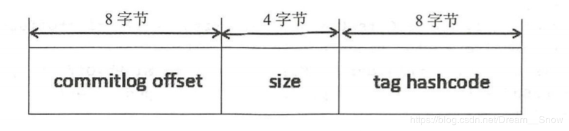
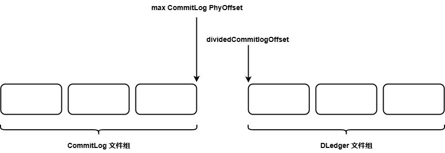
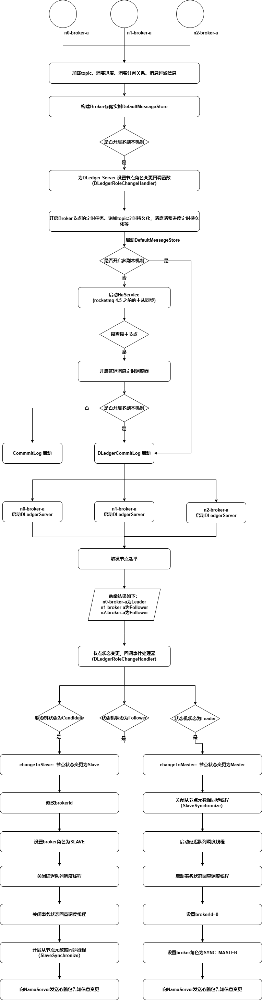

# RocketMQ整合DLedger实现主从高可用

前面花了大量篇幅介绍RocketMQ DLedger的实现原理，即Raft协议的Leader选举与日志复制两个部分，这是实现主从切换的基础，本文开始探讨 RocketMQ 如何通过 DLedger 实现主从切换。

要实现集群内的主从切换，至少需要解决如下两个问题。

1. 数据存储如何兼容？
2. 主从节点元数据如何同步？

## 一. 数据存储兼容设计

RocketMQ的消息存储文件主要包括CommitLog文件、ConsumeQueue 文件与Index文件。其中CommitLog文件存储全量消息，ConsumeQueue 和Index文件都是基于CommitLog文件构建的。如果要引入DLedger实现消息在集群中的一致性，只需要保证CommitLog文件的一致性。

RocketMQ的日志存储文件、DLedger的日志文件都是基于文件编程的，使用内存映射提高其读写性能。基于文件编程通常有一个共同点，就是日志存储通常会设计一套存储协议，例如RocketMQ的CommitLog文件中每一个条目都包含魔数、消息长度、消息属性、消息体等，我们回顾一下DLedger日志的存储格式，如下图所示：


大家肯定和我一样，看到DLedger的日志存储协议马上会蹦出一个想法：只需要将CommitLog文件每个条目的内容放入DLedger日志条目 的body字段，就能实现CommitLog文件在一个集群内的数据一致性。通过 CommitLog 文件转发生成 ConsumeQueue 文件，我们再来看一下RocketMQ ConsumeQueue文件的存储协议。



CommitLog文件转发形成ConsumeQueue文件时有一个非常重要的字段，即物理偏移量，在消息消费时可以根据物理偏移量直接从CommitLog文件中读取指定长度的消息，但如果引入了DLedger，我们 会发现CommitLog文件中存在一些与“业务无关”的数据，即DLedger 相关的头信息，如果将DLedger条目的起始物理偏移量作为CommitLog 文件的物理偏移量存储在ConsumeQueue条目中，显然是不合适的，因 为ConsumeQueue相关的处理逻辑是无法感知DLedger存在的。为了解决这个问题，每写入一条DLedger消息，返回给RocketMQ的物理偏移量不应该是DLedger条目的起始位置，而应该是返回DLedger条目中body字段的起始位置，这样才能与未引入DLedger的语义保持一致，实现无缝兼容。

## 二. 数据存储兼容实现原理

上一节我们阐述了在存储方面DLedger如何整合RocketMQ存储文件并实现无缝兼容，本节从源码的角度分析其实现原理。

### 2.1 从Broker启动流程探究数据存储兼容设计

Broker启动流程涉及DLedger的关键点如下图：


DefaultMessageStore构造函数：

```java
		// org.apache.rocketmq.store.DefaultMessageStore#DefaultMessageStore
        if (messageStoreConfig.isEnableDLegerCommitLog()) {
            // 开启了DLedger模式，该模式为Raft写一下的强一致性主从结构
            this.commitLog = new DLedgerCommitLog(this);
        } else {
            this.commitLog = new CommitLog(this);
        }
```

在broker.conf配置文件中启用主从切换时会创建DLedgerCommitLog对象，用于重写CommitLog文件管理相关的逻辑，即改变日志写入逻辑，引入DLedger日志存储格式。

增加节点状态变更事件监听器：

```java
// org.apache.rocketmq.broker.BrokerController#initialize

if (messageStoreConfig.isEnableDLegerCommitLog()) {
    DLedgerRoleChangeHandler roleChangeHandler = new DLedgerRoleChangeHandler(this, (DefaultMessageStore) messageStore);
    ((DLedgerCommitLog)((DefaultMessageStore) messageStore).getCommitLog()).getdLedgerServer().getdLedgerLeaderElector().addRoleChangeHandler(roleChangeHandler);
}
```

调用LedgerLeaderElector的addRoleChanneHandler()方法为每个节点新增角色变更事件监听器，当发生主从切换时触发事件监听器， 例如发生主从切换后需要触发元数据的同步。

DefaultMessageStore的load()方法如下所示：

```java
            // load Commit Log
            // 加载CommitLog文件，加载 ${ROCKET_HOME}/store/commitlog 目录下所有文件并按照文件名进行
            // 排序。如果文件与配置文件的单个文件大小不一致，将忽略该目录下的所有文件，然后创建MappedFile对象。注意load()方法将
            //wrotePosition、flushedPosition、committedPosition三个指针都设置为文件大小。
            result = result && this.commitLog.load();

            // load Consume Queue
            // 加载 ConsumeQueue
            result = result && this.loadConsumeQueue();

            if (result) {
                // 加载并存储checkpoint文件，主要用于记录CommitLog文件、ConsumeQueue文件、Inde文件的刷盘点
                this.storeCheckpoint =
                    new StoreCheckpoint(StorePathConfigHelper.getStoreCheckpoint(this.messageStoreConfig.getStorePathRootDir()));

                // 加载Index文件，如果上次异常退出，而且Index文件刷盘时间小于该文件最大的消息时间戳，则该文件将立即销毁
                this.indexService.load(lastExitOK);

                // 根据Broker是否为正常停止，执行不同的恢复策略
                this.recover(lastExitOK);

                log.info("load over, and the max phy offset = {}", this.getMaxPhyOffset());
            }
```

加载数据文件，如果开启了主从切换，则CommitLog的实现类为DLedgerCommitLog，由其负责CommitLog文件的加载，该实例会引入Raft协议，实现集群数据的一致性。

经过上面的层层铺垫，用来实现数据存储的主角DLedgerCommitLog出场了。

### 2.2 DLedgerCommitLog详解

DLedgerCommitlog继承自CommitLog类，主要实现基于DLedger的日志存储，下面逐一介绍上述核心类及核心属性：

1. dLedgerServer：基于Raft协议实现的集群内的一个节点，用DLedgerServer实例表示。
2. dLedgerConfig：DLedger的配置信息。
3. dLedgerFileStore：DLedger基于文件映射的存储实现。
4. dLedgerFileList：DLedger管理的存储文件集合，对标RocketMQ中的MappedFileQueue。
5. id：节点ID，0表示主节点，非0表示从节点。
6. messageSerializer：消息序列器。
7. beginTimeInDledgerLock：用于记录消息追加的耗时（日志追加所持有锁时间）。
8. dividedCommitlogOffset：记录旧的CommitLog文件中的最大偏移量，如果访问的偏移量大于它，则访问Dledger管理的文件。
9. isInrecoveringOldCommitlog：是否正在恢复旧的CommitLog文件。

 DLedgerCommitLog构造函数如下所示：

```java
	// org.apache.rocketmq.store.dledger.DLedgerCommitLog#DLedgerCommitLog
	public DLedgerCommitLog(final DefaultMessageStore defaultMessageStore) {
        // 调用父类，即CommitLog的构造函数，加载${ROCKETMQ_HOME}/store/ comitlog下的CommitLog文件，即开启主从切换后需要兼容之前的消息
        super(defaultMessageStore);
        // 构建DLedgerConfig相关配置属性
        dLedgerConfig = new DLedgerConfig();
        // 是否强制删除文件，取自Broker配置属性cleanFileForcibly Enable，默认为true
        dLedgerConfig.setEnableDiskForceClean(defaultMessageStore.getMessageStoreConfig().isCleanFileForciblyEnable());
        // DLedger存储类型，固定为基于文件的存储模式
        dLedgerConfig.setStoreType(DLedgerConfig.FILE);
        // 节点的ID名称，示例配置为n0，配置要求是第二个字符后必须是数字
        dLedgerConfig.setSelfId(defaultMessageStore.getMessageStoreConfig().getdLegerSelfId());
        // DLegergroup的名称，即一个复制组的组名称， 建议与Broker配置属性brokerName保持一致
        dLedgerConfig.setGroup(defaultMessageStore.getMessageStoreConfig().getdLegerGroup());
        // DLegergroup中所有的节点信息，其配置显示为n0-127.0.0.1:40911; n1-127.0.0.1:40912; n2-127.0.0.1:40913。多个节点使用分号隔开
        dLedgerConfig.setPeers(defaultMessageStore.getMessageStoreConfig().getdLegerPeers());
        // 设置DLedger日志文件的根目录，取自Borker 配件文件中的storePath RootDir，即RocketMQ的数据存储根路径
        dLedgerConfig.setStoreBaseDir(defaultMessageStore.getMessageStoreConfig().getStorePathRootDir());
        // 设置DLedger单个日志文件的大小，取自Broker配置文件中的mapedFileSizeCommitLog
        dLedgerConfig.setMappedFileSizeForEntryData(defaultMessageStore.getMessageStoreConfig().getMappedFileSizeCommitLog());
        // DLedger日志文件的过期删除时间，取自Broker 配置文件中的deleteWhen，默认为凌晨4点
        dLedgerConfig.setDeleteWhen(defaultMessageStore.getMessageStoreConfig().getDeleteWhen());
        // DLedger日志文件保留时长，取自Broker 配置文件中的fileReserved Hours，默认为72h。
        dLedgerConfig.setFileReservedHours(defaultMessageStore.getMessageStoreConfig().getFileReservedTime() + 1);
        id = Integer.valueOf(dLedgerConfig.getSelfId().substring(1)) + 1;
        // 使用DLedger相关的配置创建DLedgerServer，即每一个Broker节点为Raft集群中的一个节点，同一个复制组会使用Raft协议进行日志复制
        dLedgerServer = new DLedgerServer(dLedgerConfig);

        dLedgerFileStore = (DLedgerMmapFileStore) dLedgerServer.getdLedgerStore();
        // 添加消息Append事件的处理钩子，主要是完成CommitLog 文件的物理偏移量在启用主从切换后与未开启主从切换的语义保持一致性，
        // 即如果启用了主从切换机制，消息追加时返回的物理偏移量并不是DLedger日志条目的起始位置，而是其body字段的开始位置。
        DLedgerMmapFileStore.AppendHook appendHook = (entry, buffer, bodyOffset) -> {
            assert bodyOffset == DLedgerEntry.BODY_OFFSET;
            buffer.position(buffer.position() + bodyOffset + MessageDecoder.PHY_POS_POSITION);
            buffer.putLong(entry.getPos() + bodyOffset);
        };
        dLedgerFileStore.addAppendHook(appendHook);
        dLedgerFileList = dLedgerFileStore.getDataFileList();
        this.messageSerializer = new MessageSerializer(defaultMessageStore.getMessageStoreConfig().getMaxMessageSize());

    }
```

第一步：调用父类，即CommitLog的构造函数，加载${ROCKETMQ_HOME}/store/ comitlog下的CommitLog文件，即开启主从切换后需要兼容之前的消息。

第二步：构建DLedgerConfig相关配置属性，如代码清单9-93所示，其主要属性如下。

1. enableDiskForceClean：是否强制删除文件，取自Broker配置属性cleanFileForcibly Enable，默认为true。
2. storeType：DLedger存储类型，固定为基于文件的存储模式。
3. dLegerSelfId：节点的ID名称，示例配置为n0，配置要求是第二个字符后必须是数字。
4. dLegerGroup：DLegergroup的名称，即一个复制组的组名称， 建议与Broker配置属性brokerName保持一致。
5. dLegerPeers：DLegergroup中所有的节点信息，其配置显示为n0-127.0.0.1:40911; n1-127.0.0.1:40912; n2-127.0.0.1:40913。多个节点使用分号隔开。
6. storeBaseDir：设置DLedger日志文件的根目录，取自Borker 配件文件中的storePath RootDir，即RocketMQ的数据存储根路径。
7. mappedFileSizeForEntryData：设置DLedger单个日志文件的大小，取自Broker配置文件中的mapedFileSizeCommitLog。
8. deleteWhen：DLedger日志文件的过期删除时间，取自Broker 配置文件中的deleteWhen，默认为凌晨4点。
9. fileReservedHours：DLedger日志文件保留时长，取自Broker 配置文件中的fileReserved Hours，默认为72h。

第三步：使用DLedger相关的配置创建DLedgerServer，即每一个Broker节点为Raft集群中的一个节点，同一个复制组会使用Raft协议进行日志复制。

第四步：添加消息Append事件的处理钩子，主要是完成CommitLog 文件的物理偏移量在启用主从切换后与未开启主从切换的语义保持一 致性，即如果启用了主从切换机制，消息追加时返回的物理偏移量并 不是DLedger日志条目的起始位置，而是其body字段的开始位置。

在Broker启动时，会调用 `DLedgerCommitLog#load`：

```java
	// org.apache.rocketmq.store.dledger.DLedgerCommitLog#load
    @Override
    public boolean load() {
        // DLedgerCommitLog在加载时先调用其父类CommitLog文件的load() 方法，即启用主从切换后依然会加载原CommitLog中的文件
        return super.load();
    }
```

DLedgerCommitLog在加载时先调用其父类 CommitLog 文件的 load() 方法，即启用主从切换后依然会加载原 CommitLog 中的文件。

在Broker启动时会加载CommitLog、ConsumeQueue等文件，需要恢复其相关的数据结构，特别是写入、刷盘、提交等指针，具体调用recover()方法实现

`DLedgerCommitLog#recover` 代码如下：

```java
	// org.apache.rocketmq.store.dledger.DLedgerCommitLog#recover

	private void recover(long maxPhyOffsetOfConsumeQueue) {
        // 第一步：加载DLedger相关的存储文件，并逐一构建对应的MmapFile。初始化三个重要的指针wrotePosition、 flushedPosition、committedPosition表示文件的大小
        dLedgerFileStore.load();
        if (dLedgerFileList.getMappedFiles().size() > 0) {
            // 第二步：如果已存在DLedger的数据文件，则只需要恢复DLedger 相关的数据文件，因为在加载旧的CommitLog文件时已经将重要的数据指针设置为最大值

            // 调用DLedger文件存储实现类DLedgerFileStore的recover()方法，恢复管辖的MMapFile对象（一个文件对应一个MMapFile实例）的相关指针，
            // 其实现方法与RocketMQ的DefaultMessageStore恢复过程类似。
            dLedgerFileStore.recover();

            // 设置dividedCommitlogOffset的值为DLedger中物理文件的最小偏移量。消息的物理偏移量如果小于该值，则从CommitLog文件中查找消息，
            // 消息的物理偏移量如果大于或等于该值，则从DLedger相关的文件中查找消息
            dividedCommitlogOffset = dLedgerFileList.getFirstMappedFile().getFileFromOffset();

            // 如果存在旧的CommitLog文件，则禁止删除DLedger文件，具体做法就是禁止强制删除文件，并将文件的有效存储时间设置为10年。
            MappedFile mappedFile = this.mappedFileQueue.getLastMappedFile();
            if (mappedFile != null) {
                disableDeleteDledger();
            }

            // 如果ConsumeQueue中存储的最大物理偏移量大于DLedger中最大的物理偏移量，则删除多余的ConsumeQueue文件
            long maxPhyOffset = dLedgerFileList.getMaxWrotePosition();
            // Clear ConsumeQueue redundant data
            if (maxPhyOffsetOfConsumeQueue >= maxPhyOffset) {
                log.warn("[TruncateCQ]maxPhyOffsetOfConsumeQueue({}) >= processOffset({}), truncate dirty logic files", maxPhyOffsetOfConsumeQueue, maxPhyOffset);
                this.defaultMessageStore.truncateDirtyLogicFiles(maxPhyOffset);
            }
            // 如果已存在DLedger的数据文件，只需要恢复DLedger 相关的数据文件，直接返回
            return;
        }
        // 第三步：从这里开始，只针对开启主从切换并且是初次启动（并没有生成DLedger相关的数据文件）的相关流程，
        // 调用CommitLog 的recoverNormally文件恢复旧的CommitLog文件
        //Indicate that, it is the first time to load mixed commitlog, need to recover the old commitlog
        isInrecoveringOldCommitlog = true;
        //No need the abnormal recover
        super.recoverNormally(maxPhyOffsetOfConsumeQueue);
        isInrecoveringOldCommitlog = false;
        // 获取最后一个CommitLog文件
        MappedFile mappedFile = this.mappedFileQueue.getLastMappedFile();
        if (mappedFile == null) {
            // 如果不存在旧的CommitLog文件，直接结束日志文件的恢复流程
            return;
        }
        // 从最后一个文件的最后写入点（原CommitLog文件的待写入位 点），尝试查找写入的魔数，
        // 如果存在魔数并等于CommitLog.BLANK_MAGIC_CODE，则无须写入魔数，在升级DLedger第一次启动时，魔数为空，故需要写入魔数
        ByteBuffer byteBuffer = mappedFile.sliceByteBuffer();
        byteBuffer.position(mappedFile.getWrotePosition());
        boolean needWriteMagicCode = true;
        // 1 TOTAL SIZE
        byteBuffer.getInt(); //size
        int magicCode = byteBuffer.getInt();
        if (magicCode == CommitLog.BLANK_MAGIC_CODE) {
            needWriteMagicCode = false;
        } else {
            log.info("Recover old commitlog found a illegal magic code={}", magicCode);
        }
        dLedgerConfig.setEnableDiskForceClean(false);
        // 初始化dividedCommitlogOffset，等于最后一个文件的起始偏移量加上文件的大小，即该指针指向最后一个文件的结束位置。
        dividedCommitlogOffset = mappedFile.getFileFromOffset() + mappedFile.getFileSize();
        log.info("Recover old commitlog needWriteMagicCode={} pos={} file={} dividedCommitlogOffset={}", needWriteMagicCode, mappedFile.getFileFromOffset() + mappedFile.getWrotePosition(), mappedFile.getFileName(), dividedCommitlogOffset);
        if (needWriteMagicCode) {
            // 将最后一个未写满数据的CommitLog文件全部写满，其方法为设置消息体的大小与魔数。
            byteBuffer.position(mappedFile.getWrotePosition());
            byteBuffer.putInt(mappedFile.getFileSize() - mappedFile.getWrotePosition());
            byteBuffer.putInt(BLANK_MAGIC_CODE);
            mappedFile.flush(0);
        }
        // 设置最后一个文件的wrotePosition、flushedPosition、committedPosition为文件的大小，
        // 同样意味着最后一个文件已经写满，下一条消息将写入DLedger。
        mappedFile.setWrotePosition(mappedFile.getFileSize());
        mappedFile.setCommittedPosition(mappedFile.getFileSize());
        mappedFile.setFlushedPosition(mappedFile.getFileSize());
        dLedgerFileList.getLastMappedFile(dividedCommitlogOffset);
        log.info("Will set the initial commitlog offset={} for dledger", dividedCommitlogOffset);
    }
```

第一步：加载DLedger相关的存储文件，并逐一构建对应的MmapFile。初始化三个重要的指针wrotePosition、 flushedPosition、committedPosition表示文件的大小。

第二步：如果已存在DLedger的数据文件，则只需要恢复DLedger 相关的数据文件，因为在加载旧的CommitLog文件时已经将重要的数据指针设置为最大值。恢复完DLedger相关日志后接手该方法，关键实现点如下。

1. 调用DLedger文件存储实现类DLedgerFileStore的recover()方法，恢复管辖的MMapFile对象（一个文件对应一个MMapFile实例）的 相关指针，其实现方法与RocketMQ的DefaultMessageStore恢复过程类似。

2. 设置dividedCommitlogOffset的值为DLedger中物理文件的最 小偏移量。消息的物理偏移量如果小于该值，则从CommitLog文件中查找消息，消息的物理偏移量如果大于或等于该值，则从DLedger相关的文件中查找消息。

3. 如果存在旧的CommitLog文件，则禁止删除DLedger文件，具体做法就是禁止强制删除文件，并将文件的有效存储时间设置为10年。

4. 如果ConsumeQueue中存储的最大物理偏移量大于DLedger中最大的物理偏移量，则删除多余的ConsumeQueue文件。

第三步：从该步骤开始，只针对开启主从切换并且是初次启动
（并没有生成DLedger相关的数据文件）的相关流程，调用CommitLog 的 recoverNormally 文件恢复旧的CommitLog文件。

第四步：如果不存在旧的CommitLog文件，直接结束日志文件的恢复流程。

第五步：如果存在旧的CommitLog文件，需要将文件剩余部分全部填充数据，即不再接受新的数据写入，使新的数据全部写入DLedger的数据文件，关键实现点如下。

1. 尝试查找最后一个CommitLog文件，如果未找到则结束查找。

2. 从最后一个文件的最后写入点（原CommitLog文件的待写入位 点），尝试查找写入的魔数，如果存在魔数并等于CommitLog.BLANK_MAGIC_CODE，则无须写入魔数，在升级DLedger第一次启动时，魔数为空，故需要写入魔数。

3. 初始化dividedCommitlogOffset，等于最后一个文件的起始偏移量加上文件的大小，即该指针指向最后一个文件的结束位置。

4. 将最后一个未写满数据的CommitLog文件全部写满，其方法为设置消息体的大小与魔数。

5. 设置最后一个文件的wrotePosition、flushedPosition、committedPosition为文件的大小，同样意味着最后一个文件已经写满，下一条消息将写入DLedger。

设置最后一个文件的wrotePosition、flushedPosition、committedPosition为文件的大小，同样意味着最后一个文件已经写满，下一条消息将写入DLedger。

因为在这种情况下，如果DLedger中的物理文件被删除，则物理偏移量会断层：



正常情况下，maxCommitlogPhyOffset 与 dividedCommitlogOffset 是连续的，非常方便访问CommitLog和DLedger，但DLedger部分文件删除后，这两个值就不连续了，会造成中间文件空洞，无法连续访问。

> 注意：从RocketMQ DLedger的设计理念来看，升级到RocketMQ主从切换可以兼容原先的CommitLog文件，运行一段时间后，尽量将原先的 CommitLog文件彻底删除，否则新创建的文件无法删除，有可能引发磁盘空间竞争。

### 2.3 从消息追加探究数据存储兼容设计

消息追加的实现由DLedgerCommitLog的putMessage()方法实现：

```java
			// org.apache.rocketmq.store.dledger.DLedgerCommitLog#putMessage

            // DLedger模式下不在写入RocketMQ自带的CommitLog，而是调用DLedgerServer的handleAppend进行消息追加，然后将消息实时转发到从节点，
            // 只有超过集群内的半数节点成功写入消息后才会返回写入成 功。如果追加成功，将返回本次追加成功后的起始偏移量，即pos属性，类似RocketMQ中CommitLog文件的物理偏移量。
            dledgerFuture = (AppendFuture<AppendEntryResponse>) dLedgerServer.handleAppend(request);
            if (dledgerFuture.getPos() == -1) {
                return new PutMessageResult(PutMessageStatus.OS_PAGECACHE_BUSY, new AppendMessageResult(AppendMessageStatus.UNKNOWN_ERROR));
            }
            // 根据DLedger的起始偏移量计算真正的消息物理偏移量。DLedger自身有存储协议，body字段存储真实的消息，即CommitLog条目的存储结构，
            // 返回给客户端的消息偏移量为body字段的开始偏移量，即通过putMessage返回的物理偏移量与不使用Dledger方式返回的物理偏移量含义是一样的。
            // 从偏移量开始，可以正确读取消息，这样DLedger就完美地兼容了RocketMQ CommitLog
            long wroteOffset = dledgerFuture.getPos() + DLedgerEntry.BODY_OFFSET;
```

关键点1：消息追加时不再写入原先的CommitLog文件，而是调用DLedgerServer的handleAppend进行消息追加，然后将消息实时转发到从节点，只有超过集群内的半数节点成功写入消息后才会返回写入成 功。如果追加成功，将返回本次追加成功后的起始偏移量，即pos属性，类似RocketMQ中CommitLog文件的物理偏移量。

关键点2：根据DLedger的起始偏移量计算真正的消息物理偏移量。DLedger自身有存储协议，body字段存储真实的消息，即CommitLog条目的存储结构，返回给客户端的消息偏移量为body字段的开始偏移量，即通过 putMessage 返回的物理偏移量与不使用 Dledger 方式返回的物理偏移量含义是一样的。从偏移量开始，可以正确读取消息，这样DLedger就完美地兼容了RocketMQ CommitLog。


### 2.4 从消息读取探究数据存储兼容设计

消息查找比较简单，因为返回给客户端消息、转发给 consumequeue 的消息物理偏移量并不是DLedger条目的起始偏移量，而是DLedger条目中 body字段的起始偏移量，即真正存储真实消息的起始偏移量，所以实现消息的查找比较简单。

```java
	// org.apache.rocketmq.store.dledger.DLedgerCommitLog#getMessage
    @Override
    public SelectMappedBufferResult getMessage(final long offset, final int size) {
        if (offset < dividedCommitlogOffset) {
            // 如果查找的消息小于 dividedCommitlogOffset，则从原先的CommitLog文件中查找
            return super.getMessage(offset, size);
        }
        int mappedFileSize = this.dLedgerServer.getdLedgerConfig().getMappedFileSizeForEntryData();
        MmapFile mappedFile = this.dLedgerFileList.findMappedFileByOffset(offset, offset == 0);
        if (mappedFile != null) {
            int pos = (int) (offset % mappedFileSize);
            return convertSbr(mappedFile.selectMappedBuffer(pos, size));
        }
        return null;
    }
```

实现关键点如下：

1. 如果查找的物理偏移量小于dividedCommitlogOffset，则从原先的CommitLog文件中查找。
2. 如果查找的物理偏移量大于dividedCommitlogOffset，则从DLedger自身维护的日志文件中查找。根据物理偏移量查找具体文件使用的方式是二分查找，这里主要突出dividedCommitlogOffset的作用。

### 2.5 数据存储兼容小结

数据存储兼容的设计思想基本可以归纳为如下4点：

1. DLedger在整合时使用DLedger条目包裹RocketMQ中的CommitLog条目，即DLedger条目的body字段来于存储整个CommitLog条目。
2. 引入dividedCommitlogOffset变量，物理偏移量小于该值的消息存储在旧的CommitLog文件中，实现升级DLedger集群后能依然能访问旧的数据，实现broker单节点向多副本结构的无损迁移。
3. 新DLedger集群启动后，会将最后一个CommitLog文件填充，即新的数据不会再写入原先的CommitLog文件。
4. 消息追加到DLedger数据日志文件中，返回的偏移量不是DLedger条目的起始偏移量，而是DLedger条目中body字段的起始偏移量，即真实消息的起始偏移量，保证消息物理偏移量的语义与RocketMQ CommitLog一致。

## 三. 主从切换元数据同步机制

RocketMQ主从同步中，从节点不仅会从主节点同步消息数据，也会同步topic路由信息、消费进度、延迟队列处理进度、消费组订阅信息等元数据。那么主从切换后，如何同步元数据呢？数据同步可以通过 Raft 协议保证 CommitLog 文件的一致性，那么是如果保证元数据同步的呢？

### 3.1 BrokerController中与主从相关的方法详解

startProcessorByHa()方法：该方法的作用是开启事务状态，回查处理器，即当节点切换为主节点时，需要开启对应的事务状态回查处理器，对PREPARE状态的消息发起事务状态回查请求。

```java
	// org.apache.rocketmq.broker.BrokerController#startProcessorByHa

	private void startProcessorByHa(BrokerRole role) {
        if (BrokerRole.SLAVE != role) {
            // 该方法的作用是开启事务状态回查处理器，即当节点切换为主节点时，需要开启对应的事务状态回查处理器，对PREPARE状态的消息发起事务状态回查请求。
            if (this.transactionalMessageCheckService != null) {
                this.transactionalMessageCheckService.start();
            }
        }
    }
```

shutdownProcessorByHa()方法：关闭事务状态回查处理器，从主节点切换为从节点后，该方法会被调用。

```java
	// org.apache.rocketmq.broker.BrokerController#shutdownProcessorByHa
	private void shutdownProcessorByHa() {
        if (this.transactionalMessageCheckService != null) {
            this.transactionalMessageCheckService.shutdown(true);
        }
    }
```

handleSlaveSynchronize()方法：

```java
	// org.apache.rocketmq.broker.BrokerController#handleSlaveSynchronize
    private void handleSlaveSynchronize(BrokerRole role) {
        if (role == BrokerRole.SLAVE) {
            // 当节点是从节点时，开启定时任务从主节点同步元数据，即从节点向主节点主动同步topic的路由信息、消费进度、延迟队列处理队列、消费组订阅配置等信息
            if (null != slaveSyncFuture) {
                // 如果当前节点的角色为从节点，且上次同步的future不为空， 则先取消
                slaveSyncFuture.cancel(false);
            }
            // 设置slaveSynchronize的主节点地址为空。不知大家 是否有疑问，既然节点为从节点，那为什么将主节点地址设置为空呢？
            // 如何同步元数据，这个值会在什么时候设置呢？其实大家大可不必担心，Broker向NameServere发送心跳包的响应结果中，
            // 包含当前该复制组的Leader节点，即主节点的地址信息。开启定时同步任务后，每10s从主节点同步一次元数据。
            this.slaveSynchronize.setMasterAddr(null);

            slaveSyncFuture = this.scheduledExecutorService.scheduleAtFixedRate(new Runnable() {
                @Override
                public void run() {
                    try {
                        // 同步元数据
                        BrokerController.this.slaveSynchronize.syncAll();
                    }
                    catch (Throwable e) {
                        log.error("ScheduledTask SlaveSynchronize syncAll error.", e);
                    }
                }
            }, 1000 * 3, 1000 * 10, TimeUnit.MILLISECONDS);
        } else {
            //handle the slave synchronise
            if (null != slaveSyncFuture) {
                slaveSyncFuture.cancel(false);
            }
            // 如果当前节点的角色为主节点，则取消定时同步任务并设置主节点的地址为空。
            this.slaveSynchronize.setMasterAddr(null);
        }
    }

```

当节点是从节点时，开启定时任务从主节点同步元数据处理从节点的元数据，即从节点向主节点主动同步topic的路由信息、消费进度、延迟队列处理队列、消费组订阅配置等信息。

1. 如果当前节点的角色为从节点，且上次同步的future不为空，则先取消，然后设置slaveSynchronize的主节点地址为空。不知大家是否有疑问，既然节点为从节点，那为什么将主节点地址设置为空呢？如何同步元数据，这个值会在什么时候设置呢？其实大家大可不必担心，Broker向NameServere发送心跳包的响应结果中，包含当前该复制组的Leader节点，即主节点的地址信息。开启定时同步任务后，每10s从主节点同步一次元数据。
2. 如果当前节点的角色为主节点，则取消定时同步任务并设置主节点的地址为空。

基于Raft协议的一轮Leader选举完成后，当节点的状态变更为FOLLOWER时，在事件回调函数中会调用该方法，将当前节点的角色变更为从节点，代码如下所示：

```java
	// org.apache.rocketmq.broker.BrokerController#changeToSlave
    public void changeToSlave(int brokerId) {
        log.info("Begin to change to slave brokerName={} brokerId={}", brokerConfig.getBrokerName(), brokerId);

        // 如果之前brokerId=0 也就是Master节点，则将brokerId改成1
        brokerConfig.setBrokerId(brokerId == 0 ? 1 : brokerId); //TO DO check
        // 将节点角色改为SLAVE
        messageStoreConfig.setBrokerRole(BrokerRole.SLAVE);

        //handle the scheduled service
        try {
            // 如果是从节点，则关闭定时消息扫描线程；如果是主节点，则打开该扫描器
            this.messageStore.handleScheduleMessageService(BrokerRole.SLAVE);
        } catch (Throwable t) {
            log.error("[MONITOR] handleScheduleMessageService failed when changing to slave", t);
        }

        try {
            // 关闭事务状态会查处理器
            this.shutdownProcessorByHa();
        } catch (Throwable t) {
            log.error("[MONITOR] shutdownProcessorByHa failed when changing to slave", t);
        }

        // 从节点需要启动元数据同步处理器，用于从节点向主节点主动同步topic的路由信息、消费进度、延迟队列处理队列、消费组订阅配置等信息
        handleSlaveSynchronize(BrokerRole.SLAVE);

        try {
            // 立即向集群内所有NameServer告知Broker信息状态的变更。
            this.registerBrokerAll(true, true, brokerConfig.isForceRegister());
        } catch (Throwable ignored) {
            // 此处忽略异常，因为此次心跳发送即使失败也没有问题，Broker会每隔30s发送发送心跳，所以NameServer是最终一致的。
        }
        log.info("Finish to change to slave brokerName={} brokerId={}", brokerConfig.getBrokerName(), brokerId);
    }
```

Broker角色切换到从节点需要执行的核心逻辑如下：

1. 设置brokerId，如果Broker的ID为0，则brokerId设置为1。使用的时候，注意规划好集群内节点的brokerId。
2. 设置Broker的状态为BrokerRole.SLAVE。
3. 如果当前节点是从节点，则关闭定时调度线程（处理RocketMQ延迟队列）。如果当前节点是主节点，则启动该线程。
4. 关闭事务状态回查处理器。
5. 从节点需要启动元数据同步处理器，即启动SlaveSynchronize，定时从主服务器同步元数据。
6. 立即向集群内所有的NameServer告知Broker信息状态的变更。需要注意，此处的异常被忽略，因为此次心跳发送即使失败也没有问题，Broker会每隔30s发送发送心跳，所以NameServer是最终一致的。

基于Raft协议的一轮Leader选举完成后，当节点的状态变更为LEADER，在其事件回调函数中会调用changeToMaster()方法，将当前节点的角色变更为主节点，代码如下：

```java
	// org.apache.rocketmq.broker.BrokerController#changeToMaster
    public void changeToMaster(BrokerRole role) {
        if (role == BrokerRole.SLAVE) {
            return;
        }
        log.info("Begin to change to master brokerName={}", brokerConfig.getBrokerName());

        // 关闭元数据同步器
        handleSlaveSynchronize(role);

        try {
            // 打开定时消息扫描线程
            this.messageStore.handleScheduleMessageService(role);
        } catch (Throwable t) {
            log.error("[MONITOR] handleScheduleMessageService failed when changing to master", t);
        }

        try {
            // 开启事务状态回查处理器
            this.startProcessorByHa(BrokerRole.SYNC_MASTER);
        } catch (Throwable t) {
            log.error("[MONITOR] startProcessorByHa failed when changing to master", t);
        }

        // 设置brokerId=0，代表当前节点为Master
        brokerConfig.setBrokerId(0); //TO DO check
        messageStoreConfig.setBrokerRole(role);

        try {
            // 立即向集群内所有NameServer告知Broker信息状态的变更。
            this.registerBrokerAll(true, true, brokerConfig.isForceRegister());
        } catch (Throwable ignored) {
            // 此处忽略异常，因为此次心跳发送即使失败也没有问题，Broker会每隔30s发送发送心跳，所以NameServer是最终一致的。
        }
        log.info("Finish to change to master brokerName={}", brokerConfig.getBrokerName());
    }
```

Broker角色切换到主节点需要执行的核心逻辑如下：

1. 关闭元数据同步器，这是因为主节点无须同步。
2. 开启定时任务处理线程。
3. 开启事务状态回查处理线程。
4. 设置brokerId为0。
5. 立即向NameServer发送心跳包，以便告知Broker服务器当前最新的状态。

###  3.2 如何触发主从切换

RocketMQ DLedger是基于Raft协议实现的，在该协议中实现了主节点的选举以及主节点失效后，集群自动重新选举，经过协商投票产生新的主节点，从而实现高可用，代码如下所示：

```java
	// org.apache.rocketmq.broker.BrokerController#initialize

   if (messageStoreConfig.isEnableDLegerCommitLog()) {
       DLedgerRoleChangeHandler roleChangeHandler = new DLedgerRoleChangeHandler(this, (DefaultMessageStore) messageStore);
       ((DLedgerCommitLog)((DefaultMessageStore) messageStore).getCommitLog()).getdLedgerServer().getdLedgerLeaderElector().addRoleChangeHandler(roleChangeHandler);
   }
```

上述代码片段截取自BrokerController的initialize()方法，在Broker启动时，如果开启了主从切换机制，即 enableDLedgerCommitLog参数设置为true，会为Raft协议的集群节点 选主器添加roleChangeHandler事件处理器，即节点发生变更后的事件处理器。

DLedgerRoleChangeHandler继承自RoleChangeHandler，即节点状态发生变更后的事件处理器。它的属性比较简单明了，这里重点介绍一下 `ExecutorService executorService` 事件处理线程池，它只会开启一个线程，事件将一个一个按顺序执行。

通过Raft协议进行Leader选举后，节点状态变更就会调用DLedgerRoleChangeHandler的handler()方法：

```java
	// org.apache.rocketmq.broker.dledger.DLedgerRoleChangeHandler#handle
    @Override public void handle(long term, MemberState.Role role) {
        Runnable runnable = new Runnable() {
            @Override public void run() {
                long start = System.currentTimeMillis();
                try {
                    boolean succ = true;
                    log.info("Begin handling broker role change term={} role={} currStoreRole={}", term, role, messageStore.getMessageStoreConfig().getBrokerRole());
                    switch (role) {
                        case CANDIDATE:
                            // 变成 CANDIDATE 状态，表示正处于Leader选举阶段
                            if (messageStore.getMessageStoreConfig().getBrokerRole() != BrokerRole.SLAVE) {
                                // 如果之前是主节点，则切换为从节点模式
                                brokerController.changeToSlave(dLedgerCommitLog.getId());
                            }
                            break;
                        case FOLLOWER:
                            // 变成Follower，表示Leader选举已完成
                            brokerController.changeToSlave(dLedgerCommitLog.getId());
                            break;
                        case LEADER:
                            // 自己晋升为Leader节点，在切换到主节点之前，需要等待当前节点追加的数据都被提交后，才可以将状态变为Master
                            while (true) {
                                if (!dLegerServer.getMemberState().isLeader()) {
                                    succ = false;
                                    break;
                                }
                                if (dLegerServer.getdLedgerStore().getLedgerEndIndex() == -1) {
                                    // 表示当前节点还没有数据转发，直接跳出循环
                                    break;
                                }
                                if (dLegerServer.getdLedgerStore().getLedgerEndIndex() == dLegerServer.getdLedgerStore().getCommittedIndex()
                                    && messageStore.dispatchBehindBytes() == 0) {
                                    // 如果ledgerEndIndex不为-1，则必须等待数据全部提交，即ledgerEndIndex与committedIndex必须相等，
                                    // 并且需要等待CommitLog日志全部转发到ConsumeQueue文件中，即ReputMessageService中的reputFromOffset与CommitLog的maxOffset相等
                                    break;
                                }
                                Thread.sleep(100);
                            }
                            if (succ) {
                                messageStore.recoverTopicQueueTable();
                                brokerController.changeToMaster(BrokerRole.SYNC_MASTER);
                            }
                            break;
                        default:
                            break;
                    }
                    log.info("Finish handling broker role change succ={} term={} role={} currStoreRole={} cost={}", succ, term, role, messageStore.getMessageStoreConfig().getBrokerRole(), DLedgerUtils.elapsed(start));
                } catch (Throwable t) {
                    log.info("[MONITOR]Failed handling broker role change term={} role={} currStoreRole={} cost={}", term, role, messageStore.getMessageStoreConfig().getBrokerRole(), DLedgerUtils.elapsed(start), t);
                }
            }
        };
        executorService.submit(runnable);
    }
```

第一步：如果当前节点状态机状态变更为CANDIDATE，表示正处于Leader选举阶段，如果当前节点的初始角色不是从节点，需要将状态 切换为SLAVE。

第二步：如果当前节点状态机状态变更为FOLLOWER，表示Leader 选举阶段完成，当前节点未被选为Leader，故需要将状态切换为SLAVE。

第三步：如果当前节点状态机状态变更为Leader，说明该节点被选举为Leader，在切换到主节点之前，需要等待当前节点追加的数据都被提交后，才可以将状态变更为Master，其关键实现如下。

1. 如果ledgerEndIndex为-1，表示当前节点还没有数据转发，直接跳出循环，通过调用changeToMaster方法将其状态变更为主节点。
2. 如果ledgerEndIndex不为-1，则必须等待数据全部提交，即ledgerEndIndex与committedIndex必须相等，并且需要等待CommitLog 日志全部转发到ConsumeQueue文件中，即ReputMessageService中的reputFromOffset与CommitLog的maxOffset相等。




## 四. 总结

本文主要探讨了 RocketMQ 如何通过 DLedger 实现主从切换，包括数据存储兼容和主从切换元数据同步机制两个方面。
在数据存储兼容方面：

- 介绍了 RocketMQ 的消息存储文件，指出引入 DLedger 实现消息在集群中的一致性只需保证 CommitLog 文件的一致性。
- 阐述了数据存储兼容设计，包括将 CommitLog 文件内容放入 DLedger 日志条目 body 字段，以及处理物理偏移量以实现与未引入 DLedger 的语义兼容。
- 从源码角度分析了数据存储兼容实现原理，如 Broker 启动流程中涉及 DLedger 的关键点、DLedgerCommitLog 的核心类及核心属性、加载和恢复方法，以及消息的追加、读取过程中的数据存储兼容设计。
- 总结了数据存储兼容的设计思想，包括使用 DLedger 条目包裹 CommitLog 条目、引入 dividedCommitlogOffset 变量、填充最后一个 CommitLog 文件、保证消息物理偏移量语义一致，以及实现了传统单节点架构向主从架构的无损迁移，能够让传统的单节点Broker向主从Broker迁移，历史数据读取CommitLog文件，新的主从数据读取DLedger文件。

在主从切换元数据同步机制方面：

- 详解了 BrokerController 中与主从相关的方法，如 startProcessorByHa 用于开启事务状态回查处理器，shutdownProcessorByHa 用于关闭，handleSlaveSynchronize 用于处理从节点元数据同步。
- 阐述了 Broker 角色切换到主节点和从节点时需要执行的核心逻辑。
- 介绍了如何触发主从切换，即在 Broker 启动时为 Raft 协议的集群节点选主器添加 roleChangeHandler 事件处理器，节点状态变更时会调用相应方法处理。
