# RocketMQ 与 Kafka 的区别

> 本文转载至：
>
> [RocketMQ 为什么性能不如 Kafka？ (qq.com)](https://mp.weixin.qq.com/s/4ZTqvsLzg6-kJFJez4Zkqw)
>
> [RocketMQ 是什么？它的架构是怎么样的？和 Kafka 又有什么区别？ (qq.com)](https://mp.weixin.qq.com/s/oje7PLWHz_7bKWn8M72LUw)

## 一. RocketMQ 和 Kafka 的区别

RocketMQ 的架构其实参考了 Kafka 的设计思想，同时又在 Kafka 的基础上做了一些调整。

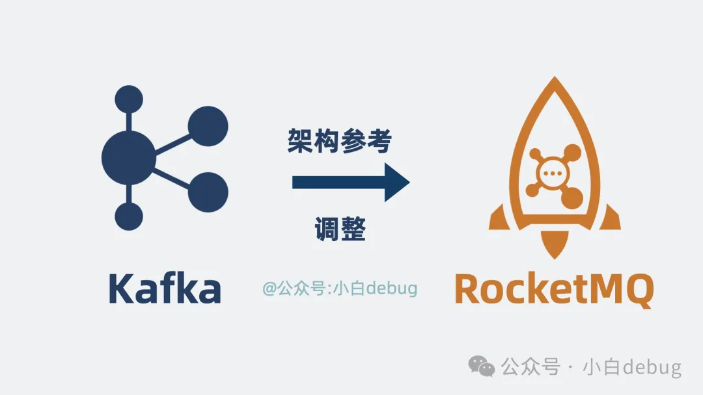

这些调整，用一句话总结就是，"**和 Kafka 相比，RocketMQ 在架构上做了减法，在功能上做了加法**"。我们来看下这句话的含义。

### 1.1 在架构上做减法

我们来简单回顾下消息队列 Kafka 的架构。kakfa 也是通过多个 `topic` 对消息进行分类。

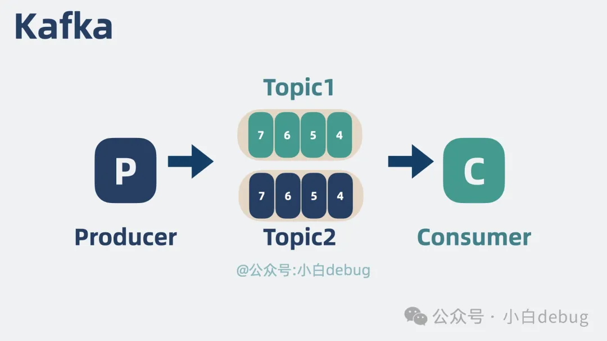

• 为了提升单个 topic 的并发**性能**，将**单个 topic** 拆为多个 `partition`。

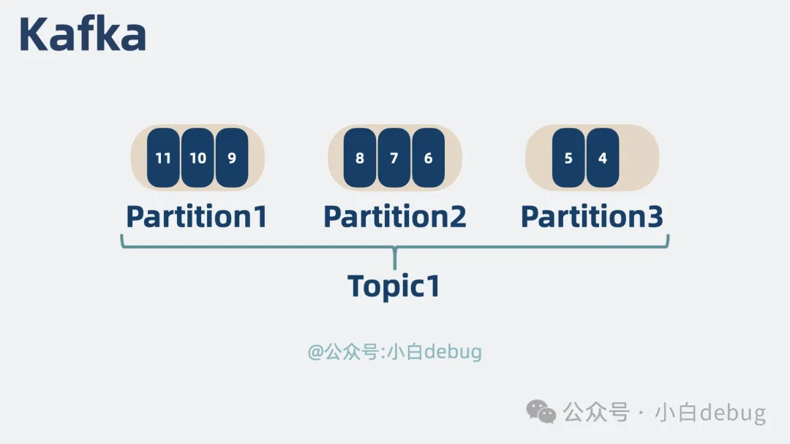

- 为了提升系统**扩展性**，将多个 partition 分别部署在不同 `broker` 上。
- 为了提升系统的**可用性**，为 partition 加了多个副本。
- 为了协调和管理 Kafka 集群的数据信息，引入`Zookeeper`作为协调节点。

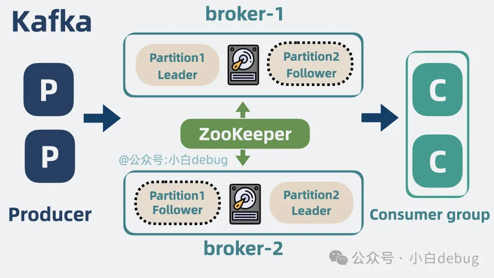

如果你对这些依旧很陌生，可以看看上篇文章《**Kafka 是什么**》。

Kafka 已经是非常强的消息队列了，我们来看下 RocketMQ 在 Kafka 架构的基础上，还能玩出什么花样来。

### 1.2 简化协调节点

`Zookeeper` 在 Kafka 架构中会和 broker 通信，维护 Kafka 集群信息。一个新的 broker 连上 Zookeeper 后，其他 broker 就能立马感知到它的加入，像这种能在分布式环境下，让多个实例同时获取到同一份信息的服务，就是所谓的**分布式协调服务**。

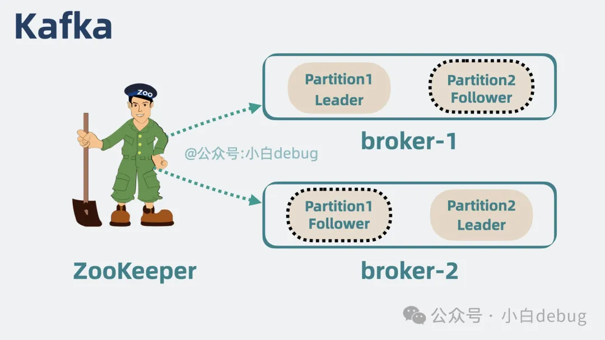

但 Zookeeper 作为一个**通用的**分布式协调服务，它不仅可以用于服务注册与发现，还可以用于分布式锁、配置管理等场景。Kafka 其实只用到了它的部分功能，多少有点**杀鸡用牛刀**的味道。**太重了**。

所以 RocketMQ 直接将 Zookeeper 去掉，换成了 **nameserver**，用一种更轻量的方式，管理消息队列的集群信息。生产者通过 nameserver 获取到 topic 和 broker 的路由信息，然后再与 broker 通信，实现**服务发现**和**负载均衡**的效果。

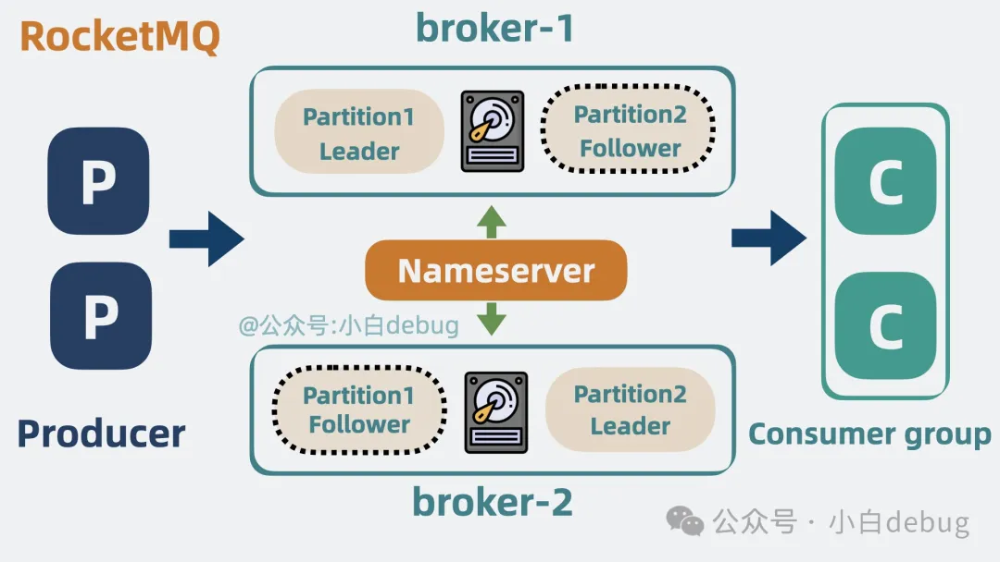

NameServer是一个无状态节点，所有数据都存储在内存中，NameServer集群节点之间也无通讯，因为Broker每隔30s向所有NameServer节点上报心跳，并携带broker中的元数据信息，这样集群中元数据最终会达成一致。

当然Kafka也意识到引入Zookeper会带来部署成本以及集群稳定性的问题，所以从 2.8.0 版本就支持将 Zookeeper 移除，通过 在 broker 之间加入一致性算法 raft 实现同样的效果，这就是所谓的 **KRaft** 或 **Quorum** 模式。

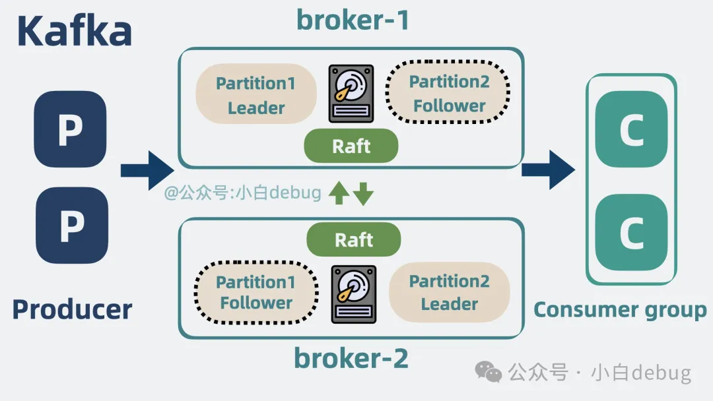

这个方案的优点是**部署和运维成本低，不会因为依赖第三方服务导致稳定性问题**，也不会有数据不一致的问题。但**缺点是开发成本高**，前期要投入大量的开发人力。

### 1.3 简化分区

我们知道，Kafka 会将 topic 拆分为多个 partition，用来提升**并发性能**。

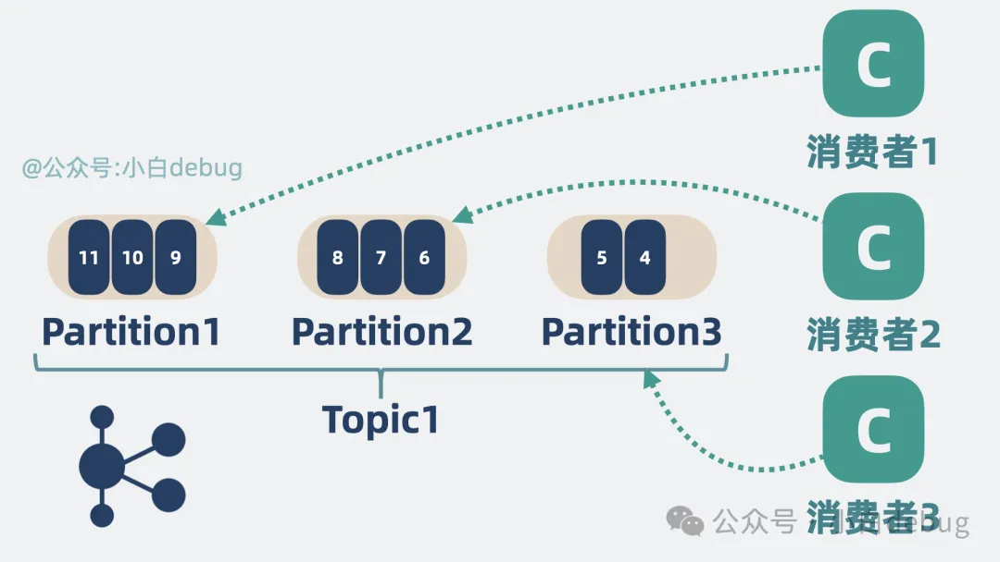

在 RocketMQ 里也一样，将 topic 拆分成了多个分区，但换了个名字，叫 **Queue**,也就是"**队列**"。

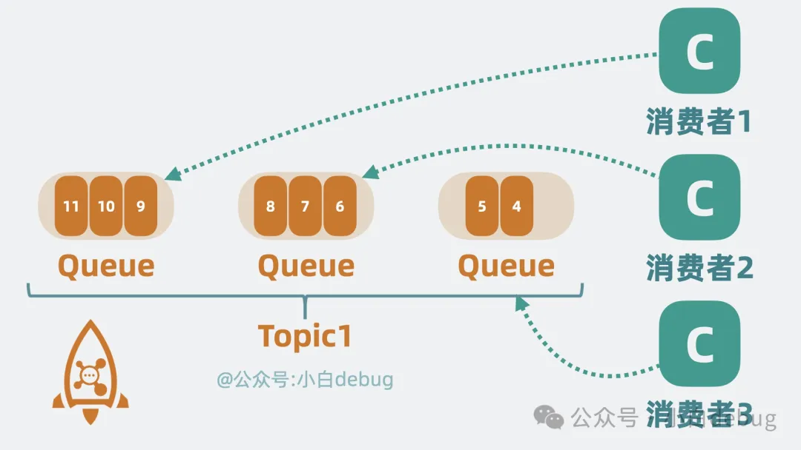

Kafka 中的 partition 会存储**完整**的消息体，而 RocketMQ 的 Queue 上却只存一些**简要**信息，比如消息偏移 offset，而消息的完整数据则放到"一个"叫 `commitlog` 的文件上，通过 offset 我们可以定位到 commitlog 上的某条消息。

Kafka 消费消息，broker 只需要直接从 partition 读取消息返回就好，也就是读第**一次**就够了。

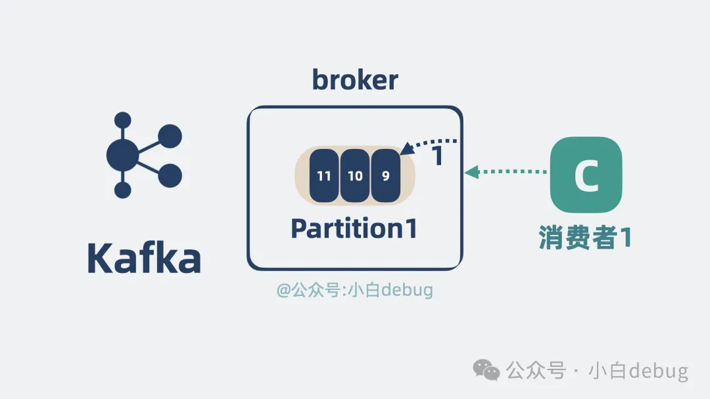

而在 RocketMQ 中，broker 则需要先从 Queue 上读取到 offset 的值，再跑到 commitlog 上将完整数据读出来，也就是需要读**两次**。

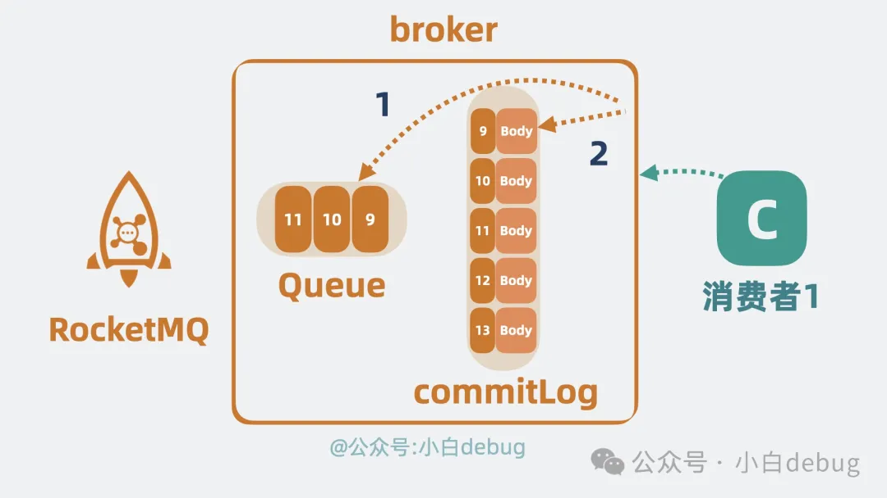

那么问题就来了，看起来 Kafka 的设计更高效？为什么 RocketMQ 不采用 Kafka 的设计？

这就不得说一下 Kafka 的**底层存储**了。

#### 1.3.1 Kafka底层存储

Kafka 的 partition 分区，其实在底层由很多**段**（**segment**）组成，每个 segment 可以认为就是个**小文件**。将消息数据写入到 partition 分区，本质上就是将数据写入到某个 segment 文件下。

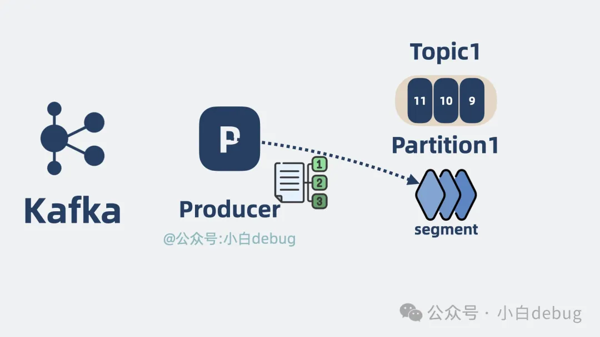

我们知道，操作系统的机械磁盘，**顺序写**的性能会比**随机写**快很多，差距高达几十倍。为了提升性能，Kafka 对每个小文件都是顺序写。
如果只有**一个** segment 文件，那写文件的性能会很好。

但当 topic 变多之后，topic 底下的 partition 分区也会变多，对应的 partition 底下的 segment 文件也会变多。同时写**多个** topic 底下的 partition，就是同时**写多个文件**，虽然每个文件内部都是顺序写，但多个文件存放在磁盘的不同地方，原本**顺序写磁盘就可能劣化变成了随机写**。于是写性能就降低了。

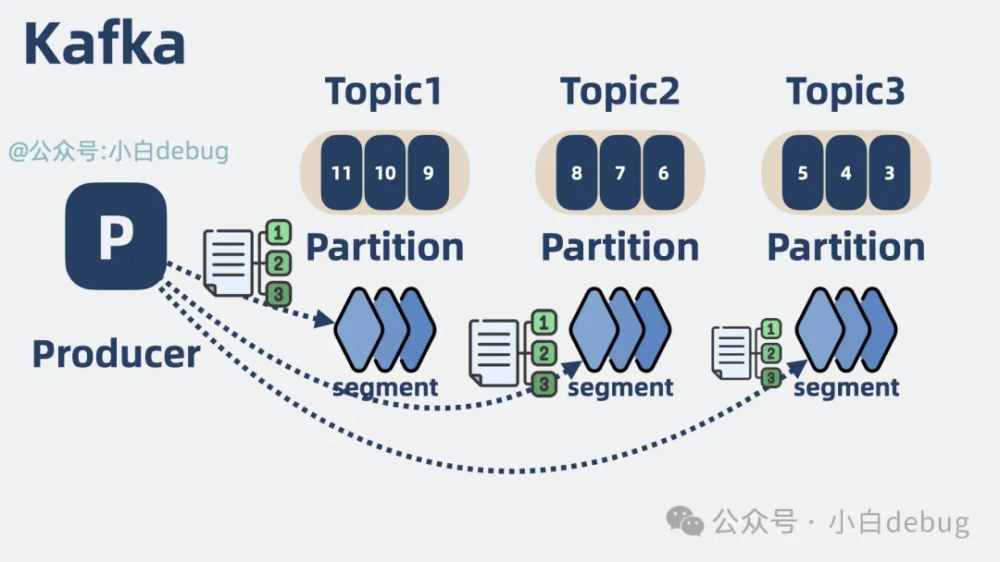

那问题又又来了，究竟多少 topic 才算多？这个看实际情况，但打太极从来不是我的风格。

我给一个经验值**仅供参考**，8 个分区的情况下，超过 64 topic, Kafka 性能就会开始下降。

#### 1.3.2 RocketMQ 的底层存储

为了缓解同时写多个文件带来的随机写问题，RocketMQ 索性将单个 broker 底下的多个 topic 数据，全都写到"**一个**"逻辑文件 `CommitLog` 上，这就消除了随机写多文件的问题，将所有写操作都变成了顺序写。大大提升了 RocketMQ 在多 topic 场景下的写性能。

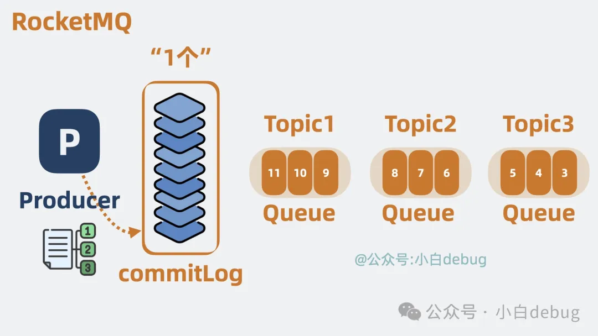

> 注意上面提到的"**一个**"是带引号的，虽然逻辑上它是一个大文件，但实际上这个 CommitLog 由多个小文件组成。每个文件的大小是固定的，当一个文件被写满后，会创建一个新的文件来继续存储新的消息。这种方式可以方便地管理和清理旧的消息。

#### 1.3.3 两者优缺点

**Kafka 每个分区的数据存储在单独的文件上**：

优点：

1. 每个分区上的数据顺序写到同一个磁盘文件中，数据的存储是连续的。因为消息队列在大部分情况下的读写是有序的，所以 **这种机制在读写性能上的表现是最高的**。
2. 存储逻辑清晰。
3. 不同分区文件可以放置在不同的物理磁盘上，这样可以横向扩展单机的IO能力。例如A分区数据写入磁盘1，B分区数据写入磁盘2。

缺点：

1. 如果分区太多，会占用太多的系统FD资源，极端情况下有可能把节点的FD资源耗完，并且硬盘层面会出现大量的随机写情况。
2. 如果分区太多，导致写入的性能开始下降，另外管理起来也相对复杂。

**RocketMQ、Pulsar同一个节点的所有消息数据存在同一个逻辑文件上**：

优点：

1. 所有消息数据都在一份文件上，管理简单，也不会占用过多的系统FD资源。
2. 由于是全局顺序写入，所以写入性能不会随着Topic、分区/Queue增多而下降。

缺点：

1. 同一个分区的数据一般会在文件中的不同位置，或者不同的文件段中，无法利用到顺序读的优势，读取的性能会受到影响，但是随着SSD技术的发展，随机读写的性能也越来越高。
2. 无法像Kafka那样通过将分区文件放置在不同磁盘上的方式扩展节点读写能力。但是仍可以再硬件维度组RAID磁盘阵列，实现磁盘读写性能的扩展。

### 1.4 简化备份模型

我们知道，Kafka 会将 partiton 分散到多个 broker 中，并为 partiton 配置副本，将 partiton 分为 `leader`和 `follower`，也就是**主和从**。broker 中既可能有 A topic 的主 partiton，也可能有 B topic 的从 partiton。

主从 partiton 之间会建立数据同步，本质上就是同步 partiton 底下的 segment 文件数据

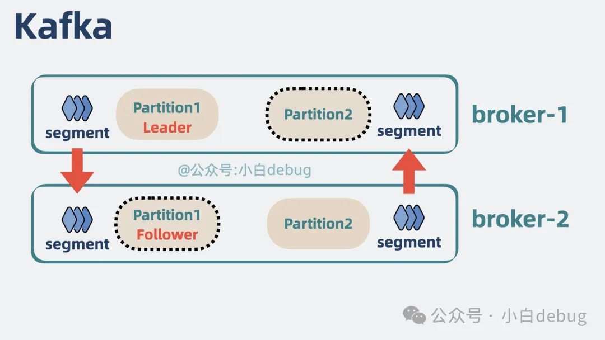

RocketMQ 将 broker 上的所有 topic 数据到写到 CommitLog 上。如果还像 Kafka 那样给每个分区单独建立同步通信，就还得将 CommitLog 里的内容**拆开**，这就还是退化为**随机读**了。

于是 RocketMQ 索性**以 broker 为单位区分主从**，主从之间同步 CommitLog 文件，保持高可用的同时，也大大简化了备份模型。

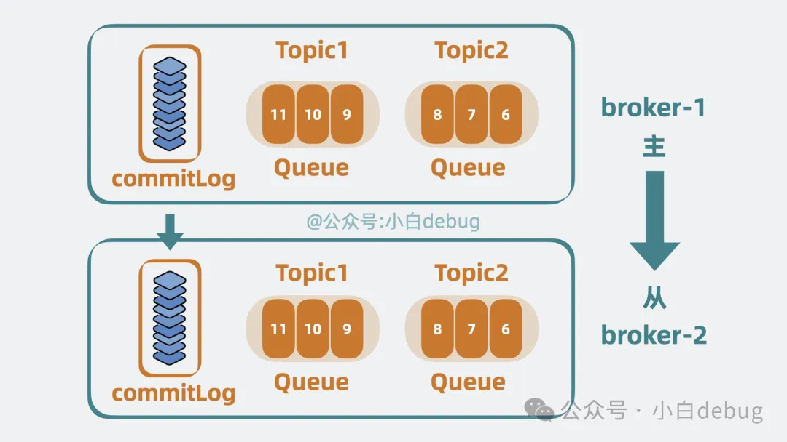

好了，到这里，我们熟悉的 Kafka 架构，就成了 RocketMQ 的架构。

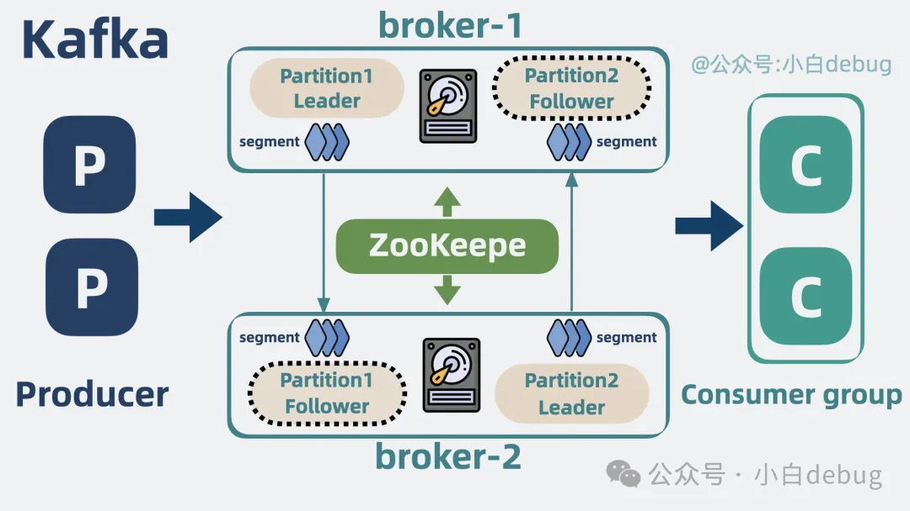

是不是跟 Kafka 的很像但又简化了不少？

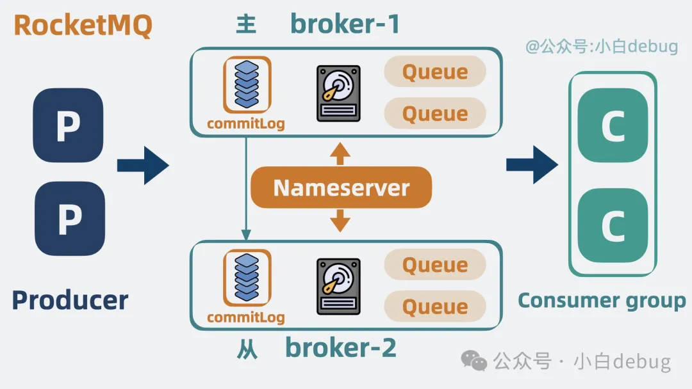

### 1.5 功能上做加法

虽然 RocketMQ 的架构比 Kafka 的简单，但功能却比 Kafka 要更丰富，我们来看下。

#### 1.5.1 消息过滤

我们知道，Kafka 支持通过 topic 将数据进行分类，比如订单数据和用户数据是两个不同的 topic，但如果我还想**再进一步分类**呢？比如同样是用户数据，还能根据 vip 等级进一步分类。假设我们只需要获取 vip6 的用户数据，在 Kafka 里，消费者需要消费 topic 为用户数据的**所有消息**，再将 vip6 的用户过滤出来。

而 RocketMQ 支持对消息打上**标记**，也就是打 **tag**，消费者能根据 tag 过滤所需要的数据。比如我们可以在部分消息上标记 tag=vip6，这样消费者就能**只获取**这部分数据，省下了消费者过滤数据时的资源消耗。

> 相当于 RocketMQ 除了支持通过 topic 进行一级分类，还支持通过 tag 进行二级分类。

#### 1.5.2 支持事务

我们知道 Kafka 支持事务，比如生产者发三条消息 ABC，这三条消息要么同时发送成功，要么同时发送失败。

是，这确实也叫事务，但**跟我们要的不太一样**。

写业务代码的时候，我们更想要的事务是，"**执行一些自定义逻辑**"和"**生产者发消息**"这两件事，要么同时成功，要么同时失败。

而这正是 RocketMQ 支持的事务能力。

#### 1.5.3 加入延时队列

如果我们希望消息投递出去之后，消费者不能立马消费到，而是过个一定时间后才消费，也就是所谓的**延时消息**，就像文章开头的定时外卖那样。如果我们使用 Kafka， 要实现类似的功能的话，就会很费劲。

但 RocketMQ 天然支持**延时队列**，我们可以很方便实现这一功能。

#### 1.5.4 加入死信队列

消费消息是有可能失败的，失败后一般可以设置**重试**。如果多次重试失败，RocketMQ 会将消息放到一个专门的队列，方便我们**后面单独处理**。这种专门存放失败消息的队列，就是**死信队列**。

Kafka 原生不支持这个功能，需要我们自己实现。

#### 1.5.5 消息回溯

Kafka 支持通过**调整 offset** 来让消费者从某个地方开始消费，而 RocketMQ，除了可以调整 offset, 还支持**调整时间**（kafka在0.10.1后支持调时间）

## 二. Kafka 性能为什么比 RocketMQ 好

现在看起来，RocketMQ 好像各方面都比 Kafka 更能打。

但 Kafka 却一直没被淘汰，说明 RocketMQ 必然是有着不如 Kafka 的地方。

是啥呢？ 

**性能**，严格来说是**吞吐量**。

阿里中间件团队对它们做过压测，同样条件下，kafka 比 RocketMQ 快 50%左右。但即使这样，RocketMQ 依然能每秒处理 10w 量级的数据，依旧非常能打。你不能说 RocketMQ 弱，只能说 Kafka 性能太强了。

不过这就很奇怪了，**为什么 RocketMQ 参考了 kafka 的架构，却不能跟 kafka 保持一样的性能呢**？在回答这个问题之前，我们来聊下什么是**零拷贝**。

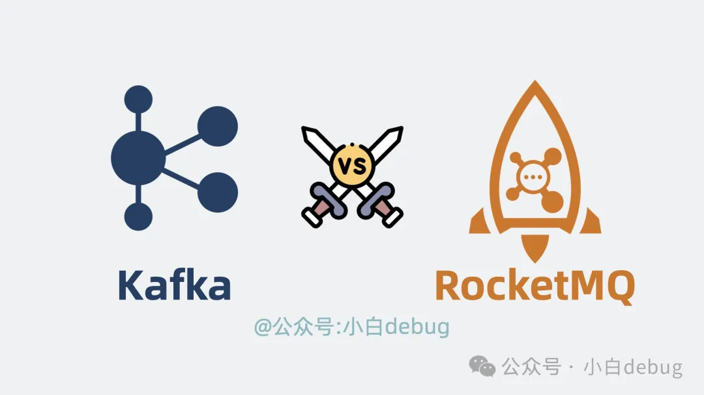

### 2.1 零拷贝是什么

我们知道，消息队列的消息为了防止进程崩溃后丢失，一般不会放内存里，而是放磁盘上。那么问题就来了，消息从消息队列的磁盘，发送到消费者，过程是怎么样的呢？

#### 2.1.1 消息的发送过程

操作系统分为**用户空间**和**内核空间**。程序处于用户空间，而磁盘属于硬件，操作系统本质上是程序和硬件设备的一个**中间层**。程序需要通过操作系统去调用硬件能力。

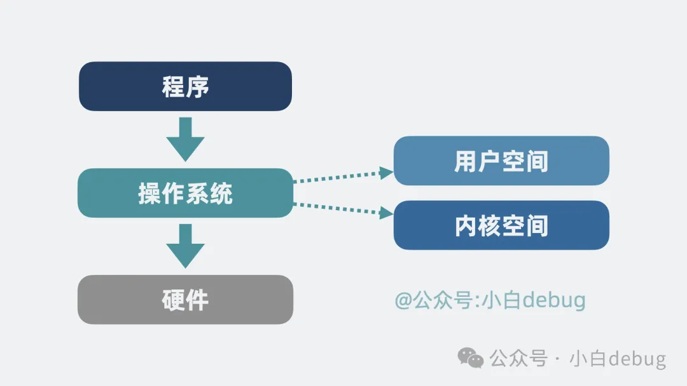

如果用户想要将数据从磁盘发送到网络。那么就会发生下面这几件事：程序会发起**系统调用**`read()`，尝试读取磁盘数据，

- 磁盘数据从设备**拷贝**到内核空间的缓冲区。
- 再从内核空间的缓冲区**拷贝**到用户空间。

程序再发起**系统调用**`write()`，将读到的数据发到网络：

- 数据从用户空间**拷贝**到 socket 发送缓冲区

- 再从 socket 发送缓冲区**拷贝**到网卡。

最终数据就会经过网络到达消费者。

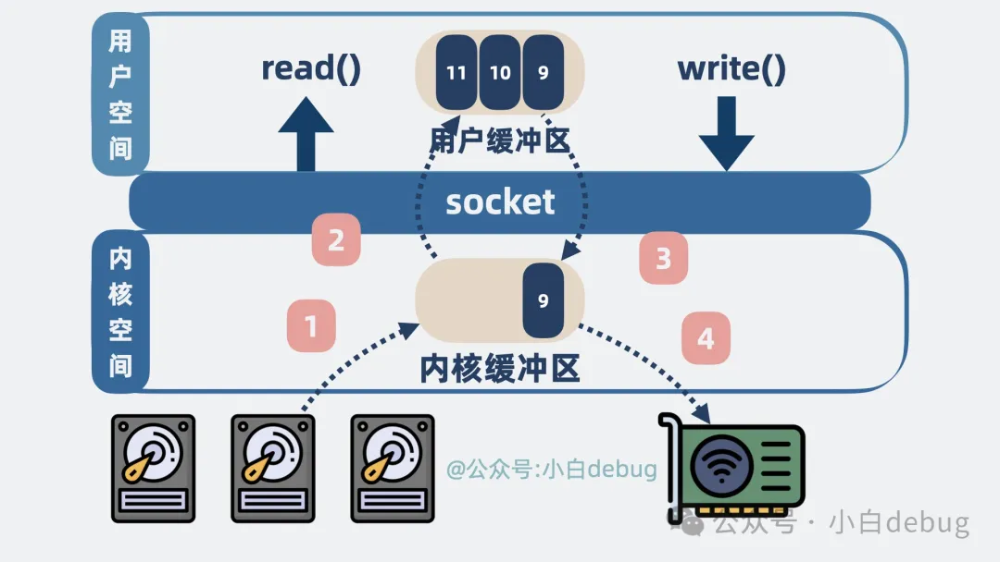
整个过程，本机内发生了 `2` 次**系统调用**，对应 `4` 次用户空间和内核空间的**切换**，以及 `4` 次数据**拷贝**。

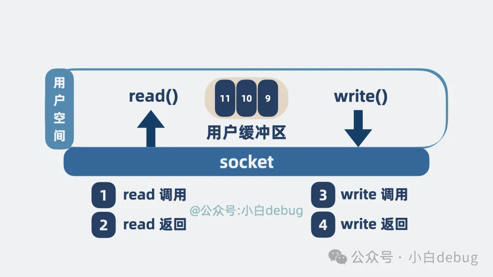

一顿操作猛如虎，结果就是同样一份数据来回拷贝。有没有办法优化呢？有，它就是零拷贝技术，常见的方案有两种，分别是 `mmap` 和 `sendfile`。我们来看下它们是什么。

#### 2.1.2 mmap 是什么

`mmap` 是操作系统内核提供的一个方法，可以将内核空间的缓冲区**映射**到用户空间。

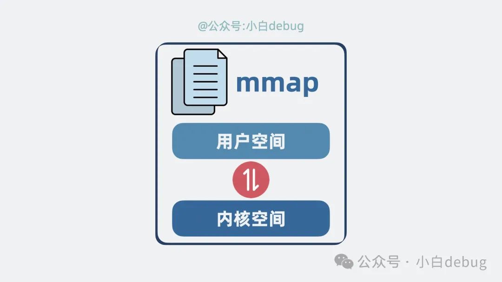

用了它，整个发送流程就有了一些变化。程序发起**系统调用**`mmap()`，尝试读取磁盘数据，具体情况如下：

- 磁盘数据从设备**拷贝**到内核空间的缓冲区。
- 内核空间的缓冲区**映射**到用户空间，这里**不需要**拷贝。

程序再发起**系统调用**`write()`，将读到的数据发到网络：

- 数据从内核空间缓冲区**拷贝**到 socket 发送缓冲区。
- 再从 socket 发送缓冲区**拷贝**到网卡。

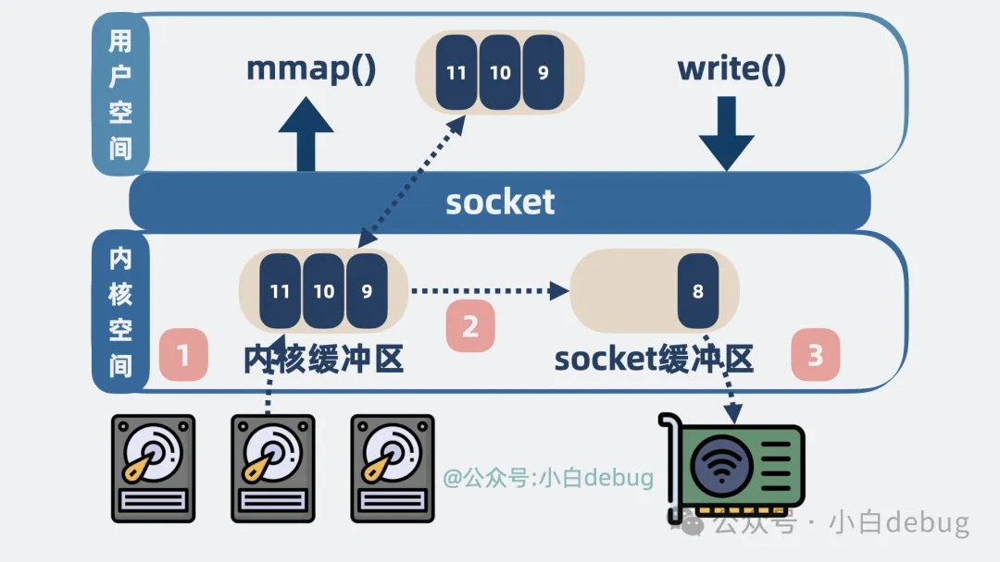

整个过程，发生了 `2` 次系统调用，对应 `4` 次用户空间和内核空间的切换，以及 `3` 次数据拷贝，对比之前，省下**一次**内核空间到用户空间的拷贝。

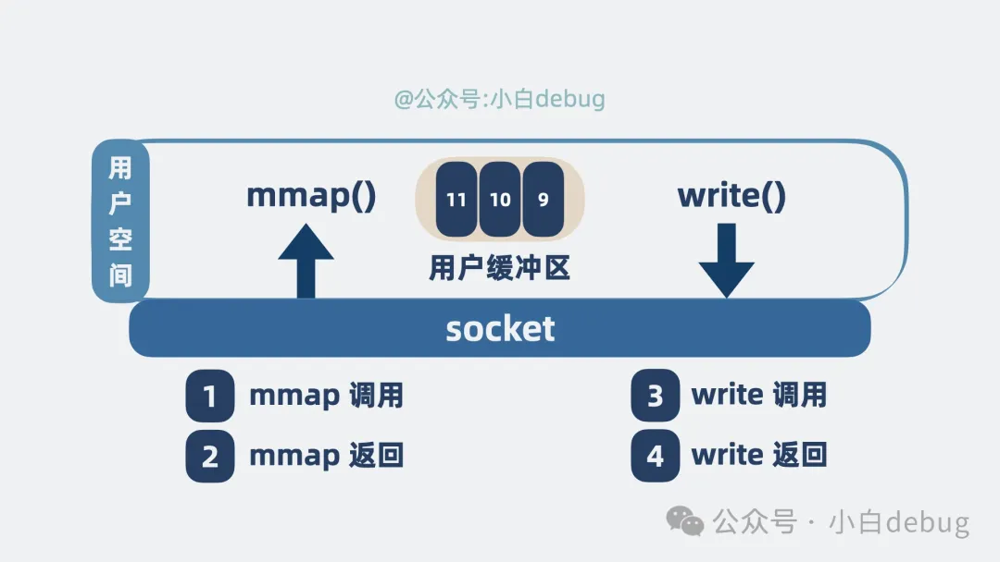

看到这里大家估计也蒙了，不是说零拷贝吗？怎么还有 3 次拷贝。mmap 作为一种零拷贝技术，指的是用户空间到内核空间这个过程不需要拷贝，而不是指数据从磁盘到发送到网卡这个过程零拷贝。

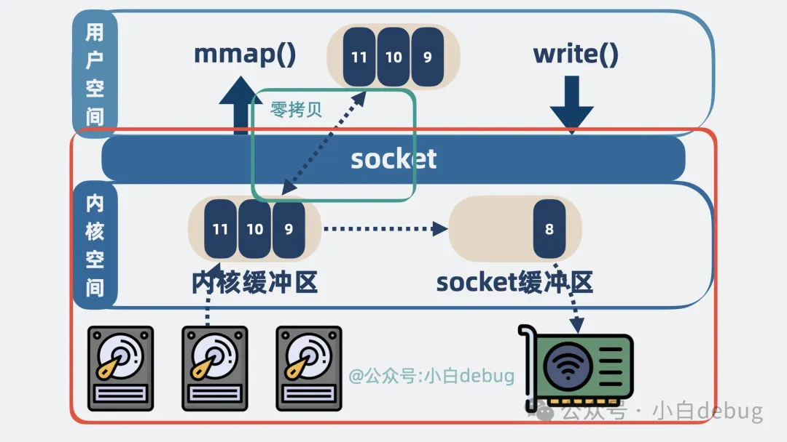

**确实省了一点，但不多**。有没有更彻底的零拷贝？有，用 `sendfile`.

#### 2.1.3 sendfile 是什么

`sendfile`，也是内核提供的一个方法，从名字可以看出，就是用来**发送文件数据**的。程序发起**系统调用**`sendfile()`，内核会尝试读取磁盘数据然后发送，具体情况如下：

- 磁盘数据从设备**拷贝**到内核空间的缓冲区。
- 内核空间缓冲区里的数据**可以**直接**拷贝**到网卡。

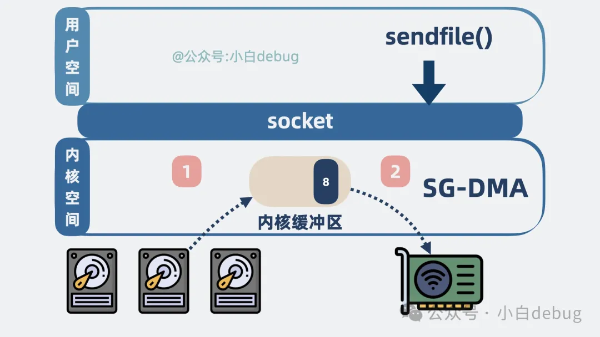

整个过程，发生了 `1` 次系统调用，对应 `2` 次用户空间和内核空间的切换，以及 `2` 次数据拷贝。这时候问题很多的小明就有意见了，说好的**零**拷贝怎么还有 `2` 次拷贝？

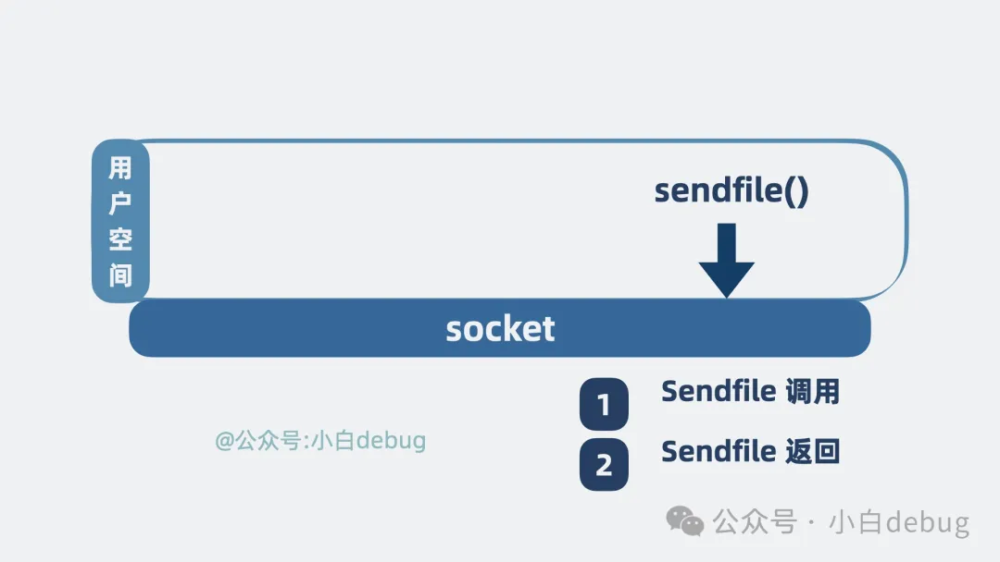

其实，这里的零拷贝指的是**零 CPU**拷贝。也就是说 sendfile 场景下，需要的两次拷贝，都不是 CPU 直接参与的拷贝，而是其他硬件设备技术做的拷贝，不耽误我们 CPU 跑程序。

### 2.2 kafka 为什么性能比 RocketMQ 好

聊完两种零拷贝技术，我们回过头来看下 kafka 为什么性能比 RocketMQ 好。这是因为 **RocketMQ 使用的是 mmap 零拷贝技术，而 kafka 使用的是 sendfile**。kafka 以更少的拷贝次数以及系统内核切换次数，获得了更高的性能。但问题又来了，为什么 RocketMQ 不使用 sendfile？参考 kafka 抄个作业也不难啊？我们来看下 `sendfile` 函数长啥样。

```c
ssize_t sendfile(int out_fd, int in_fd, off_t* offset, size_t count);
// num = sendfile(xxx);
```

再来看下 `mmap` 函数长啥样。

```c
void *mmap(void *addr, size_t length, int prot, int flags,
           int fd, off_t offset);
// buf = mmap(xxx)
```

注释里写的是两个函数的用法，`mmap` 返回的是数据的**具体内容**，应用层能获取到消息内容并进行一些逻辑处理。

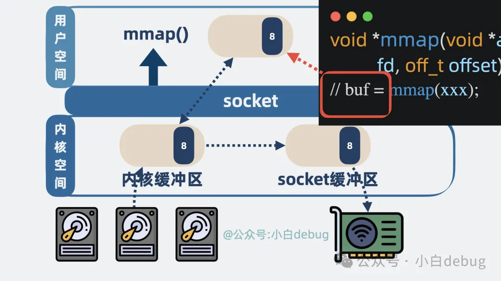

而 `sendfile` 返回的则是发送成功了几个**字节数**，**具体发了什么内容，应用层根本不知道**。

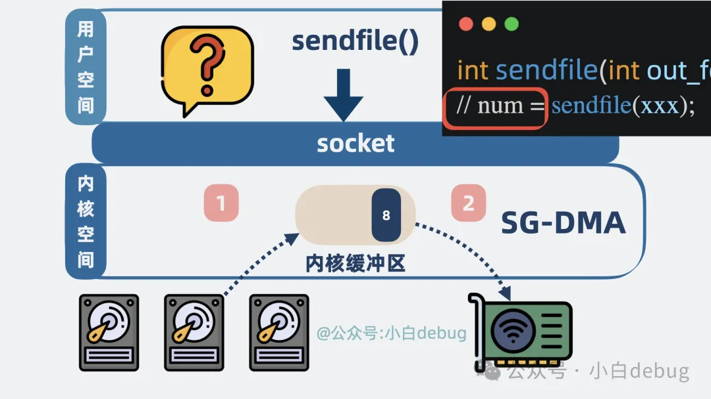

而 RocketMQ 的一些功能，却需要了解具体这个消息内容，方便二次投递等，比如将消费失败的消息重新投递到死信队列中，如果 RocketMQ 使用 sendfile，那根本没机会获取到消息内容长什么样子，也就没办法实现一些好用的功能了。

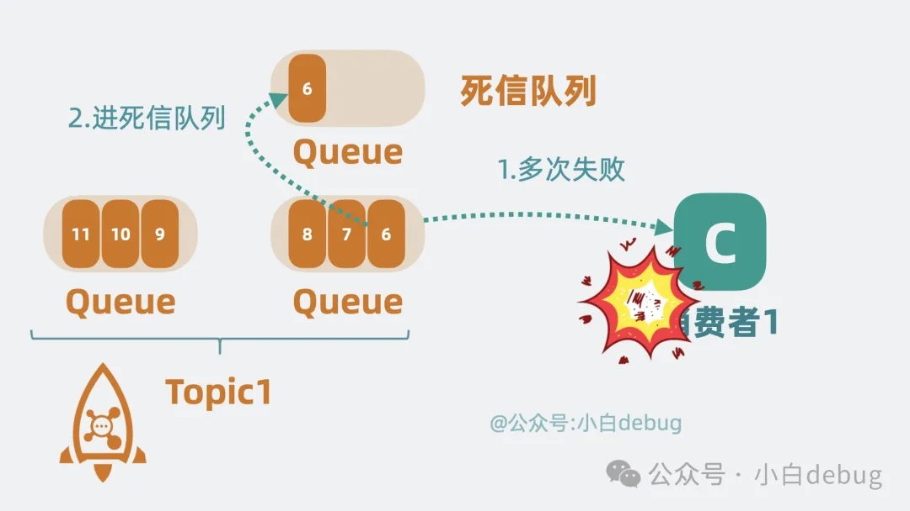

而 kafka 却没有这些功能特性，追求极致性能，正好可以使用 sendfile。

除了零拷贝以外，kafka 高性能的原因还有很多，比如什么批处理，数据压缩啥的，但那些优化手段 rocketMQ 也都能借鉴一波，唯独这个零拷贝，那是毫无办法。

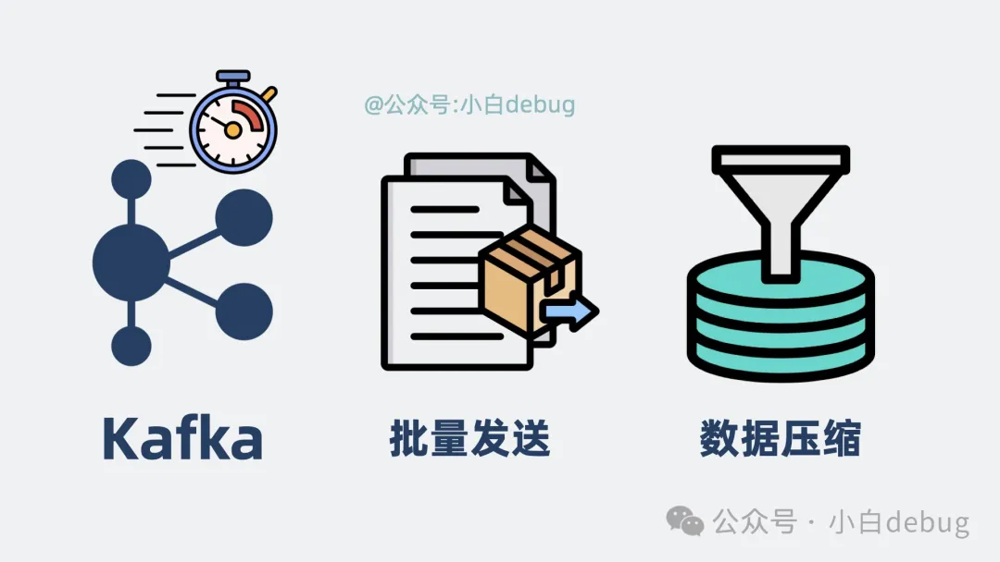

所以还是那句话，没有一种架构是完美的，一种架构往往用于适配某些场景，你很难做到既要又要还要。当场景不同，我们就需要做一些定制化改造，通过牺牲一部分能力去换取另一部分能力。做架构，做到最后都是在做折中。是不是感觉升华了。

## 三. kafka 和 RocketMQ 怎么选

这时候大家估计还是想知道 kafka 和 RocketMQ 到底该怎么选，用哪个。官方点的回答是"这个要看场景的"。说了等于没说。这不是我的风格。我的标准只有一个，如果是大数据场景，比如你能频繁听到 spark，flink 这些关键词的时候，那就用 kafka。除此之外，如果公司组件支持，尽量用 RocketMQ。

## 四. 总结

- RocketMQ 和 kafka 相比，在架构上做了减法，在功能上做了加法
- kafka 的架构相比，RocketMQ 简化了协调节点和分区以及备份模型。同时增强了消息过滤、消息回溯和事务能力，加入了延迟队列，死信队列等新特性。
- 凡事皆有代价，RocketMQ 牺牲了一部分性能，换取了比 kafka 更强大的功能特性。