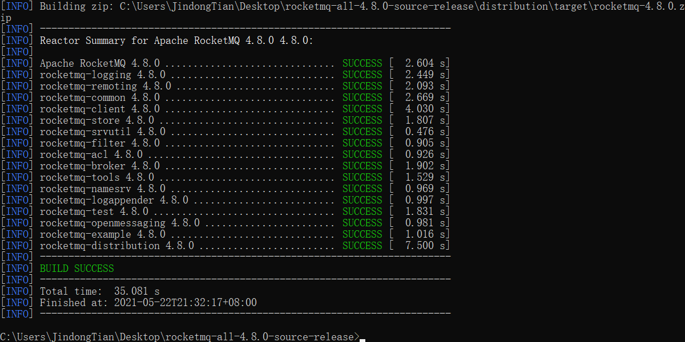
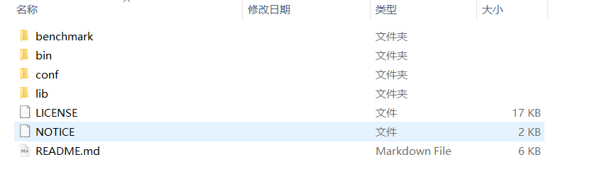
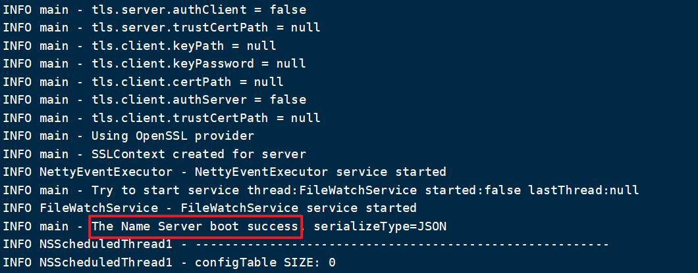
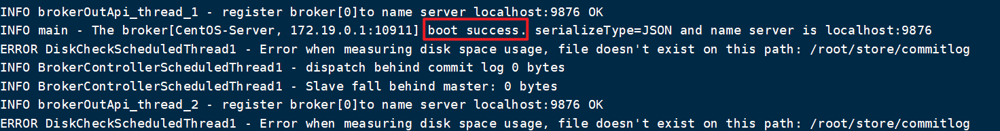
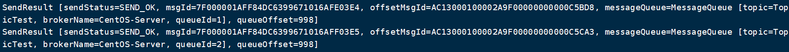
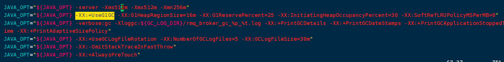
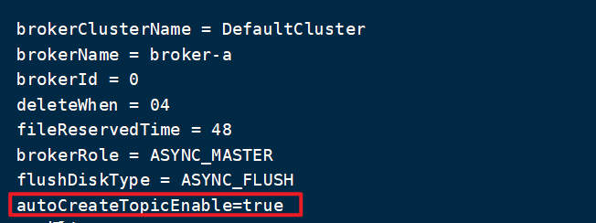

# 安装RocketMQ

> 本文参考至：[Quick Start - Apache RocketMQ](https://rocketmq.apache.org/docs/quick-start/)

## 一. 环境要求

- 64位操作系统（Linux、Unix、Mac、Windows）
- 64位JDK 1.8+
- Maven 3.2x
- Git
- 4G+的磁盘空间

## 二. RocketMQ安装

因为官方提供了源码，我们可以下载源码自行构建，我们目标是在Linux上安装RocketMQ，但是我的Linux服务器上并没有安装Maven环境，但是好在自己Windows上是有Maven环境的，我们在Windows上将源码打包构建完成后在上传至Linux服务器运行即可。

**第一步：下载源码，并解压**

[Rocket MQ 4.8.0](https://www.apache.org/dyn/closer.cgi?path=rocketmq/4.8.0/rocketmq-all-4.8.0-source-release.zip)

**第二步：进入解压目录，执行打包命令**

```shell
mvn -Prelease-all -DskipTests clean package -U
```



打包完成后，我们进入`distribution/target/rocketmq-4.8.0/rocketmq-4.8.0`目录，我们就可以看到打包好的文件：



**第三步：上传可执行文件**

我们将打包好文件夹上传至Linux服务器，但是上传后我们会发现bin目录下的文件都没有执行的权限，我们需要进入到bin目录，执行下列命令去赋予执行权限：

```shell
chmod +x *
```

如果大家觉得自行打包比较麻烦可以下载官方打包好的文件，然后自行解压即可（跳过1~3步）：

[Apache Download Mirrors](https://www.apache.org/dyn/closer.cgi?path=rocketmq/4.8.0/rocketmq-all-4.8.0-bin-release.zip)

## 二. RocketMQ启动与停止

### 2.1 RocketMQ组件结构


- NameServer是一个几乎无状态节点，可集群部署，节点之间无任何信息同步。
- Broker部署相对复杂，Broker分为Master与Slave，一个Master可以对应多个Slave，但是一个Slave只能对应一个Master，Master与Slave 的对应关系通过指定相同的BrokerName，不同的BrokerId 来定义，BrokerId为0表示Master，非0表示Slave。Master也可以部署多个。每个Broker与NameServer集群中的所有节点建立长连接，定时注册Topic信息到所有NameServer。 注意：当前RocketMQ版本在部署架构上支持一Master多Slave，但只有BrokerId=1的从服务器才会参与消息的读负载。
- Producer与NameServer集群中的其中一个节点（随机选择）建立长连接，定期从NameServer获取Topic路由信息，并向提供Topic 服务的Master建立长连接，且定时向Master发送心跳。Producer完全无状态，可集群部署。
- Consumer与NameServer集群中的其中一个节点（随机选择）建立长连接，定期从NameServer获取Topic路由信息，并向提供Topic服务的Master、Slave建立长连接，且定时向Master、Slave发送心跳。Consumer既可以从Master订阅消息，也可以从Slave订阅消息，消费者在向Master拉取消息时，Master服务器会根据拉取偏移量与最大偏移量的距离（判断是否读老消息，产生读I/O），以及从服务器是否可读等因素建议下一次是从Master还是Slave拉取。

结合部署架构图，描述集群工作流程：

- 启动NameServer，NameServer起来后监听端口，等待Broker、Producer、Consumer连上来，相当于一个路由控制中心。
- Broker启动，跟所有的NameServer保持长连接，定时发送心跳包。心跳包中包含当前Broker信息(IP+端口等)以及存储所有Topic信息。注册成功后，NameServer集群中就有Topic跟Broker的映射关系。
- 收发消息前，先创建Topic，创建Topic时需要指定该Topic要存储在哪些Broker上，也可以在发送消息时自动创建Topic。
- Producer发送消息，启动时先跟NameServer集群中的其中一台建立长连接，并从NameServer中获取当前发送的Topic存在哪些Broker上，轮询从队列列表中选择一个队列，然后与队列所在的Broker建立长连接从而向Broker发消息。
- Consumer跟Producer类似，跟其中一台NameServer建立长连接，获取当前订阅Topic存在哪些Broker上，然后直接跟Broker建立连接通道，开始消费消息。

### 2.2 启动

**第一步：先启NameServer**

```shell
#启动名称服务器
nohup bin/mqnamesrv & 
tail -f ~/logs/rocketmqlogs/namesrv.log
```

看到如下界面就代表启动成功了：



**第二步：启动Broker服务器**

```shell
nohup bin/mqbroker -c conf/broker.conf &
tail -f ~/logs/rocketmqlogs/broker.log 
```

> 需要注意的是默认情况下，broker是不知道NameServer的地址的，我们需要修改`conf/broker.conf`文件，添加如下配置，告诉broker连接的NameServer地址：
>
> ```properties
> namesrvAddr=localhost:9876
> ```
>
> 或者我们可以在启动broker时，使用-n参数指定NameServer地址：
>
> ```shell
> nohup sh bin/mqbroker -n localhost:9876 &
> ```

看到如下信息代表启动成功：



### 2.3 快速验证

我们可以通过如下命令测试broker是否成功：

```shell
export NAMESRV_ADDR=localhost:9876
sh bin/tools.sh org.apache.rocketmq.example.quickstart.Producer
```

看到如下输出可以证明broker启动成功，生成者发送消息成功：



通过下列命令，可以测试消费者消费数据：

```shell
sh bin/tools.sh org.apache.rocketmq.example.quickstart.Consumer
```

### 2.4 关闭

如果我们想**关闭RocketMQ**，执行下列命令：

```shell
sh bin/mqshutdown broker
sh bin/mqshutdown namesrv
```

## 二. RocketMQ配置

### 2.1 JVM参数配置

由于RocketMQ Broker Server默认的`-Xmx`、`-Xms`都设置为了4G，我们如果只是做简单的测试，并没有必要设置那么大的堆内存。

第一步：修改`bin/runserver.sh`文件中的JVM参数：


第二步：修改`bin/runbroker.sh`文件中的JVM参数降低堆内存：



### 2.2 Broker配置

[rocketmq/best_practice.md at master · apache/rocketmq (github.com)](https://github.com/apache/rocketmq/blob/master/docs/cn/best_practice.md)

| 参数名                  | 默认值                    | 说明                                                         |
| ----------------------- | ------------------------- | ------------------------------------------------------------ |
| listenPort              | 10911                     | 接受客户端连接的监听端口                                     |
| namesrvAddr             | null                      | nameServer 地址                                              |
| brokerIP1               | 网卡的 InetAddress        | 当前 broker 监听的 IP                                        |
| brokerIP2               | 跟 brokerIP1 一样         | 存在主从 broker 时，如果在 broker 主节点上配置了 brokerIP2 属性，broker 从节点会连接主节点配置的 brokerIP2 进行同步 |
| brokerName              | null                      | broker 的名称                                                |
| brokerClusterName       | DefaultCluster            | 本 broker 所属的 Cluser 名称                                 |
| brokerId                | 0                         | broker id, 0 表示 master, 其他的正整数表示 slave             |
| storePathCommitLog      | $HOME/store/commitlog/    | 存储 commit log 的路径                                       |
| storePathConsumerQueue  | $HOME/store/consumequeue/ | 存储 consume queue 的路径                                    |
| mappedFileSizeCommitLog | 1024 * 1024 * 1024(1G)    | commit log 的映射文件大小                                    |
| deleteWhen              | 04                        | 在每天的什么时间删除已经超过文件保留时间的 commit log        |
| fileReservedTime        | 72                        | 以小时计算的文件保留时间                                     |
| brokerRole              | ASYNC_MASTER              | SYNC_MASTER/ASYNC_MASTER/SLAVE                               |
| flushDiskType           | ASYNC_FLUSH               | SYNC_FLUSH/ASYNC_FLUSH SYNC_FLUSH 模式下的 broker 保证在收到确认生产者之前将消息刷盘。ASYNC_FLUSH 模式下的 broker 则利用刷盘一组消息的模式，可以取得更好的性能。 |

#### 2.2.1 开启自动创建Topic

编辑`conf/broker.conf`在末尾加上如下配置：

```properties
autoCreateTopicEnable=true
```



#### 2.2.2 配置NameServer地址

编辑`conf/broker.conf`在末尾加上如下配置：

```properties
namesrvAddr=localhost:9876
```

