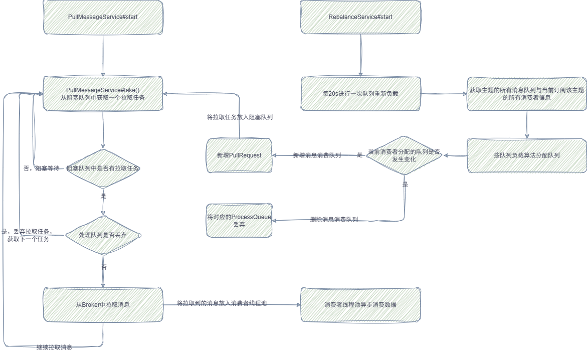
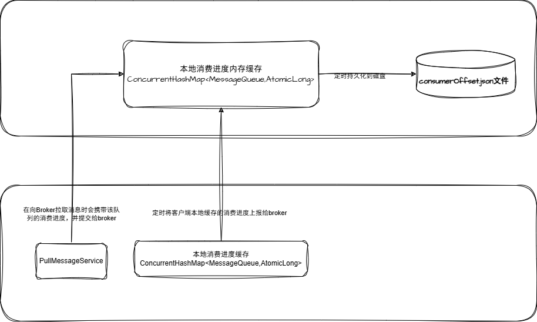

# RocketMQ消息消费原理

> 本文参考转载至《RocketMQ技术内幕 第2版》

## 一. 消息消费概述

消息消费以组的模式开展，一个消费组可以包含多个消费者，每个消费组可以订阅多个主题，消费组之间有集群模式和广播模式两种消费模式。集群模式是当前主题下的同一条消息只允许被其中一个消费者消费。广播模式是当前主题下的同一条消息将被集群内的所有消费者消费一次。

消息服务器与消费者之间的消息传送也有两种方式：推模式和拉模式。所谓的拉模式，是消费端主动发起拉取消息的请求，而推模式是消息到达消息服务器后，再推送给消息消费者。RocketMQ消息推模式基于拉模式实现，在拉模式上包装一层，一个拉取任务完成后开始下一个拉取任务。

集群模式下，多个消费者如何对消息队列进行负载呢？消息队列负载机制遵循一个通用的思想：一个消息队列同一时间只允许被一个消费者消费，一个消费者可以消费多个消息队列。

RocketMQ 支持局部顺序消息消费，也就是保证同一个消息队列上的消息按顺序消费。不支持消息全局顺序消费，如果要实现某一主题的全局顺序消息消费，可以将该主题的队列数设置为1，牺牲高可用性。RocketMQ支持两种消息过滤模式：表达式（TAG、SQL92）与类过滤模式。

消息拉模式主要是由客户端手动调用消息拉取API，而消息推模式是消息服务器主动将消息推送到消息消费端，本章将以推模式为突破 口，重点介绍 RocketMQ 消息消费的实现原理。

### 1.1 消费队列负载机制与重平衡

正如上文提到的，RocketMQ提供了两种消费模式，集群模式与广播模式。广播模式中所有的消费者会消费全部的队列，故没有所谓的消费队列负载问题，而集群模式下需要考虑同一个消费组内的多个消费者之间如何分配队列。

RocketMQ提供了多种队列负载算法，其中比较常用的是AVG、AVG_BY_CIRCLE这两种平均分配算法，例如8个队列分别为b1_q0、 b1_q1、b1_q2、b1_q3、b2_q0、b2_q1、b2_q2、b2_q3，一个消费组有 3个消费者，分别用C1、C2、C3表示。

采用AVG的分配机制，各个消费者分配到的队列如下。

- c1：b1_q0、b1_q1、b1_q2

- c2：b1_q3、b2_q0、b2_q1 

- c3：b2_q2、b2_q3

采用AVG_BY_CIRCLE的分配机制，各个消费者分配到的队列如下。

- c1：b1_q0、b1_q3、b2_q2

- c2：b1_q1、b2_q0 b2_q3 
- c3：b1_q2、b2_q1

这两种分配算法各有使用场景。通常要求发送方发送的消息尽量在各个队列上分布均匀，如果分布均衡，就会使用第一种平均算法。但有些时候，一台Broker上的消息会明显多于第二台，如果使用第一种分配算法，c1消费者处理的消息就太多了，但其他消费者又空闲， 而且还不能通过增加消费者来改变这种情况，此种情况使用AVG_BY_CIRCLE方式更加合适。

**在消费时间过程中可能会遇到消息消费队列增加或减少、消息消费者增加或减少，比如需要对消息消费队列进行重新平衡，即重新分配，这就是所谓的重平衡机制**。在RocketMQ中，每隔20s会根据当前队列数量、消费者数量重新进行队列负载计算，如果计算出来的结果与当前不一样，则触发消息消费队列的重平衡。

### 1.2 并发消费模型

RocketMQ 支持并发消费与顺序消费两种消费方式，消息的拉取与消费模型基本一致，只是顺序消费在某些环节为了保证顺序性，需要引入锁机制，RocketMQ的消息拉取与消费模式如图下图所示：

**一个MQ客户端（MQClientInstance）只会创建一个消息拉取线程向Broker拉取消息，并且同一时间只会拉取一个topic中的一个队列， 拉取线程一次向Broker拉取一批消息后，会提交到消费组的线程池，然后“不知疲倦”地向Broker发起下一个拉取请求**。

RocketMQ客户端为每一个消费组创建独立的消费线程池，即在并发消费模式下，单个消费组内的并发度为线程池线程个数。线程池处理一批消息后会向Broker汇报消息消费进度。

### 1.3 消息消费进度反馈机制

RocketMQ客户端消费一批数据后，需要向Broker反馈消息的消费进度，Broker会记录消息消费进度，这样在客户端重启或队列重平衡时会根据其消费进度重新向Broker拉取消息，消息消费进度反馈机制，如下图所示：

消息消费进度反馈机制核心要点如下。           

1. 消费线程池在处理完一批消息后，会将消息消费进度存储在本地内存中。

2. 客户端会启动一个定时线程，每5s将存储在本地内存中的所有队列消息消费偏移量提交到Broker中。

3. Broker收到的消息消费进度会存储在内存中，每隔5s将消息消费偏移量持久化到磁盘文件中。

4. 在客户端向Broker拉取消息时也会将该队列的消息消费偏移量提交到Broker。

再来思考一个问题，假设线程池中有T1、T2、T3三个线程，此时分别依次获取到msg1、msg2、msg3消息，消息msg3的偏移量大于msg1、msg2的偏移量，由于支持并发消费，如果线程t3先处理完msg3，而t1、t2还未处理，那么线程t3如何提交消费偏移量呢？

试想一下，如果提交msg3的偏移量是作为消费进度被提交，如果此时消费端重启，消息消费msg1、msg2就不会再被消费，这样就会造成“消息丢失”。**因此t3线程并不会提交msg3的偏移量，而是提交线程池中偏移量最小的消息的偏移量，即t3线程在消费完msg3后，提交的消息消费进度依然是msg1的偏移量，这样能避免消息丢失，但同样有消息重复消费的风险**。

## 二. 消息消费者初探

