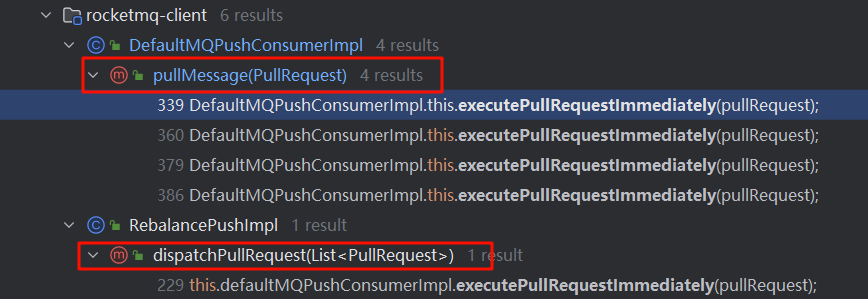

# RocketMQ消息消费原理

> 本文参考转载至《RocketMQ技术内幕 第2版》

## 一. 消息消费概述

消息消费以组的模式开展，一个消费组可以包含多个消费者，每个消费组可以订阅多个主题，消费组之间有集群模式和广播模式两种消费模式。集群模式是当前主题下的同一条消息只允许被其中一个消费者消费。广播模式是当前主题下的同一条消息将被集群内的所有消费者消费一次。

消息服务器与消费者之间的消息传送也有两种方式：推模式和拉模式。所谓的拉模式，是消费端主动发起拉取消息的请求，而推模式是消息到达消息服务器后，再推送给消息消费者。RocketMQ消息推模式基于拉模式实现，在拉模式上包装一层，一个拉取任务完成后开始下一个拉取任务。

集群模式下，多个消费者如何对消息队列进行负载呢？消息队列负载机制遵循一个通用的思想：一个消息队列同一时间只允许被一个消费者消费，一个消费者可以消费多个消息队列。

RocketMQ 支持局部顺序消息消费，也就是保证同一个消息队列上的消息按顺序消费。不支持消息全局顺序消费，如果要实现某一主题的全局顺序消息消费，可以将该主题的队列数设置为1，牺牲高可用性。RocketMQ支持两种消息过滤模式：表达式（TAG、SQL92）与类过滤模式。

消息拉模式主要是由客户端手动调用消息拉取API，而消息推模式是消息服务器主动将消息推送到消息消费端，本章将以推模式为突破 口，重点介绍 RocketMQ 消息消费的实现原理。

### 1.1 消费队列负载机制与重平衡

正如上文提到的，RocketMQ提供了两种消费模式，集群模式与广播模式。广播模式中所有的消费者会消费全部的队列，故没有所谓的消费队列负载问题，而集群模式下需要考虑同一个消费组内的多个消费者之间如何分配队列。

RocketMQ提供了多种队列负载算法，其中比较常用的是AVG、AVG_BY_CIRCLE这两种平均分配算法，例如8个队列分别为b1_q0、 b1_q1、b1_q2、b1_q3、b2_q0、b2_q1、b2_q2、b2_q3，一个消费组有 3个消费者，分别用C1、C2、C3表示。

采用AVG的分配机制，各个消费者分配到的队列如下。

- c1：b1_q0、b1_q1、b1_q2

- c2：b1_q3、b2_q0、b2_q1 

- c3：b2_q2、b2_q3

采用AVG_BY_CIRCLE的分配机制，各个消费者分配到的队列如下。

- c1：b1_q0、b1_q3、b2_q2

- c2：b1_q1、b2_q0 b2_q3 
- c3：b1_q2、b2_q1

这两种分配算法各有使用场景。通常要求发送方发送的消息尽量在各个队列上分布均匀，如果分布均衡，就会使用第一种平均算法。但有些时候，一台Broker上的消息会明显多于第二台，如果使用第一种分配算法，c1消费者处理的消息就太多了，但其他消费者又空闲， 而且还不能通过增加消费者来改变这种情况，此种情况使用AVG_BY_CIRCLE方式更加合适。

**在消费时间过程中可能会遇到消息消费队列增加或减少、消息消费者增加或减少，比如需要对消息消费队列进行重新平衡，即重新分配，这就是所谓的重平衡机制**。在RocketMQ中，每隔20s会根据当前队列数量、消费者数量重新进行队列负载计算，如果计算出来的结果与当前不一样，则触发消息消费队列的重平衡。

### 1.2 并发消费模型

RocketMQ 支持并发消费与顺序消费两种消费方式，消息的拉取与消费模型基本一致，只是顺序消费在某些环节为了保证顺序性，需要引入锁机制，RocketMQ的消息拉取与消费模式如图下图所示：


**一个MQ客户端（MQClientInstance）只会创建一个消息拉取线程向Broker拉取消息，并且同一时间只会拉取一个topic中的一个队列， 拉取线程一次向Broker拉取一批消息后，会提交到消费组的线程池，然后“不知疲倦”地向Broker发起下一个拉取请求**。

RocketMQ客户端为每一个消费组创建独立的消费线程池，即在并发消费模式下，单个消费组内的并发度为线程池线程个数。线程池处理一批消息后会向Broker汇报消息消费进度。

### 1.3 消息消费进度反馈机制

RocketMQ客户端消费一批数据后，需要向Broker反馈消息的消费进度，Broker会记录消息消费进度，这样在客户端重启或队列重平衡时会根据其消费进度重新向Broker拉取消息，消息消费进度反馈机制，如下图所示：


消息消费进度反馈机制核心要点如下。           

1. 消费线程池在处理完一批消息后，会将消息消费进度存储在本地内存中。

2. 客户端会启动一个定时线程，每5s将存储在本地内存中的所有队列消息消费偏移量提交到Broker中。

3. Broker收到的消息消费进度会存储在内存中，每隔5s将消息消费偏移量持久化到磁盘文件中。

4. 在客户端向Broker拉取消息时也会将该队列的消息消费偏移量提交到Broker。

再来思考一个问题，假设线程池中有T1、T2、T3三个线程，此时分别依次获取到msg1、msg2、msg3消息，消息msg3的偏移量大于msg1、msg2的偏移量，由于支持并发消费，如果线程t3先处理完msg3，而t1、t2还未处理，那么线程t3如何提交消费偏移量呢？

试想一下，如果提交msg3的偏移量是作为消费进度被提交，如果此时消费端重启，消息消费msg1、msg2就不会再被消费，这样就会造成“消息丢失”。**因此t3线程并不会提交msg3的偏移量，而是提交线程池中偏移量最小的消息的偏移量，即t3线程在消费完msg3后，提交的消息消费进度依然是msg1的偏移量，这样能避免消息丢失，但同样有消息重复消费的风险**。

## 二. 消息消费者初探

下面我们介绍推模式消费者 MQPushConsumer 的主要属性：

```java
public class DefaultMQPushConsumer extends ClientConfig implements MQPushConsumer {

    private final InternalLogger log = ClientLogger.getLog();

    /**
     * Internal implementation. Most of the functions herein are delegated to it.
     */
    protected final transient DefaultMQPushConsumerImpl defaultMQPushConsumerImpl;

    /**
     * 消费者所属组
     */
    private String consumerGroup;

    /**
     * 消息消费模式，分为集群模式、广播模式，默认为集群模式
     */
    private MessageModel messageModel = MessageModel.CLUSTERING;

    /**
     * 第一次消费时指定消费策略。
     * CONSUME_FROM_LAST_OFFSET：此处分为两种情况，如果磁盘消息未过期且未被删除，则从最小偏移量开始消费。如果磁盘已过期
     * 并被删除，则从最大偏移量开始消费。
     * CONSUME_FROM_FIRST_OFFSET：从队列当前最小偏移量开始消费。
     * CONSUME_FROM_TIMESTAMP：从消费者指定时间戳开始消费。
     *
     * 注意：如果从消息进度服务OffsetStore读取到MessageQueue中的
     * 偏移量不小于0，则使用读取到的偏移量拉取消息，只有在读到的偏移
     * 量小于0时，上述策略才会生效
     */
    private ConsumeFromWhere consumeFromWhere = ConsumeFromWhere.CONSUME_FROM_LAST_OFFSET;

    /**
     * 集群模式下消息队列的负载策略
     */
    private AllocateMessageQueueStrategy allocateMessageQueueStrategy;

    /**
     * 订阅信息
     */
    private Map<String /* topic */, String /* sub expression */> subscription = new HashMap<String, String>();

    /**
     * 消息业务监听器
     */
    private MessageListener messageListener;

    /**
     * 消息消费进度存储器
     */
    private OffsetStore offsetStore;

    /**
     * 消费者最小线程数
     */
    private int consumeThreadMin = 20;

    /**
     * 消费者最大线程数，因为消费者线程池使用无界队列，所以此参数不生效
     */
    private int consumeThreadMax = 20;

    /**
     * Threshold for dynamic adjustment of the number of thread pool
     */
    private long adjustThreadPoolNumsThreshold = 100000;

    /**
     * 并发消息消费时处理队列最大跨度，默认2000，表示如果消息处理队列中偏移量最大的消息
     * 与偏移量最小的消息的跨度超过2000，则延迟50ms后再拉取消息。
     */
    private int consumeConcurrentlyMaxSpan = 2000;

    /**
     * 队列级别的流量控制阈值，默认情况下每个消息队列最多缓存1000条消息;
     */
    private int pullThresholdForQueue = 1000;

    /**
     * 在队列级别限制缓存的消息大小，默认情况下每个消息队列最多缓存100 MiB消息。
     * 考虑{@code pullBatchSize}，瞬时值可能超过限制消息的大小仅由消息体来衡量，因此不准确
     */
    private int pullThresholdSizeForQueue = 100;

    /**
     * 推模式下拉取任务的间隔时间，默认一次拉取任务完成后继续拉取
     */
    private long pullInterval = 0;

    /**
     * 消息并发消费时一次消费消息的条数，通俗点说，就是每次传入MessageListener#consumeMessage中的消息条数
     */
    private int consumeMessageBatchMaxSize = 1;

    /**
     * 每次消息拉取的条数，默认32条
     */
    private int pullBatchSize = 32;

    /**
     * 是否每次拉取消息都更新订阅信息，默认为false
     */
    private boolean postSubscriptionWhenPull = false;
    /**
     * 最大消费重试次数。如果消息消费次数超过maxReconsume Times还未成功，则将该消息转移到一个失败队列，等待被删除
     */
    private int maxReconsumeTimes = -1;

    /**
     * 延迟将该队列的消息提交到消费者线程的等待时间，默认延迟1s。
     */
    private long suspendCurrentQueueTimeMillis = 1000;

    /**
     * 消息消费超时时间，默认为15，单位为分钟
     */
    private long consumeTimeout = 15;

}
```

## 三. 消费者启动流程

本节介绍消息消费者是如何启动的，请跟我一起来分析 `DefaultMQPushConsumerImpl` 的 `start()` 方法：

```java
	// org.apache.rocketmq.client.impl.consumer.DefaultMQPushConsumerImpl#copySubscription
    private void copySubscription() throws MQClientException {
        try {
            Map<String, String> sub = this.defaultMQPushConsumer.getSubscription();
            if (sub != null) {
                for (final Map.Entry<String, String> entry : sub.entrySet()) {
                    final String topic = entry.getKey();
                    final String subString = entry.getValue();
                    SubscriptionData subscriptionData = FilterAPI.buildSubscriptionData(this.defaultMQPushConsumer.getConsumerGroup(),
                        topic, subString);
                    // 构建主题订阅信息SubscriptionData并加入RebalanceImpl的订阅消息中
                    this.rebalanceImpl.getSubscriptionInner().put(topic, subscriptionData);
                }
            }

            if (null == this.messageListenerInner) {
                this.messageListenerInner = this.defaultMQPushConsumer.getMessageListener();
            }

            // 如果是集群消费模式下，还需要将重试Topic的消息放入RebalanceImpl的订阅消息中
            switch (this.defaultMQPushConsumer.getMessageModel()) {
                case BROADCASTING:
                    break;
                case CLUSTERING:
                    // RocketMQ消息重试是以消费组为单位，而不是主题，消息重试主题名为%RETRY%+消费组名
                    final String retryTopic = MixAll.getRetryTopic(this.defaultMQPushConsumer.getConsumerGroup());
                    SubscriptionData subscriptionData = FilterAPI.buildSubscriptionData(this.defaultMQPushConsumer.getConsumerGroup(),
                        retryTopic, SubscriptionData.SUB_ALL);
                    this.rebalanceImpl.getSubscriptionInner().put(retryTopic, subscriptionData);
                    break;
                default:
                    break;
            }
        } catch (Exception e) {
            throw new MQClientException("subscription exception", e);
        }
    }
```

第一步：构建主题订阅信息 SubscriptionData 并加入RebalanceImpl的订阅消息中。订阅关系来源主要有两个。

1. 通过调用DefaultMQPushConsumerImpl#subscribe（String topic, String subExpression）方法获取。
2. 订阅重试主题消息。RocketMQ消息重试是以消费组为单位，而不是主题，消息重试主题名为`%RETRY%+消费组名`。消费者在启动时会自动订阅该主题，参与该主题的消息队列负载。

```java
//org.apache.rocketmq.client.impl.consumer.DefaultMQPushConsumerImpl#start

                if (this.defaultMQPushConsumer.getMessageModel() == MessageModel.CLUSTERING) {
                    this.defaultMQPushConsumer.changeInstanceNameToPID();
                }

                // 创建MQClientInstance实例。单例模式：同一个clientId只会创建一个MQClientInstance实例
                this.mQClientFactory = MQClientManager.getInstance().getOrCreateMQClientInstance(this.defaultMQPushConsumer, this.rpcHook);

                this.rebalanceImpl.setConsumerGroup(this.defaultMQPushConsumer.getConsumerGroup());
                this.rebalanceImpl.setMessageModel(this.defaultMQPushConsumer.getMessageModel());
                this.rebalanceImpl.setAllocateMessageQueueStrategy(this.defaultMQPushConsumer.getAllocateMessageQueueStrategy());
                this.rebalanceImpl.setmQClientFactory(this.mQClientFactory);

                this.pullAPIWrapper = new PullAPIWrapper(
                    mQClientFactory,
                    this.defaultMQPushConsumer.getConsumerGroup(), isUnitMode());
                this.pullAPIWrapper.registerFilterMessageHook(filterMessageHookList);
```

第二步：初始化MQClientInstance、RebalanceImple（消息重新负载实现类）等。

```java
//org.apache.rocketmq.client.impl.consumer.DefaultMQPushConsumerImpl#start 
				// 初始化消息进度
                if (this.defaultMQPushConsumer.getOffsetStore() != null) {
                    this.offsetStore = this.defaultMQPushConsumer.getOffsetStore();
                } else {
                    // 初始化消息进度。如果消息消费采用集群模式，那么消
                    // 息进度存储在Broker上，如果采用广播模式，那么消息消费进度存储
                    // 在消费端
                    switch (this.defaultMQPushConsumer.getMessageModel()) {
                        case BROADCASTING:
                            this.offsetStore = new LocalFileOffsetStore(this.mQClientFactory, this.defaultMQPushConsumer.getConsumerGroup());
                            break;
                        case CLUSTERING:
                            this.offsetStore = new RemoteBrokerOffsetStore(this.mQClientFactory, this.defaultMQPushConsumer.getConsumerGroup());
                            break;
                        default:
                            break;
                    }
                    this.defaultMQPushConsumer.setOffsetStore(this.offsetStore);
                }
                this.offsetStore.load();
```

第三步：始化消息进度。如果消息消费采用集群模式，那么消息进度存储在Broker上，如果采用广播模式，那么消息消费进度存储在消费端。具体实现细节后面将重点探讨。

```java
//org.apache.rocketmq.client.impl.consumer.DefaultMQPushConsumerImpl#start 
                // 如果是顺序消费，创建消费端消费线程服务。ConsumeMessageService主要负责消息消费，在内部维护一个线程池
                if (this.getMessageListenerInner() instanceof MessageListenerOrderly) {
                    // 如果是顺序消费，将 consumeOrderly 置为 true，这样在RebalanceService负载队列时对队列加锁，实现消费端顺序消费，防止多个客户端同时消费同一个队列
                    this.consumeOrderly = true;
                    this.consumeMessageService =
                        new ConsumeMessageOrderlyService(this, (MessageListenerOrderly) this.getMessageListenerInner());
                } else if (this.getMessageListenerInner() instanceof MessageListenerConcurrently) {
                    // 如果是并发消费，则设置 consumeOrderly 为 false，消费时不会对队列进行加锁
                    this.consumeOrderly = false;
                    this.consumeMessageService =
                        new ConsumeMessageConcurrentlyService(this, (MessageListenerConcurrently) this.getMessageListenerInner());
                }

                this.consumeMessageService.start();
```

第四步：如果是顺序消费，创建消费端消费线程服务。ConsumeMessageService主要负责消息消费，在内部维护一个线程池。

```java
//org.apache.rocketmq.client.impl.consumer.DefaultMQPushConsumerImpl#start 
                // 向MQClientInstance注册消费者
                boolean registerOK = mQClientFactory.registerConsumer(this.defaultMQPushConsumer.getConsumerGroup(), this);
                if (!registerOK) {
                    this.serviceState = ServiceState.CREATE_JUST;
                    this.consumeMessageService.shutdown();
                    throw new MQClientException("The consumer group[" + this.defaultMQPushConsumer.getConsumerGroup()
                        + "] has been created before, specify another name please." + FAQUrl.suggestTodo(FAQUrl.GROUP_NAME_DUPLICATE_URL),
                        null);
                }
                // 启动MQClientInstance，JVM中的所有消费者、生产者持有同一个MQClientInstance，MQClientInstance只会启动一次
                mQClientFactory.start();
                log.info("the consumer [{}] start OK.", this.defaultMQPushConsumer.getConsumerGroup());
                this.serviceState = ServiceState.RUNNING;
```

第五步：向MQClientInstance注册消费者并启动MQClientInstance，JVM中的所有消费者、生产者持有同一个MQClientInstance，MQClientInstance只会启动一次。

## 四. 消息拉取

本节将基于推模式详细分析消息拉取机制。消息消费有两种模式：广播模式与集群模式，广播模式比较简单，每一个消费者需要拉取订阅主题下所有消费队列的消息。本节主要基于集群模式进行介绍。在集群模式下，同一个消费组内有多个消息消费者，同一个主题 存在多个消费队列，那么消费者如何进行消息队列负载呢？从第3节介绍的启动流程可知，每一个消费组内维护一个线程池来消费消息，那么这些线程又是如何分工合作的呢？

消息队列负载通常的做法是一个消息队列在同一时间只允许被一个消息消费者消费，一个消息消费者可以同时消费多个消息队列，那么RocketMQ是如何实现消息队列负载的呢？带着上述问题，我们开始RocketMQ消息消费机制的探讨。

从MQClientInstance的启动流程中可以看出，RocketMQ使用一个单独的线程PullMessageService执行消息的拉取。

### 4.1 PullMessageService实现机制

PullMessageService继承的是ServiceThread，从名称来看，它是服务线程，通过run()方法启动：

```java
//org.apache.rocketmq.client.impl.consumer.PullMessageService#run
    @Override
    public void run() {
        log.info(this.getServiceName() + " service started");

        //  while (!this.isStopped()) 是一种通用的设计技巧，Stopped
        // 声明为volatile，每执行一次业务逻辑，检测一下其运行状态，可以
        // 通过其他线程将Stopped设置为true，从而停止该线程
        while (!this.isStopped()) {
            try {
                // 从pullRequestQueue中获取一个PullRequest消息拉取任务，
                // 如果pullRequestQueue为空，则线程将阻塞，直到有拉取任务被放入
                PullRequest pullRequest = this.pullRequestQueue.take();
                this.pullMessage(pullRequest);
            } catch (InterruptedException ignored) {
            } catch (Exception e) {
                log.error("Pull Message Service Run Method exception", e);
            }
        }

        log.info(this.getServiceName() + " service end");
    }
```

PullMessageService消息拉取服务线程，run()方法是其核心逻辑，如代码清单5-7所示。run()方法的核心要点如下。

1. while(!this.isStopped())是一种通用的设计技巧，Stopped 声明为volatile，每执行一次业务逻辑，检测一下其运行状态，可以通过其他线程将Stopped设置为true，从而停止该线程。
2. 从pullRequestQueue中获取一个PullRequest消息拉取任务， 如果pullRequestQueue为空，则线程将阻塞，直到有拉取任务被放入。
3. 调用pullMessage方法进行消息拉取。思考一下，PullRequest 是什么时候添加的呢？

```java
// org.apache.rocketmq.client.impl.consumer.PullMessageService#executePullRequestLater
    public void executePullRequestLater(final PullRequest pullRequest, final long timeDelay) {
        if (!isStopped()) {
            this.scheduledExecutorService.schedule(new Runnable() {
                @Override
                public void run() {
                    PullMessageService.this.executePullRequestImmediately(pullRequest);
                }
            }, timeDelay, TimeUnit.MILLISECONDS);
        } else {
            log.warn("PullMessageServiceScheduledThread has shutdown");
        }
    }
```

原来，PullMessageService提供了延迟添加与立即添加两种方式将PullRequest放入pullRequestQueue。那么PullRequest是在什么时候创建的呢？executePullRequestImmediately方法调用链：



通过跟踪发现，主要有两个地方会调用executePullRequestImmediately：一个是在RocketMQ根据PullRequest拉取任务执行完一次消息拉取任务后，又将PullRequest 对象放入pullRequestQueue；另一个是在RebalanceImpl中创建的。RebalanceImpl是后文要重点介绍的消息队列负载机制，也就是PullRequest对象真正创建的地方。

从上面的分析可知，PullMessageService只有在得到 PullRequest 对象时才会执行拉取任务，那么PullRequest究竟是什么呢？

```java
public class PullRequest {

    /**
     * 消费者组
     */
    private String consumerGroup;
    /**
     * 待拉取消费队列
     */
    private MessageQueue messageQueue;
    /**
     * 消息处理队列，从Broker中拉取到的消息会先存入ProccessQueue，然后再提交到消费者消费线程池进行消费
     */
    private ProcessQueue processQueue;
    /**
     * 待拉取的MessageQueue偏移量
     */
    private long nextOffset;
    /**
     * 是否被锁定
     */
    private boolean lockedFirst = false;
}
```

PullMessageService 会不断拉取队列中的PullRequest请求，去Broker中拉取消息：

```java
// org.apache.rocketmq.client.impl.consumer.PullMessageService#pullMessage
    /**
     * 根据消费组名从MQClientInstance中获取消费者的内部实现类
     * MQConsumerInner，令人意外的是，这里将consumer强制转换为
     * DefaultMQPushConsumerImpl，也就是PullMessageService，该线程只
     * 为推模式服务，那拉模式如何拉取消息呢？其实细想也不难理解，对
     * 于拉模式，RocketMQ只需要提供拉取消息API，再由应用程序调用API
     *
     * @param pullRequest
     */
    private void pullMessage(final PullRequest pullRequest) {
        final MQConsumerInner consumer = this.mQClientFactory.selectConsumer(pullRequest.getConsumerGroup());
        if (consumer != null) {
            DefaultMQPushConsumerImpl impl = (DefaultMQPushConsumerImpl) consumer;
            impl.pullMessage(pullRequest);
        } else {
            log.warn("No matched consumer for the PullRequest {}, drop it", pullRequest);
        }
    }
```

根据消费组名从MQClientInstance中获取消费者的内部实现类MQConsumerInner，令人意外的是，这里将consumer强制转换为DefaultMQPushConsumerImpl，也就是PullMessageService，该线程只为推模式服务，那拉模式如何拉取消息呢？其实细想也不难理解，对 于拉模式，RocketMQ只需要提供拉取消息API，再由应用程序调用 API。

### 4.2 ProcessQueue实现机制

ProcessQueue 是 MessageQueue 在消费端的重现、快照。PullMessageService从消息服务器默认每次拉取32条消息，按消息队列偏移量的顺序存放在ProcessQueue中，PullMessageService将消息提交到消费者消费线程池，消息成功消费后，再从ProcessQueue中移除。

```java
// org.apache.rocketmq.client.impl.consumer.ProcessQueue
/**
 * ProcessQueue是MessageQueue在消费端的重现、快照。
 * PullMessageService从消息服务器默认每次拉取32条消息，按消息队
 * 列偏移量的顺序存放在ProcessQueue中，PullMessageService将消息
 * 提交到消费者消费线程池，消息成功消费后，再从ProcessQueue中移
 * 除。
 * Queue consumption snapshot
 */
public class ProcessQueue {
    /**
     * 读写锁，控制多线程并发修改msgTreeMap
     */
    private final ReadWriteLock lockTreeMap = new ReentrantReadWriteLock();
    /**
     * 消息存储容器，键为消息在ConsumeQueue中的偏移量
     */
    private final TreeMap<Long, MessageExt> msgTreeMap = new TreeMap<Long, MessageExt>();
    /**
     * ProcessQueue中总消息数
     */
    private final AtomicLong msgCount = new AtomicLong();
    private final AtomicLong msgSize = new AtomicLong();
    private final Lock lockConsume = new ReentrantLock();
    /**
     * A subset of msgTreeMap, will only be used when orderly consume
     *
     * 用于存储消息消费队列中正在被顺序消费的消息。其键值对的关系为 Offset -> Message Queue，也就是按照消息在 Broker 中存储的物理偏移量进行排序。
     */
    private final TreeMap<Long, MessageExt> consumingMsgOrderlyTreeMap = new TreeMap<Long, MessageExt>();
    private final AtomicLong tryUnlockTimes = new AtomicLong(0);
    /**
     * 当前ProcessQueue中包含的最大队列偏移量
     */
    private volatile long queueOffsetMax = 0L;
    /**
     * 当前ProccesQueue是否被丢弃
     */
    private volatile boolean dropped = false;
    /**
     * 上一次开始拉取消息的时间戳
     */
    private volatile long lastPullTimestamp = System.currentTimeMillis();
    /**
     * 上一次消费消息的时间戳
     */
    private volatile long lastConsumeTimestamp = System.currentTimeMillis();
}
```

### 4.3 消息拉取的基本流程

本节将以并发消息消费来探讨整个消息消费的流程，消息拉取分为3个主要步骤：

1. 封装拉取请求，并请求broker拉取消息。
2. broker查找消息并返回。
3. 消息拉取客户端处理返回的消息。

#### 4.3.1 客户端封装消息拉取请求

消息拉取入口为DefaultMQPushConsumerImpl#pullMessage：

第一步：从PullRequest中获取ProcessQueue，如果处理队列当前状态未被丢弃，则更新ProcessQueue的lastPullTimestamp为当前时间戳。如果当前消费者被挂起，则将拉取任务延迟1s再放入PullMessageService的拉取任务队列中，最后结束本次消息拉取。

```java
// org.apache.rocketmq.client.impl.consumer.DefaultMQPushConsumerImpl#pullMessage
        final ProcessQueue processQueue = pullRequest.getProcessQueue();
        if (processQueue.isDropped()) {
            log.info("the pull request[{}] is dropped.", pullRequest.toString());
            return;
        }

        pullRequest.getProcessQueue().setLastPullTimestamp(System.currentTimeMillis());

        try {
            this.makeSureStateOK();
        } catch (MQClientException e) {
            log.warn("pullMessage exception, consumer state not ok", e);
            this.executePullRequestLater(pullRequest, pullTimeDelayMillsWhenException);
            return;
        }

        if (this.isPause()) {
            log.warn("consumer was paused, execute pull request later. instanceName={}, group={}", this.defaultMQPushConsumer.getInstanceName(), this.defaultMQPushConsumer.getConsumerGroup());
            this.executePullRequestLater(pullRequest, PULL_TIME_DELAY_MILLS_WHEN_SUSPEND);
            return;
        }
```

第二步：进行消息拉取流控。从消息消费数量与消费间隔两个维度进行控制。

1. 消息处理总数，如果ProcessQueue当前处理的消息条数超过了pullThresholdForQueue=1000，将触发流控，放弃本次拉取任务，并且该队列的下一次拉取任务将在50ms后才加入拉取任务队列。每触发1000次流控后输出提示语：“the consumer message buffer is full, so do flow control, minOffset={队列最小偏移量}, maxOffset={队列最大偏移量}, size={消息总条数}, pullRequest={拉取任务}, flowControlTimes={流控触发次数}”。
2. ProcessQueue 中队列最大偏移量与最小偏离量的间距不能超过 consumeConcurrentlyMaxSpan，否则触发流控。每触发1000次流控后输出提示语：“the queue's messages, span too long, so do flow control, minOffset={队列最小偏移量}, maxOffset={队列最大偏移量}, maxSpan={间隔}, pullRequest={拉取任务信息}, flowControlTimes={流控触发次数}”。这里主要的考量是担心因为一条消息堵塞，使消息进度无法向前推进，可能会造成大量消息重复消费。

```java
// org.apache.rocketmq.client.impl.consumer.DefaultMQPushConsumerImpl#pullMessage
        long cachedMessageCount = processQueue.getMsgCount().get();
        long cachedMessageSizeInMiB = processQueue.getMsgSize().get() / (1024 * 1024);

        // 已缓存消息总数维度的流量控制
        if (cachedMessageCount > this.defaultMQPushConsumer.getPullThresholdForQueue()) {
            // 如果ProcessQueue当前处理的消息条数超过了pullThresholdForQueue=1000，将触发流控，放弃本次拉取任务，并
            // 且该队列的下一次拉取任务将在50ms后才加入拉取任务队列。
            this.executePullRequestLater(pullRequest, PULL_TIME_DELAY_MILLS_WHEN_FLOW_CONTROL);
            if ((queueFlowControlTimes++ % 1000) == 0) {
                log.warn(
                    "the cached message count exceeds the threshold {}, so do flow control, minOffset={}, maxOffset={}, count={}, size={} MiB, pullRequest={}, flowControlTimes={}",
                    this.defaultMQPushConsumer.getPullThresholdForQueue(), processQueue.getMsgTreeMap().firstKey(), processQueue.getMsgTreeMap().lastKey(), cachedMessageCount, cachedMessageSizeInMiB, pullRequest, queueFlowControlTimes);
            }
            return;
        }

        // 缓存消息大小维度的流量控制
        if (cachedMessageSizeInMiB > this.defaultMQPushConsumer.getPullThresholdSizeForQueue()) {
            // 缓存消息的大小不能超过pullThresholdSizeForQueue，否则触发流控
            this.executePullRequestLater(pullRequest, PULL_TIME_DELAY_MILLS_WHEN_FLOW_CONTROL);
            if ((queueFlowControlTimes++ % 1000) == 0) {
                log.warn(
                    "the cached message size exceeds the threshold {} MiB, so do flow control, minOffset={}, maxOffset={}, count={}, size={} MiB, pullRequest={}, flowControlTimes={}",
                    this.defaultMQPushConsumer.getPullThresholdSizeForQueue(), processQueue.getMsgTreeMap().firstKey(), processQueue.getMsgTreeMap().lastKey(), cachedMessageCount, cachedMessageSizeInMiB, pullRequest, queueFlowControlTimes);
            }
            return;
        }
```

第三步：拉取该主题的订阅信息，如果为空则结束本次消息拉取，关于该队列的下一次拉取任务将延迟3s执行。

```java
// org.apache.rocketmq.client.impl.consumer.DefaultMQPushConsumerImpl#pullMessage
        // 获取主题的订阅信息
        final SubscriptionData subscriptionData = this.rebalanceImpl.getSubscriptionInner().get(pullRequest.getMessageQueue().getTopic());
        if (null == subscriptionData) {
            // 拉取该主题的订阅信息，如果为空则结束本次消息拉取，关于该队列的下一次拉取任务将延迟3s执行
            this.executePullRequestLater(pullRequest, pullTimeDelayMillsWhenException);
            log.warn("find the consumer's subscription failed, {}", pullRequest);
            return;
        }
```

第四步：构建消息拉取系统标记。

```java
// org.apache.rocketmq.client.impl.consumer.DefaultMQPushConsumerImpl#pullMessage
        // 是否更新已消费物理偏移量
        boolean commitOffsetEnable = false;
        // 已消费偏移量
        long commitOffsetValue = 0L;
        if (MessageModel.CLUSTERING == this.defaultMQPushConsumer.getMessageModel()) {
            // 如果是集群消费，更新已消费偏移量
            commitOffsetValue = this.offsetStore.readOffset(pullRequest.getMessageQueue(), ReadOffsetType.READ_FROM_MEMORY);
            if (commitOffsetValue > 0) {
                commitOffsetEnable = true;
            }
        }

        String subExpression = null;
        boolean classFilter = false;
        SubscriptionData sd = this.rebalanceImpl.getSubscriptionInner().get(pullRequest.getMessageQueue().getTopic());
        if (sd != null) {
            if (this.defaultMQPushConsumer.isPostSubscriptionWhenPull() && !sd.isClassFilterMode()) {
                subExpression = sd.getSubString();
            }

            classFilter = sd.isClassFilterMode();
        }

        int sysFlag = PullSysFlag.buildSysFlag(
            commitOffsetEnable, // commitOffset
            // 是否开启长轮询
            true, // suspend
            subExpression != null, // subscription
            classFilter // class filter
        );
```

下面逐一介绍PullSysFlag的枚举值含义:

```java
// org.apache.rocketmq.common.sysflag.PullSysFlag
public class PullSysFlag {

    /**
     * 是否更新已消费偏移量
     */
    private final static int FLAG_COMMIT_OFFSET = 0x1;
    /**
     * 表示消息拉取时是否支持挂起（长轮询）
     */
    private final static int FLAG_SUSPEND = 0x1 << 1;
    /**
     * 消息过滤机制为表达式，则设置该标记位
     */
    private final static int FLAG_SUBSCRIPTION = 0x1 << 2;
    /**
     * 消息过滤机制为类模式，则设置该标记
     */
    private final static int FLAG_CLASS_FILTER = 0x1 << 3;
}
```

第五步：调用PullAPIWrapper.pullKernelImpl方法后与服务端交互。

```java
// org.apache.rocketmq.client.impl.consumer.DefaultMQPushConsumerImpl#pullMessage
        try {
            // 通过远程调用，从broker中拉取消息。拉取成功后，调用 pullCallback.onSuccess 方法
            this.pullAPIWrapper.pullKernelImpl(
                // 需要拉取的消息队列信息
                pullRequest.getMessageQueue(),
                // 消息过滤表达式
                subExpression,
                subscriptionData.getExpressionType(),
                subscriptionData.getSubVersion(),
                // 拉取的物理偏移量
                pullRequest.getNextOffset(),
                // 拉取的消息数量
                this.defaultMQPushConsumer.getPullBatchSize(),
                sysFlag,
                // 已消费偏移量
                commitOffsetValue,
                BROKER_SUSPEND_MAX_TIME_MILLIS,
                CONSUMER_TIMEOUT_MILLIS_WHEN_SUSPEND,
                CommunicationMode.ASYNC,
                pullCallback
            );
        } catch (Exception e) {
            log.error("pullKernelImpl exception", e);
            this.executePullRequestLater(pullRequest, pullTimeDelayMillsWhenException);
        }
```

pullKernelImpl 方法的参数：

1. MessageQueue mq：从哪个消息消费队列拉取消息。
2. String subExpression：消息过滤表达式。
3. String expressionType：消息表达式类型，分为TAG、SQL92。
4. long offset：消息拉取偏移量。
5. int maxNums：本次拉取最大消息条数，默认32条。
6. int sysFlag：拉取系统标记。
7. long commitOffset：当前MessageQueue的消费进度（内存中）。
8. long brokerSuspendMaxTimeMillis：消息拉取过程中允许Broker挂起的时间，默认15s。
9. long timeoutMillis：消息拉取超时时间。
10. CommunicationMode communicationMode：消息拉取模式，默认为异步拉取。
11. PullCallback pullCallback：从Broker拉取到消息后的回调方法。

第六步：根据brokerName、BrokerId从MQClientInstance中获取Broker地址，在整个RocketMQ Broker的部署结构中，相同名称的Broker构成主从结构，其BrokerId会不一样，在每次拉取消息后，会给出一个建议，下次是从主节点还是从节点拉取：

```java
// org.apache.rocketmq.client.impl.consumer.PullAPIWrapper#pullKernelImpl
            // 根据brokerName、BrokerId从MQClientInstance中获取
            //Broker地址，在整个RocketMQ Broker的部署结构中，相同名称的
            //Broker构成主从结构，其BrokerId会不一样，在每次拉取消息后，会
            //给出一个建议，下次是从主节点还是从节点拉取
            this.mQClientFactory.findBrokerAddressInSubscribe(mq.getBrokerName(),
                this.recalculatePullFromWhichNode(mq), false);
        if (null == findBrokerResult) {
            this.mQClientFactory.updateTopicRouteInfoFromNameServer(mq.getTopic());
            findBrokerResult =
                this.mQClientFactory.findBrokerAddressInSubscribe(mq.getBrokerName(),
                    this.recalculatePullFromWhichNode(mq), false);
        }
```

第七步：如果消息过滤模式为类过滤，则需要根据主题名称、broker地址找到注册在Broker上的FilterServer地址，从FilterServer上拉取消息，否则从Broker上拉取消息。上述步骤完成后，RocketMQ通过MQClientAPIImpl#pullMessageAsync方法异步向Broker拉取消息。

```java
// org.apache.rocketmq.client.impl.consumer.PullAPIWrapper#pullKernelImpl
        if (findBrokerResult != null) {
            {
                // check version
                if (!ExpressionType.isTagType(expressionType)
                    && findBrokerResult.getBrokerVersion() < MQVersion.Version.V4_1_0_SNAPSHOT.ordinal()) {
                    throw new MQClientException("The broker[" + mq.getBrokerName() + ", "
                        + findBrokerResult.getBrokerVersion() + "] does not upgrade to support for filter message by " + expressionType, null);
                }
            }
            int sysFlagInner = sysFlag;

            if (findBrokerResult.isSlave()) {
                sysFlagInner = PullSysFlag.clearCommitOffsetFlag(sysFlagInner);
            }

            PullMessageRequestHeader requestHeader = new PullMessageRequestHeader();
            // 消费组名称
            requestHeader.setConsumerGroup(this.consumerGroup);
            // topic名称
            requestHeader.setTopic(mq.getTopic());
            // 队列ID
            requestHeader.setQueueId(mq.getQueueId());
            // 队列的偏移量
            requestHeader.setQueueOffset(offset);
            // 拉取的消息数量
            requestHeader.setMaxMsgNums(maxNums);
            // 消息拉取的标识位，参考：org.apache.rocketmq.common.sysflag.PullSysFlag
            requestHeader.setSysFlag(sysFlagInner);
            // 已经消费完成的消息偏移量
            requestHeader.setCommitOffset(commitOffset);
            requestHeader.setSuspendTimeoutMillis(brokerSuspendMaxTimeMillis);
            requestHeader.setSubscription(subExpression);
            requestHeader.setSubVersion(subVersion);
            requestHeader.setExpressionType(expressionType);

            String brokerAddr = findBrokerResult.getBrokerAddr();
            if (PullSysFlag.hasClassFilterFlag(sysFlagInner)) {
                brokerAddr = computPullFromWhichFilterServer(mq.getTopic(), brokerAddr);
            }

            PullResult pullResult = this.mQClientFactory.getMQClientAPIImpl().pullMessage(
                brokerAddr,
                requestHeader,
                timeoutMillis,
                communicationMode,
                pullCallback);

            return pullResult;
        }
```

#### 4.3.2 消息服务端Broker组装消息

根据消息拉取命令 `RequestCode.PULL_MESSAGE`，很容易找到 Brokder 端处理消息拉取的入口： `org.apache.rocketmq.broker.processor.PullMessageProcessor#processRequest`
