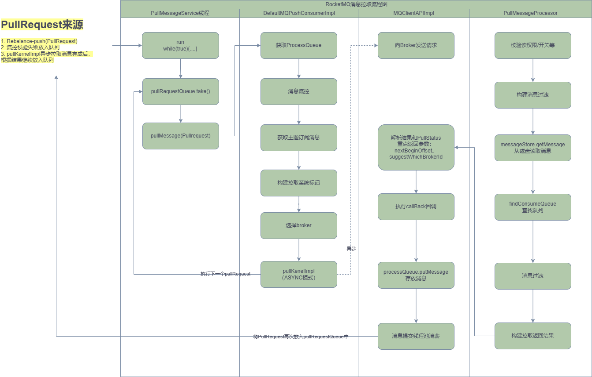

# RocketMQ消息消费原理

> 本文参考转载至《RocketMQ技术内幕 第2版》

## 一. 消息消费概述

消息消费以组的模式开展，一个消费组可以包含多个消费者，每个消费组可以订阅多个主题，消费组之间有集群模式和广播模式两种消费模式。集群模式是当前主题下的同一条消息只允许被其中一个消费者消费。广播模式是当前主题下的同一条消息将被集群内的所有消费者消费一次。

消息服务器与消费者之间的消息传送也有两种方式：推模式和拉模式。所谓的拉模式，是消费端主动发起拉取消息的请求，而推模式是消息到达消息服务器后，再推送给消息消费者。RocketMQ消息推模式基于拉模式实现，在拉模式上包装一层，一个拉取任务完成后开始下一个拉取任务。

集群模式下，多个消费者如何对消息队列进行负载呢？消息队列负载机制遵循一个通用的思想：一个消息队列同一时间只允许被一个消费者消费，一个消费者可以消费多个消息队列。

RocketMQ 支持局部顺序消息消费，也就是保证同一个消息队列上的消息按顺序消费。不支持消息全局顺序消费，如果要实现某一主题的全局顺序消息消费，可以将该主题的队列数设置为1，牺牲高可用性。RocketMQ支持两种消息过滤模式：表达式（TAG、SQL92）与类过滤模式。

消息拉模式主要是由客户端手动调用消息拉取API，而消息推模式是消息服务器主动将消息推送到消息消费端，本章将以推模式为突破 口，重点介绍 RocketMQ 消息消费的实现原理。

### 1.1 消费队列负载机制与重平衡

正如上文提到的，RocketMQ提供了两种消费模式，集群模式与广播模式。广播模式中所有的消费者会消费全部的队列，故没有所谓的消费队列负载问题，而集群模式下需要考虑同一个消费组内的多个消费者之间如何分配队列。

RocketMQ提供了多种队列负载算法，其中比较常用的是AVG、AVG_BY_CIRCLE这两种平均分配算法，例如8个队列分别为b1_q0、 b1_q1、b1_q2、b1_q3、b2_q0、b2_q1、b2_q2、b2_q3，一个消费组有 3个消费者，分别用C1、C2、C3表示。

采用AVG的分配机制，各个消费者分配到的队列如下。

- c1：b1_q0、b1_q1、b1_q2

- c2：b1_q3、b2_q0、b2_q1 

- c3：b2_q2、b2_q3

采用AVG_BY_CIRCLE的分配机制，各个消费者分配到的队列如下。

- c1：b1_q0、b1_q3、b2_q2

- c2：b1_q1、b2_q0 b2_q3 
- c3：b1_q2、b2_q1

这两种分配算法各有使用场景。通常要求发送方发送的消息尽量在各个队列上分布均匀，如果分布均衡，就会使用第一种平均算法。但有些时候，一台Broker上的消息会明显多于第二台，如果使用第一种分配算法，c1消费者处理的消息就太多了，但其他消费者又空闲， 而且还不能通过增加消费者来改变这种情况，此种情况使用AVG_BY_CIRCLE方式更加合适。

**在消费时间过程中可能会遇到消息消费队列增加或减少、消息消费者增加或减少，比如需要对消息消费队列进行重新平衡，即重新分配，这就是所谓的重平衡机制**。在RocketMQ中，每隔20s会根据当前队列数量、消费者数量重新进行队列负载计算，如果计算出来的结果与当前不一样，则触发消息消费队列的重平衡。

### 1.2 并发消费模型

RocketMQ 支持并发消费与顺序消费两种消费方式，消息的拉取与消费模型基本一致，只是顺序消费在某些环节为了保证顺序性，需要引入锁机制，RocketMQ的消息拉取与消费模式如图下图所示：


**一个MQ客户端（MQClientInstance）只会创建一个消息拉取服务线程（PullMessageService）向Broker拉取消息，但是拉取消息网络IO操作是异步的，所以在拉取一个消费队列消息时发生长轮询阻塞并不会影响其它消费队列的消息拉取。PullMessageService会不断获取PullRequest拉取请求，将拉取请求放入IO线程池中后会立即返回（不会等Broker响应），然后继续“不知疲倦”地获取下一个PullRequest拉取请求**。当IO线程收到broker相应后，会执行回调方法，将拉取到的消息提交到消费组的线程池。

RocketMQ客户端为每一个消费组创建独立的消费线程池，即在并发消费模式下，单个消费组内的并发度为线程池线程个数。线程池处理一批消息后会向Broker汇报消息消费进度。

### 1.3 消息消费进度反馈机制

RocketMQ客户端消费一批数据后，需要向Broker反馈消息的消费进度，Broker会记录消息消费进度，这样在客户端重启或队列重平衡时会根据其消费进度重新向Broker拉取消息，消息消费进度反馈机制，如下图所示：


消息消费进度反馈机制核心要点如下。           

1. 消费线程池在处理完一批消息后，会将消息消费进度存储在本地内存中。

2. 客户端会启动一个定时线程，每5s将存储在本地内存中的所有队列消息消费偏移量提交到Broker中。

3. Broker收到的消息消费进度会存储在内存中，每隔5s将消息消费偏移量持久化到磁盘文件中。

4. 在客户端向Broker拉取消息时也会将该队列的消息消费偏移量提交到Broker。

再来思考一个问题，假设线程池中有T1、T2、T3三个线程，此时分别依次获取到msg1、msg2、msg3消息，消息msg3的偏移量大于msg1、msg2的偏移量，由于支持并发消费，如果线程t3先处理完msg3，而t1、t2还未处理，那么线程t3如何提交消费偏移量呢？

试想一下，如果提交msg3的偏移量是作为消费进度被提交，如果此时消费端重启，消息消费msg1、msg2就不会再被消费，这样就会造成“消息丢失”。**因此t3线程并不会提交msg3的偏移量，而是提交线程池中偏移量最小的消息的偏移量，即t3线程在消费完msg3后，提交的消息消费进度依然是msg1的偏移量，这样能避免消息丢失，但同样有消息重复消费的风险**。

## 二. 消息消费者初探

下面我们介绍推模式消费者 MQPushConsumer 的主要属性：

```java
public class DefaultMQPushConsumer extends ClientConfig implements MQPushConsumer {

    private final InternalLogger log = ClientLogger.getLog();

    /**
     * Internal implementation. Most of the functions herein are delegated to it.
     */
    protected final transient DefaultMQPushConsumerImpl defaultMQPushConsumerImpl;

    /**
     * 消费者所属组
     */
    private String consumerGroup;

    /**
     * 消息消费模式，分为集群模式、广播模式，默认为集群模式
     */
    private MessageModel messageModel = MessageModel.CLUSTERING;

    /**
     * 第一次消费时指定消费策略。
     * CONSUME_FROM_LAST_OFFSET：此处分为两种情况，如果磁盘消息未过期且未被删除，则从最小偏移量开始消费。如果磁盘已过期
     * 并被删除，则从最大偏移量开始消费。
     * CONSUME_FROM_FIRST_OFFSET：从队列当前最小偏移量开始消费。
     * CONSUME_FROM_TIMESTAMP：从消费者指定时间戳开始消费。
     *
     * 注意：如果从消息进度服务OffsetStore读取到MessageQueue中的
     * 偏移量不小于0，则使用读取到的偏移量拉取消息，只有在读到的偏移
     * 量小于0时，上述策略才会生效
     */
    private ConsumeFromWhere consumeFromWhere = ConsumeFromWhere.CONSUME_FROM_LAST_OFFSET;

    /**
     * 集群模式下消息队列的负载策略
     */
    private AllocateMessageQueueStrategy allocateMessageQueueStrategy;

    /**
     * 订阅信息
     */
    private Map<String /* topic */, String /* sub expression */> subscription = new HashMap<String, String>();

    /**
     * 消息业务监听器
     */
    private MessageListener messageListener;

    /**
     * 消息消费进度存储器
     */
    private OffsetStore offsetStore;

    /**
     * 消费者最小线程数
     */
    private int consumeThreadMin = 20;

    /**
     * 消费者最大线程数，因为消费者线程池使用无界队列，所以此参数不生效
     */
    private int consumeThreadMax = 20;

    /**
     * Threshold for dynamic adjustment of the number of thread pool
     */
    private long adjustThreadPoolNumsThreshold = 100000;

    /**
     * 并发消息消费时处理队列最大跨度，默认2000，表示如果消息处理队列中偏移量最大的消息
     * 与偏移量最小的消息的跨度超过2000，则延迟50ms后再拉取消息。
     */
    private int consumeConcurrentlyMaxSpan = 2000;

    /**
     * 队列级别的流量控制阈值，默认情况下每个消息队列最多缓存1000条消息;
     */
    private int pullThresholdForQueue = 1000;

    /**
     * 在队列级别限制缓存的消息大小，默认情况下每个消息队列最多缓存100 MiB消息。
     * 考虑{@code pullBatchSize}，瞬时值可能超过限制消息的大小仅由消息体来衡量，因此不准确
     */
    private int pullThresholdSizeForQueue = 100;

    /**
     * 推模式下拉取任务的间隔时间，默认一次拉取任务完成后继续拉取
     */
    private long pullInterval = 0;

    /**
     * 消息并发消费时一次消费消息的条数，通俗点说，就是每次传入MessageListener#consumeMessage中的消息条数
     */
    private int consumeMessageBatchMaxSize = 1;

    /**
     * 每次消息拉取的条数，默认32条
     */
    private int pullBatchSize = 32;

    /**
     * 是否每次拉取消息都更新订阅信息，默认为false
     */
    private boolean postSubscriptionWhenPull = false;
    /**
     * 最大消费重试次数。如果消息消费次数超过maxReconsume Times还未成功，则将该消息转移到一个失败队列，等待被删除
     */
    private int maxReconsumeTimes = -1;

    /**
     * 延迟将该队列的消息提交到消费者线程的等待时间，默认延迟1s。
     */
    private long suspendCurrentQueueTimeMillis = 1000;

    /**
     * 消息消费超时时间，默认为15，单位为分钟
     */
    private long consumeTimeout = 15;

}
```

## 三. 消费者启动流程

本节介绍消息消费者是如何启动的，请跟我一起来分析 `DefaultMQPushConsumerImpl` 的 `start()` 方法：

```java
	// org.apache.rocketmq.client.impl.consumer.DefaultMQPushConsumerImpl#copySubscription
    private void copySubscription() throws MQClientException {
        try {
            Map<String, String> sub = this.defaultMQPushConsumer.getSubscription();
            if (sub != null) {
                for (final Map.Entry<String, String> entry : sub.entrySet()) {
                    final String topic = entry.getKey();
                    final String subString = entry.getValue();
                    SubscriptionData subscriptionData = FilterAPI.buildSubscriptionData(this.defaultMQPushConsumer.getConsumerGroup(),
                        topic, subString);
                    // 构建主题订阅信息SubscriptionData并加入RebalanceImpl的订阅消息中
                    this.rebalanceImpl.getSubscriptionInner().put(topic, subscriptionData);
                }
            }

            if (null == this.messageListenerInner) {
                this.messageListenerInner = this.defaultMQPushConsumer.getMessageListener();
            }

            // 如果是集群消费模式下，还需要将重试Topic的消息放入RebalanceImpl的订阅消息中
            switch (this.defaultMQPushConsumer.getMessageModel()) {
                case BROADCASTING:
                    break;
                case CLUSTERING:
                    // RocketMQ消息重试是以消费组为单位，而不是主题，消息重试主题名为%RETRY%+消费组名
                    final String retryTopic = MixAll.getRetryTopic(this.defaultMQPushConsumer.getConsumerGroup());
                    SubscriptionData subscriptionData = FilterAPI.buildSubscriptionData(this.defaultMQPushConsumer.getConsumerGroup(),
                        retryTopic, SubscriptionData.SUB_ALL);
                    this.rebalanceImpl.getSubscriptionInner().put(retryTopic, subscriptionData);
                    break;
                default:
                    break;
            }
        } catch (Exception e) {
            throw new MQClientException("subscription exception", e);
        }
    }
```

第一步：构建主题订阅信息 SubscriptionData 并加入RebalanceImpl的订阅消息中。订阅关系来源主要有两个。

1. 通过调用DefaultMQPushConsumerImpl#subscribe（String topic, String subExpression）方法获取。
2. 订阅重试主题消息。RocketMQ消息重试是以消费组为单位，而不是主题，消息重试主题名为`%RETRY%+消费组名`。消费者在启动时会自动订阅该主题，参与该主题的消息队列负载。

```java
//org.apache.rocketmq.client.impl.consumer.DefaultMQPushConsumerImpl#start

                if (this.defaultMQPushConsumer.getMessageModel() == MessageModel.CLUSTERING) {
                    this.defaultMQPushConsumer.changeInstanceNameToPID();
                }

                // 创建MQClientInstance实例。单例模式：同一个clientId只会创建一个MQClientInstance实例
                this.mQClientFactory = MQClientManager.getInstance().getOrCreateMQClientInstance(this.defaultMQPushConsumer, this.rpcHook);

                this.rebalanceImpl.setConsumerGroup(this.defaultMQPushConsumer.getConsumerGroup());
                this.rebalanceImpl.setMessageModel(this.defaultMQPushConsumer.getMessageModel());
                this.rebalanceImpl.setAllocateMessageQueueStrategy(this.defaultMQPushConsumer.getAllocateMessageQueueStrategy());
                this.rebalanceImpl.setmQClientFactory(this.mQClientFactory);

                this.pullAPIWrapper = new PullAPIWrapper(
                    mQClientFactory,
                    this.defaultMQPushConsumer.getConsumerGroup(), isUnitMode());
                this.pullAPIWrapper.registerFilterMessageHook(filterMessageHookList);
```

第二步：初始化MQClientInstance、RebalanceImple（消息重新负载实现类）等。

```java
//org.apache.rocketmq.client.impl.consumer.DefaultMQPushConsumerImpl#start 
				// 初始化消息进度
                if (this.defaultMQPushConsumer.getOffsetStore() != null) {
                    this.offsetStore = this.defaultMQPushConsumer.getOffsetStore();
                } else {
                    // 初始化消息进度。如果消息消费采用集群模式，那么消
                    // 息进度存储在Broker上，如果采用广播模式，那么消息消费进度存储
                    // 在消费端
                    switch (this.defaultMQPushConsumer.getMessageModel()) {
                        case BROADCASTING:
                            this.offsetStore = new LocalFileOffsetStore(this.mQClientFactory, this.defaultMQPushConsumer.getConsumerGroup());
                            break;
                        case CLUSTERING:
                            this.offsetStore = new RemoteBrokerOffsetStore(this.mQClientFactory, this.defaultMQPushConsumer.getConsumerGroup());
                            break;
                        default:
                            break;
                    }
                    this.defaultMQPushConsumer.setOffsetStore(this.offsetStore);
                }
                this.offsetStore.load();
```

第三步：始化消息进度。如果消息消费采用集群模式，那么消息进度存储在Broker上，如果采用广播模式，那么消息消费进度存储在消费端。具体实现细节后面将重点探讨。

```java
//org.apache.rocketmq.client.impl.consumer.DefaultMQPushConsumerImpl#start 
                // 如果是顺序消费，创建消费端消费线程服务。ConsumeMessageService主要负责消息消费，在内部维护一个线程池
                if (this.getMessageListenerInner() instanceof MessageListenerOrderly) {
                    // 如果是顺序消费，将 consumeOrderly 置为 true，这样在RebalanceService负载队列时对队列加锁，实现消费端顺序消费，防止多个客户端同时消费同一个队列
                    this.consumeOrderly = true;
                    this.consumeMessageService =
                        new ConsumeMessageOrderlyService(this, (MessageListenerOrderly) this.getMessageListenerInner());
                } else if (this.getMessageListenerInner() instanceof MessageListenerConcurrently) {
                    // 如果是并发消费，则设置 consumeOrderly 为 false，消费时不会对队列进行加锁
                    this.consumeOrderly = false;
                    this.consumeMessageService =
                        new ConsumeMessageConcurrentlyService(this, (MessageListenerConcurrently) this.getMessageListenerInner());
                }

                this.consumeMessageService.start();
```

第四步：如果是顺序消费，创建消费端消费线程服务。ConsumeMessageService主要负责消息消费，在内部维护一个线程池。

```java
//org.apache.rocketmq.client.impl.consumer.DefaultMQPushConsumerImpl#start 
                // 向MQClientInstance注册消费者
                boolean registerOK = mQClientFactory.registerConsumer(this.defaultMQPushConsumer.getConsumerGroup(), this);
                if (!registerOK) {
                    this.serviceState = ServiceState.CREATE_JUST;
                    this.consumeMessageService.shutdown();
                    throw new MQClientException("The consumer group[" + this.defaultMQPushConsumer.getConsumerGroup()
                        + "] has been created before, specify another name please." + FAQUrl.suggestTodo(FAQUrl.GROUP_NAME_DUPLICATE_URL),
                        null);
                }
                // 启动MQClientInstance，JVM中的所有消费者、生产者持有同一个MQClientInstance，MQClientInstance只会启动一次
                mQClientFactory.start();
                log.info("the consumer [{}] start OK.", this.defaultMQPushConsumer.getConsumerGroup());
                this.serviceState = ServiceState.RUNNING;
```

第五步：向MQClientInstance注册消费者并启动MQClientInstance，JVM中的所有消费者、生产者持有同一个MQClientInstance，MQClientInstance只会启动一次。

## 四. 消息拉取

本节将基于推模式详细分析消息拉取机制。消息消费有两种模式：广播模式与集群模式，广播模式比较简单，每一个消费者需要拉取订阅主题下所有消费队列的消息。本节主要基于集群模式进行介绍。在集群模式下，同一个消费组内有多个消息消费者，同一个主题 存在多个消费队列，那么消费者如何进行消息队列负载呢？从第3节介绍的启动流程可知，每一个消费组内维护一个线程池来消费消息，那么这些线程又是如何分工合作的呢？

消息队列负载通常的做法是一个消息队列在同一时间只允许被一个消息消费者消费，一个消息消费者可以同时消费多个消息队列，那么RocketMQ是如何实现消息队列负载的呢？带着上述问题，我们开始RocketMQ消息消费机制的探讨。

从MQClientInstance的启动流程中可以看出，RocketMQ使用一个单独的线程PullMessageService执行消息的拉取。

### 4.1 PullMessageService实现机制

PullMessageService继承的是ServiceThread，从名称来看，它是服务线程，通过run()方法启动：

```java
//org.apache.rocketmq.client.impl.consumer.PullMessageService#run
    @Override
    public void run() {
        log.info(this.getServiceName() + " service started");

        //  while (!this.isStopped()) 是一种通用的设计技巧，Stopped
        // 声明为volatile，每执行一次业务逻辑，检测一下其运行状态，可以
        // 通过其他线程将Stopped设置为true，从而停止该线程
        while (!this.isStopped()) {
            try {
                // 从pullRequestQueue中获取一个PullRequest消息拉取任务，
                // 如果pullRequestQueue为空，则线程将阻塞，直到有拉取任务被放入
                PullRequest pullRequest = this.pullRequestQueue.take();
                this.pullMessage(pullRequest);
            } catch (InterruptedException ignored) {
            } catch (Exception e) {
                log.error("Pull Message Service Run Method exception", e);
            }
        }

        log.info(this.getServiceName() + " service end");
    }
```

PullMessageService消息拉取服务线程，run()方法是其核心逻辑，如代码清单5-7所示。run()方法的核心要点如下。

1. while(!this.isStopped())是一种通用的设计技巧，Stopped 声明为volatile，每执行一次业务逻辑，检测一下其运行状态，可以通过其他线程将Stopped设置为true，从而停止该线程。
2. 从pullRequestQueue中获取一个PullRequest消息拉取任务， 如果pullRequestQueue为空，则线程将阻塞，直到有拉取任务被放入。
3. 调用pullMessage方法进行消息拉取。思考一下，PullRequest 是什么时候添加的呢？

```java
// org.apache.rocketmq.client.impl.consumer.PullMessageService#executePullRequestLater
    public void executePullRequestLater(final PullRequest pullRequest, final long timeDelay) {
        if (!isStopped()) {
            this.scheduledExecutorService.schedule(new Runnable() {
                @Override
                public void run() {
                    PullMessageService.this.executePullRequestImmediately(pullRequest);
                }
            }, timeDelay, TimeUnit.MILLISECONDS);
        } else {
            log.warn("PullMessageServiceScheduledThread has shutdown");
        }
    }
```

原来，PullMessageService提供了延迟添加与立即添加两种方式将PullRequest放入pullRequestQueue。那么PullRequest是在什么时候创建的呢？executePullRequestImmediately方法调用链：


通过跟踪发现，主要有两个地方会调用executePullRequestImmediately：一个是在RocketMQ根据PullRequest拉取任务执行完一次消息拉取任务后，又将PullRequest 对象放入pullRequestQueue；另一个是在RebalanceImpl中创建的。RebalanceImpl是后文要重点介绍的消息队列负载机制，也就是PullRequest对象真正创建的地方。

从上面的分析可知，PullMessageService只有在得到 PullRequest 对象时才会执行拉取任务，那么PullRequest究竟是什么呢？

```java
public class PullRequest {

    /**
     * 消费者组
     */
    private String consumerGroup;
    /**
     * 待拉取消费队列
     */
    private MessageQueue messageQueue;
    /**
     * 消息处理队列，从Broker中拉取到的消息会先存入ProccessQueue，然后再提交到消费者消费线程池进行消费
     */
    private ProcessQueue processQueue;
    /**
     * 待拉取的MessageQueue偏移量
     */
    private long nextOffset;
    /**
     * 是否被锁定
     */
    private boolean lockedFirst = false;
}
```

PullMessageService 会不断拉取队列中的PullRequest请求，去Broker中拉取消息：

```java
// org.apache.rocketmq.client.impl.consumer.PullMessageService#pullMessage
    /**
     * 根据消费组名从MQClientInstance中获取消费者的内部实现类
     * MQConsumerInner，令人意外的是，这里将consumer强制转换为
     * DefaultMQPushConsumerImpl，也就是PullMessageService，该线程只
     * 为推模式服务，那拉模式如何拉取消息呢？其实细想也不难理解，对
     * 于拉模式，RocketMQ只需要提供拉取消息API，再由应用程序调用API
     *
     * @param pullRequest
     */
    private void pullMessage(final PullRequest pullRequest) {
        final MQConsumerInner consumer = this.mQClientFactory.selectConsumer(pullRequest.getConsumerGroup());
        if (consumer != null) {
            DefaultMQPushConsumerImpl impl = (DefaultMQPushConsumerImpl) consumer;
            impl.pullMessage(pullRequest);
        } else {
            log.warn("No matched consumer for the PullRequest {}, drop it", pullRequest);
        }
    }
```

根据消费组名从MQClientInstance中获取消费者的内部实现类MQConsumerInner，令人意外的是，这里将consumer强制转换为DefaultMQPushConsumerImpl，也就是PullMessageService，该线程只为推模式服务，那拉模式如何拉取消息呢？其实细想也不难理解，对 于拉模式，RocketMQ只需要提供拉取消息API，再由应用程序调用 API。

### 4.2 ProcessQueue实现机制

ProcessQueue 是 MessageQueue 在消费端的重现、快照。PullMessageService从消息服务器默认每次拉取32条消息，按消息队列偏移量的顺序存放在ProcessQueue中，PullMessageService将消息提交到消费者消费线程池，消息成功消费后，再从ProcessQueue中移除。

```java
// org.apache.rocketmq.client.impl.consumer.ProcessQueue
/**
 * ProcessQueue是MessageQueue在消费端的重现、快照。
 * PullMessageService从消息服务器默认每次拉取32条消息，按消息队
 * 列偏移量的顺序存放在ProcessQueue中，PullMessageService将消息
 * 提交到消费者消费线程池，消息成功消费后，再从ProcessQueue中移
 * 除。
 * Queue consumption snapshot
 */
public class ProcessQueue {
    /**
     * 读写锁，控制多线程并发修改msgTreeMap
     */
    private final ReadWriteLock lockTreeMap = new ReentrantReadWriteLock();
    /**
     * 消息存储容器，键为消息在ConsumeQueue中的偏移量
     */
    private final TreeMap<Long, MessageExt> msgTreeMap = new TreeMap<Long, MessageExt>();
    /**
     * ProcessQueue中总消息数
     */
    private final AtomicLong msgCount = new AtomicLong();
    private final AtomicLong msgSize = new AtomicLong();
    private final Lock lockConsume = new ReentrantLock();
    /**
     * A subset of msgTreeMap, will only be used when orderly consume
     *
     * 用于存储消息消费队列中正在被顺序消费的消息。其键值对的关系为 Offset -> Message Queue，也就是按照消息在 Broker 中存储的物理偏移量进行排序。
     */
    private final TreeMap<Long, MessageExt> consumingMsgOrderlyTreeMap = new TreeMap<Long, MessageExt>();
    private final AtomicLong tryUnlockTimes = new AtomicLong(0);
    /**
     * 当前ProcessQueue中包含的最大队列偏移量
     */
    private volatile long queueOffsetMax = 0L;
    /**
     * 当前ProccesQueue是否被丢弃
     */
    private volatile boolean dropped = false;
    /**
     * 上一次开始拉取消息的时间戳
     */
    private volatile long lastPullTimestamp = System.currentTimeMillis();
    /**
     * 上一次消费消息的时间戳
     */
    private volatile long lastConsumeTimestamp = System.currentTimeMillis();
}
```

### 4.3 消息拉取的基本流程

本节将以并发消息消费来探讨整个消息消费的流程，消息拉取分为3个主要步骤：

1. 封装拉取请求，并请求broker拉取消息。
2. broker查找消息并返回。
3. 消息拉取客户端处理返回的消息。

#### 4.3.1 客户端封装消息拉取请求

消息拉取入口为DefaultMQPushConsumerImpl#pullMessage：

第一步：从PullRequest中获取ProcessQueue，如果处理队列当前状态未被丢弃，则更新ProcessQueue的lastPullTimestamp为当前时间戳。如果当前消费者被挂起，则将拉取任务延迟1s再放入PullMessageService的拉取任务队列中，最后结束本次消息拉取。

```java
// org.apache.rocketmq.client.impl.consumer.DefaultMQPushConsumerImpl#pullMessage
        final ProcessQueue processQueue = pullRequest.getProcessQueue();
        if (processQueue.isDropped()) {
            log.info("the pull request[{}] is dropped.", pullRequest.toString());
            return;
        }

        pullRequest.getProcessQueue().setLastPullTimestamp(System.currentTimeMillis());

        try {
            this.makeSureStateOK();
        } catch (MQClientException e) {
            log.warn("pullMessage exception, consumer state not ok", e);
            this.executePullRequestLater(pullRequest, pullTimeDelayMillsWhenException);
            return;
        }

        if (this.isPause()) {
            log.warn("consumer was paused, execute pull request later. instanceName={}, group={}", this.defaultMQPushConsumer.getInstanceName(), this.defaultMQPushConsumer.getConsumerGroup());
            this.executePullRequestLater(pullRequest, PULL_TIME_DELAY_MILLS_WHEN_SUSPEND);
            return;
        }
```

第二步：进行消息拉取流控。从消息消费数量与消费间隔两个维度进行控制。

1. 消息处理总数，如果ProcessQueue当前处理的消息条数超过了pullThresholdForQueue=1000，将触发流控，放弃本次拉取任务，并且该队列的下一次拉取任务将在50ms后才加入拉取任务队列。每触发1000次流控后输出提示语：“the consumer message buffer is full, so do flow control, minOffset={队列最小偏移量}, maxOffset={队列最大偏移量}, size={消息总条数}, pullRequest={拉取任务}, flowControlTimes={流控触发次数}”。
2. ProcessQueue 中队列最大偏移量与最小偏离量的间距不能超过 consumeConcurrentlyMaxSpan，否则触发流控。每触发1000次流控后输出提示语：“the queue's messages, span too long, so do flow control, minOffset={队列最小偏移量}, maxOffset={队列最大偏移量}, maxSpan={间隔}, pullRequest={拉取任务信息}, flowControlTimes={流控触发次数}”。这里主要的考量是担心因为一条消息堵塞，使消息进度无法向前推进，可能会造成大量消息重复消费。

```java
// org.apache.rocketmq.client.impl.consumer.DefaultMQPushConsumerImpl#pullMessage
        long cachedMessageCount = processQueue.getMsgCount().get();
        long cachedMessageSizeInMiB = processQueue.getMsgSize().get() / (1024 * 1024);

        // 已缓存消息总数维度的流量控制
        if (cachedMessageCount > this.defaultMQPushConsumer.getPullThresholdForQueue()) {
            // 如果ProcessQueue当前处理的消息条数超过了pullThresholdForQueue=1000，将触发流控，放弃本次拉取任务，并
            // 且该队列的下一次拉取任务将在50ms后才加入拉取任务队列。
            this.executePullRequestLater(pullRequest, PULL_TIME_DELAY_MILLS_WHEN_FLOW_CONTROL);
            if ((queueFlowControlTimes++ % 1000) == 0) {
                log.warn(
                    "the cached message count exceeds the threshold {}, so do flow control, minOffset={}, maxOffset={}, count={}, size={} MiB, pullRequest={}, flowControlTimes={}",
                    this.defaultMQPushConsumer.getPullThresholdForQueue(), processQueue.getMsgTreeMap().firstKey(), processQueue.getMsgTreeMap().lastKey(), cachedMessageCount, cachedMessageSizeInMiB, pullRequest, queueFlowControlTimes);
            }
            return;
        }

        // 缓存消息大小维度的流量控制
        if (cachedMessageSizeInMiB > this.defaultMQPushConsumer.getPullThresholdSizeForQueue()) {
            // 缓存消息的大小不能超过pullThresholdSizeForQueue，否则触发流控
            this.executePullRequestLater(pullRequest, PULL_TIME_DELAY_MILLS_WHEN_FLOW_CONTROL);
            if ((queueFlowControlTimes++ % 1000) == 0) {
                log.warn(
                    "the cached message size exceeds the threshold {} MiB, so do flow control, minOffset={}, maxOffset={}, count={}, size={} MiB, pullRequest={}, flowControlTimes={}",
                    this.defaultMQPushConsumer.getPullThresholdSizeForQueue(), processQueue.getMsgTreeMap().firstKey(), processQueue.getMsgTreeMap().lastKey(), cachedMessageCount, cachedMessageSizeInMiB, pullRequest, queueFlowControlTimes);
            }
            return;
        }
```

第三步：拉取该主题的订阅信息，如果为空则结束本次消息拉取，关于该队列的下一次拉取任务将延迟3s执行。

```java
// org.apache.rocketmq.client.impl.consumer.DefaultMQPushConsumerImpl#pullMessage
        // 获取主题的订阅信息
        final SubscriptionData subscriptionData = this.rebalanceImpl.getSubscriptionInner().get(pullRequest.getMessageQueue().getTopic());
        if (null == subscriptionData) {
            // 拉取该主题的订阅信息，如果为空则结束本次消息拉取，关于该队列的下一次拉取任务将延迟3s执行
            this.executePullRequestLater(pullRequest, pullTimeDelayMillsWhenException);
            log.warn("find the consumer's subscription failed, {}", pullRequest);
            return;
        }
```

第四步：构建消息拉取系统标记。

```java
// org.apache.rocketmq.client.impl.consumer.DefaultMQPushConsumerImpl#pullMessage
        // 是否更新已消费物理偏移量
        boolean commitOffsetEnable = false;
        // 已消费偏移量
        long commitOffsetValue = 0L;
        if (MessageModel.CLUSTERING == this.defaultMQPushConsumer.getMessageModel()) {
            // 如果是集群消费，更新已消费偏移量
            commitOffsetValue = this.offsetStore.readOffset(pullRequest.getMessageQueue(), ReadOffsetType.READ_FROM_MEMORY);
            if (commitOffsetValue > 0) {
                commitOffsetEnable = true;
            }
        }

        String subExpression = null;
        boolean classFilter = false;
        SubscriptionData sd = this.rebalanceImpl.getSubscriptionInner().get(pullRequest.getMessageQueue().getTopic());
        if (sd != null) {
            if (this.defaultMQPushConsumer.isPostSubscriptionWhenPull() && !sd.isClassFilterMode()) {
                subExpression = sd.getSubString();
            }

            classFilter = sd.isClassFilterMode();
        }

        int sysFlag = PullSysFlag.buildSysFlag(
            commitOffsetEnable, // commitOffset
            // 是否开启长轮询
            true, // suspend
            subExpression != null, // subscription
            classFilter // class filter
        );
```

> 如果当前 ConsumerGroup 是集群消费，会将本地的消费进度在拉取请求中上报给Broker。

下面逐一介绍PullSysFlag的枚举值含义:

```java
// org.apache.rocketmq.common.sysflag.PullSysFlag
public class PullSysFlag {

    /**
     * 是否更新已消费偏移量
     */
    private final static int FLAG_COMMIT_OFFSET = 0x1;
    /**
     * 表示消息拉取时是否支持挂起（长轮询）
     */
    private final static int FLAG_SUSPEND = 0x1 << 1;
    /**
     * 消息过滤机制为表达式，则设置该标记位
     */
    private final static int FLAG_SUBSCRIPTION = 0x1 << 2;
    /**
     * 消息过滤机制为类模式，则设置该标记
     */
    private final static int FLAG_CLASS_FILTER = 0x1 << 3;
}
```

第五步：调用PullAPIWrapper.pullKernelImpl方法后与服务端交互。

```java
// org.apache.rocketmq.client.impl.consumer.DefaultMQPushConsumerImpl#pullMessage
        try {
            // 通过远程调用，从broker中拉取消息。拉取成功后，调用 pullCallback.onSuccess 方法
            this.pullAPIWrapper.pullKernelImpl(
                // 需要拉取的消息队列信息
                pullRequest.getMessageQueue(),
                // 消息过滤表达式
                subExpression,
                subscriptionData.getExpressionType(),
                subscriptionData.getSubVersion(),
                // 拉取的物理偏移量
                pullRequest.getNextOffset(),
                // 拉取的消息数量
                this.defaultMQPushConsumer.getPullBatchSize(),
                sysFlag,
                // 已消费偏移量
                commitOffsetValue,
                BROKER_SUSPEND_MAX_TIME_MILLIS,
                CONSUMER_TIMEOUT_MILLIS_WHEN_SUSPEND,
                CommunicationMode.ASYNC,
                pullCallback
            );
        } catch (Exception e) {
            log.error("pullKernelImpl exception", e);
            this.executePullRequestLater(pullRequest, pullTimeDelayMillsWhenException);
        }
```

pullKernelImpl 方法的参数：

1. MessageQueue mq：从哪个消息消费队列拉取消息。
2. String subExpression：消息过滤表达式。
3. String expressionType：消息表达式类型，分为TAG、SQL92。
4. long offset：消息拉取偏移量。
5. int maxNums：本次拉取最大消息条数，默认32条。
6. int sysFlag：拉取系统标记。
7. long commitOffset：当前MessageQueue的消费进度（内存中）。
8. long brokerSuspendMaxTimeMillis：消息拉取过程中允许Broker挂起的时间，默认15s。
9. long timeoutMillis：消息拉取超时时间。
10. CommunicationMode communicationMode：消息拉取模式，默认为异步拉取。
11. PullCallback pullCallback：从Broker拉取到消息后的回调方法。

第六步：根据brokerName、BrokerId从MQClientInstance中获取Broker地址，在整个RocketMQ Broker的部署结构中，相同名称的Broker构成主从结构，其BrokerId会不一样，在每次拉取消息后，会给出一个建议，下次是从主节点还是从节点拉取：

```java
// org.apache.rocketmq.client.impl.consumer.PullAPIWrapper#pullKernelImpl
            // 根据brokerName、BrokerId从MQClientInstance中获取
            //Broker地址，在整个RocketMQ Broker的部署结构中，相同名称的
            //Broker构成主从结构，其BrokerId会不一样，在每次拉取消息后，会
            //给出一个建议，下次是从主节点还是从节点拉取
            this.mQClientFactory.findBrokerAddressInSubscribe(mq.getBrokerName(),
                this.recalculatePullFromWhichNode(mq), false);
        if (null == findBrokerResult) {
            this.mQClientFactory.updateTopicRouteInfoFromNameServer(mq.getTopic());
            findBrokerResult =
                this.mQClientFactory.findBrokerAddressInSubscribe(mq.getBrokerName(),
                    this.recalculatePullFromWhichNode(mq), false);
        }
```

第七步：如果消息过滤模式为类过滤，则需要根据主题名称、broker地址找到注册在Broker上的FilterServer地址，从FilterServer上拉取消息，否则从Broker上拉取消息。上述步骤完成后，RocketMQ通过MQClientAPIImpl#pullMessageAsync方法异步向Broker拉取消息。

```java
// org.apache.rocketmq.client.impl.consumer.PullAPIWrapper#pullKernelImpl
        if (findBrokerResult != null) {
            {
                // check version
                if (!ExpressionType.isTagType(expressionType)
                    && findBrokerResult.getBrokerVersion() < MQVersion.Version.V4_1_0_SNAPSHOT.ordinal()) {
                    throw new MQClientException("The broker[" + mq.getBrokerName() + ", "
                        + findBrokerResult.getBrokerVersion() + "] does not upgrade to support for filter message by " + expressionType, null);
                }
            }
            int sysFlagInner = sysFlag;

            if (findBrokerResult.isSlave()) {
                sysFlagInner = PullSysFlag.clearCommitOffsetFlag(sysFlagInner);
            }

            PullMessageRequestHeader requestHeader = new PullMessageRequestHeader();
            // 消费组名称
            requestHeader.setConsumerGroup(this.consumerGroup);
            // topic名称
            requestHeader.setTopic(mq.getTopic());
            // 队列ID
            requestHeader.setQueueId(mq.getQueueId());
            // 队列的偏移量
            requestHeader.setQueueOffset(offset);
            // 拉取的消息数量
            requestHeader.setMaxMsgNums(maxNums);
            // 消息拉取的标识位，参考：org.apache.rocketmq.common.sysflag.PullSysFlag
            requestHeader.setSysFlag(sysFlagInner);
            // 已经消费完成的消息偏移量
            requestHeader.setCommitOffset(commitOffset);
            requestHeader.setSuspendTimeoutMillis(brokerSuspendMaxTimeMillis);
            requestHeader.setSubscription(subExpression);
            requestHeader.setSubVersion(subVersion);
            requestHeader.setExpressionType(expressionType);

            String brokerAddr = findBrokerResult.getBrokerAddr();
            if (PullSysFlag.hasClassFilterFlag(sysFlagInner)) {
                brokerAddr = computPullFromWhichFilterServer(mq.getTopic(), brokerAddr);
            }

            PullResult pullResult = this.mQClientFactory.getMQClientAPIImpl().pullMessage(
                brokerAddr,
                requestHeader,
                timeoutMillis,
                communicationMode,
                pullCallback);

            return pullResult;
        }
```

#### 4.3.2 Broker组装消息

根据消息拉取命令 `RequestCode.PULL_MESSAGE`，很容易找到 Brokder 端处理消息拉取的入口： `org.apache.rocketmq.broker.processor.PullMessageProcessor#processRequest`

第一步：根据订阅信息构建消息过滤器

```java
// org.apache.rocketmq.broker.processor.PullMessageProcessor#processRequest(io.netty.channel.Channel, org.apache.rocketmq.remoting.protocol.RemotingCommand, boolean)
        // 构建消息过滤器
        MessageFilter messageFilter;
        if (this.brokerController.getBrokerConfig().isFilterSupportRetry()) {
            //表示支持对重试topic的属性进行过滤
            messageFilter = new ExpressionForRetryMessageFilter(subscriptionData, consumerFilterData,
                this.brokerController.getConsumerFilterManager());
        } else {
            // 表示不支持对重试topic的属性进行过滤
            messageFilter = new ExpressionMessageFilter(subscriptionData, consumerFilterData,
                this.brokerController.getConsumerFilterManager());
        }
```

第二步：调用MessageStore.getMessage查找消息

```java
// org.apache.rocketmq.broker.processor.PullMessageProcessor#processRequest(io.netty.channel.Channel, org.apache.rocketmq.remoting.protocol.RemotingCommand, boolean)
        // 读取broker中存储的消息
        final GetMessageResult getMessageResult =
            this.brokerController.getMessageStore().getMessage(requestHeader.getConsumerGroup(), requestHeader.getTopic(),
                requestHeader.getQueueId(), requestHeader.getQueueOffset(), requestHeader.getMaxMsgNums(), messageFilter);
```

该方法参数含义如下：

1. String group：消费组名称。
2. String topic：主题名称。
3. int queueId：队列ID。
4. long offset：待拉取偏移量。
5. int maxMsgNums：最大拉取消息条数。
6. MessageFilter messageFilter：消息过滤器。

第三步：根据主题名称与队列编号获取消息消费队列

```java
//org.apache.rocketmq.store.DefaultMessageStore#getMessage
        long beginTime = this.getSystemClock().now();

        GetMessageStatus status = GetMessageStatus.NO_MESSAGE_IN_QUEUE;
        // 待查找队列的偏移量
        long nextBeginOffset = offset;
        // 当前消息队列的最小偏移量
        long minOffset = 0;
        // 当前消息队列的最大偏移量
        long maxOffset = 0;
```

1. nextBeginOffset：待查找队列的偏移量。
2. minOffset：当前消息队列的最小偏移量。
3. maxOffset：当前消息队列的最大偏移量。
4. maxOffsetPy：当前CommitLog文件的最大偏移量。

第四步：消息偏移量异常情况校对下一次拉取偏移量：

```java
//org.apache.rocketmq.store.DefaultMessageStore#getMessage
    GetMessageResult getResult = new GetMessageResult();

        // 当前CommitLog文件的最大偏移量
        final long maxOffsetPy = this.commitLog.getMaxOffset();

        ConsumeQueue consumeQueue = findConsumeQueue(topic, queueId);
        if (consumeQueue != null) {
            minOffset = consumeQueue.getMinOffsetInQueue();
            maxOffset = consumeQueue.getMaxOffsetInQueue();

            if (maxOffset == 0) {
                //表示当前消费队列中没有消息，拉取结果为
                //NO_MESSAGE_IN_QUEUE。如果当前Broker为主节点，下次拉取偏移量为
                //0。如果当前Broker为从节点并且offsetCheckInSlave为true，设置下
                //次拉取偏移量为0。其他情况下次拉取时使用原偏移量
                status = GetMessageStatus.NO_MESSAGE_IN_QUEUE;
                nextBeginOffset = nextOffsetCorrection(offset, 0);
            } else if (offset < minOffset) {
                //表示待拉取消息偏移量小于队列的起始偏
                //移量，拉取结果为OFFSET_TOO_SMALL。如果当前Broker为主节点，下
                //次拉取偏移量为队列的最小偏移量。如果当前Broker为从节点并且
                //offsetCheckInSlave为true，下次拉取偏移量为队列的最小偏移量。
                //其他情况下次拉取时使用原偏移量。
                status = GetMessageStatus.OFFSET_TOO_SMALL;
                nextBeginOffset = nextOffsetCorrection(offset, minOffset);
            } else if (offset == maxOffset) {
                // 如果待拉取偏移量等于队列最大偏移
                //量，拉取结果为OFFSET_OVERFLOW_ONE，则下次拉取偏移量依然为
                //offset。
                status = GetMessageStatus.OFFSET_OVERFLOW_ONE;
                nextBeginOffset = nextOffsetCorrection(offset, offset);
            } else if (offset > maxOffset) {
                // 表示偏移量越界，拉取结果为
                //OFFSET_OVERFLOW_BADLY。此时需要考虑当前队列的偏移量是否为0，
                //如果当前队列的最小偏移量为0，则使用最小偏移量纠正下次拉取偏移
                //量。如果当前队列的最小偏移量不为0，则使用该队列的最大偏移量来
                //纠正下次拉取偏移量
                status = GetMessageStatus.OFFSET_OVERFLOW_BADLY;
                if (0 == minOffset) {
                    nextBeginOffset = nextOffsetCorrection(offset, minOffset);
                } else {
                    nextBeginOffset = nextOffsetCorrection(offset, maxOffset);
                }
            }
```

1. maxOffset=0：表示当前消费队列中没有消息，拉取结果为NO_MESSAGE_IN_QUEUE。如果当前Broker为主节点，下次拉取偏移量为 0。如果当前Broker为从节点并且offsetCheckInSlave为true，设置下次拉取偏移量为0。其他情况下次拉取时使用原偏移量。
2. offset<minOffset：表示待拉取消息偏移量小于队列的起始偏移量，拉取结果为OFFSET_TOO_SMALL。如果当前Broker为主节点，下 次拉取偏移量为队列的最小偏移量。如果当前Broker为从节点并且offsetCheckInSlave为true，下次拉取偏移量为队列的最小偏移量。 其他情况下次拉取时使用原偏移量。
3. offset==maxOffset：如果待拉取偏移量等于队列最大偏移量，拉取结果为OFFSET_OVERFLOW_ONE，则下次拉取偏移量依然为offset。
4. offset>maxOffset：表示偏移量越界，拉取结果为OFFSET_OVERFLOW_BADLY。此时需要考虑当前队列的偏移量是否为0， 如果当前队列的最小偏移量为0，则使用最小偏移量纠正下次拉取偏移量。如果当前队列的最小偏移量不为0，则使用该队列的最大偏移量来纠正下次拉取偏移量。纠正逻辑与1）、2）相同。

第五步：如果待拉取偏移量大于minOffset并且小于maxOffset，从当前offset处尝试拉取32条消息。

 ```java
 //org.apache.rocketmq.store.DefaultMessageStore#getMessage
                 SelectMappedBufferResult bufferConsumeQueue = consumeQueue.getIndexBuffer(offset);
                 if (bufferConsumeQueue != null) {
                     try {
                         status = GetMessageStatus.NO_MATCHED_MESSAGE;
 
                         long nextPhyFileStartOffset = Long.MIN_VALUE;
                         long maxPhyOffsetPulling = 0;
 
                         int i = 0;
                         final int maxFilterMessageCount = Math.max(16000, maxMsgNums * ConsumeQueue.CQ_STORE_UNIT_SIZE);
                         final boolean diskFallRecorded = this.messageStoreConfig.isDiskFallRecorded();
                         ConsumeQueueExt.CqExtUnit cqExtUnit = new ConsumeQueueExt.CqExtUnit();
                         for (; i < bufferConsumeQueue.getSize() && i < maxFilterMessageCount; i += ConsumeQueue.CQ_STORE_UNIT_SIZE) {
                             // 消息物理偏移量
                             long offsetPy = bufferConsumeQueue.getByteBuffer().getLong();
                             // 消息长度
                             int sizePy = bufferConsumeQueue.getByteBuffer().getInt();
                             // 消息TAG的hash码
                             long tagsCode = bufferConsumeQueue.getByteBuffer().getLong();
 
                             maxPhyOffsetPulling = offsetPy;
 
                             if (nextPhyFileStartOffset != Long.MIN_VALUE) {
                                 if (offsetPy < nextPhyFileStartOffset)
                                     continue;
                             }
 
                             boolean isInDisk = checkInDiskByCommitOffset(offsetPy, maxOffsetPy);
 
                             if (this.isTheBatchFull(sizePy, maxMsgNums, getResult.getBufferTotalSize(), getResult.getMessageCount(),
                                 isInDisk)) {
                                 break;
                             }
 
                             boolean extRet = false, isTagsCodeLegal = true;
                             if (consumeQueue.isExtAddr(tagsCode)) {
                                 extRet = consumeQueue.getExt(tagsCode, cqExtUnit);
                                 if (extRet) {
                                     tagsCode = cqExtUnit.getTagsCode();
                                 } else {
                                     // can't find ext content.Client will filter messages by tag also.
                                     log.error("[BUG] can't find consume queue extend file content!addr={}, offsetPy={}, sizePy={}, topic={}, group={}",
                                         tagsCode, offsetPy, sizePy, topic, group);
                                     isTagsCodeLegal = false;
                                 }
                             }
 
                             // 对消息TAG的Hash码进行比对，如果未匹配，则继续拉取下一条消息
                             if (messageFilter != null
                                 && !messageFilter.isMatchedByConsumeQueue(isTagsCodeLegal ? tagsCode : null, extRet ? cqExtUnit : null)) {
                                 if (getResult.getBufferTotalSize() == 0) {
                                     status = GetMessageStatus.NO_MATCHED_MESSAGE;
                                 }
 
                                 continue;
                             }
 
                             SelectMappedBufferResult selectResult = this.commitLog.getMessage(offsetPy, sizePy);
                             if (null == selectResult) {
                                 if (getResult.getBufferTotalSize() == 0) {
                                     status = GetMessageStatus.MESSAGE_WAS_REMOVING;
                                 }
 
                                 nextPhyFileStartOffset = this.commitLog.rollNextFile(offsetPy);
                                 continue;
                             }
 
                             // 对消息属性进行SQL92过滤，此种过滤方式会反序列化消息内容，性能相对TAG过滤会差一点
                             if (messageFilter != null
                                 && !messageFilter.isMatchedByCommitLog(selectResult.getByteBuffer().slice(), null)) {
                                 if (getResult.getBufferTotalSize() == 0) {
                                     status = GetMessageStatus.NO_MATCHED_MESSAGE;
                                 }
                                 // release...
                                 selectResult.release();
                                 continue;
                             }
 
                             this.storeStatsService.getGetMessageTransferedMsgCount().incrementAndGet();
                             getResult.addMessage(selectResult);
                             status = GetMessageStatus.FOUND;
                             nextPhyFileStartOffset = Long.MIN_VALUE;
                         }
 
                         if (diskFallRecorded) {
                             long fallBehind = maxOffsetPy - maxPhyOffsetPulling;
                             brokerStatsManager.recordDiskFallBehindSize(group, topic, queueId, fallBehind);
                         }
 
                         nextBeginOffset = offset + (i / ConsumeQueue.CQ_STORE_UNIT_SIZE);
 
                         // diff：是 maxOffsetPy 和 maxPhyOffsetPulling 两者的差值，表示还有多少消息没有拉取
                         long diff = maxOffsetPy - maxPhyOffsetPulling;
                         // StoreUtil.TOTAL_PHYSICAL_MEMORY_SIZE：表示当前 Master Broker 全部的物理内存大小。
                         long memory = (long) (StoreUtil.TOTAL_PHYSICAL_MEMORY_SIZE
                             * (this.messageStoreConfig.getAccessMessageInMemoryMaxRatio() / 100.0));
                         // 如果消息堆积大于内存 40% 则建议从Slave Broker拉取消息（实现读写分离）
                         getResult.setSuggestPullingFromSlave(diff > memory);
 ```

第六步：根据PullResult填充responseHeader的NextBeginOffset、MinOffset、MaxOffset。

```java
//org.apache.rocketmq.broker.processor.PullMessageProcessor#processRequest(io.netty.channel.Channel, org.apache.rocketmq.remoting.protocol.RemotingCommand, boolean)
            response.setRemark(getMessageResult.getStatus().name());
            responseHeader.setNextBeginOffset(getMessageResult.getNextBeginOffset());
            responseHeader.setMinOffset(getMessageResult.getMinOffset());
            responseHeader.setMaxOffset(getMessageResult.getMaxOffset());
```

第七步：根据主从同步延迟，如果从节点数据包含下一次拉取的偏移量，则设置下一次拉取任务的brokerId。

```java
//org.apache.rocketmq.broker.processor.PullMessageProcessor#processRequest(io.netty.channel.Channel, org.apache.rocketmq.remoting.protocol.RemotingCommand, boolean)
            if (getMessageResult.isSuggestPullingFromSlave()) {
                responseHeader.setSuggestWhichBrokerId(subscriptionGroupConfig.getWhichBrokerWhenConsumeSlowly());
            } else {
                responseHeader.setSuggestWhichBrokerId(MixAll.MASTER_ID);
            }
```

第八步：GetMessageResult与Response进行状态编码转换。

```java
//org.apache.rocketmq.broker.processor.PullMessageProcessor#processRequest(io.netty.channel.Channel, org.apache.rocketmq.remoting.protocol.RemotingCommand, boolean)
            switch (getMessageResult.getStatus()) {
                case FOUND:
                    response.setCode(ResponseCode.SUCCESS);
                    break;
                case MESSAGE_WAS_REMOVING:
                    response.setCode(ResponseCode.PULL_RETRY_IMMEDIATELY);
                    break;
                case NO_MATCHED_LOGIC_QUEUE:
                case NO_MESSAGE_IN_QUEUE:
                    if (0 != requestHeader.getQueueOffset()) {
                        response.setCode(ResponseCode.PULL_OFFSET_MOVED);

                        // XXX: warn and notify me
                        log.info("the broker store no queue data, fix the request offset {} to {}, Topic: {} QueueId: {} Consumer Group: {}",
                            requestHeader.getQueueOffset(),
                            getMessageResult.getNextBeginOffset(),
                            requestHeader.getTopic(),
                            requestHeader.getQueueId(),
                            requestHeader.getConsumerGroup()
                        );
                    } else {
                        response.setCode(ResponseCode.PULL_NOT_FOUND);
                    }
                    break;
                case NO_MATCHED_MESSAGE:
                    response.setCode(ResponseCode.PULL_RETRY_IMMEDIATELY);
                    break;
                case OFFSET_FOUND_NULL:
                    response.setCode(ResponseCode.PULL_NOT_FOUND);
                    break;
                case OFFSET_OVERFLOW_BADLY:
                    response.setCode(ResponseCode.PULL_OFFSET_MOVED);
                    // XXX: warn and notify me
                    log.info("the request offset: {} over flow badly, broker max offset: {}, consumer: {}",
                        requestHeader.getQueueOffset(), getMessageResult.getMaxOffset(), channel.remoteAddress());
                    break;
                case OFFSET_OVERFLOW_ONE:
                    response.setCode(ResponseCode.PULL_NOT_FOUND);
                    break;
                case OFFSET_TOO_SMALL:
                    response.setCode(ResponseCode.PULL_OFFSET_MOVED);
                    log.info("the request offset too small. group={}, topic={}, requestOffset={}, brokerMinOffset={}, clientIp={}",
                        requestHeader.getConsumerGroup(), requestHeader.getTopic(), requestHeader.getQueueOffset(),
                        getMessageResult.getMinOffset(), channel.remoteAddress());
                    break;
                default:
                    assert false;
                    break;
            }
```

GetMessageStatus和ResponseCode转换关系：

| ResponseCode           | GetMessageStatus                                             |
| ---------------------- | ------------------------------------------------------------ |
| SUCCESS                | FOUND                                                        |
| PULL_RETRY_IMMEDIATELY | NO_MATCHED_MESSAGE、MESSAGE_WAS_REMOVING（消息存在下一个CommitLog里） |
| PULL_NOT_FOUND         | NO_MESSAGE_IN_QUEUE（队列中未包含消息）、NO_MATCHED_LOGIC_QUEUE（未找到队列）、OFFSET_FOUND_NULL、OFFSET_OVERFLOW_ONE（offset刚好等于当前最大的offset） |
| PULL_OFFSET_MOVED      | NO_MESSAGE_IN_QUEUE（队列中未包含消息）、NO_MATCHED_LOGIC_QUEUE（未找到队列）、OFFSET_OVERFLOW_BADLY（offset越界）、OFFSET_TOO_SMALL（offset不在队列中） |

第九步：**如果CommitLog标记为可用并且当前节点为主节点，则更新消息消费进度，消费进度将先存储在Broker内存中，由定时任务将消费进度写入Broker本地的JSON文件中**。

```java
//org.apache.rocketmq.broker.processor.PullMessageProcessor#processRequest(io.netty.channel.Channel, org.apache.rocketmq.remoting.protocol.RemotingCommand, boolean)
        boolean storeOffsetEnable = brokerAllowSuspend;
        storeOffsetEnable = storeOffsetEnable && hasCommitOffsetFlag;
        storeOffsetEnable = storeOffsetEnable
            && this.brokerController.getMessageStoreConfig().getBrokerRole() != BrokerRole.SLAVE;
        if (storeOffsetEnable) {
            //如果CommitLog标记为可用并且当前节点为主节点，则更新消息消费进度，
            this.brokerController.getConsumerOffsetManager().commitOffset(RemotingHelper.parseChannelRemoteAddr(channel),
                requestHeader.getConsumerGroup(), requestHeader.getTopic(), requestHeader.getQueueId(), requestHeader.getCommitOffset());
        }
```

服务端消息拉取处理完毕，将返回结果拉取到消息调用方。在调用方，需要重点关注PULL_RETRY_IMMEDIATELY、PULL_OFFSET_MOVED、PULL_NOT_FOUND等情况下如何校正拉取偏移量。

#### 4.3.3 消息拉取客户端处理消息

回到消息拉取客户端调用入口：`MQClientAPIImpl#pullMessageAsync`

第一步：根据响应结果解码成PullResultExt对象，此时只是从网络中读取消息列表中的byte[] messageBinary属性

```java
// org.apache.rocketmq.client.impl.MQClientAPIImpl#processPullResponse
    private PullResult processPullResponse(
        final RemotingCommand response) throws MQBrokerException, RemotingCommandException {
        PullStatus pullStatus = PullStatus.NO_NEW_MSG;
        switch (response.getCode()) {
            case ResponseCode.SUCCESS:
                pullStatus = PullStatus.FOUND;
                break;
            case ResponseCode.PULL_NOT_FOUND:
                pullStatus = PullStatus.NO_NEW_MSG;
                break;
            case ResponseCode.PULL_RETRY_IMMEDIATELY:
                pullStatus = PullStatus.NO_MATCHED_MSG;
                break;
            case ResponseCode.PULL_OFFSET_MOVED:
                pullStatus = PullStatus.OFFSET_ILLEGAL;
                break;

            default:
                throw new MQBrokerException(response.getCode(), response.getRemark());
        }
```

NettyRemotingClient在收到服务端响应结构后，会回调PullCallback的onSuccess或onException，PullCallBack对象在DefaultMQPushConsumerImpl#pullMessage中创建。

第二步：调用pullAPIWrapper的processPullResult，将消息字节数组解码成消息列表并填充msgFoundList，对消息进行消息过滤（TAG 模式）

```java
// org.apache.rocketmq.client.impl.consumer.DefaultMQPushConsumerImpl#pullMessage
                    pullResult = DefaultMQPushConsumerImpl.this.pullAPIWrapper.processPullResult(pullRequest.getMessageQueue(), pullResult,
                        subscriptionData);
```

接下来按照正常流程，即分析拉取结果为PullStatus.FOUND（找到对应的消息）的情况来分析整个消息拉取过程。

```java
// org.apache.rocketmq.client.impl.consumer.DefaultMQPushConsumerImpl#pullMessage
                    switch (pullResult.getPullStatus()) {
                        case FOUND:
                            // 获取到了消息
                            long prevRequestOffset = pullRequest.getNextOffset();
                            pullRequest.setNextOffset(pullResult.getNextBeginOffset());
                            long pullRT = System.currentTimeMillis() - beginTimestamp;
                            DefaultMQPushConsumerImpl.this.getConsumerStatsManager().incPullRT(pullRequest.getConsumerGroup(),
                                pullRequest.getMessageQueue().getTopic(), pullRT);

                            long firstMsgOffset = Long.MAX_VALUE;
                            if (pullResult.getMsgFoundList() == null || pullResult.getMsgFoundList().isEmpty()) {
                                // 如果msgFoundList为空，则立即将PullReqeuest放入PullMessageService的pullRequestQueue，
                                // 以便PullMessageSerivce能及时唤醒并再次执行消息拉取

                                // 为什么PullResult.msgFoundList
                                //还会为空呢？因为RocketMQ根据TAG进行消息过滤时，在服务端只是验
                                //证了TAG的哈希码，所以客户端再次对消息进行过滤时，可能会出现
                                //msgFoundList为空的情况
                                DefaultMQPushConsumerImpl.this.executePullRequestImmediately(pullRequest);
                            } else {
                                firstMsgOffset = pullResult.getMsgFoundList().get(0).getQueueOffset();

                                DefaultMQPushConsumerImpl.this.getConsumerStatsManager().incPullTPS(pullRequest.getConsumerGroup(),
                                    pullRequest.getMessageQueue().getTopic(), pullResult.getMsgFoundList().size());

                                // 将消息存入processQueue
                                boolean dispatchToConsume = processQueue.putMessage(pullResult.getMsgFoundList());

                                // 然后将拉取到的消息提交到Consume MessageService中供消费者消费
                                DefaultMQPushConsumerImpl.this.consumeMessageService.submitConsumeRequest(
                                    pullResult.getMsgFoundList(),
                                    processQueue,
                                    pullRequest.getMessageQueue(),
                                    dispatchToConsume);

                                if (DefaultMQPushConsumerImpl.this.defaultMQPushConsumer.getPullInterval() > 0) {
                                    DefaultMQPushConsumerImpl.this.executePullRequestLater(pullRequest,
                                        DefaultMQPushConsumerImpl.this.defaultMQPushConsumer.getPullInterval());
                                } else {
                                    DefaultMQPushConsumerImpl.this.executePullRequestImmediately(pullRequest);
                                }
                            }

                            if (pullResult.getNextBeginOffset() < prevRequestOffset
                                || firstMsgOffset < prevRequestOffset) {
                                log.warn(
                                    "[BUG] pull message result maybe data wrong, nextBeginOffset: {} firstMsgOffset: {} prevRequestOffset: {}",
                                    pullResult.getNextBeginOffset(),
                                    firstMsgOffset,
                                    prevRequestOffset);
                            }

                            break;
```

1. 更新PullRequest的下一次拉取偏移量，如果msgFoundList为空，则立即将PullReqeuest放入PullMessageService 的pullRequestQueue，以便PullMessageSerivce能及时唤醒并再次执行消息拉取。为什么PullStatus.msgFoundList 还会为空呢？因为RocketMQ根据TAG进行消息过滤时，在服务端只是验证了TAG的哈希码，所以客户端再次对消息进行过滤时，可能会出现msgFoundList为空的情况。
2. 将拉取到的消息存入ProcessQueue，然后将拉取到的消息提交到ConsumeMessageService中供消费者消费。该方法是一个异步方法，也就是PullCallBack将消息提交到ConsumeMessageService中就会立即返回，至于这些消息如何消费，PullCallBack不会关注。
3. 将消息提交给消费者线程之后，PullCallBack将立即返回，可以说本次消息拉取顺利完成。然后查看pullInterval参数，如果pullInterval>0，则等待pullInterval毫秒后将PullRequest对象放入PullMessageService的pullRequestQueue中，该消息队列的下次拉 取即将被激活，达到持续消息拉取，实现准实时拉取消息的效果。

再来分析消息拉取异常处理是如何校对拉取偏移量。

1. **NO_NEW_MSG、NO_MATCHED_MSG**

如果返回NO_NEW_MSG（没有新消息）、NO_MATCHED_MSG（没有匹配消息），则直接使用服务器端校正的偏移量进行下一次消息的拉

取：

```java
// org.apache.rocketmq.client.impl.consumer.DefaultMQPushConsumerImpl#pullMessage
                        case NO_NEW_MSG:
                            pullRequest.setNextOffset(pullResult.getNextBeginOffset());

                            DefaultMQPushConsumerImpl.this.correctTagsOffset(pullRequest);

                            DefaultMQPushConsumerImpl.this.executePullRequestImmediately(pullRequest);
                            break;
                        case NO_MATCHED_MSG:
                            pullRequest.setNextOffset(pullResult.getNextBeginOffset());

                            DefaultMQPushConsumerImpl.this.correctTagsOffset(pullRequest);

                            DefaultMQPushConsumerImpl.this.executePullRequestImmediately(pullRequest);
                            break;
```

再来看服务端如何校正Offset:

NO_NEW_MSG 对应 GetMessageResult.OFFSET_FOUND_NULL、GetMessageResult.OFFSET_OVERFLOW_ONE。

OFFSET_OVERFLOW_ONE表示待拉取消息的物理偏移量等于消息队列最大的偏移量，如果有新的消息到达，此时会创建一个新的ConsumeQueue文件，因为上一个ConsueQueue文件的最大偏移量就是下一个文件的起始偏移量，所以可以按照该物理偏移量第二次拉取消息。

OFFSET_FOUND_NULL表示根据ConsumeQueue文件的偏移量没有找到内容，使用偏移量定位到下一个ConsumeQueue文件，其实就是offset+（一个ConsumeQueue文件包含多少个条目=MappedFileSize/20）。

2. **OFFSET_ILLEGAL**

如果拉取结果显示偏移量非法，首先将ProcessQueue的dropped设为true，表示丢弃该消费队列，意味着ProcessQueue中拉取的消息将停止消费，然后根据服务端下一次校对的偏移量尝试更新消息消费进度（内存中），然后尝试持久化消息消费进度，并将该消息队列从RebalacnImpl的处理队列中移除，意味着暂停该消息队列的消息拉取，等待下一次消息队列重新负载。OFFSET_ILLEGAL对应服务端GetMessageResult状态的NO_MATCHED_LOGIC_QUEUE、NO_MESSAGE_IN_QUEUE、OFFSET_OVERFLOW_BADLY、OFFSET_TOO_SMALL，这些状态服务端偏移量校正基本上使用原偏移量，在客户端更新消息消费进度时只有当消息进度比当前消费进度大才会覆盖，以此保证消息进度的准确性。



#### 4.3.4 消息拉取长轮询机制分析

RocketMQ 并没有真正实现推模式，而是消费者主动向消息服务器拉取消息，RocketMQ 推模式是循环向消息服务端发送消息拉取请求，如果消息消费者向 RocketMQ 发送消息拉取时，消息并未到达消费队列，且未启用长轮询机制，则会在服务端等待 `shortPollingTimeMills` 时间后（挂起），再去判断消息是否已到达消息队列。如果消息未到达，则提示消息拉取客户端 `PULL_NOT_FOUND`（消息不存在），如果开启长轮询模式，RocketMQ 一方面会每 5s 轮询检查一次消息是否可达，同时一有新消息到达后，立即通知挂起线程再次验证新消息是否是自己感兴趣的，如果是则从 `CommitLog` 文件提取消息返回给消息拉取客户端，否则挂起超时，超时时间由消息拉取方在消息拉取时封装在请求参数中，推模式默认为15s，拉模式通过 `DefaultMQPullConsumer#setBrokerSuspendMaxTimeMillis` 进行设置。RocketMQ 通过在 Broker 端配置 longPollingEnable 为true来开启长轮询模式。

消息拉取时服务端从CommitLog文件中未找到消息的处理逻辑：

```java
// org.apache.rocketmq.broker.processor.PullMessageProcessor#processRequest(io.netty.channel.Channel, org.apache.rocketmq.remoting.protocol.RemotingCommand, boolean)
    /**
     * 处理消息拉取请求
     * @param channel 请求对应网络连接通道
     * @param request 请求的内容
     * @param brokerAllowSuspend Broker端是否支持挂起，处理消息拉取时默认传入true，表示如果未找到消息则挂起，如果该参数为false，未找到消息时直接返回客户端消息未找到。
     * @return
     * @throws RemotingCommandException
     */
    private RemotingCommand processRequest(final Channel channel, RemotingCommand request, boolean brokerAllowSuspend){
        .......省略其它逻辑.......
                case ResponseCode.PULL_NOT_FOUND:

                    // broker是否开启了长轮询 以及 客户端是否使用长轮询
                    if (brokerAllowSuspend && hasSuspendFlag) {
                        long pollingTimeMills = suspendTimeoutMillisLong;
                        if (!this.brokerController.getBrokerConfig().isLongPollingEnable()) {
                            pollingTimeMills = this.brokerController.getBrokerConfig().getShortPollingTimeMills();
                        }

                        String topic = requestHeader.getTopic();
                        long offset = requestHeader.getQueueOffset();
                        int queueId = requestHeader.getQueueId();
                        PullRequest pullRequest = new PullRequest(request, channel, pollingTimeMills,
                            this.brokerController.getMessageStore().now(), offset, subscriptionData, messageFilter);
                        // 每隔5s重试一次
                        this.brokerController.getPullRequestHoldService().suspendPullRequest(topic, queueId, pullRequest);
                        response = null;
                        break;
                    }
    }
```

1. Channel channel：网络通道，通过该通道向消息拉取客户端发送响应结果。
2. RemotingCommand request：消息拉取请求。
3. boolean brokerAllowSuspend：Broker端是否支持挂起，处理消息拉取时默认传入true，表示如果未找到消息则挂起，如果该参数 为false，未找到消息时直接返回客户端消息未找到。

如果brokerAllowSuspend为true，表示支持挂起，则将响应对象response设置为null，不会立即向客户端写入响应，hasSuspendFlag 参数在拉取消息时构建的拉取标记默认为true。

默认支持挂起，根据是否开启长轮询决定挂起方式。如果开启长轮询模式，挂起超时时间来自请求参数，推模式默认为15s，拉模式通过`DefaultMQPullConsumer#brokerSuspenMaxTimeMillis` 进行设置，默认20s。然后创建拉取任务 `PullRequest` 并提交到 `PullRequestHoldService` 线程中。

RocketMQ 轮询机制由两个线程共同完成。

1. PullRequestHoldService：每隔5s重试一次。
2. DefaultMessageStore#ReputMessageService：每处理一次重新拉取，线程休眠1s，继续下一次检查。

**PullRequestHoldService线程详解**

```java
// org.apache.rocketmq.broker.longpolling.PullRequestHoldService#suspendPullRequest
    public void suspendPullRequest(final String topic, final int queueId, final PullRequest pullRequest) {
        String key = this.buildKey(topic, queueId);
        ManyPullRequest mpr = this.pullRequestTable.get(key);
        if (null == mpr) {
            mpr = new ManyPullRequest();
            ManyPullRequest prev = this.pullRequestTable.putIfAbsent(key, mpr);
            if (prev != null) {
                mpr = prev;
            }
        }

        mpr.addPullRequest(pullRequest);
    }
```

根据消息主题与消息队列构建key，从 `ConcurrentMap<String/* topic@queueId */, ManyPullRequest> pullRequestTable` 中获取该主题队列对应的 `ManyPullRequest`，通过 ConcurrentMap 的并发特性，维护主题队列的 `ManyPullRequest`，然后将 `PullRequest` 放入`ManyPullRequest`。`ManyPullRequest` 对象内部持有一个 `PullRequest` 列表，表示同一主题队列的累积拉取消息任务。

```java
//org.apache.rocketmq.broker.longpolling.PullRequestHoldService#run
    @Override
    public void run() {
        log.info("{} service started", this.getServiceName());
        while (!this.isStopped()) {
            try {
                if (this.brokerController.getBrokerConfig().isLongPollingEnable()) {
                    // 默认情况下，每个5s检测所有长轮询连接是否有新消息到达
                    this.waitForRunning(5 * 1000);
                } else {
                    this.waitForRunning(this.brokerController.getBrokerConfig().getShortPollingTimeMills());
                }

                long beginLockTimestamp = this.systemClock.now();
                // 检查长轮询连接是否有新的消息到达
                this.checkHoldRequest();
                long costTime = this.systemClock.now() - beginLockTimestamp;
                if (costTime > 5 * 1000) {
                    log.info("[NOTIFYME] check hold request cost {} ms.", costTime);
                }
            } catch (Throwable e) {
                log.warn(this.getServiceName() + " service has exception. ", e);
            }
        }

        log.info("{} service end", this.getServiceName());
    }
```

如果开启长轮询，每5s判断一次新消息是否到达。如果未开启长轮询，则默认等待1s再次判断，可以通`BrokerConfig#shortPollingTimeMills` 改变等待时间。

```java
// org.apache.rocketmq.broker.longpolling.PullRequestHoldService#checkHoldRequest
    private void checkHoldRequest() {
        for (String key : this.pullRequestTable.keySet()) {
            String[] kArray = key.split(TOPIC_QUEUEID_SEPARATOR);
            if (2 == kArray.length) {
                String topic = kArray[0];
                int queueId = Integer.parseInt(kArray[1]);
                final long offset = this.brokerController.getMessageStore().getMaxOffsetInQueue(topic, queueId);
                try {
                    this.notifyMessageArriving(topic, queueId, offset);
                } catch (Throwable e) {
                    log.error("check hold request failed. topic={}, queueId={}", topic, queueId, e);
                }
            }
        }
    }
```

遍历拉取任务表，根据主题与队列获取消息消费队列的最大偏移量，如果该偏移量大于待拉取偏移量，说明有新的消息到达，调用notifyMessageArriving触发消息拉取。

```java
//org.apache.rocketmq.broker.longpolling.PullRequestHoldService#notifyMessageArriving
        String key = this.buildKey(topic, queueId);
        ManyPullRequest mpr = this.pullRequestTable.get(key);
        if (mpr != null) {
            List<PullRequest> requestList = mpr.cloneListAndClear();
```

第一步：首先从ManyPullRequest中获取当前该主题队列所有的挂起拉取任务。

```java
//org.apache.rocketmq.broker.longpolling.PullRequestHoldService#notifyMessageArriving
                for (PullRequest request : requestList) {
                    long newestOffset = maxOffset;
                    if (newestOffset <= request.getPullFromThisOffset()) {
                        newestOffset = this.brokerController.getMessageStore().getMaxOffsetInQueue(topic, queueId);
                    }


                    if (newestOffset > request.getPullFromThisOffset()) {
                        boolean match = request.getMessageFilter().isMatchedByConsumeQueue(tagsCode,
                            new ConsumeQueueExt.CqExtUnit(tagsCode, msgStoreTime, filterBitMap));
                        // match by bit map, need eval again when properties is not null.
                        if (match && properties != null) {
                            match = request.getMessageFilter().isMatchedByCommitLog(null, properties);
                        }

                        if (match) {
                            try {
                                // 如果消息匹配，则调用executeRequestWhenWakeup方法，将消息返回给客户端
                                this.brokerController.getPullMessageProcessor().executeRequestWhenWakeup(request.getClientChannel(),
                                    request.getRequestCommand());
                            } catch (Throwable e) {
                                log.error("execute request when wakeup failed.", e);
                            }
                            continue;
                        }
                    }

                    if (System.currentTimeMillis() >= (request.getSuspendTimestamp() + request.getTimeoutMillis())) {
                        // 如果挂起超时，则不继续等待，直接返回客户端消息未找到
                        try {
                            this.brokerController.getPullMessageProcessor().executeRequestWhenWakeup(request.getClientChannel(),
                                request.getRequestCommand());
                        } catch (Throwable e) {
                            log.error("execute request when wakeup failed.", e);
                        }
                        continue;
                    }

                    replayList.add(request);
                }
```

第二步：如果消息队列的最大偏移量大于待拉取偏移量，且消息匹配，则调用executeRequestWhenWakeup将消息返回给消息拉取客户端，否则等待下一次尝试。如果挂起超时，则不继续等待，直接返回客户消息未找到。

```java
// org.apache.rocketmq.broker.processor.PullMessageProcessor#executeRequestWhenWakeup
    public void executeRequestWhenWakeup(final Channel channel,
        final RemotingCommand request) throws RemotingCommandException {
        Runnable run = new Runnable() {
            @Override
            public void run() {
                try {
                    // 拉取磁盘消息，并生成response。注意此处 brokerAllowSuspend 参数为false，代表不管是否拉取到消息都会直接返回，而不会hold线程
                    final RemotingCommand response = PullMessageProcessor.this.processRequest(channel, request, false);

                    if (response != null) {
                        response.setOpaque(request.getOpaque());
                        response.markResponseType();
                        try {
                            // 将response写入连接channel中
                            channel.writeAndFlush(response).addListener(new ChannelFutureListener() {
                                @Override
                                public void operationComplete(ChannelFuture future) throws Exception {
                                    if (!future.isSuccess()) {
                                        log.error("processRequestWrapper response to {} failed",
                                            future.channel().remoteAddress(), future.cause());
                                        log.error(request.toString());
                                        log.error(response.toString());
                                    }
                                }
                            });
                        } catch (Throwable e) {
                            log.error("processRequestWrapper process request over, but response failed", e);
                            log.error(request.toString());
                            log.error(response.toString());
                        }
                    }
                } catch (RemotingCommandException e1) {
                    log.error("excuteRequestWhenWakeup run", e1);
                }
            }
        };
        this.brokerController.getPullMessageExecutor().submit(new RequestTask(run, channel, request));
    }
```

第四步：这里的核心又回到长轮询的入口代码了，其核心是设置brokerAllowSuspend为false，表示不支持拉取线程挂起，即当根据偏移量无法获取消息时，将不挂起线程并等待新消息，而是直接返回告 诉客户端本次消息拉取未找到消息。

回想一下，如果开启了长轮询机制，PullRequestHoldService线程每隔5s被唤醒，尝试检测是否有新消息到来，直到超时才停止，如果被挂起，需要等待5s再执行。消息拉取的实时性比较差，为了避免这种情况，RocketMQ引入另外一种机制：当消息到达时唤醒挂起线程，触发一次检查。

**DefaultMessageStore#ReputMessageService详解**

ReputMessageService线程主要是根据CommitLog文件将消息转发到ConsumeQueue、Index等文件。这里我们关注doReput()方法关于长轮询的相关实现：

```java
//org.apache.rocketmq.store.DefaultMessageStore.ReputMessageService#doReput
              // 如果开启了长轮询
              if (BrokerRole.SLAVE != DefaultMessageStore.this.getMessageStoreConfig().getBrokerRole()
                  && DefaultMessageStore.this.brokerConfig.isLongPollingEnable()) {
                  // 有新消息到达，唤醒长轮询等待的线程，返回消息
                  DefaultMessageStore.this.messageArrivingListener.arriving(dispatchRequest.getTopic(),
                      dispatchRequest.getQueueId(), dispatchRequest.getConsumeQueueOffset() + 1,
                      dispatchRequest.getTagsCode(), dispatchRequest.getStoreTimestamp(),
                      dispatchRequest.getBitMap(), dispatchRequest.getPropertiesMap());
              }
```

当新消息达到CommitLog文件时，ReputMessageService线程负责 将消息转发给Consume Queue文件和Index文件，如果Broker端开启了长轮询模式并且当前节点角色主节点，则将调用PullRequestHoldService线程的notifyMessageArriving()方法唤醒挂起线程，判断当前消费队列最大偏移量是否大于待拉取偏移量，如果 大于则拉取消息。长轮询模式实现了准实时消息拉取。

**小结**

RocketMQ broker在处理消息拉取请求时，如果消息未找到且`brokerAllowSuspend`为`true`（Broker端支持挂起）且开启了长轮询，会设置挂起超时时间，创建`PullRequest`并提交到`PullRequestHoldService`线程中。`PullRequestHoldService` 线程每 5 秒扫描所有被 hold 住的长轮询请求，检查是否有新消息到达并返回。为提高实时性，在 `DefaultMessageStore#ReputMessageService` 线程将 `CommitLog` 消息转发到 `ConsumeQueue` 文件时，若 Broker 端开启长轮询且当前节点为主节点，则调用 `PullRequestHoldService` 的 `notifyMessageArriving` 方法唤醒挂起线程，判断消费队列最大偏移量与待拉取偏移量关系，若前者大于后者则拉取消息。

## 五. 消息队列负载与重平衡

试想一下一个消费组通常由多个消费者实例消费，而一个 ConsumeQueue 同一时间只能被一个消费者实例消费，Topic的多个队列该以何种方式分配给各个消费者实例呢？在生产环境中会涉及到节点的扩缩容以及发布场景下的节点上下线问题，如果消费者实例数量发生变更，如何重新将 ConsumeQueue 重新分配给消费者实例呢？

RocketMQ消息队列重新分布是由RebalanceService线程实现的，一个MQClientInstance持有一个RebalanceService实现，并随着MQClientInstance的启动而启动。接下来我们带着上面的问题，了解一下RebalanceService的run()方法。

```java
// org.apache.rocketmq.client.impl.consumer.RebalanceService#run
    @Override
    public void run() {
        log.info(this.getServiceName() + " service started");

        while (!this.isStopped()) {
            // 默认每20s执行一次 doRebalance
            this.waitForRunning(waitInterval);
            this.mqClientFactory.doRebalance();
        }

        log.info(this.getServiceName() + " service end");
    }
```

RebalanceService 线程默认每隔 20s 执行一次 doRebalance() 方法。可以使用 `-Drocketmq.client.rebalance.waitInterval=interval` 改变默认配置。

```java
// org.apache.rocketmq.client.impl.factory.MQClientInstance#doRebalance
    public void doRebalance() {
        // 遍历消费者
        for (Map.Entry<String, MQConsumerInner> entry : this.consumerTable.entrySet()) {
            MQConsumerInner impl = entry.getValue();
            if (impl != null) {
                try {
                    // 对消费者执行 doRebalance
                    impl.doRebalance();
                } catch (Throwable e) {
                    log.error("doRebalance exception", e);
                }
            }
        }
    }
```

doRebalance()方法中，会循环遍历所有注册的消费者信息，然后执行对应消费组的 `doRebalance()` 方法：

```java
// org.apache.rocketmq.client.impl.consumer.RebalanceImpl#doRebalance
    public void doRebalance(final boolean isOrder) {
        // 一个consumerGroup可以同时消费多个topic，所以此处返回的是一个Map，key 是 topic 名称
        Map<String, SubscriptionData> subTable = this.getSubscriptionInner();
        if (subTable != null) {
            for (final Map.Entry<String, SubscriptionData> entry : subTable.entrySet()) {
                final String topic = entry.getKey();
                try {
                    this.rebalanceByTopic(topic, isOrder);
                } catch (Throwable e) {
                    if (!topic.startsWith(MixAll.RETRY_GROUP_TOPIC_PREFIX)) {
                        log.warn("rebalanceByTopic Exception", e);
                    }
                }
            }
        }

        this.truncateMessageQueueNotMyTopic();
    }
```

每个 `DefaultMQPushConsumerImpl` 都持有一个单独的 `RebalanceImpl` 对象，该方法主要遍历订阅信息对每个主题的队列进行重新负载。`RebalanceImpl` 的 `Map<String, SubscriptionData> subTable` 在调用消费者 `DefaultMQPushConsumerImpl#subscribe` 方法时填充。如果订阅信息发生变化，例如调用了 `unsubscribe()` 方法，则需要将不关心的主题消费队列从 `processQueueTable` 中移除。接下来重点分析 `RebalanceImpl#rebalanceByTopic`，了解RocketMQ如何针对单个主题进行消息队列重新负载（以集群模式）。

第一步：从主题订阅信息缓存表中获取主题的队列信息。发送请求从Broker中获取该消费组内当前所有的消费者客户端ID，主题的队列可能分布在多个Broker上，那么请求该发往哪个Broker呢？ RocketeMQ从主题的路由信息表中随机选择一个Broker。Broker为什么会存在消费组内所有消费者的信息呢？我们不妨回忆一下，消费者在启动的时候会向MQClientInstance中注册消费者，然后MQClientInstance会向所有的Broker发送心跳包，心跳包中包含MQClientInstance的消费者信息。如果mqSet、cidAll任意一个为空，则忽略本次消息队列负载。

```java
// org.apache.rocketmq.client.impl.consumer.RebalanceImpl#rebalanceByTopic
            case CLUSTERING: {
                // 获取topic 的队列信息
                Set<MessageQueue> mqSet = this.topicSubscribeInfoTable.get(topic);
                // 发送请求，从broker中获取该消费组内当前所有的消费者客户端ID
                List<String> cidAll = this.mQClientFactory.findConsumerIdList(topic, consumerGroup);
```

第二步：对cidAll、mqAll进行排序。这一步很重要，同一个消费组内看到的视图应保持一致，确保同一个消费队列不会被多个消费者分配。然后调用 `AllocateMessageQueueStrategy` 队列负载策略进行队列负载：

```java
// org.apache.rocketmq.client.impl.consumer.RebalanceImpl#rebalanceByTopic
                    Collections.sort(mqAll);
                    Collections.sort(cidAll);

                    AllocateMessageQueueStrategy strategy = this.allocateMessageQueueStrategy;

                    List<MessageQueue> allocateResult = null;
                    try {
                        allocateResult = strategy.allocate(
                            this.consumerGroup,
                            this.mQClientFactory.getClientId(),
                            mqAll,
                            cidAll);
                    } catch (Throwable e) {
                        log.error("AllocateMessageQueueStrategy.allocate Exception. allocateMessageQueueStrategyName={}", strategy.getName(),
                            e);
                        return;
                    }
```

`AllocateMessageQueueStrategy` 是队列分配算法的接口：

```java
/**
 * 多个消费者之间分配消息队列算法策略
 */
public interface AllocateMessageQueueStrategy {

    /**
     * Allocating by consumer id
     *
     * @param consumerGroup current consumer group
     * @param currentCID current consumer id
     * @param mqAll message queue set in current topic
     * @param cidAll consumer set in current consumer group
     * @return The allocate result of given strategy
     */
    List<MessageQueue> allocate(
        final String consumerGroup,
        final String currentCID,
        final List<MessageQueue> mqAll,
        final List<String> cidAll
    );

    /**
     * Algorithm name
     *
     * @return The strategy name
     */
    String getName();
}
```

RocketMQ默认提供5种分配算法:

1. AllocateMessageQueueAveragely：平均分配，推荐使用。

   举例来说，如果现在有8个消息消费队列q1、q2、q3、q4、q5、 q6、q7、q8，有3个消费者c1、c2、c3，那么根据该负载算法，消息队列分配如下。

   ```txt
   c1：q1、q2、q3
   c2：q4、q5、q6
   c3：q7、q8。
   ```

2. AllocateMessageQueueAveragelyByCircle：平均轮询分配，推荐使用。

   举例来说，如果现在有8个消息消费队列q1、q2、q3、q4、q5、 q6、q7、q8，有3个消费者c1、c2、c3，那么根据该负载算法，消息队列分配如下。

   ```txt
   c1：q1、q4、q7
   c2：q2、q5、q8
   c3：q3、q6
   ```

3. AllocateMessageQueueConsistentHash：一致性哈希。因为消息队列负载信息不容易跟踪，所以不推荐使用。

4. AllocateMessageQueueByConfig：根据配置，为每一个消费者配置固定的消息队列。

5. AllocateMessageQueueByMachineRoom：根据Broker部署机房名，对每个消费者负责不同的Broker上的队列。

当然你也可以扩展该接口实现自己的负载策略。

消息负载算法如果没有特殊的要求，尽量使用 `AllocateMessageQueueAveragely`、`AllocateMessageQueueAveragelyByCircle`，这是因为分配算法比较直观。消息队列分配原则为一个消费者可以分配多个消息队列，但同一个消息队列只会分配给一个消费者，故如果消费者个数大于消息队列数量，则有些消费者无法消费消息。

对比消息队列是否发生变化，主要思路是遍历当前负载队列集合，如果队列不在新分配队列的集合中，需要将该队列停止消费并保存消费进度；遍历已分配的队列，如果队列不在队列负载表中（processQueueTable），则需要创建该队列拉取任务PullRequest， 然后添加到PullMessageService 线程的 pullRequestQueue中，PullMessageService才会继续拉取任务：

第三步：`ConcurrentMap<MessageQueue, ProcessQueue> processQueueTable` 是当前消费者负载的消息队列缓存表，如果缓存表中的`MessageQueue` 不包含在 `mqSet` 中，说明经过本次消息队列负载后，该mq被分配给其他消费者，需要暂停该消息队列消息的消费。方法是将 `ProccessQueue` 的状态设置为 `droped=true`，该 `ProcessQueue` 中的消息将不会再被消费，调用 `removeUnnecessaryMessageQueue` 方法判断是否将 `MessageQueue、ProccessQueue `从缓存表中移除。`removeUnnecessaryMessageQueue` 在 `RebalanceImple` 中定义为抽象方法。`removeUnnecessaryMessageQueue` 方法主要用于持久化待移除 `MessageQueue` 的消息消费进度。在推模式下，如果是集群模式并且是顺序消息消费，还需要先解锁队列。关于顺序消息我们在 [《RocketMQ顺序消息实现原理》](./_12RocketMQ顺序消息.md) 详细介绍。

```java
// org.apache.rocketmq.client.impl.consumer.RebalanceImpl#updateProcessQueueTableInRebalance
        // processQueueTable是当前消费者负载的消息队列缓存表，如果缓存表中的MessageQueue不包含在mqSet中，说明经过本次消息队列负载后，
        // 该mq被分配给其他消费者，需要暂停该消息队列消息的消费
        Iterator<Entry<MessageQueue, ProcessQueue>> it = this.processQueueTable.entrySet().iterator();
        while (it.hasNext()) {
            Entry<MessageQueue, ProcessQueue> next = it.next();
            MessageQueue mq = next.getKey();
            ProcessQueue pq = next.getValue();

            if (mq.getTopic().equals(topic)) {
                if (!mqSet.contains(mq)) {
                    // 如果缓存表中的MessageQueue不包含在mqSet中，说明经过本次消息队列负载后，该mq被分配给其他消费者
                    pq.setDropped(true);
                    // 持久化消费进度至broker
                    if (this.removeUnnecessaryMessageQueue(mq, pq)) {
                        it.remove();
                        changed = true;
                        log.info("doRebalance, {}, remove unnecessary mq, {}", consumerGroup, mq);
                    }
                } else if (pq.isPullExpired()) {
                    switch (this.consumeType()) {
                        case CONSUME_ACTIVELY:
                            break;
                        case CONSUME_PASSIVELY:
                            pq.setDropped(true);
                            if (this.removeUnnecessaryMessageQueue(mq, pq)) {
                                it.remove();
                                changed = true;
                                log.error("[BUG]doRebalance, {}, remove unnecessary mq, {}, because pull is pause, so try to fixed it",
                                    consumerGroup, mq);
                            }
                            break;
                        default:
                            break;
                    }
                }
            }
        }
```

第四步：遍历本次负载分配到的队列集合，如果 `processQueueTable` 中没有包含该消息队列，表明这是本次新增加的消息队列，首先从内存中移除该消息队列的消费进度，然后从磁盘或者Broker中（根据消费模式）读取该消息队列的消费进度。然后将新分配队列的PullRequest放入 PullMessageService 任务队列中，这样消费者就可以开始拉取消息。

```java

        List<PullRequest> pullRequestList = new ArrayList<PullRequest>();
        for (MessageQueue mq : mqSet) {
            if (!this.processQueueTable.containsKey(mq)) {
                // 如果 mqSet 不存在于本地缓存中，则证明是新增加的消息队列
                // 如果是顺序消费，则需要对queue进行加锁，只有加锁成功才会创建 PullRequest 拉取broker消息
                if (isOrder && !this.lock(mq)) {
                    log.warn("doRebalance, {}, add a new mq failed, {}, because lock failed", consumerGroup, mq);
                    continue;
                }
                // 从内存中移除消息进度（脏数据）
                this.removeDirtyOffset(mq);
                ProcessQueue pq = new ProcessQueue();
                // 计算消息消费的起始偏移量
                long nextOffset = this.computePullFromWhere(mq);
                if (nextOffset >= 0) {
                    ProcessQueue pre = this.processQueueTable.putIfAbsent(mq, pq);
                    if (pre != null) {
                        log.info("doRebalance, {}, mq already exists, {}", consumerGroup, mq);
                    } else {
                        log.info("doRebalance, {}, add a new mq, {}", consumerGroup, mq);
                        PullRequest pullRequest = new PullRequest();
                        pullRequest.setConsumerGroup(consumerGroup);
                        pullRequest.setNextOffset(nextOffset);
                        pullRequest.setMessageQueue(mq);
                        pullRequest.setProcessQueue(pq);
                        pullRequestList.add(pullRequest);
                        changed = true;
                    }
                } else {
                    log.warn("doRebalance, {}, add new mq failed, {}", consumerGroup, mq);
                }
            }
        }

        // 将PullRequest 放入 PullMessageService 任务队列中，这样消费者就可以开始拉取消息
        this.dispatchPullRequest(pullRequestList);

        return changed;
    }
```

**小结**

RocketMQ 消息队列的负载与重平衡由 RebalanceService 线程实现，默认每隔 20s 执行一次 doRebalance 方法。具体过程如下：

1. RebalanceService 线程每隔 20s 触发一次 doRebalance，遍历所有注册的消费者信息执行对应消费组的 doRebalance 方法，对每个主题的队列进行重新负载。
2. 在 RebalanceImpl#rebalanceByTopic 中，首先从主题订阅信息缓存表中获取主题的队列信息，并从 Broker 中获取消费组内当前所有消费者客户端 ID。
3. 对消费者 ID 和队列进行排序，然后调用 AllocateMessageQueueStrategy 队列负载策略进行队列负载，RocketMQ 默认提供五种分配算法，推荐使用平均分配或平均轮询分配算法。
4. 对比消息队列是否发生变化，若缓存表中的 MessageQueue 不在新分配队列集合中，需暂停该队列消息消费并保存消费进度；若已分配队列不在缓存表中，则创建该队列拉取任务并添加到 PullMessageService 线程任务队列。
5. 遍历本次负载分配到的队列集合，若 processQueueTable 中没有包含该消息队列，表明是新增加的消息队列，需读取消费进度并将新分配队列的 PullRequest 放入 PullMessageService 任务队列以便消费者拉取消息。


## 六. 消息的消费过程

我们先回顾一下消息拉取的过程：`PullMessageService` 负责对消息队列进行消息拉取，从远端服务器拉取消息后存入 `ProcessQueue` 消息处理队列中，然后调用 `ConsumeMessageService#submitConsumeRequest` 方法进行消息消费。 使用线程池消费消息，确保了消息拉取与消息消费的解耦。RocketMQ 使用 `ConsumeMessageService` 来实现消息消费的处理逻辑。RocketMQ 支持顺序消费与并发消费，本节将重点关注并发消费的流程。`ConsumeMessageService` 核心方法如下：

- ConsumeMessageDirectlyResult consumeMessageDirectly（MessageExt msg, String brokerName）： 直接消费消息，主要用于通过管理命令接收消费消息。
- void submitConsumeRequest（List msgs, ProcessQueue processQueue, MessageQueue messageQueue, boolean dispathToConsume）：提交消息消费。

ConsumeMessageConcurrentlyService并发消息消费核心参数解释：

- DefaultMQPushConsumerImpl defaultMQPushConsumerImpl： 消息推模式实现类。
- DefaultMQPushConsumer defaultMQPushConsumer：消费者对象。
- MessageListenerConcurrently messageListener：并发消息业务事件类。
- BlockingQueue consumeRequestQueue：消息消费任务队列。
- ThreadPoolExecutor consumeExecutor：消息消费线程池。
- String consumerGroup：消费组。
- ScheduledExecutorService scheduledExecutorService：添加消费任务到consumeExecutor延迟调度器
- ScheduledExecutorService cleanExpireMsgExecutors：定时删除过期消息线程池。为了揭示消息消费的完整过程，从服务器拉取到消息后，回调 `PullCallBack` 方法，先将消息放入 `ProccessQueue` 中， 然后把消息提交到消费线程池中执行，也就是调用`ConsumeMessageService#submitConsumeRequest` 开始进入消息消费的流程。

### 6.1 消息消费

消费者消息消费服务 `ConsumeMessageConcurrentlyService` 的主要方法是 `submitConsumeRequest` 提交消费请求

```java
// org.apache.rocketmq.client.impl.consumer.ConsumeMessageConcurrentlyService#submitConsumeRequest
        // consumeMessageBatchMaxSize表示消息批次，也就是一次消息消费任务ConsumeRequest中包含的消息条数，默认为1。
        // msgs.size()默认最多为32条消息，受DefaultMQPushConsumer.pullBatchSize属性控制，如果msgs.size()
        // 小于consumeMessage BatchMaxSize，则直接将拉取到的消息放入ConsumeRequest，然后将consumeRequest提交到消息消费者线程池中
        final int consumeBatchSize = this.defaultMQPushConsumer.getConsumeMessageBatchMaxSize();
        if (msgs.size() <= consumeBatchSize) {
            ConsumeRequest consumeRequest = new ConsumeRequest(msgs, processQueue, messageQueue);
            try {
                this.consumeExecutor.submit(consumeRequest);
            } catch (RejectedExecutionException e) {
                // 如果提交过程中出现拒绝提交异常，则延迟5s再提交
                this.submitConsumeRequestLater(consumeRequest);
            }
        } 
```

第一步：`consumeMessageBatchMaxSize` 表示消息批次，也就是一次消息消费任务 `ConsumeRequest` 中包含的消息条数，默认为1。`msgs.size()` 默认最多为32条消息，受 `DefaultMQPushConsumer.pullBatchSize` 属性控制，如果 `msgs.size()` 小于 `consumeMessage BatchMaxSize`，则直接将拉取到的消息放入 `ConsumeRequest`，然后将 `consumeRequest` 提交到消息消费者线程池中。如果提交过程中出现拒绝提交异常，则延迟5s再提交。这里其实是给出一种标准的拒绝提交实现方式，实际上，由于消费者线程池使用的任务队列`LinkedBlockingQueue` 为无界队列，故不会出现拒绝提交异常。

```java
// org.apache.rocketmq.client.impl.consumer.ConsumeMessageConcurrentlyService#submitConsumeRequest
            // 如果拉取的消息条数大于consumeMessageBatchMaxSize，则对拉取消息进行分页，每页
            // consumeMessageBatchMaxSize条消息，创建多个ConsumeRequest任务并提交到消费线程池
            for (int total = 0; total < msgs.size(); ) {
                List<MessageExt> msgThis = new ArrayList<MessageExt>(consumeBatchSize);
                for (int i = 0; i < consumeBatchSize; i++, total++) {
                    if (total < msgs.size()) {
                        msgThis.add(msgs.get(total));
                    } else {
                        break;
                    }
                }

                ConsumeRequest consumeRequest = new ConsumeRequest(msgThis, processQueue, messageQueue);
                try {
                    this.consumeExecutor.submit(consumeRequest);
                } catch (RejectedExecutionException e) {
                    for (; total < msgs.size(); total++) {
                        msgThis.add(msgs.get(total));
                    }

                    this.submitConsumeRequestLater(consumeRequest);
                }
            }
```

第二步：如果拉取的消息条数大于 `consumeMessageBatchMaxSize`，则对拉取消息进行分页，每页 `consumeMessageBatchMaxSize` 条消息，创建多个 `ConsumeRequest` 任务并提交到消费线程池。

```java
// org.apache.rocketmq.client.impl.consumer.ConsumeMessageConcurrentlyService.ConsumeRequest#run
            if (this.processQueue.isDropped()) {
                log.info("the message queue not be able to consume, because it's dropped. group={} {}", ConsumeMessageConcurrentlyService.this.consumerGroup, this.messageQueue);
                return;
            }
```

第三步：进入具体的消息消费队列时，会先检查 `processQueue` 的 `dropped`，如果设置为true，则停止该队列的消费。在进行消息重新负载时，如果该消息队列被分配给消费组内的其他消费者，需要将 `droped` 设置为true，阻止消费者继续消费不属于自己的消息队列。

```java
// org.apache.rocketmq.client.impl.consumer.ConsumeMessageConcurrentlyService.ConsumeRequest#run
            // 执行消息消费钩子函数ConsumeMessageHook#consumeMessageBefore。通过consumer.getDefaultMQPushConsumerImpl().registerConsumeMessageHook(hook)方法消息消费执行钩子函数
            ConsumeMessageContext consumeMessageContext = null;
            if (ConsumeMessageConcurrentlyService.this.defaultMQPushConsumerImpl.hasHook()) {
                consumeMessageContext = new ConsumeMessageContext();
                consumeMessageContext.setNamespace(defaultMQPushConsumer.getNamespace());
                consumeMessageContext.setConsumerGroup(defaultMQPushConsumer.getConsumerGroup());
                consumeMessageContext.setProps(new HashMap<String, String>());
                consumeMessageContext.setMq(messageQueue);
                consumeMessageContext.setMsgList(msgs);
                consumeMessageContext.setSuccess(false);
                ConsumeMessageConcurrentlyService.this.defaultMQPushConsumerImpl.executeHookBefore(consumeMessageContext);
            }
```

第四步：执行消息消费钩子函数。

```java
// org.apache.rocketmq.client.impl.consumer.ConsumeMessageConcurrentlyService.ConsumeRequest#run
            // 消息消费开始时间
            long beginTimestamp = System.currentTimeMillis();
            boolean hasException = false;
            ConsumeReturnType returnType = ConsumeReturnType.SUCCESS;
            try {
                if (msgs != null && !msgs.isEmpty()) {
                    for (MessageExt msg : msgs) {
                        MessageAccessor.setConsumeStartTimeStamp(msg, String.valueOf(System.currentTimeMillis()));
                    }
                }
                // 执行业务代码消费消息
                status = listener.consumeMessage(Collections.unmodifiableList(msgs), context);
            } catch (Throwable e) {
                log.warn("consumeMessage exception: {} Group: {} Msgs: {} MQ: {}",
                    RemotingHelper.exceptionSimpleDesc(e),
                    ConsumeMessageConcurrentlyService.this.consumerGroup,
                    msgs,
                    messageQueue);
                // 若出现异常，则设置未true
                hasException = true;
            }
            // 消息消费耗时
            long consumeRT = System.currentTimeMillis() - beginTimestamp;
```

第六步：执行具体的消息消费，调用应用程序消息监听器的 `consumeMessage` 方法，进入具体的消息消费业务逻辑，返回该批消息的消费结果，即CONSUME_SUCCESS（消费成功）或 RECONSUME_LATER（需要重新消费）。

```java
// org.apache.rocketmq.client.impl.consumer.ConsumeMessageConcurrentlyService.ConsumeRequest#run
            // 执行消息消费钩子函数ConsumeMessageHook#consumeMessageAfter
            if (ConsumeMessageConcurrentlyService.this.defaultMQPushConsumerImpl.hasHook()) {
                consumeMessageContext.setStatus(status.toString());
                consumeMessageContext.setSuccess(ConsumeConcurrentlyStatus.CONSUME_SUCCESS == status);
                ConsumeMessageConcurrentlyService.this.defaultMQPushConsumerImpl.executeHookAfter(consumeMessageContext);
            }
```

第七步：执行消息消费后置钩子函数。

```java
// org.apache.rocketmq.client.impl.consumer.ConsumeMessageConcurrentlyService.ConsumeRequest#run
            // 执行业务消息消费后，在处理结果前再次验证一次ProcessQueue的isDroped状态值。如果状态值为true，将不对结果进
            // 行任何处理。也就是说，在消息消费进入第四步时，如果因新的消费者加入或原先的消费者出现宕机，导致原先分配给消费者的队列在负
            // 载之后分配给了别的消费者，那么消息会被重复消费
            if (!processQueue.isDropped()) {
                // 处理消息消费结果
                ConsumeMessageConcurrentlyService.this.processConsumeResult(status, context, this);
            } else {
                log.warn("processQueue is dropped without process consume result. messageQueue={}, msgs={}", messageQueue, msgs);
            }
```

第八步：执行业务消息消费后，在处理结果前再次验证一次 `ProcessQueue` 的 `isDroped` 状态值。如果状态值为true，将不对结果进行任何处理。也就是说，在消息消费进入第四步时，如果因新的消费者加入或原先的消费者出现宕机，导致原先分配给消费者的队列在负载之后分配给了别的消费者，那么消息会被重复消费。
```java
// org.apache.rocketmq.client.impl.consumer.ConsumeMessageConcurrentlyService#processConsumeResult
        // 根据消息监听器返回的结果计算ackIndex
        switch (status) {
            case CONSUME_SUCCESS:
                if (ackIndex >= consumeRequest.getMsgs().size()) {
                    // 如果返回CONSUME_SUCCESS，则将ackIndex设置为msgs.size()-1，这样在后面就不会执行 sendMessageBack，将消息重新
                    // 发送至broker retry队列中去尝试重新消费该消息。
                    ackIndex = consumeRequest.getMsgs().size() - 1;
                }
                int ok = ackIndex + 1;
                int failed = consumeRequest.getMsgs().size() - ok;
                this.getConsumerStatsManager().incConsumeOKTPS(consumerGroup, consumeRequest.getMessageQueue().getTopic(), ok);
                this.getConsumerStatsManager().incConsumeFailedTPS(consumerGroup, consumeRequest.getMessageQueue().getTopic(), failed);
                break;
            case RECONSUME_LATER:
                // 如果返回 RECONSUME_LATER，则将ackIndex设置为-1。这样就会将这一批消息全部发送至broker retry topic中，然后消费者就能重新消费到这一批消息
                ackIndex = -1;
                this.getConsumerStatsManager().incConsumeFailedTPS(consumerGroup, consumeRequest.getMessageQueue().getTopic(),
                    consumeRequest.getMsgs().size());
                break;
            default:
                break;
        }
```

第九步：根据消息监听器返回的结果计算 `ackIndex`，如果返回 `CONSUME_SUCCESS`，则将 `ackIndex` 设置为 `msgs.size()-1`，如果返回`RECONSUME_LATER` ，则将 `ackIndex` 设置为 -1，这是为下文消息ACK做准备。

```java
// org.apache.rocketmq.client.impl.consumer.ConsumeMessageConcurrentlyService#processConsumeResult
        switch (this.defaultMQPushConsumer.getMessageModel()) {
            case BROADCASTING:
                for (int i = ackIndex + 1; i < consumeRequest.getMsgs().size(); i++) {
                    MessageExt msg = consumeRequest.getMsgs().get(i);
                    log.warn("BROADCASTING, the message consume failed, drop it, {}", msg.toString());
                }
                break;
            case CLUSTERING:
                List<MessageExt> msgBackFailed = new ArrayList<MessageExt>(consumeRequest.getMsgs().size());
                for (int i = ackIndex + 1; i < consumeRequest.getMsgs().size(); i++) {
                    MessageExt msg = consumeRequest.getMsgs().get(i);
                    // 将消息重新发送至broker的 retry topic中，
                    boolean result = this.sendMessageBack(msg, context);
                    if (!result) {
                        msg.setReconsumeTimes(msg.getReconsumeTimes() + 1);
                        msgBackFailed.add(msg);
                    }
                }

                if (!msgBackFailed.isEmpty()) {
                    consumeRequest.getMsgs().removeAll(msgBackFailed);
                    // 消息确认失败，则五秒后重新消费消息
                    this.submitConsumeRequestLater(msgBackFailed, consumeRequest.getProcessQueue(), consumeRequest.getMessageQueue());
                }
                break;
            default:
                break;
        }
```

第十步：如果是广播模式，业务代码返回 `RECONSUME_LATER`，消息并不会被重新消费，而是以警告级别输出到日志文件中。

如果是集群模式，消息消费成功，因为 `ackIndex=consumeRequest.getMsgs().size()-1`，所以 `i=ackIndex+1` 等于`consumeRequest.getMsgs().size()`，并不会执行 `sendMessageBack`。 只有在业务代码返回 `RECONSUME_LATER` 时，该批消息都需要发送至Broker的重试队列中，如果消息发送失败，则直接将本次发送失败的消息再次封装为ConsumeRequest，然后延迟5s重新消费。如果ACK消息发送成功，则该消息会延迟消费。

```java
// org.apache.rocketmq.client.impl.consumer.ConsumeMessageConcurrentlyService#processConsumeResult
        // 从 processQueue中移除已确认消息，返回的偏移量是移除该批消息后最小的偏移量。
        long offset = consumeRequest.getProcessQueue().removeMessage(consumeRequest.getMsgs());
        if (offset >= 0 && !consumeRequest.getProcessQueue().isDropped()) {
            // 然后更新已消费的offset，以便消费者重启后能从上一次的消费进度开始消费
            this.defaultMQPushConsumerImpl.getOffsetStore().updateOffset(consumeRequest.getMessageQueue(), offset, true);
        }
```

第十一步：**从 `ProcessQueue` 中移除这批消息，这里返回的偏移量是移除该批消息后内存中正在处理的消息的最小的偏移量。然后用该偏移量更新消息消费进度，以便消费者重启后能从上一次的消费进度开始消费**，避免消息重复消费。**值得注意的是，当消息监听器返回 `RECONSUME_LATER` 时，消息消费进度也会向前推进**，并用 `ProcessQueue` 中最小的队列偏移量调用消息消费进度存储器 `OffsetStore` 更新消费进度。这是因为当返回 `RECONSUME_LATER` 时，RocketMQ 会创建一条与原消息属性相同的消息，拥有一个唯一的新 `msgId`，并存储原消息ID，该消息会存入 `CommitLog` 文件，与原消息没有任何关联，所以该消息也会进入 `ConsuemeQueue`， 并拥有一个全新的队列偏移量。

> 为啥会使用内存中剩余消息最小偏移量更新消费进度，这是因为并发消费模式下，不同消息的消费完成无法保证顺序。例如按照顺序拉取到了4条消息 a,b,c,d，由于是并发消费，这四条消息可能被消费者线程同时消费，假设消息d先消费完成，此时更新消费进度，因为a、b、c没有消费完成，不能将进度更新为消息d的offset，而是将消息d从 `ProcessQueue` 中移除，移除后内存只剩下 a、b、c 三条消息，此时会将消费进度更新为`ProcessQueue` 中最小的消息偏移量，也就是 a。

### 6.2 消息消费失败重试机制

如果消息监听器返回的消费结果为 `RECONSUME_LATER`，则需要将这些消息发送给Broker的重试topic中。如果客户端发送重试消息至Broker失败，将延迟5s后提交线程池进行消费。

重试消息发送的网络客户端入口为 `MQClientAPIImpl#consumerSendMessageBack`，命令编码为 `RequestCode.CONSUMER_SEND_MSG_BACK`。

`ConsumerSendMsgBackRequestHeader` 的核心属性:

```java
public class ConsumerSendMsgBackRequestHeader implements CommandCustomHeader {
    /**
     * 消息物理偏移量，因为需要重试的消息在Broker中本来就有，所以发送重试消息只需要发送消息的物理偏移量即可
     */
    @CFNotNull
    private Long offset;
    /**
     * 消费组名
     */
    @CFNotNull
    private String group;
    /**
     * 延迟级别。RcketMQ不支持精确的定时消息调度，而是提供几个延时级别，MessageStoreConfig#messageDelayLevel = "1s 5s 10s 30s 1m 2m
     * 3m 4m 5m 6m 7m 8m 9m 10m 20m 30m 1h 2h"，delayLevel=1，表示延迟5s，delayLevel=2，表示延迟10s。
     */
    @CFNotNull
    private Integer delayLevel;
    /**
     * 原消息的消息ID
     */
    private String originMsgId;
    /**
     * 原消息的topic
     */
    private String originTopic;
    @CFNullable
    private boolean unitMode = false;
    /**
     * 最大重新消费次数，默认16次。
     */
    private Integer maxReconsumeTimes;
}
```

客户端以同步方式发送 `RequestCode.CONSUMER_SEND` 到服务端。服务端命令处理器为 `org.apache.rocketmq.broker.processor.SendMessageProcessor#consumerSendMsgBack`

```java
// org.apache.rocketmq.broker.processor.SendMessageProcessor#consumerSendMsgBack
        // 获取消费组的订阅配置信息
        // 获取消费组的订阅配置信息
        SubscriptionGroupConfig subscriptionGroupConfig =
            this.brokerController.getSubscriptionGroupManager().findSubscriptionGroupConfig(requestHeader.getGroup());
        if (null == subscriptionGroupConfig) {
            response.setCode(ResponseCode.SUBSCRIPTION_GROUP_NOT_EXIST);
            response.setRemark("subscription group not exist, " + requestHeader.getGroup() + " "
                + FAQUrl.suggestTodo(FAQUrl.SUBSCRIPTION_GROUP_NOT_EXIST));
            return response;
        }

        if (!PermName.isWriteable(this.brokerController.getBrokerConfig().getBrokerPermission())) {
            response.setCode(ResponseCode.NO_PERMISSION);
            response.setRemark("the broker[" + this.brokerController.getBrokerConfig().getBrokerIP1() + "] sending message is forbidden");
            return response;
        }

        if (subscriptionGroupConfig.getRetryQueueNums() <= 0) {
            response.setCode(ResponseCode.SUCCESS);
            response.setRemark(null);
            return response;
        }
```

第一步：获取消费组的订阅配置信息，如果配置信息为空，返回配置组信息不存在错误，如果重试队列数量小于等于0，则直接返回成功，说明该消费组不支持重试。

我们先逐一介绍 `SubscriptionGroupConfig` 的核心属性：

```java
public class SubscriptionGroupConfig {

    /**
     * 消费组名
     */
    private String groupName;
    /**
     * 是否可以消费，默认为true，如果consumeEnable=false，该消费组无法拉取消息，因而无法消费消息
     */
    private boolean consumeEnable = true;
    /**
     * 是否允许从队列最小偏移量开始消费，默认为true，目前未使用该参数
     */
    private boolean consumeFromMinEnable = true;
    /**
     * 设置该消费组是否能以广播模式消费，默认为true，如果设置为false，表示只能以集群模式消费
     */
    private boolean consumeBroadcastEnable = true;
    /**
     * 重试队列个数，默认为1，每一个Broker上有一个重试队列
     */
    private int retryQueueNums = 1;
    /**
     * 消息最大重试次数，默认16次
     */
    private int retryMaxTimes = 16;
    /**
     * 主节点ID
     */
    private long brokerId = MixAll.MASTER_ID;
    /**
     * 如果消息堵塞（主节点），将转向该brokerId的服务器上拉取消息，默认为1
     */
    private long whichBrokerWhenConsumeSlowly = 1;
    /**
     * 当消费发生变化时，是否
     * 立即进行消息队列重新负载。消费组订阅信息配置信息存储在Broker
     * 的 ${ROCKET_HOME}/store/config/subscriptionGroup.json中。
     * BrokerConfig.autoCreateSubscriptionGroup默认为true，表示在第
     * 一次使用消费组配置信息时如果不存在消费组，则使用上述默认值自
     * 动创建一个，如果为false，则只能通过客户端命令mqadmin
     * updateSubGroup创建消费组后再修改相关参数
     */
    private boolean notifyConsumerIdsChangedEnable = true;
}
```

回到 `consumerSendMsgBack` 方法：

```java
// org.apache.rocketmq.broker.processor.SendMessageProcessor#consumerSendMsgBack
        // 创建重试主题，重试主题名称为%RETRY%+消费组名称，从重试队列中随机选择一个队列，并构建TopicConfig主题配置信息
        String newTopic = MixAll.getRetryTopic(requestHeader.getGroup());
        int queueIdInt = Math.abs(this.random.nextInt() % 99999999) % subscriptionGroupConfig.getRetryQueueNums();
        // 如果没有重试主题则创建一个
        TopicConfig topicConfig = this.brokerController.getTopicConfigManager().createTopicInSendMessageBackMethod(
            newTopic,
            subscriptionGroupConfig.getRetryQueueNums(),
            PermName.PERM_WRITE | PermName.PERM_READ, topicSysFlag);
        if (null == topicConfig) {
            response.setCode(ResponseCode.SYSTEM_ERROR);
            response.setRemark("topic[" + newTopic + "] not exist");
            return response;
        }

        if (!PermName.isWriteable(topicConfig.getPerm())) {
            response.setCode(ResponseCode.NO_PERMISSION);
            response.setRemark(String.format("the topic[%s] sending message is forbidden", newTopic));
            return response;
        }
```

第二步：创建重试主题，重试主题名称为%RETRY%+消费组名称，从重试队列中随机选择一个队列，并构建 `TopicConfig` 主题配置信息。

```java
// org.apache.rocketmq.broker.processor.SendMessageProcessor#consumerSendMsgBack

        // 根据消息物理偏移量从CommitLog中获取消息
        MessageExt msgExt = this.brokerController.getMessageStore().lookMessageByOffset(requestHeader.getOffset());
        if (null == msgExt) {
            response.setCode(ResponseCode.SYSTEM_ERROR);
            response.setRemark("look message by offset failed, " + requestHeader.getOffset());
            return response;
        }
        final String retryTopic = msgExt.getProperty(MessageConst.PROPERTY_RETRY_TOPIC);
        if (null == retryTopic) {
            // 将消息的主题信息存入属性
            MessageAccessor.putProperty(msgExt, MessageConst.PROPERTY_RETRY_TOPIC, msgExt.getTopic());
        }
        msgExt.setWaitStoreMsgOK(false);
```

第三步：根据消息物理偏移量从CommitLog文件中获取消息，因为需要重试的消息在Broker中本来就有，所以发送重试消息只发送消息的物理偏移量并没有发送消息内容。同时将消息的主题存入属性。

```java
// org.apache.rocketmq.broker.processor.SendMessageProcessor#consumerSendMsgBack
   int delayLevel = requestHeader.getDelayLevel();

        int maxReconsumeTimes = subscriptionGroupConfig.getRetryMaxTimes();
        if (request.getVersion() >= MQVersion.Version.V3_4_9.ordinal()) {
            maxReconsumeTimes = requestHeader.getMaxReconsumeTimes();
        }

        if (msgExt.getReconsumeTimes() >= maxReconsumeTimes
            || delayLevel < 0) {
            // 设置消息重试次数，如果消息重试次数已超过maxReconsumeTimes，再次改变newTopic主题为DLQ（"%DLQ%"），该主
            // 题的权限为只写，说明消息一旦进入DLQ队列，RocketMQ将不负责再次调度消费了，需要人工干预
            newTopic = MixAll.getDLQTopic(requestHeader.getGroup());
            queueIdInt = Math.abs(this.random.nextInt() % 99999999) % DLQ_NUMS_PER_GROUP;

            topicConfig = this.brokerController.getTopicConfigManager().createTopicInSendMessageBackMethod(newTopic,
                DLQ_NUMS_PER_GROUP,
                PermName.PERM_WRITE, 0
            );
            if (null == topicConfig) {
                response.setCode(ResponseCode.SYSTEM_ERROR);
                response.setRemark("topic[" + newTopic + "] not exist");
                return response;
            }
        } else {
            if (0 == delayLevel) {
                delayLevel = 3 + msgExt.getReconsumeTimes();
            }
			// 设置延时级别
            msgExt.setDelayTimeLevel(delayLevel);
        }

```

第四步：设置消息重试次数，如果消息重试次数已超过 `maxReconsumeTimes`，再次改变 newTopic 主题为DLQ（"%DLQ%"）也就是死信队列，该主题的权限为只写，说明消息一旦进入DLQ队列，RocketMQ将不负责再次调度消费了，需要人工干预。

```java
// org.apache.rocketmq.broker.processor.SendMessageProcessor#consumerSendMsgBack
        // 根据原先的消息创建一个新的消息对象，重试消息会拥有一个唯一消息ID（msgId）并存入CommitLog文件。这里不会更新原
        // 先的消息，而是会将原先的主题、消息ID存入消息属性，主题名称为重试主题，其他属性与原消息保持一致。
        MessageExtBrokerInner msgInner = new MessageExtBrokerInner();
        // 将重试的消息放入重试topic,或则死信topic
        msgInner.setTopic(newTopic);
        msgInner.setBody(msgExt.getBody());
        msgInner.setFlag(msgExt.getFlag());
        MessageAccessor.setProperties(msgInner, msgExt.getProperties());
        msgInner.setPropertiesString(MessageDecoder.messageProperties2String(msgExt.getProperties()));
        msgInner.setTagsCode(MessageExtBrokerInner.tagsString2tagsCode(null, msgExt.getTags()));

        msgInner.setQueueId(queueIdInt);
        msgInner.setSysFlag(msgExt.getSysFlag());
        msgInner.setBornTimestamp(msgExt.getBornTimestamp());
        msgInner.setBornHost(msgExt.getBornHost());
        msgInner.setStoreHost(this.getStoreHost());
        msgInner.setReconsumeTimes(msgExt.getReconsumeTimes() + 1);

        // 原始的消息ID
        String originMsgId = MessageAccessor.getOriginMessageId(msgExt);
        // 设置原始的消息ID
        MessageAccessor.setOriginMessageId(msgInner, UtilAll.isBlank(originMsgId) ? msgExt.getMsgId() : originMsgId);
```

第五步：根据原先的消息创建一个新的消息对象，重试消息会拥有一个唯一消息ID（msgId）并存入CommitLog文件。这里不会更新原先的消息，而是会将原先的主题、消息ID存入消息属性，主题名称为重试主题，其他属性与原消息保持一致。

```java
// org.apache.rocketmq.broker.processor.SendMessageProcessor#consumerSendMsgBack
        // 将重试的消息写入重试topic,或则死信topic。根据 newTopic 变量决定写入哪个topic
        PutMessageResult putMessageResult = this.brokerController.getMessageStore().putMessage(msgInner);
        if (putMessageResult != null) {
            switch (putMessageResult.getPutMessageStatus()) {
                case PUT_OK:
                    String backTopic = msgExt.getTopic();
                    String correctTopic = msgExt.getProperty(MessageConst.PROPERTY_RETRY_TOPIC);
                    if (correctTopic != null) {
                        backTopic = correctTopic;
                    }

                    this.brokerController.getBrokerStatsManager().incSendBackNums(requestHeader.getGroup(), backTopic);

                    response.setCode(ResponseCode.SUCCESS);
                    response.setRemark(null);

                    return response;
                default:
                    break;
            }

            response.setCode(ResponseCode.SYSTEM_ERROR);
            response.setRemark(putMessageResult.getPutMessageStatus().name());
            return response;
        }
```

第六步：将消息存入 CommitLog 文件。这里想再重点突出消息重试机制，该机制的实现依托于RocketMQ延时消息机制。在第四步，会设置消息的延时级别，设置延时级别后消息实际上并不会直接发送至重试topic中（SCHEDULE_TOPIC_XXXX），而是先发送至延时队列中，当延时到期后才会由定时任务将消息发送回真正的重试队列中，此时就能由客户端消费到重试队列中的消息了。延时消息具体原理可参考：[RocketMQ延迟消息](./_11RocketMQ延迟消息.md)

### 6.3 消费进度管理

消息消费者在消费一批消息后，需要记录该批消息已经消费完毕，否则当消费者重新启动时，又要从消息消费队列最开始消费。从6.1节也可以看到，一次消息消费后会从 `ProcessQueue` 处理队列中移除该批消息，返回 `ProcessQueue` 内存中正在处理消息的最小偏移量，并存入消息进度表。 那么消息进度文件存储在哪里合适呢？

1）广播模式：同一个消费组的所有消息消费者都需要消费主题下的所有消息，也就是同组内消费者的消息消费行为是对立的，互相不影响，故消息进度需要独立存储，最理想的存储地方应该是与消费者绑定。

2）集群模式：同一个消费组内的所有消息消费者共享消息主题下的所有消息，同一条消息（同一个消息消费队列）在同一时间只会被消费组内的一个消费者消费，并且随着消费队列的动态变化而重新负载，因此消费进度需要保存在每个消费者都能访问到的地方。

RocketMQ消息消费进度接口如下：

```java
/**
 * Offset store interface
 */
public interface OffsetStore {
    /**
     * 从消息进度存储文件加载消息进度到内存
     * Load
     */
    void load() throws MQClientException;

    /**
     * 更新内存中的消息消费进度
     * @param mq 消息消费队列
     * @param offset 消息消费偏移量
     * @param increaseOnly true表示offset必须大于内存中当前的消费偏移量才更新
     */
    void updateOffset(final MessageQueue mq, final long offset, final boolean increaseOnly);

    /**
     * 读取消息消费进度
     * @param mq 消息消费队列
     * @param type 读取方式，可选值包括
     * READ_FROM_MEMORY，即从内存中读取，READ_FROM_STORE，即从磁盘中读取，MEMORY_FIRST_THEN_STORE，即先从内存中读取，再从磁盘中读取
     * @return
     */
    long readOffset(final MessageQueue mq, final ReadOffsetType type);

    /**
     * 持久化指定消息队列进度到磁盘
     * @param mqs
     */
    void persistAll(final Set<MessageQueue> mqs);

    /**
     * Persist the offset,may be in local storage or remote name server
     */
    void persist(final MessageQueue mq);

    /**
     * 将消息队列的消息消费进度从内存中移除。
     * @param mq
     */
    void removeOffset(MessageQueue mq);

    /**
     * 复制该主题下所有消息队列的消息消费进度。
     * @param topic
     * @return
     */
    Map<MessageQueue, Long> cloneOffsetTable(String topic);

    /**
     * 使用集群模式更新存储在Broker端的消息消费进度
     * @param mq
     * @param offset
     * @param isOneway
     */
    void updateConsumeOffsetToBroker(MessageQueue mq, long offset, boolean isOneway) throws RemotingException,
        MQBrokerException, InterruptedException, MQClientException;
}
```

#### 6.3.1 广播模式消费进度存储

广播模式消息消费进度存储在消费者本地，其实现类为 `LocalFileOffsetStore`：

```java
public class LocalFileOffsetStore implements OffsetStore {
    /**
     * 消息进度存储目录
     */
    public final static String LOCAL_OFFSET_STORE_DIR = System.getProperty(
        "rocketmq.client.localOffsetStoreDir",
        System.getProperty("user.home") + File.separator + ".rocketmq_offsets");
    private final static InternalLogger log = ClientLogger.getLog();
    private final MQClientInstance mQClientFactory;
    private final String groupName;
    /**
     * 消息进度存储文件LOCAL_OFFSET_STORE_DIR/.rocketmq_offsets/{mQClientFactory.getClientId()}/groupName/offsets.json
     */
    private final String storePath;
    /**
     * 消息消费进度（内存）
     */
    private ConcurrentMap<MessageQueue, AtomicLong> offsetTable =
        new ConcurrentHashMap<MessageQueue, AtomicLong>();
}
```

下面对 `LocalFileOffsetStore` 核心方法进行简单介绍，load方法用于从磁盘加载消息消费进度：

```java
// org.apache.rocketmq.client.consumer.store.LocalFileOffsetStore#load
    @Override
    public void load() throws MQClientException {
        // OffsetSerializeWrapper内部就是ConcurrentMap<MessageQueue,AtomicLong>offsetTable数据结构的封装，readLocalOffset方法首先
        // 从storePath中尝试加载内容，如果读取的内容为空，尝试从storePath+".bak"中加载，如果还是未找到内容，则返回null。
        OffsetSerializeWrapper offsetSerializeWrapper = this.readLocalOffset();
        if (offsetSerializeWrapper != null && offsetSerializeWrapper.getOffsetTable() != null) {
            offsetTable.putAll(offsetSerializeWrapper.getOffsetTable());

            for (MessageQueue mq : offsetSerializeWrapper.getOffsetTable().keySet()) {
                AtomicLong offset = offsetSerializeWrapper.getOffsetTable().get(mq);
                log.info("load consumer's offset, {} {} {}",
                    this.groupName,
                    mq,
                    offset.get());
            }
        }
    }
```

`OffsetSerializeWrapper` 内部就是 `ConcurrentMap<MessageQueue, AtomicLong> offsetTable` 数据结构的封装，`readLocalOffset` 方法首先从 `storePath` 中尝试加载内容，如果读取的内容为空，尝试从 `storePath+".bak"` 中加载，如果还是未找到内容，则返回null。

广播消息消费进度默认存储在：


消息进度文件存储内容：

```java
{
	"offsetTable":{{
			"brokerName":"broker-a",
			"queueId":2,
			"topic":"TopicTest"
		}:333,{
			"brokerName":"broker-a",
			"queueId":1,
			"topic":"TopicTest"
		}:335,{
			"brokerName":"broker-a",
			"queueId":0,
			"topic":"TopicTest"
		}:335
	}
}
```

persistAll方法用于将内存中的消费进度持久化到磁盘中：

```java
// org.apache.rocketmq.client.consumer.store.LocalFileOffsetStore#persistAll
    @Override
    public void persistAll(Set<MessageQueue> mqs) {
        if (null == mqs || mqs.isEmpty())
            return;

        OffsetSerializeWrapper offsetSerializeWrapper = new OffsetSerializeWrapper();
        for (Map.Entry<MessageQueue, AtomicLong> entry : this.offsetTable.entrySet()) {
            if (mqs.contains(entry.getKey())) {
                AtomicLong offset = entry.getValue();
                offsetSerializeWrapper.getOffsetTable().put(entry.getKey(), offset);
            }
        }

        String jsonString = offsetSerializeWrapper.toJson(true);
        if (jsonString != null) {
            try {
                // 将内存中的广播消费进度存储至磁盘
                MixAll.string2File(jsonString, this.storePath);
            } catch (IOException e) {
                log.error("persistAll consumer offset Exception, " + this.storePath, e);
            }
        }
    }
```

持久化消息进度就是将 `ConcurrentMap<MessageQueue, AtomicLong> offsetTable` 序列化到磁盘文件中。在 `MQClientInstance` 中会启动一个定时任务，默认每5s持久化消息消费进度一次，可通过 `persistConsumerOffsetInterval` 进行设置。

```java
// org.apache.rocketmq.client.impl.factory.MQClientInstance#startScheduledTask
        this.scheduledExecutorService.scheduleAtFixedRate(new Runnable() {

            @Override
            public void run() {
                try {
                    MQClientInstance.this.persistAllConsumerOffset();
                } catch (Exception e) {
                    log.error("ScheduledTask persistAllConsumerOffset exception", e);
                }
            }
        }, 1000 * 10, this.clientConfig.getPersistConsumerOffsetInterval(), TimeUnit.MILLISECONDS);
```

对广播模式的消息消费进度进行存储、更新、持久化还是比较容易的，本文就简单介绍到这里，接下来重点分析集群模式下的消息进度管理。

#### 6.3.2 集群模式消费进度存储

集群模式消息进度存储文件存放在消息服务端。消息消费进度集群模式实现类 `RemoteBrokerOffsetStore`。

集群模式下消息消费进度的读取、持久化与广播模式的实现细节差不多，如果是集群消费模式，当 `RebalanceService` 将 `MessageQueue` 负载到当前客户端时，会调用 `org.apache.rocketmq.client.impl.consumer.RebalancePushImpl#computePullFromWhere` 方法从broker中获取当前 `MessageQueue` 的消费进度：

```java
// org.apache.rocketmq.client.impl.consumer.RebalancePushImpl#computePullFromWhere
    @Override
    public long computePullFromWhere(MessageQueue mq) {
        long result = -1;
        final ConsumeFromWhere consumeFromWhere = this.defaultMQPushConsumerImpl.getDefaultMQPushConsumer().getConsumeFromWhere();
        final OffsetStore offsetStore = this.defaultMQPushConsumerImpl.getOffsetStore();
        switch (consumeFromWhere) {
            case CONSUME_FROM_LAST_OFFSET_AND_FROM_MIN_WHEN_BOOT_FIRST:
            case CONSUME_FROM_MIN_OFFSET:
            case CONSUME_FROM_MAX_OFFSET:
            case CONSUME_FROM_LAST_OFFSET: {
                // 集群模式下获取broker中的消费进度、广播模式下从本地读取消费进度
                long lastOffset = offsetStore.readOffset(mq, ReadOffsetType.READ_FROM_STORE);
                if (lastOffset >= 0) {
                    result = lastOffset;
                }
                // First start,no offset
                else if (-1 == lastOffset) {
                    if (mq.getTopic().startsWith(MixAll.RETRY_GROUP_TOPIC_PREFIX)) {
                        result = 0L;
                    } else {
                        try {
                            result = this.mQClientFactory.getMQAdminImpl().maxOffset(mq);
                        } catch (MQClientException e) {
                            result = -1;
                        }
                    }
                } else {
                    result = -1;
                }
                break;
            }
            ....
    }
```

而该方法内会调用 `RemoteBrokerOffsetStore#readOffset` 方法从broker获取消费进度：

```java
// org.apache.rocketmq.client.consumer.store.RemoteBrokerOffsetStore#readOffset
    @Override
    public long readOffset(final MessageQueue mq, final ReadOffsetType type) {
        if (mq != null) {
            switch (type) {
                case MEMORY_FIRST_THEN_STORE:
                case READ_FROM_MEMORY: {
                    AtomicLong offset = this.offsetTable.get(mq);
                    if (offset != null) {
                        return offset.get();
                    } else if (ReadOffsetType.READ_FROM_MEMORY == type) {
                        return -1;
                    }
                }
                case READ_FROM_STORE: {
                    try {
                        // 从broker获取指定MessageQueue当前消费组的消费进度
                        long brokerOffset = this.fetchConsumeOffsetFromBroker(mq);
                        AtomicLong offset = new AtomicLong(brokerOffset);
                        // 更新内存中的消费进度
                        this.updateOffset(mq, offset.get(), false);
                        return brokerOffset;
                    }
                    // No offset in broker
                    catch (MQBrokerException e) {
                        return -1;
                    }
                    //Other exceptions
                    catch (Exception e) {
                        log.warn("fetchConsumeOffsetFromBroker exception, " + mq, e);
                        return -2;
                    }
                }
                default:
                    break;
            }
        }

        return -1;
    }
```

`RemoteBrokerOffsetStore` 会把从broker查询到的消费进度进行缓存，其余时间客户端查询和更新消费进度都是基于内存中的数据，而消费进度的持久化同样是通过定时任务（默认每5s）调用 `RemoteBrokerOffsetStore#persistAll` 将内存中的消费进度通过网络请求写入broker磁盘。

broker处理客户端消费进度更新请求的处理类是 `ConsumerManageProcessor#updateConsumerOffset`:

```java
// org.apache.rocketmq.broker.processor.ConsumerManageProcessor#updateConsumerOffset
    private RemotingCommand updateConsumerOffset(ChannelHandlerContext ctx, RemotingCommand request)
        throws RemotingCommandException {
        final RemotingCommand response =
            RemotingCommand.createResponseCommand(UpdateConsumerOffsetResponseHeader.class);
        final UpdateConsumerOffsetRequestHeader requestHeader =
            (UpdateConsumerOffsetRequestHeader) request
                .decodeCommandCustomHeader(UpdateConsumerOffsetRequestHeader.class);
        // 更新broker中的消费进度
        this.brokerController.getConsumerOffsetManager().commitOffset(RemotingHelper.parseChannelRemoteAddr(ctx.channel()), requestHeader.getConsumerGroup(),
            requestHeader.getTopic(), requestHeader.getQueueId(), requestHeader.getCommitOffset());
        response.setCode(ResponseCode.SUCCESS);
        response.setRemark(null);
        return response;
    }
```

更新的请求中，主要包含如下信息:

```java
public class UpdateConsumerOffsetRequestHeader implements CommandCustomHeader {

    /**
     * 更新的消费组
     */
    @CFNotNull
    private String consumerGroup;
    /**
     * 主题名称
     */
    @CFNotNull
    private String topic;
    /**
     * 队列ID
     */
    @CFNotNull
    private Integer queueId;
    /**
     * 更新的消费进度
     */
    @CFNotNull
    private Long commitOffset;
}
```

`updateConsumerOffset` 方法最终会调用下列方法更新broker内存中的消费进度：

```java
// org.apache.rocketmq.broker.offset.ConsumerOffsetManager#commitOffset(java.lang.String, java.lang.String, int, long)
    public void commitOffset(final String clientHost, final String group, final String topic, final int queueId,
        final long offset) {
        // topic@group
        String key = topic + TOPIC_GROUP_SEPARATOR + group;
        this.commitOffset(clientHost, key, queueId, offset);
    }

    private void commitOffset(final String clientHost, final String key, final int queueId, final long offset) {
        ConcurrentMap<Integer, Long> map = this.offsetTable.get(key);
        if (null == map) {
            map = new ConcurrentHashMap<Integer, Long>(32);
            map.put(queueId, offset);
            this.offsetTable.put(key, map);
        } else {
            Long storeOffset = map.put(queueId, offset);
            if (storeOffset != null && offset < storeOffset) {
                log.warn("[NOTIFYME]update consumer offset less than store. clientHost={}, key={}, queueId={}, requestOffset={}, storeOffset={}", clientHost, key, queueId, offset, storeOffset);
            }
        }
    }
```

broker存储消费进度的思路和客户端类似，先将消费进度存储在内存中，然后通过JOB每隔10s调用 `ConfigManager#persist()` 刷盘，broker在启动时会创建这个JOB：`org.apache.rocketmq.broker.BrokerController#initialize()`

```java
// org.apache.rocketmq.broker.offset.ConsumerOffsetManager#persist

    public synchronized void persist() {
        String jsonString = this.encode(true);
        if (jsonString != null) {
            String fileName = this.configFilePath();
            try {
                MixAll.string2File(jsonString, fileName);
            } catch (IOException e) {
                log.error("persist file " + fileName + " exception", e);
            }
        }
    }
```

消费进度文件存储目录在broker配置文件中配置：


消费进度文件内容：

```json
{
	"offsetTable":{
        // Topic名称@ConsumeGroup名称 : 消费进度
		"TopicTest@please_rename_unique_group_name_4":{
            // queueId : 消费进度
            0:1,
            1:0,
            2:0,
            3:0
		},
		"TopicTest@TopicTest-Consumer":{0:335,1:335,2:333
		},
		"%RETRY%TopicTest-Consumer@TopicTest-Consumer":{0:0
		},
		"%RETRY%rocket-mq-consumer-demo@rocket-mq-consumer-demo":{0:2
		},
		"%RETRY%please_rename_unique_group_name_4@please_rename_unique_group_name_4":{0:0
		},
		"rocket-mq-topic@rocket-mq-consumer-demo":{0:0,1:0,2:1,3:1
		}
	}
}
```

RocketMQ 控制台消费进度查询：


**小结**

**客户端拉取消费进度与消费进度的持久化**：

集群消费模式，当 `RebalanceService` 将 `MessageQueue` 负载到当前客户端时，会调用`RebalancePushImpl#computePullFromWhere`方法从broker中获取当前 `MessageQueue` 的消费进度 `RemoteBrokerOffsetStore` 会把从broker查询到的消费进度进行缓存，其余时间客户端查询和更新消费进度都是基于内存中的数据，而消费进度的持久化同样是通过定时任务（默认每5s）调用 `RemoteBrokerOffsetStore#persistAll` 将内存中的消费进度通过网络请求写入broker磁盘。

**客户端何时更新内存中的消费进度**：

业务代码消费 `PullMessageService` 拉取到的消息时，不管是消费成功还是消费失败，都会将消费完的消息从 `ProcessQueue` 移除，并获取移除后内存中剩余消息的最小偏移量，并已该最小偏移量更新客户端内存中的消费进度。

为啥会使用内存中剩余消息最小偏移量更新消费进度，这是因为并发消费模式下，不同消息的消费完成无法保证顺序。例如按照顺序拉取到了4条消息 a,b,c,d，由于是并发消费，这四条消息可能被消费者线程同时消费，假设消息d先消费完成，此时更新消费进度，因为a、b、c没有消费完成，不能将进度更新为消息d的offset，而是将消息d从 `ProcessQueue` 中移除，移除后内存只剩下 a、b、c 三条消息，此时会将消费进度更新为`ProcessQueue` 中最小的消息偏移量，也就是 a。

**客户端何时更新broker消费进度**：

除了定时任务上报消费进度，**消费者client每次拉取消息时都会在请求头中携带其本地的消费进度**，broker收到拉取请求后会调用 `ConsumerOffsetManager#commitOffset` 方法更新broker的消费进度。

- 消费者Client携带本地消费进度拉取消息的入口：`DefaultMQPushConsumerImpl#pullMessage`

* broker处理拉取请求，并存储消费进度的入口：`PullMessageProcessor#processRequest`

broker存储消费进度的思路和客户端类似，先将消费进度存储在内存中，然后通过JOB每隔10s调用

`ConfigManager#persist()` 刷盘，broker在启动时会创建这个JOB：`BrokerController#initialize()`。

## 七. 总结


该文章主要介绍了 RocketMQ 客户端消息消费的原理，包括消息消费模型、消费者启动流程、消息拉取、消息队列负载与重平衡以及消息的消费过程等内容，具体总结如下：

1. 消息消费模型：
   - **两种消费模式**：广播模式与集群模式，广播模式下每一个消费者需要拉取订阅主题下所有消费队列的消息，集群模式下同一个消费组内的多个消息消费者共享消息主题下的所有消息。
   - **并发消费模型**：RocketMQ 客户端为每一个消费组创建独立的消费线程池，单个消费组内的并发度为线程池线程个数，线程池处理一批消息后会向 Broker 汇报消息消费进度。
   - **消息消费进度反馈机制**：消费线程池在处理完一批消息后，会将消息消费进度存储在本地内存中，客户端会启动一个定时线程，每 5s 将存储在本地内存中的所有队列消息消费偏移量提交到 Broker 中，Broker 收到的消息消费进度会存储在内存中，每隔 5s 将消息消费偏移量持久化到磁盘文件中。
2. 消费者启动流程：
   - **构建主题订阅信息**：将主题订阅信息构建为 SubscriptionData 并加入 RebalanceImpl 的订阅消息中。
   - **初始化相关组件**：初始化 MQClientInstance、RebalanceImple 等，初始化消息进度，根据消费模式选择不同的消息进度存储方式。
   - **创建消费线程服务**：根据消费模式创建相应的消费线程服务，如顺序消费创建 ConsumeMessageOrderlyService，并发消费创建 ConsumeMessageConcurrentlyService。
   - **向 MQClientInstance 注册消费者并启动**：向 MQClientInstance 注册消费者，启动 MQClientInstance。
3. 消息拉取：
   - **PullMessageService 实现机制**：PullMessageService 继承 ServiceThread，通过 run () 方法从 pullRequestQueue 中获取 PullRequest 消息拉取任务，然后调用 pullMessage 方法进行消息拉取。
   - **ProcessQueue 实现机制**：ProcessQueue 是 MessageQueue 在消费端的重现、快照，用于存储从 Broker 拉取的消息，PullMessageService 将消息提交到消费者消费线程池，消息成功消费后，再从 ProcessQueue 中移除。
   - 消息拉取的基本流程：
     - **客户端封装消息拉取请求**：包括获取 ProcessQueue、进行消息拉取流控、获取主题订阅信息、构建消息拉取系统标记、调用 PullAPIWrapper.pullKernelImpl 方法与服务端交互等步骤。
     - **Broker 组装消息**：根据订阅信息构建消息过滤器，调用 MessageStore.getMessage 查找消息，根据主题名称与队列编号获取消息消费队列，校对下一次拉取偏移量，组装消息并返回。
     - **消息拉取客户端处理消息**：根据响应结果解码成 PullResultExt 对象，对消息进行过滤，将消息存入 processQueue，然后将拉取到的消息提交到 ConsumeMessageService 中供消费者消费。
     - **消息拉取长轮询机制分析**：RocketMQ 通过在 Broker 端配置 longPollingEnable 为 true 来开启长轮询模式，Broker 在处理消息拉取请求时，如果消息未找到且 brokerAllowSuspend 为 true 且开启了长轮询，会设置挂起超时时间，创建 PullRequest 并提交到 PullRequestHoldService 线程中，PullRequestHoldService 线程每 5 秒扫描所有被 hold 住的长轮询请求，检查是否有新消息到达并返回，DefaultMessageStore#ReputMessageService 线程在将 CommitLog 消息转发到 ConsumeQueue 文件时，若 Broker 端开启长轮询且当前节点为主节点，则调用 PullRequestHoldService 的 notifyMessageArriving 方法唤醒挂起线程，判断消费队列最大偏移量与待拉取偏移量关系，若前者大于后者则拉取消息。
4. 消息队列负载与重平衡：
   - **RebalanceService 线程实现**：默认每隔 20s 执行一次 doRebalance 方法，遍历所有注册的消费者信息，执行对应消费组的 doRebalance 方法，对每个主题的队列进行重新负载。
   - **RebalanceImpl.rebalanceByTopic 实现**：从主题订阅信息缓存表中获取主题的队列信息，从 Broker 中获取消费组内当前所有消费者客户端 ID，对消费者 ID 和队列进行排序，调用 AllocateMessageQueueStrategy 队列负载策略进行队列负载，对比消息队列是否发生变化，暂停不属于当前消费者的队列消息消费并保存消费进度，创建新分配队列的 PullRequest 并添加到 PullMessageService 线程任务队列。
5. 消息的消费过程：

   - 消息消费：消费者消息消费服务 ConsumeMessageConcurrentlyService 的主要方法是 submitConsumeRequest 提交消费请求，根据消息数量和 consumeMessageBatchMaxSize 进行处理，将消息放入 ConsumeRequest 并提交到消费线程池。进入具体消费队列时，会检查 processQueue 的 dropped 状态，执行消息消费钩子函数，执行业务代码消费消息，根据消费结果计算 ackIndex，处理消息消费结果，从 ProcessQueue 中移除已确认消息并更新消费进度。
   - 消息消费失败重试机制：如果消息监听器返回的消费结果为 RECONSUME_LATER，则将消息发送给 Broker 的重试 topic 中。客户端以同步方式发送请求到服务端，服务端创建重试主题，根据消息物理偏移量获取消息，设置消息重试次数和延时级别，创建新的消息对象并存入 CommitLog 文件。

6. 消费进度管理：
     - 广播模式消费进度存储：广播模式消息消费进度存储在消费者本地，实现类为 LocalFileOffsetStore，通过 load 方法从磁盘加载消息消费进度，persistAll 方法将内存中的消费进度持久化到磁盘中。
     - 集群模式消费进度存储：集群模式消息进度存储文件存放在消息服务端，实现类为 RemoteBrokerOffsetStore，从 broker 获取指定 MessageQueue 当前消费组的消费进度，并更新内存中的消费进度。
