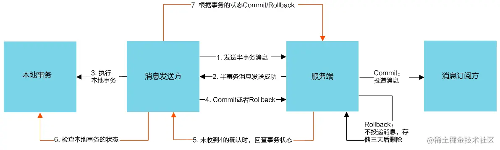
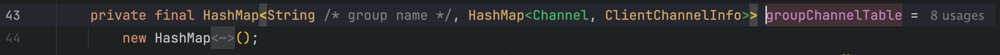
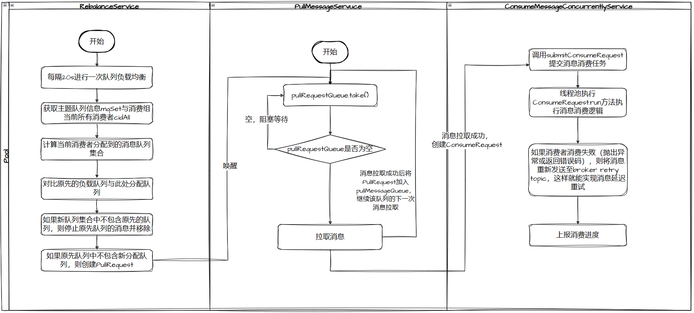
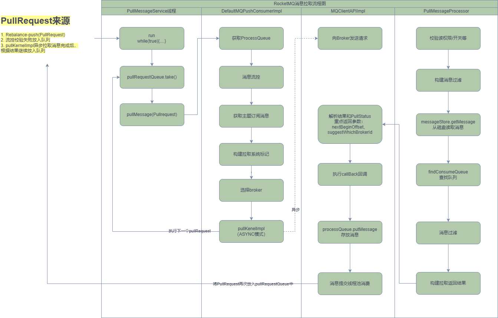
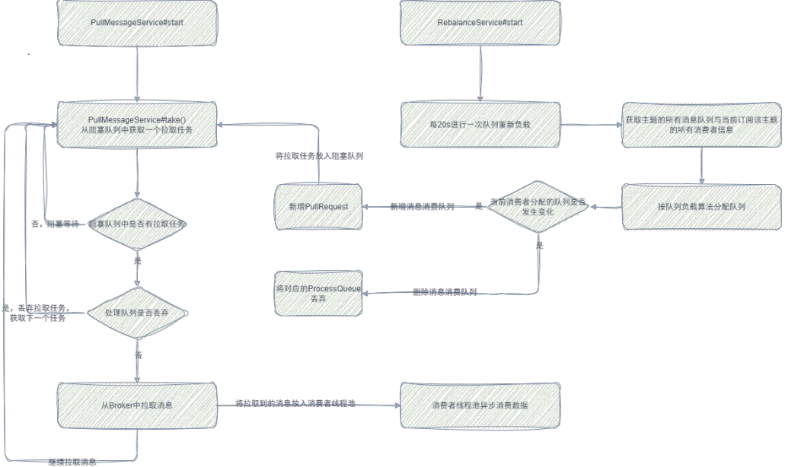
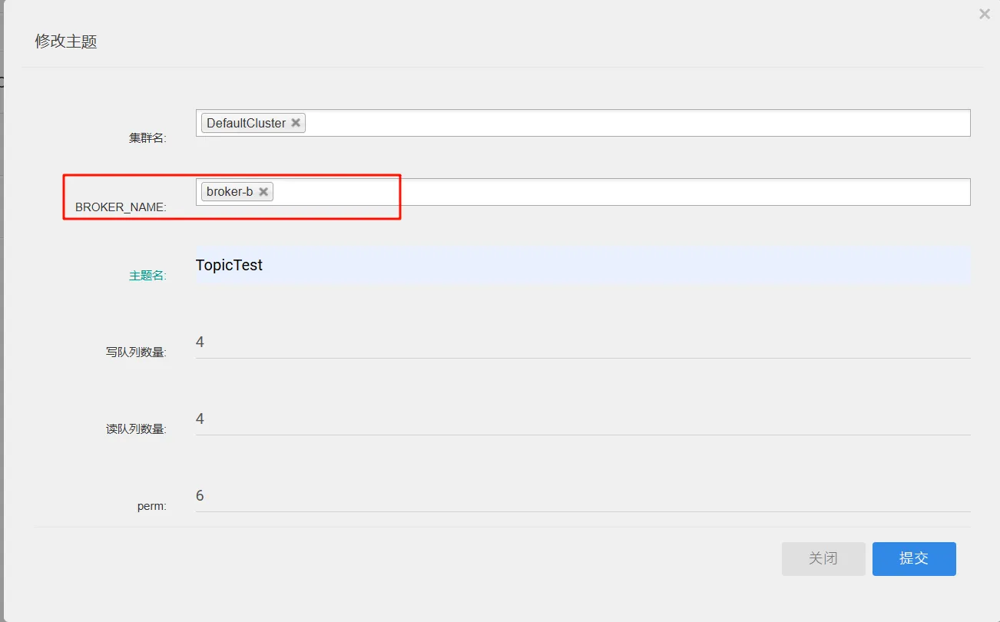
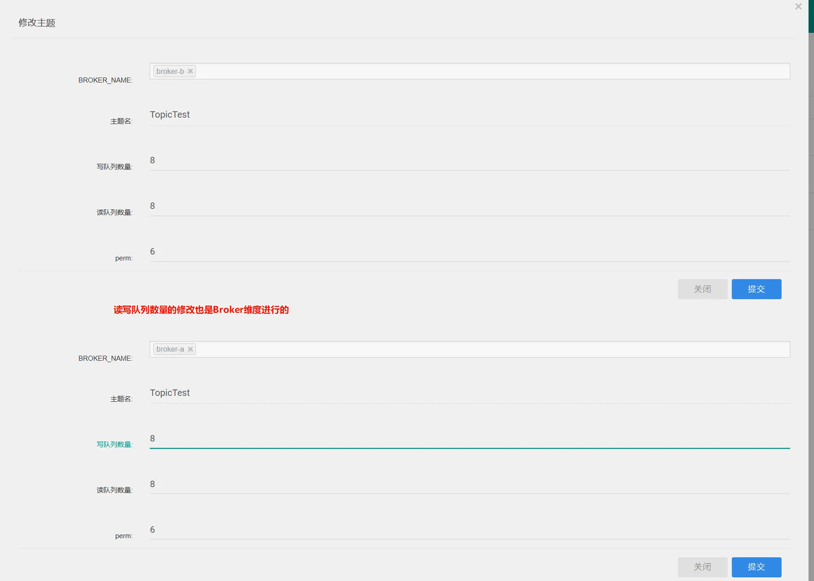
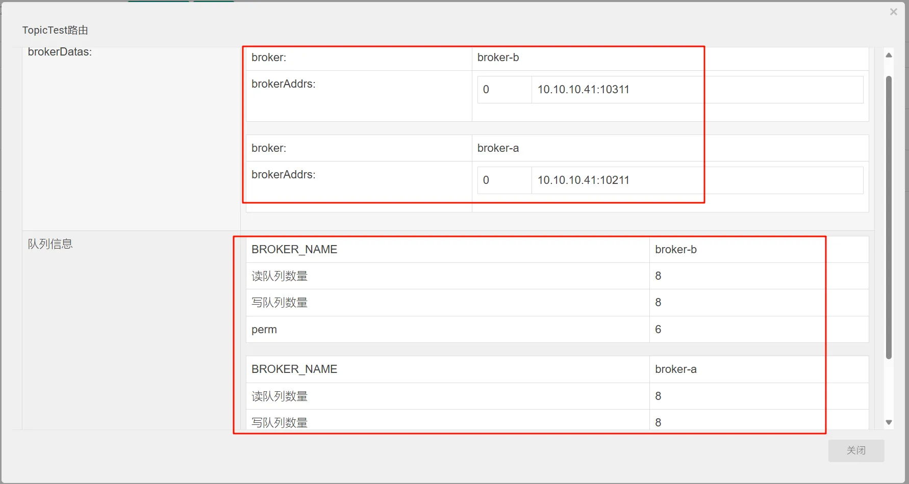
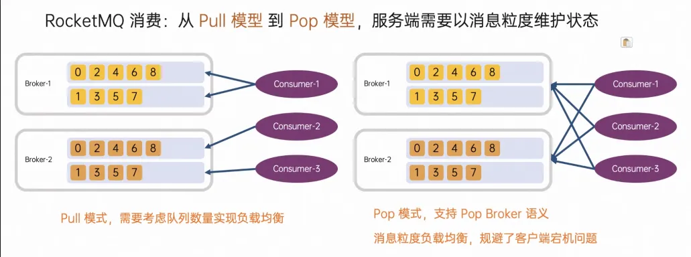
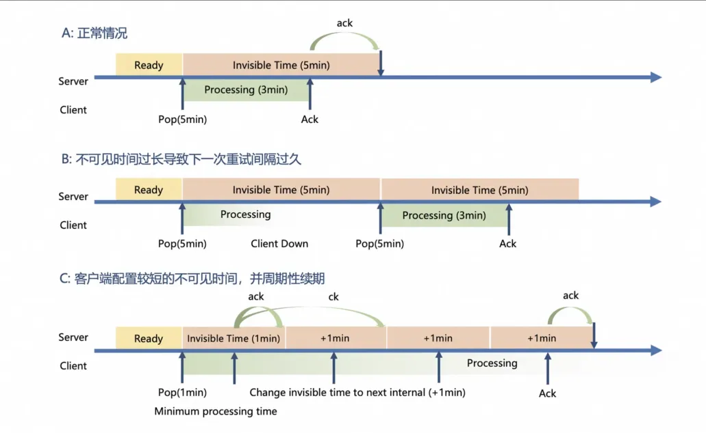

# RocketMQ问答

## RocketMQ 架构

RocketMQ 主要有两大组件，一个是 NameServer，相当于注册中心，内部暂存着 Broker 相关信息；另一个是 Broker，它是消息处理、存储的组件。一个 Topic 消息数据可以分片在多个 Broker 上，这样消息的存储就能做到横向扩展，如果现有的 broker 性能不能满足要，只需要扩展 broker 节点数量即可。每一个 broker 上可以有多个 queue，队列的数量决定着消费者实例的数量，本质上决定着消费能力的上限（一个队列通常情况下只会被一个 Consumer 消费，如果多个消费者消费一个队列，就会有并发问题，需要加锁，这样与整体高性能的设计目标背道而驰）。

Broker在启动时，会将自身保存的 topic 信息全部注册至NameServer，然后每隔30s会向NameServer通过心跳更新自身的Topic信息。NameServer 每隔10s 会扫描 brokerLiveTable，检测表中上次收到心跳包的时间，比较当前时间与上一次时间，如果超过120s，则会认为broker不可用，移除路由表中该broker相关的所有信息。

> 参考文章：[RocketMQ消息发送流程](_4RocketMQ消息发送流程.md)

## RocketMQ 高性能的秘密

RocketMQ存储的文件主要包括CommitLog文件、ConsumeQueue文件、Index文件。RocketMQ将所有topic的消息存储在同一个文件中，确保消息发送时按顺序写文件，尽最大的能力确保消息发送的高性能与高吞吐量。因为消息中间件一般是基于消息主题的订阅机制，所以给按照消息主题检索消息带来了极大的不便。为了提高消息消费的效率，RocketMQ引入了ConsumeQueue消息消费队列文件，ConsumeQueue 每一个数据都是定长的，目的是可以使用访问类似数组下标的方式快速定位条目，每个topic包含多个消息消费队列，每一个消息队列有一个消息文件。Index索引文件的设计理念是为了加速消息的检索性能，根据消息的属性从CommitLog文件中快速检索消息。

存储设计上 broker 采用顺序写机制充分发挥磁盘 IO 性能，并利用 mmap 零拷贝机制避免的消息从内核空间向用户空间的拷贝，进一步增加了 IO 性能。

RocketMQ 网络层面使用了 Netty NIO 同步非阻塞 框架，进一步保证了客户端和 Broker 之间的网络处理性能。

> 参考文章：[RocketMQ消息存储流程](_5RocketMQ消息存储流程.md)

## RocketMQ TransientStorePool 机制

RocketMQ 中的 TransientStorePool 机制是一种优化磁盘写入性能的技术，主要应用于异步刷盘场景。这种机制主要是通过预先在堆外内存（Direct Memory）中分配一块固定大小的内存区域，然后将消息数据首先写入堆外内存，再由单独的线程负责把堆外内存中的数据批量地、按页对齐的方式写入到 MappedFile 中（CommitRealTimeService线程），也就是说无需每次写入数据时都进行系统调用从而提高写入效率。

以下是 RocketMQ 使用 TransientStorePool 的主要流程：

1. 预先在堆外内存中创建一个内存池（即 TransientStorePool），并初始化为一段连续的内存空间。
2. 当生产者发送消息时，RocketMQ 先将消息写入到 TransientStorePool 中的堆外内存里。
3. 刷盘线程定时或者达到一定数量的消息后，将堆外内存中的数据按页对齐的方式，批量写入到 MappedFile（MappedByteBuffer）中。
4. 最后，再由 MappedByteBuffer 进行真正的磁盘刷盘操作。

有了 TransientStorePool 的存在，消息可以批量写入内存缓冲区，RocketMQ 也就可以有效地控制何时以及如何将脏页（Dirty Page，即已修改但还未写入磁盘的内存页）刷写到磁盘，避免了操作系统自动进行的随机性、不可预测的脏页刷写操作，从而提升了**I/O**性能，特别是在大量写入请求的场景下。

值得一提的是，使用TransientStorePool并非没有代价。因为需要额外的一次内存复制操作，即从堆外内存复制到内存映射区域。但是在大多数情况下，通过控制脏页刷写带来的性能提升，相比于增加的内存复制开销，更加明显。

并且开启 transientStorePool 机制后，由于消息数据会先写入堆外内存，然后由特定后台线程（CommitRealTimeService），将堆外内存中的修改 commit 到内存映射区域，而这一步如果发生断电、服务宕机，都会产生消息丢失。而普通的异步刷盘，由于消息是直接写入内存映射区域，所以服务宕机并不会丢失数据，只有在服务器突然断电时才会丢失少量数据。 

## RocketMQ 顺序消息实现原理

RocketMQ为了保证消息的顺序性，分别从Producer和Consumer都有着相应的设计~

- Producer方面，为保证顺序消息，可自定义MessageQueueSelector来选择队列。例: orderId % msgQueueSize，从而可保证同一个orderId的相关消息，会被发送到同一个队列里。
- Consumer方面，在整体设计上用了三把锁，来保证消息的顺序消费。

- - broker分布式锁：保证只有一个消费者进程能够拉取到消息。
  - processQueue锁：保证在拉取到消息的进程中，只有一个线程能够消费这些消息。
  - 消费锁：保证消费线程在消费途中，重平衡导致队列被分配到别的实例上时，不会立即将broker分布式锁解锁，而是等待消费者消费完成或者等待下一次重平衡在解锁。这样就能保证在重平衡场景下不会出现两个进程内的线程消费同一个队列的情况。

> 参考文章：[RocketMQ顺序消息](_12RocketMQ顺序消息.md)

## RocketMQ 事务消息实现原理

事务消息发送步骤如下：

1. 发送方将半事务消息发送至broker。
2. broker将消息持久化成功之后，向发送方返回 Ack，确认消息已经发送成功，此时消息为半事务消息。
3. 发送方开始执行本地事务逻辑。
4. 发送方根据本地事务执行结果向服务端提交二次确认（commit 或是 rollback），服务端收到 commit 状态则将半事务消息标记为可投递，订阅方最终将收到该消息；服务端收到 rollback 状态则“删除”半事务消息，订阅方将不会接受该消息。
5. 在断网或者是应用重启的特殊情况下，上述步骤 4 提交的二次确认最终未到达服务端，经过固定时间后服务端将对该消息发起消息回查。
6. 发送方收到消息回查后，需要检查对应消息的本地事务执行的最终结果。
7. 发送方根据检查得到的本地事务的最终状态再次提交二次确认，服务端仍按照步骤 4 对半事务消息进行操作。

注意是**先发送事务半消息，再执行本地事务**。

**基本原理：**

Client 会在发送事务半消息时在消息 Header 中添加 `TRAN_MSG=true`，标识此条消息为事务消息。Broker 收到 Client 发送的事务消息后，为了不让 Consumer 可见，会像处理延迟消息一样，改写 Topic 和queueId，将消息统一扔到`RMQ_SYS_TRANS_HALF_TOPIC`这个Topic下，默认的queueId为0。同时，为了后续消息Commit时重新写入正常消息，必须将真实的Topic和queueId等属性先保留到Properties中。

半消息写入成功后，会返回客户端写入成功（SEND_OK)。此时客户端开始执行本地事务（TransactionListener#executeLocalTransaction），如果本地事务执行可能有三种结果：

- COMMIT_MESSAGE：提交事务
- ROLLBACK_MESSAGE：回滚事务
- UNKNOW：未知状态

此时 Client 会像 broker 回复本地事务状态，来决定半消息的去向。

如果是提交事务，则根据请求头里的 `CommitLogOffset` 读取出完整的消息，从 `Properties` 中恢复消息真实的 `Topic`、`queueId` 等属性，再调用 `sendFinalMessage` 方法将消息重新写入 `CommitLog`，稍后构建好 `ConsumeQueue` 消息对 `Consumer` 就可见了，最后调用`deletePrepareMessage`方法删除Half消息。

如果是Rollback，处理就更加简单了，因为消息本来就对Consumer是不可见的，只需要删除Half消息即可。

需要注意的事，实际上，Half消息并不会删除，因为CommitLog是顺序写的，不可能删除单个消息。「删除Half消息」仅仅是给该消息打上一个标记，代表它的最终状态已知，不需要再回查了。RocketMQ通过引入Op消息来给Half消息打标记，Half消息状态确认后，会写入一条消息到Op队列，对应的Topic为`MQ_SYS_TRANS_OP_HALF_TOPIC`，反之Op队列中不存在的，就是状态未确认，需要回查的Half消息。

**Broker 如何实现事务回查机制的**？

Broker 会每隔 60s 获取半消息 Topic 中需要事务回查的半消息，然后提交至线程池异步执行事务回查。回查线程会根据半消息原始的 ProducerGroupName 从缓存中随机获得一个网络连接 Channel 发起事务回查，缓存中保存着所有生产组对应的网络连接 Channel。这里的关键在于，**回查请求可能不是发送给最初处理该事务的生产者实例**

## RocketMQ 延迟消息实现原理

**总体架构与概念**

RocketMQ 的消息存储在 CommitLog 文件中，它是顺序写入的。对于延迟消息，在写入时会有特殊的标记和处理逻辑。

当生产者发送延迟消息时，会在消息属性中设置延迟级别（delayLevel）。RocketMQ 默认支持 18 个延迟级别，例如 1s、 5s、10s、30s、1m、2m、3m 等，不同的延迟级别对应不同的延迟时间。

**发送端原理**

生产者发送延迟消息时，消息的 Topic 会被替换为特定的延迟消息相关的 Topic（例如 SCHEDULE_TOPIC_XXXX），并且会在消息属性中记录原始的 Topic、消息的消费队列等信息。这样做的目的是将延迟消息与普通消息区分开来，以便在 Broker 端进行特殊处理。

生产者将延迟消息发送到 Broker 后，Broker 会根据消息中的延迟级别将消息存储到对应的延迟消息队列中。这些延迟消息队列是基于不同的延迟时间进行划分的，例如，延迟 1s 的消息会被存储到一个专门的队列中，延迟 5s 的消息会被存储到另一个队列中。

**Broker 端原理**

Broker 内部有专门的定时任务机制来管理延迟消息队列。每个延迟级别都对应一个定时器，定时器会定期（例如每隔 100ms）扫描对应的延迟消息队列。当定时器扫描到某个延迟消息队列中的消息时，会检查消息的延迟时间是否已经到达。如果到达了延迟时间，就会将消息从延迟消息队列中取出。

从延迟消息队列中取出的消息，会根据之前记录的原始 Topic 和消费队列等信息进行还原。然后，Broker 会将还原后的消息重新投递到对应的消费队列中，以便消费者能够正常消费。在重新投递之前，Broker 还会进行一些必要的消息属性更新，例如清除延迟消息相关的标记等。

## RocketMQ 消息重试机制

RocketMQ 客户端消息消费有两种模式，一种是推模式一种是拉模式，推模式本质上是通过长轮询实现的。当长轮询线程拉取到消息后，会将消息暂存至 ProcessQueue 中供消费者线程消费，当前消息被消费后不管是成功还是失败，都会 ACK 消费者的消费进度给 broker，将当前消费进度更新到 broker。

如果此次消费失败，客户端会将失败的消息重新发送回 broker ，broker 收到重新发送的消息后会将消息存入名称为 “%RETRY%+消费组名称”的重试 topic 中。

> 发送逻辑：org.apache.rocketmq.client.impl.consumer.ConsumeMessageConcurrentlyService#processConsumeResult

在存储之前，broker 会计算此次重试的延迟级别（每一次重试后重试级别+1），并将此条消息的重试次数+1（存储在消息头中），消息设置了延迟级别以后 broker 就会按照延迟消息处理该消息了，此时消息会真正存储在 “SCHEDULE_TOPIC_XXXX” Topic 中，broker 会在延迟到期后将消息重新发回 “%RETRY%+消费组名称”的重试 topic 中。

如果消息失败次数大于 16 次，则将该消息存储至 “%DLQ% + group”的死信 topic 中。

## RocketMQ 推模式下客户端拉取消息的步骤

PullMessageService 是 RocketMQ 客户端拉取消息的入口，它内部有一个队列专门存放各个 Topic 队列的消息拉取请求（PullRequest），当队列中有拉取请求时，PullMessageService 就会异步发送长轮询请求从 broker 上获取 MessageQueue 对应的消息。如果有新的消息，broker 会立即返回消息，然后将获得的消息放入 ConsumeMessageService 中消费者线程池（org.apache.rocketmq.client.impl.consumer.ConsumeMessageConcurrentlyService#consumeExecutor）执行消费逻辑。

而客户端本地的消息消费完成后，会立即提交一个新的拉取请求，并放入 PullMessageService 请求队列中，这样就能实现循环拉取消息消费。

初始的消息拉取请求是在 RebalanceImpl 启动时放入的，该服务会负载均衡 broker 上的 Queue，然后将当前实例消费的 Queue 封装成 PullRequest 放入PullMessageService 中的请求队列中。

> 参考文章：[RocketMQ客户端消息消费原理](_20RocketMQ客户端消息消费原理.md)

消息消费流程：

**ConsumeMessageService 中的消费者线程池是所有消费组共用，还是每一个消费组都会创建一个?**

**每一个消费组一个消费者线程池**

## RocketMQ 消息 ACK 机制

[源码分析RocketMQ之消息ACK机制（消费进度）_readoffset(final messagequeue mq-CSDN博客](https://blog.csdn.net/prestigeding/article/details/79090848)

**RocketMQ 消息消费进度是按照 MessageQueue 维度存储的，而不是 Topic 维度**。其中集群消费模式的消费进度存储在 Broker 中，广播消费模式的进度存储在消费者本地。这样在集群消费模式下，客户端就需要上报自己的消费进度。

RocketMQ 消息消费拉取是批量的，拉取到一批消息后会将消息放入本地队列中（ProcessQueue，本质上是一个 TreeMap，按照消息 ID 排序），如果此批消息消费完成后会判断当前待处理队列中是否存在剩余消息，如果存在，则更新消费进度至队列剩余消息最小的偏移值，如果不存在则更新消费进度至此批消息最大偏移量。

从 RocketMQ Dashboard 也能看出，RocketMQ 消息消费进度是 ConsumeQueue 维度管理的，在上图中 TopicTest 主题在 broker-a 和 broker-b 上分别有三个队列。

## RocketMQ 队列 Reblance 实现原理

RocketMQ topic 在创建时会指定队列的个数，而队列的个数通常会高于 broker 个数，因为将不同的 queue 分布在不同的 broker 上能充分发挥多个 broker 的读写性能。通常队列个数也应该会比生产者/消费者实例更多，因为这样会让每个业务实例都能分配到至少一个队列进行消费，充分发挥消费者实例的消费能力，增加消息的消费速度。

而队列的 Reblance 就是负责将 Topic 下多个队列分配给不同的消费者实例，尽量使得每个消费者实例都能消费到消息。

Rebalance 触发原因：

1. 订阅 Topic 的队列数量变化
2. 消费者组信息变化

这里是最深层的原因，就是 topic 的队列数量、消费组信息实际我们可以将这些归结为 Rebalance 的元数据，这些元数据的变更，就会引起 clinet 的 Rebalance。 下面我们可以具体说下什么情况下会让这三个类变化

**什么情况下订阅 Topic 的队列数量会变化呢**？

1. broker 扩容
2. broker 缩容
3. broker 宕机(本质也是类似缩容)

**什么时候消费者组信息会变化呢**？

核心就是 consumer 的上下线，具体细分又可以分为如下原因：

1. 服务日常滚动升级
2. 服务扩容
3. 服务订阅消息发生变化

**Reblance 整体步骤**：

1. consumer 启动时会向所有 master broker 发送心跳，然后 broker 发送信息通知所有 consumer 触发 Rebalance
2. 启动完成后 consumer 会周期的(20s)触发 Rebalance，防止因为网络等问题丢失 broker 的通知而没有 Rebalance
3. 当 consumer 停止时，也会通过之前分析的事件机制，触发注销 comsuer 事件然后通知所有的 comsuer 触发 Rebalance

**Rebalance 规则是啥**：

Rebalance 是按照 ConsumeGroup 维度进行的，RebalanceService 中会发送请求，从broker中获取该消费组内当前所有的消费者客户端ID。然后会将 topic 下的队列按照 topic-brokerName-queueId 排序后进行负载分配。

至于按照啥规则分配消息队列，RocketMQ Client 提供了 AllocateMessageQueueStrategy 接口以实现消息队列的分配实现，RocketMQ 自带如下实现类：

- AllocateMessageQueueAveragely：平均分配，这样的话一个实例会尽量消费同一个 broker 下的队列。（默认）
- AllocateMessageQueueAveragelyByCircle：平均轮询分配
- AllocateMessageQueueByMachineRoom：根据Broker部署机房名，对每个消费者负责不同的Broker上的队列。

## RocketMQ 生产者生产消息时如何进行队列路由

如果未开启故障延迟机制，会轮询 Topic 队列进行消息发送。如果开启所谓的故障延迟机制，即设置sendLatencyFaultEnable为true，其实是一种较为悲观的做法。当消息发送者遇到一次消息发送失败后，就会悲观地认为Broker不可用，在接下来的一段时间内就不再向其发送消息，直接避开该Broker。而不开启延迟规避机制，就只会在本次消息发送的重试过程中规避该Broker，下一次消息发送还是会继续尝试。

## 总结一下 RocketMQ 消息消费全流程

在生产端，客户端通过四层的 TCP 协议和 NameServer 建立连接，通过 Remoting 协议从NameServer 获取到集群的元数据信息。根据元数据信息，和对应的 Broker 的建立 TCP 连接。如果客户端指定了目标 Topic，消息则先经过消息分区分配，然后才将数据发送到Broker 中。因为 Remoting 也没有支持 Batch 的协议，所以数据会直接发送到对应的Broker，可以使用单向发送、同步发送、异步发送三种发送形式。

Broker 接收到数据后，会先使用 Remoting 反序列化数据。然后解析处理数据，将数据整合后，在底层会写入到同一个文件中，存储数据的时候会进行分段存储。如果是集群部署并设置了副本，则数据会分发到其他 Broker 的副本中。当数据过期后，Broker 会自动清理节点上的数据。

在消费端，可以先选择 Pull、Push、Pop 其中的一种消费模型。客户端同样需要先和NameServer 完成寻址操作。消费端有消费分组的概念，所以会先进行消费者和分区的消费关系分配的流程，然后消费者会和自己消费的分区的 Leader 所在的 Broker 建立连接。接着，客户端会使用 Remoting 协议从 Broker 消费数据。数据消费成功后，最后会提交消费进度。

## 从源码角度分析，为什么 RocketMQ 只保证至少消费一次，而不保证有且仅消费一次

消息重复消费归根于消息消费进度存储的不及时，下面列举几种：

1. RocketMQ 集群消费模式下未对队列加锁，所以重平衡过程中可能会出现多个消费者读取同一个队列的情况，假设 A、B 两个消费者几乎同时读取了一批相同的消息（因为消息的 ACK 是消费完后才进行的，所以在 A 消费这批消息的过程中，B 也可以消费到这批消息），自然就会重复消费。
2. 网络问题和消费者故障：如果在消费者确认消息前（即发送ACK前）发生网络故障或消费者突然崩溃，那么消息服务器可能无法接收到ACK。在这种情况下，消息服务器会认为这条消息还未被成功消费，因此会再次投递该消息。这种情况下，如果消费者在故障发生前已经处理了消息，那么消息就会被重复消费。
3. 当前消息实际上消费成功了，但是消费进度未上报给 broker，此时触发重平衡机制，当前消费的队列被划分到其它消费者实例消费，此时其它消费者就会重复消费这条消息。
4. RocketMQ Broker 保存消息消费进度是异步定时刷盘的，Broker 在拉取消息的请求中获取到 Client 携带的消费进度信息，会将消费进度先放入内存中，然后异步写入磁盘（每 10s 写入一次磁盘）。这样如果 Broker 宕机就会导致少部分消费的 offset 信息丢失。（org.apache.rocketmq.broker.offset.ConsumerOffsetManager）
5. RocketMQ 集群在开启 DLedger 模式后，Follower 节点是通过 JOB 每 10s 向 Leader 节点同步包括消费进度在内的元数据信息(org.apache.rocketmq.broker.slave.SlaveSynchronize#syncAll)，这也就意味着如果 Leader 节点宕机，发生主从切换，来不及同步的消费进度可能会发生丢失，但是并不是一定会丢失，因为消息消费端只要不重启，消息消费进度会存储在内存中，下一次从新的 Leader 节点拉取消息时会继续上报消费进度。

## RocketMQ DLedger模式

在 RocketMQ 4.x 中，如果采用 DLedger 架构部署，Broker 挂掉后，是可以自动实现主从切换的。但这样需要用 Raft Commitlog 来取代 RocketMQ 自身的 Commitlog，因为只有这样 Commitlog 才会具有选举的能力。Broker 主节点挂掉后，从节点依照 DLedger 协议进行内部协商，选举出新的主节点，自动完成主备切换。

不过这样存在几个问题：

1. 消息日志副本数必须是 3 个以上，这个是 Raft 协议自动选主的要求，造成资源浪费；
2. Raft 选主过程中必须有多数节点同意才能选主成功，副本数越多时间开销会越大，这会加大 ACK 延时；
3. CommitLog 主从同步需要使用 DLedger 库，也就是说 CommitLog 被看作是 Raft log 进行复制，这样 RocketMQ 原生的零拷贝、堆外内存的优势无法使用了。

## 简述一下消息队列消息拉取 PUSH 模式实现思路

消息中间件消息拉取 PUSH 模式通常有如下实现方式：

**第一种，Broker内置Push功能是指在 Broker 中内置标准的Push的能力，由服务端向客户端主动推送数据**。

这种方案的好处是 Broker 自带 Push 能力，无需重复开发和部署。Broker 内部可以感知到数据堆积情况，可以保证消息被及时消费。**缺点是当消费者很多时，内核需要主动维护很多与第三方的长连接，并且需要处理各种客户端异常，比如客户端卡住、接收慢、处理慢等情况**。这些推送数据、异常处理、连接维护等工作需要消耗很多的系统资源，在性能上容易对 Broker形成反压，导致 Broker 本身的性能和稳定性出现问题。所以这种方案在主流消息队列中用得较少，比如 RabbitMQ 和某些金融证券领域的消息队列，为了保证消息投递的高效及时（比如全链路的毫秒级耗时），才会采用这种方案。

**第二种，Broker 外独立实现 Push 功能的组件是指独立于 Broker 提供一个专门实现推模型的组件。**

通过先 Pull 数据，再将数据 Push 给客户端，从而简化客户端的使用，提高数据消费的及时性。这种方案的好处是将 Push 组件独立部署，解决了 Broker 的性能和稳定性问题，也能实现Push 的效果。缺点是虽然实现了 Push 的模型，但其本质还是先 Pull 再 Push，从全链路来看，还是会存在延时较高的问题，并且需要单独开发独立的 Push 组件，**开发和运维成本较高**。

**第三种，在客户端实现伪 Push 功能是指在客户端内部维护内存队列，SDK 底层通过 Pull 模型从服务端拉取数据存储到客户端的内存队列中。**然后通过回调的方式，触发用户设置的回调函数，将数据推送给应用程序，在使用体验上看就是 Push 的效果。

这种方案的好处在于通过客户端底层的封装，从用户体验看是 Push 模型的效果，解决用户代码层面的不断轮询问题，降低了用户的使用复杂度。缺点是底层依旧是 Pull 模型，还是得通过不断轮询的方式去服务端拉取数据，就会遇到 Pull 模型遇到的问题。

在客户端实现伪 Push，是目前消息队列在实现 Push 模型上常用的实现方案，因为它解决了客户体验上的主动回调触发消费问题。虽然底层会有不断轮询和消费延时的缺点，但是可以通过编码技巧来降低这两个问题的影响。

**因为 Push 模型需要先分配分区和消费者的关系，客户端就需要感知分区分配、分区均衡等操作，从而在客户端就需要实现比较重的逻辑**。并且当客户端和订阅的分区数较多时，容易出现需要很长的重平衡时间的情况。此时为了解决这个问题，业界提出了 Pop 模型。

## RocketMQ 4.x VS RocketMQ 5.x

RocketMQ 5.x 新增：

- 自定义时间延迟消息
- 消息粒度的负载均衡策略，历史版本4.x/3.x版本仅支持队列粒度的负载均衡策略。在 RocketMQ 5.0 中，Pop 消费模式借助 gRPC 封装的接口，促进了轻量化多语言客户端的实现，**无需在各客户端重复实现重平衡逻辑，显著提升了系统的灵活性和扩展性**。该设计核心在于将重平衡、位点管理及消息重试等任务转移至服务端处理，有效避免单点故障引起的消息积压，优化了整体消息处理效率和系统的水平扩展能力。4.x 版本队列粒度负载均衡在某些场景下会有缺陷：

- - 消费者数量较多，同一个订阅组可能有成百上千台机器同时消费，但是每条消息消费时长特别长例如渲染任务，此时集群消费能力就受到消息队列数量的限制，因为在队列粒度负载均衡策略下，消费者实例数量不能大于队列数量。
  - 某一个队列对应的应用实例假死，造成某个队列的消息堆积。

- 存算分离架构，在 broker 存储层之上，新增了 proxy 层。存储和计算分离是一种良好的模块化设计。无状态的 Proxy 集群是数据流量的入口，提供签名校验与权限控制、计量与可观测、客户端连接管理、消息编解码处理、流量控制、多协议接入、消息管理等能力。原 Broker 节点演化为以存储为核心的有状态集群，支持读写多类型消息，它们的底层是多模态存储和多元化的高效索引。存储计算分离的形态利于不同业务场景下单独调整存储或计算节点的数量，来实现扩容和缩容。
- proxy 引入 grpc 协议，可以更容易实现多语言 SDK

最大的意义：引入 Proxy 将之前 4.x 版本客户端很多功能下沉至 Proxy 层，使得客户端更加轻量级，并在 Proxy 适配了 grpc、http 等多种协议，不同协议的客户端跟 Proxy 建立连接后，Proxy 统一使用 remoting 协议跟 Broker、NameServer 进行通信，使得多语言客户端开发变得更加简单。

## RocketMQ 在架构设计上和 Kafka 的异同点

1. RocketMQ 使用 NameServer 作为注册中心，元数据（Broker 的地址、存储的 Topic、MessageQueue）保存在 Broker 中，Broker 启动后向 NameServer 上报元数据信息。Kafka 使用 Zookeeper 作为注册中心，元数据保存在 Zookeeper 中，Broker 启动时向 Zookeeper 拉取元数据。
2. RocketMQ 所有的消息数据在一台 broker 内存储在一个逻辑文件中，而 Kafka 是按照 Topic+分区 ID 存储的。这样会带来 IO 性能的差异，由于 RocketMQ 存储在一个文件中，所以说不管有多少 Topic 和 MessageQueue 同时写消息，都能保证是顺序写；而 Kafka 由于是按照分区维度存储消息（Kafka 中的分区可以类比于 RocketMQ 中的 MessageQueue），所以当 Kafka 只有少量 Topic 和分区在读写消息时更能发挥 SSD 的 IO 性能，如果同时读写消息的 Topic 分区越来越多，顺序 IO 也将劣化为随机 IO，大大降低 Kafka 的吞吐效率。
3. Kafka 协议提供了批量（Batch）发送的语义。所以生产端会在本地先缓存数据，根据不同的分区聚合数据后，再根据一定的策略批量将数据写入到 Broker。因为这个 Batch 机制的存在，客户端和服务端的吞吐性能会提高很多。

## RocketMQ 长轮询机制实现原理

RocketMQ broker在处理消息拉取请求时，如果消息未找到且`brokerAllowSuspend`为 `true`（Broker端支持挂起）且开启了长轮询，会设置挂起超时时间，创建`PullRequest`并提交到`PullRequestHoldService`线程中。`PullRequestHoldService` 线程每 5 秒扫描所有被 hold 住的长轮询请求连接，检查是否有新消息到达并返回。为提高实时性，在 `DefaultMessageStore#ReputMessageService` 线程将 `CommitLog` 消息转发到 `ConsumeQueue` 文件时，若 Broker 端开启长轮询且当前节点为主节点，则调用 `PullRequestHoldService` 的 `notifyMessageArriving` 方法唤醒挂起线程，判断消费队列最大偏移量与待拉取偏移量关系，若前者大于后者则读取磁盘消息，返回给客户端。

## RocketMQ MessageQueue 扩缩容，多个 broker 如何分配多个 MessageQueue，Broker 扩缩容对 MessageQueue 分布有啥影响

RocketMQ Topic 维度元数据是以 broker 为维度存储的，每一个 broker 只存储自身的 Topic 信息，broker 和 broker 之间的元数据不会相互影响，NameServer 也不会协调 broker 之间元数据保持一致。例如 broker-a 中有 TopicTest 主题，读写队列分别为 4 个。此时我们启动 broker-b，由于 broker-b 是新节点，内部没有 TopicTest 主题所以 TopicTest 队列仍然只在 broker-a 上存在：

如果想要 broker-b 上也负载 TopicTest 主题队列，那我们只需要通过控制台操作 broker-b 新建该主题即可：

> **需要注意的是，官方的控制台在新建 Topic 时填写的读写队列数量是 broker 维度的，而不是集群维度的，所以也就没有RocketMQ MessageQueue 扩缩容， broker 间如何分配多个 MessageQueue 的问题了**
>
> 

新建完成后 broker-a 和 broker-b 上都会负载 TopicTest 主题消息了：

## RocktMQ5.x 新增 Pop 消费模式是啥原理

[RocketMQ 原理和架构](https://rocketmq.io/course/baseLearn/rocketmq_learning-framework/?spm=5176.29160081.0.0.a280608eM3Q1Ns#存储计算分离部署)

在 RocketMQ 5.0 中，Pop 消费模式借助 gRPC 封装的接口，促进了轻量化多语言客户端的实现，无需在各客户端重复实现重平衡逻辑，显著提升了系统的灵活性和扩展性。该设计核心在于将重平衡、位点管理及消息重试等任务转移至服务端处理，有效避免单点故障引起的消息积压，优化了整体消息处理效率和系统的水平扩展能力。

Push / Pull 模式下队列中有慢任务会阻塞整个队列。例如有位点为 34567 的 5 条消息，消费 offset = 5 时业务逻辑耗时非常久，并发消费模式下 67 两条消息消费较快，而观察到的堆积一直为 3 造成误判。消费者或者服务端宕机，业务对产生几秒的消费重复依然敏感，影响用户体验，例如短信推送场景。甚至，我们还有更有代表性的场景来命中这些 “缺陷”，例如渲染业务，队列中每一条消息代表一个渲染任务。

1. 消费者数量较多，同一个订阅组可能有成百上千台机器同时消费。
2. 该场景下单条数据的处理耗时较长，需要几秒至几个小时不等。
3. 由于消费者负载高和大量使用竞价实例，导致消费方进程假死和宕机率远高于一般业务。

传统的消息队列会遇到很经典的 “Work-Stealing” 难题，任务的负载无法均衡的分配到所有消费方，单条消息的阻塞会影响后续消费成功消息位点的提交。此时我们想要的是一个基于不可见时间的投递算法，该算法大致的工作流程如下：

1. 客户端设置一个不可见时间，例如 5 分钟，并向服务端拉取一批消息。
2. 服务端返回一批消息，并在后台开始倒计时 5 分钟，消息上会附加一个字段用来标识，也称为 handle。
3. 如果客户端 5 分钟内没有提交消费成功（ack by handle），5 分钟后客户端再次可以获取到这批消息。

很快我们就会发现这个模型还是有缺陷的，假如消费者拉取消息 1 分钟后立刻宕机了，业务不得不忍受 4 分钟的延迟才能再次处理，哪怕此时其他消费者还是空闲状态。这个时候就可以选择将消息的不可见时间设置为 1 分钟，在客户端处理业务的同时不停的 refresh 不可见时间，例如每隔 30 秒就调用 change invisible time，使剩余的不可见时间更新为 1 分钟，此时无论客户端何时宕机，消息的延迟时间会控制在 1 分钟之内。在 RocketMQ 中，这种基于区间和单条消息进行消费的方式被称为 “pop 消费”，对应的客户端实现是 SimpleConsumer，它的简单性在于客户端不再需要关心复杂的负载均衡和位点管理，也更容易适配多语言。