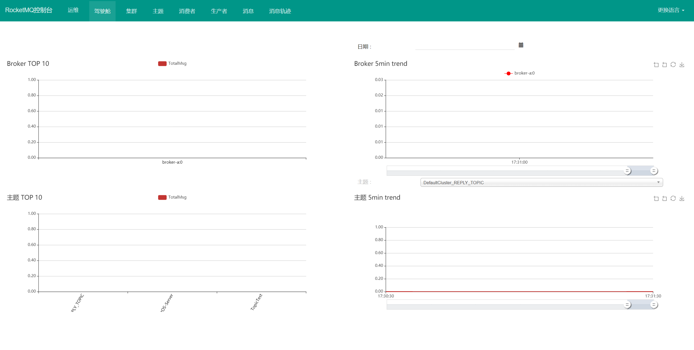

# 搭建管理控制台

RocketMQ源代码中并没有提供控制台，但是有一个Rocket的社区扩展项目中提供了一个控制台，地址: [https:/lgithub.com/apache/rocketmq-externals](https:/lgithub.com/apache/rocketmq-externals)

下载下来后，进入其中的rocket-console目录，使用maven进行编译：

```shell
mvn clean package -Dmaven.test.skip=true
```

编译完成后，获取target下的jar包，就可以直接执行。但是这个时候要注意，在这个项目的`application.properties`中需要指定nameserver的地址。默认这个属性是空的。

那我们可以在jar包的当前目录下增加一个`application.properties`文件，覆盖jar包中默认的一个属性：

```properties
server.port:7012
rocketmq.config.namesrvAddr=localhost:9876
```

然后执行：

```java
nohup java -jar rocketmq-console-ng-1.0.1.jar
```

启动成功后，访问页面：

