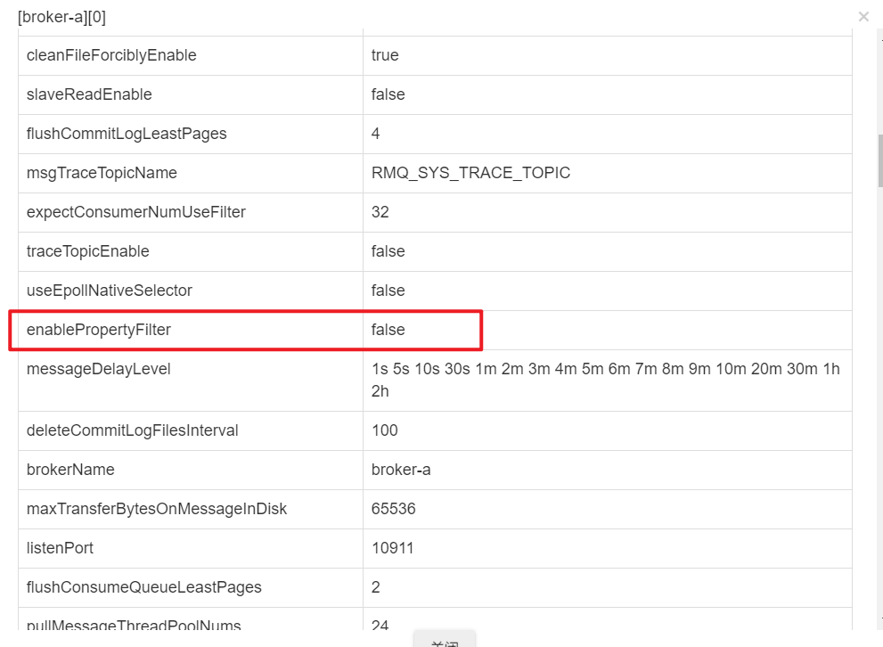
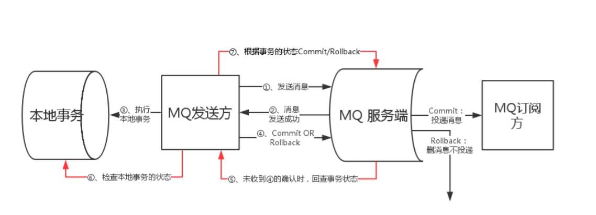

# RocketMQ原生API

## 一. 基本概念

**1.1 消息模型（Message Model）**

RocketMQ主要由 Producer、Broker、Consumer 三部分组成，其中Producer 负责生产消息，Consumer 负责消费消息，Broker 负责存储消息。Broker 在实际部署过程中对应一台服务器，每个 Broker 可以存储多个Topic的消息，每个Topic的消息也可以分片存储于不同的 Broker。Message Queue 用于存储消息的物理地址，每个Topic中的消息地址存储于多个 Message Queue 中。ConsumerGroup 由多个Consumer 实例构成。

**1.2 消息生产者（Producer）**

负责生产消息，一般由业务系统负责生产消息。一个消息生产者会把业务应用系统里产生的消息发送到broker服务器。RocketMQ提供多种发送方式，同步发送、异步发送、顺序发送、单向发送。同步和异步方式均需要Broker返回确认信息，单向发送不需要。

**1.3 消息消费者（Consumer）**

负责消费消息，一般是后台系统负责异步消费。一个消息消费者会从Broker服务器拉取消息、并将其提供给应用程序。从用户应用的角度而言提供了两种消费形式：拉取式消费、推动式消费。

**1.4 主题（Topic）**

表示一类消息的集合，每个主题包含若干条消息，每条消息只能属于一个主题，是RocketMQ进行消息订阅的基本单位。

**1.5 代理服务器（Broker Server）**

消息中转角色，负责存储消息、转发消息。代理服务器在RocketMQ系统中负责接收从生产者发送来的消息并存储、同时为消费者的拉取请求作准备。代理服务器也存储消息相关的元数据，包括消费者组、消费进度偏移和主题和队列消息等。

**1.6 名字服务（Name Server）**

名称服务充当路由消息的提供者。生产者或消费者能够通过名字服务查找各主题相应的Broker IP列表。多个Namesrv实例组成集群，但相互独立，没有信息交换。

**1.7 生产者组（Producer Group）**

同一类Producer的集合，这类Producer发送同一类消息且发送逻辑一致。如果发送的是事务消息且原始生产者在发送之后崩溃，则Broker服务器会联系同一生产者组的其他生产者实例以提交或回溯消费。

**1.8 消费者组（Consumer Group）**

一个组中的客户端会基本保证只消费一次。


同一类Consumer的集合，这类Consumer通常消费同一类消息且消费逻辑一致。消费者组使得在消息消费方面，实现负载均衡和容错的目标变得非常容易。要注意的是，消费者组的消费者实例必须订阅完全相同的Topic。RocketMQ 支持两种消息模式：集群消费（Clustering）和广播消费（Broadcasting）。

**1.9 集群消费（Clustering）**

集群消费模式下,相同Consumer Group的每个Consumer实例平均分摊消息。

**1.12 广播消费（Broadcasting）**

广播消费模式下，相同Consumer Group的每个Consumer实例都接收全量的消息。

**1.13 普通顺序消息（Normal Ordered Message）**

普通顺序消费模式下，消费者通过同一个消费队列收到的消息是有顺序的，不同消息队列收到的消息则可能是无顺序的。

**1.14 严格顺序消息（Strictly Ordered Message）**

严格顺序消息模式下，消费者收到的所有消息均是有顺序的。

**1.15 消息（Message）**

消息系统所传输信息的物理载体，生产和消费数据的最小单位，每条消息必须属于一个主题。RocketMQ中每个消息拥有唯一的Message ID，且可以携带具有业务标识的Key。系统提供了通过Message ID和Key查询消息的功能。

**1.16 标签（Tag）**

为消息设置的标志，用于同一主题下区分不同类型的消息。来自同一业务单元的消息，可以根据不同业务目的在同一主题下设置不同标签。标签能够有效地保持代码的清晰度和连贯性，并优化RocketMQ提供的查询系统。消费者可以根据Tag实现对不同子主题的不同消费逻辑，实现更好的扩展性。

## 二. 基础消息

### 2.1 同步发送基本消息

```java
//指明生产者组名称
DefaultMQProducer producer = new DefaultMQProducer("TEST_GROUP");
// Name Server 地址
producer.setNamesrvAddr(HOST);
producer.setSendMsgTimeout(600);
producer.start();
//创建消息
Message msg = new Message("TopicTest", ("Hello RocketMQ " +i).getBytes(RemotingHelper.DEFAULT_CHARSET));
//发送消息
SendResult sendResult = producer.send(msg);
System.out.printf("%s%n", sendResult);
producer.shutdown();
```

### 2.2 异步发送基本消息

```java
DefaultMQProducer producer = new DefaultMQProducer("TEST_GROUP");
producer.setNamesrvAddr(HOST);
producer.start();
Message message = new Message("TopicTest", "测试消息".getBytes("UTF-8"));
producer.send(message, new SendCallback() {
    @Override
    public void onSuccess(SendResult sendResult) {
        System.out.println(sendResult);
    }

    @Override
    public void onException(Throwable e) {

    }
});
producer.shutdown();
```

### 2.3 推动式消费（订阅模式）

该模式下Broker收到数据后会主动推送给消费端，该消费模式一般实时性较高。

```java
DefaultMQPushConsumer consumer = new DefaultMQPushConsumer(GROUP);
consumer.setNamesrvAddr(HOST);
consumer.subscribe(TOPIC, "*");
consumer.registerMessageListener(new MessageListenerConcurrently() {
    @Override
    public ConsumeConcurrentlyStatus consumeMessage(List<MessageExt> msgs, ConsumeConcurrentlyContext context) {
        for (MessageExt msg : msgs) {
            String s = new String(msg.getBody());
            System.out.println(s);
        }
        return null;
    }
});
consumer.start();
```

### 2.4 拉取式消费

应用通常主动调用Consumer的拉消息方法从Broker服务器拉消息、主动权由应用控制。一旦获取了批量消息，应用就会启动消费过程。

```java
DefaultMQProducer producer = new DefaultMQProducer(GROUP);
producer.setNamesrvAddr(HOST);
producer.start();
for (int i = 0; i < 100; i++) {
    Message message = new Message("TopicTest", ("测试消息" + i).getBytes("UTF-8"));
    SendResult result = producer.send(message);
    System.out.println(result);
}
producer.shutdown();
```

## 三. 顺序消息

### 3.1 发送顺序消息

在RocketMQ中，一个Topic由多个MessageQueue组成，常规的消息发送会将消息随机发送给任意一个MessageQueue中，这样客户端在消费不同的MessageQueue的消息时就会出现消息无序的情况。

发送顺序消息的关键就是客户端将消息发送个一个特定的MeesageQueue，这样消费者在消费时就能保证消息的获取的顺序性了。

假设我们有一个OrderDTO：

```java
public class OrderDTO {
    private Integer orderId;
    private String name;
    private String step;
}
```

然后我们生成一批订单：

```java
public static List<OrderDTO> buildOrderList() {
    List<OrderDTO> list = new ArrayList<>();
    list.add(new OrderDTO(3001, "张三", "创建订单"));
    list.add(new OrderDTO(3002, "李四", "创建订单"));
    list.add(new OrderDTO(3001, "张三", "发送通知"));
    list.add(new OrderDTO(3001, "张三", "完成"));
    list.add(new OrderDTO(3002, "李四", "发送通知"));
    list.add(new OrderDTO(3002, "李四", "完成"));
    return list;
}
```

消息发送：

```java
private static final String HOST = "192.168.0.10:9876";
private static final String GROUP = "ROCKET_TEST";
private static final String TOPIC = "TopicTest";

public static void main(String[] args) throws MQClientException, UnsupportedEncodingException, RemotingException, InterruptedException, MQBrokerException {
    List<OrderDTO> orders = buildOrderList();
    DefaultMQProducer producer = new DefaultMQProducer(GROUP);
    producer.setNamesrvAddr(HOST);
    producer.start();
    for (OrderDTO order : orders) {
        Message msg = new Message(TOPIC, JSONObject.toJSONString(order).getBytes(RemotingHelper.DEFAULT_CHARSET));
        /**
         * 参数一：消息对象
         * 参数二：MessageQueue选择器
         * 参数三：选择MessageQueue的业务标识
         */
        SendResult sendResult = producer.send(msg, new MessageQueueSelector() {
            /**
             * @param mqs MessageQueue集合
             * @param msg 消息对象
             * @param arg 业务表示参数
             * @return
             */
            @Override
            public MessageQueue select(List<MessageQueue> mqs, Message msg, Object arg) {
                Integer orderId = (Integer) arg;
                int index = orderId % mqs.size();
                return mqs.get(index);
            }
        }, order.getOrderId());
        System.out.println(sendResult);
    }
}
```

### 3.2 消费顺序消息

```java
private static final String HOST = "192.168.0.10:9876";
private static final String GROUP = "ROCKET_TEST";
private static final String TOPIC = "TopicTest";

public static void main(String[] args) throws MQClientException, UnsupportedEncodingException, RemotingException, InterruptedException, MQBrokerException {
    DefaultMQPushConsumer consumer = new DefaultMQPushConsumer(GROUP);
    consumer.subscribe(TOPIC, "*");
    consumer.setNamesrvAddr(HOST);

    consumer.registerMessageListener(new MessageListenerOrderly() {
        @Override
        public ConsumeOrderlyStatus consumeMessage(List<MessageExt> msgs,
                                                   ConsumeOrderlyContext context) {
            for (MessageExt msg : msgs) {
                System.out.println(Thread.currentThread().getName() + "消费消息:" + new String(msg.getBody()));
            }
            return ConsumeOrderlyStatus.SUCCESS;
        }
    });
    consumer.start();
    System.out.printf("Consumer Started.%n");
}
```

## 四. 批量发送

`send`方法支持批量发送消息。

## 五. 消息过滤

### 5.1 Tag过滤

我们可以在创建“消息对象”时指定一个TAG：

```java
Message message = new Message(TOPIC ,"A" , "消息体");
```

那么我们在订阅Topic时可以指定订阅的消息`Tag`是什么，这样消费者只能接收到标有该标签的消息：

```java
DefaultMQPushConsumer consumer = new DefaultMQPushConsumer(GROUP);
consumer.subscribe(TOPIC, "A"); //只接收标记A的消息

consumer.subscribe(TOPIC, "A || B || C"); //接收A、B、C三种标签的消息

consumer.subscribe(TOPIC, "*"); //通配符接收所有消息
```

### 5.2 SQL语法过滤

一个消息只能有一个标记，这可能不适用于复杂的场景。在这种情况下，可以使用 SQL 表达式过滤消息。

SQL 特性可以通过发送消息时放入的属性进行一些计算。根据 RocketMQ 定义的语法，您可以实现一些有趣的逻辑。下面是一个例子:

```txt
------------
| message  |
|----------|  a > 5 AND b = 'abc'
| a = 10   |  --------------------> Gotten
| b = 'abc'|
| c = true |
------------
------------
| message  |
|----------|   a > 5 AND b = 'abc'
| a = 1    |  --------------------> Missed
| b = 'abc'|
| c = true |
------------
```

#### 数值比较

RocketMQ只定义了一些基本语法，没有对SQL92标准做过多的扩展。

- 数值比较, 例如>, >=, <, <=, BETWEEN, =;
- 字符比较, 例如 =, <>, IN;
- IS NULL 或者 IS NOT NULL;
- 逻辑语法， AND, OR, NOT;

#### 常量类型

常量类型如下:

- 数值, 例如123, 3.1415;
- 字符, 例如'abc', 必须使用单引号包裹;
- NULL, 特殊常量;
- 布尔类型, TRUE or FALSE;

需要注意的是，在4.8.0版本下RocketMQ默认是关闭该功能的：



我们需要修改`conf/broker.conf`文件，添加下列配置，然后重启Broker即可：

```properties
enablePropertyFilter=true
```

#### 生产者：

```java
DefaultMQProducer producer = new DefaultMQProducer(GROUP);
producer.setNamesrvAddr(HOST);
producer.start();
for (int i = 0; i < 100; i++) {
    Message message = new Message(TOPIC, "TAG", ("测试消息" + i).getBytes("UTF-8"));
    // 指定一个用户参数“id”
    message.putUserProperty("id", String.valueOf(i));
    SendResult result = producer.send(message);
    System.out.println(result);
}
producer.shutdown();
```

#### 消费者：

```java
DefaultMQPushConsumer consumer = new DefaultMQPushConsumer(GROUP);
consumer.setNamesrvAddr(HOST);
//我们只订阅自定义参数 "id>50" 的消息
consumer.subscribe(TOPIC, MessageSelector.bySql("id>50"));
consumer.registerMessageListener(new MessageListenerConcurrently() {
    @Override
    public ConsumeConcurrentlyStatus consumeMessage(List<MessageExt> msgs, ConsumeConcurrentlyContext context) {
        for (MessageExt msg : msgs) {
            System.out.println(new String(msg.getBody()));
        }
        return null;
    }
});
consumer.start();
```

## 六. 事务消息

[The Design Of Transactional Message - Apache RocketMQ](http://rocketmq.apache.org/rocketmq/the-design-of-transactional-message/)

### 6.1 相关概念

**Half Message**

指的是暂不能投递的消息，发送方已经将消息成功发送到了 MQ 服务端，但是服务端未收到生产者对该消息的二次确认，此时该消息被标记成“暂不能投递”状态，处于该种状态下的消息即半消息。

**Message Status Check**

由于网络闪断、生产者应用重启等原因，导致某条事务消息的二次确认丢失，MQ 服务端通过扫描发现某条消息长期处于“半消息”时，需要主动向消息生产者询问该消息的最终状态（Commit 或是 Rollback），该过程即消息回查。

### 6.2 执行流程



1. 发送方向 MQ 服务端发送消息。
2. MQ Server 将消息持久化成功之后，向发送方 ACK 确认消息已经发送成功，此时消息为半消息。
3. 发送方开始执行本地事务逻辑。
4. 发送方根据本地事务执行结果向 MQ Server 提交二次确认（Commit 或是 Rollback），MQ Server 收到 Commit 状态则将半消息标记为可投递，订阅方最终将收到该消息；MQ Server 收到 Rollback 状态则删除半消息，订阅方将不会接受该消息。
5. 在断网或者是应用重启的特殊情况下，上述步骤4提交的二次确认最终未到达 MQ Server，经过固定时间后 MQ Server 将对该消息发起消息回查。
6. 发送方收到消息回查后，需要检查对应消息的本地事务执行的最终结果。
7. 发送方根据检查得到的本地事务的最终状态再次提交二次确认，MQ Server 仍按照步骤4对半消息进行操作。

### 6.3 生产者事务消息

生产者：

```java
private static final String GROUP = "group";
private static final String HOST = "192.168.0.10:9876";
private static final String TOPIC = "TransactionTopic";

public static void main(String[] args) throws MQClientException, InterruptedException {
    TransactionListener transactionListener = new TransactionListenerImpl();
    TransactionMQProducer producer = new TransactionMQProducer(GROUP);
    producer.setNamesrvAddr(HOST);
    ExecutorService executorService = new ThreadPoolExecutor(2, 5, 100, TimeUnit.SECONDS, new ArrayBlockingQueue<Runnable>(2000), new ThreadFactory() {
        @Override
        public Thread newThread(Runnable r) {
            Thread thread = new Thread(r);
            thread.setName("client-transaction-msg-check-thread");
            return thread;
        }
    });

    producer.setExecutorService(executorService);
    producer.setTransactionListener(transactionListener);
    producer.start();

    String[] tags = new String[] {"TagA", "TagB", "TagC", "TagD", "TagE"};
    for (int i = 0; i < 10; i++) {
        try {
            Message msg = new Message(TOPIC, tags[i % tags.length], "KEY" + i, ("Hello RocketMQ " + i).getBytes(RemotingHelper.DEFAULT_CHARSET));
            SendResult sendResult = producer.sendMessageInTransaction(msg, null);
            System.out.printf("%s%n", sendResult);

            Thread.sleep(10);
        } catch (MQClientException | UnsupportedEncodingException e) {
            e.printStackTrace();
        }
    }

    for (int i = 0; i < 100000; i++) {
        Thread.sleep(1000);
    }
    producer.shutdown();
}
```

事务监听：

```java
public class TransactionListenerImpl implements TransactionListener {
    private AtomicInteger transactionIndex = new AtomicInteger(0);

    private ConcurrentHashMap<String, Integer> localTrans = new ConcurrentHashMap<>();

    /**
     * 执行本地事务，并返回给MQ事务状态
     * @param msg
     * @param arg
     * @return
     */
    @Override
    public LocalTransactionState executeLocalTransaction(Message msg, Object arg) {
        int value = transactionIndex.getAndIncrement();
        int status = value % 3;
        localTrans.put(msg.getTransactionId(), status);
        return LocalTransactionState.UNKNOW;
    }

    /**
     * 若长时间未提交事务状态，会进行事务回查
     * @param msg
     * @return
     */
    @Override
    public LocalTransactionState checkLocalTransaction(MessageExt msg) {
        Integer status = localTrans.get(msg.getTransactionId());
        if (null != status) {
            switch (status) {
                case 0:
                    return LocalTransactionState.UNKNOW;
                case 1:
                    return LocalTransactionState.COMMIT_MESSAGE;
                case 2:
                    return LocalTransactionState.ROLLBACK_MESSAGE;
            }
        }
        return LocalTransactionState.COMMIT_MESSAGE;
    }
}
```

