# RocketMQ消息发送流程

> 本文转载至：[RocketMQ 消息发送流程 | 赵坤的个人网站 (kunzhao.org)](https://kunzhao.org/docs/rocketmq/rocketmq-send-message-flow/)

本文基于RocketMQ 4.8.0 进行源码分析

本文讲述 RocketMQ 发送一条**普通消息**的流程。

## 一. 服务器启动

我们可以参考[官方文档](https://rocketmq.apache.org/docs/quick-start/)来启动服务:

- 启动 Name 服务器:

```bash
sh bin/mqnamesrv
```

- 启动 Broker 服务器:

```bash
sh bin/mqbroker -n localhost:9876
```


## 二. 构建消息体

一条消息体最少需要指定两个值:

- 所属话题
- 消息内容

如下就是创建了一条话题为 “Test”，消息体为 “Hello World” 的消息:

```java
Message msg = new Message( "Test", "Hello World".getBytes() );
```

## 三. 启动 Producer 准备发送消息

如果我们想要发送消息呢，我们还需要再启动一个 DefaultProducer (生产者) 类来发消息:

```java
DefaultMQProducer producer = new DefaultMQProducer();
producer.start();
```

现在我们所启动的服务如下所示:

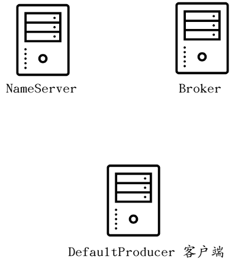

## 四. Name服务器的均等性

注意我们上述开启的是单个服务，也即一个 Broker 和一个 Name 服务器，但是实际上使用消息队列的时候，我们可能需要搭建的是一个集群，如下所示:

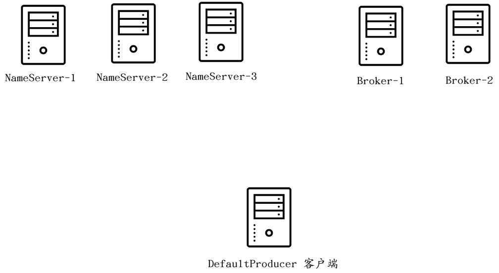

在 RocketMQ 的设计中，客户端需要首先**询问 NameServer**才能确定一个合适的 Broker 以进行消息的发送:

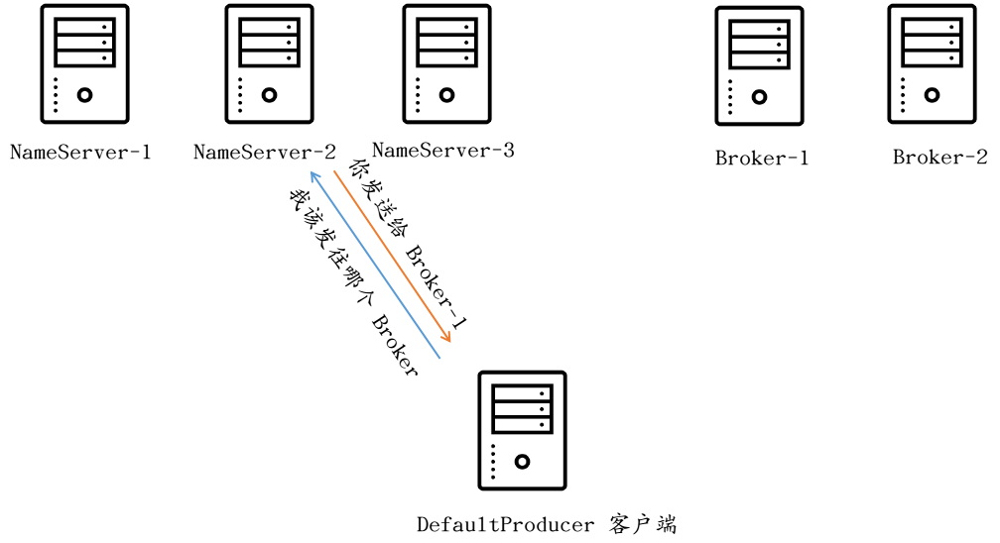

然而这么多 NameServer，客户端是如何选择一个合适的 NameServer 呢?

首先，我们要意识到很重要的一点，NameServer 全部都是处于相同状态的，保存的都是相同的信息。在 Broker 启动的时候，其会将自己在本地存储的话题配置文件 (默认位于 `$HOME/store/config/topics.json` 目录) 中的所有话题加载到内存中去，然后会将这些所有的话题全部同步到所有的 NameServer 中。与此同时，Broker 也会启动一个定时任务，默认每隔 30 秒来执行一次话题全同步:

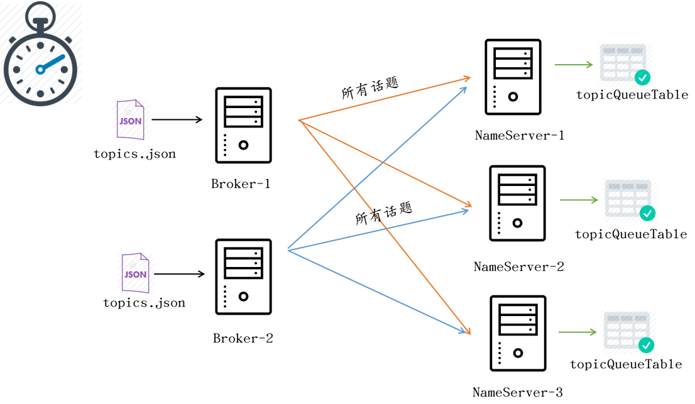

## 五. NameServer信息同步

NameServer作为无状态节点，本身不持久化任何信息，它只会将Broker通过心跳上报的Topic信息存储在内存中，不同的NameServer之间是没有通讯连接的，每一个NameServer中数据理论上来说都是最终一致的。

NameServer中存储如下元信息：

```java
public class RouteInfoManager {

    /**
     * topic消息队列的路由信息，消息发送时根据路由表进行负载均衡
     */
    private final HashMap<String/* topic */, List<QueueData>> topicQueueTable;
    /**
     * Broker基础信息，包含brokerName、所属集群名称、主备Broker地址。
     */
    private final HashMap<String/* brokerName */, BrokerData> brokerAddrTable;
    /**
     * Broker集群信息，存储集群中所有Broker的名称
     */
    private final HashMap<String/* clusterName */, Set<String/* brokerName */>> clusterAddrTable;
    /**
     * Broker状态信息，NameServer每次收到心跳包时会替换该信息
     */
    private final HashMap<String/* brokerAddr */, BrokerLiveInfo> brokerLiveTable;
    /**
     * Broker上的FilterServer列表，用于类模式消息过滤。类模式过滤机制在4.4及以后版本被废弃。
     */
    private final HashMap<String/* brokerAddr */, List<String>/* Filter Server */> filterServerTable;
}

public class QueueData implements Comparable<QueueData> {
    private String brokerName;
    private int readQueueNums;
    private int writeQueueNums;
    private int perm;
    private int topicSynFlag;
}

public class BrokerData implements Comparable<BrokerData> {
    private String cluster;
    private String brokerName;
    // brokerId=0代表主Master，大于0表示从Slave
    private HashMap<Long/* brokerId */, String/* broker address */> brokerAddrs;
}

class BrokerLiveInfo {
    //最近一次心跳上报的时间
    private long lastUpdateTimestamp;
    private DataVersion dataVersion;
    private Channel channel;
    private String haServerAddr;
}
```


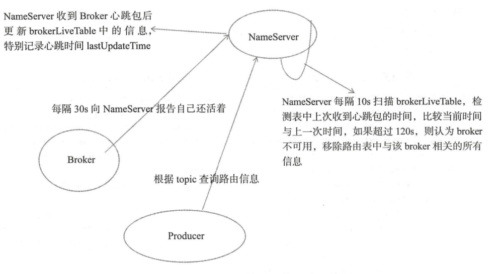


Broker在启动时，会将自身的信息全部注册至NameServer，然后每隔30s会向NameServer通过心跳更新自身的Topic信息。NameServer 每隔10s 会扫描 brokerLiveTable，检测表中上次收到心跳包的时间，比较当前时间与上一次时间，如果超过120s，则会认为broker不可用，移除路由表中该broker相关的所有信息：

```java
// org.apache.rocketmq.namesrv.NamesrvController#initialize
public boolean initialize() {

        this.kvConfigManager.load();

        // 初始化Netty信息，会在后序流程启动Netty
        this.remotingServer = new NettyRemotingServer(this.nettyServerConfig, this.brokerHousekeepingService);

        this.remotingExecutor =
            Executors.newFixedThreadPool(nettyServerConfig.getServerWorkerThreads(), new ThreadFactoryImpl("RemotingExecutorThread_"));

        this.registerProcessor();

        // 定时任务，每隔10s会扫描一次brokerLiveTable（存放心跳包的时间戳信息），如果在120s内没有收到心跳包，
        // 则认为Broker失效，更新topic的路由信息，将失效的Broker信息移除
        this.scheduledExecutorService.scheduleAtFixedRate(new Runnable() {

            @Override
            public void run() {
                NamesrvController.this.routeInfoManager.scanNotActiveBroker();
            }
        }, 5, 10, TimeUnit.SECONDS);

        // 每隔10s打印一次KV配置
        this.scheduledExecutorService.scheduleAtFixedRate(new Runnable() {

            @Override
            public void run() {
                NamesrvController.this.kvConfigManager.printAllPeriodically();
            }
        }, 1, 10, TimeUnit.MINUTES);

        //....

        return true;
    }
```


## 五. 选择 NameServer

由于 NameServer 每台机器存储的数据都是一致的。因此我们客户端任意选择一台服务器进行沟通即可。

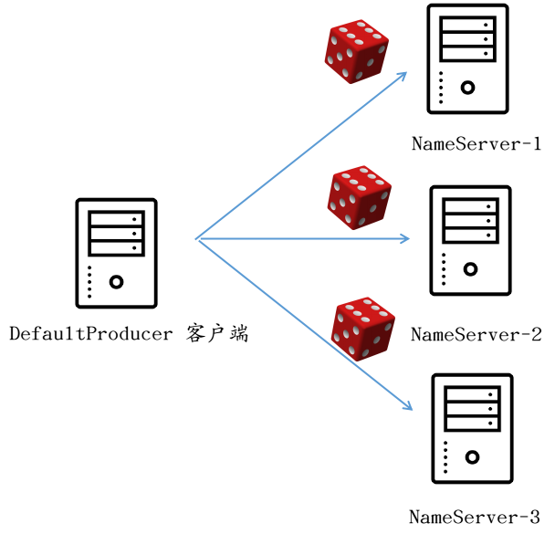

`org.apache.rocketmq.remoting.netty.NettyRemotingClient#getAndCreateNameserverChannel`

```java
public class NettyRemotingClient extends NettyRemotingAbstract implements RemotingClient {
    private Channel getAndCreateNameserverChannel() throws RemotingConnectException, InterruptedException {
        //获取已经选择的Name Server，如果可用就一直使用它
        String addr = this.namesrvAddrChoosed.get();
        if (addr != null) {
            ChannelWrapper cw = this.channelTables.get(addr);
            if (cw != null && cw.isOK()) {
                return cw.getChannel();
            }
        }

        // Name Server 列表
        final List<String> addrList = this.namesrvAddrList.get();
        if (this.lockNamesrvChannel.tryLock(LOCK_TIMEOUT_MILLIS, TimeUnit.MILLISECONDS)) {
            try {
                addr = this.namesrvAddrChoosed.get();
                // 双重校验机制
                if (addr != null) {
                    ChannelWrapper cw = this.channelTables.get(addr);
                    if (cw != null && cw.isOK()) {
                        return cw.getChannel();
                    }
                }

                if (addrList != null && !addrList.isEmpty()) {
                    // 循环寻找下一个可用的Name Server
                    for (int i = 0; i < addrList.size(); i++) {
                        int index = this.namesrvIndex.incrementAndGet();
                        index = Math.abs(index);
                        index = index % addrList.size();
                        String newAddr = addrList.get(index);

                        this.namesrvAddrChoosed.set(newAddr);
                        log.info("new name server is chosen. OLD: {} , NEW: {}. namesrvIndex = {}", addr, newAddr, namesrvIndex);
                        Channel channelNew = this.createChannel(newAddr);
                        if (channelNew != null) {
                            return channelNew;
                        }
                    }
                    throw new RemotingConnectException(addrList.toString());
                }
            } finally {
                this.lockNamesrvChannel.unlock();
            }
        } else {
            log.warn("getAndCreateNameserverChannel: try to lock name server, but timeout, {}ms", LOCK_TIMEOUT_MILLIS);
        }

        return null;
    }
}
```

以后，如果 `namesrvAddrChoosed` 选择的服务器如果一直处于连接状态，那么客户端就会一直与这台服务器进行沟通。否则的话，如上源代码所示，就会自动轮寻下一台可用服务器。

## 六. 寻找Topic路由信息

当客户端发送消息的时候，其首先会尝试寻找Topic路由信息。即**这条消息应该被发送到哪个地方去**。

客户端在内存中维护了一份和Topic相关的路由信息表 `topicPublishInfoTable`，当发送消息的时候，会首先尝试从此表中获取信息。如果此表不存在这条话题的话，那么便会从 Name 服务器获取路由消息。


`org.apache.rocketmq.client.impl.producer.DefaultMQProducerImpl#tryToFindTopicPublishInfo`：

```java
public class DefaultMQProducerImpl implements MQProducerInner {
    /**
     * 如果生产者中缓存了topic的路由信息，且该路由信息包含消息队列，则直
     * 接返回该路由信息。如果没有缓存或没有包含消息队列，则向
     * NameServer查询该topic的路由信息。如果最终未找到路由信息，则抛
     * 出异常，表示无法找到主题相关路由信息异常。
     * @param topic
     * @return
     */
    private TopicPublishInfo tryToFindTopicPublishInfo(final String topic) {
        // 先查本地缓存
        TopicPublishInfo topicPublishInfo = this.topicPublishInfoTable.get(topic);
        if (null == topicPublishInfo || !topicPublishInfo.ok()) {
            this.topicPublishInfoTable.putIfAbsent(topic, new TopicPublishInfo());
            // 如果本地缓存没有该topic路由信息，则查询NameServer并更新本地缓存
            this.mQClientFactory.updateTopicRouteInfoFromNameServer(topic);
            topicPublishInfo = this.topicPublishInfoTable.get(topic);
        }

        if (topicPublishInfo.isHaveTopicRouterInfo() || topicPublishInfo.ok()) {
            return topicPublishInfo;
        } else {
            // 如果是新创建的 Topic，NameServer中不会有Topic信息，则会加载 默认的Topic路由信息
            this.mQClientFactory.updateTopicRouteInfoFromNameServer(topic, true, this.defaultMQProducer);
            topicPublishInfo = this.topicPublishInfoTable.get(topic);
            return topicPublishInfo;
        }
    }
}
```

### 6.1 新建会话

这个Topic是新创建的，NameServer 不存在和此话题相关的信息：

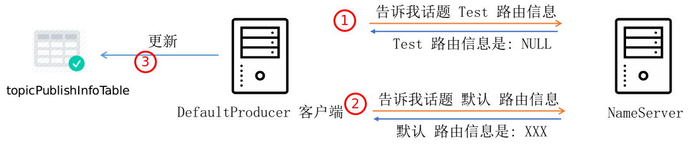

### 6.2 已存会话

话题之前创建过，NameServer存在此话题信息：

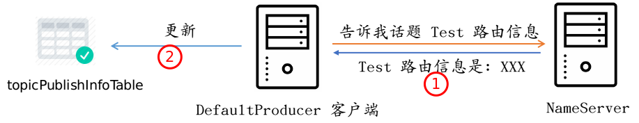

服务器返回的话题路由信息包括以下内容:

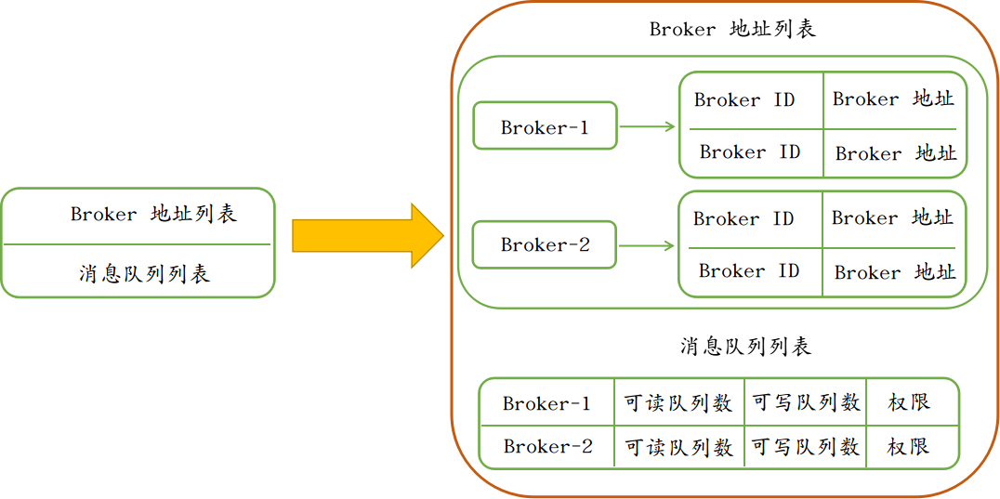

`org.apache.rocketmq.common.protocol.route.TopicRouteData`：

```java
public class TopicRouteData extends RemotingSerializable {
    private String orderTopicConf;
    private List<QueueData> queueDatas;
    private List<BrokerData> brokerDatas;
    private HashMap<String/* brokerAddr */, List<String>/* Filter Server */> filterServerTable;
}

public class QueueData implements Comparable<QueueData> {
    private String brokerName;
    private int readQueueNums;
    private int writeQueueNums;
    private int perm;
    private int topicSynFlag;
}

public class BrokerData implements Comparable<BrokerData> {
    private String cluster;
    private String brokerName;
    private HashMap<Long/* brokerId */, String/* broker address */> brokerAddrs;
}
```

“broker-1”、”broker-2” 分别为两个 Broker 服务器的名称，相同名称下可以有主从 Broker，因此每个 Broker 又都有 brokerId 。默认情况下，BrokerId 如果为 `MixAll.MASTER_ID` （值为 0） 的话，那么认为这个 Broker 为 MASTER 主节点，其余的位于相同名称下的 Broker 为这台 MASTER 主机的 SLAVE 主机。

`org.apache.rocketmq.client.impl.factory.MQClientInstance#findBrokerAddressInPublish`：

```java
public class MQClientInstance {
	public String findBrokerAddressInPublish(final String brokerName) {
        HashMap<Long/* brokerId */, String/* address */> map = this.brokerAddrTable.get(brokerName);
        if (map != null && !map.isEmpty()) {
            return map.get(MixAll.MASTER_ID);
        }

        return null;
    }
}
```

每个 Broker 上面可以绑定多个可写消息队列和多个可读消息队列，客户端根据返回的所有 Broker 地址列表和每个 Broker 的可写消息队列列表会在内存中构建一份所有的消息队列列表。之后客户端每次发送消息，都会在消息队列列表上轮循选择队列 (我们假设返回了两个 Broker，每个 Broker 均有 4 个可写消息队列):
`org.apache.rocketmq.client.impl.producer.TopicPublishInfo#selectOneMessageQueue()`：

```java
public class TopicPublishInfo {
	public MessageQueue selectOneMessageQueue() {
        int index = this.sendWhichQueue.getAndIncrement();
        int pos = Math.abs(index) % this.messageQueueList.size();
        if (pos < 0)
            pos = 0;
        return this.messageQueueList.get(pos);
    }
}
```

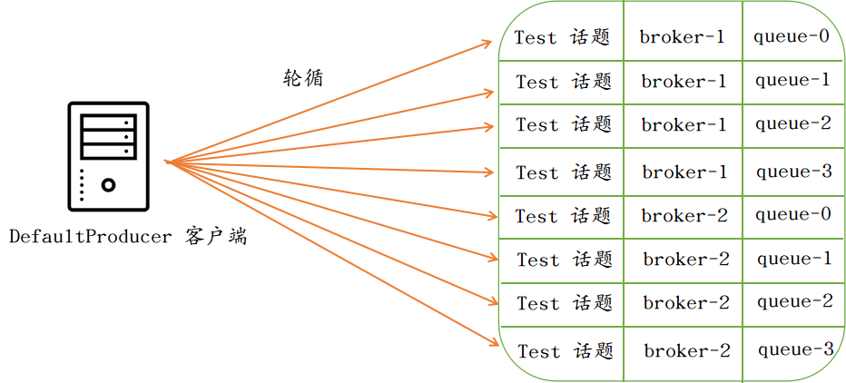

## 七. 给Broker发送消息

在确定了 Master Broker 地址和这个 Broker 的消息队列以后，客户端才开始真正地发送消息给这个 Broker，也是从这里客户端才开始与 Broker 进行交互:


这里我们暂且先忽略消息体格式的具体编/解码过程，因为我们并不想一开始就卷入这些繁枝细节中，现在先从大体上了解一下整个消息的发送流程，后续会写专门的文章来说明。

## 八. Broker 检查话题信息

刚才说到，如果话题信息在 Name 服务器不存在的话，那么会使用默认话题信息进行消息的发送。然而一旦这条消息到来之后，Broker 端还并没有这个话题。所以 Broker 需要检查话题的存在性:

`org.apache.rocketmq.broker.processor.AbstractSendMessageProcessor#msgCheck`：

```java
public abstract class AbstractSendMessageProcessor implements NettyRequestProcessor {

    protected RemotingCommand msgCheck(final ChannelHandlerContext ctx,
                                       final SendMessageRequestHeader requestHeader, final RemotingCommand response) {

        // ...

        TopicConfig topicConfig =
            this.brokerController
                .getTopicConfigManager()
                .selectTopicConfig(requestHeader.getTopic());
        if (null == topicConfig) {

            // ...

            topicConfig = this.brokerController
                .getTopicConfigManager()
                .createTopicInSendMessageMethod( ... );
            
        }
        
    }
    
}
```

如果话题不存在的话，那么便会创建一个话题信息存储到本地，并将所有话题再进行一次同步给所有的 NameServer:

`org.apache.rocketmq.broker.topic.TopicConfigManager#createTopicInSendMessageMethod`：

```java
public class TopicConfigManager extends ConfigManager {

    public TopicConfig createTopicInSendMessageMethod(final String topic, /** params **/) {
        // ...
        topicConfig = new TopicConfig(topic);
        
        this.topicConfigTable.put(topic, topicConfig);
        this.persist();

        // ...
        
        this.brokerController.registerBrokerAll(false, true);

        return topicConfig;
    }
    
}
```

话题检查的整体流程如下所示:

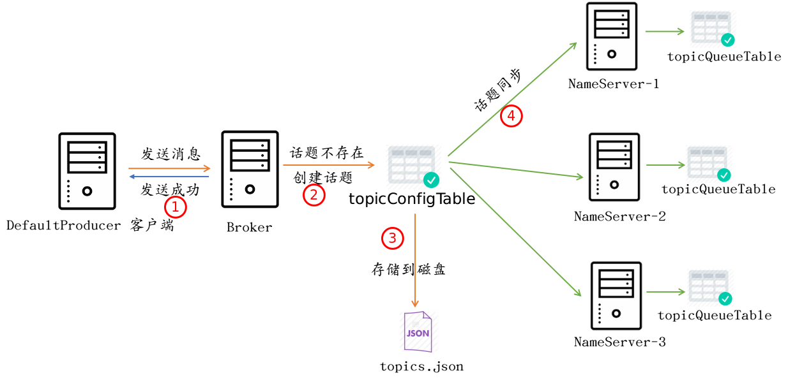

## 九. 消息存储

当 Broker 对消息的一些字段做过一番必要的检查之后，便会存储到磁盘中去:

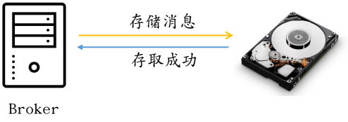

## 十. 整体流程

发送消息的整体流程:


