# RocketMQ消息存储流程

> 本文基于RocketMQ 4.6.0进行源码分析

## 一. 存储概要设计

RocketMQ存储的文件主要包括CommitLog文件、ConsumeQueue文件、Index文件。RocketMQ将所有topic的消息存储在同一个文件中，确保消息发送时按顺序写文件，尽最大的能力确保消息发送的高性能与高吞吐量。因为消息中间件一般是基于消息主题的订阅机制，所以给按照消息主题检索消息带来了极大的不便。为了提高消息消费的效率，RocketMQ引入了ConsumeQueue消息消费队列文件，每个topic包含多个消息消费队列，每一个消息队列有一个消息文件。Index索引文件的设计理念是为了加速消息的检索性能，根据消息的属性从CommitLog文件中快速检索消息。

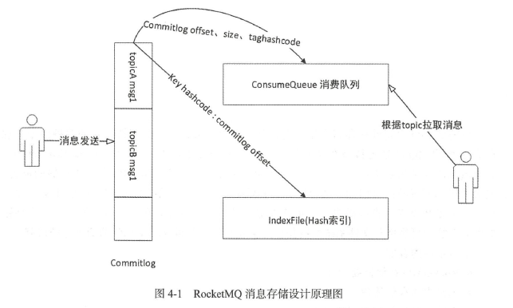

- CommitLog ：消息存储文件，所有topic的消息都存储在CommitLog 文件中。

- ConsumeQueue ：消息消费队列，消息到达CommitLog 文件后，将异步转发到消息消费队列，供消息消费者消费。

- IndexFile ：消息索引文件，主要存储消息Key 与Offset 的对应关系。

### 1.1 CommitLog

RocketMQ 在消息写入过程中追求极致的磁盘顺序写，**所有topic的消息全部写入一个文件，即 CommitLog 文件。所有消息按抵达顺序依次**

**追加到 CommitLog 文件中，消息一旦写入，不支持修改**。CommitLog 文件默认创建的大小为 1GB。


一个文件为 1GB 大小，也即 `1024 * 1024 * 1024 = 1073741824` 字节，CommitLog 每个文件的命名是按照总的字节偏移量来命名的。例如第一个文件偏移量为 0，那么它的名字为 `00000000000000000000`；当前这 1G 文件被存储满了之后，就会创建下一个文件，下一个文件的偏移量则为 1GB，那么它的名字为 `00000000001073741824`，以此类推。

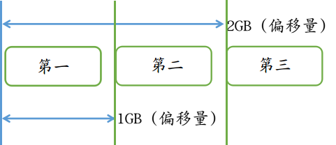

默认情况下这些消息文件位于 `$HOME/store/commitlog` 目录下，如下图所示:

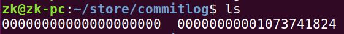


基于文件编程与基于内存编程一个很大的不同是基于内存编程时我们有现成的数据结构，例如List、HashMap，对数据的读写非常方便，那么一条一条消息存入CommitLog文件后，该如何查找呢？

正如关系型数据库会为每条数据引入一个ID字段，基于文件编程也会为每条消息引入一个身份标志：消息物理偏移量，即消息存储在文件的起始位置。

正是有了物理偏移量的概念，CommitLog文件的命名方式也是极具技巧性，使用存储在该文件的第一条消息在整个CommitLog文件组中的偏移量来命名，例如第一个CommitLog文件为0000000000000000000，第二个CommitLog文件为00000000001073741824，依次类推。

这样做的好处是给出任意一个消息的物理偏移量，可以通过二分法进行查找，快速定位这个文件的位置，然后用消息物理偏移量减去所在文件的名称，得到的差值就是在该文件中的绝对地址。

### 1.2 ConsumeQueue

CommitlLog文件的设计理念是追求极致的消息存储性能，但我们知道消息消费模型是基于主题订阅机制的，即一个消费组是消费特定主题的消息。根据主题从CommitlLog文件中检索消息，这绝不是一个好主意，这样只能从文件的第一条消息逐条检索，其性能可想而知，为了解决基于topic的消息检索问题，RocketMQ引入了ConsumeQueue文件。ConsumeQueue文件结构入下图：

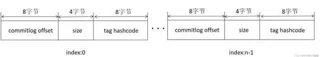

ConsumeQueue文件是消息消费队列文件，是 CommitLog 文件基于topic的索引文件，主要用于消费者根据 topic 消费消息，其组织方式为 `/topic/queue`，同一个队列中存在多个消息文件。ConsumeQueue 的设计极具技巧，每个条目长度固定（8字节CommitLog物理偏移量、4字节消息长度、8字节tag哈希码）。这里不是存储tag的原始字符串，而是存储哈希码，目的是确保每个条目的长度固定，可以使用访问类似数组下标的方式快速定位条目，极大地提高了ConsumeQueue文件的读取性能。消息消费者根据topic、消息消费进度（ConsumeQueue逻辑偏移量），即第几个ConsumeQueue条目，这样的消费进度去访问消息，通过逻辑偏移量logicOffset×20，即可找到该条目的起始偏移量（ConsumeQueue文件中的偏移量），然后读取该偏移量后20个字节即可得到一个条目，无须遍历ConsumeQueue文件。

ConsumeQueue文件可以看作基于topic维度的CommitLog索引文件，故ConsumeQueue文件夹的组织方式为topic/queue/file三层组织结构，文件存储在 `$HOME/store/consumequeue/{topic}/{queueId}/{fileName}`，单个文件由30万个条目组成，每个文件大小约5.72MB。同样的单个ConsumeQueue文件写满后，会继续写入下一个文件中。

### 1.3 Index

RocketMQ与Kafka相比具有一个强大的优势，就是支持按消息属性检索消息，引入ConsumeQueue文件解决了基于topic查找消息的问题，但如果想基于消息的某一个属性进行查找，ConsumeQueue文件就无能为力了。故RocketMQ又引入了Index索引文件，实现基于文件的哈希索引。Index文件的存储结构如下图所示。

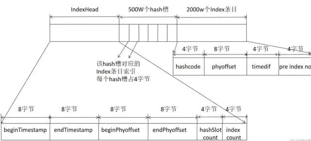

Index文件基于物理磁盘文件实现哈希索引。Index文件由40字节的文件头、500万个哈希槽、2000万个Index条目组成，每个哈希槽4字节、每个Index条目含有20个字节，分别为4字节索引key的哈希码、8字节消息物理偏移量、4字节时间戳、4字节的前一个Index条目（哈希冲突的链表结构）。

### 1.4 内存映射

虽然基于磁盘的顺序写消息可以极大提高I/O的写效率，但如果基于文件的存储采用常规的Java文件操作API，例如FileOutputStream等，将性能提升会很有限，故RocketMQ又引入了内存映射，将磁盘文件映射到内存中，以操作内存的方式操作磁盘，将性能又提升了一个档次。
在Java中可通过FileChannel的map方法创建内存映射文件。在Linux服务器中由该方法创建的文件使用的就是操作系统的页缓存（pagecache）。Linux操作系统中内存使用策略时会尽可能地利用机器的物理内存，并常驻内存中，即页缓存。在操作系统的内存不够的情况下，采用缓存置换算法，例如LRU将不常用的页缓存回收，即操作系统会自动管理这部分内存。

如果RocketMQ Broker进程异常退出，存储在页缓存中的数据并不会丢失，操作系统会定时将页缓存中的数据持久化到磁盘，实现数据安全可靠。不过如果是机器断电等异常情况，存储在页缓存中的数据也有可能丢失。

### 1.5 TransientStorePool机制

RocketMQ 中的 TransientStorePool 机制是一种优化磁盘写入性能的技术，主要应用于异步刷盘场景。这种机制主要是通过预先在堆外内存（Direct Memory）中分配一块固定大小的内存区域，然后将消息数据首先写入堆外内存，再由单独的线程负责把堆外内存中的数据批量地、按页对齐的方式写入到 MappedFile 中（CommitRealTimeService线程），也就是说无需每次写入数据时都进行系统调用从而提高写入效率。

以下是 RocketMQ 使用 TransientStorePool 的主要流程：

1. 预先在堆外内存中创建一个内存池（即 TransientStorePool），并初始化为一段连续的内存空间。
2. 当生产者发送消息时，RocketMQ 先将消息写入到 TransientStorePool 中的堆外内存里。
3. 刷盘线程定时或者达到一定数量的消息后，将堆外内存中的数据按页对齐的方式，批量写入到 MappedFile（MappedByteBuffer）中。
4. 最后，再由 MappedByteBuffer 进行真正的磁盘刷盘操作。

有了 TransientStorePool 的存在，消息可以批量写入内存缓冲区，RocketMQ 也就可以有效地控制何时以及如何将脏页（Dirty Page，即已修改但还未写入磁盘的内存页）刷写到磁盘，避免了操作系统自动进行的随机性、不可预测的脏页刷写操作，从而提升了**I/O**性能，特别是在大量写入请求的场景下。

值得一提的是，使用TransientStorePool并非没有代价。因为需要额外的一次内存复制操作，即从堆外内存复制到内存映射区域。但是在大多数情况下，通过控制脏页刷写带来的性能提升，相比于增加的内存复制开销，更加明显。

并且开启 transientStorePool 机制后，由于消息数据会先写入堆外内存，然后由特定后台线程（CommitRealTimeService），将堆外内存中的修改 commit 到内存映射区域，而这一步如果发生断电、服务宕机，都会产生消息丢失。而普通的异步刷盘，由于消息是直接写入内存映射区域，所以服务宕机并不会丢失数据，只有在服务器突然断电时才会丢失少量数据。

### 1.6 刷盘策略

有了顺序写和内存映射的加持，RocketMQ的写入性能得到了极大的保证，但凡事都有利弊，引入了内存映射和页缓存机制，消息会先写入页缓存，此时消息并没有真正持久化到磁盘。那么Broker收到客户端的消息后，是存储到页缓存中就直接返回成功，还是要持久化到磁盘中才返回成功呢？

这是一个“艰难”的选择，是在性能与消息可靠性方面进行权衡。为此，RocketMQ提供了三种策略：同步刷盘、异步刷盘、异步刷盘+缓冲区。

| 类型                                                         | 描述            |
| ------------------------------------------------------------ | --------------- |
| SYNC_FLUSH                                                   | 同步刷盘        |
| ASYNC_FLUSH && transientStorePoolEnable=false（默认为false） | 异步刷盘        |
| ASYNC_FLUSH && transientStorePoolEnable=true                 | 异步刷盘+缓冲区 |

- 同步刷盘时，只有消息被真正持久化到磁盘才会响应ACK，可靠性非常高，但是性能会受到较大影响，适用于金融业务。
- 异步刷盘时，消息写入PageCache就会响应ACK，然后由后台线程异步将PageCache里的内容持久化到磁盘，降低了读写延迟，提高了性能和吞吐量。服务宕机消息不丢失(操作系统会完成内存映射区域的刷盘)，机器断电少量消息丢失。
- 异步刷盘+缓冲区，消息先写入直接内存缓冲区，然后由后台线程异步将缓冲区里的内容持久化到磁盘，性能最好。但是最不可靠，服务宕机和机器断电都会丢失消息。

### 1.7 文件恢复机制

我们知道，RocketMQ主要的数据存储文件包括CommitLog、ConsumeQueue和Index，而ConsumeQueue、Index文件是根据CommitLog文件异步构建的。既然是异步操作，这两者之间的数据就不可能始终保持一致，那么，重启broker时需要如何恢复数据呢？我们考虑如下异常场景。

1. 消息采用同步刷盘方式写入CommitLog文件，准备转发给ConsumeQueue文件时由于断电等异常，导致存储失败。

2. 在刷盘的时候，突然记录了100MB消息，准备将这100MB消息写入磁盘，由于机器突然断电，只写入50MB消息到CommitLog文件。

3. 在RocketMQ存储目录下有一个检查点（Checkpoint）文件，用于记录CommitLog等文件的刷盘点。但将数据写入CommitLog文件后才会将刷盘点记录到检查点文件中，有可能在从刷盘点写入检查点文件前数据就丢失了。

在RocketMQ中有broker异常停止恢复和正常停止恢复两种场景。这两种场景的区别是定位从哪个文件开始恢复的逻辑不一样，大致思路如下。

1. 尝试恢复ConsumeQueue文件，根据文件的存储格式（8字节物理偏移量、4字节长度、8字节tag哈希码），找到最后一条完整的消息格式所对应的物理偏移量，用maxPhysical OfConsumequeue表示。
2. 尝试恢复CommitLog文件，先通过文件的魔数判断该文件是否为ComitLog文件，然后按照消息的存储格式寻找最后一条合格的消息，拿到其物理偏移量，如果CommitLog文件的有效偏移量小于ConsumeQueue文件存储的最大物理偏移量，将会删除ConsumeQueue中多余的内容，如果大于，说明ConsuemQueue文件存储的内容少于CommitLog文件，则会重推数据。

那么如何定位要恢复的文件呢？

正常停止刷盘的情况下，先从倒数第三个文件开始进行恢复，然后按照消息的存储格式进行查找，如果该文件中所有的消息都符合消息存储格式，则继续查找下一个文件，直到找到最后一条消息所在的位置。

异常停止刷盘的情况下，RocketMQ会借助检查点文件，即存储的刷盘点，定位恢复的文件。刷盘点记录的是CommitLog、ConsuemQueue、Index文件最后的刷盘时间戳，但并不是只认为该时间戳之前的消息是有效的，超过这个时间戳之后的消息就是不可靠的。

异常停止刷盘时，从最后一个文件开始寻找，在寻找时读取该文件第一条消息的存储时间，如果这个存储时间小于检查点文件中的刷盘时间，就可以从这个文件开始恢复，如果这个文件中第一条消息的存储时间大于刷盘点，说明不能从这个文件开始恢复，需要寻找上一个文件，因为检查点文件中的刷盘点代表的是100%可靠的消息。

## 二. 存储文件组织与内存映射实现

RocketMQ通过使用内存映射文件来提高I/O访问性能，无论是CommitLog、Consume-Queue还是Index，单个文件都被设计为固定长度，一个文件写满以后再创建新文件，文件名就为该文件第一条消息对应的全局物理偏移量。

RocketMQ使用MappedFile、MappedFileQueue来封装存储文件。

### 2.1 MappedFileQueue映射文件队列

MappedFileQueue是MappedFile的管理容器，MappedFileQueue对存储目录进行封装，例如CommitLog文件的存储路径为`${ROCKET_HOME}/store/commitlog/`，该目录下会存在多个内存映射文件MappedFile。MappedFileQueue结构如下：

```java
/**
 * RocketMQ通过使用内存映射文件来提高I/O访问性能，无论是
 * CommitLog、Consume-Queue还是Index，单个文件都被设计为固定长
 * 度，一个文件写满以后再创建新文件，文件名就为该文件第一条消息
 * 对应的全局物理偏移量。
 * RocketMQ使用MappedFile、MappedFileQueue来封装存储文件。
 *
 * MappedFileQueue是MappedFile的管理容器，MappedFileQueue对
 * 存储目录进行封装，
 *
 * 例如CommitLog文件的存储场景下，存储路径为${ROCKET_HOME}/store/commitlog/，
 * 该目录下会存在多个内存映射文件MappedFile
 */
public class MappedFileQueue {
    private static final int DELETE_FILES_BATCH_MAX = 10;
    /**
     * 存储目录
     */
    private final String storePath;
    /**
     * 单个文件的存储大小
     */
    private final int mappedFileSize;
    /**
     * MappedFile集合
     */
    private final CopyOnWriteArrayList<MappedFile> mappedFiles = new CopyOnWriteArrayList<MappedFile>();
    /**
     * 创建MappedFile服务类
     */
    private final AllocateMappedFileService allocateMappedFileService;
    /**
     * 当前刷盘指针，表示该指针之前的所有数据全部持久化到磁盘
     */
    private long flushedWhere = 0;
    /**
     * 当前数据提交指针，内存中ByteBuffer当前的写指针，该值大于、等于flushedWhere
     */
    private long committedWhere = 0;

    private volatile long storeTimestamp = 0;
}
```

#### 2.1.1 根据消息存储时间戳查找MappdFile

```java
    /**
     * 根据消息存储时间戳查找MappdFile。从MappedFile列表中第一个
     * 文件开始查找，找到第一个最后一次更新时间大于待查找时间戳的文
     * 件，如果不存在，则返回最后一个MappedFile
     * @param timestamp
     * @return
     */
    public MappedFile getMappedFileByTime(final long timestamp) {
        Object[] mfs = this.copyMappedFiles(0);

        if (null == mfs)
            return null;

        for (int i = 0; i < mfs.length; i++) {
            MappedFile mappedFile = (MappedFile) mfs[i];
            if (mappedFile.getLastModifiedTimestamp() >= timestamp) {
                return mappedFile;
            }
        }

        return (MappedFile) mfs[mfs.length - 1];
    }
```

根据消息存储时间戳查找MappdFile。从MappedFile列表中第一个文件开始查找，找到第一个最后一次更新时间大于待查找时间戳的文件，如果不存在，则返回最后一个MappedFile。

#### 2.1.2 根据消息偏移量offset查找MappedFile、

```java
// org.apache.rocketmq.store.MappedFileQueue#findMappedFileByOffset(long, boolean)
public MappedFile findMappedFileByOffset(final long offset, final boolean returnFirstOnNotFound) {
        try {
            MappedFile firstMappedFile = this.getFirstMappedFile();
            MappedFile lastMappedFile = this.getLastMappedFile();
            if (firstMappedFile != null && lastMappedFile != null) {
                if (offset < firstMappedFile.getFileFromOffset() || offset >= lastMappedFile.getFileFromOffset() + this.mappedFileSize) {
                    LOG_ERROR.warn("Offset not matched. Request offset: {}, firstOffset: {}, lastOffset: {}, mappedFileSize: {}, mappedFiles count: {}",
                        offset,
                        firstMappedFile.getFileFromOffset(),
                        lastMappedFile.getFileFromOffset() + this.mappedFileSize,
                        this.mappedFileSize,
                        this.mappedFiles.size());
                } else {
                    // 计算文件索引
                    int index = (int) ((offset / this.mappedFileSize) - (firstMappedFile.getFileFromOffset() / this.mappedFileSize));
                    MappedFile targetFile = null;
                    try {
                        targetFile = this.mappedFiles.get(index);
                    } catch (Exception ignored) {
                    }

                    if (targetFile != null && offset >= targetFile.getFileFromOffset()
                        && offset < targetFile.getFileFromOffset() + this.mappedFileSize) {
                        return targetFile;
                    }

                    for (MappedFile tmpMappedFile : this.mappedFiles) {
                        if (offset >= tmpMappedFile.getFileFromOffset()
                            && offset < tmpMappedFile.getFileFromOffset() + this.mappedFileSize) {
                            return tmpMappedFile;
                        }
                    }
                }

                if (returnFirstOnNotFound) {
                    return firstMappedFile;
                }
            }
        } catch (Exception e) {
            log.error("findMappedFileByOffset Exception", e);
        }

        return null;
    }
```

根据消息偏移量offset查找MappedFile，但是不能直接使用 offset%mappedFileSize。这是因为使用了内存映射，只要是存在于存储目录下的文件，都需要对应创建内存映射文件，如果不定期进行将已消费的消息从存储文件中删除，会造成极大的内存压力与资源浪费，所以RocketMQ采取定时删除存储文件的策略。也就是说，在存储文件中，第一个文件不一定是00000000000000000000，因为该文件在某一时刻会被删除，所以根据offset定位MappedFile的算法为(int)((offset/this.mappedFileSize)(mappedFile.getFileFromOffset()/this.MappedFileSize))

### 2.2 MappedFile内存映射文件

MappedFile是RocketMQ内存映射文件的具体实现。核心属性有：

```java
public class MappedFile extends ReferenceResource {

    /**
     * 操作系统页大小
     */
    public static final int OS_PAGE_SIZE = 1024 * 4;
    protected static final InternalLogger log = InternalLoggerFactory.getLogger(LoggerName.STORE_LOGGER_NAME);
    /**
     * 当前JVM实例中MappedFile的虚拟内存。
     */
    private static final AtomicLong TOTAL_MAPPED_VIRTUAL_MEMORY = new AtomicLong(0);
    /**
     * 当前JVM实例中MappedFile对象个数。
     */
    private static final AtomicInteger TOTAL_MAPPED_FILES = new AtomicInteger(0);
    /**
     * 当前文件的写指针，从0开始（内存映射文件中的写指针）。
     */
    protected final AtomicInteger wrotePosition = new AtomicInteger(0);
    /**
     * 当前文件的提交指针，如果开启transientStorePool，则数据会存储在
     * TransientStorePool中，然后提交到内存映射ByteBuffer中，再写入磁盘。
     */
    protected final AtomicInteger committedPosition = new AtomicInteger(0);
    /**
     * 将该指针之前的数据持久化存储到磁盘中。
     */
    private final AtomicInteger flushedPosition = new AtomicInteger(0);
    protected int fileSize;
    /**
     * 文件通道
     */
    protected FileChannel fileChannel;
    /**
     * Message will put to here first, and then reput to FileChannel if writeBuffer is not null.
     */
    /**
     * 堆外内存ByteBuffer，如果不为空，数据首先将存储在该Buffer中，然后提交到MappedFile创建的
     * FileChannel中。transientStorePoolEnable为true时不为空。
     */
    protected ByteBuffer writeBuffer = null;
    /**
     * 堆外内存池，该内存池中的内存会提供内存锁机制。transientStorePoolEnable为true时启用。
     */
    protected TransientStorePool transientStorePool = null;
    /**
     * 文件名称
     */
    private String fileName;
    /**
     * 该文件的初始偏移量
     */
    private long fileFromOffset;
    /**
     * 物理文件
     */
    private File file;
    /**
     * 物理文件对应的内存映射Buffer。(内存映射对象，对其进行数据写入，会由操作系统同步至磁盘)
     */
    private MappedByteBuffer mappedByteBuffer;
    /**
     * 文件最后一次写入内容的时间
     */
    private volatile long storeTimestamp = 0;
    /**
     * 是否是MappedFileQueue队列中第一个文件。
     */
    private boolean firstCreateInQueue = false;
}
```

其中 MappedByteBuffer 就是我们之前所说的内存映射对象，当你向 MappedByteBuffer 写入数据时，这些改动会直接写入到磁盘上。如果你修改 MappedByteBuffer 中的内容，改动对所有访问同一文件的其他映射文件也是可见的。从API角度来看使用MappedByteBuffer操作文件可以像操作内存中的一个连续区域一样，修改内存中的数据，会由操作系统同步至磁盘。

> 内存映射机制可以参考：[《Java中使用内存映射操作文件》](../../../Netty/subfile/_12内存映射机制.md)

#### 2.2.1 MappedFile初始化

第一步：根据是否开启transientStorePoolEnable存在两种初始化情况。transientStorePool-Enable为true表示内容先存储在堆外内存，然后通过Commit线程将数据提交到FileChannel中，再通过Flush线程将数据持久化到磁盘中：

```java
 public void init(final String fileName, final int fileSize,
     final TransientStorePool transientStorePool) throws IOException {
     init(fileName, fileSize);
     this.writeBuffer = transientStorePool.borrowBuffer();
     this.transientStorePool = transientStorePool;
 }
```

第二步：初始化fileFromOffset为文件名，也就是文件名代表该文件的起始偏移量，通过RandomAccessFile创建读写文件通道，并将文件内容使用NIO的内存映射Buffer将文件映射到内存中

```java
//org.apache.rocketmq.store.MappedFile#init(java.lang.String, int)
private void init(final String fileName, final int fileSize) throws IOException {
        this.fileName = fileName;
        this.fileSize = fileSize;
        this.file = new File(fileName);
        this.fileFromOffset = Long.parseLong(this.file.getName());
        boolean ok = false;

        ensureDirOK(this.file.getParent());

        try {
            this.fileChannel = new RandomAccessFile(this.file, "rw").getChannel();
            // 创建内存映射 MappedByteBuffer
            this.mappedByteBuffer = this.fileChannel.map(MapMode.READ_WRITE, 0, fileSize);
            TOTAL_MAPPED_VIRTUAL_MEMORY.addAndGet(fileSize);
            TOTAL_MAPPED_FILES.incrementAndGet();
            ok = true;
        } catch (FileNotFoundException e) {
            log.error("Failed to create file " + this.fileName, e);
            throw e;
        } catch (IOException e) {
            log.error("Failed to map file " + this.fileName, e);
            throw e;
        } finally {
            if (!ok && this.fileChannel != null) {
                this.fileChannel.close();
            }
        }
    }

```

#### 2.2.2 MappedFile提交

内存映射文件的提交动作由MappedFile的commit()方法实现：

```java
    /**
     * 内存映射文件的提交动作由MappedFile的commit()方法实现
     * @param commitLeastPages 本次提交的最小页数，如果待提交数据不满足commitLeastPages，则不执行本次提交操作，等待下次提交
     * @return
     */
    public int commit(final int commitLeastPages) {
        if (writeBuffer == null) {
            //no need to commit data to file channel, so just regard wrotePosition as committedPosition.
            return this.wrotePosition.get();
        }
        if (this.isAbleToCommit(commitLeastPages)) {
            if (this.hold()) {
                commit0(commitLeastPages);
                this.release();
            } else {
                log.warn("in commit, hold failed, commit offset = " + this.committedPosition.get());
            }
        }

        // All dirty data has been committed to FileChannel.
        if (writeBuffer != null && this.transientStorePool != null && this.fileSize == this.committedPosition.get()) {
            this.transientStorePool.returnBuffer(writeBuffer);
            this.writeBuffer = null;
        }

        return this.committedPosition.get();
    }
```

isAbleToCommit 方法校验本次提交的最小页数，如果待提交数据不满足commitLeastPages，则不执行本次提交操作，等待下次提交：

```java
//org.apache.rocketmq.store.MappedFile#isAbleToCommit 
/**
  * 判断是否执行commit操作。如果文件已满，返回true。如果
  * commitLeastPages大于0，则计算wrotePosition（当前writeBuffe的
  * 写指针）与上一次提交的指针（committedPosition）的差值，将其除
  * 以OS_PAGE_SIZE得到当前脏页的数量，如果大于commitLeastPages，
  * 则返回true。如果commitLeastPages小于0，表示只要存在脏页就提交
  * @param commitLeastPages
  * @return
  */
 protected boolean isAbleToCommit(final int commitLeastPages) {
     int flush = this.committedPosition.get();
     int write = this.wrotePosition.get();

     if (this.isFull()) {
         return true;
     }

     if (commitLeastPages > 0) {
         return ((write / OS_PAGE_SIZE) - (flush / OS_PAGE_SIZE)) >= commitLeastPages;
     }

     return write > flush;
 }
```

有了 TransientStorePool 的存在，消息可以批量写入堆外内存缓冲区，RocketMQ 也就可以有效地控制何时以及如何将脏页（Dirty Page，即已修改但还未写入磁盘的内存页）刷写到磁盘，避免了操作系统自动进行的随机性、不可预测的脏页刷写操作，从而提升了**I/O**性能，特别是在大量写入请求的场景下。但是引入此种机制会带来新的问题，前文已经详细介绍过了，此处不再赘述。

#### 2.2.3 MappedFile刷盘

刷盘指的是将内存中的数据写入磁盘，永久存储在磁盘中，由MappedFile的flush()方法实现：

```java
// org.apache.rocketmq.store.MappedFile#flush
public int flush(final int flushLeastPages) {
        if (this.isAbleToFlush(flushLeastPages)) {
            if (this.hold()) {
                int value = getReadPosition();

                try {
                    //We only append data to fileChannel or mappedByteBuffer, never both.
                    if (writeBuffer != null || this.fileChannel.position() != 0) {
                        this.fileChannel.force(false);
                    } else {
                        // 直接调用mappedByteBuffer或fileChannel的force()方法将数据
                        // 写入磁盘，将内存中的数据持久化到磁盘中，
                        this.mappedByteBuffer.force();
                    }
                } catch (Throwable e) {
                    log.error("Error occurred when force data to disk.", e);
                }

                this.flushedPosition.set(value);
                this.release();
            } else {
                log.warn("in flush, hold failed, flush offset = " + this.flushedPosition.get());
                this.flushedPosition.set(getReadPosition());
            }
        }
        return this.getFlushedPosition();
    }
```

#### 2.2.4 TransientStorePool

TransientStorePool即短暂的存储池。RocketMQ单独创建了一个DirectByteBuffer内存缓存池，用来临时存储数据，数据先写入该内存映射中，然后由Commit线程定时将数据从该内存复制到与目标物理文件对应的内存映射中。RokcetMQ引入该机制是为了提供一种内存锁定，将当前堆外内存一直锁定在内存中，避免被进程将内存交换到磁盘中。

TransientStorePool核心属性如下：

```java
public class TransientStorePool {
    private static final InternalLogger log = InternalLoggerFactory.getLogger(LoggerName.STORE_LOGGER_NAME);

    /**
     * avaliableBuffers个数，可在broker配置文件中通过transient StorePoolSize进行设置，默认为5
     */
    private final int poolSize;
    /**
     * 每个ByteBuffer的大小，默认为mapedFileSizeCommitLog，表明TransientStorePool为CommitLog文件服务。
     */
    private final int fileSize;
    /**
     * ByteBuffer容器，双端队列。
     */
    private final Deque<ByteBuffer> availableBuffers;
    private final MessageStoreConfig storeConfig;
}
```

#### 2.2.5 内存映射整体流程

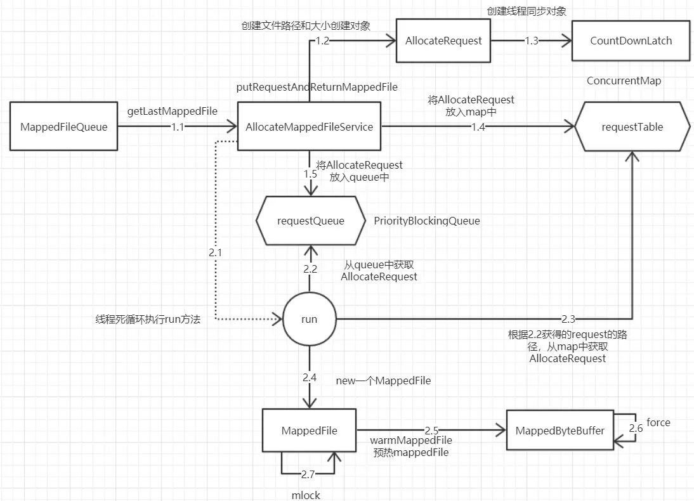

- 内存映射文件MappedFile通过AllocateMappedFileService创建
- MappedFile的创建是典型的生产者-消费者模型
- MappedFileQueue调用getLastMappedFile获取MappedFile时，将请求放入队列中
- AllocateMappedFileService线程持续监听队列，队列有请求时，创建出MappedFile对象
- 最后将MappedFile对象预热，底层调用force方法和mlock方法

## 三. 消息存储整体流程

### 3.1 ConmmitLog存储流程

消息存储入口为`org.apache.rocketmq.store.DefaultMessageStore#putMessage`。

```java
// org.apache.rocketmq.store.DefaultMessageStore#putMessage
		// 如果当前broker停止工作或当前不支持写入，则拒绝消息写入。
        if (this.shutdown) {
            log.warn("message store has shutdown, so putMessage is forbidden");
            return new PutMessageResult(PutMessageStatus.SERVICE_NOT_AVAILABLE, null);
        }

        // 如果当前broker是从节点，则拒绝写入消息
        if (BrokerRole.SLAVE == this.messageStoreConfig.getBrokerRole()) {
            long value = this.printTimes.getAndIncrement();
            if ((value % 50000) == 0) {
                log.warn("message store is slave mode, so putMessage is forbidden ");
            }

            return new PutMessageResult(PutMessageStatus.SERVICE_NOT_AVAILABLE, null);
        }

        // 判断当前broker是否能够写入
        if (!this.runningFlags.isWriteable()) {
            long value = this.printTimes.getAndIncrement();
            if ((value % 50000) == 0) {
                log.warn("message store is not writeable, so putMessage is forbidden " + this.runningFlags.getFlagBits());
            }

            return new PutMessageResult(PutMessageStatus.SERVICE_NOT_AVAILABLE, null);
        } else {
            this.printTimes.set(0);
        }

        // topic长度大于127字符，则报错
        if (msg.getTopic().length() > Byte.MAX_VALUE) {
            log.warn("putMessage message topic length too long " + msg.getTopic().length());
            return new PutMessageResult(PutMessageStatus.MESSAGE_ILLEGAL, null);
        }

        // 消息属性长度大于 32767，则报错
        if (msg.getPropertiesString() != null && msg.getPropertiesString().length() > Short.MAX_VALUE) {
            log.warn("putMessage message properties length too long " + msg.getPropertiesString().length());
            return new PutMessageResult(PutMessageStatus.PROPERTIES_SIZE_EXCEEDED, null);
        }

        // OSPageCacheBusy通常是出现在操作系统在试图缓存太多页面时。当物理内存充满了，操作系统可能试图清除一些页面来为新的页面腾出空间。
        // 如果这个过程中所有的页面都在使用（即“繁忙”），那么就会报告OSPageCacheBusy。
        if (this.isOSPageCacheBusy()) {
            return new PutMessageResult(PutMessageStatus.OS_PAGECACHE_BUSY, null);
        }
```

第一步：先对broker和消息进行基础校验。如果当前broker停止工作或当前不支持写入，则拒绝消息写入。如果消息主题长度超过127个字符、消息属性长度超过32767个字符，同样拒绝该消息写入。如果日志中出现“message store is not writeable, so putMessage is forbidden”提示，最有可能是因为磁盘空间不足，在写入ConsumeQueue、Index文件出现错误时会拒绝消息再次写入。

```java
    public PutMessageResult putMessage(final MessageExtBrokerInner msg) {
        // Set the storage time
        // 记录消息写入时间
        msg.setStoreTimestamp(System.currentTimeMillis());
        // Set the message body BODY CRC (consider the most appropriate setting
        // on the client)
        msg.setBodyCRC(UtilAll.crc32(msg.getBody()));
        // Back to Results
        AppendMessageResult result = null;

        StoreStatsService storeStatsService = this.defaultMessageStore.getStoreStatsService();

        String topic = msg.getTopic();
        int queueId = msg.getQueueId();

        final int tranType = MessageSysFlag.getTransactionValue(msg.getSysFlag());
        if (tranType == MessageSysFlag.TRANSACTION_NOT_TYPE
            || tranType == MessageSysFlag.TRANSACTION_COMMIT_TYPE) {
            // Delay Delivery
            if (msg.getDelayTimeLevel() > 0) {
                if (msg.getDelayTimeLevel() > this.defaultMessageStore.getScheduleMessageService().getMaxDelayLevel()) {
                    msg.setDelayTimeLevel(this.defaultMessageStore.getScheduleMessageService().getMaxDelayLevel());
                }


                topic = ScheduleMessageService.SCHEDULE_TOPIC;
                queueId = ScheduleMessageService.delayLevel2QueueId(msg.getDelayTimeLevel());

                // Backup real topic, queueId
                // 如果消息的延迟级别大于0，将消息的原主题名称与原消息队列ID存入消息属性中，用延迟消息主题SCHEDULE_TOPIC_XXXX、消
                //息队列ID更新原先消息的主题与队列，这是并发消息重试关键的异步
                MessageAccessor.putProperty(msg, MessageConst.PROPERTY_REAL_TOPIC, msg.getTopic());
                MessageAccessor.putProperty(msg, MessageConst.PROPERTY_REAL_QUEUE_ID, String.valueOf(msg.getQueueId()));
                msg.setPropertiesString(MessageDecoder.messageProperties2String(msg.getProperties()));

                msg.setTopic(topic);
                msg.setQueueId(queueId);
            }
        }

        InetSocketAddress bornSocketAddress = (InetSocketAddress) msg.getBornHost();
        if (bornSocketAddress.getAddress() instanceof Inet6Address) {
            msg.setBornHostV6Flag();
        }

        InetSocketAddress storeSocketAddress = (InetSocketAddress) msg.getStoreHost();
        if (storeSocketAddress.getAddress() instanceof Inet6Address) {
            msg.setStoreHostAddressV6Flag();
        }

        long eclipsedTimeInLock = 0;

        MappedFile unlockMappedFile = null;
        // 获取当前可以写入的CommitLog文件，对应 ${ROCKET_HOME}/store/commitlog 文件夹下的文件
        MappedFile mappedFile = this.mappedFileQueue.getLastMappedFile();
        // 在将消息写入CommitLog之前，先申请putMessageLock
        putMessageLock.lock(); //spin or ReentrantLock ,depending on store config
        try {
            long beginLockTimestamp = this.defaultMessageStore.getSystemClock().now();
            this.beginTimeInLock = beginLockTimestamp;

            // Here settings are stored timestamp, in order to ensure an orderly
            // global
            msg.setStoreTimestamp(beginLockTimestamp);

            if (null == mappedFile || mappedFile.isFull()) {
                //如果mappedFile为空，表明 ${ROCKET_HOME}/store/commitlog目录下不存在任何文件，说明本次
                //消息是第一次发送，用偏移量0创建第一个CommitLog文件，文件名为00000000000000000000，
                mappedFile = this.mappedFileQueue.getLastMappedFile(0); // Mark: NewFile may be cause noise
            }
            if (null == mappedFile) {
                log.error("create mapped file1 error, topic: " + msg.getTopic() + " clientAddr: " + msg.getBornHostString());
                beginTimeInLock = 0;
                // 如果文件创建失败，抛出CREATE_MAPEDFILE_FAILED，这很有可能是磁盘空间不足或权限不够导致的，
                return new PutMessageResult(PutMessageStatus.CREATE_MAPEDFILE_FAILED, null);
            }

            // 将消息追加到 CommitLog 中
            result = mappedFile.appendMessage(msg, this.appendMessageCallback);
            switch (result.getStatus()) {
                case PUT_OK:
                    break;
                case END_OF_FILE:
                    // 当前CommitLog文件不够写入此条消息 (CommitLog定长1GB)
                    unlockMappedFile = mappedFile;
                    // Create a new file, re-write the message
                    mappedFile = this.mappedFileQueue.getLastMappedFile(0);
                    if (null == mappedFile) {
                        // XXX: warn and notify me
                        log.error("create mapped file2 error, topic: " + msg.getTopic() + " clientAddr: " + msg.getBornHostString());
                        beginTimeInLock = 0;
                        return new PutMessageResult(PutMessageStatus.CREATE_MAPEDFILE_FAILED, result);
                    }
                    result = mappedFile.appendMessage(msg, this.appendMessageCallback);
                    break;
                case MESSAGE_SIZE_EXCEEDED:
                case PROPERTIES_SIZE_EXCEEDED:
                    beginTimeInLock = 0;
                    return new PutMessageResult(PutMessageStatus.MESSAGE_ILLEGAL, result);
                case UNKNOWN_ERROR:
                    beginTimeInLock = 0;
                    return new PutMessageResult(PutMessageStatus.UNKNOWN_ERROR, result);
                default:
                    beginTimeInLock = 0;
                    return new PutMessageResult(PutMessageStatus.UNKNOWN_ERROR, result);
            }

            eclipsedTimeInLock = this.defaultMessageStore.getSystemClock().now() - beginLockTimestamp;
            beginTimeInLock = 0;
        } finally {
            // 追加完毕，释放锁
            putMessageLock.unlock();
        }

        if (eclipsedTimeInLock > 500) {
            log.warn("[NOTIFYME]putMessage in lock cost time(ms)={}, bodyLength={} AppendMessageResult={}", eclipsedTimeInLock, msg.getBody().length, result);
        }

        if (null != unlockMappedFile && this.defaultMessageStore.getMessageStoreConfig().isWarmMapedFileEnable()) {
            this.defaultMessageStore.unlockMappedFile(unlockMappedFile);
        }

        PutMessageResult putMessageResult = new PutMessageResult(PutMessageStatus.PUT_OK, result);

        // Statistics
        storeStatsService.getSinglePutMessageTopicTimesTotal(msg.getTopic()).incrementAndGet();
        storeStatsService.getSinglePutMessageTopicSizeTotal(topic).addAndGet(result.getWroteBytes());

        // appendMessage只是将消息追加到内存中，需要根据采取的是同步刷盘方式还是异步刷盘方式，将内存中的数据持久化到磁盘中。
        handleDiskFlush(result, putMessageResult, msg);
        // HA主从同步复制
        handleHA(result, putMessageResult, msg);

        return putMessageResult;
    }
```

第二步：如果消息的延迟级别大于0，将消息的原主题名称与原消息队列ID存入消息属性中，用延迟消息主题SCHEDULE_TOPIC_XXXX、消息队列ID更新原先消息的主题与队列。这是并发消息消费重试关键的一步，第5章会重点探讨消息重试机制与定时消息的实现原理。

第三步：获取当前可以写入的CommitLog文件。CommitLog文件的存储目录为 `${ROCKET_HOME}/store/commitlog`，每个文件默认1GB，一个文件写满后再创建另一个，以该文件中第一个偏移量为文件名，如果偏移量少于20位则用0补齐。第一个文件初始偏移量为0，第二个文件名中的“1073741824”代表该文件第一条消息的物理偏移量为1073741824，这样根据物理偏移量可以快速定位到消息。MappedFileQueue可以看作${ROCKET_HOME}/store/commitlog文件夹，而MappedFile则对应该文件夹下的文件。

第四步：在将消息写入CommitLog之前，先申请putMessageLock

第五步：设置消息的存储时间，如果mappedFile为空，表明${ROCKET_HOME}/store/commitlog目录下不存在任何文件，说明本次消息是第一次发送，用偏移量0创建第一个CommitLog文件，文件名为00000000000000000000，如果文件创建失败，抛出CREATE_MAPEDFILE_FAILED，这很有可能是磁盘空间不足或权限不够导致的。

第六步：将消息追加到MappedFile中。首先获取MappedFile当前的写指针，如果currentPos大于或等于文件大小，表明文件已写满，抛出AppendMessageStatus.UNKNOWN_ERROR。如果currentPos小于文件大小，通过slice()方法创建一个与原ByteBuffer共享的内存区，且拥有独立的position、limit、capacity等指针，并设置position为当前指针：

```java
// org.apache.rocketmq.store.MappedFile#appendMessagesInner    
public AppendMessageResult appendMessagesInner(final MessageExt messageExt, final AppendMessageCallback cb) {
        assert messageExt != null;
        assert cb != null;

        // 首先获取MappedFile当前的写指针，如果currentPos大于或等于文件大小，表明文件已写满
        int currentPos = this.wrotePosition.get();

        if (currentPos < this.fileSize) {
            // 通过slice()方法创建一个与原ByteBuffer共享的内存区，且拥有独立的position、limit、capacity等指针（零拷贝）
            ByteBuffer byteBuffer = writeBuffer != null ? writeBuffer.slice() : this.mappedByteBuffer.slice();
            // 并设置position为当前指针
            byteBuffer.position(currentPos);
            AppendMessageResult result;
            // 执行写入操作，将消息内容存储到ByteBuffer中，这里只是将消息存储在MappedFile对应的内存映射Buffer中，并没有写入磁盘
            if (messageExt instanceof MessageExtBrokerInner) {
                result = cb.doAppend(this.getFileFromOffset(), byteBuffer, this.fileSize - currentPos, (MessageExtBrokerInner) messageExt);
            } else if (messageExt instanceof MessageExtBatch) {
                result = cb.doAppend(this.getFileFromOffset(), byteBuffer, this.fileSize - currentPos, (MessageExtBatch) messageExt);
            } else {
                return new AppendMessageResult(AppendMessageStatus.UNKNOWN_ERROR);
            }
            this.wrotePosition.addAndGet(result.getWroteBytes());
            this.storeTimestamp = result.getStoreTimestamp();
            return result;
        }
        log.error("MappedFile.appendMessage return null, wrotePosition: {} fileSize: {}", currentPos, this.fileSize);
        return new AppendMessageResult(AppendMessageStatus.UNKNOWN_ERROR);
    }
```

第七步：创建全局唯一消息ID，消息ID有16字节。

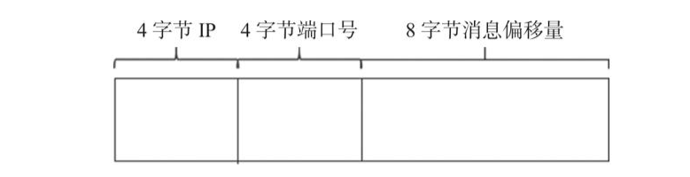

```java
// org.apache.rocketmq.store.CommitLog.DefaultAppendMessageCallback#doAppend(long, java.nio.ByteBuffer, int, org.apache.rocketmq.store.MessageExtBrokerInner)  
// 创建全局唯一的消息ID
  if ((sysflag & MessageSysFlag.STOREHOSTADDRESS_V6_FLAG) == 0) {
      msgId = MessageDecoder.createMessageId(this.msgIdMemory, msgInner.getStoreHostBytes(storeHostHolder), wroteOffset);
  } else {
      msgId = MessageDecoder.createMessageId(this.msgIdV6Memory, msgInner.getStoreHostBytes(storeHostHolder), wroteOffset);
  }
```

为了消息ID具备可读性，返回给应用程序的msgId为字符类型，可以通过UtilAll. bytes2string方法将msgId字节数组转换成字符串，通过UtilAll.string2bytes方法将msgId字符串还原成16字节的数组，根据提取的消息物理偏移量，可以快速通过msgId找到消息内容。

```java
// org.apache.rocketmq.common.message.MessageDecoder#createMessageId(java.nio.ByteBuffer, java.nio.ByteBuffer, long)    
public static String createMessageId(final ByteBuffer input, final ByteBuffer addr, final long offset) {
        input.flip();
        int msgIDLength = addr.limit() == 8 ? 16 : 28;
        input.limit(msgIDLength);

        input.put(addr);
        input.putLong(offset);

        return UtilAll.bytes2string(input.array());
    }
```

第九步：根据消息体、主题和属性的长度，结合消息存储格式，计算消息的总长度，RocketMQ消息存储格式如下：

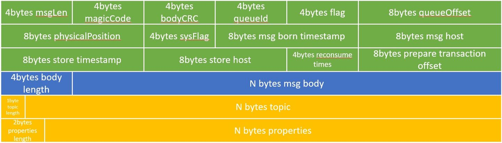

1. TOTALSIZE：消息条目总长度，4字节。
2. MAGICCODE：魔数，4字节。固定值0xdaa320a7。
3. BODYCRC：消息体的crc校验码，4字节。
4. QUEUEID：消息消费队列ID，4字节。
5. FLAG：消息标记，RocketMQ对其不做处理，供应用程序使用，默认4字节。
6. QUEUEOFFSET：消息在ConsumeQuene文件中的物理偏移量，8字节。
7. PHYSICALOFFSET：消息在CommitLog文件中的物理偏移量，8字节。
8. SYSFLAG：消息系统标记，例如是否压缩、是否是事务消息等，4字节。
9. BORNTIMESTAMP：消息生产者调用消息发送API的时间戳，8字节。
10. BORNHOST：消息发送者IP、端口号，8字节。
11. STORETIMESTAMP：消息存储时间戳，8字节。
12. STOREHOSTADDRESS：Broker服务器IP+端口号，8字节。
13. RECONSUMETIMES：消息重试次数，4字节。
14. Prepared Transaction Offset：事务消息的物理偏移量，8字节。
15. BodyLength：消息体长度，4字节。
16. Body：消息体内容，长度为bodyLenth中存储的值。
17. TopicLength：主题存储长度，1字节，表示主题名称不能超过255个字符。
18. Topic：主题，长度为TopicLength中存储的值。
19. PropertiesLength：消息属性长度，2字节，表示消息属性长度不能超过65536个字符。
20. Properties：消息属性，长度为PropertiesLength中存储的值。

计算消息长度的代码：

```java
//org.apache.rocketmq.store.CommitLog#calMsgLength    
/**
     * CommitLog条目是不定长的，每一个条目的长度存储在前4个字节中。
     * @param sysFlag
     * @param bodyLength 消息body长度
     * @param topicLength topic长度
     * @param propertiesLength properties长度
     * @return
     */
    protected static int calMsgLength(int sysFlag, int bodyLength, int topicLength, int propertiesLength) {
        int bornhostLength = (sysFlag & MessageSysFlag.BORNHOST_V6_FLAG) == 0 ? 8 : 20;
        int storehostAddressLength = (sysFlag & MessageSysFlag.STOREHOSTADDRESS_V6_FLAG) == 0 ? 8 : 20;
        final int msgLen = 4 //TOTALSIZE 消息头部4字节，记录消息条目总长度
            + 4 //MAGICCODE
            + 4 //BODYCRC 消息体的crc校验码
            + 4 //QUEUEID 消息消费队列ID
            + 4 //FLAG 消息标记，RocketMQ对其不做处理，供应用程序使用， 默认4字节。
            + 8 //QUEUEOFFSET 消息在ConsumeQuene文件中的物理偏移量，8字节
            + 8 //PHYSICALOFFSET 消息在CommitLog文件中的物理偏移量，8字 节。
            + 4 //SYSFLAG 消息系统标记，例如是否压缩、是否是事务消息 等，4字节。
            + 8 //BORNTIMESTAMP 消息生产者调用消息发送API的时间戳，8字 节。
            + bornhostLength //BORNHOST 消息发送者IP、端口号，8字节。
            + 8 //STORETIMESTAMP 消息存储时间戳，8字节。
            + storehostAddressLength //STOREHOSTADDRESS Broker服务器IP+端口号，8字节。
            + 4 //RECONSUMETIMES 消息重试次数，4字节。
            + 8 //Prepared Transaction Offset 事务消息的物理偏移量，8字节
            + 4 + (bodyLength > 0 ? bodyLength : 0) //BODY 消息体长度，4字节 + 消息体内容，长度为bodyLenth中存储的值。
            + 1 + topicLength //TOPIC 主题存储长度，1字节，表示主题名称不能超 过255个字符 + Topic内容，长度为 topicLength
            + 2 + (propertiesLength > 0 ? propertiesLength : 0) //propertiesLength 消息属性长度，2字节，表示消息属性长度不能超过65536个字符 + 消息属性内容
            + 0;
        return msgLen;
    }
```

第十步：如果消息长度+END_FILE_MIN_BLANK_LENGTH大于CommitLog文件的空闲空间，则返回AppendMessageStatus.END_OF_FILE，Broker会创建一个新的CommitLog文件来存储该消息。从这里可以看出，每个CommitLog文件最少空闲8字节，高4字节存储当前文件的剩余空间，低4字节存储魔数CommitLog.BLANK_MAGIC_CODE:

```java
 // 如果消息长度+END_FILE_MIN_BLANK_LENGTH大于CommitLog文件的空闲空间，
 // 则返回AppendMessageStatus.END_OF_FILE，Broker会创建一个新的CommitLog文件来存储该消息。
 if ((msgLen + END_FILE_MIN_BLANK_LENGTH) > maxBlank) {
     this.resetByteBuffer(this.msgStoreItemMemory, maxBlank);
     // 1 TOTALSIZE
     this.msgStoreItemMemory.putInt(maxBlank);
     // 2 MAGICCODE
     this.msgStoreItemMemory.putInt(CommitLog.BLANK_MAGIC_CODE);
     // 3 The remaining space may be any value
     // Here the length of the specially set maxBlank
     final long beginTimeMills = CommitLog.this.defaultMessageStore.now();
     byteBuffer.put(this.msgStoreItemMemory.array(), 0, maxBlank);
     return new AppendMessageResult(AppendMessageStatus.END_OF_FILE, wroteOffset, maxBlank, msgId, msgInner.getStoreTimestamp(),
         queueOffset, CommitLog.this.defaultMessageStore.now() - beginTimeMills);
 }
```

第十一步：将消息内容存储到ByteBuffer中，然后创建AppendMessageResult。这里只是将消息存储在MappedFile对应的内存映射Buffer中，并没有写入磁盘：

```java
// org.apache.rocketmq.store.CommitLog.DefaultAppendMessageCallback#doAppend(long, java.nio.ByteBuffer, int, org.apache.rocketmq.store.MessageExtBrokerInner)
            // Initialization of storage space
            this.resetByteBuffer(msgStoreItemMemory, msgLen);
            // 1 TOTALSIZE
            this.msgStoreItemMemory.putInt(msgLen);
            // 2 MAGICCODE
            this.msgStoreItemMemory.putInt(CommitLog.MESSAGE_MAGIC_CODE);
            // 3 BODYCRC
            this.msgStoreItemMemory.putInt(msgInner.getBodyCRC());
            // 4 QUEUEID
            this.msgStoreItemMemory.putInt(msgInner.getQueueId());
            // 5 FLAG
            this.msgStoreItemMemory.putInt(msgInner.getFlag());
            // 6 QUEUEOFFSET
            this.msgStoreItemMemory.putLong(queueOffset);
            // 7 PHYSICALOFFSET
            this.msgStoreItemMemory.putLong(fileFromOffset + byteBuffer.position());
            // 8 SYSFLAG
            this.msgStoreItemMemory.putInt(msgInner.getSysFlag());
            // 9 BORNTIMESTAMP
            this.msgStoreItemMemory.putLong(msgInner.getBornTimestamp());
            // 10 BORNHOST
            this.resetByteBuffer(bornHostHolder, bornHostLength);
            this.msgStoreItemMemory.put(msgInner.getBornHostBytes(bornHostHolder));
            // 11 STORETIMESTAMP
            this.msgStoreItemMemory.putLong(msgInner.getStoreTimestamp());
            // 12 STOREHOSTADDRESS
            this.resetByteBuffer(storeHostHolder, storeHostLength);
            this.msgStoreItemMemory.put(msgInner.getStoreHostBytes(storeHostHolder));
            // 13 RECONSUMETIMES
            this.msgStoreItemMemory.putInt(msgInner.getReconsumeTimes());
            // 14 Prepared Transaction Offset
            this.msgStoreItemMemory.putLong(msgInner.getPreparedTransactionOffset());
            // 15 BODY
            this.msgStoreItemMemory.putInt(bodyLength);
            if (bodyLength > 0)
                this.msgStoreItemMemory.put(msgInner.getBody());
            // 16 TOPIC
            this.msgStoreItemMemory.put((byte) topicLength);
            this.msgStoreItemMemory.put(topicData);
            // 17 PROPERTIES
            this.msgStoreItemMemory.putShort((short) propertiesLength);
            if (propertiesLength > 0)
                this.msgStoreItemMemory.put(propertiesData);

            final long beginTimeMills = CommitLog.this.defaultMessageStore.now();
            // Write messages to the queue buffer
            // 将消息内容存储到ByteBuffer中，然后创建AppendMessageResult。这里只是将消息存储在MappedFile对应的内存映射Buffer中，并没有写入磁盘
            byteBuffer.put(this.msgStoreItemMemory.array(), 0, msgLen);

            AppendMessageResult result = new AppendMessageResult(AppendMessageStatus.PUT_OK, wroteOffset, msgLen, msgId,
                msgInner.getStoreTimestamp(), queueOffset, CommitLog.this.defaultMessageStore.now() - beginTimeMills);
```

AppendMessageResult 结构如下：

```java
public class AppendMessageResult {
    // Return code
    /**
     * 消息追加结果。取值为PUT_OK则代表追加成功、
     * END_OF_FILE则代表超过文件大小、
     * MESSAGE_SIZE_EXCEEDED则代表消息长度超过最大允许长度、
     * PROPERTIES_SIZE_EXCEEDED则代表消息属性超过最大允许长度、
     * UNKNOWN_ERROR则代表未知异常。
     */
    private AppendMessageStatus status;
    // Where to start writing
    /**
     * 消息的物理偏移量。
     */
    private long wroteOffset;
    // Write Bytes
    private int wroteBytes;
    // 消息ID
    private String msgId;
    // Message storage timestamp
    /**
     * 消息存储时间戳
     */
    private long storeTimestamp;
    // Consume queue's offset(step by one)
    /**
     * 消息消费队列的逻辑偏移量，类似于数组下标
     */
    private long logicsOffset;
    /**
     * 写入页缓存的响应时间
     */
    private long pagecacheRT = 0;
    /**
     * 批量发送消息时的消息条数
     */
    private int msgNum = 1;
}
```

第十二步：更新消息队列的逻辑偏移量

第十三步：处理完消息追加逻辑后将释放putMessageLock。

第十四步：DefaultAppendMessageCallback#doAppend只是将消息追加到内存中，需要根据采取的是同步刷盘方式还是异步刷盘方式，将内存中的数据持久化到磁盘中，后文会详细介绍刷盘操作。

```java
// org.apache.rocketmq.store.CommitLog#putMessage 
// appendMessage只是将消息追加到内存中，需要根据采取的是同步刷盘方式还是异步刷盘方式，将内存中的数据持久化到磁盘中。
handleDiskFlush(result, putMessageResult, msg);
```

第十五步：然后执行HA主从同步复制。

```java
// org.apache.rocketmq.store.CommitLog#putMessage 
// HA主从同步复制
handleHA(result, putMessageResult, msg);
```

### 3.2 ConsumeQueue、Index消息索引的异步构建

因为ConsumeQueue文件、Index文件都是基于CommitLog文件构建的，所以当消息生产者提交的消息存储到CommitLog文件中时，ConsumeQueue文件、Index文件需要及时更新，否则消息无法及时被消费，根据消息属性查找消息也会出现较大延迟。RocketMQ通过开启一个线程ReputMessageServcie来准实时转发CommitLog文件的更新事件，相应的任务处理器根据转发的消息及时更新ConsumeQueue文件、Index文件。

```java
// org.apache.rocketmq.store.DefaultMessageStore.ReputMessageService
    class ReputMessageService extends ServiceThread {

        private volatile long reputFromOffset = 0;


        /**
         * ReputMessageService线程每执行一次任务推送，休息1ms后继续
         * 尝试推送消息到Consume Queue和Index文件中，消息消费转发由
         * doReput()方法实现
         */
        private void doReput() {
            if (this.reputFromOffset < DefaultMessageStore.this.commitLog.getMinOffset()) {
                log.warn("The reputFromOffset={} is smaller than minPyOffset={}, this usually indicate that the dispatch behind too much and the commitlog has expired.",
                    this.reputFromOffset, DefaultMessageStore.this.commitLog.getMinOffset());
                this.reputFromOffset = DefaultMessageStore.this.commitLog.getMinOffset();
            }
            for (boolean doNext = true; this.isCommitLogAvailable() && doNext; ) {

                if (DefaultMessageStore.this.getMessageStoreConfig().isDuplicationEnable()
                    && this.reputFromOffset >= DefaultMessageStore.this.getConfirmOffset()) {
                    break;
                }

                // 返回reputFromOffset偏移量开始的全部有效数据（CommitLog文件）。然后循环读取每一条消息
                SelectMappedBufferResult result = DefaultMessageStore.this.commitLog.getData(reputFromOffset);
                if (result != null) {
                    try {
                        this.reputFromOffset = result.getStartOffset();

                        for (int readSize = 0; readSize < result.getSize() && doNext; ) {
                            // 从result返回的ByteBuffer中循环读取消息，一次读取一条，创建Dispatch Request对象
                            DispatchRequest dispatchRequest =
                                DefaultMessageStore.this.commitLog.checkMessageAndReturnSize(result.getByteBuffer(), false, false);
                            int size = dispatchRequest.getBufferSize() == -1 ? dispatchRequest.getMsgSize() : dispatchRequest.getBufferSize();

                            if (dispatchRequest.isSuccess()) {
                                if (size > 0) {
                                    // 执行CommitLog转发
                                    DefaultMessageStore.this.doDispatch(dispatchRequest);

                                    if (BrokerRole.SLAVE != DefaultMessageStore.this.getMessageStoreConfig().getBrokerRole()
                                        && DefaultMessageStore.this.brokerConfig.isLongPollingEnable()) {
                                        DefaultMessageStore.this.messageArrivingListener.arriving(dispatchRequest.getTopic(),
                                            dispatchRequest.getQueueId(), dispatchRequest.getConsumeQueueOffset() + 1,
                                            dispatchRequest.getTagsCode(), dispatchRequest.getStoreTimestamp(),
                                            dispatchRequest.getBitMap(), dispatchRequest.getPropertiesMap());
                                    }

                                    this.reputFromOffset += size;
                                    readSize += size;
                                    if (DefaultMessageStore.this.getMessageStoreConfig().getBrokerRole() == BrokerRole.SLAVE) {
                                        DefaultMessageStore.this.storeStatsService
                                            .getSinglePutMessageTopicTimesTotal(dispatchRequest.getTopic()).incrementAndGet();
                                        DefaultMessageStore.this.storeStatsService
                                            .getSinglePutMessageTopicSizeTotal(dispatchRequest.getTopic())
                                            .addAndGet(dispatchRequest.getMsgSize());
                                    }
                                } else if (size == 0) {
                                    this.reputFromOffset = DefaultMessageStore.this.commitLog.rollNextFile(this.reputFromOffset);
                                    readSize = result.getSize();
                                }
                            } else if (!dispatchRequest.isSuccess()) {

                                if (size > 0) {
                                    log.error("[BUG]read total count not equals msg total size. reputFromOffset={}", reputFromOffset);
                                    this.reputFromOffset += size;
                                } else {
                                    doNext = false;
                                    // If user open the dledger pattern or the broker is master node,
                                    // it will not ignore the exception and fix the reputFromOffset variable
                                    if (DefaultMessageStore.this.getMessageStoreConfig().isEnableDLegerCommitLog() ||
                                        DefaultMessageStore.this.brokerConfig.getBrokerId() == MixAll.MASTER_ID) {
                                        log.error("[BUG]dispatch message to consume queue error, COMMITLOG OFFSET: {}",
                                            this.reputFromOffset);
                                        this.reputFromOffset += result.getSize() - readSize;
                                    }
                                }
                            }
                        }
                    } finally {
                        result.release();
                    }
                } else {
                    doNext = false;
                }
            }
        }

        @Override
        public void run() {
            DefaultMessageStore.log.info(this.getServiceName() + " service started");

            while (!this.isStopped()) {
                try {
                    Thread.sleep(1);
                    // 每休息1ms就执行一次消息转发
                    this.doReput();
                } catch (Exception e) {
                    DefaultMessageStore.log.warn(this.getServiceName() + " service has exception. ", e);
                }
            }

            DefaultMessageStore.log.info(this.getServiceName() + " service end");
        }

    }
```

### 3.3 整体流程

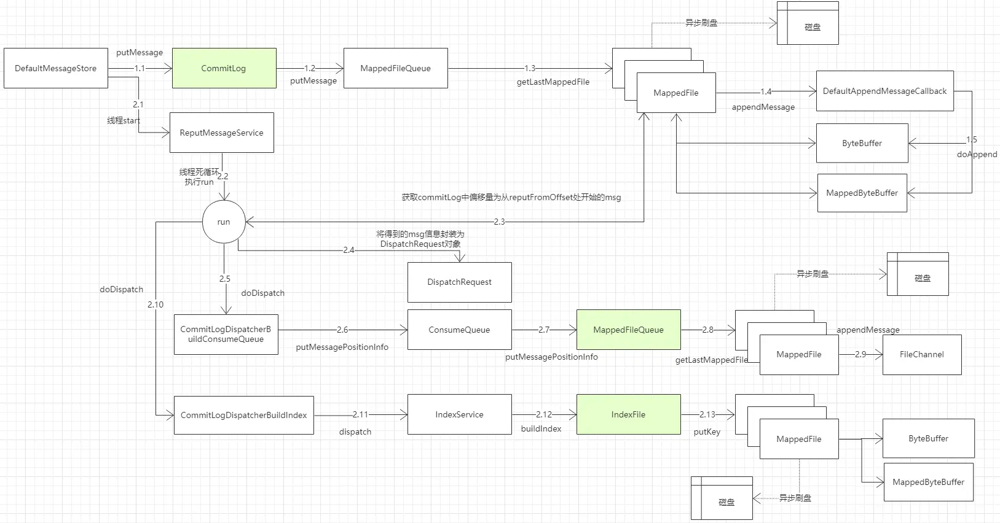

- Broker端收到消息后，将消息原始信息保存在CommitLog文件对应的MappedFile中，然后异步刷新到磁盘
- ReputMessageServie线程异步的将CommitLog中MappedFile中的消息保存到ConsumerQueue和IndexFile中
- ConsumerQueue和IndexFile只是原始文件的索引信息。

## 四. 文件创建

当有新的消息到来的时候，其会默认选择列表中的最后一个文件来进行消息的保存:


当有新的消息到来的时候，其会默认选择列表中的最后一个文件来进行消息的保存:


`org.apache.rocketmq.store.MappedFileQueue`：

```java
public class MappedFileQueue {
    public MappedFile getLastMappedFile() {
        MappedFile mappedFileLast = null;

        while (!this.mappedFiles.isEmpty()) {
            try {
                mappedFileLast = this.mappedFiles.get(this.mappedFiles.size() - 1);
                break;
            } catch (IndexOutOfBoundsException e) {
                //continue;
            } catch (Exception e) {
                log.error("getLastMappedFile has exception.", e);
                break;
            }
        }

        return mappedFileLast;
    }
}
```

当然如果这个 Broker 之前从未接受过消息的话，那么这个列表肯定是空的。这样一旦有新的消息需要存储的时候，其就得需要立即创建一个 `MappedFile` 文件来存储消息。

RocketMQ 提供了一个专门用来实例化 `MappedFile` 文件的服务类 `AllocateMappedFileService`。在内存中，也同时维护了一张请求表 `requestTable` 和一个优先级请求队列 `requestQueue` 。当需要创建文件的时候，Broker 会创建一个 `AllocateRequest` 对象，其包含了文件的路径、大小等信息。然后先将其放入 `requestTable` 表中，再将其放入优先级请求队列 `requestQueue` 中:

`org.apache.rocketmq.store.AllocateMappedFileService#putRequestAndReturnMappedFile`

```java
public class AllocateMappedFileService extends ServiceThread {

    public MappedFile putRequestAndReturnMappedFile(String nextFilePath,
                                                    String nextNextFilePath,
                                                    int fileSize) {

        // ...

        AllocateRequest nextReq = new AllocateRequest(nextFilePath, fileSize);
        boolean nextPutOK = this.requestTable.putIfAbsent(nextFilePath, nextReq) == null;
        if (nextPutOK) {
            // ...
            boolean offerOK = this.requestQueue.offer(nextReq);
        }
        
    }
    
}
```

服务类会**一直**等待优先级队列是否有新的请求到来，如果有，便会从队列中取出请求，然后创建对应的 `MappedFile`，并将请求表 requestTable 中 `AllocateRequest` 对象的字段 `mappedFile` 设置上值。最后将 `AllocateRequest` 对象上的 `CountDownLatch` 的计数器减 1 ，以标明此分配申请的 `MappedFile` 已经创建完毕了:

`org.apache.rocketmq.store.AllocateMappedFileService#mmapOperation`

```java
public class AllocateMappedFileService extends ServiceThread {
        public void run() {
        log.info(this.getServiceName() + " service started");
		//会一直尝试从队列中获取请求，从而执行创建文件的任务
        while (!this.isStopped() && this.mmapOperation()) {

        }
        log.info(this.getServiceName() + " service end");
    }

    /**
     * Only interrupted by the external thread, will return false
     */
    private boolean mmapOperation() {
        boolean isSuccess = false;
        AllocateRequest req = null;
        try {
            // 获取优先队列中的请求
            req = this.requestQueue.take();
            AllocateRequest expectedRequest = this.requestTable.get(req.getFilePath());

            // ...
            
            if (req.getMappedFile() == null) {
                long beginTime = System.currentTimeMillis();

                MappedFile mappedFile;
                if (messageStore.getMessageStoreConfig().isTransientStorePoolEnable()) {
                    try {
                        //创建MappedFile
                        mappedFile = ServiceLoader.load(MappedFile.class).iterator().next();
                        mappedFile.init(req.getFilePath(), req.getFileSize(), messageStore.getTransientStorePool());
                    } catch (RuntimeException e) {
                        log.warn("Use default implementation.");
                        mappedFile = new MappedFile(req.getFilePath(), req.getFileSize(), messageStore.getTransientStorePool());
                    }
                } else {
                    mappedFile = new MappedFile(req.getFilePath(), req.getFileSize());
                }

                // pre write mappedFile
                if (mappedFile.getFileSize() >= this.messageStore.getMessageStoreConfig()
                   //...
                }

                req.setMappedFile(mappedFile);
                this.hasException = false;
                isSuccess = true;
            }
        } catch (InterruptedException e) {
            log.warn(this.getServiceName() + " interrupted, possibly by shutdown.");
            this.hasException = true;
            return false;
        } catch (IOException e) {
            log.warn(this.getServiceName() + " service has exception. ", e);
            this.hasException = true;
            if (null != req) {
                requestQueue.offer(req);
                try {
                    Thread.sleep(1);
                } catch (InterruptedException ignored) {
                }
            }
        } finally {
            if (req != null && isSuccess)
                // 文件创建成功，计数减一。因为创建文件的动作是在独立的线程中完成的，业务线程需要等待文件创建完毕
                req.getCountDownLatch().countDown();
        }
        return true;
    }
}
```

等待 `MappedFile` 创建完毕之后，其便会从请求表 `requestTable` 中取出并删除表中记录:

`org.apache.rocketmq.store.AllocateMappedFileService#putRequestAndReturnMappedFile`

```java
public class AllocateMappedFileService extends ServiceThread {

    public MappedFile putRequestAndReturnMappedFile(String nextFilePath,
                                                    String nextNextFilePath,
                                                    int fileSize) {
        // ...........
        //获取请求
        AllocateRequest result = this.requestTable.get(nextFilePath);
        try {
            if (result != null) {
                // 等待 MappedFile 的创建完成
                boolean waitOK = result.getCountDownLatch().await(waitTimeOut, TimeUnit.MILLISECONDS);
                if (!waitOK) {
                    // 创建超时
                    log.warn("create mmap timeout " + result.getFilePath() + " " + result.getFileSize());
                    return null;
                } else {
                    //创建成功，则将requestTable中将请求移除
                    this.requestTable.remove(nextFilePath);
                    // 返回创建的MappedFiles
                    return result.getMappedFile();
                }
            } else {
                log.error("find preallocate mmap failed, this never happen");
            }
        } catch (InterruptedException e) {
            log.warn(this.getServiceName() + " service has exception. ", e);
        }

        return null;
    }
    
}
```

创建完成后将其加入列表中：

`org.apache.rocketmq.store.MappedFileQueue#getLastMappedFile(long, boolean)`

```java
public class MappedFileQueue {
    public MappedFile getLastMappedFile(final long startOffset, boolean needCreate) {
        long createOffset = -1;
        // 尝试获取最后一个MappedFile
        MappedFile mappedFileLast = getLastMappedFile();

        if (mappedFileLast == null) {
            createOffset = startOffset - (startOffset % this.mappedFileSize);
        }

        if (mappedFileLast != null && mappedFileLast.isFull()) {
            createOffset = mappedFileLast.getFileFromOffset() + this.mappedFileSize;
        }

        // 第一次启动未创建MappedFile
        if (createOffset != -1 && needCreate) {
            // 文件名
            String nextFilePath = this.storePath + File.separator + UtilAll.offset2FileName(createOffset);
            String nextNextFilePath = this.storePath + File.separator
                + UtilAll.offset2FileName(createOffset + this.mappedFileSize);
            MappedFile mappedFile = null;

            if (this.allocateMappedFileService != null) {
                // 提交一个创建MappedFile的请求
                mappedFile = this.allocateMappedFileService.putRequestAndReturnMappedFile(nextFilePath,
                    nextNextFilePath, this.mappedFileSize);
            } else {
                try {
                    mappedFile = new MappedFile(nextFilePath, this.mappedFileSize);
                } catch (IOException e) {
                    log.error("create mappedFile exception", e);
                }
            }

            if (mappedFile != null) {
                //创建成功
                if (this.mappedFiles.isEmpty()) {
                    mappedFile.setFirstCreateInQueue(true);
                }
                //加入列表
                this.mappedFiles.add(mappedFile);
            }

            return mappedFile;
        }

        return mappedFileLast;
    }    
}
```

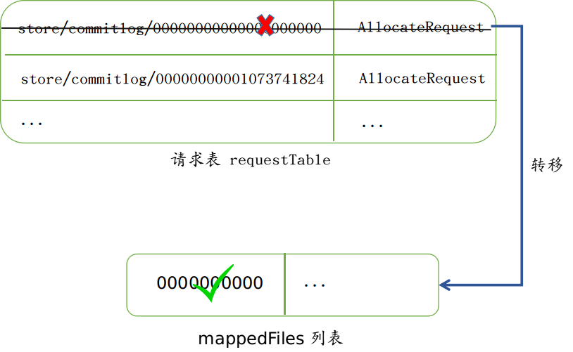

至此，`MappedFile` 已经创建完毕，也即可以进行下一步的操作了。

## 五. 文件初始化

在 `MappedFile` 的构造函数中，其使用了 `FileChannel` 类提供的 map 函数来将磁盘上的这个文件映射到进程地址空间中。然后当通过 `MappedByteBuffer` 来读入或者写入文件的时候，磁盘上也会有相应的改动。采用这种方式，通常比传统的基于文件 IO 流的方式读取效率高。

```java
public class MappedFile extends ReferenceResource {
    
    public MappedFile(final String fileName, final int fileSize)
        throws IOException {
        init(fileName, fileSize);
    }

    private void init(final String fileName, final int fileSize)
        throws IOException {
        // ...
        this.fileChannel = new RandomAccessFile(this.file, "rw").getChannel();
        this.mappedByteBuffer = this.fileChannel.map(MapMode.READ_WRITE, 0, fileSize);
        // ...
    }
    
}
```

## 六. 消息文件加载

前面提到过，Broker 在启动的时候，会加载磁盘上的文件到一个 `mappedFiles` 列表中。但是加载完毕后，其还会对这份列表中的消息文件进行**验证 (恢复)**，确保没有错误。

验证的基本想法是通过一一读取列表中的每一个文件，然后再一一读取每个文件中的每个消息，在读取的过程中，其会更新整体的消息写入的偏移量，如下图中的红色箭头 (我们假设最终读取的消息的总偏移量为 905):

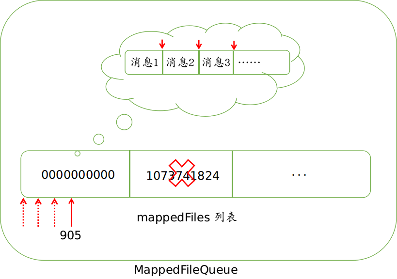

当确定消息整体的偏移量之后，Broker 便会确定每一个单独的 `MappedFile` 文件的**各自的偏移量**，每一个文件的偏移量是通过**取余**算法确定的:

`org.apache.rocketmq.store.MappedFileQueue#truncateDirtyFiles`:

```java
public class MappedFileQueue {

    public void truncateDirtyFiles(long offset) {

        for (MappedFile file : this.mappedFiles) {
            long fileTailOffset = file.getFileFromOffset() + this.mappedFileSize;
            if (fileTailOffset > offset) {
                if (offset >= file.getFileFromOffset()) {
                    // 确定每个文件的各自偏移量
                    file.setWrotePosition((int) (offset % this.mappedFileSize));
                    file.setCommittedPosition((int) (offset % this.mappedFileSize));
                    file.setFlushedPosition((int) (offset % this.mappedFileSize));
                } else {
                    // ...
                }
            }
        }

        // ...
    }
    
}
```

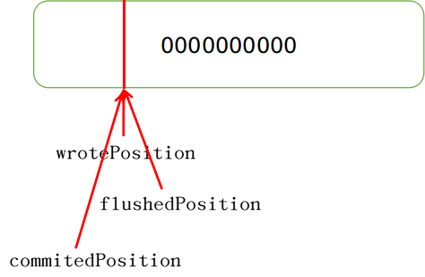

在确定每个消息文件各自的写入位置的同时，其还会删除**起始偏移量**大于当前总偏移量的消息文件，这些文件可以视作脏文件，或者也可以说这些文件里面一条消息也没有。这也是上述文件 `1073741824` 被打上红叉的原因:

```java
public void truncateDirtyFiles(long offset) {
    List<MappedFile> willRemoveFiles = new ArrayList<MappedFile>();

    for (MappedFile file : this.mappedFiles) {
        long fileTailOffset = file.getFileFromOffset() + this.mappedFileSize;
        if (fileTailOffset > offset) {
            if (offset >= file.getFileFromOffset()) {
                // ...
            } else {
                // 总偏移量 < 文件起始偏移量
                // 加入到待删除列表中
                file.destroy(1000);
                willRemoveFiles.add(file);
            }
        }
    }

    this.deleteExpiredFile(willRemoveFiles);
}
```

## 七. 写入消息

> 消息写入口：org.apache.rocketmq.store.CommitLog#putMessage

一旦我们获取到 `MappedFile` 文件之后，我们便可以往这个文件里面写入消息了。写入消息可能会遇见如下两种情况，一种是这条消息可以完全追加到这个文件中，另外一种是这条消息完全不能或者只有一小部分能存放到这个文件中，其余的需要放到新的文件中。我们对于这两种情况分别讨论:

### 7.1 文件可以完全存储消息

`MappedFile` 类维护了一个用以标识当前写位置的指针 `wrotePosition`，以及一个用来映射文件到进程地址空间的 `mappedByteBuffer`:

```java
public class MappedFile extends ReferenceResource {

    protected final AtomicInteger wrotePosition = new AtomicInteger(0);
    private MappedByteBuffer mappedByteBuffer;
    
}
```

由这两个数据结构我们可以看出来，单个文件的消息写入过程其实是非常简单的。首先获取到这个文件的写入位置，然后将消息内容追加到 `byteBuffer` 中，然后再更新写入位置。

```java
public class MappedFile extends ReferenceResource {

    public AppendMessageResult appendMessagesInner(final MessageExt messageExt, final AppendMessageCallback cb) {
        // ...
    
        int currentPos = this.wrotePosition.get();

        if (currentPos < this.fileSize) {
            ByteBuffer byteBuffer =
                writeBuffer != null ?
                writeBuffer.slice() :
                this.mappedByteBuffer.slice();

            // 更新 byteBuffer 位置
            byteBuffer.position(currentPos);

            // 写入消息内容
            // ...

            // 获取当前需要写入的消息长度，更新 wrotePosition 指针的位置
            this.wrotePosition.addAndGet(result.getWroteBytes());

            return result;
        }

    }
    
}
```

示例流程如下所示:

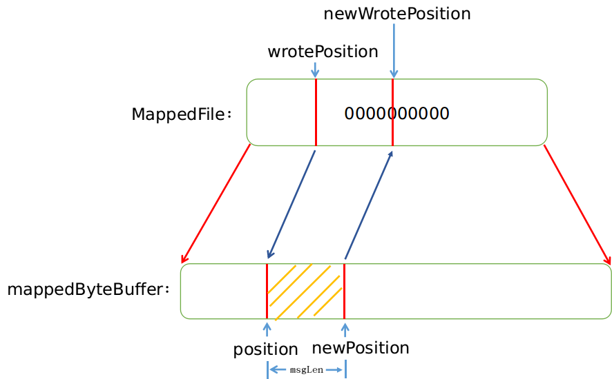

### 7.2 文件不可以完全存储消息

在写入消息之前，如果判断出文件已经满了的情况下，其会直接尝试创建一个新的 `MappedFile`:

```java
public class CommitLog {

    public PutMessageResult putMessage(final MessageExtBrokerInner msg) {

        // 文件为空 || 文件已经满了
        if (null == mappedFile || mappedFile.isFull()) {
            mappedFile = this.mappedFileQueue.getLastMappedFile(0);
        }

        // ...
        
        result = mappedFile.appendMessage(msg, this.appendMessageCallback);
        
    }
    
}
```

如果文件未满，那么在写入之前会先计算出消息体长度 `msgLen`，然后判断这个文件剩下的空间是否有能力容纳这条消息。在这个地方我们还需要介绍下每条消息的存储方式。

每条消息的存储是按照一个 4 字节的长度来做界限的，这个长度本身就是整个消息体的长度，当读完这整条消息体的长度之后，下一次再取出来的一个 4 字节的数字，便又是下一条消息的长度:


围绕着一条消息，还会存储许多其它内容，我们在这里只需要了解前两位是 4 字节的总长度和 4 字节的 MAGICCODE 即可:


`MAGICCODE` 的可选值有:

- `CommitLog.MESSAGE_MAGIC_CODE`
- `CommitLog.BLANK_MAGIC_CODE`

当这个文件有能力容纳这条消息体的情况下，其便会存储 `MESSAGE_MAGIC_CODE` 值；当这个文件没有能力容纳这条消息体的情况下，其便会存储 `BLANK_MAGIC_CODE` 值。所以这个 `MAGICCODE` 是用来界定这是空消息还是一条正常的消息。

当判定这个文件不足以容纳整个消息的时候，其将消息体长度设置为这个文件剩余的最大空间长度，将 `MAGICCODE` 设定为这是一个空消息文件 (需要去下一个文件去读)。由此我们可以看出消息体长度 和 `MAGICCODE` 是判别一条消息格式的最基本要求，这也是 `END_FILE_MIN_BLANK_LENGTH` 的值为 8 的原因:

`org.apache.rocketmq.store.CommitLog.DefaultAppendMessageCallback#doAppend(long, java.nio.ByteBuffer, int, org.apache.rocketmq.store.MessageExtBrokerInner)`

```java
public class CommitLog {

    
    class DefaultAppendMessageCallback implements AppendMessageCallback {

        // File at the end of the minimum fixed length empty
        private static final int END_FILE_MIN_BLANK_LENGTH = 4 + 4;

        public AppendMessageResult doAppend(final long fileFromOffset,
                                            final ByteBuffer byteBuffer,
                                            final int maxBlank,
                                            final MessageExtBrokerInner msgInner) {

            // ...

            if ((msgLen + END_FILE_MIN_BLANK_LENGTH) > maxBlank) {
                // ...

                // 1 TOTALSIZE
                this.msgStoreItemMemory.putInt(maxBlank);
                // 2 MAGICCODE
                this.msgStoreItemMemory.putInt(CommitLog.BLANK_MAGIC_CODE);
                // 3 The remaining space may be any value
                byteBuffer.put(this.msgStoreItemMemory.array(), 0, maxBlank);

                return new AppendMessageResult(AppendMessageStatus.END_OF_FILE,
                                               /** other params **/ );
            }

        }

    }
}
```

由上述方法我们看出在这种情况下返回的结果是 `END_OF_FILE`。当检测到这种返回结果的时候，`CommitLog` 接着又会申请创建新的 `MappedFile` 并尝试写入消息。追加方法同 (1) 相同，不再赘述:

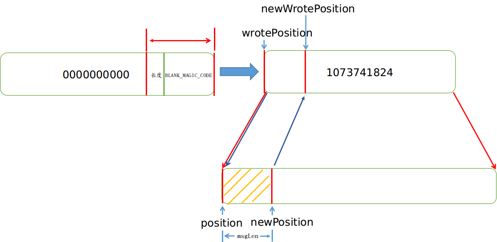

> 注: 在消息文件加载的过程中，其也是通过判断 `MAGICCODE` 的类型，来判断是否继续读取下一个 `MappedFile` 来计算整体消息偏移量的。

## 六. 消息刷盘策略

在消息存储主流程执行完成后，会调用handleDiskFlush触发刷盘策略。

```java
// org.apache.rocketmq.store.CommitLog#handleDiskFlush    
/**
     * 触发刷盘CommitLog
     * @param result
     * @param putMessageResult
     * @param messageExt
     */
    public void handleDiskFlush(AppendMessageResult result, PutMessageResult putMessageResult, MessageExt messageExt) {
        // Synchronization flush
        if (FlushDiskType.SYNC_FLUSH == this.defaultMessageStore.getMessageStoreConfig().getFlushDiskType()) {
            // 如果是同步刷盘

            final GroupCommitService service = (GroupCommitService) this.flushCommitLogService;
            if (messageExt.isWaitStoreMsgOK()) {
                // 构建GroupCommitRequest同步任务并提交到GroupCommitRequest。
                GroupCommitRequest request = new GroupCommitRequest(result.getWroteOffset() + result.getWroteBytes());
                // 将同步任务GroupCommitRequest提交到GroupCommitService线程
                service.putRequest(request);
                // 等待同步刷盘任务完成，异步刷盘线程刷写完毕后会唤醒当前线程，超时时间默认为5s，如果超时则返回刷盘错误，刷盘成功后正常返回给调用方。
                boolean flushOK = request.waitForFlush(this.defaultMessageStore.getMessageStoreConfig().getSyncFlushTimeout());
                if (!flushOK) {
                    log.error("do groupcommit, wait for flush failed, topic: " + messageExt.getTopic() + " tags: " + messageExt.getTags()
                        + " client address: " + messageExt.getBornHostString());
                    putMessageResult.setPutMessageStatus(PutMessageStatus.FLUSH_DISK_TIMEOUT);
                }
            } else {
                service.wakeup();
            }
        }
        // Asynchronous flush
        else {
            // 异步刷盘
            if (!this.defaultMessageStore.getMessageStoreConfig().isTransientStorePoolEnable()) {
                // 如果transientStorePoolEnable为false，消息将追加到与物理文件直接映射的内存中，然后写入磁盘
                // 唤醒刷盘线程，执行刷盘操作
                flushCommitLogService.wakeup();
            } else {
                // 如果transientStorePoolEnable为true，RocketMQ会单独申请一个与目标物理文件（CommitLog）同样大
                // 小的堆外内存，该堆外内存将使用内存锁定，确保不会被置换到虚拟内存中去，消息首先追加到堆外内存，然后提交到与物理文件的内存
                // 映射中，再经flush操作到磁盘
                commitLogService.wakeup();
            }
        }
    }
```

刷盘的整体流程：

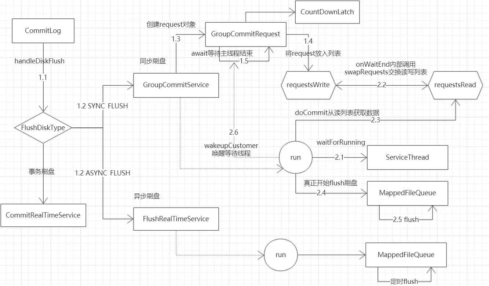

producer发送给broker的消息保存在MappedFile中，然后通过刷盘机制同步到磁盘中

刷盘分为同步刷盘和异步刷盘

异步刷盘后台线程按一定时间间隔执行

同步刷盘也是生产者-消费者模型。broker保存消息到MappedFile后，创建GroupCommitRequest请求放入列表，并阻塞等待。后台线程从列表中获取请求并刷新磁盘，成功刷盘后通知等待线程。

### 6.1 异步刷盘

当配置为异步刷盘策略的时候，Broker 会运行一个服务 `FlushRealTimeService` 用来刷新缓冲区的消息内容到磁盘，这个服务使用一个独立的线程来做刷盘这件事情，默认情况下每隔 500ms 来检查一次是否需要刷盘:

```java
class FlushRealTimeService extends FlushCommitLogService {

    public void run() {

        // 不停运行
        while (!this.isStopped()) {

            // interval 默认值是 500ms
            if (flushCommitLogTimed) {
                Thread.sleep(interval);
            } else {
                this.waitForRunning(interval);
            }

            // 刷盘
            CommitLog.this.mappedFileQueue.flush(flushPhysicQueueLeastPages);

        }
        
    }
    
}
```


> 本文参考至：
>
> 《RocketMQ技术内幕》
>
> [RocketMQ 消息存储流程 | 赵坤的个人网站 (kunzhao.org)](https://kunzhao.org/docs/rocketmq/rocketmq-message-store-flow/)
>
> [图解RocketMQ消息发送和存储流程 - 掘金 (juejin.cn)](https://juejin.cn/post/6844903862147497998)
