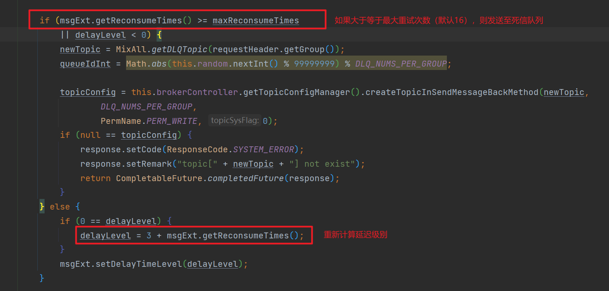
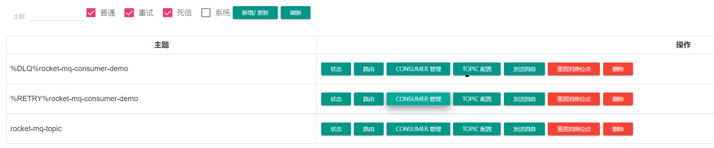

# RocketMQ重试机制

## 一. 背景

当我们Listener中的抛出异常时会触发消息重试：

```java
@Component
@Slf4j
@RocketMQMessageListener(topic = "rocket-mq-topic", consumerGroup = "rocket-mq-consumer-demo")
public class RocketMqTopicListener implements RocketMQListener<String> {

    @Override
    public void onMessage(String msg) {
        log.info("RocketMqTopicListener consume msg:{}", msg);
        int i = 1 / 0;
    }
}
```

打印日志：

```log
2021-11-14 15:36:13.150  INFO 17592 --- [essageThread_18] c.b.r.q.c.l.RocketMqTopicListener        : RocketMqTopicListener consume msg:{"msg":"张三李四","createTime":"2021-11-14 15:36:13","messageId":"9b666a46-7752-4330-bf79-0ede6d3f8342"}  //第一次消费消息

2021-11-14 15:36:13.157  WARN 17592 --- [essageThread_18] a.r.s.s.DefaultRocketMQListenerContainer : consume message failed. messageId:7F000001126418B4AAC2464BCE59001F, topic:rocket-mq-topic, reconsumeTimes:0

java.lang.ArithmeticException: / by zero 
...

2021-11-14 15:36:23.165  INFO 17592 --- [essageThread_19] c.b.r.q.c.l.RocketMqTopicListener        : RocketMqTopicListener consume msg:{"msg":"张三李四","createTime":"2021-11-14 15:36:13","messageId":"9b666a46-7752-4330-bf79-0ede6d3f8342"} //第一次重试，延迟10s
2021-11-14 15:36:23.165  WARN 17592 --- [essageThread_19] a.r.s.s.DefaultRocketMQListenerContainer : consume message failed. messageId:7F000001126418B4AAC2464BCE59001F, topic:rocket-mq-topic, reconsumeTimes:1

java.lang.ArithmeticException: / by zero
...

2021-11-14 15:36:53.169  INFO 17592 --- [essageThread_20] c.b.r.q.c.l.RocketMqTopicListener        : RocketMqTopicListener consume msg:{"msg":"张三李四","createTime":"2021-11-14 15:36:13","messageId":"9b666a46-7752-4330-bf79-0ede6d3f8342"} //第二次重试，延迟30s
2021-11-14 15:36:53.169  WARN 17592 --- [essageThread_20] a.r.s.s.DefaultRocketMQListenerContainer : consume message failed. messageId:7F000001126418B4AAC2464BCE59001F, topic:rocket-mq-topic, reconsumeTimes:2

java.lang.ArithmeticException: / by zero
...

2021-11-14 15:37:53.179  INFO 17592 --- [MessageThread_2] c.b.r.q.c.l.RocketMqTopicListener        : RocketMqTopicListener consume msg:{"msg":"张三李四","createTime":"2021-11-14 15:36:13","messageId":"9b666a46-7752-4330-bf79-0ede6d3f8342"} //第三次重试，延迟1min
2021-11-14 15:37:53.180  WARN 17592 --- [MessageThread_2] a.r.s.s.DefaultRocketMQListenerContainer : consume message failed. messageId:7F000001126418B4AAC2464BCE59001F, topic:rocket-mq-topic, reconsumeTimes:3

java.lang.ArithmeticException: / by zero
...

2021-11-14 15:39:53.183  INFO 17592 --- [MessageThread_3] c.b.r.q.c.l.RocketMqTopicListener        : RocketMqTopicListener consume msg:{"msg":"张三李四","createTime":"2021-11-14 15:36:13","messageId":"9b666a46-7752-4330-bf79-0ede6d3f8342"} //第四次重试，延迟2min
2021-11-14 15:39:53.183  WARN 17592 --- [MessageThread_3] a.r.s.s.DefaultRocketMQListenerContainer : consume message failed. messageId:7F000001126418B4AAC2464BCE59001F, topic:rocket-mq-topic, reconsumeTimes:4

java.lang.ArithmeticException: / by zero
...

2021-11-14 15:42:53.187  INFO 17592 --- [MessageThread_5] c.b.r.q.c.l.RocketMqTopicListener        : RocketMqTopicListener consume msg:{"msg":"张三李四","createTime":"2021-11-14 15:36:13","messageId":"9b666a46-7752-4330-bf79-0ede6d3f8342"} //第五次重试，延迟3min
2021-11-14 15:42:53.187  WARN 17592 --- [MessageThread_5] a.r.s.s.DefaultRocketMQListenerContainer : consume message failed. messageId:7F000001126418B4AAC2464BCE59001F, topic:rocket-mq-topic, reconsumeTimes:5

java.lang.ArithmeticException: / by zero
...

2021-11-14 15:46:53.191  INFO 17592 --- [MessageThread_7] c.b.r.q.c.l.RocketMqTopicListener        : RocketMqTopicListener consume msg:{"msg":"张三李四","createTime":"2021-11-14 15:36:13","messageId":"9b666a46-7752-4330-bf79-0ede6d3f8342"} //第六次重试，延迟4min
2021-11-14 15:46:53.191  WARN 17592 --- [MessageThread_7] a.r.s.s.DefaultRocketMQListenerContainer : consume message failed. messageId:7F000001126418B4AAC2464BCE59001F, topic:rocket-mq-topic, reconsumeTimes:6

java.lang.ArithmeticException: / by zero
...
```

## 二. 消息消费流程

我们知道Consumer拉取消息、消费消息时分开的，分别由两个类去实现：

- 拉取消息：PullMessageService
- 消费消息：ConsumeMessageConcurrentlyService

1、假设我们拉取到消息，准备提交到 ConsumeMessageConcurrentlyService 中进行消费，会调如下代码：

```java
// ConsumeMessageConcurrentlyService 
public void submitConsumeRequest(
    final List<MessageExt> msgs,
    final ProcessQueue processQueue,
    final MessageQueue messageQueue,
    final boolean dispatchToConsume) {
    final int consumeBatchSize = this.defaultMQPushConsumer.getConsumeMessageBatchMaxSize();
    // 假设未分页
    if (msgs.size() <= consumeBatchSize) {
        // 消息封装到里面
        ConsumeRequest consumeRequest = new ConsumeRequest(msgs, processQueue, messageQueue);
        try {
        // 丢线程池消费
            this.consumeExecutor.submit(consumeRequest);
        }
    }
}
```

2、ConsumeRequest 内部代码

```java
@Override
public void run() {
    // 1、Consumer 中设计的回调方法
    MessageListenerConcurrently listener = ConsumeMessageConcurrentlyService.this.messageListener;
    boolean hasException = false;
    ConsumeReturnType returnType = ConsumeReturnType.SUCCESS;
    try {
    // 2、回调 Consumer 中的监听回调方法
        status = listener.consumeMessage(Collections.unmodifiableList(msgs), context);
    } catch (Throwable e) {
        hasException = true;
    }
    // 3、如果status 返回null，设置为 RECONSUME_LATER 类型
    if (null == status) {
        status = ConsumeConcurrentlyStatus.RECONSUME_LATER;
    }
    // 4、对返回的 status 结果进行处理
    ConsumeMessageConcurrentlyService.this.processConsumeResult(status, context, this);
}
```

什么？Consumer 中的监听回调方法是什么意思？

```java
DefaultMQPushConsumer consumer = new DefaultMQPushConsumer("your_topic");

// .... 省略部分代码

// 1、设置监听回调方法
consumer.setMessageListener(new MessageListenerConcurrently() {
    @Override
    public ConsumeConcurrentlyStatus consumeMessage(List<MessageExt> msgs, ConsumeConcurrentlyContext context) {
        try {
            System.out.println(result);

            // 2、返回成功表示消费成功，不会进行重试
            return ConsumeConcurrentlyStatus.CONSUME_SUCCESS;

        } catch (UnsupportedEncodingException e) {
            e.printStackTrace();
            // 3、返回 RECONSUME_LATER 表示消息需要重试（返回NULL也是一样）
            // RECONSUME_LATER：通过单词我们知道是 稍后重新消费的意思，即重试
            return ConsumeConcurrentlyStatus.RECONSUME_LATER;
        }
    }
});

```

回调方法就是上面你写的那个匿名类嘛。我猜您肯定知道的啦，真谦虚 (ｰ̀дｰ́)

3、根据返回的 status 判断是否需要重试

```java
public void processConsumeResult(
    final ConsumeConcurrentlyStatus status,
    final ConsumeConcurrentlyContext context,
    final ConsumeRequest consumeRequest
) {
    int ackIndex = context.getAckIndex();
    switch (status) {
            // 1、消费成功
        case CONSUME_SUCCESS:
            if (ackIndex >= consumeRequest.getMsgs().size()) {
                ackIndex = consumeRequest.getMsgs().size() - 1;
            }
            break;
             // 2、消费延迟
        case RECONSUME_LATER:
            ackIndex = -1;
            break;
        default:
            break;
    }

    // 3、针对不同的消息模式做不同的处理
    switch (this.defaultMQPushConsumer.getMessageModel()) {
            
    // 4、广播模式：如果消费是爱 ackIndex 为-1就会执行循环，可以看到只是打印日志，没有其它多余的操作
        case BROADCASTING:
            for (int i = ackIndex + 1; i < consumeRequest.getMsgs().size(); i++) {
                MessageExt msg = consumeRequest.getMsgs().get(i);
                log.warn("BROADCASTING, the message consume failed, drop it, {}", msg.toString());
            }
            break;
            
    // 5、集群模式
        case CLUSTERING:
            List<MessageExt> msgBackFailed = new ArrayList<MessageExt>(consumeRequest.getMsgs().size());
            
    // 6、RECONSUME_LATER 时，ackIndex 为-1，执行循环。CONSUME_SUCCESS 时不会执行循环
            for (int i = ackIndex + 1; i < consumeRequest.getMsgs().size(); i++) {
                MessageExt msg = consumeRequest.getMsgs().get(i);
                
    // 7、能到这里说明是 RECONSUME_LATER 状态：回退Msg到Broker，也就是ACK(重试)
                boolean result = this.sendMessageBack(msg, context);
                
    // 8、ACK 可能会失败，需要记录失败的ACK
                if (!result) {
                    msg.setReconsumeTimes(msg.getReconsumeTimes() + 1);
                    msgBackFailed.add(msg);
                }
            }
  
            if (!msgBackFailed.isEmpty()) {
                consumeRequest.getMsgs().removeAll(msgBackFailed);
                
   // 9、存在ACK 失败的消息，将消息丢到线程池延迟 5s 重新消费
                this.submitConsumeRequestLater(msgBackFailed, consumeRequest.getProcessQueue(), consumeRequest.getMessageQueue());
            }
            break;
        default:
            break;
    }

    // 10、更新消费的偏移量：注意这里 CONSUME_SUCCESS 和 RECONSUME_LATER 都会更新
    long offset = consumeRequest.getProcessQueue().removeMessage(consumeRequest.getMsgs());
    if (offset >= 0 && !consumeRequest.getProcessQueue().isDropped()) {
        this.defaultMQPushConsumerImpl.getOffsetStore().updateOffset(consumeRequest.getMessageQueue(), offset, true);
    }
}

```

根据上面源码我们可以得出以下结论：

1、**由第4步我们可知：广播模式 就算消费者消费失败，也不会进行重试，只是打印警告日志。**

2、只有消费失败（没有返回 CONSUME_SUCCESS 都成为失败）的消息才需要发送ACK重试

3、如果ACK失败，（总感觉这里ACK叫起来怪怪的，《RocketMQ技术内幕》中称为ACK失败），我们叫**重试失败**吧。

​	如果重试失败，就会继续被延迟5s**重新消费**（又会回调到Consumer中的回调方法）

4、消息被消费成功、失败，都会更新Consumer 的偏移量

4、ConsumeMessageConcurrentlyService.sendMessageBack：准备请求Broker

```java
public boolean sendMessageBack(final MessageExt msg, final ConsumeConcurrentlyContext context) {
    // 1、注意这里：默认为0，其实一直都是0，其它地方没有修改。这表示RocketMQ延迟消息的 延迟级别
    int delayLevel = context.getDelayLevelWhenNextConsume();

    try {
    // 2、发送给Broker
        this.defaultMQPushConsumerImpl.sendMessageBack(msg, delayLevel, context.getMessageQueue().getBrokerName());
        return true;
    } catch (Exception e) {
        log.error("sendMessageBack exception, group: " + this.consumerGroup + " msg: " + msg.toString(), e);
    }

    return false;
}
```

我们知道RocketMQ延迟级别分为18级，delayLevel从1-18，每个数字对应一个延迟的时间。

延迟时间如下：

```txt
1s 5s 10s 30s 1m 2m 3m 4m 5m 6m 7m 8m 9m 10m 20m 30m 1h 2h 
```

比如：delayLevel=1，表示延迟1s， delayLevel=4，就是延迟30s。

## 三. broker重试流程

以下代码设计到Broker的源码，读者需要下载RocketMQ源码才看得到。

org.apache.rocketmq.broker.processor.SendMessageProcessor#asyncConsumerSendMsgBack

这个方法就是处理Consumer的重试请求的代码，方法中代码比较长。主要做了以下几个事：

1. 更消息的 Topic 为 `"%RETRY%"+ group`，计算queueId（重试队列，队列数为1）
2. 如果消息重试 >= 16次(默认)。继续更改消息的Topic 为**死信队列**的Topic：`"%DLQ%" + group`，消费队列为1（死信队列只有一个消费队列）
3. 如果没有变成**死信**，计算消息的延迟级别
4. 复制原来Msg，重新生成一个Msg，将新Msg丢给BrokerController中，然后存到CommitLog中进行存储（什么？你不知道什么是CommitLog? 下期写一篇RocketMQ内部存储结构）
   - 新的Msg 会有新的messageId
   - 非死信：该消息以新的Topic名：`"%RETRY%"+ group` 存到CommitLog中作为**延迟消息**
   - 死信：以`"%DLQ%" + group`为Topic名，存到CommitLog中：存到死信队列中的消息不会被Consumer消费了



```java
private RemotingCommand consumerSendMsgBack(final ChannelHandlerContext ctx, final RemotingCommand request){
    // 1、新的Topic名："%RETRY%"+ group
    String newTopic = MixAll.getRetryTopic(requestHeader.getGroup());
    // 重试队列数为1
    int queueIdInt = Math.abs(this.random.nextInt() % 99999999) % subscriptionGroupConfig.getRetryQueueNums();

    // 2、都是为0
    int delayLevel = requestHeader.getDelayLevel();

    // 3、消息重试次数：重试几次这里存的就是低几次
    int maxReconsumeTimes = subscriptionGroupConfig.getRetryMaxTimes();
    
    // 4、如果超过最大重试次数（默认为16）
    if (msgExt.getReconsumeTimes() >= maxReconsumeTimes
        || delayLevel < 0) {
        
        // 5、更改Topic 名为死信队列名："%DLQ%" + group
        newTopic = MixAll.getDLQTopic(requestHeader.getGroup());
        // 6、默认死信队列数为1
        queueIdInt = Math.abs(this.random.nextInt() % 99999999) % DLQ_NUMS_PER_GROUP;
    } else {
        // 7、delayLevel 其实都为0，所以这里就相当于是重试次数 +3
        if (0 == delayLevel) {
            delayLevel = 3 + msgExt.getReconsumeTimes();
        }
        msgExt.setDelayTimeLevel(delayLevel);
    }

    // 8、新建消息，准备存到CommitLog中作为新消息
    MessageExtBrokerInner msgInner = new MessageExtBrokerInner();
    msgInner.setTopic(newTopic);
    msgInner.setQueueId(queueIdInt);
    // 8-1、重试次数+1。新消息被消费者消费时就会传上来，到第4步进行比较
    msgInner.setReconsumeTimes(msgExt.getReconsumeTimes() + 1);
    
    // 9、作为新消息存到CommitLog中
    PutMessageResult putMessageResult = this.brokerController.getMessageStore().putMessage(msgInner);
}

```

正在重试的消息会被发送到`"%RETRY%"+ group`的队列中，如果重试超过16次后，还没有被消费，则会发送到`"%DLQ%" + group`：



## 四. 什么是死信队列

RocketMQ中消息重试超过一定次数后（默认16次）就会被放到死信队列中，在消息队列 RocketMQ 中，这种正常情况下无法被消费的消息称为死信消息（Dead-Letter Message），存储死信消息的特殊队列称为死信队列（Dead-Letter Queue）。可以在控制台Topic列表中看到“DLQ”相关的

Topic，默认命名是：

- %RETRY%消费组名称（重试Topic）
- %DLQ%消费组名称（死信Topic）

死信队列也可以被订阅和消费，并且也会过期

## 五. 总结

RocketMQ为了保证高可用，如果Consumer消费消息失败（回调函数没有返回 `CONSUME_SUCCESS`）就需要重新让消费者消费该条消息。

广播模式只会以**警告日志**的形式记录消费失败的消息，并不会重试，而集群模式才会执行消息的重试机制。

消息重试是 Broker 端采用延迟消息的方式，供Consumer再次消费。当重试超过一定限度（默认16）会被发送至死信队列。

