# 阅读源码前的准备

本文将讲解如何在IDEA中导入 RocketMQ 源码，并运行 Broker 和 NameServer，编写一个消息发送与消息消费的示例。

## 一. 源码导入及调试

### 1.1 导入源码

RocketMQ 原先是阿里巴巴集团内部的消息中间件，于2016年提交至Apache基金会孵化，并最终成为Apache顶级项目。

第一步：从GitHub上clone RocketMQ 源码：[RocketMQ](https://github.com/apache/rocketmq)。点击 File->Open 导入项目。

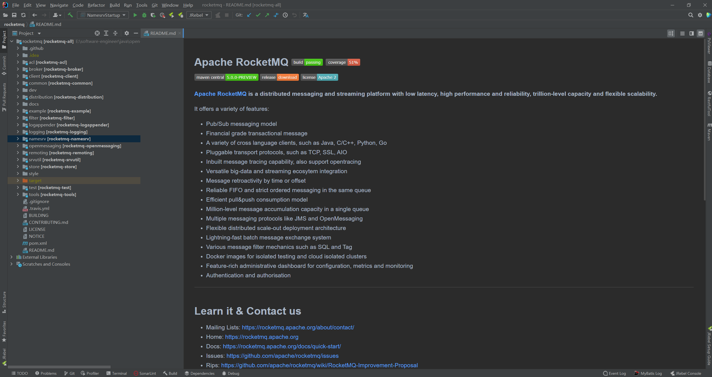

> 后面关于RocketMQ的源码分析若无特殊说明，将默认使用 4.6.0 版本

第二步：构建项目

在项目根目录下执行下列命令

```shell
mvn clean install -Dmaven.test.skip=true
```

### 1.2 启动 NameServer

第一步：展开 `namesrv` 模块，鼠标右键选中 `NamesrvStartup.java`，将其拖拽到Debug As，选中 Debug ‘NamesrvStartup.java.main()’，弹出下图：

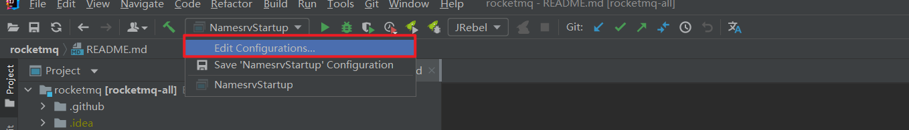

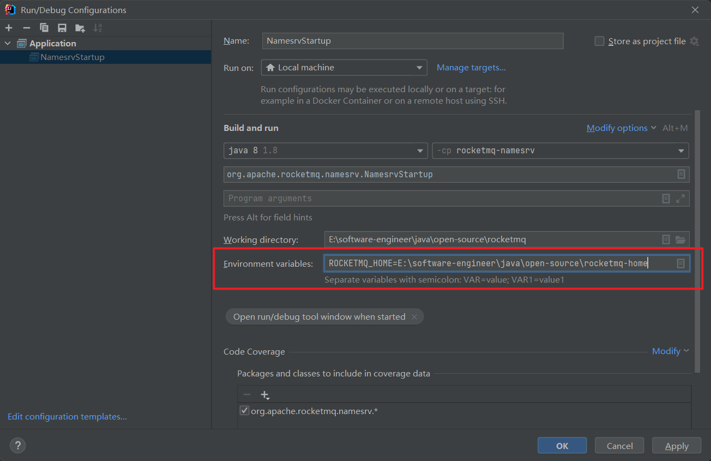

第二步：单击 Environment variables 后面的按钮，弹出配置界面，配置如下环境变量：

```properties
ROCKETMQ_HOME=E:\software-engineer\java\open-source\rocketmq-home
```

点击 OK->Apply 保存即可。

第三步：在刚刚指定的文件夹内创建conf、logs、store文件夹。

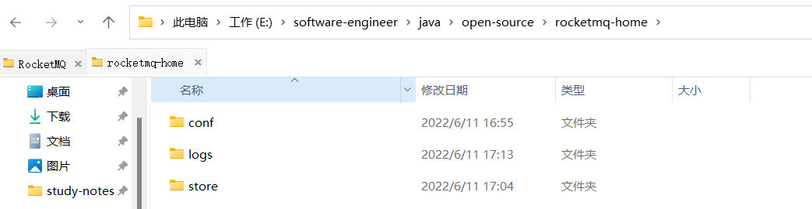

第四步：从 `distribution` 部署目录中将 `broker.conf`、`logback_broker.xml`、`logback_namesrv.xml` 等文件复制到 `conf` 目录中，按需修改 `broker.conf`

```properties
# Licensed to the Apache Software Foundation (ASF) under one or more
# contributor license agreements.  See the NOTICE file distributed with
# this work for additional information regarding copyright ownership.
# The ASF licenses this file to You under the Apache License, Version 2.0
# (the "License"); you may not use this file except in compliance with
# the License.  You may obtain a copy of the License at
#
#     http://www.apache.org/licenses/LICENSE-2.0
#
#  Unless required by applicable law or agreed to in writing, software
#  distributed under the License is distributed on an "AS IS" BASIS,
#  WITHOUT WARRANTIES OR CONDITIONS OF ANY KIND, either express or implied.
#  See the License for the specific language governing permissions and
#  limitations under the License.

brokerClusterName = DefaultCluster
brokerName = broker-a
brokerId = 0

#nameServer地址
namesrvAddr=127.0.0.1:9876
deleteWhen = 04
fileReservedTime = 48
brokerRole = ASYNC_MASTER
flushDiskType = ASYNC_FLUSH

#存储路径
storePathRootDir=E:\software-engineer\java\open-source\rocketmq-home\store
#CommitLog存储路径
storePatchCommitLog=E:\software-engineer\java\open-source\rocketmq-home\store\commitlog
#消费队列存储路径
storePathConsumeQueue=E:\software-engineer\java\open-source\rocketmq-home\store\consumequeue
#消息索引存储路径
storePathIndex=E:\software-engineer\java\open-source\rocketmq-home\store\index
#checkpoint 文件存储路径
storeCheckpoint=E:\software-engineer\java\open-source\rocketmq-home\store\checkpoint
#abort 文件存储路径
abortFile=E:\software-engineer\java\open-source\rocketmq-home\store\abort
```

第五步：点击 Debug 运行 `NamesrvStartup.java`，并输出“The Name Server boot success. serializeType=JSON”

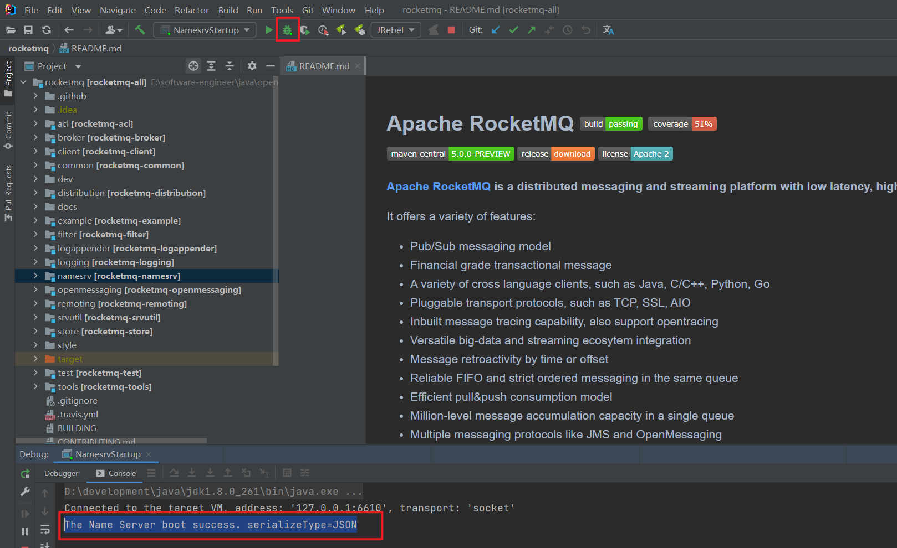

### 1.3 启动 Broker

第一步：展开 `broker` 模块，启动 `BrokerStartup.java` ，会提示需要配置 `ROCKETMQ_HOME` 环境变量。与 NameServer启动时一样，配置环境变量即可：

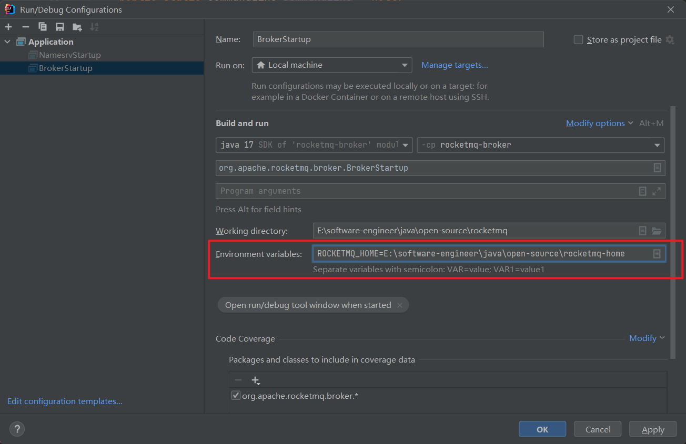

第二步：配置`-c`参数，指定`broker.conf` 配置文件地址：

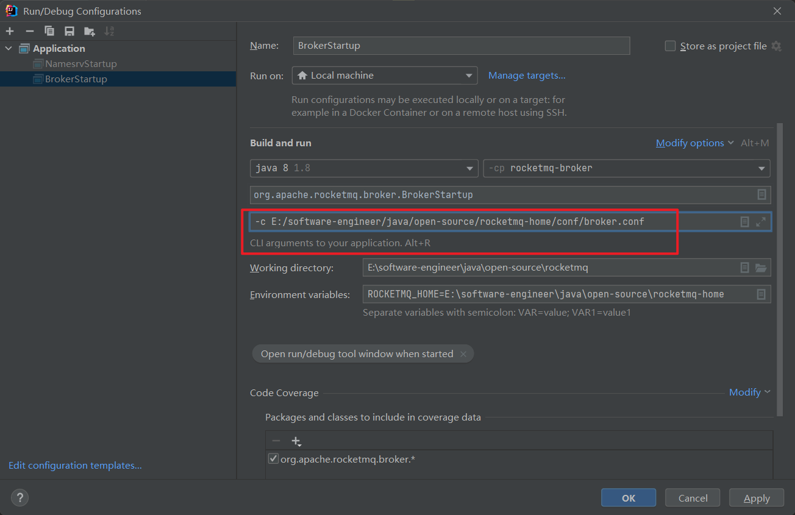

第三步：以 Debug 模式启动 `BrokerStartup.java`，查看`${ROCKET_HOME}/logs/broker.log` 文件，未报错则表示启动成功：

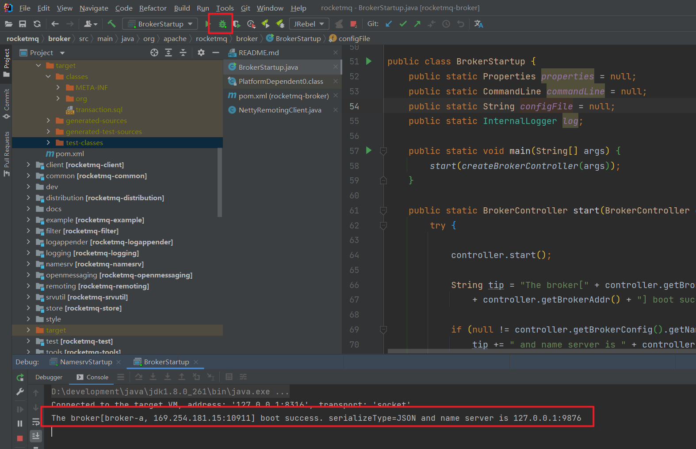

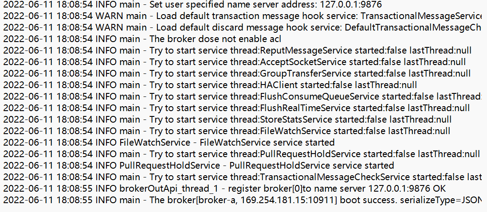

### 1.4 代码测试

#### 1.4.1 生产者

第一步：修改`org.apache.rocketmq.example.quickstart.Producer` 示例程序，设置 RocketMQ NameServer地址：

```java
public class Producer {
    public static void main(String[] args) throws MQClientException, InterruptedException {

        DefaultMQProducer producer = new DefaultMQProducer("please_rename_unique_group_name");

        producer.setNamesrvAddr("127.0.0.1:9876");
        producer.start();

        for (int i = 0; i < 1; i++) {
            try {
                Message msg = new Message("TopicTest",
                    "TagA",
                    ("Hello RocketMQ " + i).getBytes(RemotingHelper.DEFAULT_CHARSET) 
                );
                SendResult sendResult = producer.send(msg);
                System.out.printf("%s%n", sendResult);
            } catch (Exception e) {
                e.printStackTrace();
                Thread.sleep(1000);
            }
        }
        producer.shutdown();
    }
}

```

第二步：运行该方法发送消息

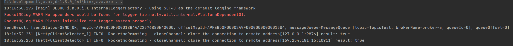

#### 1.4.2 消费者

第一步：修改 `org.apache.rocketmq.example.quickstart.Consumer` 示例程序，设置RocketMQ NameServer地址

```java
public class Consumer {

    public static void main(String[] args) throws InterruptedException, MQClientException {
        DefaultMQPushConsumer consumer = new DefaultMQPushConsumer("please_rename_unique_group_name_4");
        consumer.setNamesrvAddr("127.0.0.1:9876");
        consumer.setConsumeFromWhere(ConsumeFromWhere.CONSUME_FROM_FIRST_OFFSET);
        consumer.subscribe("TopicTest", "*");
        consumer.registerMessageListener(new MessageListenerConcurrently() {

            @Override
            public ConsumeConcurrentlyStatus consumeMessage(List<MessageExt> msgs,
                ConsumeConcurrentlyContext context) {
                System.out.printf("%s Receive New Messages: %s %n", Thread.currentThread().getName(), msgs);
                return ConsumeConcurrentlyStatus.CONSUME_SUCCESS;
            }
        });
        consumer.start();
        System.out.printf("Consumer Started.%n");
    }
}
```

第二步：运行该方法，消费消息

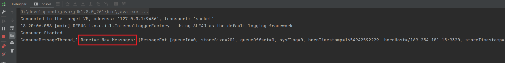

## 二. RocketMQ 源码结构

RocketMQ源码组织方式基于 Maven 模块组织，RocketMQ核心目录说明如下：

- acl：权限控制模块
- broker：broker模块（broker启动进程）
- client：消息客户端，包含消息生产者和消费者
- common：公共包
- dev：开发者信息（非源码）
- distribution：打包分发目录（非源码）
- example：示例代码
- filter：消息过滤相关基础类
- logappender：日志实现相关类
- logging：自主实现日志相关类
- namesrv：NameServer实现相关类（NameServer启动进程）
- openmessaging：消息开放标准，已发布
- remoting：远程通信模块，基于Netty
- srvutil：服务器工具类
- store：消息存储相关实现类
- style：checkstyle相关实现
- test：测试相关类
- tools：工具类，监控命令相关实现类。

## 三. Rocket设计理念和设计目标

### 3.1 设计理念

RocketMQ 设计基于主题的发布与订阅模式，其核心功能包括消息发送、消息存储和消息消费，整体设计追求简单和性能高效，主要体现在一下三个方面：

1.  首先，NameServer设计极其简单，摒弃了业界常用的使用Zookeeper充当信息管理的“注册中心”，而是自研NameServer来实现元数据的管理（Topic路由信息等）。从实际需求出发，**因为Topic路由信息无须在集群之间保持强一致，追求最终一致性，并且能容忍分钟级的不一致**。正是基于此种情况，RocketMQ的NameServer集群之间互不通信，极大地降低了NameServer实现的复杂程度，对网络的要求也降低了不少，但是性能相比较Zookeeper有了极大的提升。 
2.  其次是高效的IO存储机制。RocketMQ追求消息发送的高吞吐量，RocketMQ的消息存储文件设计成文件组的概念，**组内单个文件大小固定，方便引入内存映射机制，所有主题的消息存储基于顺序写，极大地提供了消息写性能**，同时为了兼顾消息消费与消息查找，引入了消息消费队列文件与索引文件。 
3.  最后是容忍存在设计缺陷，适当将某些工作下放给RocketMQ使用者。消息中间件的实现者经常会遇到一个难题：如何保证消息一定能被消息消费者消费，并且保证只消费一次。RocketMQ的设计者给出的解决办法是不解决这个难题，而是退而求其次，**只保证消息被消费者消费**，但设计上允许消息被重复消费，这样极大地简化了消息中间件的内核，使得实现消息发送高可用变得非常简单与高效，消息重复问题由消费者在消息消费时实现幂等。

### 3.2 设计目标

RocketMQ作为一款消息中间件，需要解决如下问题：

1.  架构模式 RocketMQ与大部分消息中间件一样，采用发布订阅模式，基本的参与组件主要包括：消息发送者、消息服务器（消息存储）、消息消费、路由发现。 

2.  顺序消息 所谓顺序消息，就是消息消费者按照消息达到消息存储服务器的顺序消费。RocketMQ可以严格保证消息有序。 

3.  消息过滤 消息过滤是指在消息消费时，消息消费者可以对同一主题下的消息按照规则只消费自己感兴趣的消息。RocketMQ消息过滤支持在服务端与消费端的消息过滤机制。 

   1. 消息在Broker端过滤。Broker只将消息消费者感兴趣的消息发送给消息消费者。
   2. 消息在消息消费端过滤，消息过滤方式完全由消息消费者自定义，但缺点是有很多无用的消息会从Broker传输到消费端。

4.  消息存储 消息中间件的一个核心实现是消息的存储，对消息存储一般有如下两个维度的考量：消息堆积能力和消息存储性能。RocketMQ追求消息存储的高性能，引入内存映射机制，所有主题的消息顺序存储在同一个文件中。同时为了避免消息无限在消息存储服务器中累积，引入了消息文件过期机制与文件存储空间报警机制。 

5.  消息高可用性 通常影响消息可靠性的有以下几种情况。 

   1. Broker正常关机。 
   2. Broker异常Crash。 
   3. OS Crash。
   4. 机器断电，但是能立即恢复供电情况。
   5. 机器无法开机（可能是CPU、主板、内存等关键设备损坏）。 
   6. 磁盘设备损坏。 

   针对上述情况，情况14的RocketMQ在同步刷盘机制下可以确保不丢失消息，在异步刷盘模式下，会丢失少量消息。情况56属于单点故障，一旦发生，该节点上的消息全部丢失，如果开启了异步复制机制，RoketMQ能保证只丢失少量消息，RocketMQ在后续版本中将引入双写机制，以满足消息可靠性要求极高的场合。 

6.  消息到达（消费）低延迟 RocketMQ在消息不发生消息堆积时，以长轮询模式实现准实时的消息推送模式。 

7.  确保消息必须被消费一次 RocketMQ 通过消息消费确认机制（ACK）来确保消息**至少被消费一次（least once）**，但由于ACK消息有可能丢失等其他原因，RocketMQ无法做到消息只被消费一次，有重复消费的可能。 

8.  回溯消息 回溯消息是指消息消费端已经消费成功的消息，由于业务要求需要重新消费消息。RocketMQ支持按时间回溯消息，时间维度可精确到毫秒，可以向前或向后回溯。 

9.  消息堆积 消息中间件的主要功能是异步解耦，必须具备应对前端的数据洪峰，提高后端系统的可用性，必然要求消息中间件具备一定的消息堆积能力。RocketMQ消息存储使用磁盘文件（内存映射机制），并且在物理布局上为多个大小相等的文件组成逻辑文件组，可以无限循环使用。**RocketMQ消息存储文件并不是永久存储在消息服务器端，而是提供了过期机制，默认保留3天**。 

10.  定时消息 定时消息是指消息发送到Broker后，不能被消息消费端立即消费，要到特定的时间点或者等待特定的时间后才能被消费。如果要支持任意精度的定时消息消费，必须在消息服务端对消息进行排序，势必带来很大的性能损耗，故RocketMQ不支持任意进度的定时消息，而只支持特定延迟级别。 

11.  消息重试机制 消息重试是指消息在消费时，如果发送异常，消息中间件需要支持消息重新投递，RocketMQ支持消息重试机制。