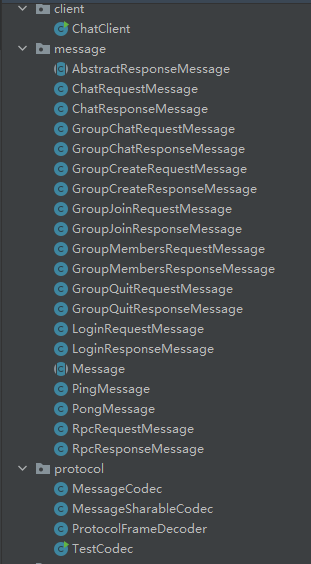
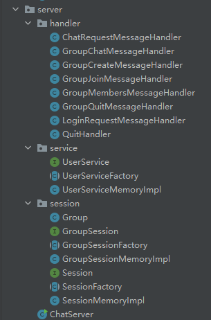
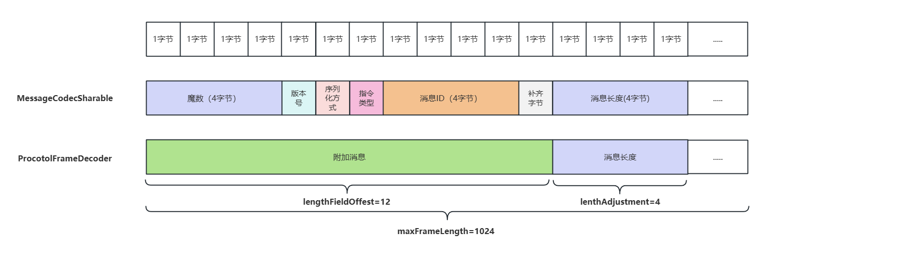
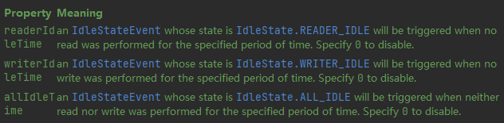
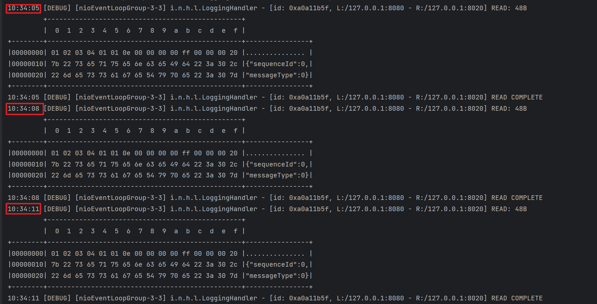
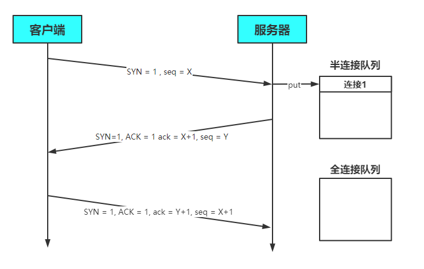
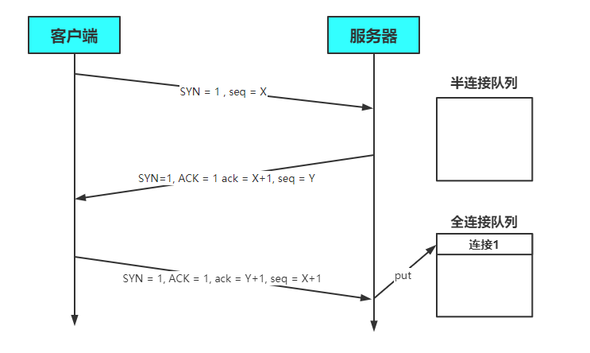
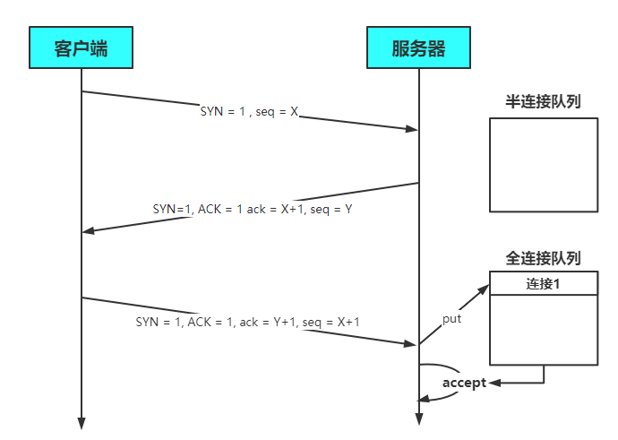

# Netty在线聊天室

> 本文代码：[bigcoder84/netty-chat-demo (github.com)](https://github.com/bigcoder84/netty-chat-demo)

## 一. 业务代码

### 1.1 用户登录接口

```java
public interface UserService {

    /**
     * 登录
     * @param username 用户名
     * @param password 密码
     * @return 登录成功返回 true, 否则返回 false
     */
    boolean login(String username, String password);
}
```

### 1.2 用户会话接口

```java
public interface Session {

    /**
     * 绑定会话
     * @param channel 哪个 channel 要绑定会话
     * @param username 会话绑定用户
     */
    void bind(Channel channel, String username);

    /**
     * 解绑会话
     * @param channel 哪个 channel 要解绑会话
     */
    void unbind(Channel channel);

    /**
     * 获取属性
     * @param channel 哪个 channel
     * @param name 属性名
     * @return 属性值
     */
    Object getAttribute(Channel channel, String name);

    /**
     * 设置属性
     * @param channel 哪个 channel
     * @param name 属性名
     * @param value 属性值
     */
    void setAttribute(Channel channel, String name, Object value);

    /**
     * 根据用户名获取 channel
     * @param username 用户名
     * @return channel
     */
    Channel getChannel(String username);
}
```

### 1.3 群聊会话接口

```java
public interface GroupSession {

    /**
     * 创建一个聊天组, 如果不存在才能创建成功, 否则返回 null
     * @param name 组名
     * @param members 成员
     * @return 成功时返回组对象, 失败返回 null
     */
    Group createGroup(String name, Set<String> members);

    /**
     * 加入聊天组
     * @param name 组名
     * @param member 成员名
     * @return 如果组不存在返回 null, 否则返回组对象
     */
    Group joinMember(String name, String member);

    /**
     * 移除组成员
     * @param name 组名
     * @param member 成员名
     * @return 如果组不存在返回 null, 否则返回组对象
     */
    Group removeMember(String name, String member);

    /**
     * 移除聊天组
     * @param name 组名
     * @return 如果组不存在返回 null, 否则返回组对象
     */
    Group removeGroup(String name);

    /**
     * 获取组成员
     * @param name 组名
     * @return 成员集合, 如果群不存在或没有成员会返回 empty set
     */
    Set<String> getMembers(String name);

    /**
     * 获取组成员的 channel 集合, 只有在线的 channel 才会返回
     * @param name 组名
     * @return 成员 channel 集合
     */
    List<Channel> getMembersChannel(String name);
    
    /**
     * 判断群聊是否一被创建
     * @param name 群聊名称
     * @return 是否存在
     */
    boolean isCreated(String name);
}
```

### 1.4 整体结构





- client包：存放客户端相关类
- message包：存放各种类型的消息
- protocol包：存放自定义协议
- server包：存放服务器相关类
  - service包：存放用户相关类
  - session包：单聊及群聊相关会话类

### 1.5 客户端代码结构

```java
public class ChatClient {
    static final Logger log = LoggerFactory.getLogger(ChatClient.class);
    public static void main(String[] args) {
        NioEventLoopGroup group = new NioEventLoopGroup();
        LoggingHandler loggingHandler = new LoggingHandler(LogLevel.DEBUG);
        MessageSharableCodec messageSharableCodec = new MessageSharableCodec();
        try {
            Bootstrap bootstrap = new Bootstrap();
            bootstrap.group(group);
            bootstrap.channel(NioSocketChannel.class);
            bootstrap.handler(new ChannelInitializer<SocketChannel>() {
                @Override
                protected void initChannel(SocketChannel ch) throws Exception {
                    ch.pipeline().addLast(new ProtocolFrameDecoder());
                    ch.pipeline().addLast(loggingHandler);
                    ch.pipeline().addLast(messageSharableCodec);
                }
            });
            Channel channel = bootstrap.connect().sync().channel();
            channel.closeFuture().sync();
        } catch (InterruptedException e) {
            e.printStackTrace();
        } finally {
           group.shutdownGracefully();
        }
    }
}
```

### 1.6 服务端代码结构

```java
public class ChatServer {
    static final Logger log = LoggerFactory.getLogger(ChatServer.class);
    public static void main(String[] args) {
        NioEventLoopGroup boss = new NioEventLoopGroup();
        NioEventLoopGroup worker = new NioEventLoopGroup();
        LoggingHandler loggingHandler = new LoggingHandler(LogLevel.DEBUG);
        MessageSharableCodec messageSharableCodec = new MessageSharableCodec();
        try {
            ServerBootstrap bootstrap = new ServerBootstrap();
            bootstrap.group(boss, worker);
            bootstrap.channel(NioServerSocketChannel.class);
            bootstrap.childHandler(new ChannelInitializer<SocketChannel>() {
                @Override
                protected void initChannel(SocketChannel ch) throws Exception {
                    ch.pipeline().addLast(new ProtocolFrameDecoder());
                    ch.pipeline().addLast(loggingHandler);
                    ch.pipeline().addLast(messageSharableCodec);
                }
            });
            Channel channel = bootstrap.bind(8080).sync().channel();
            channel.closeFuture().sync();
        } catch (InterruptedException e) {
            e.printStackTrace();
        } finally {
            boss.shutdownGracefully();
            worker.shutdownGracefully();
        }
    }
}
```

## 二. 自定义通信协议

在 《1.5 客户端代码结构》中，我们在 `initChannel` 事件中，增加了三个 Handler:

```java
ch.pipeline().addLast(new ProtocolFrameDecoder());
ch.pipeline().addLast(loggingHandler);
ch.pipeline().addLast(messageSharableCodec);
```

这样，客户端在发送消息时，出站消息会分别经过 messageSharableCodec->loggingHandler->ProtocolFrameDecoder 三个handler处理。

入站消息又会分别经过 ProtocolFrameDecoder -> loggingHandler -> messageSharableCodec 三个handler处理。

> pipeline 的 处理流程，详见：[《Netty组件 #四. Pipeline和Handler》](./_8Netty组件.md)

其中三个Handler作用分别是：

- messageSharableCodec：自定义协议的编解码

- loggingHandler：答应ByteBuf中的信息

- ProtocolFrameDecoder：继承至 `LengthFieldBasedFrameDecoder` 主要用于解决粘包粘包问题。代码如下：

  ```java
  package cn.bigcoder.protocol;
  
  import io.netty.handler.codec.LengthFieldBasedFrameDecoder;
  
  public class ProcotolFrameDecoder extends LengthFieldBasedFrameDecoder {
  
      public ProcotolFrameDecoder() {
          this(1024, 12, 4, 0, 0);
      }
  
      public ProcotolFrameDecoder(int maxFrameLength, int lengthFieldOffset, int lengthFieldLength, int lengthAdjustment, int initialBytesToStrip) {
          super(maxFrameLength, lengthFieldOffset, lengthFieldLength, lengthAdjustment, initialBytesToStrip);
      }
  }
  
  ```

> `LengthFieldBasedFrameDecoder` 详见：[《Netty应用 #1.5.4 LTC解码器》](_9Netty应用.md)

这里我们详细说一下 `messageSharableCodec`，完整代码如下：

```java
package cn.bigcoder.protocol;

import cn.bigcoder.config.Config;
import cn.bigcoder.message.Message;
import io.netty.buffer.ByteBuf;
import io.netty.channel.ChannelHandler;
import io.netty.channel.ChannelHandlerContext;
import io.netty.handler.codec.MessageToMessageCodec;
import lombok.extern.slf4j.Slf4j;

import java.util.List;

@Slf4j
@ChannelHandler.Sharable
/**
 * 必须和 LengthFieldBasedFrameDecoder 一起使用，确保接到的 ByteBuf 消息是完整的
 */
public class MessageCodecSharable extends MessageToMessageCodec<ByteBuf, Message> {
    @Override
    public void encode(ChannelHandlerContext ctx, Message msg, List<Object> outList) throws Exception {
        ByteBuf out = ctx.alloc().buffer();
        // 1. 4 字节的魔数
        out.writeBytes(new byte[]{1, 2, 3, 4});
        // 2. 1 字节的版本,
        out.writeByte(1);
        // 3. 1 字节的序列化方式 jdk 0 , json 1
        out.writeByte(Config.getSerializerAlgorithm().ordinal());
        // 4. 1 字节的指令类型
        out.writeByte(msg.getMessageType());
        // 5. 4 个字节
        out.writeInt(msg.getSequenceId());
        // 无意义，对齐填充
        out.writeByte(0xff);
        // 6. 获取内容的字节数组
        byte[] bytes = Config.getSerializerAlgorithm().serialize(msg);
        // 7. 长度
        out.writeInt(bytes.length);
        // 8. 写入内容
        out.writeBytes(bytes);
        outList.add(out);
    }

    @Override
    protected void decode(ChannelHandlerContext ctx, ByteBuf in, List<Object> out) throws Exception {
        int magicNum = in.readInt();
        byte version = in.readByte();
        byte serializerAlgorithm = in.readByte(); // 0 或 1
        byte messageType = in.readByte(); // 0,1,2...
        int sequenceId = in.readInt();
        in.readByte();
        int length = in.readInt();
        byte[] bytes = new byte[length];
        in.readBytes(bytes, 0, length);

        // 找到反序列化算法
        Serializer.Algorithm algorithm = Serializer.Algorithm.values()[serializerAlgorithm];
        // 确定具体消息类型
        Class<? extends Message> messageClass = Message.getMessageClass(messageType);
        Message message = algorithm.deserialize(messageClass, bytes);
//        log.debug("{}, {}, {}, {}, {}, {}", magicNum, version, serializerType, messageType, sequenceId, length);
//        log.debug("{}", message);
        out.add(message);
    }

}
```

在自定义协议解码器中，我们将Java对象进行序列化，并利用 `LengthFieldBasedFrameDecoder` 头部附加消息区域存储 魔数、版本号、序列化方式、指令类型等协议信息：



## 三. 登录

### 3.1 客户端代码

客户端添加如下handler，**分别处理登录、聊天等操作**

```java
ch.pipeline().addLast(new ChannelInboundHandlerAdapter() {
    /**
     * 创建连接时执行的处理器，用于执行登陆操作
     */
    @Override
    public void channelActive(ChannelHandlerContext ctx) throws Exception {
        // 开辟额外线程，用于用户登陆及后续操作
        new Thread(()->{
            Scanner scanner = new Scanner(System.in);
            System.out.println("请输入用户名");
            String username = scanner.next();
            System.out.println("请输入密码");
            String password = scanner.next();
            // 创建包含登录信息的请求体
            LoginRequestMessage message = new LoginRequestMessage(username, password);
            // 发送到channel中
            ctx.writeAndFlush(message);
            System.out.println("等待后续操作...");
            // 阻塞，直到登陆成功后CountDownLatch被设置为0
            try {
                waitLogin.await();
            } catch (InterruptedException e) {
                e.printStackTrace();
            }
            // 执行后续操作
            if (!loginStatus.get()) {
                // 登陆失败，关闭channel并返回
                ctx.channel().close();
                return;
            }
            // 登录成功后，执行其他操作
            while (true) {
                System.out.println("==================================");
                System.out.println("send [username] [content]");
                System.out.println("gsend [group name] [content]");
                System.out.println("gcreate [group name] [m1,m2,m3...]");
                System.out.println("gmembers [group name]");
                System.out.println("gjoin [group name]");
                System.out.println("gquit [group name]");
                System.out.println("quit");
                System.out.println("==================================");
                String command = scanner.nextLine();
                // 获得指令及其参数，并发送对应类型消息
                String[] commands = command.split(" ");
                switch (commands[0]){
                    case "send":
                        ctx.writeAndFlush(new ChatRequestMessage(username, commands[1], commands[2]));
                        break;
                    case "gsend":
                        ctx.writeAndFlush(new GroupChatRequestMessage(username,commands[1], commands[2]));
                        break;
                    case "gcreate":
                        // 分割，获得群员名
                        String[] members = commands[2].split(",");
                        Set<String> set = new HashSet<>(Arrays.asList(members));
                        // 把自己加入到群聊中
                        set.add(username);
                        ctx.writeAndFlush(new GroupCreateRequestMessage(commands[1],set));
                        break;
                    case "gmembers":
                        ctx.writeAndFlush(new GroupMembersRequestMessage(commands[1]));
                        break;
                    case "gjoin":
                        ctx.writeAndFlush(new GroupJoinRequestMessage(username, commands[1]));
                        break;
                    case "gquit":
                        ctx.writeAndFlush(new GroupQuitRequestMessage(username, commands[1]));
                        break;
                    case "quit":
                        ctx.channel().close();
                        return;
                    default:
                        System.out.println("指令有误，请重新输入");
                        continue;
                }
            }
        }, "login channel").start();
    }

    @Override
    public void channelRead(ChannelHandlerContext ctx, Object msg) throws Exception {
        log.debug("{}", msg);
        if (msg instanceof LoginResponseMessage) {
            // 如果是登录响应信息
            LoginResponseMessage message = (LoginResponseMessage) msg;
            boolean isSuccess = message.isSuccess();
            // 登录成功，设置登陆标记
            if (isSuccess) {
                loginStatus.set(true);
            }
            // 登陆后，唤醒登陆线程
            waitLogin.countDown();
        }
    }
});
```

### 3.2 服务器代码

服务器添加如下handler，并添加到对应的channel中，**负责处理登录请求信息，并作出响应**

```java
@ChannelHandler.Sharable // 必须添加该注解
public class LoginRequestMessageHandler extends SimpleChannelInboundHandler<LoginRequestMessage> {
    @Override
    protected void channelRead0(ChannelHandlerContext ctx, LoginRequestMessage msg) throws Exception {
        // 获得登录信息
        String username = msg.getUsername();
        String password = msg.getPassword();
        // 校验登录信息
        boolean login = UserServiceFactory.getUserService().login(username, password);
        LoginResponseMessage message;
        if (login) {
            message = new LoginResponseMessage(true, "登陆成功");
            // 绑定channel与user
            SessionFactory.getSession().bind(ctx.channel(), username);
        } else {
            message = new LoginResponseMessage(false, "登陆失败");
        }
        ctx.writeAndFlush(message);
    }
}
```

```java
// 该handler处理登录请求
LoginRequestMessageHandler loginRequestMessageHandler = new LoginRequestMessageHandler();
ch.pipeline().addLast(new LoginRequestMessageHandler());
```

### 3.3 运行结果

#### 3.3.1 客户端

```txt
请输入用户名:
zhangsan
请输入密码:
123
LoginRequestMessage(super=Message(sequenceId=0, messageType=0), username=zhangsan, password=123)
等待后续操作...
16:16:23 [DEBUG] [nioEventLoopGroup-2-1] c.b.c.ChatClient - msg: LoginResponseMessage(super=AbstractResponseMessage(super=Message(sequenceId=0, messageType=1), success=true, reason=登录成功))
==================================
send [username] [content]
gsend [group name] [content]
gcreate [group name] [m1,m2,m3...]
gmembers [group name]
gjoin [group name]
gquit [group name]
quit
==================================
```

#### 3.3.2 服务器

```java
16:16:15 [DEBUG] [nioEventLoopGroup-3-3] i.n.h.l.LoggingHandler - [id: 0xf222b539, L:/127.0.0.1:8080 - R:/127.0.0.1:13175] REGISTERED
16:16:15 [DEBUG] [nioEventLoopGroup-3-3] i.n.h.l.LoggingHandler - [id: 0xf222b539, L:/127.0.0.1:8080 - R:/127.0.0.1:13175] ACTIVE
16:16:23 [DEBUG] [nioEventLoopGroup-3-3] i.n.h.l.LoggingHandler - [id: 0xf222b539, L:/127.0.0.1:8080 - R:/127.0.0.1:13175] READ: 87B
         +-------------------------------------------------+
         |  0  1  2  3  4  5  6  7  8  9  a  b  c  d  e  f |
+--------+-------------------------------------------------+----------------+
|00000000| 01 02 03 04 01 01 00 00 00 00 00 ff 00 00 00 47 |...............G|
|00000010| 7b 22 75 73 65 72 6e 61 6d 65 22 3a 22 7a 68 61 |{"username":"zha|
|00000020| 6e 67 73 61 6e 22 2c 22 70 61 73 73 77 6f 72 64 |ngsan","password|
|00000030| 22 3a 22 31 32 33 22 2c 22 73 65 71 75 65 6e 63 |":"123","sequenc|
|00000040| 65 49 64 22 3a 30 2c 22 6d 65 73 73 61 67 65 54 |eId":0,"messageT|
|00000050| 79 70 65 22 3a 30 7d                            |ype":0}         |
+--------+-------------------------------------------------+----------------+
16:16:23 [DEBUG] [nioEventLoopGroup-3-3] i.n.h.l.LoggingHandler - [id: 0xf222b539, L:/127.0.0.1:8080 - R:/127.0.0.1:13175] WRITE: 87B
         +-------------------------------------------------+
         |  0  1  2  3  4  5  6  7  8  9  a  b  c  d  e  f |
+--------+-------------------------------------------------+----------------+
|00000000| 01 02 03 04 01 01 01 00 00 00 00 ff 00 00 00 47 |...............G|
|00000010| 7b 22 73 75 63 63 65 73 73 22 3a 74 72 75 65 2c |{"success":true,|
|00000020| 22 72 65 61 73 6f 6e 22 3a 22 e7 99 bb e5 bd 95 |"reason":"......|
|00000030| e6 88 90 e5 8a 9f 22 2c 22 73 65 71 75 65 6e 63 |......","sequenc|
|00000040| 65 49 64 22 3a 30 2c 22 6d 65 73 73 61 67 65 54 |eId":0,"messageT|
|00000050| 79 70 65 22 3a 30 7d                            |ype":0}         |
+--------+-------------------------------------------------+----------------+
16:16:23 [DEBUG] [nioEventLoopGroup-3-3] i.n.h.l.LoggingHandler - [id: 0xf222b539, L:/127.0.0.1:8080 - R:/127.0.0.1:13175] FLUSH
16:16:23 [DEBUG] [nioEventLoopGroup-3-3] i.n.h.l.LoggingHandler - [id: 0xf222b539, L:/127.0.0.1:8080 - R:/127.0.0.1:13175] READ COMPLETE
```

## 四. 单聊

客户端输入`send username content`即可发送单聊消息，需要 **服务器端添加处理ChatRequestMessage的handler**

```java
@ChannelHandler.Sharable // 必须添加该注解
public class ChatRequestMessageHandler extends SimpleChannelInboundHandler<ChatRequestMessage> {
    @Override
    protected void channelRead0(ChannelHandlerContext ctx, ChatRequestMessage msg) throws Exception {
        // 获得user所在的channel
        Channel channel = SessionFactory.getSession().getChannel(msg.getTo());
        // 如果双方都在线
        if (channel != null) {
            // 通过接收方与服务器之间的channel发送信息
            channel.writeAndFlush(new ChatResponseMessage(msg.getFrom(), msg.getContent()));
        } else {
            // 通过发送方与服务器之间的channel发送消息
            ctx.writeAndFlush(new ChatResponseMessage(false, "对方用户不存在或离线，发送失败"));
        }
    }
}
```

```java
// 该handler处理单聊请求
ChatRequestMessageHandler chatRequestMessageHandler = new ChatRequestMessageHandler();
ch.pipeline().addLast(chatRequestMessageHandler);
```

**运行结果**

发送方（lisi）

```
send zhangsan hello
```

接收方（zhangsan）

```
// 收到zhangsan发来的消息
16:23:02 [DEBUG] [nioEventLoopGroup-2-1] c.b.c.ChatClient - msg: ChatResponseMessage(super=AbstractResponseMessage(super=Message(sequenceId=0, messageType=3), success=false, reason=null), from=lisi, content=hello)
```

## 五. 群聊

### 5.1 创建群聊

添加处理`GroupCreateRequestMessage`的handler

```java
@ChannelHandler.Sharable
public class GroupCreateMessageHandler extends SimpleChannelInboundHandler<GroupCreateRequestMessage> {
    @Override
    protected void channelRead0(ChannelHandlerContext ctx, GroupCreateRequestMessage msg) throws Exception {
        // 获得要创建的群聊名
        String groupName = msg.getGroupName();
        // 获得要创建的群聊的成员组
        Set<String> members = msg.getMembers();
        // 判断该群聊是否创建过，未创建返回null并创建群聊
        Group group = GroupSessionFactory.getGroupSession().createGroup(groupName, members);
        if (group == null) {
            // 发送创建成功消息
            GroupCreateResponseMessage groupCreateResponseMessage = new GroupCreateResponseMessage(true, groupName + "创建成功");
            ctx.writeAndFlush(groupCreateResponseMessage);
            // 获得在线群员的channel，给群员发送入群聊消息
            List<Channel> membersChannel = GroupSessionFactory.getGroupSession().getMembersChannel(groupName);
            groupCreateResponseMessage = new GroupCreateResponseMessage(true, "您已被拉入"+groupName);
            // 给每个在线群员发送消息
            for(Channel channel : membersChannel) {
                channel.writeAndFlush(groupCreateResponseMessage);
            }
        } else {
            // 发送失败消息
            GroupCreateResponseMessage groupCreateResponseMessage = new GroupCreateResponseMessage(false, groupName + "已存在");
            ctx.writeAndFlush(groupCreateResponseMessage);
        }
    }
}
```

```java
// 该handler处理创建群聊请求
GroupCreateMessageHandler groupCreateMessageHandler = new GroupCreateMessageHandler();
ch.pipeline().addLast(groupCreateMessageHandler);
```

**运行结果**

```txt
// 首次创建
gcreate Netty学习 zhangsan,lisi

31649 [nioEventLoopGroup-2-1] DEBUG ChatClient  - AbstractResponseMessage{success=true, reason='Netty学习创建成功'}
15244 [nioEventLoopGroup-2-1] DEBUG ChatClient  - AbstractResponseMessage{success=true, reason='您已被拉入Netty学习'}


// 再次创建
gcreate Netty学习 zhangsan,lisi
40771 [nioEventLoopGroup-2-1] DEBUG ChatClient  - AbstractResponseMessage{success=false, reason='Netty学习已存在'}
```

群员客户端

```txt
28788 [nioEventLoopGroup-2-1] DEBUG ChatClient  - AbstractResponseMessage{success=true, reason='您已被拉入Netty学习'}
```

### 5.2 聊天

```java
@ChannelHandler.Sharable
public class GroupChatMessageHandler extends SimpleChannelInboundHandler<GroupChatRequestMessage> {
    @Override
    protected void channelRead0(ChannelHandlerContext ctx, GroupChatRequestMessage msg) throws Exception {
        String groupName = msg.getGroupName();
        GroupSession groupSession = GroupSessionFactory.getGroupSession();
        // 判断群聊是否存在
        boolean isCreated = groupSession.isCreated(groupName);
        if (isCreated) {
            // 给群员发送信息
            List<Channel> membersChannel = groupSession.getMembersChannel(groupName);
            for(Channel channel : membersChannel) {
                channel.writeAndFlush(new GroupChatResponseMessage(msg.getFrom(), msg.getContent()));
            }
        } else {
            ctx.writeAndFlush(new GroupChatResponseMessage(false, "群聊不存在"));
        }
    }
}
```

```java
// 该handler处理群聊聊天
GroupChatMessageHandler groupChatMessageHandler = new GroupChatMessageHandler();
ch.pipeline().addLast(groupChatMessageHandler);
```

**运行结果**

发送方（群聊存在）

```
gsend Netty学习 你们好

45408 [nioEventLoopGroup-2-1] DEBUG ChatClient  - GroupChatResponseMessage{from='zhangsan', content='你们好'}
```

接收方

```
48082 [nioEventLoopGroup-2-1] DEBUG ChatClient  - GroupChatResponseMessage{from='zhangsan', content='你们好'}
```

发送方（群聊不存在）

```
gsend Spring学习 你们好

25140 [nioEventLoopGroup-2-1] DEBUG ChatClient  - AbstractResponseMessage{success=false, reason='群聊不存在'}
```

### 5.3 加入群聊

```java
@ChannelHandler.Sharable
public class GroupJoinMessageHandler extends SimpleChannelInboundHandler<GroupJoinRequestMessage> {
    @Override
    protected void channelRead0(ChannelHandlerContext ctx, GroupJoinRequestMessage msg) throws Exception {
        GroupSession groupSession = GroupSessionFactory.getGroupSession();
        // 判断该用户是否在群聊中
        Set<String> members = groupSession.getMembers(msg.getGroupName());
        boolean joinFlag = false;
        // 群聊存在且用户未加入，才能加入
        if (!members.contains(msg.getUsername())) {
            joinFlag = true;
        }

        if (joinFlag) {
            // 加入群聊
            groupSession.joinMember(msg.getGroupName(), msg.getUsername());
            ctx.writeAndFlush(new GroupJoinResponseMessage(true,"加入"+msg.getGroupName()+"成功"));
        } else {
            ctx.writeAndFlush(new GroupJoinResponseMessage(false, "加入失败，群聊未存在或您已加入该群聊"));
        }
    }
}
```

```txt
// 该handler处理加入群聊
GroupJoinMessageHandler groupJoinMessageHandler = new GroupJoinMessageHandler();
ch.pipeline().addLast(groupJoinMessageHandler);
```

### 5.4 退出群聊

```java
@ChannelHandler.Sharable
public class GroupQuitMessageHandler extends SimpleChannelInboundHandler<GroupQuitRequestMessage> {
    @Override
    protected void channelRead0(ChannelHandlerContext ctx, GroupQuitRequestMessage msg) throws Exception {
        GroupSession groupSession = GroupSessionFactory.getGroupSession();
        String groupName = msg.getGroupName();
        Set<String> members = groupSession.getMembers(groupName);
        String username = msg.getUsername();
        // 判断用户是否在群聊中以及群聊是否存在
        boolean joinFlag = false;
        if (groupSession.isCreated(groupName) && members.contains(username)) {
            // 可以退出
            joinFlag = true;
        }

        if (joinFlag) {
            // 退出成功
            groupSession.removeMember(groupName, username);
            ctx.writeAndFlush(new GroupQuitResponseMessage(true, "退出"+groupName+"成功"));
        } else {
            // 退出失败
            ctx.writeAndFlush(new GroupQuitResponseMessage(false, "群聊不存在或您未加入该群，退出"+groupName+"失败"));
        }
    }
}
```

### 5.5 空闲检测

#### 5.5.1 连接假死

**原因**

- 网络设备出现故障，例如网卡，机房等，底层的 TCP 连接已经断开了，**但应用程序没有感知到**，仍然占用着资源
- 公网网络不稳定，出现丢包。如果连续出现丢包，这时现象就是客户端数据发不出去，服务端也一直收不到数据，会白白地消耗资源
- 应用程序线程阻塞，无法进行数据读写

**问题**

- 假死的连接占用的资源不能自动释放
- 向假死的连接发送数据，得到的反馈是发送超时

#### 5.5.2 解决方法

可以添加`IdleStateHandler`对空闲时间进行检测，通过构造函数可以传入三个参数

- readerIdleTimeSeconds 读空闲经过的秒数
- writerIdleTimeSeconds 写空闲经过的秒数
- allIdleTimeSeconds 读和写空闲经过的秒数

当指定时间内未发生读或写事件时，**会触发特定事件**



- 读空闲会触发`READER_IDLE`
- 写空闲会触发`WRITE_IDLE`
- 读和写空闲会触发`ALL_IDEL`

**服务器端代码**

```java
// 用于空闲连接的检测，5s内未读到数据，会触发READ_IDLE事件
ch.pipeline().addLast(new IdleStateHandler(5, 0, 0));
// 添加双向处理器，负责处理READER_IDLE事件
ch.pipeline().addLast(new ChannelDuplexHandler() {
    @Override
    public void userEventTriggered(ChannelHandlerContext ctx, Object evt) throws Exception {
        // 获得事件
        IdleStateEvent event = (IdleStateEvent) evt;
        if (event.state() == IdleState.READER_IDLE) {
            // 断开连接
            ctx.channel().close();
        }
    }
});
```

- 使用`IdleStateHandler`进行空闲检测
- 使用双向处理器 `ChannelDuplexHandler`对入站与出站事件进行处理
  - `IdleStateHandler`中的事件为特殊事件，需要实现`ChannelDuplexHandler`的`userEventTriggered`方法，判断事件类型并自定义处理方式，来对事件进行处理

为**避免因非网络等原因引发的READ_IDLE事件**，比如网络情况良好，只是用户本身没有输入数据，这时发生READ_IDLE事件，**直接让服务器断开连接是不可取的**

为避免此类情况，需要在**客户端向服务器发送心跳包**，发送频率要**小于**服务器设置的`IdleTimeSeconds`，一般设置为其值的一半

**客户端代码**

```java
// 发送心跳包，让服务器知道客户端在线
// 3s未发生WRITER_IDLE，就像服务器发送心跳包
// 该值为服务器端设置的READER_IDLE触发时间的一半左右
ch.pipeline().addLast(new IdleStateHandler(0, 3, 0));
ch.pipeline().addLast(new ChannelDuplexHandler() {
    @Override
    public void userEventTriggered(ChannelHandlerContext ctx, Object evt) throws Exception {
        IdleStateEvent event = (IdleStateEvent) evt;
        if (event.state() == IdleState.WRITER_IDLE) {
            // 发送心跳包
            ctx.writeAndFlush(new PingMessage());
        }
    }
});
```

可以看到，每3秒服务端就会收到客户端的心跳消息：



## 六. 优化

### 6.1 拓展序列化算法

#### 6.1.1 序列化接口

```java
public interface Serializer {
    /**
     * 序列化
     * @param object 被序列化的对象
     * @param <T> 被序列化对象类型
     * @return 序列化后的字节数组
     */
    <T> byte[] serialize(T object);

    /**
     * 反序列化
     * @param clazz 反序列化的目标类的Class对象
     * @param bytes 被反序列化的字节数组
     * @param <T> 反序列化目标类
     * @return 反序列化后的对象
     */
    <T> T deserialize(Class<T> clazz, byte[] bytes);
}
```

#### 6.1.2 枚举实现类

```java
public enum SerializerAlgorithm implements Serializer {
    // Java的序列化和反序列化
    Java {
        @Override
        public <T> byte[] serialize(T object) {
            // 序列化后的字节数组
            byte[] bytes = null;
            try (ByteArrayOutputStream bos = new ByteArrayOutputStream();
                 ObjectOutputStream oos = new ObjectOutputStream(bos)) {
                oos.writeObject(object);
                bytes = bos.toByteArray();
            } catch (IOException e) {
                e.printStackTrace();
            }
            return bytes;
        }

        @Override
        public <T> T deserialize(Class<T> clazz, byte[] bytes) {
            T target = null;
            System.out.println(Arrays.toString(bytes));
            try (ByteArrayInputStream bis = new ByteArrayInputStream(bytes);
                 ObjectInputStream ois = new ObjectInputStream(bis)) {
                target = (T) ois.readObject();
            } catch (IOException | ClassNotFoundException e) {
                e.printStackTrace();
            }
            // 返回反序列化后的对象
            return target;
        }
    }
    
     // Json的序列化和反序列化
    Json {
        @Override
        public <T> byte[] serialize(T object) {
            String s = new Gson().toJson(object);
            System.out.println(s);
            // 指定字符集，获得字节数组
            return s.getBytes(StandardCharsets.UTF_8);
        }

        @Override
        public <T> T deserialize(Class<T> clazz, byte[] bytes) {
            String s = new String(bytes, StandardCharsets.UTF_8);
            System.out.println(s);
            // 此处的clazz为具体类型的Class对象，而不是父类Message的
            return new Gson().fromJson(s, clazz);
        }
    }
}
```

#### 6.1.2 修改原编解码器

```java
// 获得序列化后的msg
// 使用指定的序列化方式
SerializerAlgorithm[] values = SerializerAlgorithm.values();
// 获得序列化后的对象
byte[] bytes = values[out.getByte(5)-1].serialize(msg);
```

### 6.2 参数调优

#### 6.2.1 CONNECT_TIMEOUT_MILLIS

- 属于 **SocketChannal** 的参数
- 用在**客户端建立连接**时，如果在指定毫秒内无法连接，会抛出 timeout 异常
- **注意**：SO_TIMEOUT 主要用在阻塞 IO，阻塞IO中 accept 和 read 等都是无限等待，如果不希望永久阻塞，使用它调整时间。

**使用**

```java
public class TestParam {
    public static void main(String[] args) {
        // SocketChannel 5s内未建立连接就抛出异常
        new Bootstrap().option(ChannelOption.CONNECT_TIMEOUT_MILLIS, 5000);
        
        // ServerSocketChannel 5s内未建立连接就抛出异常
        new ServerBootstrap().option(ChannelOption.CONNECT_TIMEOUT_MILLIS,5000);
        // SocketChannel 5s内未建立连接就抛出异常
        new ServerBootstrap().childOption(ChannelOption.CONNECT_TIMEOUT_MILLIS, 5000);
    }
}
```

- 客户端通过 `Bootstrap.option` 函数来配置参数，**配置参数作用于 SocketChannel**
- 服务器通过 ServerBootstrap 来配置参数，但是对于不同的 Channel 需要选择不同的方法
  - 通过 `option` 来配置 **ServerSocketChannel** 上的参数
  - 通过 `childOption` 来配置 **SocketChannel** 上的参数

**源码分析**

客户端中连接服务器的线程是 NIO 线程，抛出异常的是主线程。这是如何做到超时判断以及线程通信的呢？

```java
public final void connect(
                final SocketAddress remoteAddress, final SocketAddress localAddress, final ChannelPromise promise) {
    
    ...
        
    // Schedule connect timeout.
    // 设置超时时间，通过option方法传入的CONNECT_TIMEOUT_MILLIS参数进行设置
    int connectTimeoutMillis = config().getConnectTimeoutMillis();
    // 如果超时时间大于0
    if (connectTimeoutMillis > 0) {
        // 创建一个定时任务，延时connectTimeoutMillis（设置的超时时间时间）后执行
        // schedule(Runnable command, long delay, TimeUnit unit)
        connectTimeoutFuture = eventLoop().schedule(new Runnable() {
            @Override
            public void run() {
                // 判断是否建立连接，Promise进行NIO线程与主线程之间的通信
                // 如果超时，则通过tryFailure方法将异常放入Promise中
                // 在主线程中抛出
                ChannelPromise connectPromise = AbstractNioChannel.this.connectPromise;
                ConnectTimeoutException cause = new ConnectTimeoutException("connection timed out: " + remoteAddress);
                if (connectPromise != null && connectPromise.tryFailure(cause)) {
                    close(voidPromise());
                }
            }
        }, connectTimeoutMillis, TimeUnit.MILLISECONDS);
    }
    
   	...
        
}
```

超时的判断**主要是通过 Eventloop 的 schedule 方法和 Promise 共同实现的**

- schedule 设置了一个定时任务，延迟`connectTimeoutMillis`秒后执行该方法
- 如果指定时间内没有建立连接，则会执行其中的任务
  - 任务负责创建 `ConnectTimeoutException` 异常，并将异常通过 Pormise 传给主线程并抛出

#### 6.2.2 SO_BACKLOG

该参数是 **ServerSocketChannel** 的参数

**三次握手与连接队列**

第一次握手时，因为客户端与服务器之间的连接还未完全建立，连接会被放入**半连接队列**中



当完成三次握手以后，连接会被放入**全连接队列中**



服务器处理Accept事件是在TCP三次握手，也就是建立连接之后。服务器会从全连接队列中获取连接并进行处理



> 1. 全连接队列的意义：
>    - 保持已建立的连接：全连接队列用于存储已经完成三次握手的TCP连接。这些连接处于已建立状态，可以进行数据的传输和通信。
>    - 避免连接丢失：如果服务器正在处理一个已建立连接的请求，并且有新的连接请求到达，这些新的连接请求会被放置在全连接队列中等待处理。这样可以避免连接请求丢失，确保服务器能够逐个处理连接请求。
>    - 顺序处理连接：全连接队列中的连接请求可以按照先到先服务的原则进行顺序处理，确保公平性和连接请求的有序性。
> 2. 半连接队列的意义：
>    - 防止服务器资源耗尽：半连接队列用于存储已经发送了SYN报文但尚未完成三次握手的连接请求。服务器在接收到SYN报文后，会将这些连接请求放置在半连接队列中等待响应。通过限制半连接队列的长度，可以控制同时等待握手完成的连接数量，避免服务器资源耗尽。
>    - 防止SYN洪泛攻击：SYN洪泛攻击是一种常见的网络攻击方式，攻击者发送大量伪造的SYN报文给服务器，使服务器占用大量资源来处理伪造的连接请求。通过限制半连接队列的长度，可以减轻服务器对SYN洪泛攻击的影响，保护服务器的正常运行。

在 linux 2.2 之前，backlog 大小包括了两个队列的大小，**在 linux 2.2 之后，分别用下面两个参数来控制**

- 半连接队列 - sync queue
  - 大小通过 /proc/sys/net/ipv4/tcp_max_syn_backlog 指定，在 `syncookies` 启用的情况下，逻辑上没有最大值限制，这个设置便被忽略
- 全连接队列 - accept queue
  - 其大小通过 /proc/sys/net/core/somaxconn 指定，在使用 listen 函数时，**内核会根据传入的 backlog 参数与系统参数，取二者的较小值**
  - 如果 accpet queue 队列满了，server 将发送一个拒绝连接的错误信息到 client

**作用**

在Netty中，`SO_BACKLOG`主要用于设置全连接队列的大小。**当处理Accept的速率小于连接建立的速率时，全连接队列中堆积的连接数大于`SO_BACKLOG`设置的值是，便会抛出异常**

**设置方式如下**

```java
// 设置全连接队列，大小为2
new ServerBootstrap().option(ChannelOption.SO_BACKLOG, 2);
```

**默认值**

backlog参数在`NioServerSocketChannel.doBind`方法被使用

```java
@Override
protected void doBind(SocketAddress localAddress) throws Exception {
    if (PlatformDependent.javaVersion() >= 7) {
        javaChannel().bind(localAddress, config.getBacklog());
    } else {
        javaChannel().socket().bind(localAddress, config.getBacklog());
    }
}
```

其中backlog被保存在了`DefaultServerSocketChannelConfig`配置类中

```java
private volatile int backlog = NetUtil.SOMAXCONN;
```

具体的赋值操作如下

```java
SOMAXCONN = AccessController.doPrivileged(new PrivilegedAction<Integer>() {
    @Override
    public Integer run() {
        // Determine the default somaxconn (server socket backlog) value of the platform.
        // The known defaults:
        // - Windows NT Server 4.0+: 200
        // - Linux and Mac OS X: 128
        int somaxconn = PlatformDependent.isWindows() ? 200 : 128;
        File file = new File("/proc/sys/net/core/somaxconn");
        BufferedReader in = null;
        try {
            // file.exists() may throw a SecurityException if a SecurityManager is used, so execute it in the
            // try / catch block.
            // See https://github.com/netty/netty/issues/4936
            if (file.exists()) {
                in = new BufferedReader(new FileReader(file));
                // 将somaxconn设置为Linux配置文件中设置的值
                somaxconn = Integer.parseInt(in.readLine());
                if (logger.isDebugEnabled()) {
                    logger.debug("{}: {}", file, somaxconn);
                }
            } else {
                ...
            }
            ...
        }  
        // 返回backlog的值
        return somaxconn;
    }
}
```

- backlog的值会根据操作系统的不同，来

  选择不同的默认值

  - Windows 200
  - Linux/Mac OS 128

- **如果配置文件`/proc/sys/net/core/somaxconn`存在**，会读取配置文件中的值，并将backlog的值设置为配置文件中指定的

#### 6.2.3 TCP_NODELAY

- 属于 **SocketChannal** 参数
- 因为 Nagle 算法，数据包会堆积到一定的数量后一起发送，这就**可能导致数据的发送存在一定的延时**
- **该参数默认为false**，如果不希望的发送被延时，则需要将该值设置为true

#### 6.2.4 SO_SNDBUF & SO_RCVBUF

- SO_SNDBUF 属于 **SocketChannal** 参数
- SO_RCVBUF **既可用于 SocketChannal 参数，也可以用于 ServerSocketChannal 参数**（建议设置到 ServerSocketChannal 上）
- 该参数用于**指定接收方与发送方的滑动窗口大小**

#### 6.2.5 ALLOCATOR

- 属于 **SocketChannal** 参数
- 用来配置 ByteBuf 是池化还是非池化，是直接内存还是堆内存

**使用**

```java
// 选择ALLOCATOR参数，设置SocketChannel中分配的ByteBuf类型
// 第二个参数需要传入一个ByteBufAllocator，用于指定生成的 ByteBuf 的类型
new ServerBootstrap().childOption(ChannelOption.ALLOCATOR, new PooledByteBufAllocator());
```

**ByteBufAllocator类型**

- 池化并使用直接内存

  ```java
  // true表示使用直接内存
  new PooledByteBufAllocator(true);
  ```

- 池化并使用堆内存

  ```java
  // false表示使用堆内存
  new PooledByteBufAllocator(false);
  ```

- 非池化并使用直接内存

  ```java
  // ture表示使用直接内存
  new UnpooledByteBufAllocator(true);
  ```

- 非池化并使用堆内存

  ```java
  // false表示使用堆内存
  new UnpooledByteBufAllocator(false);
  ```

#### 6.2.6 RCVBUF_ALLOCATOR

- 属于 **SocketChannal** 参数
- **控制 Netty 接收缓冲区大小**
- 负责入站数据的分配，决定入站缓冲区的大小（并可动态调整），**统一采用 direct 直接内存**，具体池化还是非池化由 allocator 决定

