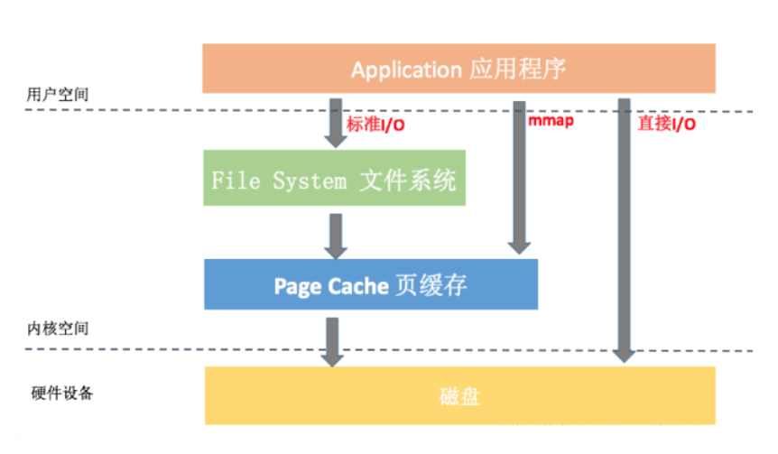

# Java中使用内存映射操作文件

最近在阅读 RocketMQ 源码时发现，RocketMQ broker 在存储 Producer 发送的消息至 CommitLog 文件时并没有使用传统的文件IO，而使用内存映射机制。那内存映射机制相比于传统文件IO的优势在哪？以及内存映射机制能视为银弹，在任何文件IO场景下使用吗？

## 一. 什么是mmap内存映射机制

内存映射文件（Memory-mapped file）的优势主要源于其特殊的数据处理方式。这种方式允许计算机将文件或文件的一部分直接映射到内存中，因此可以像操作内存一样操作硬盘上的文件。

在传统的磁盘I/O操作中，如果你想写入数据到文件，通常需要经过以下步骤：

1. 操作系统从用户空间复制数据到内核缓冲区。
2. 然后将数据从内核缓冲区复制到磁盘。



同样，在从文件读取数据时，也需要做两次数据复制：从磁盘到内核缓冲区，再从内核缓冲区到用户空间。

mmap（Memory Mapping）是一种在Unix和类Unix系统（如Linux）中将文件映射到进程的地址空间的机制。mmap()函数通过建立一个**映射内存块**，使得进程可以直接对文件进行操作，而无需再发起read()或write()系统调用。这样可以减少不必要的内存拷贝操作（用户态和内核态之间的数据拷贝），提高文件访问速度。

映射内存块是mmap（Memory Mapping）函数在虚拟内存空间中创建的一段连续区域，这段区域与一个文件或者其他对象的某个部分建立了一种直接对应关系，使得进程可以通过操作这段内存区域来读写那个文件。

我们通过mmap创建内存映射时，操作系统会将文件数据缓存在内核态的页面缓存（Page Cache）中。用户通过内存映射对文件进行IO并不会发生从内核空间到用户空间的数据复制。内核会通过设置内存管理单元（MMU）来直接将这些页面（Page）映射到用户空间的地址。因此，当应用程序访问这些内存地址时，它实际上直接访问的是Page Cache中的数据，无需再进行从内核空间到用户空间的数据复制。这就是所谓的零拷贝（zero-copy）技术，可以大大提高I/O性能。

当然，如果访问的数据还没有在Page Cache中，那么操作系统会触发一个页面错误（page fault），然后自动从磁盘加载数据到Page Cache，并更新MMU的映射关系。

**总的来说，相比传统文件IO，由于mmap通过MMU直接将Page映射到用户空间地址，去除了从内核态Page 复制到用户态空间的过程，从而提高了整体IO过程的性能**。

另外，由于内存映射文件是按需加载的，只有当程序实际访问某个数据时，才会将对应的数据从磁盘加载到内存中。这意味着无论文件多大，都只需要占用很少的内存资源。相比之下，传统的文件I/O可能需要先将整个文件加载到内存中，再进行处理，这在处理大文件时可能会消耗大量的内存资源。

## 二. 内存映射机制的弊端

使用内存映射文件并不总是最佳选择。例如，对于小文件或者只需要顺序读取一次的文件，传统的I/O操作可能会更快。内存映射文件更适合大文件和需要随机访问的场景。

对于小文件或者只需顺序读取一次的文件，传统的I/O操作(read/write)可能会更快的原因如下：

1. **开销问题**：使用mmap创建内存映射需要花费一定的时间和处理器资源。具体来说，操作系统需要在用户空间找到一个足够大的连续区域，然后设置内存管理单元（MMU）以建立虚拟内存与物理内存之间的映射。此外，当不再需要内存映射时，还需要调用munmap函数来清理这些资源。对于很小的文件，这些开销可能比直接执行read或write系统调用还要大。
2. **页错误**：如果你首次访问一个内存映射区域，而该区域对应的数据还没有被加载到物理内存中，那么将会触发一个页错误（page fault）。操作系统需要暂停你的程序，然后从磁盘读取数据到内核的页面缓存（Page Cache），并更新MMU的映射关系。这个过程可能会消耗相当多的时间。
3. **预读优化**：对于顺序读取的文件，许多操作系统都能进行预读优化（read-ahead optimization）。也就是说，当你读取一个文件的前几个字节时，操作系统实际上会一次性从磁盘上读取更多的数据，并存储到内核的页面缓存中。后续的read调用可以直接从页面缓存中获取数据，无需访问磁盘。这种优化技术在mmap中并不总是可以实现。
4. **系统调用与库函数**：通常情况下，系统调用的代价要比库函数调用的代价大。而read/write是系统调用，fread/fwrite是C库函数，在某些情况下，使用fread/fwrite会比使用mmap更快。

## 三. Java中如何使用内存映射机制

在Java中，可以使用NIO（Non-blocking I/O）的 `FileChannel` 以及 `MappedByteBuffer` 来实现内存映射文件的读写。以下是一些基本步骤：

1. 创建一个 `RandomAccessFile`，设置为读写模式。
2. 通过 `RandomAccessFile` 获取对应的 `FileChannel`。
3. 使用 `FileChannel` 的 `map()` 方法创建一个 `MappedByteBuffer`。这个方法需要三个参数：第一个是用来指定文件映射模式的`FileChannel.MapMode`，可以是只读（READ_ONLY）、读/写（READ_WRITE）或私有（PRIVATE）；第二个是文件开始映射的位置（起始索引为0）；第三个是要映射到内存的字节数量。
4. 通过 `MappedByteBuffer` 进行文件的读写。

以下是一个简单的示例：

```java
try {
    // 创建一个RandomAccessFile
    RandomAccessFile file = new RandomAccessFile("my_file.txt", "rw");

    // 获取FileChannel
    FileChannel channel = file.getChannel();

    // 创建MappedByteBuffer
    MappedByteBuffer buffer = channel.map(FileChannel.MapMode.READ_WRITE, 0, channel.size());

    // 写入数据
    buffer.put("Hello World".getBytes());

    // 读取数据
    buffer.flip(); // flip()方法将Buffer从写模式切换到读模式
    while (buffer.hasRemaining()) {
        System.out.print((char)buffer.get());
    }

    // 关闭FileChannel和RandomAccessFile
    channel.close();
    file.close();

} catch (IOException e) {
    e.printStackTrace();
}
```

以上代码中，我们首先打开了一个"my_file.txt"文件，并创建了一个 `FileChannel`。然后，我们根据该通道的大小创建了一个 `MappedByteBuffer`，并向其中写入了字符串"Hello World"。然后，我们切换到读模式，循环读取并打印出每个字符。最后，我们关闭 `FileChannel` 和 `RandomAccessFile`。

请注意，如果正在写入的数据超过了原文件的大小，则该文件的大小将被增加。另外，对 `MappedByteBuffer` 的更改可能不会立即写入磁盘，因为操作系统可能会选择稍后才进行物理写入。如果你希望立即将更改写入磁盘，可以使用 `MappedByteBuffer` 的 `force()` 方法。

## 四. MappedByteBuffer

`MappedByteBuffer` 是Java NIO中的一个重要类，它继承自 `ByteBuffer` 并提供了内存映射文件I/O的功能。内存映射文件I/O允许操作系统将磁盘上的一部分或全部文件映射到内存中去，作为一块连续的内存区域。这种方式可以大大提高文件读写的效率，因为对内存的访问速度比直接对磁盘的访问速度快得多。

操作系统会在需要时自动加载或者卸载内存中的数据，这使得看起来就像你有一个比实际物理内存还要大的缓冲区可供使用。此外，操作系统还会在后台处理数据的读取和写入，释放应用程序进行其他任务。

通过`FileChannel`的map方法可以获取到`MappedByteBuffer`对象。这个方法需要三个参数，第一是`FileChannel.MapMode`，表示映射模式，有只读（READ_ONLY）、读写（READ_WRITE）以及私有复制（PRIVATE）三种；第二个参数表示映射的起始位置；第三个参数表示映射的大小。

```java
RandomAccessFile file = new RandomAccessFile("example.txt", "rw");
FileChannel channel = file.getChannel();
MappedByteBuffer buffer = channel.map(FileChannel.MapMode.READ_WRITE, 0, channel.size());
```

`MappedByteBuffer`提供了字节缓冲区ByteBuffer的所有功能，包括get和put方法用于读取和写入数据，以及position、limit、capacity等用于控制缓冲区状态的方法。同时，还增加了一些特定的方法：

- force()：将缓冲区中的更改强制写入映射文件。
- load()：将缓冲区预加载到内存中。
- isLoaded()：检查缓冲区是否在内存中。

这些方法提供了更为细粒度的控制，但通常情况下我们无需手动调用，因为操作系统会自动地进行调度和优化。

最后需要注意的是，操作`MappedByteBuffer`需谨慎，因为直接操作物理内存可能导致数据错误甚至系统崩溃。同时，由于它常驻内存，GC不会自动回收，如果映射区域较大，未能及时关闭和清除，会导致内存溢出。


> [磁盘I/O的三种方式对比：标准I/O、直接 I/O、mmap - kissrule - 博客园 (cnblogs.com)](https://www.cnblogs.com/longchang/p/11162813.html)
>
> [为什么内存映射要比IO读写更加快速_io读写 内存读写 区别-CSDN博客](https://blog.csdn.net/im_cheer/article/details/78409573)