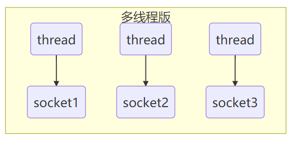
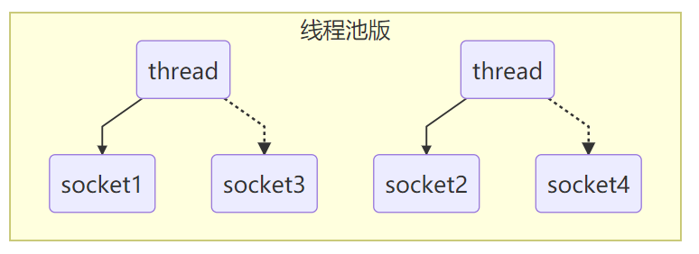
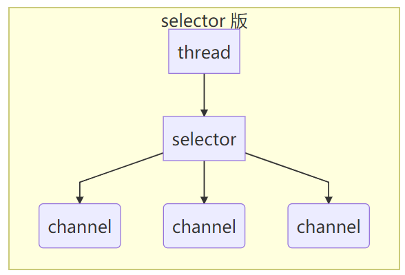

# Java NIO概述

> 本文转载至：[Java NIO系列教程（一） Java NIO 概述 | 并发编程网 – ifeve.com](http://ifeve.com/overview/)

Java NIO(New IO)是一个可以替代标准Java IO API的IO API（从Java 1.4开始)，Java NIO提供了与标准IO不同的IO工作方式。

**Java NIO: Channels and Buffers（通道和缓冲区）**

标准的IO基于字节流和字符流进行操作的，而NIO是基于通道（Channel）和缓冲区（Buffer）进行操作，数据总是从通道读取到缓冲区中，或者从缓冲区写入到通道中。

**Java NIO: Non-blocking IO（非阻塞IO）**

Java NIO可以让你非阻塞的使用IO，例如：当线程从通道读取数据到缓冲区时，线程还是可以进行其他事情。当数据被写入到缓冲区时，线程可以继续处理它。从缓冲区写入通道也类似。

**Java NIO: Selectors（选择器）**

Java NIO引入了选择器的概念，选择器用于监听多个通道的事件（比如：连接打开，数据到达）。因此，单个的线程可以监听多个数据通道。

Java NIO 由以下几个核心部分组成：

- Channels
- Buffers
- Selectors

虽然Java NIO 中除此之外还有很多类和组件，但在我看来，Channel，Buffer 和 Selector 构成了核心的API。其它组件，如Pipe和FileLock，只不过是与三个核心组件共同使用的工具类。因此，在概述中我将集中在这三个组件上。其它组件会在单独的章节中讲到。

## 一. Channel 和 Buffer

基本上，所有的 IO 在NIO 中都从一个Channel 开始。Channel 有点象流。 数据可以从Channel读到Buffer中，也可以从Buffer 写到Channel中。这里有个图示：

Channel和Buffer有好几种类型。下面是JAVA NIO中的一些主要Channel的实现：

- FileChannel：从文件中读写数据
- DatagramChannel：能通过UDP读写网络中的数据
- SocketChannel：能通过TCP读写网络中的数据
- ServerSocketChannel：可以监听新进来的TCP连接，像Web服务器那样。对每一个新进来的连接都会创建一个SocketChannel

正如你所看到的，这些通道涵盖了UDP 和 TCP 网络IO，以及文件IO。

与这些类一起的有一些有趣的接口，但为简单起见，我尽量在概述中不提到它们。本教程其它章节与它们相关的地方我会进行解释。

以下是Java NIO里关键的Buffer实现：

- ByteBuffer
- CharBuffer
- DoubleBuffer
- FloatBuffer
- IntBuffer
- LongBuffer
- ShortBuffer

这些Buffer覆盖了你能通过IO发送的基本数据类型：byte, short, int, long, float, double 和 char。

Java NIO 还有个 MappedByteBuffer，用于表示内存映射文件， 我也不打算在概述中说明。

## 二. Selector

selector 单从字面意思不好理解，需要结合服务器的设计演化来理解它的用途

### 2.1 多线程版设计

**缺点**

* 内存占用高
* 线程上下文切换成本高
* 只适合连接数少的场景

### 2.2 线程池版设计

**缺点**

* 阻塞模式下，线程仅能处理一个 socket 连接
* 仅适合短连接场景

### 2.3 selector 版设计

selector 的作用就是配合一个线程来管理多个 channel，获取这些 channel 上发生的事件，这些 channel 工作在非阻塞模式下，不会让线程吊死在一个 channel 上。**适合连接数特别多，但流量低的场景**（low traffic）

调用 selector 的 select() 会阻塞直到 channel 发生了读写就绪事件，这些事件发生，select 方法就会返回这些事件交给 thread 来处理

