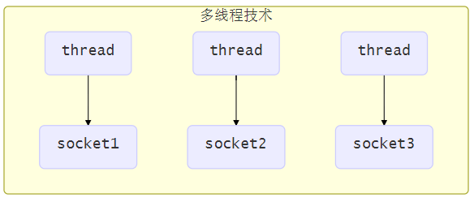
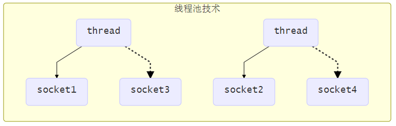
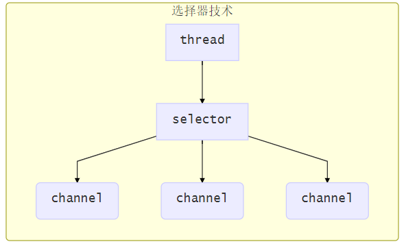

# ByteBuffer

Java NIO系统的**核心**在于：**通道(Channel)和缓冲区(Buffer)**。通道表示打开到 IO 设备(例如：文件、套接字)的连接。若需要使用 NIO 系统，需要获取用于**连接 IO 设备的通道**以及用于**容纳数据的缓冲区**。然后操作缓冲区，对数据进行处理

简而言之，**通道负责传输，缓冲区负责存储**

**常见的Channel有以下四种**，其中FileChannel主要用于文件传输，其余三种用于网络通信

- FileChannel
- DatagramChannel
- SocketChannel
- ServerSocketChannel

**Buffer有以下几种**，其中使用较多的是ByteBuffer

- ByteBuffer
  - MappedByteBuffer
  - DirectByteBuffer
  - HeapByteBuffer
- ShortBuffer
- IntBuffer
- LongBuffer
- FloatBuffer
- DoubleBuffer
- CharBuffer


## 一. Selector

在使用Selector之前，处理socket连接还有以下两种方法

**使用多线程技术**

为每个连接分别开辟一个线程，分别去处理对应的socke连接



这种方法存在以下几个问题

- 内存占用高
  - 每个线程都需要占用一定的内存，当连接较多时，会开辟大量线程，导致占用大量内存
- 线程上下文切换成本高
- 只适合连接数少的场景
  - 连接数过多，会导致创建很多线程，从而出现问题

**使用线程池技术**

使用线程池，让线程池中的线程去处理连接



这种方法存在以下几个问题

- 阻塞模式下，线程仅能处理一个连接
  - 线程池中的线程获取任务（task）后，**只有当其执行完任务之后（断开连接后），才会去获取并执行下一个任务**
  - 若socke连接一直未断开，则其对应的线程无法处理其他socke连接
- 仅适合**短连接**场景
  - 短连接即建立连接发送请求并响应后就立即断开，使得线程池中的线程可以快速处理其他连接

**使用选择器**

**selector 的作用就是配合一个线程来管理多个 channel（fileChannel因为是阻塞式的，所以无法使用selector）**，获取这些 channel 上发生的**事件**，这些 channel 工作在**非阻塞模式**下，当一个channel中没有执行任务时，可以去执行其他channel中的任务。**适合连接数多，但流量较少的场景**



若事件未就绪，调用 selector 的 select() 方法会阻塞线程，直到 channel 发生了就绪事件。这些事件就绪后，select 方法就会返回这些事件交给 thread 来处理

## 二. ByteBuffer

### 2.1 使用案例

**使用方式**

- 向 buffer 写入数据，例如调用 channel.read(buffer)
- 调用 flip() 切换至**读模式**
  - **flip会使得buffer中的limit变为position，position变为0**
- 从 buffer 读取数据，例如调用 buffer.get()
- 调用 clear() 或者compact()切换至**写模式**
  - 调用clear()方法时**position=0，limit变为capacity**
  - 调用compact()方法时，**会将缓冲区中的未读数据压缩到缓冲区前面**
- 重复以上步骤

**使用ByteBuffer读取文件中的内容**

```java
public class TestByteBuffer {
    public static void main(String[] args) {
        // 获得FileChannel
        try (FileChannel channel = new FileInputStream("a.txt").getChannel()) {
            // 获得缓冲区
            ByteBuffer buffer = ByteBuffer.allocate(10);
            int hasNext = 0;
            StringBuilder builder = new StringBuilder();
            while((hasNext = channel.read(buffer)) > 0) {
                // 切换模式 limit=position, position=0
                buffer.flip();
                // 当buffer中还有数据时，获取其中的数据
                while(buffer.hasRemaining()) {
                    builder.append((char)buffer.get());
                }
                // 切换模式 position=0, limit=capacity
                buffer.clear();
            }
            System.out.println(builder.toString());
        } catch (IOException e) {
        }
    }
}
```

打印结果

```
0123456789abcdef
```

### 2.2 核心属性

字节缓冲区的父类Buffer中有几个核心属性，如下：

```java
// Invariants: mark <= position <= limit <= capacity
private int mark = -1;
private int position = 0;
private int limit;
private int capacity;
```

- **capacity**：缓冲区的容量。通过构造函数赋予，一旦设置，无法更改
- **limit**：缓冲区的界限。位于limit 后的数据不可读写。缓冲区的限制不能为负，并且**不能大于其容量**
- **position**：**下一个**读写位置的索引（类似PC）。缓冲区的位置不能为负，并且**不能大于limit**
- **mark**：记录当前position的值。**position被改变后，可以通过调用reset() 方法恢复到mark的位置。**

以上四个属性必须满足以下要求

**mark <= position <= limit <= capacity**

### 2.3 核心方法

#### 2.3.1 put()方法

- put()方法可以将一个数据放入到缓冲区中。
- 进行该操作后，postition的值会+1，指向下一个可以放入的位置。capacity = limit ，为缓冲区容量的值。


#### 2.3.2 flip()方法

- flip()方法会**切换对缓冲区的操作模式**，由写->读 / 读->写
- 进行该操作后
  - 如果是写模式->读模式，position = 0 ， limit 指向最后一个元素的下一个位置，capacity不变
  - 如果是读->写，则恢复为put()方法中的值


#### 2.3.3 get()方法

- get()方法会读取缓冲区中的一个值
- 进行该操作后，position会+1，如果超过了limit则会抛出异常
- **注意：get(i)方法不会改变position的值**


#### 2.3.4 rewind()方法

- 该方法**只能在读模式下使用**
- rewind()方法后，会恢复position、limit和capacity的值，变为进行get()前的值


rewind() 源码：

```java
public final Buffer rewind() {
    position = 0;
    mark = -1;
    return this;
}
```

#### 2.3.5 clean()方法

- clean()方法会将缓冲区中的各个属性恢复为最初的状态，position = 0, capacity = limit
- **此时缓冲区的数据依然存在**，处于“被遗忘”状态，下次进行写操作时会覆盖这些数据


#### 2.3.6 mark()和reset()方法

- mark()方法会将postion的值保存到mark属性中
- reset()方法会将position的值改为mark中保存的值


#### 2.3.7 compact()方法

> 此方法为ByteBuffer的方法，而不是Buffer的方法

- compact会把未读完的数据向前压缩，然后切换到写模式
- 数据前移后，原位置的值并未清零，写时会**覆盖**之前的值


#### 2.3.8 clear() VS compact()

clear只是对position、limit、mark进行重置，而compact在对position进行设置，以及limit、mark进行重置的同时，还涉及到数据在内存中拷贝（会调用arraycopy）。**所以compact比clear更耗性能。**但compact能保存你未读取的数据，将新数据追加到为读取的数据之后；而clear则不行，若你调用了clear，则未读取的数据就无法再读取到了。所以需要根据情况来判断使用哪种方法进行模式切换。

### 2.4 方法调用及演示

#### 2.4.1 ByteBuffer调试工具类

导入netty依赖：

```xml
<dependency>
  <groupId>io.netty</groupId>
  <artifactId>netty-all</artifactId>
  <version>4.1.51.Final</version>
</dependency>
```

测试代码：

```java
import java.nio.ByteBuffer;

import io.netty.util.internal.MathUtil;
import io.netty.util.internal.StringUtil;
import io.netty.util.internal.MathUtil.*;


/**
 * @author Panwen Chen
 * @date 2021/4/12 15:59
 */
public class ByteBufferUtil {
    private static final char[] BYTE2CHAR = new char[256];
    private static final char[] HEXDUMP_TABLE = new char[256 * 4];
    private static final String[] HEXPADDING = new String[16];
    private static final String[] HEXDUMP_ROWPREFIXES = new String[65536 >>> 4];
    private static final String[] BYTE2HEX = new String[256];
    private static final String[] BYTEPADDING = new String[16];

    static {
        final char[] DIGITS = "0123456789abcdef".toCharArray();
        for (int i = 0; i < 256; i++) {
            HEXDUMP_TABLE[i << 1] = DIGITS[i >>> 4 & 0x0F];
            HEXDUMP_TABLE[(i << 1) + 1] = DIGITS[i & 0x0F];
        }

        int i;

        // Generate the lookup table for hex dump paddings
        for (i = 0; i < HEXPADDING.length; i++) {
            int padding = HEXPADDING.length - i;
            StringBuilder buf = new StringBuilder(padding * 3);
            for (int j = 0; j < padding; j++) {
                buf.append("   ");
            }
            HEXPADDING[i] = buf.toString();
        }

        // Generate the lookup table for the start-offset header in each row (up to 64KiB).
        for (i = 0; i < HEXDUMP_ROWPREFIXES.length; i++) {
            StringBuilder buf = new StringBuilder(12);
            buf.append(StringUtil.NEWLINE);
            buf.append(Long.toHexString(i << 4 & 0xFFFFFFFFL | 0x100000000L));
            buf.setCharAt(buf.length() - 9, '|');
            buf.append('|');
            HEXDUMP_ROWPREFIXES[i] = buf.toString();
        }

        // Generate the lookup table for byte-to-hex-dump conversion
        for (i = 0; i < BYTE2HEX.length; i++) {
            BYTE2HEX[i] = ' ' + StringUtil.byteToHexStringPadded(i);
        }

        // Generate the lookup table for byte dump paddings
        for (i = 0; i < BYTEPADDING.length; i++) {
            int padding = BYTEPADDING.length - i;
            StringBuilder buf = new StringBuilder(padding);
            for (int j = 0; j < padding; j++) {
                buf.append(' ');
            }
            BYTEPADDING[i] = buf.toString();
        }

        // Generate the lookup table for byte-to-char conversion
        for (i = 0; i < BYTE2CHAR.length; i++) {
            if (i <= 0x1f || i >= 0x7f) {
                BYTE2CHAR[i] = '.';
            } else {
                BYTE2CHAR[i] = (char) i;
            }
        }
    }

    /**
     * 打印所有内容
     * @param buffer
     */
    public static void debugAll(ByteBuffer buffer) {
        int oldlimit = buffer.limit();
        buffer.limit(buffer.capacity());
        StringBuilder origin = new StringBuilder(256);
        appendPrettyHexDump(origin, buffer, 0, buffer.capacity());
        System.out.println("+--------+-------------------- all ------------------------+----------------+");
        System.out.printf("position: [%d], limit: [%d]\n", buffer.position(), oldlimit);
        System.out.println(origin);
        buffer.limit(oldlimit);
    }

    /**
     * 打印可读取内容
     * @param buffer
     */
    public static void debugRead(ByteBuffer buffer) {
        StringBuilder builder = new StringBuilder(256);
        appendPrettyHexDump(builder, buffer, buffer.position(), buffer.limit() - buffer.position());
        System.out.println("+--------+-------------------- read -----------------------+----------------+");
        System.out.printf("position: [%d], limit: [%d]\n", buffer.position(), buffer.limit());
        System.out.println(builder);
    }

    private static void appendPrettyHexDump(StringBuilder dump, ByteBuffer buf, int offset, int length) {
        if (MathUtil.isOutOfBounds(offset, length, buf.capacity())) {
            throw new IndexOutOfBoundsException(
                    "expected: " + "0 <= offset(" + offset + ") <= offset + length(" + length
                            + ") <= " + "buf.capacity(" + buf.capacity() + ')');
        }
        if (length == 0) {
            return;
        }
        dump.append(
                "         +-------------------------------------------------+" +
                        StringUtil.NEWLINE + "         |  0  1  2  3  4  5  6  7  8  9  a  b  c  d  e  f |" +
                        StringUtil.NEWLINE + "+--------+-------------------------------------------------+----------------+");

        final int startIndex = offset;
        final int fullRows = length >>> 4;
        final int remainder = length & 0xF;

        // Dump the rows which have 16 bytes.
        for (int row = 0; row < fullRows; row++) {
            int rowStartIndex = (row << 4) + startIndex;

            // Per-row prefix.
            appendHexDumpRowPrefix(dump, row, rowStartIndex);

            // Hex dump
            int rowEndIndex = rowStartIndex + 16;
            for (int j = rowStartIndex; j < rowEndIndex; j++) {
                dump.append(BYTE2HEX[getUnsignedByte(buf, j)]);
            }
            dump.append(" |");

            // ASCII dump
            for (int j = rowStartIndex; j < rowEndIndex; j++) {
                dump.append(BYTE2CHAR[getUnsignedByte(buf, j)]);
            }
            dump.append('|');
        }

        // Dump the last row which has less than 16 bytes.
        if (remainder != 0) {
            int rowStartIndex = (fullRows << 4) + startIndex;
            appendHexDumpRowPrefix(dump, fullRows, rowStartIndex);

            // Hex dump
            int rowEndIndex = rowStartIndex + remainder;
            for (int j = rowStartIndex; j < rowEndIndex; j++) {
                dump.append(BYTE2HEX[getUnsignedByte(buf, j)]);
            }
            dump.append(HEXPADDING[remainder]);
            dump.append(" |");

            // Ascii dump
            for (int j = rowStartIndex; j < rowEndIndex; j++) {
                dump.append(BYTE2CHAR[getUnsignedByte(buf, j)]);
            }
            dump.append(BYTEPADDING[remainder]);
            dump.append('|');
        }

        dump.append(StringUtil.NEWLINE +
                "+--------+-------------------------------------------------+----------------+");
    }

    private static void appendHexDumpRowPrefix(StringBuilder dump, int row, int rowStartIndex) {
        if (row < HEXDUMP_ROWPREFIXES.length) {
            dump.append(HEXDUMP_ROWPREFIXES[row]);
        } else {
            dump.append(StringUtil.NEWLINE);
            dump.append(Long.toHexString(rowStartIndex & 0xFFFFFFFFL | 0x100000000L));
            dump.setCharAt(dump.length() - 9, '|');
            dump.append('|');
        }
    }

    public static short getUnsignedByte(ByteBuffer buffer, int index) {
        return (short) (buffer.get(index) & 0xFF);
    }
}
```

#### 2.4.2 调用ByteBuffer的方法

```java
public class TestByteBuffer {
    public static void main(String[] args) {
        ByteBuffer buffer = ByteBuffer.allocate(10);
        // 向buffer中写入1个字节的数据
        buffer.put((byte)97);
        // 使用工具类，查看buffer状态
        ByteBufferUtil.debugAll(buffer);

        // 向buffer中写入4个字节的数据
        buffer.put(new byte[]{98, 99, 100, 101});
        ByteBufferUtil.debugAll(buffer);

        // 获取数据
        buffer.flip();
        ByteBufferUtil.debugAll(buffer);
        System.out.println(buffer.get());
        System.out.println(buffer.get());
        ByteBufferUtil.debugAll(buffer);

        // 使用compact切换模式
        buffer.compact();
        ByteBufferUtil.debugAll(buffer);

        // 再次写入
        buffer.put((byte)102);
        buffer.put((byte)103);
        ByteBufferUtil.debugAll(buffer);
    }
}
```

运行结果：

```java
// 向缓冲区写入了一个字节的数据，此时postition为1
+--------+-------------------- all ------------------------+----------------+
position: [1], limit: [10]
         +-------------------------------------------------+
         |  0  1  2  3  4  5  6  7  8  9  a  b  c  d  e  f |
+--------+-------------------------------------------------+----------------+
|00000000| 61 00 00 00 00 00 00 00 00 00                   |a.........      |
+--------+-------------------------------------------------+----------------+

// 向缓冲区写入四个字节的数据，此时position为5
+--------+-------------------- all ------------------------+----------------+
position: [5], limit: [10]
         +-------------------------------------------------+
         |  0  1  2  3  4  5  6  7  8  9  a  b  c  d  e  f |
+--------+-------------------------------------------------+----------------+
|00000000| 61 62 63 64 65 00 00 00 00 00                   |abcde.....      |
+--------+-------------------------------------------------+----------------+

// 调用flip切换模式，此时position为0，表示从第0个数据开始读取
+--------+-------------------- all ------------------------+----------------+
position: [0], limit: [5]
         +-------------------------------------------------+
         |  0  1  2  3  4  5  6  7  8  9  a  b  c  d  e  f |
+--------+-------------------------------------------------+----------------+
|00000000| 61 62 63 64 65 00 00 00 00 00                   |abcde.....      |
+--------+-------------------------------------------------+----------------+
// 读取两个字节的数据             
97
98
            
// position变为2             
+--------+-------------------- all ------------------------+----------------+
position: [2], limit: [5]
         +-------------------------------------------------+
         |  0  1  2  3  4  5  6  7  8  9  a  b  c  d  e  f |
+--------+-------------------------------------------------+----------------+
|00000000| 61 62 63 64 65 00 00 00 00 00                   |abcde.....      |
+--------+-------------------------------------------------+----------------+
             
// 调用compact切换模式，此时position及其后面的数据被压缩到ByteBuffer前面去了
// 此时position为3，会覆盖之前的数据             
+--------+-------------------- all ------------------------+----------------+
position: [3], limit: [10]
         +-------------------------------------------------+
         |  0  1  2  3  4  5  6  7  8  9  a  b  c  d  e  f |
+--------+-------------------------------------------------+----------------+
|00000000| 63 64 65 64 65 00 00 00 00 00                   |cdede.....      |
+--------+-------------------------------------------------+----------------+
             
// 再次写入两个字节的数据，之前的 0x64 0x65 被覆盖         
+--------+-------------------- all ------------------------+----------------+
position: [5], limit: [10]
         +-------------------------------------------------+
         |  0  1  2  3  4  5  6  7  8  9  a  b  c  d  e  f |
+--------+-------------------------------------------------+----------------+
|00000000| 63 64 65 66 67 00 00 00 00 00                   |cdefg.....      |
+--------+-------------------------------------------------+----------------+
```

### 2.5 字符串与ByteBuffer的相互转换

#### 方法一

**编码**：字符串调用getByte方法获得byte数组，将byte数组放入ByteBuffer中

**解码**：**先调用ByteBuffer的flip方法，然后通过StandardCharsets的decoder方法解码**

```java
public class Translate {
    public static void main(String[] args) {
        // 准备两个字符串
        String str1 = "hello";
        String str2 = "";


        ByteBuffer buffer1 = ByteBuffer.allocate(16);
        // 通过字符串的getByte方法获得字节数组，放入缓冲区中
        buffer1.put(str1.getBytes());
        ByteBufferUtil.debugAll(buffer1);

        // 将缓冲区中的数据转化为字符串
        // 切换模式
        buffer1.flip();
        
        // 通过StandardCharsets解码，获得CharBuffer，再通过toString获得字符串
        str2 = StandardCharsets.UTF_8.decode(buffer1).toString();
        System.out.println(str2);
        ByteBufferUtil.debugAll(buffer1);
    }
}
```

运行结果:

```txt
+--------+-------------------- all ------------------------+----------------+
position: [5], limit: [16]
         +-------------------------------------------------+
         |  0  1  2  3  4  5  6  7  8  9  a  b  c  d  e  f |
+--------+-------------------------------------------------+----------------+
|00000000| 68 65 6c 6c 6f 00 00 00 00 00 00 00 00 00 00 00 |hello...........|
+--------+-------------------------------------------------+----------------+
hello
+--------+-------------------- all ------------------------+----------------+
position: [5], limit: [5]
         +-------------------------------------------------+
         |  0  1  2  3  4  5  6  7  8  9  a  b  c  d  e  f |
+--------+-------------------------------------------------+----------------+
|00000000| 68 65 6c 6c 6f 00 00 00 00 00 00 00 00 00 00 00 |hello...........|
+--------+-------------------------------------------------+----------------+
```

#### 方法二

**编码**：通过StandardCharsets的encode方法获得ByteBuffer，此时获得的ByteBuffer为读模式，无需通过flip切换模式

**解码**：通过StandardCharsets的decoder方法解码

```java
public class Translate {
    public static void main(String[] args) {
        // 准备两个字符串
        String str1 = "hello";
        String str2 = "";

        // 通过StandardCharsets的encode方法获得ByteBuffer
        // 此时获得的ByteBuffer为读模式，无需通过flip切换模式
        ByteBuffer buffer1 = StandardCharsets.UTF_8.encode(str1);
        ByteBufferUtil.debugAll(buffer1);

        // 将缓冲区中的数据转化为字符串
        // 通过StandardCharsets解码，获得CharBuffer，再通过toString获得字符串
        str2 = StandardCharsets.UTF_8.decode(buffer1).toString();
        System.out.println(str2);
        ByteBufferUtil.debugAll(buffer1);
    }
}
```

运行结果

```
+--------+-------------------- all ------------------------+----------------+
position: [0], limit: [5]
         +-------------------------------------------------+
         |  0  1  2  3  4  5  6  7  8  9  a  b  c  d  e  f |
+--------+-------------------------------------------------+----------------+
|00000000| 68 65 6c 6c 6f                                  |hello           |
+--------+-------------------------------------------------+----------------+
hello
+--------+-------------------- all ------------------------+----------------+
position: [5], limit: [5]
         +-------------------------------------------------+
         |  0  1  2  3  4  5  6  7  8  9  a  b  c  d  e  f |
+--------+-------------------------------------------------+----------------+
|00000000| 68 65 6c 6c 6f                                  |hello           |
+--------+-------------------------------------------------+----------------+
```

#### **方法三**

**编码**：字符串调用getByte()方法获得字节数组，将字节数组传给**ByteBuffer的wrap()方法**，通过该方法获得ByteBuffer。**同样无需调用flip方法切换为读模式**

**解码**：通过StandardCharsets的decoder方法解码

```java
public class Translate {
    public static void main(String[] args) {
        // 准备两个字符串
        String str1 = "hello";
        String str2 = "";

        // 通过StandardCharsets的encode方法获得ByteBuffer
        // 此时获得的ByteBuffer为读模式，无需通过flip切换模式
        ByteBuffer buffer1 = ByteBuffer.wrap(str1.getBytes());
        ByteBufferUtil.debugAll(buffer1);

        // 将缓冲区中的数据转化为字符串
        // 通过StandardCharsets解码，获得CharBuffer，再通过toString获得字符串
        str2 = StandardCharsets.UTF_8.decode(buffer1).toString();
        System.out.println(str2);
        ByteBufferUtil.debugAll(buffer1);
    }
}
```

运行结果

```txt
+--------+-------------------- all ------------------------+----------------+
position: [0], limit: [5]
         +-------------------------------------------------+
         |  0  1  2  3  4  5  6  7  8  9  a  b  c  d  e  f |
+--------+-------------------------------------------------+----------------+
|00000000| 68 65 6c 6c 6f                                  |hello           |
+--------+-------------------------------------------------+----------------+
hello
+--------+-------------------- all ------------------------+----------------+
position: [5], limit: [5]
         +-------------------------------------------------+
         |  0  1  2  3  4  5  6  7  8  9  a  b  c  d  e  f |
+--------+-------------------------------------------------+----------------+
|00000000| 68 65 6c 6c 6f                                  |hello           |
+--------+-------------------------------------------------+----------------+
```

### 2.6 粘包和半包

#### 2.6.1 现象

网络上有多条数据发送给服务端，数据之间使用 \n 进行分隔
但由于某种原因这些数据在接收时，被进行了重新组合，例如原始数据有3条为

- Hello,world\n
- I’m Nyima\n
- How are you?\n

变成了下面的两个 byteBuffer (粘包，半包)

- Hello,world\nI’m Nyima\nHo
- w are you?\n

#### 2.6.2 出现原因

**粘包**

发送方在发送数据时，并不是一条一条地发送数据，而是**将数据整合在一起**，当数据达到一定的数量后再一起发送。这就会导致多条信息被放在一个缓冲区中被一起发送出去

**半包**

接收方的缓冲区的大小是有限的，当接收方的缓冲区满了以后，就需要**将信息截断**，等缓冲区空了以后再继续放入数据。这就会发生一段完整的数据最后被截断的现象

#### 2.6.3 解决办法

- 通过get(index)方法遍历ByteBuffer，遇到分隔符时进行处理。注意：get(index)不会改变position的值
  - 记录该段数据长度，以便于申请对应大小的缓冲区
  - 将缓冲区的数据通过get()方法写入到target中
- 调用**compact方法**切换模式，因为缓冲区中可能还有未读的数据

```java
public class ByteBufferDemo {
    public static void main(String[] args) {
        ByteBuffer buffer = ByteBuffer.allocate(32);
        // 模拟粘包+半包
        buffer.put("Hello,world\nI'm Nyima\nHo".getBytes());
        // 调用split函数处理
        split(buffer);
        buffer.put("w are you?\n".getBytes());
        split(buffer);
    }

    private static void split(ByteBuffer buffer) {
        // 切换为读模式
        buffer.flip();
        for(int i = 0; i < buffer.limit(); i++) {

            // 遍历寻找分隔符
            // get(i)不会移动position
            if (buffer.get(i) == '\n') {
                // 缓冲区长度
                int length = i+1-buffer.position();
                ByteBuffer target = ByteBuffer.allocate(length);
                // 将前面的内容写入target缓冲区
                for(int j = 0; j < length; j++) {
                    // 将buffer中的数据写入target中
                    target.put(buffer.get());
                }
                // 打印查看结果
                ByteBufferUtil.debugAll(target);
            }
        }
        // 切换为写模式，但是缓冲区可能未读完，这里需要使用compact
        buffer.compact();
    }
}
```

运行结果：

```
+--------+-------------------- all ------------------------+----------------+
position: [12], limit: [12]
         +-------------------------------------------------+
         |  0  1  2  3  4  5  6  7  8  9  a  b  c  d  e  f |
+--------+-------------------------------------------------+----------------+
|00000000| 48 65 6c 6c 6f 2c 77 6f 72 6c 64 0a             |Hello,world.    |
+--------+-------------------------------------------------+----------------+
+--------+-------------------- all ------------------------+----------------+
position: [10], limit: [10]
         +-------------------------------------------------+
         |  0  1  2  3  4  5  6  7  8  9  a  b  c  d  e  f |
+--------+-------------------------------------------------+----------------+
|00000000| 49 27 6d 20 4e 79 69 6d 61 0a                   |I'm Nyima.      |
+--------+-------------------------------------------------+----------------+
+--------+-------------------- all ------------------------+----------------+
position: [13], limit: [13]
         +-------------------------------------------------+
         |  0  1  2  3  4  5  6  7  8  9  a  b  c  d  e  f |
+--------+-------------------------------------------------+----------------+
|00000000| 48 6f 77 20 61 72 65 20 79 6f 75 3f 0a          |How are you?.   |
+--------+-------------------------------------------------+----------------+
```


> 本文转载至：[Netty学习之NIO基础 - Nyima's Blog (gitee.io)](https://nyimac.gitee.io/2021/04/18/Netty学习之NIO基础/#三、网络编程)
