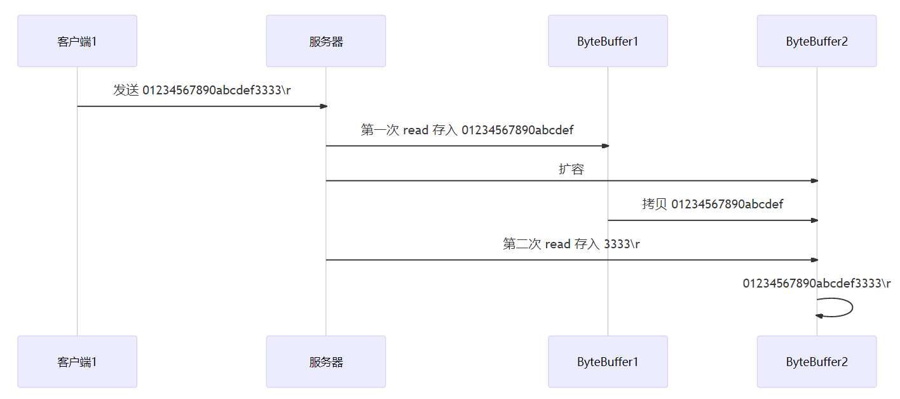
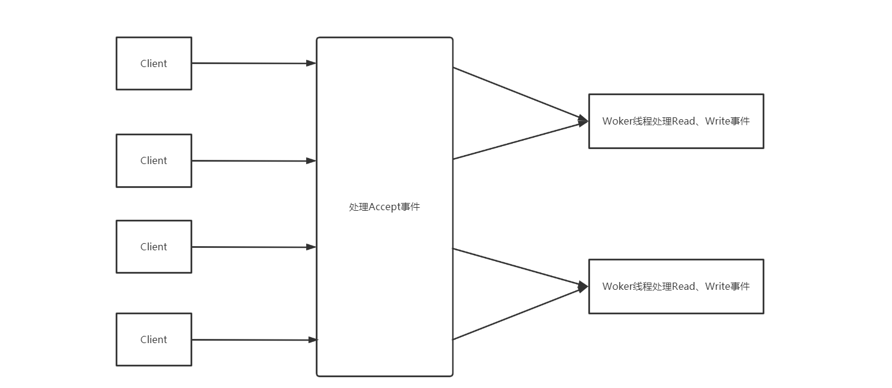

# 网络编程

## 一. 阻塞模式与非阻塞模式

### 1.1 阻塞模式

* 阻塞模式下，相关方法都会导致线程暂停
  * ServerSocketChannel.accept 会在没有连接建立时让线程暂停
  * SocketChannel.read 会在没有数据可读时让线程暂停
  * 阻塞的表现其实就是线程暂停了，暂停期间不会占用 cpu，但线程相当于闲置
* 单线程下，阻塞方法之间相互影响，几乎不能正常工作，需要多线程支持
* 但多线程下，有新的问题，体现在以下方面
  * 32 位 jvm 一个线程 320k，64 位 jvm 一个线程 1024k，如果连接数过多，必然导致 OOM，并且线程太多，反而会因为频繁上下文切换导致性能降低
  * 可以采用线程池技术来减少线程数和线程上下文切换，但治标不治本，如果有很多连接建立，但长时间 inactive，会阻塞线程池中所有线程，因此不适合长连接，只适合短连接

服务器代码：

```java
public class Server {
    public static void main(String[] args) {
        // 创建缓冲区
        ByteBuffer buffer = ByteBuffer.allocate(16);
        // 获得服务器通道
        try(ServerSocketChannel server = ServerSocketChannel.open()) {
            // 为服务器通道绑定端口
            server.bind(new InetSocketAddress(8080));
            // 用户存放连接的集合
            ArrayList<SocketChannel> channels = new ArrayList<>();
            // 循环接收连接
            while (true) {
                System.out.println("before connecting...");
                // 没有连接时，会阻塞线程
                SocketChannel socketChannel = server.accept();
                System.out.println("after connecting...");
                channels.add(socketChannel);
                // 循环遍历集合中的连接
                for(SocketChannel channel : channels) {
                    System.out.println("before reading");
                    // 处理通道中的数据
                    // 当通道中没有数据可读时，会阻塞线程
                    channel.read(buffer);
                    buffer.flip();
                    ByteBufferUtil.debugRead(buffer);
                    buffer.clear();
                    System.out.println("after reading");
                }
            }
        } catch (IOException e) {
            e.printStackTrace();
        }
    }
}
```

客户端代码：

```java
public class Client {
    public static void main(String[] args) {
        try (SocketChannel socketChannel = SocketChannel.open()) {
            // 建立连接
            socketChannel.connect(new InetSocketAddress("localhost", 8080));
            System.out.println("waiting...");
        } catch (IOException e) {
            e.printStackTrace();
        }
    }
}
```

运行结果

- 客户端-服务器建立连接前：服务器端因accept阻塞


- 客户端-服务器建立连接后，客户端发送消息前：服务器端因通道为空被阻塞


- 客户端发送数据后，服务器处理通道中的数据。再次进入循环时，再次被accept阻塞


- 之前的客户端再次发送消息**，服务器端因为被accept阻塞**，无法处理之前客户端发送到通道中的信息


### 1.2 非阻塞模式

* 非阻塞模式下，相关方法都会不会让线程暂停
  * 在 ServerSocketChannel.accept 在没有连接建立时，会返回 null，继续运行
  * SocketChannel.read 在没有数据可读时，会返回 0，但线程不必阻塞，可以去执行其它 SocketChannel 的 read 或是去执行 ServerSocketChannel.accept 
  * 写数据时，线程只是等待数据写入 Channel 即可，无需等 Channel 通过网络把数据发送出去
* 但非阻塞模式下，即使没有连接建立，和可读数据，线程仍然在不断运行，白白浪费了CPU
* 数据复制过程中，线程实际还是阻塞的（AIO 改进的地方）

```java
public class Server {
    public static void main(String[] args) {
        // 创建缓冲区
        ByteBuffer buffer = ByteBuffer.allocate(16);
        // 获得服务器通道
        try(ServerSocketChannel server = ServerSocketChannel.open()) {
            // 为服务器通道绑定端口
            server.bind(new InetSocketAddress(8080));
            // 用户存放连接的集合
            ArrayList<SocketChannel> channels = new ArrayList<>();
            // 循环接收连接
            while (true) {
                // 设置为非阻塞模式，没有连接时返回null，不会阻塞线程
                server.configureBlocking(false);
                SocketChannel socketChannel = server.accept();
                // 通道不为空时才将连接放入到集合中
                if (socketChannel != null) {
                    System.out.println("after connecting...");
                    channels.add(socketChannel);
                }
                // 循环遍历集合中的连接
                for(SocketChannel channel : channels) {
                    // 处理通道中的数据
                    // 设置为非阻塞模式，若通道中没有数据，会返回0，不会阻塞线程
                    channel.configureBlocking(false);
                    int read = channel.read(buffer);
                    if(read > 0) {
                        buffer.flip();
                        ByteBufferUtil.debugRead(buffer);
                        buffer.clear();
                        System.out.println("after reading");
                    }
                }
            }
        } catch (IOException e) {
            e.printStackTrace();
        }
    }
}
```

这样写存在一个问题，因为设置为了非阻塞，会一直执行while(true)中的代码，CPU一直处于忙碌状态，会使得性能变低，所以实际情况中不使用这种方法处理请求

## 二. 多路复用

单线程可以配合 Selector 完成对多个 Channel 可读写事件的监控，这称之为多路复用

* **多路复用仅针对网络 IO**，普通文件 IO 没法利用多路复用
* 如果不用 Selector 的非阻塞模式，线程大部分时间都在做无用功，而 Selector 能够保证
  * 有可连接事件时才去连接
  * 有可读事件才去读取
  * 有可写事件才去写入
    * 限于网络传输能力，Channel 未必时时可写，一旦 Channel 可写，会触发 Selector 的可写事件

## 三. Selector


好处

* 一个线程配合 selector 就可以监控多个 channel 的事件，事件发生线程才去处理。避免非阻塞模式下所做无用功
* 让这个线程能够被充分利用
* 节约了线程的数量
* 减少了线程上下文切换

### 3.1 创建

```java
Selector selector = Selector.open();
```

### 3.2 Channel绑定Selector

只有将Channel与Selector绑定，Selector才能监控Channel的事件

```java
channel.configureBlocking(false);
SelectionKey key = channel.register(selector, SelectKey.OP_READ);
```

* **channel 必须工作在非阻塞模式**
* FileChannel 没有非阻塞模式，因此不能配合 selector 一起使用
* 绑定的事件类型可以有
  * connect - 客户端连接成功时触发（`SelectKey.OP_CONNECT`）
  * accept - 服务器端成功接受连接时触发（`SelectKey.OP_ACCEPT`）
  * read - 数据可读入时触发，有因为接收能力弱，数据暂不能读入的情况（`SelectKey.OP_READ`）
  * write - 数据可写出时触发，有因为发送能力弱，数据暂不能写出的情况（`SelectKey.OP_WRITE`）

### 3.3 监听Channel事件

可以通过下面三种方法来监听是否有事件发生，方法的返回值代表有多少 channel 发生了事件

- 方法1：阻塞直到绑定事件发生

```java
int count = selector.select();
```

- 方法2：阻塞直到绑定事件发生，或是超时（时间单位为 ms）

```java
int count = selector.select(long timeout);
```

- 方法3：不会阻塞，也就是不管有没有事件，立刻返回，自己根据返回值检查是否有事件

```java
int count = selector.selectNow();
```

**💡 select 何时不阻塞**

 * 事件发生时
   * 客户端发起连接请求，会触发 accept 事件
   * 客户端发送数据过来，客户端正常、异常关闭时，都会触发 read 事件，另外如果发送的数据大于 buffer 缓冲区，会触发多次读取事件
   * channel 可写，会触发 write 事件
   * 在 linux 下 nio bug 发生时
 * 调用 selector.wakeup()
 * 调用 selector.close()
 * selector 所在线程 interrupt

### 3.4 处理accept事件

客户端代码为

```java
public class Client {
    public static void main(String[] args) {
        try (Socket socket = new Socket("localhost", 8080)) {
            System.out.println(socket);
            socket.getOutputStream().write("world".getBytes());
            System.in.read();
        } catch (IOException e) {
            e.printStackTrace();
        }
    }
}
```

服务器端代码为

```java
@Slf4j
public class ChannelDemo6 {
    public static void main(String[] args) {
        try (ServerSocketChannel channel = ServerSocketChannel.open()) {
            channel.bind(new InetSocketAddress(8080));
            System.out.println(channel);
            Selector selector = Selector.open();
            channel.configureBlocking(false);
            channel.register(selector, SelectionKey.OP_ACCEPT);

            while (true) {
                int count = selector.select();
                log.debug("select count: {}", count);

                // 获取所有事件
                Set<SelectionKey> keys = selector.selectedKeys();

                // 遍历所有事件，逐一处理
                Iterator<SelectionKey> iter = keys.iterator();
                while (iter.hasNext()) {
                    SelectionKey key = iter.next();
                    // 判断事件类型
                    if (key.isAcceptable()) {
                        ServerSocketChannel c = (ServerSocketChannel) key.channel();
                        // 必须处理
                        SocketChannel sc = c.accept();
                        log.debug("{}", sc);
                    }
                    // 处理完毕，必须将事件移除。如果不移除则会继续待在selectedKeys中，如果下次其它事件发生，在调用selector.selectedKeys()时，又会获取到当前SelectKey
                    iter.remove();
                }
            }
        } catch (IOException e) {
            e.printStackTrace();
        }
    }
}
```

**💡 事件发生后能否不处理**

事件发生后，要么处理，要么取消（cancel），不能什么都不做，否则下次该事件仍会触发，这是因为 NIO 底层使用的是水平触发。cancel操作相当于反注册，就是将当前SelectKey从Selector注册列表中移除，Selector从此以后不会在监听这个SelectKey对应的Channel的事件了。

### 3.5 处理read事件

```java
@Slf4j
public class ChannelDemo6 {
    public static void main(String[] args) {
        try (ServerSocketChannel channel = ServerSocketChannel.open()) {
            channel.bind(new InetSocketAddress(8080));
            System.out.println(channel);
            Selector selector = Selector.open();
            channel.configureBlocking(false);
            channel.register(selector, SelectionKey.OP_ACCEPT);

            while (true) {
                int count = selector.select();
                log.debug("select count: {}", count);

                // 获取所有事件
                Set<SelectionKey> keys = selector.selectedKeys();

                // 遍历所有事件，逐一处理
                Iterator<SelectionKey> iter = keys.iterator();
                while (iter.hasNext()) {
                    SelectionKey key = iter.next();
                    // 判断事件类型
                    if (key.isAcceptable()) {
                        ServerSocketChannel c = (ServerSocketChannel) key.channel();
                        // 必须处理
                        SocketChannel sc = c.accept();
                        sc.configureBlocking(false);
                        sc.register(selector, SelectionKey.OP_READ);
                        log.debug("连接已建立: {}", sc);
                    } else if (key.isReadable()) {
                        try {
                                SocketChannel sc = (SocketChannel) key.channel();
                                ByteBuffer buffer = ByteBuffer.allocate(128);
                                int read = sc.read(buffer);
                                //如果是正常退出（用户的正常退出操作，也会触发Read事件）
                                if(read == -1) {
                                    key.cancel();
                                    sc.close();
                                } else {
                                    buffer.flip();
                                    debug(buffer);
                                }
                            } catch (IOException e) {
                                //处理非正常退出
                                log.info("客户端非正常退出->{}", this.name);
                                selectionKey.cancel();
                                try {
                                    channel.close();
                                } catch (IOException ioException) {
                                    ioException.printStackTrace();
                                }
                        	}
                    }
                    // 处理完毕，必须将事件移除
                    iter.remove();
                }
            }
        } catch (IOException e) {
            e.printStackTrace();
        }
    }
}
```

开启两个客户端，修改一下发送文字，输出：

```txt
sun.nio.ch.ServerSocketChannelImpl[/0:0:0:0:0:0:0:0:8080]
21:16:39 [DEBUG] [main] c.i.n.ChannelDemo6 - select count: 1
21:16:39 [DEBUG] [main] c.i.n.ChannelDemo6 - 连接已建立: java.nio.channels.SocketChannel[connected local=/127.0.0.1:8080 remote=/127.0.0.1:60367]
21:16:39 [DEBUG] [main] c.i.n.ChannelDemo6 - select count: 1
         +-------------------------------------------------+
         |  0  1  2  3  4  5  6  7  8  9  a  b  c  d  e  f |
+--------+-------------------------------------------------+----------------+
|00000000| 68 65 6c 6c 6f                                  |hello           |
+--------+-------------------------------------------------+----------------+
21:16:59 [DEBUG] [main] c.i.n.ChannelDemo6 - select count: 1
21:16:59 [DEBUG] [main] c.i.n.ChannelDemo6 - 连接已建立: java.nio.channels.SocketChannel[connected local=/127.0.0.1:8080 remote=/127.0.0.1:60378]
21:16:59 [DEBUG] [main] c.i.n.ChannelDemo6 - select count: 1
         +-------------------------------------------------+
         |  0  1  2  3  4  5  6  7  8  9  a  b  c  d  e  f |
+--------+-------------------------------------------------+----------------+
|00000000| 77 6f 72 6c 64                                  |world           |
+--------+-------------------------------------------------+----------------+
```

**💡为何要 iter.remove()**

因为 select 在事件发生后，就会将相关的 key 放入 selectedKeys 集合，但不会在处理完后自动从 selectedKeys 集合中移除，需要我们自己删除。例如

 * 第一次触发了 ssckey 上的 accept 事件，没有移除 ssckey 
 * 第二次触发了 sckey 上的 read 事件，但这时 selectedKeys 中还有上次的 ssckey ，在处理时因为没有真正的 serverSocket 连上了，就会导致空指针异常

**💡 cancel 的作用**

can  会再监听事件

#### 3.5.1 处理消息边界


* 一种思路是固定消息长度，数据包大小一样，服务器按预定长度读取，缺点是浪费带宽

* 另一种思路是按分隔符拆分，缺点是效率低

* TLV 格式，即 Type 类型、Length 长度、Value 数据，类型和长度已知的情况下，就可以方便获取消息大小，分配合适的 buffer，缺点是 buffer 需要提前分配，如果内容过大，则影响 server 吞吐量

  * Http 1.1 是 TLV 格式
  * Http 2.0 是 LTV 格式

  

服务器端

```java
private static void split(ByteBuffer source) {
    source.flip();
    for (int i = 0; i < source.limit(); i++) {
        // 找到一条完整消息
        if (source.get(i) == '\n') {
            int length = i + 1 - source.position();
            // 把这条完整消息存入新的 ByteBuffer
            ByteBuffer target = ByteBuffer.allocate(length);
            // 从 source 读，向 target 写
            for (int j = 0; j < length; j++) {
                target.put(source.get());
            }
            debugAll(target);
        }
    }
    source.compact(); // 0123456789abcdef  position 16 limit 16
}

public static void main(String[] args) throws IOException {
    // 1. 创建 selector, 管理多个 channel
    Selector selector = Selector.open();
    ServerSocketChannel ssc = ServerSocketChannel.open();
    ssc.configureBlocking(false);
    // 2. 建立 selector 和 channel 的联系（注册）
    // SelectionKey 就是将来事件发生后，通过它可以知道事件和哪个channel的事件
    SelectionKey sscKey = ssc.register(selector, 0, null);
    // key 只关注 accept 事件
    sscKey.interestOps(SelectionKey.OP_ACCEPT);
    log.debug("sscKey:{}", sscKey);
    ssc.bind(new InetSocketAddress(8080));
    while (true) {
        // 3. select 方法, 没有事件发生，线程阻塞，有事件，线程才会恢复运行
        // select 在事件未处理时，它不会阻塞, 事件发生后要么处理，要么取消，不能置之不理
        selector.select();
        // 4. 处理事件, selectedKeys 内部包含了所有发生的事件
        Iterator<SelectionKey> iter = selector.selectedKeys().iterator(); // accept, read
        while (iter.hasNext()) {
            SelectionKey key = iter.next();
            // 处理key 时，要从 selectedKeys 集合中删除，否则下次处理就会有问题
            iter.remove();
            log.debug("key: {}", key);
            // 5. 区分事件类型
            if (key.isAcceptable()) { // 如果是 accept
                ServerSocketChannel channel = (ServerSocketChannel) key.channel();
                SocketChannel sc = channel.accept();
                sc.configureBlocking(false);
                ByteBuffer buffer = ByteBuffer.allocate(16); // attachment
                // 将一个 byteBuffer 作为附件关联到 selectionKey 上
                SelectionKey scKey = sc.register(selector, 0, buffer);
                scKey.interestOps(SelectionKey.OP_READ);
                log.debug("{}", sc);
                log.debug("scKey:{}", scKey);
            } else if (key.isReadable()) { // 如果是 read
                try {
                    SocketChannel channel = (SocketChannel) key.channel(); // 拿到触发事件的channel
                    // 获取 selectionKey 上关联的附件
                    ByteBuffer buffer = (ByteBuffer) key.attachment();
                    int read = channel.read(buffer); // 如果是正常断开，read 的方法的返回值是 -1
                    if(read == -1) {
                        key.cancel();
                    } else {
                        split(buffer);
                        // 需要扩容
                        if (buffer.position() == buffer.limit()) {
                            ByteBuffer newBuffer = ByteBuffer.allocate(buffer.capacity() * 2);
                            buffer.flip();
                            newBuffer.put(buffer); // 0123456789abcdef3333\n
                            key.attach(newBuffer);
                        }
                    }

                } catch (IOException e) {
                    e.printStackTrace();
                    key.cancel();  // 因为客户端断开了,因此需要将 key 取消（从 selector 的 keys 集合中真正删除 key）
                }
            }
        }
    }
}
```

客户端

```java
SocketChannel sc = SocketChannel.open();
sc.connect(new InetSocketAddress("localhost", 8080));
SocketAddress address = sc.getLocalAddress();
// sc.write(Charset.defaultCharset().encode("hello\nworld\n"));
sc.write(Charset.defaultCharset().encode("0123\n456789abcdef"));
sc.write(Charset.defaultCharset().encode("0123456789abcdef3333\n"));
System.in.read();
```

#### 3.5.2 ByteBuffer 大小分配

* 每个 channel 都需要记录可能被切分的消息，因为 ByteBuffer 不能被多个 channel 共同使用，因此需要为每个 Channel 维护一个独立的 ByteBuffer。所以在处理Accept事件时，会在注册Selector时，传入一个ByteBuffer（附件），这样我们就能将ByteBuffer与每一个SocketChannel进行绑定。
* ByteBuffer 不能太大，比如一个 ByteBuffer 1MB的话，要支持百万连接就要1Tb内存，因此需要设计大小可变的 ByteBuffer
  * 一种思路是首先分配一个较小的 buffer，例如 4k，如果发现数据不够，再分配8k的 buffer，将4kbuffer 内容拷贝至 8k buffer，优点是消息连续容易处理，缺点是数据拷贝耗费性能，参考实现 [http://tutorials.jenkov.com/java-performance/resizable-array.html](http://tutorials.jenkov.com/java-performance/resizable-array.html)
  * 另一种思路是用多个数组组成 buffer，一个数组不够，把多出来的内容写入新的数组，与前面的区别是消息存储不连续解析复杂，优点是避免了拷贝引起的性能损耗

### 3.6 处理write事件

* 非阻塞模式下，无法保证把 buffer 中所有数据都写入 channel，因此需要追踪 write 方法的返回值（代表实际写入字节数）
* 用 selector 监听所有 channel 的可写事件，每个 channel 都需要一个 key 来跟踪 buffer，但这样又会导致占用内存过多，就有两阶段策略
  * 当消息处理器第一次写入消息时，才将 channel 注册到 selector 上
  * selector 检查 channel 上的可写事件，如果所有的数据写完了，就取消 channel 的注册
  * 如果不取消，会每次可写均会触发 write 事件

```java
public class WriteServer {

    public static void main(String[] args) throws IOException {
        ServerSocketChannel ssc = ServerSocketChannel.open();
        ssc.configureBlocking(false);
        ssc.bind(new InetSocketAddress(8080));

        Selector selector = Selector.open();
        ssc.register(selector, SelectionKey.OP_ACCEPT);

        while(true) {
            selector.select();

            Iterator<SelectionKey> iter = selector.selectedKeys().iterator();
            while (iter.hasNext()) {
                SelectionKey key = iter.next();
                iter.remove();
                if (key.isAcceptable()) {
                    SocketChannel sc = ssc.accept();
                    sc.configureBlocking(false);
                    SelectionKey sckey = sc.register(selector, SelectionKey.OP_READ);
                    // 1. 向客户端发送内容
                    StringBuilder sb = new StringBuilder();
                    for (int i = 0; i < 3000000; i++) {
                        sb.append("a");
                    }
                    ByteBuffer buffer = Charset.defaultCharset().encode(sb.toString());
                    int write = sc.write(buffer);
                    // 3. write 表示实际写了多少字节
                    System.out.println("实际写入字节:" + write);
                    // 4. 如果有剩余未读字节，才需要关注写事件
                    if (buffer.hasRemaining()) {
                        // read 1  write 4
                        // 在原有关注事件的基础上，多关注 写事件
                        sckey.interestOps(sckey.interestOps() + SelectionKey.OP_WRITE);
                        // 把 buffer 作为附件加入 sckey
                        sckey.attach(buffer);
                    }
                } else if (key.isWritable()) {
                    ByteBuffer buffer = (ByteBuffer) key.attachment();
                    SocketChannel sc = (SocketChannel) key.channel();
                    int write = sc.write(buffer);
                    System.out.println("实际写入字节:" + write);
                    if (!buffer.hasRemaining()) { // 写完了
                        key.interestOps(key.interestOps() - SelectionKey.OP_WRITE);
                        key.attach(null);
                    }
                }
            }
        }
    }
}
```

客户端

```java
public class WriteClient {
    public static void main(String[] args) throws IOException {
        Selector selector = Selector.open();
        SocketChannel sc = SocketChannel.open();
        sc.configureBlocking(false);
        sc.register(selector, SelectionKey.OP_CONNECT | SelectionKey.OP_READ);
        sc.connect(new InetSocketAddress("localhost", 8080));
        int count = 0;
        while (true) {
            selector.select();
            Iterator<SelectionKey> iter = selector.selectedKeys().iterator();
            while (iter.hasNext()) {
                SelectionKey key = iter.next();
                iter.remove();
                if (key.isConnectable()) {
                    System.out.println(sc.finishConnect());
                } else if (key.isReadable()) {
                    ByteBuffer buffer = ByteBuffer.allocate(1024 * 1024);
                    count += sc.read(buffer);
                    buffer.clear();
                    System.out.println(count);
                }
            }
        }
    }
}
```

**💡 write 为何要取消**

只要向 channel 发送数据时，socket 缓冲可写，这个事件会频繁触发，因此应当只在 socket 缓冲区写不下时再关注可写事件，数据写完之后再取消关注

## 四. 多线程优化

在上面的代码中我们将Accept、Read、Write事件放在一个线程中处理。如果遇到Read和Write一个较大数据量的场景时，那么轮询策略会因为Read和Write的耗时导致整个Select循环机制接近失效。举个栗子：现在有一个Read操作需要耗时0.5S，那么在这0.5S中循环会被阻塞在Read方法上，最终导致其它Channel的所有事件都无法得到处理，此时我们就需要利用多线程对整个处理流程进行优化。

由于Accept事件并不是一个耗时操作，我们将主线程专门用于处理客户端连接事件（Accept）。而accept成功后我们将`SocketChannel`交由Worker线程去处理`write/read`事件。而Worker线程我们可以使用池化技术，将SocketChannel分发到多个线程中去执行。



```java
/**
 * 多线程版本NIO
 *
 * @author: Jindong.Tian
 * @date: 2021-06-06
 **/
@Slf4j
public class ServerTest {

    private static final int WORKER_NUMBER = 5;

    public static void main(String[] args) throws IOException {

        Selector selector = Selector.open();

        ServerSocketChannel serverSocketChannel = ServerSocketChannel.open();
        serverSocketChannel.configureBlocking(false);
        serverSocketChannel.bind(new InetSocketAddress(8080));
        SelectionKey sscSelectionKey = serverSocketChannel.register(selector, 0, null);
        sscSelectionKey.interestOps(SelectionKey.OP_ACCEPT);

        //初始化Worker
        Worker[] workers = new Worker[WORKER_NUMBER];
        for (int i = 0; i < WORKER_NUMBER; i++) {
            workers[i] = new Worker("work-" + i);
        }
        int index = 0;
        while (true) {
            selector.select();
            if (sscSelectionKey.isAcceptable()) {
                SocketChannel sc = serverSocketChannel.accept();
                sc.configureBlocking(false);
                log.info("before register worker");
                workers[index].register(sc);
                log.info("after register worker");
            }
            index++;
            // 防止int越界
            index = index % WORKER_NUMBER;
        }
    }

    /**
     * Worker专门用于处理Read和Write事件
     */
    private static class Worker implements Runnable {
        private volatile Thread thread;
        private String name;
        private Selector selector;
        private final ConcurrentLinkedQueue<Runnable> task = new ConcurrentLinkedQueue<>();

        public Worker(String name) throws IOException {
            this.name = name;
            this.selector = Selector.open();
        }

        public void register(SocketChannel socketChannel) throws ClosedChannelException {
            if (thread == null) {
                synchronized (this) {
                    if (thread == null) {
                        this.thread = new Thread(this);
                        this.thread.start();
                    }
                }
            }
            // 如果Selector.select()方法正在被阻塞，那么此时调用SocketChannel.register将Selector与SocketChannel绑定也会阻塞。
            // 将绑定操作放到任务队列中，这样我们将绑定操作延后处理，才能保证register方法和select方法的顺序
            task.offer(() -> {
                try {
                    socketChannel.register(this.selector, SelectionKey.OP_READ);
                } catch (ClosedChannelException e) {
                    e.printStackTrace();
                }
            });
            //手动唤醒Selector，此时因为没有事件发生而阻塞的select方法会直接返回
            selector.wakeup();
        }

        @Override
        public void run() {
            while (true) {
                try {
                    this.selector.select();
                    //获取队列中暂存的任务
                    Runnable task = this.task.poll();
                    if (task != null) {
                        task.run();
                    }
                    Set<SelectionKey> selectionKeys = this.selector.selectedKeys();
                    Iterator<SelectionKey> iterator = selectionKeys.iterator();
                    while (iterator.hasNext()) {
                        SelectionKey selectionKey = iterator.next();
                        SocketChannel channel = (SocketChannel) selectionKey.channel();
                        iterator.remove();
                        try {
                            if (selectionKey.isReadable()) {
                                // ..读操作
                                ByteBuffer buffer = ByteBuffer.allocate(16);
                                int length = channel.read(buffer);
                                if (length == -1) {
                                    //正常退出，反注册
                                    selectionKey.cancel();
                                    channel.close();
                                    log.info("客户端正常退出->{}", this.name);
                                } else {
                                    buffer.flip();
                                    debugAll(buffer);
                                }
                            } else if (selectionKey.isWritable()) {
                                // ..写操作
                            }
                        } catch (IOException e) {
                            //非正常退出
                            log.info("客户端非正常退出->{}", this.name);
                            selectionKey.cancel();
                            try {
                                channel.close();
                            } catch (IOException ioException) {
                                ioException.printStackTrace();
                            }
                        }
                    }
                } catch (IOException e) {
                    e.printStackTrace();
                }
            }

        }
    }
}

```

 **💡如何拿到 cpu 个数**

> * Runtime.getRuntime().availableProcessors() 如果工作在 docker 容器下，因为容器不是物理隔离的，会拿到物理 cpu 个数，而不是容器申请时的个数
> * 这个问题直到 JDK 10才修复，使用 jvm 参数 UseContainerSupport 配置， 默认开启

