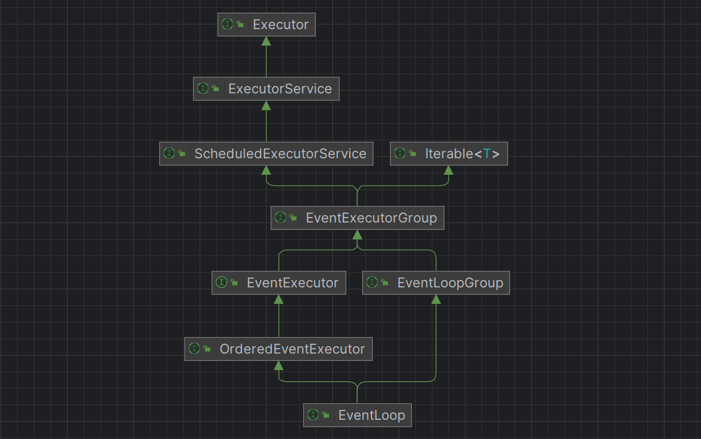
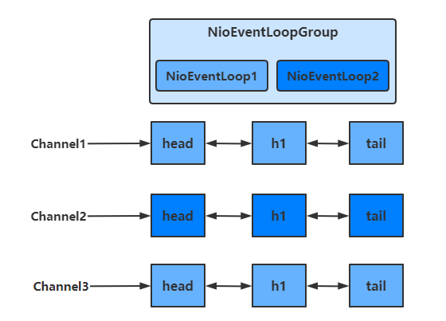
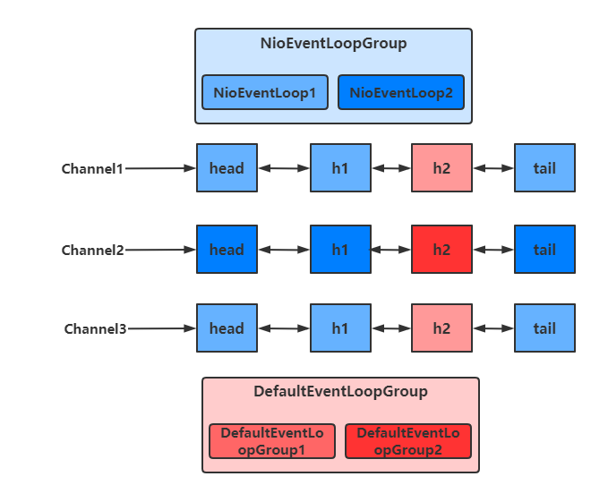
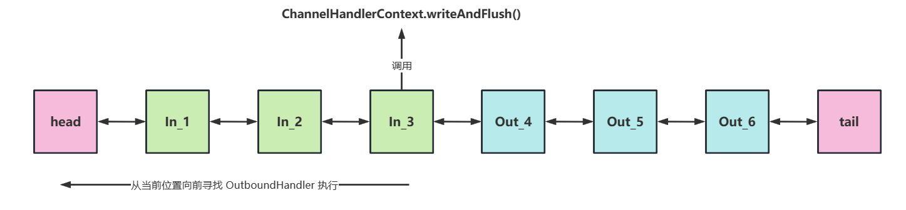
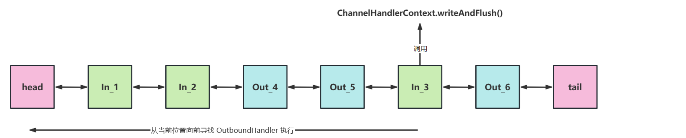
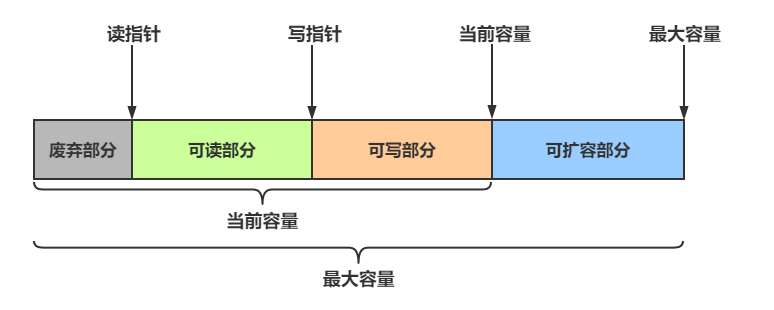

# Netty组件

## 一. EventLoop

EventLoop 本质是一个单线程执行器（同时维护了一个 Selector），里面有 run 方法处理 Channel 上源源不断的 io 事件。

它的继承关系比较复杂



* 一条线是继承自 j.u.c.ScheduledExecutorService 因此包含了线程池中所有的方法
* 另一条线是继承自 netty 自己的 OrderedEventExecutor，
  * 提供了 `boolean inEventLoop(Thread thread)` 方法判断一个线程是否属于此 EventLoop
  * 提供了 `parent()` 方法来看看自己属于哪个 EventLoopGroup

EventLoopGroup 是一组 EventLoop，Channel 一般会调用 EventLoopGroup 的 register 方法来绑定其中一个 EventLoop，后续这个 Channel 上的 io 事件都由此 EventLoop 来处理（保证了 io 事件处理时的线程安全）

* 继承自 netty 自己的 EventExecutorGroup
  * 实现了 Iterable 接口提供遍历 EventLoop 的能力
  * 另有 next 方法获取集合中下一个 EventLoop

### 1.1 处理普通定时任务

```java
public class TestEventLoop {
    public static void main(String[] args) {
        // 创建拥有两个EventLoop的NioEventLoopGroup，对应两个线程
        EventLoopGroup group = new NioEventLoopGroup(2);
        // 通过next方法可以获得下一个 EventLoop
        System.out.println(group.next());
        System.out.println(group.next());

        // 通过EventLoop执行普通任务
        group.next().execute(()->{
            System.out.println(Thread.currentThread().getName() + " hello");
        });

        // 通过EventLoop执行定时任务
        group.next().scheduleAtFixedRate(()->{
            System.out.println(Thread.currentThread().getName() + " hello2");
        }, 0, 1, TimeUnit.SECONDS);
        
        // 优雅地关闭
        group.shutdownGracefully();
    }
}
```

输出结果：

```txt
io.netty.channel.nio.NioEventLoop@7bb11784
io.netty.channel.nio.NioEventLoop@33a10788
nioEventLoopGroup-2-1 hello
nioEventLoopGroup-2-2 hello2
nioEventLoopGroup-2-2 hello2
nioEventLoopGroup-2-2 hello2
```

关闭 EventLoopGroup

优雅关闭 `shutdownGracefully` 方法。该方法会首先切换 `EventLoopGroup` 到关闭状态从而拒绝新的任务的加入，然后在任务队列的任务都处理完成后，停止线程的运行。从而确保整体应用是在正常有序的状态下退出的。

### 1.2 处理IO任务

#### 服务端代码

```java
public class MyServer {
    public static void main(String[] args) {
        new ServerBootstrap()
                .group(new NioEventLoopGroup())
                .channel(NioServerSocketChannel.class)
                .childHandler(new ChannelInitializer<SocketChannel>() {
                    @Override
                    protected void initChannel(SocketChannel socketChannel) throws Exception {
                        socketChannel.pipeline().addLast(new ChannelInboundHandlerAdapter() {
                            @Override
                            public void channelRead(ChannelHandlerContext ctx, Object msg) throws Exception {
                                ByteBuf buf = (ByteBuf) msg;
                                System.out.println(Thread.currentThread().getName() + " " + buf.toString(StandardCharsets.UTF_8));

                            }
                        });
                    }
                })
                .bind(8080);
    }
}
```

#### 客户端代码

```java
public class MyClient {
    public static void main(String[] args) throws IOException, InterruptedException {
        Channel channel = new Bootstrap()
                .group(new NioEventLoopGroup())
                .channel(NioSocketChannel.class)
                .handler(new ChannelInitializer<SocketChannel>() {
                    @Override
                    protected void initChannel(SocketChannel socketChannel) throws Exception {
                        socketChannel.pipeline().addLast(new StringEncoder());
                    }
                })
                .connect(new InetSocketAddress("localhost", 8080))
                .sync()
                .channel();
        System.out.println(channel);
        // 此处打断点调试，调用 channel.writeAndFlush(...);
        System.in.read();
    }
}
```

### 1.3 分工

Bootstrap的group()方法**可以传入两个EventLoopGroup参数**，分别负责处理不同的事件

```java
public class MyServer {
    public static void main(String[] args) {
        new ServerBootstrap()
            	// 两个Group，分别为Boss 负责Accept事件，Worker 负责读写事件
                .group(new NioEventLoopGroup(1), new NioEventLoopGroup(2))
            
				...
    }
}
```

多个客户端分别发送 `hello` 结果

```txt
nioEventLoopGroup-3-1 hello1
nioEventLoopGroup-3-2 hello2
nioEventLoopGroup-3-1 hello3
nioEventLoopGroup-3-2 hello4
nioEventLoopGroup-3-2 hello4
```

可以看出，一个EventLoop可以**负责多个**Channel，且EventLoop一旦与Channel绑定，则**一直负责**处理该Channel中的事件




#### 增加自定义EventLoopGroup

当有的**任务需要较长的时间处理时，可以使用非NioEventLoopGroup**，避免同一个NioEventLoop 中 的其他Channel在较长的时间内都无法得到处理。即尽量让 NioEventLoop 中线程处理简单快速的IO操作，将耗时较长的业务操作交由业务线程去做，这样当有些操作耗时较长时也不会阻塞当前 NioEventLoop 其它 Channel 事件。

```java
public class MyServer {
    public static void main(String[] args) {
        // 增加自定义的非NioEventLoopGroup
        EventLoopGroup group = new DefaultEventLoopGroup();
        
        new ServerBootstrap()
                .group(new NioEventLoopGroup(1), new NioEventLoopGroup(2))
                .channel(NioServerSocketChannel.class)
                .childHandler(new ChannelInitializer<SocketChannel>() {
                    @Override
                    protected void initChannel(SocketChannel socketChannel) throws Exception {
                        // 增加两个handler，第一个使用NioEventLoopGroup处理，第二个使用自定义EventLoopGroup处理
                        socketChannel.pipeline().addLast("nioHandler",new ChannelInboundHandlerAdapter() {
                            @Override
                            public void channelRead(ChannelHandlerContext ctx, Object msg) throws Exception {
                                ByteBuf buf = (ByteBuf) msg;
                                System.out.println(Thread.currentThread().getName() + " " + buf.toString(StandardCharsets.UTF_8));
                                // 调用下一个handler
                                ctx.fireChannelRead(msg);
                            }
                        })
                        // 该handler绑定自定义的Group
                        .addLast(group, "myHandler", new ChannelInboundHandlerAdapter() {
                            @Override
                            public void channelRead(ChannelHandlerContext ctx, Object msg) throws Exception {
                                ByteBuf buf = (ByteBuf) msg;
                                System.out.println(Thread.currentThread().getName() + " " + buf.toString(StandardCharsets.UTF_8));
                            }
                        });
                    }
                })
                .bind(8080);
    }
}
```

启动四个客户端发送数据

```txt
nioEventLoopGroup-4-1 hello1
defaultEventLoopGroup-2-1 hello1
nioEventLoopGroup-4-2 hello2
defaultEventLoopGroup-2-2 hello2
nioEventLoopGroup-4-1 hello3
defaultEventLoopGroup-2-3 hello3
nioEventLoopGroup-4-2 hello4
defaultEventLoopGroup-2-4 hello4
```

可以看出，客户端与服务器之间的事件，被nioEventLoopGroup和defaultEventLoopGroup分别处理



#### 线程切换实现

不同的EventLoopGroup切换的实现原理如下

由上面的图可以看出，当handler中绑定的Group不同时，需要切换Group来执行不同的任务

```java
//io.netty.channel.AbstractChannelHandlerContext#invokeChannelRead(io.netty.channel.AbstractChannelHandlerContext, java.lang.Object)
static void invokeChannelRead(final AbstractChannelHandlerContext next, Object msg) {
    final Object m = next.pipeline.touch(ObjectUtil.checkNotNull(msg, "msg"), next);
    // 获得下一个EventLoop, excutor 即为 EventLoopGroup
    EventExecutor executor = next.executor();
    
    // 如果下一个EventLoop 在当前的 EventLoopGroup中
    if (executor.inEventLoop()) {
        // 使用当前 EventLoopGroup 中的 EventLoop 来处理任务
        next.invokeChannelRead(m);
    } else {
        // 否则让另一个 EventLoopGroup 中的 EventLoop 来创建任务并执行
        executor.execute(new Runnable() {
            public void run() {
                next.invokeChannelRead(m);
            }
        });
    }
}
```

- 如果两个 handler 绑定的是**同一个EventLoopGroup**，那么就直接调用
- 否则，把要调用的代码封装为一个任务对象，由下一个 handler 的 EventLoopGroup 来调用

## 二. Channel

Channel 的常用方法

- close() 可以用来关闭Channel
- closeFuture() 用来处理 Channel 的关闭
  - sync 方法作用是同步等待 Channel 关闭
  - 而 addListener 方法是异步等待 Channel 关闭
- pipeline() 方法用于添加处理器
- write() 方法将数据写入
  - 因为缓冲机制，数据被写入到 Channel 中以后，不会立即被发送
  - **只有当缓冲满了或者调用了flush()方法后**，才会将数据通过 Channel 发送出去
- writeAndFlush() 方法将数据写入并**立即发送（刷出）**

### 2.1 ChannelFuture

#### 2.1.1 连接问题

拆分客户端代码

```java
public class MyClient {
    public static void main(String[] args) throws IOException, InterruptedException {
        ChannelFuture channelFuture = new Bootstrap()
                .group(new NioEventLoopGroup())
                .channel(NioSocketChannel.class)
                .handler(new ChannelInitializer<SocketChannel>() {
                    @Override
                    protected void initChannel(SocketChannel socketChannel) throws Exception {
                        socketChannel.pipeline().addLast(new StringEncoder());
                    }
                })
                // 该方法为异步非阻塞方法，主线程调用后不会被阻塞，真正去执行连接操作的是NIO线程
            	// NIO线程：NioEventLoop 中的线程
                .connect(new InetSocketAddress("localhost", 8080));
        
        // 该方法用于等待连接真正建立
        channelFuture.sync();
        
        // 获取客户端-服务器之间的Channel对象
        Channel channel = channelFuture.channel();
        channel.writeAndFlush("hello world");
        System.in.read();
    }
}
```

如果我们去掉`channelFuture.sync()`方法，会服务器无法收到`hello world`

这是因为建立连接(connect)的过程是**异步非阻塞**的，若不通过`sync()`方法阻塞主线程，等待连接真正建立，这时通过 channelFuture.channel() **拿到的 Channel 对象，并不是真正与服务器建立好连接的 Channel**，也就没法将信息正确的传输给服务器端

所以需要通过`channelFuture.sync()`方法，阻塞主线程，**同步处理结果**，等待连接真正建立好以后，再去获得 Channel 传递数据。使用该方法，获取 Channel 和发送数据的线程**都是主线程**

下面还有一种方法，用于**异步**获取建立连接后的 Channel 和发送数据，使得执行这些操作的线程是 NIO 线程（去执行connect操作的线程）

**addListener方法**

通过这种方法可以**在NIO线程中获取 Channel 并发送数据**，而不是在主线程中执行这些操作

```java
public class MyClient {
    public static void main(String[] args) throws IOException, InterruptedException {
        ChannelFuture channelFuture = new Bootstrap()
                .group(new NioEventLoopGroup())
                .channel(NioSocketChannel.class)
                .handler(new ChannelInitializer<SocketChannel>() {
                    @Override
                    protected void initChannel(SocketChannel socketChannel) throws Exception {
                        socketChannel.pipeline().addLast(new StringEncoder());
                    }
                })
                // 该方法为异步非阻塞方法，主线程调用后不会被阻塞，真正去执行连接操作的是NIO线程
                // NIO线程：NioEventLoop 中的线程
                .connect(new InetSocketAddress("localhost", 8080));
        
		// 当connect方法执行完毕后，也就是连接真正建立后
        // 会在NIO线程中调用operationComplete方法
        channelFuture.addListener(new ChannelFutureListener() {
            @Override
            public void operationComplete(ChannelFuture channelFuture) throws Exception {
                Channel channel = channelFuture.channel();
                channel.writeAndFlush("hello world");
            }
        });
        System.in.read();
    }
}
```

#### 2.1.2 处理关闭

```java
public class ReadClient {
    public static void main(String[] args) throws InterruptedException {
        // 创建EventLoopGroup，使用完毕后关闭
        NioEventLoopGroup group = new NioEventLoopGroup();
        
        ChannelFuture channelFuture = new Bootstrap()
                .group(group)
                .channel(NioSocketChannel.class)
                .handler(new ChannelInitializer<SocketChannel>() {
                    @Override
                    protected void initChannel(SocketChannel socketChannel) throws Exception {
                        socketChannel.pipeline().addLast(new StringEncoder());
                    }
                })
                .connect(new InetSocketAddress("localhost", 8080));
        channelFuture.sync();

        Channel channel = channelFuture.channel();
        Scanner scanner = new Scanner(System.in);

        // 创建一个线程用于输入并向服务器发送
        new Thread(()->{
            while (true) {
                String msg = scanner.next();
                if ("q".equals(msg)) {
                    // 关闭操作是异步的，在NIO线程中执行
                    channel.close();
                    break;
                }
                channel.writeAndFlush(msg);
            }
        }, "inputThread").start();

        // 获得closeFuture对象
        ChannelFuture closeFuture = channel.closeFuture();
        System.out.println("waiting close...");
        
        // 同步等待NIO线程执行完close操作
        closeFuture.sync();
        
        // 关闭之后执行一些操作，可以保证执行的操作一定是在channel关闭以后执行的
        System.out.println("关闭之后执行一些额外操作...");
        
        // 关闭EventLoopGroup
        group.shutdownGracefully();
    }
}
```

**关闭channel**

当我们要关闭channel时，可以调用channel.close()方法进行关闭。但是该方法也是一个**异步方法**。真正的关闭操作并不是在调用该方法的线程中执行的，而是**在NIO线程中执行真正的关闭操作**

如果我们想在channel**真正关闭以后**，执行一些额外的操作，可以选择以下两种方法来实现

- 通过channel.closeFuture()方法获得对应的ChannelFuture对象，然后调用**sync()方法**阻塞执行操作的线程，等待channel真正关闭后，再执行其他操作

  ```java
  // 获得closeFuture对象
  ChannelFuture closeFuture = channel.closeFuture();
  
  // 同步等待NIO线程执行完close操作
  closeFuture.sync();
  ```

- 调用**closeFuture.addListener**方法，添加close的后续操作

  ```java
  closeFuture.addListener(new ChannelFutureListener() {
      @Override
      public void operationComplete(ChannelFuture channelFuture) throws Exception {
          // 等待channel关闭后才执行的操作
          System.out.println("关闭之后执行一些额外操作...");
          // 关闭EventLoopGroup
          group.shutdownGracefully();
      }
  });
  ```

  

## 三. Future和Promise

### 3.1 概念

netty 中的 Future 与 jdk 中的 Future **同名**，但是是两个接口

netty 的 Future 继承自 jdk 的 Future，而 Promise 又对 netty Future 进行了扩展

- jdk Future 只能同步等待任务结束（或成功、或失败）才能得到结果
- netty Future 可以同步等待任务结束得到结果，也可以异步方式得到结果，但**都是要等任务结束**
- netty Promise 不仅有 netty Future 的功能，而且脱离了任务独立存在，**只作为两个线程间传递结果的容器**

| 功能/名称    | jdk Future                     | netty Future                                                 | Promise      |
| ------------ | ------------------------------ | ------------------------------------------------------------ | ------------ |
| cancel       | 取消任务                       | -                                                            | -            |
| isCanceled   | 任务是否取消                   | -                                                            | -            |
| isDone       | 任务是否完成，不能区分成功失败 | -                                                            | -            |
| get          | 获取任务结果，阻塞等待         | -                                                            | -            |
| getNow       | -                              | 获取任务结果，非阻塞，还未产生结果时返回 null                | -            |
| await        | -                              | 等待任务结束，如果任务失败，**不会抛异常**，而是通过 isSuccess 判断 | -            |
| sync         | -                              | 等待任务结束，如果任务失败，抛出异常                         | -            |
| isSuccess    | -                              | 判断任务是否成功                                             | -            |
| cause        | -                              | 获取失败信息，非阻塞，如果没有失败，返回null                 | -            |
| addLinstener | -                              | 添加回调，异步接收结果                                       | -            |
| setSuccess   | -                              | -                                                            | 设置成功结果 |
| setFailure   | -                              | -                                                            | 设置失败结果 |

### 3.2 JDK Future

```java
public class JdkFuture {
    public static void main(String[] args) throws ExecutionException, InterruptedException {
        ThreadFactory factory = new ThreadFactory() {
            @Override
            public Thread newThread(Runnable r) {
                return new Thread(r, "JdkFuture");
            }
        };
        // 创建线程池
        ThreadPoolExecutor executor = new ThreadPoolExecutor(5, 10,10, TimeUnit.SECONDS, new ArrayBlockingQueue<>(10), factory);

        // 获得Future对象
        Future<Integer> future = executor.submit(new Callable<Integer>() {
            @Override
            public Integer call() throws Exception {
                TimeUnit.SECONDS.sleep(1);
                return 50;
            }
        });

        // 通过阻塞的方式，获得运行结果
        System.out.println(future.get());
    }
}
```

### 3.3 Netty Future

```java
public class NettyFuture {
    public static void main(String[] args) throws ExecutionException, InterruptedException {
        NioEventLoopGroup group = new NioEventLoopGroup();

        // 获得 EventLoop 对象
        EventLoop eventLoop = group.next();
        Future<Integer> future = eventLoop.submit(new Callable<Integer>() {
            @Override
            public Integer call() throws Exception {
                return 50;
            }
        });

        // 主线程中获取结果
        System.out.println(Thread.currentThread().getName() + " 获取结果");
        System.out.println("getNow " + future.getNow());
        System.out.println("get " + future.get());

        // NIO线程中异步获取结果
        future.addListener(new GenericFutureListener<Future<? super Integer>>() {
            @Override
            public void operationComplete(Future<? super Integer> future) throws Exception {
                System.out.println(Thread.currentThread().getName() + " 获取结果");
                System.out.println("getNow " + future.getNow());
            }
        });
    }
}
```

**运行结果**

```
main 获取结果
getNow null
get 50
nioEventLoopGroup-2-1 获取结果
getNow 50
```

Netty中的Future对象，可以通过EventLoop的sumbit()方法得到

- 可以通过Future对象的**get方法**，阻塞地获取返回结果
- 也可以通过**getNow方法**，获取结果，若还没有结果，则返回null，该方法是非阻塞的
- 还可以通过**future.addListener方法**，在Callable方法执行的线程中，异步获取返回结果

### 3.4 Netty Promise

Promise相当于一个容器，可以用于存放各个线程中的结果，然后让其他线程去获取该结果

```java
public class NettyPromise {
    public static void main(String[] args) throws ExecutionException, InterruptedException {
        // 创建EventLoop
        NioEventLoopGroup group = new NioEventLoopGroup();
        EventLoop eventLoop = group.next();

        // 创建Promise对象，用于存放结果
        DefaultPromise<Integer> promise = new DefaultPromise<>(eventLoop);

        new Thread(()->{
            try {
                TimeUnit.SECONDS.sleep(1);
            } catch (InterruptedException e) {
                e.printStackTrace();
            }
            // 自定义线程向Promise中存放结果
            promise.setSuccess(50);
        }).start();

        // 主线程从Promise中获取结果
        System.out.println(Thread.currentThread().getName() + " " + promise.get());
    }
}
```

## 四. Pipeline和Handler

### 4.1 Pipeline

```java
public class PipeLineServer {
    public static void main(String[] args) {
        new ServerBootstrap()
                .group(new NioEventLoopGroup())
                .channel(NioServerSocketChannel.class)
                .childHandler(new ChannelInitializer<NioSocketChannel>() {
                    @Override
                    protected void initChannel(NioSocketChannel ch) throws Exception {
                        // 在socketChannel的pipeline中添加handler
                        // pipeline中handler是带有head与tail节点的双向链表，的实际结构为
    				 	// head <-> handler1 <-> ... <-> handler4 <->tail
                        // Inbound主要处理入站操作，一般为读操作，发生入站操作时会触发Inbound方法
                        // 入站时，handler是从head向后调用的
                        ch.pipeline().addLast("In_1", new ChannelInboundHandlerAdapter() {
                            @Override
                            public void channelRead(ChannelHandlerContext ctx, Object msg) throws Exception {
                                log.info("Inbound handler 1");
                                super.channelRead(ctx, msg);
                            }
                        });
                        ch.pipeline().addLast("In_2", new ChannelInboundHandlerAdapter() {
                            @Override
                            public void channelRead(ChannelHandlerContext ctx, Object msg) throws Exception {
                                log.info("Inbound handler 2");
                                super.channelRead(ctx, msg);
                            }
                        });
                        ch.pipeline().addLast("In_3", new ChannelInboundHandlerAdapter() {
                            @Override
                            public void channelRead(ChannelHandlerContext ctx, Object msg) throws Exception {
                                log.info("Inbound handler 3");
                                // 写入数据，才会触发 出站Handler
                                ch.writeAndFlush(ctx.alloc().buffer().writeBytes("hello".getBytes()));
                                super.channelRead(ctx, msg);
                            }
                        });

                        // Outbound主要处理出站操作，一般为写操作，发生出站操作时会触发Outbound方法
                        // 出站时，handler的调用是从tail向前调用的
                        ch.pipeline().addLast("Out_4" ,new ChannelOutboundHandlerAdapter(){
                            @Override
                            public void write(ChannelHandlerContext ctx, Object msg, ChannelPromise promise) throws Exception {
                                log.info("Outbound handler 4");
                                super.write(ctx, msg, promise);
                            }
                        });
                        ch.pipeline().addLast("Out_5" ,new ChannelOutboundHandlerAdapter(){
                            @Override
                            public void write(ChannelHandlerContext ctx, Object msg, ChannelPromise promise) throws Exception {
                                log.info("Outbound handler 5");
                                super.write(ctx, msg, promise);
                            }
                        });
                        ch.pipeline().addLast("Out_6" ,new ChannelOutboundHandlerAdapter(){
                            @Override
                            public void write(ChannelHandlerContext ctx, Object msg, ChannelPromise promise) throws Exception {
                                log.info("Outbound handler 6");
                                super.write(ctx, msg, promise);
                            }
                        });
                    }
                })
                .bind(8080);
    }
}
```

**运行结果如下**

```txt
11:23:39.427 [nioEventLoopGroup-2-2] INFO cn.demo.netty.pipeline.NettyServer - Inbound handler 1
11:23:39.428 [nioEventLoopGroup-2-2] INFO cn.demo.netty.pipeline.NettyServer - Inbound handler 2
11:23:39.428 [nioEventLoopGroup-2-2] INFO cn.demo.netty.pipeline.NettyServer - Inbound handler 3
11:23:39.429 [nioEventLoopGroup-2-2] INFO cn.demo.netty.pipeline.NettyServer - Outbound handler 6
11:23:39.429 [nioEventLoopGroup-2-2] INFO cn.demo.netty.pipeline.NettyServer - Outbound handler 5
11:23:39.429 [nioEventLoopGroup-2-2] INFO cn.demo.netty.pipeline.NettyServer - Outbound handler 4
```

通过channel.pipeline().addLast(name, handler)添加handler时，**记得给handler取名字**。这样可以调用pipeline的**addAfter、addBefore等方法更灵活地向pipeline中添加handler**

handler需要放入通道的pipeline中，才能根据放入顺序来使用handler

- pipeline是结构是一个带有head与tail指针的双向链表，其中的节点为handler
  - 要通过ctx.fireChannelRead(msg)等方法，**将当前handler的处理结果传递给下一个handler**
- 当有**入站**（Inbound）操作时，会从**head开始向后**调用handler，直到没有 Inbound Handler为止。
- 当有**出站**（Outbound）操作时，会从**tail开始向前**调用handler，直到没有 Outbound Handler为止。

**调用顺序如下**


### 4.2 OutboundHandler

在 4.1 中，我们在 `In_3` handler中调用了 `io.netty.channel.socket.nio.NioSocketChannel#writeAndFlush(java.lang.Object)` 方法，使得Netty从链表 `tail` 向前寻找 OutboundHandler 去执行。


但是 如果我们调用 `io.netty.channel.ChannelHandlerContext.writeAndFlush(java.lang.Object)` 方法，就会使得 Netty 从当前所在Handler位置向前寻找 OutboundHandler 去执行。



例如，我们将 4.1 中 Handler顺序做一下调整，并调用 ChannelHandlerContext 的 writeAndFlush 方法：

```java
@Slf4j
public class PipeLineServer {
    public static void main(String[] args) throws InterruptedException {
        new ServerBootstrap()
                .channel(NioServerSocketChannel.class)
                .group(new NioEventLoopGroup())
                .childHandler(new ChannelInitializer<NioSocketChannel>() {
                    @Override
                    protected void initChannel(NioSocketChannel ch) throws Exception {
                        // 在socketChannel的pipeline中添加handler
                        // pipeline中handler是带有head与tail节点的双向链表，的实际结构为
                        // head <-> handler1 <-> ... <-> handler4 <->tail
                        // Inbound主要处理入站操作，一般为读操作，发生入站操作时会触发Inbound方法
                        // 入站时，handler是从head向后调用的
                        ch.pipeline().addLast("In_1", new ChannelInboundHandlerAdapter() {
                            @Override
                            public void channelRead(ChannelHandlerContext ctx, Object msg) throws Exception {
                                log.info("Inbound handler 1");
                                super.channelRead(ctx, msg);
                            }
                        });
                        ch.pipeline().addLast("In_2", new ChannelInboundHandlerAdapter() {
                            @Override
                            public void channelRead(ChannelHandlerContext ctx, Object msg) throws Exception {
                                log.info("Inbound handler 2");
                                super.channelRead(ctx, msg);
                            }
                        });

                        // Outbound主要处理出站操作，一般为写操作，发生出站操作时会触发Outbound方法
                        // 出站时，handler的调用是从tail向前调用的
                        ch.pipeline().addLast("Out_4" ,new ChannelOutboundHandlerAdapter(){
                            @Override
                            public void write(ChannelHandlerContext ctx, Object msg, ChannelPromise promise) throws Exception {
                                log.info("Outbound handler 4");
                                super.write(ctx, msg, promise);
                            }
                        });

                        ch.pipeline().addLast("Out_5" ,new ChannelOutboundHandlerAdapter(){
                            @Override
                            public void write(ChannelHandlerContext ctx, Object msg, ChannelPromise promise) throws Exception {
                                log.info("Outbound handler 5");
                                super.write(ctx, msg, promise);
                            }
                        });

                        ch.pipeline().addLast("In_3", new ChannelInboundHandlerAdapter() {
                            @Override
                            public void channelRead(ChannelHandlerContext ctx, Object msg) throws Exception {
                                log.info("Inbound handler 3");
                                // 写入数据，才会触发 出站Handler
                                ctx.writeAndFlush(ctx.alloc().buffer().writeBytes("hello".getBytes()));
                                super.channelRead(ctx, msg);
                            }
                        });


                        ch.pipeline().addLast("Out_6" ,new ChannelOutboundHandlerAdapter(){
                            @Override
                            public void write(ChannelHandlerContext ctx, Object msg, ChannelPromise promise) throws Exception {
                                log.info("Outbound handler 6");
                                super.write(ctx, msg, promise);
                            }
                        });
                    }
                })
                .bind(8000);
    }
}

```

结果如下：

```txt
11:40:19.317 [nioEventLoopGroup-2-2] INFO cn.demo.netty.pipeline.NettyServer - Inbound handler 1
11:40:19.318 [nioEventLoopGroup-2-2] INFO cn.demo.netty.pipeline.NettyServer - Inbound handler 2
11:40:19.318 [nioEventLoopGroup-2-2] INFO cn.demo.netty.pipeline.NettyServer - Inbound handler 3
11:40:19.319 [nioEventLoopGroup-2-2] INFO cn.demo.netty.pipeline.NettyServer - Outbound handler 5
11:40:19.319 [nioEventLoopGroup-2-2] INFO cn.demo.netty.pipeline.NettyServer - Outbound handler 4
```

因为上述代码 handler 链表如下：



### 4.3 EmbeddedChannel

EmbeddedChannel可以用于测试各个handler，通过其构造函数按顺序传入需要测试handler，然后调用对应的Inbound和Outbound方法即可

```java
public class TestEmbeddedChannel {
    public static void main(String[] args) {
        ChannelInboundHandlerAdapter h1 = new ChannelInboundHandlerAdapter() {
            @Override
            public void channelRead(ChannelHandlerContext ctx, Object msg) throws Exception {
                System.out.println("1");
                super.channelRead(ctx, msg);
            }
        };

        ChannelInboundHandlerAdapter h2 = new ChannelInboundHandlerAdapter() {
            @Override
            public void channelRead(ChannelHandlerContext ctx, Object msg) throws Exception {
                System.out.println("2");
                super.channelRead(ctx, msg);
            }
        };

        ChannelOutboundHandlerAdapter h3 = new ChannelOutboundHandlerAdapter() {
            @Override
            public void write(ChannelHandlerContext ctx, Object msg, ChannelPromise promise) throws Exception {
                System.out.println("3");
                super.write(ctx, msg, promise);
            }
        };

        ChannelOutboundHandlerAdapter h4 = new ChannelOutboundHandlerAdapter() {
            @Override
            public void write(ChannelHandlerContext ctx, Object msg, ChannelPromise promise) throws Exception {
                System.out.println("4");
                super.write(ctx, msg, promise);
            }
        };

        // 用于测试Handler的Channel
        EmbeddedChannel channel = new EmbeddedChannel(h1, h2, h3, h4);
        
        // 执行Inbound操作 
        channel.writeInbound(ByteBufAllocator.DEFAULT.buffer().writeBytes("hello".getBytes(StandardCharsets.UTF_8)));
        // 执行Outbound操作
        channel.writeOutbound(ByteBufAllocator.DEFAULT.buffer().writeBytes("hello".getBytes(StandardCharsets.UTF_8)));
    }
}
```

## 五. ByteBuf

```java
public class ByteBufUtil {
    
    public static void log(ByteBuf buffer) {
        int length = buffer.readableBytes();
        int rows = length / 16 + (length % 15 == 0 ? 0 : 1) + 4;
        StringBuilder buf = new StringBuilder(rows * 80 * 2)
                .append("read index:").append(buffer.readerIndex())
                .append(" write index:").append(buffer.writerIndex())
                .append(" capacity:").append(buffer.capacity())
                .append("\n");
        io.netty.buffer.ByteBufUtil.appendPrettyHexDump(buf, buffer);
        System.out.println(buf.toString());
    }
}
```

该方法可以帮助我们更为详细地查看ByteBuf中的内容

### 5.1 ButeBuf 创建

```java
public class ByteBufStudy {
    public static void main(String[] args) {
        // 创建ByteBuf
        ByteBuf buffer = ByteBufAllocator.DEFAULT.buffer(16);
        ByteBufUtil.log(buffer);

        // 向buffer中写入数据
        StringBuilder sb = new StringBuilder();
        for(int i = 0; i < 20; i++) {
            sb.append("a");
        }
        buffer.writeBytes(sb.toString().getBytes(StandardCharsets.UTF_8));

        // 查看写入结果
        ByteBufUtil.log(buffer);
    }
}
```

输出结果：

```txt
read index:0 write index:0 capacity:256  # 默认容量为256

read index:0 write index:300 capacity:512 # ByteBuf支持自动扩容，放入300个字节数据后，扩容至512
         +-------------------------------------------------+
         |  0  1  2  3  4  5  6  7  8  9  a  b  c  d  e  f |
+--------+-------------------------------------------------+----------------+
|00000000| 61 61 61 61 61 61 61 61 61 61 61 61 61 61 61 61 |aaaaaaaaaaaaaaaa|
|00000010| 61 61 61 61 61 61 61 61 61 61 61 61 61 61 61 61 |aaaaaaaaaaaaaaaa|
|00000020| 61 61 61 61 61 61 61 61 61 61 61 61 61 61 61 61 |aaaaaaaaaaaaaaaa|
|00000030| 61 61 61 61 61 61 61 61 61 61 61 61 61 61 61 61 |aaaaaaaaaaaaaaaa|
|00000040| 61 61 61 61 61 61 61 61 61 61 61 61 61 61 61 61 |aaaaaaaaaaaaaaaa|
|00000050| 61 61 61 61 61 61 61 61 61 61 61 61 61 61 61 61 |aaaaaaaaaaaaaaaa|
|00000060| 61 61 61 61 61 61 61 61 61 61 61 61 61 61 61 61 |aaaaaaaaaaaaaaaa|
|00000070| 61 61 61 61 61 61 61 61 61 61 61 61 61 61 61 61 |aaaaaaaaaaaaaaaa|
|00000080| 61 61 61 61 61 61 61 61 61 61 61 61 61 61 61 61 |aaaaaaaaaaaaaaaa|
|00000090| 61 61 61 61 61 61 61 61 61 61 61 61 61 61 61 61 |aaaaaaaaaaaaaaaa|
|000000a0| 61 61 61 61 61 61 61 61 61 61 61 61 61 61 61 61 |aaaaaaaaaaaaaaaa|
|000000b0| 61 61 61 61 61 61 61 61 61 61 61 61 61 61 61 61 |aaaaaaaaaaaaaaaa|
|000000c0| 61 61 61 61 61 61 61 61 61 61 61 61 61 61 61 61 |aaaaaaaaaaaaaaaa|
|000000d0| 61 61 61 61 61 61 61 61 61 61 61 61 61 61 61 61 |aaaaaaaaaaaaaaaa|
|000000e0| 61 61 61 61 61 61 61 61 61 61 61 61 61 61 61 61 |aaaaaaaaaaaaaaaa|
|000000f0| 61 61 61 61 61 61 61 61 61 61 61 61 61 61 61 61 |aaaaaaaaaaaaaaaa|
|00000100| 61 61 61 61 61 61 61 61 61 61 61 61 61 61 61 61 |aaaaaaaaaaaaaaaa|
|00000110| 61 61 61 61 61 61 61 61 61 61 61 61 61 61 61 61 |aaaaaaaaaaaaaaaa|
|00000120| 61 61 61 61 61 61 61 61 61 61 61 61             |aaaaaaaaaaaa    |
+--------+-------------------------------------------------+----------------+
```

ByteBuf**通过`ByteBufAllocator`选择allocator并调用对应的buffer()方法来创建的**，默认使用**直接内存**作为ByteBuf，容量为256个字节，可以指定初始容量的大小

当ByteBuf的容量无法容纳所有数据时，**ByteBuf会进行扩容操作**

**如果在handler中创建ByteBuf，建议使用`ChannelHandlerContext ctx.alloc().buffer()`来创建**

### 5.2 直接内存与堆内存

通过该方法创建的ByteBuf，使用的是**基于直接内存**的ByteBuf

```java
ByteBuf buffer = ByteBufAllocator.DEFAULT.buffer(16);
```

可以使用下面的代码来创建池化**基于堆**的 ByteBuf

```java
ByteBuf buffer = ByteBufAllocator.DEFAULT.heapBuffer(16);
```

也可以使用下面的代码来创建池化**基于直接内存**的 ByteBuf

```java
ByteBuf buffer = ByteBufAllocator.DEFAULT.directBuffer(16);
```

- 直接内存创建和销毁的代价昂贵，但读写性能高（少一次内存复制），适合配合池化功能一起用
- 直接内存对 GC 压力小，因为这部分内存不受 JVM 垃圾回收的管理，但也要注意及时主动释放

**验证**

```java
public class ByteBufStudy {
    public static void main(String[] args) {
        ByteBuf buffer = ByteBufAllocator.DEFAULT.buffer(16);
        System.out.println(buffer.getClass());

        buffer = ByteBufAllocator.DEFAULT.heapBuffer(16);
        System.out.println(buffer.getClass());

        buffer = ByteBufAllocator.DEFAULT.directBuffer(16);
        System.out.println(buffer.getClass());
    }
}
```

```txt
// 使用池化的直接内存
class io.netty.buffer.PooledUnsafeDirectByteBuf
    
// 使用池化的堆内存    
class io.netty.buffer.PooledUnsafeHeapByteBuf
    
// 使用池化的直接内存    
class io.netty.buffer.PooledUnsafeDirectByteBuf
```

### 5.3 池化与非池化

池化的最大意义在于可以**重用** ByteBuf，优点有

- 没有池化，则每次都得创建新的 ByteBuf 实例，这个操作对直接内存代价昂贵，就算是堆内存，也会增加 GC 压力
- 有了池化，则可以重用池中 ByteBuf 实例，并且采用了与 jemalloc 类似的内存分配算法提升分配效率
- 高并发时，池化功能更节约内存，减少内存溢出的可能

池化功能是否开启，可以通过下面的系统环境变量来设置

```java
-Dio.netty.allocator.type={unpooled|pooled}Copy
```

- 4.1 以后，**非 Android 平台默认启用池化实现**，Android 平台启用非池化实现
- 4.1 之前，池化功能还不成熟，默认是非池化实现

### 5.4 ByteBuf组成

ByteBuf主要有以下几个组成部分

- 最大容量与当前容量

  - 在构造ByteBuf时，可传入两个参数，分别代表初始容量和最大容量，若未传入第二个参数（最大容量），最大容量默认为Integer.MAX_VALUE
  - 当ByteBuf容量无法容纳所有数据时，会进行扩容操作，若**超出最大容量**，会抛出`java.lang.IndexOutOfBoundsException`异常

- 读写操作不同于ByteBuffer只用position进行控制，

  ByteBuf分别由读指针和写指针两个指针控制

  。进行读写操作时，无需进行模式的切换

  - 读指针前的部分被称为废弃部分，是已经读过的内容
  - 读指针与写指针之间的空间称为可读部分
  - 写指针与当前容量之间的空间称为可写部分



### 5.5 写入

常用方法如下

| 方法签名                                                     | 含义                       | 备注                                                    |
| ------------------------------------------------------------ | -------------------------- | ------------------------------------------------------- |
| writeBoolean(boolean value)                                  | 写入 boolean 值            | **用一字节 01\|00 代表 true\|false**                    |
| writeByte(int value)                                         | 写入 byte 值               |                                                         |
| writeShort(int value)                                        | 写入 short 值              |                                                         |
| writeInt(int value)                                          | 写入 int 值                | Big Endian（大端写入），即 0x250，写入后 00 00 02 50    |
| writeIntLE(int value)                                        | 写入 int 值                | Little Endian（小端写入），即 0x250，写入后 50 02 00 00 |
| writeLong(long value)                                        | 写入 long 值               |                                                         |
| writeChar(int value)                                         | 写入 char 值               |                                                         |
| writeFloat(float value)                                      | 写入 float 值              |                                                         |
| writeDouble(double value)                                    | 写入 double 值             |                                                         |
| writeBytes(ByteBuf src)                                      | 写入 netty 的 ByteBuf      |                                                         |
| writeBytes(byte[] src)                                       | 写入 byte[]                |                                                         |
| writeBytes(ByteBuffer src)                                   | 写入 nio 的 **ByteBuffer** |                                                         |
| int writeCharSequence(CharSequence sequence, Charset charset) | 写入字符串                 | CharSequence为字符串类的父类，第二个参数为对应的字符集  |

> 注意
>
> - 这些方法的未指明返回值的，其返回值都是 ByteBuf，意味着可以链式调用来写入不同的数据
> - 网络传输中，**默认习惯是 Big Endian**，使用 writeInt(int value)

使用方法：

```java
public class ByteBufStudy {
    public static void main(String[] args) {
        // 创建ByteBuf
        ByteBuf buffer = ByteBufAllocator.DEFAULT.buffer(16, 20);
        ByteBufUtil.log(buffer);

        // 向buffer中写入数据
        buffer.writeBytes(new byte[]{1, 2, 3, 4});
        ByteBufUtil.log(buffer);

        buffer.writeInt(5);
        ByteBufUtil.log(buffer);

        buffer.writeIntLE(6);
        ByteBufUtil.log(buffer);

        buffer.writeLong(7);
        ByteBufUtil.log(buffer);
    }
}
```

**运行结果**

```java
read index:0 write index:0 capacity:16

read index:0 write index:4 capacity:16
         +-------------------------------------------------+
         |  0  1  2  3  4  5  6  7  8  9  a  b  c  d  e  f |
+--------+-------------------------------------------------+----------------+
|00000000| 01 02 03 04                                     |....            |
+--------+-------------------------------------------------+----------------+

read index:0 write index:8 capacity:16
         +-------------------------------------------------+
         |  0  1  2  3  4  5  6  7  8  9  a  b  c  d  e  f |
+--------+-------------------------------------------------+----------------+
|00000000| 01 02 03 04 00 00 00 05                         |........        |
+--------+-------------------------------------------------+----------------+

read index:0 write index:12 capacity:16
         +-------------------------------------------------+
         |  0  1  2  3  4  5  6  7  8  9  a  b  c  d  e  f |
+--------+-------------------------------------------------+----------------+
|00000000| 01 02 03 04 00 00 00 05 06 00 00 00             |............    |
+--------+-------------------------------------------------+----------------+

read index:0 write index:20 capacity:20
         +-------------------------------------------------+
         |  0  1  2  3  4  5  6  7  8  9  a  b  c  d  e  f |
+--------+-------------------------------------------------+----------------+
|00000000| 01 02 03 04 00 00 00 05 06 00 00 00 00 00 00 00 |................|
|00000010| 00 00 00 07                                     |....            |
+--------+-------------------------------------------------+----------------+
```

还有一类方法是 **set 开头**的一系列方法，也**可以写入数据，但不会改变写指针位置**

### 5.6 扩容

当ByteBuf中的容量无法容纳写入的数据时，会进行扩容操作

```java
buffer.writeLong(7);
ByteBufUtil.log(buffer);
```

```java
// 扩容前
read index:0 write index:12 capacity:16
...

// 扩容后
read index:0 write index:20 capacity:20
         +-------------------------------------------------+
         |  0  1  2  3  4  5  6  7  8  9  a  b  c  d  e  f |
+--------+-------------------------------------------------+----------------+
|00000000| 01 02 03 04 00 00 00 05 06 00 00 00 00 00 00 00 |................|
|00000010| 00 00 00 07                                     |....            |
+--------+-------------------------------------------------+----------------+
```

#### 5.6.1 扩容规则

- 如何写入后数据大小未超过 512 字节，则选择下一个 16 的整数倍进行扩容
  - 例如写入后大小为 12 字节，则扩容后 capacity 是 16 字节
- 如果写入后数据大小超过 512 字节，则选择下一个 2^n
  - 例如写入后大小为 513 字节，则扩容后 capacity 是 210=1024 字节（29=512 已经不够了）
- 扩容**不能超过** maxCapacity，否则会抛出`java.lang.IndexOutOfBoundsException`异常

```java
Exception in thread "main" java.lang.IndexOutOfBoundsException: writerIndex(20) + minWritableBytes(8) exceeds maxCapacity(20): PooledUnsafeDirectByteBuf(ridx: 0, widx: 20, cap: 20/20)
...
```

### 5.7 读取

读取主要是通过一系列read方法进行读取，读取时会根据读取数据的字节数移动读指针

如果需要**重复读取**，需要调用`buffer.markReaderIndex()`对读指针进行标记，并通过`buffer.resetReaderIndex()`将读指针恢复到mark标记的位置

```java
public class ByteBufStudy {
    public static void main(String[] args) {
        // 创建ByteBuf
        ByteBuf buffer = ByteBufAllocator.DEFAULT.buffer(16, 20);

        // 向buffer中写入数据
        buffer.writeBytes(new byte[]{1, 2, 3, 4});
        buffer.writeInt(5);

        // 读取4个字节
        System.out.println(buffer.readByte());
        System.out.println(buffer.readByte());
        System.out.println(buffer.readByte());
        System.out.println(buffer.readByte());
        ByteBufUtil.log(buffer);

        // 通过mark与reset实现重复读取
        buffer.markReaderIndex();
        System.out.println(buffer.readInt());
        ByteBufUtil.log(buffer);

        // 恢复到mark标记处
        buffer.resetReaderIndex();
        ByteBufUtil.log(buffer);
    }
}
```

结果：

```txt
1
2
3
4
read index:4 write index:8 capacity:16
         +-------------------------------------------------+
         |  0  1  2  3  4  5  6  7  8  9  a  b  c  d  e  f |
+--------+-------------------------------------------------+----------------+
|00000000| 00 00 00 05                                     |....            |
+--------+-------------------------------------------------+----------------+
5
read index:8 write index:8 capacity:16

read index:4 write index:8 capacity:16
         +-------------------------------------------------+
         |  0  1  2  3  4  5  6  7  8  9  a  b  c  d  e  f |
+--------+-------------------------------------------------+----------------+
|00000000| 00 00 00 05                                     |....            |
+--------+-------------------------------------------------+----------------+
```

还有以 get 开头的一系列方法，这些**方法不会改变读指针的位置**

### 5.8 释放

由于 Netty 中有堆外内存（直接内存）的 ByteBuf 实现，**堆外内存最好是手动来释放**，而不是等 GC 垃圾回收。

- UnpooledHeapByteBuf 使用的是 JVM 内存，只需等 GC 回收内存即可
- UnpooledDirectByteBuf 使用的就是直接内存了，需要特殊的方法来回收内存
- PooledByteBuf 和它的子类使用了池化机制，需要更复杂的规则来回收内存

Netty 这里采用了引用计数法来控制回收内存，每个 ByteBuf 都实现了 ReferenceCounted 接口

- 每个 ByteBuf 对象的初始计数为 1
- 调用 release 方法计数减 1，如果计数为 0，ByteBuf 内存被回收
- 调用 retain 方法计数加 1，表示调用者没用完之前，其它 handler 即使调用了 release 也不会造成回收
- 当计数为 0 时，底层内存会被回收，这时即使 ByteBuf 对象还在，其各个方法均无法正常使用

#### 5.8.1 释放规则

因为 pipeline 的存在，一般需要将 ByteBuf 传递给下一个 ChannelHandler，如果在每个 ChannelHandler 中都去调用 release ，就失去了传递性（如果在这个 ChannelHandler 内这个 ByteBuf 已完成了它的使命，那么便无须再传递）

**基本规则是，谁是最后使用者，谁负责 release**

- 起点，对于 NIO 实现来讲，在 io.netty.channel.nio.AbstractNioByteChannel.NioByteUnsafe.read 方法中首次创建 ByteBuf 放入 pipeline（line 163 pipeline.fireChannelRead(byteBuf)）
- 入站 ByteBuf 处理原则
  - 对原始 ByteBuf 不做处理，调用 ctx.fireChannelRead(msg) 向后传递，这时无须 release
  - **将原始 ByteBuf 转换为其它类型的 Java 对象，这时 ByteBuf 就没有向下传递了，必须 release**
  - **如果不调用 ctx.fireChannelRead(msg) 向后传递，那么也必须 release**
  - **注意各种异常，如果 ByteBuf 没有成功传递到下一个 ChannelHandler，必须 release**
  - 假设消息**一直向后传**，那么 TailContext 会负责释放未处理消息（原始的 ByteBuf）
- 出站 ByteBuf 处理原则
  - **出站消息最终都会转为 ByteBuf 输出，一直向前传，由 HeadContext flush 后 release**

- 异常处理原则

  - 有时候不清楚 ByteBuf 被引用了多少次，但又必须彻底释放，可以**循环调用 release 直到返回 true**

    ```
    while (!buffer.release()) {}
    ```

当ByteBuf**被传到了pipeline的head与tail时**，ByteBuf会被其中的方法彻底释放，但**前提是ByteBuf被传递到了head与tail中**

**TailConext中释放ByteBuf的源码**

```java
// io.netty.channel.DefaultChannelPipeline.TailContext#channelRead
protected void onUnhandledInboundMessage(Object msg) {
    try {
        logger.debug("Discarded inbound message {} that reached at the tail of the pipeline. Please check your pipeline configuration.", msg);
    } finally {
        // 具体的释放方法
        ReferenceCountUtil.release(msg);
    }
}
```

判断传过来的是否为ByteBuf，是的话才需要释放

```java
public static boolean release(Object msg) {
	return msg instanceof ReferenceCounted ? ((ReferenceCounted)msg).release() : false;
}
```

### 5.9 slice

ByteBuf切片是【零拷贝】的体现之一，对原始 ByteBuf 进行切片成多个 ByteBuf，**切片后的 ByteBuf 并没有发生内存复制，还是使用原始 ByteBuf 的内存**，切片后的 ByteBuf 维护独立的 read，write 指针

得到分片后的buffer后，要调用其retain方法，使其内部的引用计数加一。避免原ByteBuf释放，导致切片buffer无法使用

修改原ByteBuf中的值，也会影响切片后得到的ByteBuf


```java
public class TestSlice {
    public static void main(String[] args) {
        // 创建ByteBuf
        ByteBuf buffer = ByteBufAllocator.DEFAULT.buffer(16, 20);

        // 向buffer中写入数据
        buffer.writeBytes(new byte[]{1, 2, 3, 4, 5, 6, 7, 8, 9, 10});

        // 将buffer分成两部分
        ByteBuf slice1 = buffer.slice(0, 5);
        ByteBuf slice2 = buffer.slice(5, 5);

        // 需要让分片的buffer引用计数加一
        // 避免原Buffer释放导致分片buffer无法使用
        slice1.retain();
        slice2.retain();
        
        ByteBufUtil.log(slice1);
        ByteBufUtil.log(slice2);

        // 更改原始buffer中的值
        System.out.println("===========修改原buffer中的值===========");
        buffer.setByte(0,5);

        System.out.println("===========打印slice1===========");
        ByteBufUtil.log(slice1);
    }
}
```

运行结果

```txt
read index:0 write index:5 capacity:5
         +-------------------------------------------------+
         |  0  1  2  3  4  5  6  7  8  9  a  b  c  d  e  f |
+--------+-------------------------------------------------+----------------+
|00000000| 01 02 03 04 05                                  |.....           |
+--------+-------------------------------------------------+----------------+
read index:0 write index:5 capacity:5
         +-------------------------------------------------+
         |  0  1  2  3  4  5  6  7  8  9  a  b  c  d  e  f |
+--------+-------------------------------------------------+----------------+
|00000000| 06 07 08 09 0a                                  |.....           |
+--------+-------------------------------------------------+----------------+
===========修改原buffer中的值===========
===========打印slice1===========
read index:0 write index:5 capacity:5
         +-------------------------------------------------+
         |  0  1  2  3  4  5  6  7  8  9  a  b  c  d  e  f |
+--------+-------------------------------------------------+----------------+
|00000000| 05 02 03 04 05                                  |.....           |
+--------+-------------------------------------------------+----------------+
```

### 5.10 duplicate


调用duplicate()方法生成的 ByteBuf 对象，和原始ByteBuf共用底层物理内存。

### 5.11 copy

与 duplicate() 方法一样会生成一个新的 ByteBuf 对象，但与之不同的是，会将原始的物理内存也复制一份出来。

### 5.12 composite

我们还可以创建一个 CompositeByteBuf，用于将多个小的ByteBuf合并为一个大的ByteBuf，将底层多块物理内存逻辑连接在一起。

```java
public static void main(String[] args) {
    ByteBuf buffer1 = ByteBufAllocator.DEFAULT.buffer(16, 32);
    ByteBuf buffer2 = ByteBufAllocator.DEFAULT.buffer(16, 32);
    buffer1.writeBytes(new byte[]{1, 2, 3, 4});
    buffer2.writeBytes(new byte[]{5, 6, 7, 8});

    CompositeByteBuf buffer = ByteBufAllocator.DEFAULT.compositeBuffer();
    buffer.addComponents(true, buffer1, buffer2);

    ByteBufUtil.log(buffer);
}
```


### 5.12 Netty ByteBuf 相比 NIO 原生 ByteBuffer 优势

- 池化思想 - 可以重用池中 ByteBuf 实例，更节约内存，减少内存溢出的可能
- **读写指针分离**，不需要像 ByteBuffer 一样切换读写模式
- 可以**自动扩容**
- 支持链式调用，使用更流畅
- 很多地方体现零拷贝，例如
  - slice、duplicate、CompositeByteBuf

