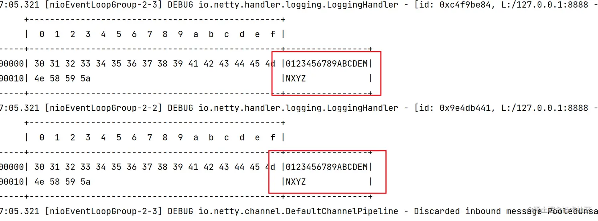
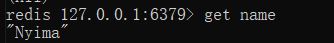
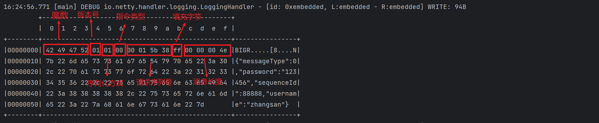
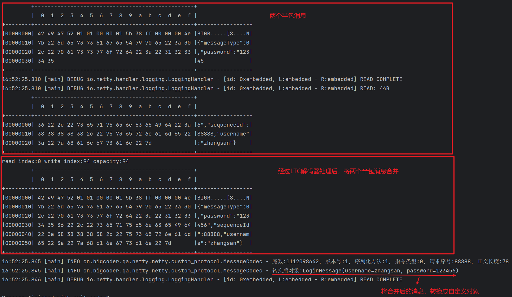
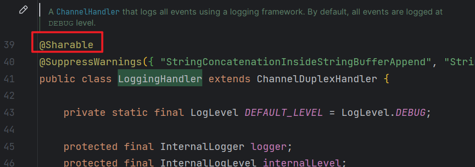

# Netty应用

## 一. 粘包和半包

### 1.1 服务器代码

```java
public class StudyServer {
    static final Logger log = LoggerFactory.getLogger(StudyServer.class);
    void start() {
        NioEventLoopGroup boss = new NioEventLoopGroup(1);
        NioEventLoopGroup worker = new NioEventLoopGroup();
        try {
            ServerBootstrap serverBootstrap = new ServerBootstrap();
            serverBootstrap.channel(NioServerSocketChannel.class);
            serverBootstrap.group(boss, worker);
            serverBootstrap.childHandler(new ChannelInitializer<SocketChannel>() {
                @Override
                protected void initChannel(SocketChannel ch) {
                    ch.pipeline().addLast(new LoggingHandler(LogLevel.DEBUG));
                    ch.pipeline().addLast(new ChannelInboundHandlerAdapter() {
                        @Override
                        public void channelActive(ChannelHandlerContext ctx) throws Exception {
                            // 连接建立时会执行该方法
                            log.debug("connected {}", ctx.channel());
                            super.channelActive(ctx);
                        }

                        @Override
                        public void channelInactive(ChannelHandlerContext ctx) throws Exception {
                            // 连接断开时会执行该方法
                            log.debug("disconnect {}", ctx.channel());
                            super.channelInactive(ctx);
                        }
                    });
                }
            });
            ChannelFuture channelFuture = serverBootstrap.bind(8080);
            log.debug("{} binding...", channelFuture.channel());
            channelFuture.sync();
            log.debug("{} bound...", channelFuture.channel());
            // 关闭channel
            channelFuture.channel().closeFuture().sync();
        } catch (InterruptedException e) {
            log.error("server error", e);
        } finally {
            boss.shutdownGracefully();
            worker.shutdownGracefully();
            log.debug("stopped");
        }
    }

    public static void main(String[] args) {
        new StudyServer().start();
    }
}
```

### 1.2 粘包现象

```java
import io.netty.bootstrap.Bootstrap;
import io.netty.buffer.ByteBuf;
import io.netty.channel.ChannelFuture;
import io.netty.channel.ChannelHandlerContext;
import io.netty.channel.ChannelInboundHandlerAdapter;
import io.netty.channel.ChannelInitializer;
import io.netty.channel.nio.NioEventLoopGroup;
import io.netty.channel.socket.SocketChannel;
import io.netty.channel.socket.nio.NioSocketChannel;
import lombok.extern.slf4j.Slf4j;

/**
 * @author: Jindong.Tian
 * @date: 2023-07-22
 **/
@Slf4j
public class ClientTest {
    public static void main(String[] args) {
        NioEventLoopGroup worker = new NioEventLoopGroup();
        try {
            Bootstrap bootstrap = new Bootstrap();
            bootstrap.channel(NioSocketChannel.class);
            bootstrap.group(worker);
            bootstrap.handler(new ChannelInitializer<SocketChannel>() {
                @Override
                protected void initChannel(SocketChannel ch) throws Exception {
                    log.debug("connected...");
                    ch.pipeline().addLast(new ChannelInboundHandlerAdapter() {
                        @Override
                        public void channelActive(ChannelHandlerContext ctx) throws Exception {
                            log.debug("sending...");
                            // 每次发送16个字节的数据，共发送10次
                            for (int i = 0; i < 10; i++) {
                                ByteBuf buffer = ctx.alloc().buffer();
                                buffer.writeBytes(new byte[]{0, 1, 2, 3, 4, 5, 6, 7, 8, 9, 10, 11, 12, 13, 14, 15});
                                ctx.writeAndFlush(buffer);
                            }
                        }
                    });
                }
            });
            ChannelFuture channelFuture = bootstrap.connect("127.0.0.1", 8080).sync();
            channelFuture.channel().closeFuture().sync();

        } catch (InterruptedException e) {
            log.error("client error", e);
        } finally {
            worker.shutdownGracefully();
        }
    }
}
```

**服务器接收结果**

```txt
10:03:55.523 [nioEventLoopGroup-3-1] DEBUG io.netty.handler.logging.LoggingHandler - [id: 0x3b0da5d7, L:/127.0.0.1:8080 - R:/127.0.0.1:9879] READ: 160B
         +-------------------------------------------------+
         |  0  1  2  3  4  5  6  7  8  9  a  b  c  d  e  f |
+--------+-------------------------------------------------+----------------+
|00000000| 00 01 02 03 04 05 06 07 08 09 0a 0b 0c 0d 0e 0f |................|
|00000010| 00 01 02 03 04 05 06 07 08 09 0a 0b 0c 0d 0e 0f |................|
|00000020| 00 01 02 03 04 05 06 07 08 09 0a 0b 0c 0d 0e 0f |................|
|00000030| 00 01 02 03 04 05 06 07 08 09 0a 0b 0c 0d 0e 0f |................|
|00000040| 00 01 02 03 04 05 06 07 08 09 0a 0b 0c 0d 0e 0f |................|
|00000050| 00 01 02 03 04 05 06 07 08 09 0a 0b 0c 0d 0e 0f |................|
|00000060| 00 01 02 03 04 05 06 07 08 09 0a 0b 0c 0d 0e 0f |................|
|00000070| 00 01 02 03 04 05 06 07 08 09 0a 0b 0c 0d 0e 0f |................|
|00000080| 00 01 02 03 04 05 06 07 08 09 0a 0b 0c 0d 0e 0f |................|
|00000090| 00 01 02 03 04 05 06 07 08 09 0a 0b 0c 0d 0e 0f |................|
+--------+-------------------------------------------------+----------------+
```

可见虽然客户端是分别以16字节为单位，通过channel向服务器发送了10次数据，可是**服务器端却只接收了一次，接收数据的大小为160B，即客户端发送的数据总大小，这就是粘包现象**

### 1.3 半包现象

将客户端-服务器之间的channel容量进行调整

```java
// 调整channel的容量
serverBootstrap.option(ChannelOption.SO_RCVBUF, 10);
```

**注意**

> serverBootstrap.option(ChannelOption.SO_RCVBUF, 10) 影响的底层接收缓冲区（即滑动窗口）大小，仅决定了 netty 读取的最小单位，**netty 实际每次读取的一般是它的整数倍**

**服务器接收结果**

```txt
5901 [nioEventLoopGroup-3-1] DEBUG io.netty.handler.logging.LoggingHandler  - [id: 0xc73284f3, L:/127.0.0.1:8080 - R:/127.0.0.1:49679] READ: 36B
         +-------------------------------------------------+
         |  0  1  2  3  4  5  6  7  8  9  a  b  c  d  e  f |
+--------+-------------------------------------------------+----------------+
|00000000| 00 01 02 03 04 05 06 07 08 09 0a 0b 0c 0d 0e 0f |................|
|00000010| 00 01 02 03 04 05 06 07 08 09 0a 0b 0c 0d 0e 0f |................|
|00000020| 00 01 02 03                                     |....            |
+--------+-------------------------------------------------+----------------+

5901 [nioEventLoopGroup-3-1] DEBUG io.netty.handler.logging.LoggingHandler  - [id: 0xc73284f3, L:/127.0.0.1:8080 - R:/127.0.0.1:49679] READ: 40B
         +-------------------------------------------------+
         |  0  1  2  3  4  5  6  7  8  9  a  b  c  d  e  f |
+--------+-------------------------------------------------+----------------+
|00000000| 04 05 06 07 08 09 0a 0b 0c 0d 0e 0f 00 01 02 03 |................|
|00000010| 04 05 06 07 08 09 0a 0b 0c 0d 0e 0f 00 01 02 03 |................|
|00000020| 04 05 06 07 08 09 0a 0b                         |........        |
+--------+-------------------------------------------------+----------------+

5901 [nioEventLoopGroup-3-1] DEBUG io.netty.handler.logging.LoggingHandler  - [id: 0xc73284f3, L:/127.0.0.1:8080 - R:/127.0.0.1:49679] READ: 40B
         +-------------------------------------------------+
         |  0  1  2  3  4  5  6  7  8  9  a  b  c  d  e  f |
+--------+-------------------------------------------------+----------------+
|00000000| 0c 0d 0e 0f 00 01 02 03 04 05 06 07 08 09 0a 0b |................|
|00000010| 0c 0d 0e 0f 00 01 02 03 04 05 06 07 08 09 0a 0b |................|
|00000020| 0c 0d 0e 0f 00 01 02 03                         |........        |
+--------+-------------------------------------------------+----------------+

5901 [nioEventLoopGroup-3-1] DEBUG io.netty.handler.logging.LoggingHandler  - [id: 0xc73284f3, L:/127.0.0.1:8080 - R:/127.0.0.1:49679] READ: 40B
         +-------------------------------------------------+
         |  0  1  2  3  4  5  6  7  8  9  a  b  c  d  e  f |
+--------+-------------------------------------------------+----------------+
|00000000| 04 05 06 07 08 09 0a 0b 0c 0d 0e 0f 00 01 02 03 |................|
|00000010| 04 05 06 07 08 09 0a 0b 0c 0d 0e 0f 00 01 02 03 |................|
|00000020| 04 05 06 07 08 09 0a 0b                         |........        |
+--------+-------------------------------------------------+----------------+

5901 [nioEventLoopGroup-3-1] DEBUG io.netty.handler.logging.LoggingHandler  - [id: 0xc73284f3, L:/127.0.0.1:8080 - R:/127.0.0.1:49679] READ: 4B
         +-------------------------------------------------+
         |  0  1  2  3  4  5  6  7  8  9  a  b  c  d  e  f |
+--------+-------------------------------------------------+----------------+
|00000000| 0c 0d 0e 0f                                     |....            |
+--------+-------------------------------------------------+----------------+
```

可见客户端每次发送的数据，**因channel容量不足，无法将发送的数据一次性接收**，便产生了半包现象

### 1.4 产生原因

`粘包`就是多个数据混淆在一起了，而且多个数据包之间没有明确的分隔，导致无法对这些数据包进行正确的读取。

`半包`就是一个大的数据包被拆分成了多个数据包发送，读取的时候没有把多个包合成一个原本的大包，导致读取的数据不完整。

这种问题产生的原因可能有多种因素，从应用层到链路层中都有可能引起这个问题。

我们先要搞懂几个概念：

1. TCP协议中的滑动窗口机制
2. TCP协议中的Nagle算法
3. 传输层中的MSS限制和链路层的MTU机制
4. 应用层的发送方缓冲区和接收方缓冲区

下面我们先逐个介绍这些概念，然后再分析这些机制在什么情况下会引起粘包或半包问题。

#### 1.4.1 TCP协议中的滑动窗口

TCP协议是一种可靠性传输协议，所以在传输数据的时候必须要等到对方的应答之后才能发送下一条数据，这种显然效率不高。

TCP协议为了解决这个传输效率的问题，引入了滑动窗口。滑动窗口就是在发送方和接收方都有一个缓冲区，这个缓冲区就是"窗口"，假设发送方的窗口大小是 `0~100KB`,那么发送数据的时候前100KB的数据不需要等到对方ACK应答即可全部发送。

> 如果发送的过程中收到了对方返回某个数据包的ACK，那么这个窗口会对应的向后滑动。比如刚开始的窗口大小是`0~100KB`，收到前20KB数据包的ACK之后，这个窗口就会滑动到`20~120KB`的位置，以此类推。这里还有一个小问题，如果发送方一直未接收到前20KB的ACK消息，那么在发送完`0~100KB`的数据之后，窗口就会卡在那里，这就是经典的`队头阻塞问题`。

接收方那里也有这么一个窗口，只会读取窗口内的数据并返回ACK，返回ACK后，接收窗口往后滑动。

对于TCP的滑动窗口，发送方的窗口起到了优化传输效率的作用，接收方的窗口起到了流量控制的作用。

#### 1.4.2 传输层的MSS与链路层的MTU

`MSS`是传输层的最大报文长度限制，而`MTU`则是链路层的最大数据包大小限制，一般`MTU`会限制`MSS`，比如`MTU=1500`，那么`MSS`每次传输的数据包大小只能是`MTU-40=1460`(TCP报文头大小为40)。

有这个限制的原因是为了避免出现网络堵塞。因为网卡会有带宽限制，如果一次发送一个1GB大小的数据包，如果没有限制直接发送，就会导致网络堵塞，并且超出网络硬件设备单次传输数据的最大限制。

> 每次传输的数据包大小超过MSS大小时，就会自动切割这个数据包，将大的数据包拆分成多个小包。

#### 1.4.3 TCP协议中的Nagle算法

有这么一种情况，每次发送的数据包都非常小，比如只有1个字节，但是TCP的报文头默认有40个字节，数据+报文头一共是41字节。如果这种较小的数据包经常出现，会造成过多的网络资源浪费。比如有1W个这样的数据包，那么总数据量中有400MB都是报文头，只有10MB是真正的数据。

所以TCP中引入了一种叫做`Nagle`的算法，如若连续几次发送的数据都很小，`TCP`会根据这个算法把多个数据合并成一个包发出，从而优化传输效率，避免网络资源浪费。

#### 1.4.4 应用层的接收缓冲区和发送缓冲区

对于操作系统的IO函数而言，网络数据不管是发送或者接收，都不会去逐个读取，而是会先把接收/发送的数据放入到一个缓冲区中，然后批量进行操作。当然，发送和接收各自会对应有一个缓冲区。

假设现在要发送`我叫王大锤，我在总结粘包和半包问题`这组数据，操作系统的IO函数会挨个将他们写入到发送缓冲区。接收方也是这样，会将他们挨个从接收缓冲区中读取出来。

#### 1.4.5 产生原因

搞清楚上面几个概念之后，我们再来分析一下为什么会产生粘包或者半包的问题

粘包：发送`ABCD、EFGHIJK`两个数据包，被接收成`ABCDEFGHIJK`一个数据包，多个包粘在一起。

- 应用层：接收方的接收缓冲区太大，导致读取多个数据包一起输出。
- TCP滑动窗口：接收方窗口较大，导致发送方发出的多个数据包处理不及时造成粘包
- Nagle算法：由于发送方的单个数据包体积太小，导致多个包合并成一个包发送

半包：发送`ABCDEFG`一个数据包，被接收成`ABC、DEFG`两个数据包，一个包被拆成了多个。

- 应用层：接收方缓冲区太小，无法存放发送发的单个数据包，因此拆开读取。
- 滑动窗口：接收方的窗口太小，无法一次性放下完整的数据包，只能读取其中的一部分。
- MSS限制：发送方的单个包大小超出了MSS限制，被拆分成了多个包

以上就是出现粘包和半包的根本原因，大部分都是TCP协议中的优化手段导致的，但是想要解决这个问题难道要重写TCP协议吗？这显然是不现实的。那么我们只能从应用层下手了，其实粘包半包问题都是由于数据包之间没有边界导致的，想要解决这个问题，我们只需要在每个数据包后面加上边界，然后接收方按照约定读取相应的边界符号进行读取即可。

### 1.5 解决方案

#### 1.5.1 短连接

所谓短连接就是一次性把数据发完，然后就断开连接。客户端断开连接之后，服务端会接收到一个-1的状态码，可以以这个-1作为每个数据包的边界。

服务端代码：

```java
import io.netty.bootstrap.ServerBootstrap;
import io.netty.channel.ChannelFuture;
import io.netty.channel.ChannelHandlerContext;
import io.netty.channel.ChannelInboundHandlerAdapter;
import io.netty.channel.ChannelInitializer;
import io.netty.channel.nio.NioEventLoopGroup;
import io.netty.channel.socket.SocketChannel;
import io.netty.channel.socket.nio.NioServerSocketChannel;
import io.netty.handler.logging.LogLevel;
import io.netty.handler.logging.LoggingHandler;
import lombok.extern.slf4j.Slf4j;

/**
 * @author: Jindong.Tian
 * @date: 2023-07-22
 **/
@Slf4j
public class ServerTest {
    public static void main(String[] args) {
        NioEventLoopGroup boss = new NioEventLoopGroup(1);
        NioEventLoopGroup worker = new NioEventLoopGroup();
        try {
            ChannelFuture channelFuture = new ServerBootstrap()
                    .group(boss, worker)
                    .channel(NioServerSocketChannel.class)
                    .childHandler(new ChannelInitializer<SocketChannel>() {
                        @Override
                        protected void initChannel(SocketChannel ch) throws Exception {
                            ch.pipeline().addLast(new LoggingHandler(LogLevel.DEBUG));
                            ch.pipeline().addLast(new ChannelInboundHandlerAdapter() {
                                // 数据就绪事件：当收到客户端数据时会读取通道内的数据
                                @Override
                                public void channelReadComplete(ChannelHandlerContext ctx)
                                        throws Exception {
                                    // 在这里直接输出通道内的数据信息
                                    System.out.println(ctx.channel());
                                    super.channelReadComplete(ctx);
                                }
                            });
                        }
                    })
                    .bind(8000);
            log.debug("{} binding...", channelFuture.channel());
            channelFuture.sync();
            log.debug("{} bound...", channelFuture.channel());
            // 关闭channel
            channelFuture.channel().closeFuture().sync();
        } catch (Exception e) {
            throw new RuntimeException(e);
        } finally {
            boss.shutdownGracefully();
            worker.shutdownGracefully();
            log.debug("stopped");
        }
    }
}
```

客户端代码：

```java
import io.netty.bootstrap.Bootstrap;
import io.netty.buffer.ByteBuf;
import io.netty.channel.ChannelHandlerContext;
import io.netty.channel.ChannelInboundHandlerAdapter;
import io.netty.channel.ChannelInitializer;
import io.netty.channel.EventLoopGroup;
import io.netty.channel.nio.NioEventLoopGroup;
import io.netty.channel.socket.SocketChannel;
import io.netty.channel.socket.nio.NioSocketChannel;

/**
 * @author: Jindong.Tian
 * @date: 2023-07-22
 **/
public class ClientTest {
    public static void main(String[] args) {
        for (int i = 0; i < 3; i++) {
            sendData();
        }
    }

    private static void sendData() {
        EventLoopGroup worker = new NioEventLoopGroup();
        Bootstrap client = new Bootstrap();

        try {
            client.group(worker);
            client.channel(NioSocketChannel.class);
            client.handler(new ChannelInitializer<SocketChannel>() {
                @Override
                protected void initChannel(SocketChannel ch) throws Exception {

                    ch.pipeline().addLast(new ChannelInboundHandlerAdapter() {
                        //连接到服务端之后触发
                        @Override
                        public void channelActive(ChannelHandlerContext ctx) throws Exception {
                            //向服务端发送一个20字节的数据包，然后就断开连接
                            ByteBuf buffer = ctx.alloc().buffer(1);
                            buffer.writeBytes(new byte[]
                                    {'0', '1', '2', '3', '4',
                                            '5', '6', '7', '8', '9',
                                            'A', 'B', 'C', 'D', 'E',
                                            'M', 'N', 'X', 'Y', 'Z'});
                            ctx.writeAndFlush(buffer);
                            //发送完数据，就断开连接
                            ctx.channel().close();
                        }
                    });
                }
            });
            client.connect("127.0.0.1", 8000).sync();
        } catch (Exception e) {
            e.printStackTrace();
        } finally {
            worker.shutdownGracefully();
        }
    }
}
```

运行服务端，并使用客户端发送数据，每次发送完数据之后就断开本次与服务端的连接。



结果如下，可以看到每次发送的数据没有出现粘包问题。

虽然说短连接可以解决粘包问题，但是还是有可能出现半包问题的，如果单次发送的数据包大小超过MSS限制，数据包就会被切割，还是会有半包的问题。

这种方式只能解决粘包问题，所以只适用于一些特定的场景。

#### 1.5.2 定长帧解码器

客户端于服务器**约定一个最大长度，保证客户端每次发送的数据长度都不会大于该长度**。若发送数据长度不足则需要**补齐**至该长度

服务器接收数据时，**将接收到的数据按照约定的最大长度进行拆分**，即使发送过程中产生了粘包，也可以通过定长解码器将数据正确地进行拆分。**服务端需要用到`FixedLengthFrameDecoder`对数据进行定长解码**，具体使用方法如下

```java
ch.pipeline().addLast(new FixedLengthFrameDecoder(16));
```

服务端代码：

```java
import io.netty.bootstrap.ServerBootstrap;
import io.netty.channel.ChannelFuture;
import io.netty.channel.ChannelHandlerContext;
import io.netty.channel.ChannelInboundHandlerAdapter;
import io.netty.channel.ChannelInitializer;
import io.netty.channel.nio.NioEventLoopGroup;
import io.netty.channel.socket.SocketChannel;
import io.netty.channel.socket.nio.NioServerSocketChannel;
import io.netty.handler.codec.FixedLengthFrameDecoder;
import io.netty.handler.logging.LogLevel;
import io.netty.handler.logging.LoggingHandler;
import lombok.extern.slf4j.Slf4j;

/**
 * @author: Jindong.Tian
 * @date: 2023-07-22
 **/
@Slf4j
public class ServerTest {
    public static void main(String[] args) {
        NioEventLoopGroup boss = new NioEventLoopGroup(1);
        NioEventLoopGroup worker = new NioEventLoopGroup();
        try {
            ChannelFuture channelFuture = new ServerBootstrap()
                    .group(boss, worker)
                    .channel(NioServerSocketChannel.class)
                    .childHandler(new ChannelInitializer<SocketChannel>() {
                        @Override
                        protected void initChannel(SocketChannel ch) throws Exception {
                            // 通过定长解码器对粘包数据进行拆分
                            ch.pipeline().addLast(new FixedLengthFrameDecoder(16));
                            ch.pipeline().addLast(new LoggingHandler(LogLevel.DEBUG));
                            ch.pipeline().addLast(new ChannelInboundHandlerAdapter() {
                                // 数据就绪事件：当收到客户端数据时会读取通道内的数据
                                @Override
                                public void channelReadComplete(ChannelHandlerContext ctx)
                                        throws Exception {
                                    // 在这里直接输出通道内的数据信息
                                    System.out.println(ctx.channel());
                                    super.channelReadComplete(ctx);
                                }
                            });
                        }
                    })
                    .bind(8000);
            log.debug("{} binding...", channelFuture.channel());
            channelFuture.sync();
            log.debug("{} bound...", channelFuture.channel());
            // 关闭channel
            channelFuture.channel().closeFuture().sync();
        } catch (Exception e) {
            throw new RuntimeException(e);
        } finally {
            boss.shutdownGracefully();
            worker.shutdownGracefully();
            log.debug("stopped");
        }
    }
}
```

客户端代码：

```java
import io.netty.bootstrap.Bootstrap;
import io.netty.buffer.ByteBuf;
import io.netty.channel.*;
import io.netty.channel.nio.NioEventLoopGroup;
import io.netty.channel.socket.SocketChannel;
import io.netty.channel.socket.nio.NioSocketChannel;
import lombok.extern.slf4j.Slf4j;

/**
 * @author: Jindong.Tian
 * @date: 2023-07-22
 **/
@Slf4j
public class ClientTest {
    public static void main(String[] args) {
        NioEventLoopGroup worker = new NioEventLoopGroup();
        try {
            Bootstrap bootstrap = new Bootstrap();
            bootstrap.channel(NioSocketChannel.class);
            bootstrap.group(worker);
            bootstrap.handler(new ChannelInitializer<SocketChannel>() {
                @Override
                protected void initChannel(SocketChannel ch) throws Exception {
                    log.debug("connected...");
                    ch.pipeline().addLast(new ChannelInboundHandlerAdapter() {
                        @Override
                        public void channelActive(ChannelHandlerContext ctx) throws Exception {
                            // 约定最大长度为16
                            final int maxLength = 16;
                            // 被发送的数据
                            char c = 'a';
                            // 向服务器发送10个报文
                            for (int i = 0; i < 10; i++) {
                                ByteBuf buffer = ctx.alloc().buffer(maxLength);
                                // 定长byte数组，未使用部分会以0进行填充
                                byte[] bytes = new byte[maxLength];
                                // 生成长度为0~15的数据
                                for (int j = 0; j < (int) (Math.random() * (maxLength - 1)); j++) {
                                    bytes[j] = (byte) c;
                                }
                                buffer.writeBytes(bytes);
                                c++;
                                // 将数据发送给服务器
                                ctx.writeAndFlush(buffer);
                            }
                        }
                    });
                }
            });
            ChannelFuture channelFuture = bootstrap.connect("127.0.0.1", 8000).sync();
            channelFuture.channel().closeFuture().sync();

        } catch (InterruptedException e) {
            log.error("client error", e);
        } finally {
            worker.shutdownGracefully();
        }
    }
}
```

**运行结果**

```txt
8222 [nioEventLoopGroup-3-1] DEBUG io.netty.handler.logging.LoggingHandler  - [id: 0xbc122d07, L:/127.0.0.1:8080 - R:/127.0.0.1:52954] READ: 16B
         +-------------------------------------------------+
         |  0  1  2  3  4  5  6  7  8  9  a  b  c  d  e  f |
+--------+-------------------------------------------------+----------------+
|00000000| 61 61 61 61 00 00 00 00 00 00 00 00 00 00 00 00 |aaaa............|
+--------+-------------------------------------------------+----------------+

8222 [nioEventLoopGroup-3-1] DEBUG io.netty.handler.logging.LoggingHandler  - [id: 0xbc122d07, L:/127.0.0.1:8080 - R:/127.0.0.1:52954] READ: 16B
         +-------------------------------------------------+
         |  0  1  2  3  4  5  6  7  8  9  a  b  c  d  e  f |
+--------+-------------------------------------------------+----------------+
|00000000| 62 62 62 00 00 00 00 00 00 00 00 00 00 00 00 00 |bbb.............|
+--------+-------------------------------------------------+----------------+


8222 [nioEventLoopGroup-3-1] DEBUG io.netty.handler.logging.LoggingHandler  - [id: 0xbc122d07, L:/127.0.0.1:8080 - R:/127.0.0.1:52954] READ: 16B
         +-------------------------------------------------+
         |  0  1  2  3  4  5  6  7  8  9  a  b  c  d  e  f |
+--------+-------------------------------------------------+----------------+
|00000000| 63 63 00 00 00 00 00 00 00 00 00 00 00 00 00 00 |cc..............|
+--------+-------------------------------------------------+----------------+

...
```

#### 1.5.3 行解码器

行解码器的是**通过分隔符对数据进行拆分**来解决粘包半包问题的

可以通过`LineBasedFrameDecoder(int maxLength)`来拆分以**换行符(\n)**为分隔符的数据，也可以通过`DelimiterBasedFrameDecoder(int maxFrameLength, ByteBuf... delimiters)`来**指定通过什么分隔符来拆分数据（可以传入多个分隔符）**

两种解码器**都需要传入数据的最大长度**，若超出最大长度，会抛出`TooLongFrameException`异常

服务端代码：

```java
import io.netty.bootstrap.ServerBootstrap;
import io.netty.channel.ChannelFuture;
import io.netty.channel.ChannelHandlerContext;
import io.netty.channel.ChannelInboundHandlerAdapter;
import io.netty.channel.ChannelInitializer;
import io.netty.channel.nio.NioEventLoopGroup;
import io.netty.channel.socket.SocketChannel;
import io.netty.channel.socket.nio.NioServerSocketChannel;
import io.netty.handler.codec.DelimiterBasedFrameDecoder;
import io.netty.handler.codec.Delimiters;
import io.netty.handler.logging.LogLevel;
import io.netty.handler.logging.LoggingHandler;
import lombok.extern.slf4j.Slf4j;

/**
 * @author: Jindong.Tian
 * @date: 2023-07-22
 **/
@Slf4j
public class ServerTest {
    public static void main(String[] args) {
        NioEventLoopGroup boss = new NioEventLoopGroup(1);
        NioEventLoopGroup worker = new NioEventLoopGroup();
        try {
            ChannelFuture channelFuture = new ServerBootstrap()
                    .group(boss, worker)
                    .channel(NioServerSocketChannel.class)
                    .childHandler(new ChannelInitializer<SocketChannel>() {
                        @Override
                        protected void initChannel(SocketChannel ch) throws Exception {
                            // 通过行解码器对粘包数据进行拆分，以 \n 为分隔符
                            // 需要指定最大长度
                            ch.pipeline().addLast(new DelimiterBasedFrameDecoder(64, Delimiters.lineDelimiter()));
                            ch.pipeline().addLast(new LoggingHandler(LogLevel.DEBUG));
                            ch.pipeline().addLast(new ChannelInboundHandlerAdapter() {
                                // 数据就绪事件：当收到客户端数据时会读取通道内的数据
                                @Override
                                public void channelReadComplete(ChannelHandlerContext ctx)
                                        throws Exception {
                                    // 在这里直接输出通道内的数据信息
                                    System.out.println(ctx.channel());
                                    super.channelReadComplete(ctx);
                                }
                            });
                        }
                    })
                    .bind(8000);
            log.debug("{} binding...", channelFuture.channel());
            channelFuture.sync();
            log.debug("{} bound...", channelFuture.channel());
            // 关闭channel
            channelFuture.channel().closeFuture().sync();
        } catch (Exception e) {
            throw new RuntimeException(e);
        } finally {
            boss.shutdownGracefully();
            worker.shutdownGracefully();
            log.debug("stopped");
        }
    }
}
```

客户端代码：

```java
import io.netty.bootstrap.Bootstrap;
import io.netty.buffer.ByteBuf;
import io.netty.channel.ChannelFuture;
import io.netty.channel.ChannelHandlerContext;
import io.netty.channel.ChannelInboundHandlerAdapter;
import io.netty.channel.ChannelInitializer;
import io.netty.channel.nio.NioEventLoopGroup;
import io.netty.channel.socket.SocketChannel;
import io.netty.channel.socket.nio.NioSocketChannel;
import lombok.extern.slf4j.Slf4j;

import java.nio.charset.StandardCharsets;
import java.util.Random;

/**
 * @author: Jindong.Tian
 * @date: 2023-07-22
 **/
@Slf4j
public class ClientTest {
    public static void main(String[] args) {
        NioEventLoopGroup worker = new NioEventLoopGroup();
        try {
            Bootstrap bootstrap = new Bootstrap();
            bootstrap.channel(NioSocketChannel.class);
            bootstrap.group(worker);
            bootstrap.handler(new ChannelInitializer<SocketChannel>() {
                @Override
                protected void initChannel(SocketChannel ch) throws Exception {
                    log.debug("connected...");
                    ch.pipeline().addLast(new ChannelInboundHandlerAdapter() {
                        @Override
                        public void channelActive(ChannelHandlerContext ctx) throws Exception {
                            // 约定最大长度为 64
                            final int maxLength = 64;
                            // 被发送的数据
                            char c = 'a';
                            for (int i = 0; i < 10; i++) {
                                ByteBuf buffer = ctx.alloc().buffer(maxLength);
                                // 生成长度为0~62的数据
                                Random random = new Random();
                                StringBuilder sb = new StringBuilder();
                                for (int j = 0; j < (int) (random.nextInt(maxLength - 2)); j++) {
                                    sb.append(c);
                                }
                                // 数据以 \n 结尾
                                sb.append("\n");
                                buffer.writeBytes(sb.toString().getBytes(StandardCharsets.UTF_8));
                                c++;
                                // 将数据发送给服务器
                                ctx.writeAndFlush(buffer);
                            }
                        }
                    });
                }
            });
            ChannelFuture channelFuture = bootstrap.connect("127.0.0.1", 8000).sync();
            channelFuture.channel().closeFuture().sync();

        } catch (InterruptedException e) {
            log.error("client error", e);
        } finally {
            worker.shutdownGracefully();
        }
    }
}
```

**以自定义分隔符 \c 为分隔符**

客户端代码

```java
...
    
// 数据以 \c 结尾
sb.append("\\c");
buffer.writeBytes(sb.toString().getBytes(StandardCharsets.UTF_8));

...Copy
```

服务器代码

```java
// 将分隔符放入ByteBuf中
ByteBuf bufSet = ch.alloc().buffer().writeBytes("\\c".getBytes(StandardCharsets.UTF_8));
// 通过行解码器对粘包数据进行拆分，以 \c 为分隔符
ch.pipeline().addLast(new DelimiterBasedFrameDecoder(64, ch.alloc().buffer().writeBytes(bufSet)));
ch.pipeline().addLast(new LoggingHandler(LogLevel.DEBUG));
```

#### 1.5.4 LTC解码器

在传送数据时可以在数据中**添加一个用于表示有用数据长度的字段**，在解码时读取出这个用于表明长度的字段，同时读取其他相关参数，即可知道最终需要的数据是什么样子的

`LengthFieldBasedFrameDecoder`解码器可以提供更为丰富的拆分方法，其构造方法有五个参数

```java
public LengthFieldBasedFrameDecoder(
    int maxFrameLength,
    int lengthFieldOffset, int lengthFieldLength,
    int lengthAdjustment, int initialBytesToStrip)
```

**参数解析**

- maxFrameLength 数据最大长度
  - 表示数据的最大长度（包括附加信息、长度标识等内容）
- lengthFieldOffset **数据长度标识的起始偏移量**
  - 用于指明数据第几个字节开始是用于标识有用字节长度的，因为前面可能还有其他附加信息
- lengthFieldLength **数据长度标识所占字节数**（用于指明有用数据的长度）
  - 数据中用于表示有用数据长度的标识所占的字节数
- lengthAdjustment **长度表示与有用数据的偏移量**
  - 用于指明数据长度标识和有用数据之间的距离，因为两者之间还可能有附加信息
- initialBytesToStrip **数据读取起点**
  - 读取起点，**不读取** 0 ~ initialBytesToStrip 之间的数据

**参数图解**


```java
lengthFieldOffset   = 0
lengthFieldLength   = 2
lengthAdjustment    = 0
initialBytesToStrip = 0 (= do not strip header)
  
BEFORE DECODE (14 bytes)         AFTER DECODE (14 bytes)
+--------+----------------+      +--------+----------------+
| Length | Actual Content |----->| Length | Actual Content |
| 0x000C | "HELLO, WORLD" |      | 0x000C | "HELLO, WORLD" |
+--------+----------------+      +--------+----------------+
```

从0开始即为长度标识，长度标识长度为2个字节

**0x000C** 即为后面 `HELLO, WORLD`的长度

***

```java
lengthFieldOffset   = 0
lengthFieldLength   = 2
lengthAdjustment    = 0
initialBytesToStrip = 2 (= the length of the Length field)
  
BEFORE DECODE (14 bytes)         AFTER DECODE (12 bytes)
+--------+----------------+      +----------------+
| Length | Actual Content |----->| Actual Content |
| 0x000C | "HELLO, WORLD" |      | "HELLO, WORLD" |
+--------+----------------+      +----------------+
```

从0开始即为长度标识，长度标识长度为2个字节，**读取时从第二个字节开始读取**（此处即跳过长度标识）

因为**跳过了用于表示长度的2个字节**，所以此处直接读取`HELLO, WORLD`

***

```java
lengthFieldOffset   = 2 (= the length of Header 1)
lengthFieldLength   = 3
lengthAdjustment    = 0
initialBytesToStrip = 0
  
BEFORE DECODE (17 bytes)                      AFTER DECODE (17 bytes)
+----------+----------+----------------+      +----------+----------+----------------+
| Header 1 |  Length  | Actual Content |----->| Header 1 |  Length  | Actual Content |
|  0xCAFE  | 0x00000C | "HELLO, WORLD" |      |  0xCAFE  | 0x00000C | "HELLO, WORLD" |
+----------+----------+----------------+      +----------+----------+----------------+
```

长度标识**前面还有2个字节的其他内容**（0xCAFE），第三个字节开始才是长度标识，长度表示长度为3个字节(0x00000C)

Header1中有附加信息，**读取长度标识时需要跳过这些附加信息来获取长度**

***

```java
lengthFieldOffset   = 0
lengthFieldLength   = 3
lengthAdjustment    = 2 (= the length of Header 1)
initialBytesToStrip = 0
  
BEFORE DECODE (17 bytes)                      AFTER DECODE (17 bytes)
+----------+----------+----------------+      +----------+----------+----------------+
|  Length  | Header 1 | Actual Content |----->|  Length  | Header 1 | Actual Content |
| 0x00000C |  0xCAFE  | "HELLO, WORLD" |      | 0x00000C |  0xCAFE  | "HELLO, WORLD" |
+----------+----------+----------------+      +----------+----------+----------------+
```

从0开始即为长度标识，长度标识长度为3个字节，**长度标识之后还有2个字节的其他内容**（0xCAFE）

长度标识(0x00000C)表示的是**从其后lengthAdjustment（2个字节）开始的数据的长度，即`HELLO, WORLD`**，不包括0xCAFE

***

```java
lengthFieldOffset   = 1 (= the length of HDR1)
lengthFieldLength   = 2
lengthAdjustment    = 1 (= the length of HDR2)
initialBytesToStrip = 3 (= the length of HDR1 + LEN)
  
BEFORE DECODE (16 bytes)                       AFTER DECODE (13 bytes)
+------+--------+------+----------------+      +------+----------------+
| HDR1 | Length | HDR2 | Actual Content |----->| HDR2 | Actual Content |
| 0xCA | 0x000C | 0xFE | "HELLO, WORLD" |      | 0xFE | "HELLO, WORLD" |
+------+--------+------+----------------+      +------+----------------+
```

长度标识**前面有1个字节的其他内容，后面也有1个字节的其他内容，读取时从长度标识之后3个字节处开始读取**，即读取 `0xFE HELLO, WORLD`

**使用**

通过 **EmbeddedChannel** 对 handler 进行测试

```java
public class EncoderStudy {
    public static void main(String[] args) {
        // 模拟服务器
        // 使用EmbeddedChannel测试handler
        EmbeddedChannel channel = new EmbeddedChannel(
                // 数据最大长度为1KB，长度标识前后各有1个字节的附加信息，长度标识长度为4个字节（int）
                new LengthFieldBasedFrameDecoder(1024, 1, 4, 1, 0),
                new LoggingHandler(LogLevel.DEBUG)
        );

        // 模拟客户端，写入数据
        ByteBuf buffer = ByteBufAllocator.DEFAULT.buffer();
        send(buffer, "Hello");
        channel.writeInbound(buffer);
        send(buffer, "World");
        channel.writeInbound(buffer);
    }

    private static void send(ByteBuf buf, String msg) {
        // 得到数据的长度
        int length = msg.length();
        byte[] bytes = msg.getBytes(StandardCharsets.UTF_8);
        // 将数据信息写入buf
        // 写入长度标识前的其他信息
        buf.writeByte(0xCA);
        // 写入数据长度标识
        buf.writeInt(length);
        // 写入长度标识后的其他信息
        buf.writeByte(0xFE);
        // 写入具体的数据
        buf.writeBytes(bytes);
    }
}
```

运行结果

```
146  [main] DEBUG io.netty.handler.logging.LoggingHandler  - [id: 0xembedded, L:embedded - R:embedded] READ: 11B
         +-------------------------------------------------+
         |  0  1  2  3  4  5  6  7  8  9  a  b  c  d  e  f |
+--------+-------------------------------------------------+----------------+
|00000000| ca 00 00 00 05 fe 48 65 6c 6c 6f                |......Hello     |
+--------+-------------------------------------------------+----------------+

146  [main] DEBUG io.netty.handler.logging.LoggingHandler  - [id: 0xembedded, L:embedded - R:embedded] READ: 11B
         +-------------------------------------------------+
         |  0  1  2  3  4  5  6  7  8  9  a  b  c  d  e  f |
+--------+-------------------------------------------------+----------------+
|00000000| ca 00 00 00 05 fe 57 6f 72 6c 64                |......World     |
+--------+-------------------------------------------------+----------------+
```

## 二. 协议设计与解析

TCP/IP 中消息传输基于流的方式，没有边界

**协议的目的就是划定消息的边界，制定通信双方要共同遵守的通信规则**

### 2.1 Redis协议

redis协议规范参考：[Redis协议详细规范](https://redis.com.cn/topics/protocol.html)

如果我们要向Redis服务器发送一条`set name Nyima`的指令，需要遵守如下协议

```java
// 该指令一共有3部分，每条指令之后都要添加回车与换行符
*3\r\n
// 第一个指令的长度是3
$3\r\n
// 第一个指令是set指令
set\r\n
// 下面的指令以此类推
$4\r\n
name\r\n
$5\r\n
Nyima\r\nCopy
```

**客户端代码如下**

```java
public class RedisClient {
    static final Logger log = LoggerFactory.getLogger(StudyServer.class);
    public static void main(String[] args) {
        NioEventLoopGroup group =  new NioEventLoopGroup();
        try {
            ChannelFuture channelFuture = new Bootstrap()
                    .group(group)
                    .channel(NioSocketChannel.class)
                    .handler(new ChannelInitializer<SocketChannel>() {
                        @Override
                        protected void initChannel(SocketChannel ch) {
                            // 打印日志
                            ch.pipeline().addLast(new LoggingHandler(LogLevel.DEBUG));
                            ch.pipeline().addLast(new ChannelInboundHandlerAdapter() {
                                @Override
                                public void channelActive(ChannelHandlerContext ctx) throws Exception {
                                    // 回车与换行符
                                    final byte[] LINE = {'\r','\n'};
                                    // 获得ByteBuf
                                    ByteBuf buffer = ctx.alloc().buffer();
                                    // 连接建立后，向Redis中发送一条指令，注意添加回车与换行
                                    // set name Nyima
                                    buffer.writeBytes("*3".getBytes());
                                    buffer.writeBytes(LINE);
                                    buffer.writeBytes("$3".getBytes());
                                    buffer.writeBytes(LINE);
                                    buffer.writeBytes("set".getBytes());
                                    buffer.writeBytes(LINE);
                                    buffer.writeBytes("$4".getBytes());
                                    buffer.writeBytes(LINE);
                                    buffer.writeBytes("name".getBytes());
                                    buffer.writeBytes(LINE);
                                    buffer.writeBytes("$5".getBytes());
                                    buffer.writeBytes(LINE);
                                    buffer.writeBytes("Nyima".getBytes());
                                    buffer.writeBytes(LINE);
                                    ctx.writeAndFlush(buffer);
                                }

                            });
                        }
                    })
                    .connect(new InetSocketAddress("localhost", 6379));
            channelFuture.sync();
            // 关闭channel
            channelFuture.channel().close().sync();
        } catch (InterruptedException e) {
            e.printStackTrace();
        } finally {
            // 关闭group
            group.shutdownGracefully();
        }
    }
}
```

**控制台打印结果**

```
1600 [nioEventLoopGroup-2-1] DEBUG io.netty.handler.logging.LoggingHandler  - [id: 0x28c994f1, L:/127.0.0.1:60792 - R:localhost/127.0.0.1:6379] WRITE: 34B
         +-------------------------------------------------+
         |  0  1  2  3  4  5  6  7  8  9  a  b  c  d  e  f |
+--------+-------------------------------------------------+----------------+
|00000000| 2a 33 0d 0a 24 33 0d 0a 73 65 74 0d 0a 24 34 0d |*3..$3..set..$4.|
|00000010| 0a 6e 61 6d 65 0d 0a 24 35 0d 0a 4e 79 69 6d 61 |.name..$5..Nyima|
|00000020| 0d 0a                                           |..              |
+--------+-------------------------------------------------+----------------+
```

**Redis中查询执行结果**



### 2.2 HTTP协议

HTTP协议在请求行请求头中都有很多的内容，自己实现较为困难，可以使用`HttpServerCodec`作为**服务器端的解码器与编码器，来处理HTTP请求**

```java
// HttpServerCodec 中既有请求的解码器 HttpRequestDecoder 又有响应的编码器 HttpResponseEncoder
// Codec(CodeCombine) 一般代表该类既作为 编码器 又作为 解码器
public final class HttpServerCodec extends CombinedChannelDuplexHandler<HttpRequestDecoder, HttpResponseEncoder>
        implements HttpServerUpgradeHandler.SourceCodec
```

**服务器代码**

```java
package cn.bigcoder.qa.netty.netty.http;

import io.netty.bootstrap.ServerBootstrap;
import io.netty.channel.ChannelHandlerContext;
import io.netty.channel.ChannelInitializer;
import io.netty.channel.SimpleChannelInboundHandler;
import io.netty.channel.nio.NioEventLoopGroup;
import io.netty.channel.socket.SocketChannel;
import io.netty.channel.socket.nio.NioServerSocketChannel;
import io.netty.handler.codec.http.DefaultFullHttpResponse;
import io.netty.handler.codec.http.HttpRequest;
import io.netty.handler.codec.http.HttpResponseStatus;
import io.netty.handler.codec.http.HttpServerCodec;
import io.netty.handler.logging.LogLevel;
import io.netty.handler.logging.LoggingHandler;
import lombok.extern.slf4j.Slf4j;

import java.nio.charset.StandardCharsets;

import static com.google.common.net.HttpHeaders.CONTENT_LENGTH;

/**
 * @author: Jindong.Tian
 * @date: 2023-07-23
 **/
@Slf4j
public class HttpTest {
    public static void main(String[] args) {
        NioEventLoopGroup boss = new NioEventLoopGroup(1);
        NioEventLoopGroup worker = new NioEventLoopGroup();
        ServerBootstrap serverBootstrap = new ServerBootstrap();
        serverBootstrap.group(boss, worker);
        serverBootstrap.channel(NioServerSocketChannel.class);
        serverBootstrap.childHandler(new ChannelInitializer<SocketChannel>() {
            @Override
            protected void initChannel(SocketChannel ch) throws Exception {
                ch.pipeline().addLast(new LoggingHandler(LogLevel.DEBUG));
                ch.pipeline().addLast(new HttpServerCodec());
                ch.pipeline().addLast(new SimpleChannelInboundHandler<HttpRequest>() {

                    @Override
                    protected void channelRead0(ChannelHandlerContext ctx, HttpRequest msg) throws Exception {
                        log.debug(msg.uri());
                        // 获得完整响应，设置版本号与状态码
                        DefaultFullHttpResponse response = new DefaultFullHttpResponse(msg.protocolVersion(), HttpResponseStatus.OK);
                        // 设置响应内容

                        byte[] bytes = ("<h1>Hello, World!</h1>" + "<h2>" + msg.uri() + "</h2>").getBytes(StandardCharsets.UTF_8);
                        // 设置响应体长度，避免浏览器一直接收响应内容
                        response.headers().setInt(CONTENT_LENGTH, bytes.length);
                        // 设置响应体
                        response.content().writeBytes(bytes);

                        // 写回响应
                        ctx.writeAndFlush(response);
                    }
                });
            }
        });
        serverBootstrap.bind(8000);

    }
}

```

服务器负责处理请求并响应浏览器。所以**只需要处理HTTP请求**即可。

```java
// 服务器只处理HTTPRequest
ch.pipeline().addLast(new SimpleChannelInboundHandler<HttpRequest>()
```

获得请求后，需要返回响应给浏览器。需要创建响应对象`DefaultFullHttpResponse`，设置HTTP版本号及状态码，为避免浏览器获得响应后，因为获得`CONTENT_LENGTH`而一直空转，需要添加`CONTENT_LENGTH`字段，表明响应体中数据的具体长度：

```java
// 获得完整响应，设置版本号与状态码
DefaultFullHttpResponse response = new DefaultFullHttpResponse(msg.protocolVersion(), HttpResponseStatus.OK);
// 设置响应内容
byte[] bytes = ("<h1>Hello, World!</h1>" + "<h2>" + msg.uri() + "</h2>").getBytes(StandardCharsets.UTF_8);
// 设置响应体长度，避免浏览器一直接收响应内容
response.headers().setInt(CONTENT_LENGTH, bytes.length);
// 设置响应体
response.content().writeBytes(bytes);
```

**运行结果**


控制台：

```txt
12:32:30.773 [nioEventLoopGroup-3-3] DEBUG io.netty.handler.logging.LoggingHandler - [id: 0x038e5571, L:/0:0:0:0:0:0:0:1:8000 - R:/0:0:0:0:0:0:0:1:4569] READ: 436B
         +-------------------------------------------------+
         |  0  1  2  3  4  5  6  7  8  9  a  b  c  d  e  f |
+--------+-------------------------------------------------+----------------+
|00000000| 47 45 54 20 2f 74 65 73 74 20 48 54 54 50 2f 31 |GET /test HTTP/1|
|00000010| 2e 31 0d 0a 48 6f 73 74 3a 20 6c 6f 63 61 6c 68 |.1..Host: localh|
|00000020| 6f 73 74 3a 38 30 30 30 0d 0a 43 6f 6e 6e 65 63 |ost:8000..Connec|
|00000030| 74 69 6f 6e 3a 20 6b 65 65 70 2d 61 6c 69 76 65 |tion: keep-alive|
|00000040| 0d 0a 55 73 65 72 2d 41 67 65 6e 74 3a 20 4d 6f |..User-Agent: Mo|
|00000050| 7a 69 6c 6c 61 2f 35 2e 30 20 28 57 69 6e 64 6f |zilla/5.0 (Windo|
|00000060| 77 73 20 4e 54 20 31 30 2e 30 3b 20 57 69 6e 36 |ws NT 10.0; Win6|
|00000070| 34 3b 20 78 36 34 29 20 41 70 70 6c 65 57 65 62 |4; x64) AppleWeb|
|00000080| 4b 69 74 2f 35 33 37 2e 33 36 20 28 4b 48 54 4d |Kit/537.36 (KHTM|
|00000090| 4c 2c 20 6c 69 6b 65 20 47 65 63 6b 6f 29 20 54 |L, like Gecko) T|
|000000a0| 79 70 6f 72 61 2f 31 2e 32 2e 34 20 43 68 72 6f |ypora/1.2.4 Chro|
|000000b0| 6d 65 2f 39 38 2e 30 2e 34 37 35 38 2e 31 30 39 |me/98.0.4758.109|
|000000c0| 20 45 6c 65 63 74 72 6f 6e 2f 31 37 2e 31 2e 32 | Electron/17.1.2|
|000000d0| 20 53 61 66 61 72 69 2f 35 33 37 2e 33 36 0d 0a | Safari/537.36..|
|000000e0| 41 63 63 65 70 74 3a 20 69 6d 61 67 65 2f 61 76 |Accept: image/av|
|000000f0| 69 66 2c 69 6d 61 67 65 2f 77 65 62 70 2c 69 6d |if,image/webp,im|
|00000100| 61 67 65 2f 61 70 6e 67 2c 69 6d 61 67 65 2f 73 |age/apng,image/s|
|00000110| 76 67 2b 78 6d 6c 2c 69 6d 61 67 65 2f 2a 2c 2a |vg+xml,image/*,*|
|00000120| 2f 2a 3b 71 3d 30 2e 38 0d 0a 53 65 63 2d 46 65 |/*;q=0.8..Sec-Fe|
|00000130| 74 63 68 2d 53 69 74 65 3a 20 63 72 6f 73 73 2d |tch-Site: cross-|
|00000140| 73 69 74 65 0d 0a 53 65 63 2d 46 65 74 63 68 2d |site..Sec-Fetch-|
|00000150| 4d 6f 64 65 3a 20 6e 6f 2d 63 6f 72 73 0d 0a 53 |Mode: no-cors..S|
|00000160| 65 63 2d 46 65 74 63 68 2d 44 65 73 74 3a 20 69 |ec-Fetch-Dest: i|
|00000170| 6d 61 67 65 0d 0a 41 63 63 65 70 74 2d 45 6e 63 |mage..Accept-Enc|
|00000180| 6f 64 69 6e 67 3a 20 67 7a 69 70 2c 20 64 65 66 |oding: gzip, def|
|00000190| 6c 61 74 65 2c 20 62 72 0d 0a 41 63 63 65 70 74 |late, br..Accept|
|000001a0| 2d 4c 61 6e 67 75 61 67 65 3a 20 7a 68 2d 43 4e |-Language: zh-CN|
|000001b0| 0d 0a 0d 0a                                     |....            |
+--------+-------------------------------------------------+----------------+
12:32:30.773 [nioEventLoopGroup-3-3] DEBUG cn.bigcoder.qa.netty.netty.http.HttpTest - /test
12:32:30.773 [nioEventLoopGroup-3-3] DEBUG io.netty.handler.logging.LoggingHandler - [id: 0x038e5571, L:/0:0:0:0:0:0:0:1:8000 - R:/0:0:0:0:0:0:0:1:4569] WRITE: 75B
         +-------------------------------------------------+
         |  0  1  2  3  4  5  6  7  8  9  a  b  c  d  e  f |
+--------+-------------------------------------------------+----------------+
|00000000| 48 54 54 50 2f 31 2e 31 20 32 30 30 20 4f 4b 0d |HTTP/1.1 200 OK.|
|00000010| 0a 43 6f 6e 74 65 6e 74 2d 4c 65 6e 67 74 68 3a |.Content-Length:|
|00000020| 20 33 36 0d 0a 0d 0a 3c 68 31 3e 48 65 6c 6c 6f | 36....<h1>Hello|
|00000030| 2c 20 57 6f 72 6c 64 21 3c 2f 68 31 3e 3c 68 32 |, World!</h1><h2|
|00000040| 3e 2f 74 65 73 74 3c 2f 68 32 3e                |>/test</h2>     |
+--------+-------------------------------------------------+----------------+
```

### 2.3 自定义协议

#### 2.3.1 组成要素

如果想要自定义一个通信协议，我们可以从下列几个角度去设计协议规范。

- **魔数**：用来在第一时间判定接收的数据是否为无效数据包
- **版本号**：可以支持协议的升级
- 序列化算法：消息正文到底采用哪种序列化反序列化方式
  - 如：json、protobuf、hessian、jdk
- **指令类型**：是登录、注册、单聊、群聊… 跟业务相关
- **请求序号**：为了双工通信，提供异步能力
- **正文长度**
- **消息正文**

#### 2.3.2 编码器与解码器

```java
import com.alibaba.fastjson2.JSONObject;
import io.netty.buffer.ByteBuf;
import io.netty.channel.ChannelHandlerContext;
import io.netty.handler.codec.ByteToMessageCodec;
import lombok.extern.slf4j.Slf4j;

import java.nio.charset.StandardCharsets;
import java.util.List;

/**
 * @author: Jindong.Tian
 * @date: 2023-07-23
 **/
@Slf4j
public class MessageCodec extends ByteToMessageCodec<Message> {
    @Override
    protected void encode(ChannelHandlerContext ctx, Message msg, ByteBuf out) throws Exception {
        // 设置魔数 4个字节
        out.writeBytes(new byte[]{'B', 'I', 'G', 'R'});
        // 设置版本号 1个字节
        out.writeByte(1);
        // 设置序列化方式 1个字节，约定1代表json序列化
        out.writeByte(1);
        // 设置指令类型 1个字节
        out.writeByte(msg.getMessageType());
        // 设置请求序号 4个字节
        out.writeInt(msg.getSequenceId());
        // 为了补齐为16个字节，填充1个字节的数据
        out.writeByte(0xff);

        // 获得序列化后的msg
        String json = JSONObject.toJSONString(msg);
        byte[] bytes = json.getBytes(StandardCharsets.UTF_8);

        // 获得并设置正文长度 长度用4个字节标识
        out.writeInt(bytes.length);
        // 设置消息正文
        out.writeBytes(bytes);
    }

    @Override
    protected void decode(ChannelHandlerContext ctx, ByteBuf in, List<Object> out) throws Exception {
        // 获取魔数
        int magic = in.readInt();
        // 获取版本号
        byte version = in.readByte();
        // 获得序列化方式
        byte seqType = in.readByte();
        // 获得指令类型
        byte messageType = in.readByte();
        // 获得请求序号
        int sequenceId = in.readInt();
        // 移除补齐字节
        in.readByte();
        // 获得正文长度
        int length = in.readInt();
        // 获得正文
        byte[] bytes = new byte[length];
        in.readBytes(bytes, 0, length);
        String json = new String(bytes, StandardCharsets.UTF_8);
        Message message = JSONObject.parseObject(json, Message.class);

        // 将信息放入List中，传递给下一个handler
        out.add(message);

        log.info("魔数:{}, 版本号:{}, 序列化方法:{}, 指令类型:{}, 请求序号:{}, 正文长度:{}",
                magic, version, seqType, messageType, sequenceId, length);
        log.info("转换后对象:{}", message);
    }
}

```

- 编码器与解码器方法源于**父类ByteToMessageCodec**，通过该类可以自定义编码器与解码器，**泛型类型为被编码与被解码的类**。此处使用了自定义类Message，代表消息。

  ```java
  public class MessageCodec extends ByteToMessageCodec<Message>
  ```

- 编码器负责将附加信息与正文信息写入到ByteBuf中，其中附加信息总字节数最好为2^n，不足需要补齐。正文内容如果为对象，需要通过序列化将其放入到ByteBuf中

- 解码器负责将ByteBuf中的信息取出，并放入List中，该List用于将信息传递给下一个handler

**测试编码逻辑**：

```java
import io.netty.channel.embedded.EmbeddedChannel;
import io.netty.handler.logging.LoggingHandler;

/**
 * @author: Jindong.Tian
 * @date: 2023-07-23
 **/
public class CodecTest {
    public static void main(String[] args) {
        EmbeddedChannel channel = new EmbeddedChannel(
                new LoggingHandler(),
              	// 避免出现粘包半包现象
                new LengthFieldBasedFrameDecoder(1024, 12, 4, 0, 0),
                new MessageCodec()
        );
        LoginMessage message = new LoginMessage();
        message.setUsername("zhangsan");
        message.setPassword("123456");
        channel.writeOutbound(message);
    }
}
```

输出：

```txt
16:24:56.771 [main] DEBUG io.netty.handler.logging.LoggingHandler - [id: 0xembedded, L:embedded - R:embedded] WRITE: 94B
         +-------------------------------------------------+
         |  0  1  2  3  4  5  6  7  8  9  a  b  c  d  e  f |
+--------+-------------------------------------------------+----------------+
|00000000| 42 49 47 52 01 01 00 00 01 5b 38 ff 00 00 00 4e |BIGR.....[8....N|
|00000010| 7b 22 6d 65 73 73 61 67 65 54 79 70 65 22 3a 30 |{"messageType":0|
|00000020| 2c 22 70 61 73 73 77 6f 72 64 22 3a 22 31 32 33 |,"password":"123|
|00000030| 34 35 36 22 2c 22 73 65 71 75 65 6e 63 65 49 64 |456","sequenceId|
|00000040| 22 3a 38 38 38 38 38 2c 22 75 73 65 72 6e 61 6d |":88888,"usernam|
|00000050| 65 22 3a 22 7a 68 61 6e 67 73 61 6e 22 7d       |e":"zhangsan"}  |
+--------+-------------------------------------------------+----------------+
16:24:56.771 [main] DEBUG io.netty.handler.logging.LoggingHandler - [id: 0xembedded, L:embedded - R:embedded] FLUSH

Process finished with exit code 0

```



**测试解码逻辑**：

```java
public class TestCodec {
    
    public static void main(String[] args) throws Exception {
        EmbeddedChannel channel = new EmbeddedChannel(
                new LoggingHandler(),
                // 避免出现粘包半包现象
                new LengthFieldBasedFrameDecoder(1024, 12,4,0,0),
                new MessageCodec()
        );
        LoginMessage message = new LoginMessage();
        message.setUsername("zhangsan");
        message.setPassword("123456");

        ByteBuf buffer = ByteBufAllocator.DEFAULT.buffer();
        new MessageCodec().encode(null, message, buffer);

        // 模拟半包
        ByteBuf slice = buffer.slice(0, 50);
        // 由于是零拷贝，防止底层数组被释放
        slice.retain();
        channel.writeInbound(slice);


        // 分两批写，模拟半包
        ByteBuf slice2 = buffer.slice(50, buffer.readableBytes() - 50);
        channel.writeInbound(slice2);
    }
}
```

- 测试类中用到了 `LengthFieldBasedFrameDecoder`，避免粘包半包问题
- 通过 `MessageCodec `的 encode 方法将附加信息与正文写入到ByteBuf中，通过channel执行入站操作。入站时会调用decode方法进行解码

运行结果：



#### 2.3.3 Sharable注解

为了**提高handler的复用率**，让不同的channel复用同一个handler对象进行处理操作，而不需要重复创建。

```java
LoggingHandler loggingHandler = new LoggingHandler(LogLevel.DEBUG);
// 不同的channel中使用同一个handler对象，提高复用率
channel1.pipeline().addLast(loggingHandler);
channel2.pipeline().addLast(loggingHandler);
```

但是**并不是所有的handler都能通过这种方法来提高复用率的**，例如`LengthFieldBasedFrameDecoder`。如果多个channel中使用同一个 `LengthFieldBasedFrameDecoder` 对象，则可能发生如下问题

- channel1中收到了一个半包，`LengthFieldBasedFrameDecoder` 发现不是一条完整的数据，则没有继续向下传播
- 此时channel2中也收到了一个半包，因为两个channel使用了同一个`LengthFieldBasedFrameDecoder`，存入其中的数据刚好拼凑成了一个完整的数据包。`LengthFieldBasedFrameDecoder` 让该数据包继续向下传播，最终引发错误。

为了提高handler的复用率，同时又避免出现一些并发问题，**Netty中原生的handler中用`@Sharable`注解来标明，该handler能否在多个channel中共享。**

**只有带有该注解，才能通过对象的方式被共享**，否则无法被共享。例如Netty原生的 `io.netty.handler.logging.LoggingHandler` 就带了该注解：




> 本文参考至：
>
> https://nyimac.gitee.io/2021/04/25/Netty%E5%9F%BA%E7%A1%80