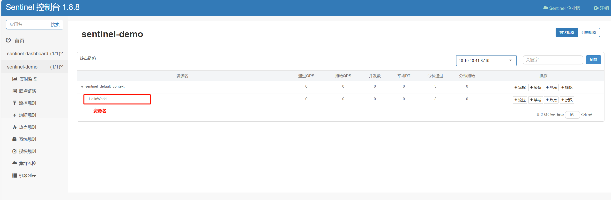
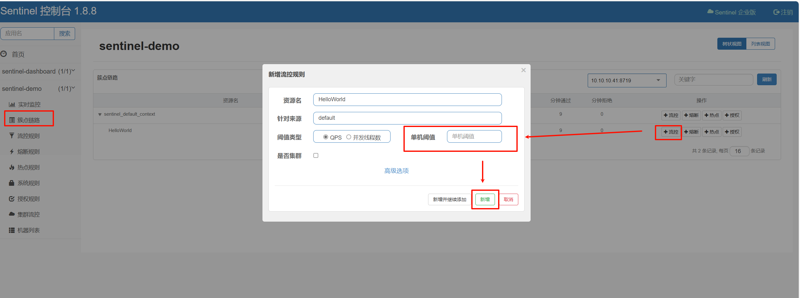

# Sentinel基础入门

> [quick-start | Sentinel (sentinelguard.io)](https://sentinelguard.io/zh-cn/docs/quick-start.html)

## 一. Sentinel概念

Sentinel 可以简单的分为 Sentinel 核心库和 Dashboard。核心库不依赖 Dashboard，但是结合 Dashboard 可以取得最好的效果。

我们说的资源，可以是任何东西，服务，服务里的方法，甚至是一段代码。使用 Sentinel 来进行资源保护，主要分为几个步骤:

1. 定义资源
2. 定义规则
3. 检验规则是否生效

先把可能需要保护的资源定义好，之后再配置规则。也可以理解为，只要有了资源，我们就可以在任何时候灵活地定义各种流量控制规则。在编码的时候，只需要考虑这个代码是否需要保护，如果需要保护，就将之定义为一个资源。

对于[主流的框架](https://sentinelguard.io/zh-cn/docs/open-source-framework-integrations.html)，我们提供适配，只需要按照适配中的说明配置，Sentinel 就会默认定义提供的服务，方法等为资源。

## 二. 快速入门

### 2.1 引入核心库依赖

如果您的应用使用了 Maven，则在 `pom.xml` 文件中加入以下代码即可：

```xml
<dependency>
    <groupId>com.alibaba.csp</groupId>
    <artifactId>sentinel-core</artifactId>
    <version>1.8.6</version>
</dependency>
```

### 2.2 定义资源

**资源** 是 Sentinel 中的核心概念之一。最常用的资源是我们代码中的 Java 方法。 

#### 2.2.1 调用API定义资源

使用 Sentinel API 我们可以灵活的定义资源。例如，把需要控制流量的代码用 `SphU.entry("HelloWorld")` 和 `entry.exit()` 包围起来即可。在下面的例子中，我们将 `System.out.println("hello world");` 作为资源（被保护的逻辑），用 API 包装起来。参考代码如下:

**抛出异常的方式定义资源**：

```java
@RequestMapping("/hello")
@ResponseBody
public String hello(@RequestParam(name = "name", defaultValue = "unknown user") String name) {
    Entry entry = null;
    // 务必保证finally会被执行
    try {
        // 资源名可使用任意有业务语义的字符串
        entry = SphU.entry("HelloWorld");
        return "Hello " + name;
        // 被保护的业务逻辑
        // do something...
    } catch (BlockException e1) {
        // 资源访问阻止，被限流或被降级
        // 进行相应的处理操作
        return "被限流降级了";
    } finally {
        if (entry != null) {
            entry.exit();
        }
    }
}
```

**返回布尔值方式定义资源**:

`SphO` 提供 if-else 风格的 API。用这种方式，当资源发生了限流之后会返回 `false`，这个时候可以根据返回值，进行限流之后的逻辑处理。示例代码如下:

```java
@RequestMapping("/hello")
@ResponseBody
public String hello(@RequestParam(name = "name", defaultValue = "unknown user") String name) {
    // 资源名可使用任意有业务语义的字符串
    if (SphO.entry("HelloWorld")) {
        // 务必保证finally会被执行
        try {
            /**
             * 被保护的业务逻辑
             */
            return "Hello " + name;
        } finally {
            SphO.exit();
        }
    } else {
        // 资源访问阻止，被限流或被降级
        // 进行相应的处理操作
        return "被限流降级了";
    }
}
```

#### 2.2.2 使用注解定义资源

第一步：导入注解支持模块依赖

```xml
<dependency>
    <groupId>com.alibaba.csp</groupId>
    <artifactId>sentinel-annotation-aspectj</artifactId>
    <version>1.8.6</version>
</dependency>
```

第二步：使用 `@SentinelResource` 注解定义资源

```java
@RequestMapping("/hello")
@SentinelResource(value = "HelloWorld", blockHandler = "helloBlockHandler")
@ResponseBody
public String hello(@RequestParam(name = "name", defaultValue = "unknown user") String name) {
    return "Hello " + name;
}

public String helloBlockHandler(String name, BlockException blockException) {
    return "被限流降级了";
}
```

`@SentinelResource` 用于定义资源，并提供可选的异常处理和 fallback 配置项。 `@SentinelResource` 注解包含以下属性：

- `value`：资源名称，必需项（不能为空）
- `entryType`：entry 类型，可选项（默认为 `EntryType.OUT`）
- `blockHandler` / `blockHandlerClass`: `blockHandler` 对应处理 `BlockException` 的函数名称，可选项。blockHandler 函数访问范围需要是 `public`，返回类型需要与原方法相匹配，参数类型需要和原方法相匹配并且最后加一个额外的参数，类型为 `BlockException`。blockHandler 函数默认需要和原方法在同一个类中。若希望使用其他类的函数，则可以指定 `blockHandlerClass` 为对应的类的 `Class` 对象，注意对应的函数必需为 static 函数，否则无法解析。
- `fallback`：fallback 函数名称，可选项，用于在抛出异常的时候提供 fallback 处理逻辑。fallback 函数可以针对所有类型的异常（除了 `exceptionsToIgnore` 里面排除掉的异常类型）进行处理。fallback 函数签名和位置要求：
  - 返回值类型必须与原函数返回值类型一致；
  - 方法参数列表需要和原函数一致，或者可以额外多一个 `Throwable` 类型的参数用于接收对应的异常。
  - fallback 函数默认需要和原方法在同一个类中。若希望使用其他类的函数，则可以指定 `fallbackClass` 为对应的类的 `Class` 对象，注意对应的函数必需为 static 函数，否则无法解析。
- `defaultFallback`（since 1.6.0）：默认的 fallback 函数名称，可选项，通常用于通用的 fallback 逻辑（即可以用于很多服务或方法）。默认 fallback 函数可以针对所以类型的异常（除了 `exceptionsToIgnore` 里面排除掉的异常类型）进行处理。若同时配置了 fallback 和 defaultFallback，则只有 fallback 会生效。defaultFallback 函数签名要求：
  - 返回值类型必须与原函数返回值类型一致；
  - 方法参数列表需要为空，或者可以额外多一个 `Throwable` 类型的参数用于接收对应的异常。
  - defaultFallback 函数默认需要和原方法在同一个类中。若希望使用其他类的函数，则可以指定 `fallbackClass` 为对应的类的 `Class` 对象，注意对应的函数必需为 static 函数，否则无法解析。
- `exceptionsToIgnore`（since 1.6.0）：用于指定哪些异常被排除掉，不会计入异常统计中，也不会进入 fallback 逻辑中，而是会原样抛出。

### 2.3 定义规则

Sentinel规则定义有两种方式，一种是使用 Sentinel Core API 在代码中定义规则，这种方式不依赖外部组件，但灵活性差；另一种我们可以使用Sentinel Dashboard 配置规则，这样我们只需要在代码中预先定义好资源，在需要的时候在Sentinel管理端配置相应的限流规则即可。

#### 2.3.1 使用 API 配置规则

Sentinel 的所有规则都可以在内存态中动态地查询及修改，修改之后立即生效。同时 Sentinel 也提供相关 API，供您来定制自己的规则策略。

通过流控规则来指定允许该资源通过的请求次数，例如下面的代码定义了资源 `HelloWorld` 每秒最多只能通过 1 个请求。

```java
private static void initFlowRules(){
    List<FlowRule> rules = new ArrayList<>();
    FlowRule rule = new FlowRule();
    rule.setResource("HelloWorld");
    rule.setGrade(RuleConstant.FLOW_GRADE_QPS);
    // Set limit QPS to 1.
    rule.setCount(1);
    rules.add(rule);
    FlowRuleManager.loadRules(rules);
}
```

#### 2.3.2 使用 Dashboard 配置规则

> [dashboard | Sentinel (sentinelguard.io)](https://sentinelguard.io/zh-cn/docs/dashboard.html)

Sentinel 提供一个轻量级的开源控制台，它提供机器发现以及健康情况管理、监控（单机和集群），规则管理和推送的功能。

- **查看机器列表以及健康情况**：收集 Sentinel 客户端发送的心跳包，用于判断机器是否在线。
- **监控 (单机和集群聚合)**：通过 Sentinel 客户端暴露的监控 API，定期拉取并且聚合应用监控信息，最终可以实现秒级的实时监控。
- **规则管理和推送**：统一管理推送规则。
- **鉴权**：生产环境中鉴权非常重要。这里每个开发者需要根据自己的实际情况进行定制。

**第一步：启动 Dashboard**

您可以从 [release 页面](https://github.com/alibaba/Sentinel/releases) 下载最新版本的控制台 jar 包。执行如下命令启动：

```shell
java -Dserver.port=8080 -Dcsp.sentinel.dashboard.server=localhost:8080 -Dproject.name=sentinel-dashboard -jar sentinel-dashboard.jar
```

**第二步：代码中引入 Dashboard 依赖**

```xml
<dependency>
    <groupId>com.alibaba.csp</groupId>
    <artifactId>sentinel-transport-simple-http</artifactId>
    <version>1.8.6</version>
</dependency>
```

**第三步：配置JVM启动参数**

启动时加入 JVM 参数 `-Dcsp.sentinel.dashboard.server=consoleIp:port` 指定控制台地址和端口。若启动多个应用，则需要通过 `-Dcsp.sentinel.api.port=xxxx` 指定客户端监控 API 的端口（默认是 8719）。

**第四步：启动业务代码**

启动业务代码，即在 Sentinel Dashboard 上看到注册的业务实例：



找到对应资源名，即可配置对应的流控规则:



但是需要注意的是，默认情况下 Sentinel Dashboard 推送的配置信息保存在业务服务的内存中，Sentinel Dashboard同样没有进行持久化，这也意味着业务服务一旦重启之前所配置的所有规则信息将会丢失。该问题我们会在后续文章中介绍解决方案。

### 2.4 测试限流是否生效


