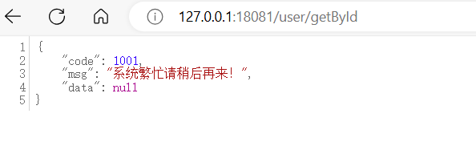

# Java Web 适配 Sentinel

> [open-source-framework-integrations | Sentinel (sentinelguard.io)](https://sentinelguard.io/zh-cn/docs/open-source-framework-integrations.html)

## 一. Web Servlet 支持

Sentinel 提供针对 Servlet 的原生整合，可以对 Web 请求进行流量控制。使用时需引入以下模块（以 Maven 为例）：

```xml
<dependency>
    <groupId>com.alibaba.csp</groupId>
    <artifactId>sentinel-web-servlet</artifactId>
    <version>x.y.z</version>
</dependency>
```

您只需要在 Web 容器中的 `web.xml` 配置文件中进行如下配置即可开启 Sentinel 支持：

```xml
<filter>
	<filter-name>SentinelCommonFilter</filter-name>
	<filter-class>com.alibaba.csp.sentinel.adapter.servlet.CommonFilter</filter-class>
</filter>

<filter-mapping>
	<filter-name>SentinelCommonFilter</filter-name>
	<url-pattern>/*</url-pattern>
</filter-mapping>
```

若是 Spring 应用可以通过 Spring 进行配置，例如：

```java
@Configuration
public class FilterConfig {

    @Bean
    public FilterRegistrationBean sentinelFilterRegistration() {
        FilterRegistrationBean<Filter> registration = new FilterRegistrationBean<>();
        registration.setFilter(new CommonFilter());
        registration.addUrlPatterns("/*");
        registration.setName("sentinelFilter");
        registration.setOrder(1);

        return registration;
    }
}
```

接入 filter 之后，所有访问的 Web URL 就会被自动统计为 Sentinel 的资源，可以针对单个 URL 维度进行流控。


若希望区分不同 HTTP Method，可以将 `HTTP_METHOD_SPECIFY` 这个 `init parameter` 设为 true，给每个 URL 资源加上前缀。

```java
@Configuration
public class FilterConfig {

    @Bean
    public FilterRegistrationBean sentinelFilterRegistration() {
        FilterRegistrationBean<Filter> registration = new FilterRegistrationBean<>();
        registration.setFilter(new CommonFilter());
        registration.addUrlPatterns("/*");
        registration.setName("sentinelFilter");
        registration.setOrder(1);
        registration.addInitParameter(CommonFilter.HTTP_METHOD_SPECIFY, "true");
        return registration;
    }
}
```

这样Sentinel控制台就能看到 `方法名+URL` 的资源点了：


**限流处理逻辑**：默认情况下，当请求被限流时会返回默认的提示页面 `Blocked by Sentinel (flow limiting)`。您也可以通过 JVM 参数 `-Dcsp.sentinel.web.servlet.block.page` 或代码中调用 `WebServletConfig.setBlockPage(blockPage)` 方法设定自定义的跳转 URL，当请求被限流时会自动跳转至设定好的 URL。同样您也可以实现 `UrlBlockHandler` 接口并编写定制化的限流处理逻辑，然后将其注册至 `WebCallbackManager` 中。

> 提示：1.7.0 版本开始默认的限流页面 HTTP 返回码是 **429**。您可以通过 `csp.sentinel.web.servlet.block.status` 配置项自定义限流页面的 HTTP 状态码。

**按来源限流**：若希望对 HTTP 请求按照来源限流，则可以自己实现 `RequestOriginParser` 接口从 HTTP 请求中解析 origin 并注册至 `WebCallbackManager` 中。**注意来源数目不能太多，若太多请自定义埋点作为参数传入并使用热点规则。**

## 二. SpringMVC 支持

如果我们使用的是 SpingMVC 框架，则可以使用 `sentinel-spring-webmvc-adapter` 完成相同的的效果。

**第一步：引入依赖**

```xml
<!-- Sentinel 对 SpringMVC 的支持 -->
<dependency>
    <groupId>com.alibaba.csp</groupId>
    <artifactId>sentinel-spring-webmvc-adapter</artifactId>
    <version>1.8.6</version>
</dependency>
```

**第二步：配置 SpringMVC Interceptor**

```java
@Configuration
public class SpringMvcConfiguration implements WebMvcConfigurer {

    @Override
    public void addInterceptors(InterceptorRegistry registry) {
		addSentinelWebTotalInterceptor(registry);
        addSentinelWebInterceptor(registry);
    }

    private void addSentinelWebInterceptor(InterceptorRegistry registry) {
        // 创建 SentinelWebMvcConfig 对象
        SentinelWebMvcConfig config = new SentinelWebMvcConfig();
        // 是否包含请求方法。即基于 URL 创建的资源，是否包含 Method。
        config.setHttpMethodSpecify(true); 
        // config.setBlockExceptionHandler(new DefaultBlockExceptionHandler()); // <1.3> 设置 BlockException 处理器。

        // 添加 SentinelWebInterceptor 拦截器
        registry.addInterceptor(new SentinelWebInterceptor(config)).addPathPatterns("/**");
    }

    private void addSentinelWebTotalInterceptor(InterceptorRegistry registry) {
        // 创建 SentinelWebMvcTotalConfig 对象
        SentinelWebMvcTotalConfig config = new SentinelWebMvcTotalConfig();

        // 添加 SentinelWebTotalInterceptor 拦截器
        registry.addInterceptor(new SentinelWebTotalInterceptor(config)).addPathPatterns("/**");
    }

}
```

- `addSentinelWebTotalInterceptor(InterceptorRegistry registry)` 方法，添加 [SentinelWebTotalInterceptor](https://github.com/alibaba/Sentinel/blob/master/sentinel-adapter/sentinel-spring-webmvc-adapter/src/main/java/com/alibaba/csp/sentinel/adapter/spring/webmvc/SentinelWebTotalInterceptor.java) 拦截器，它针对**每个** URL 进行流量控制。
- `addSentinelWebInterceptor(InterceptorRegistry registry)` 方法，添加 [SentinelWebInterceptor](https://github.com/alibaba/Sentinel/blob/master/sentinel-adapter/sentinel-spring-webmvc-adapter/src/main/java/com/alibaba/csp/sentinel/adapter/spring/webmvc/SentinelWebInterceptor.java) 拦截器它针对**全局** URL 进行流量控制。简单来说，所有 URL 合计流量，全局统一进行控制。

这样启动Spring容器后，一旦有请求进入拦截器，就会向控制台上报资源点：


**第三步：配合SpringMVC全局异常拦截实现降级逻辑统一处理**

```java
package cn.bigcoder.demo.sentinel.sentineldemo.demos.config;

import cn.bigcoder.demo.sentinel.sentineldemo.demos.vo.ResultVO;
import com.alibaba.csp.sentinel.slots.block.BlockException;
import org.springframework.web.bind.annotation.ControllerAdvice;
import org.springframework.web.bind.annotation.ExceptionHandler;
import org.springframework.web.bind.annotation.ResponseBody;

@ControllerAdvice
public class GlobalExceptionHandler {

    @ResponseBody
    @ExceptionHandler(value = BlockException.class)
    public ResultVO blockExceptionHandler(BlockException blockException) {
        // 和业务方约定好接口 1001 代表访问被限流
        return ResultVO.error(1001);
    }

}
```

这样当接口被限流拦截后抛出 `BlockException` 时，会被这个handler处理，并返回一个统一结构的错误码。



