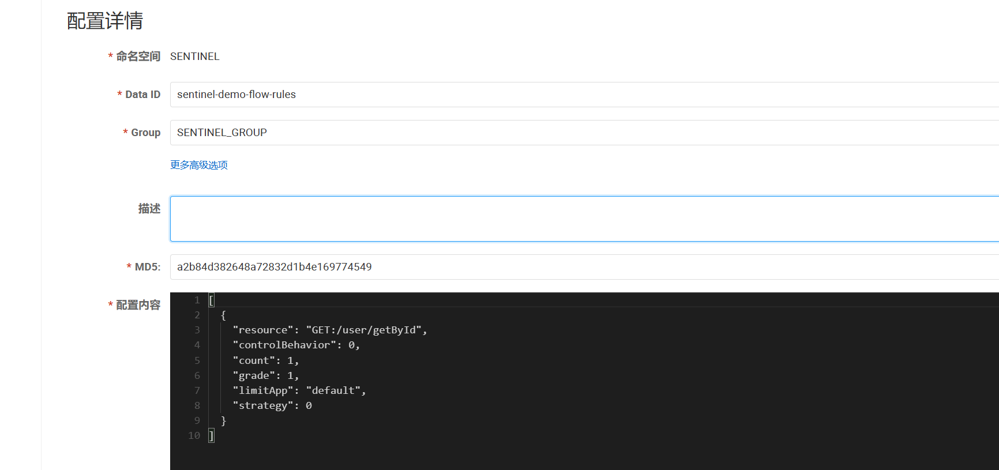

# Sentinel Dashboard 借助 Nacos 实现配置持久化

## 一. 概述

Sentinel客户端默认情况下接收到 Dashboard 推送的规则配置后，可以实时生效。但是有一个致命缺陷，Dashboard和业务服务并没有持久化这些配置，当业务服务重启后，这些规则配置将全部丢失。

Sentinel 提供两种方式修改规则：

- 通过 API 直接修改 (`loadRules`)
- 通过 `DataSource` 适配不同数据源修改

通过 API 修改比较直观，可以通过以下几个 API 修改不同的规则：

```java
FlowRuleManager.loadRules(List<FlowRule> rules); // 修改流控规则
DegradeRuleManager.loadRules(List<DegradeRule> rules); // 修改降级规则
```

手动修改规则（硬编码方式）一般仅用于测试和演示，生产上一般通过动态规则源的方式来动态管理规则。

上述 `loadRules()` 方法只接受内存态的规则对象，但更多时候规则存储在文件、数据库或者配置中心当中。`DataSource` 接口给我们提供了对接任意配置源的能力。相比直接通过 API 修改规则，实现 `DataSource` 接口是更加可靠的做法。

我们推荐**通过控制台设置规则后将规则推送到统一的规则中心，客户端实现** `ReadableDataSource` **接口端监听规则中心实时获取变更**，流程如下：


`DataSource` 扩展常见的实现方式有:

- **拉模式**：客户端主动向某个规则管理中心定期轮询拉取规则，这个规则中心可以是 RDBMS、文件，甚至是 VCS 等。这样做的方式是简单，缺点是无法及时获取变更；
- **推模式**：规则中心统一推送，客户端通过注册监听器的方式时刻监听变化，比如使用 [Nacos](https://github.com/alibaba/nacos)、Zookeeper 等配置中心。这种方式有更好的实时性和一致性保证。

Sentinel 目前支持以下数据源扩展：

- Pull-based: 动态文件数据源、[Consul](https://github.com/alibaba/Sentinel/tree/master/sentinel-extension/sentinel-datasource-consul), [Eureka](https://github.com/alibaba/Sentinel/tree/master/sentinel-extension/sentinel-datasource-eureka)
- Push-based: [ZooKeeper](https://github.com/alibaba/Sentinel/tree/master/sentinel-extension/sentinel-datasource-zookeeper), [Redis](https://github.com/alibaba/Sentinel/tree/master/sentinel-extension/sentinel-datasource-redis), [Nacos](https://github.com/alibaba/Sentinel/tree/master/sentinel-extension/sentinel-datasource-nacos), [Apollo](https://github.com/alibaba/Sentinel/tree/master/sentinel-extension/sentinel-datasource-apollo), [etcd](https://github.com/alibaba/Sentinel/tree/master/sentinel-extension/sentinel-datasource-etcd)

> Sentinel开源版在Push模式下只实现了 路径2，也就是Nacos到业务服务之间的规则同步；路径1 Dashboard配置修改写入Nacos并没有实现，在后文中我们会介绍如何修改 Dashboard 源码完成配置的写入。

## 二. 从 Nacos 加载规则配置

首先，我们先来看看如何使用Sentinel官方提供的 `sentinel-datasource-nacos` 从Nacos加载规则配置。

第一步：引入依赖

```xml
<dependency>
    <groupId>com.alibaba.csp</groupId>
    <artifactId>sentinel-datasource-nacos</artifactId>
    <version>1.8.6</version>
</dependency>
```

第二步：配置规则自动加载

```java
package cn.bigcoder.demo.sentinel.sentineldemo.demos.config;

import com.alibaba.csp.sentinel.datasource.ReadableDataSource;
import com.alibaba.csp.sentinel.datasource.nacos.NacosDataSource;
import com.alibaba.csp.sentinel.slots.block.flow.FlowRule;
import com.alibaba.csp.sentinel.slots.block.flow.FlowRuleManager;
import com.alibaba.fastjson.JSON;
import com.alibaba.fastjson.TypeReference;
import com.alibaba.nacos.api.PropertyKeyConst;
import java.util.List;
import java.util.Properties;
import org.springframework.context.ApplicationListener;
import org.springframework.context.event.ContextRefreshedEvent;
import org.springframework.stereotype.Component;

@Component
public class SentinelRuleConfiguration implements ApplicationListener<ContextRefreshedEvent> {

    private static final String remoteAddress = "10.10.10.12:8848";
    // nacos group
    private static final String groupId = "SENTINEL_GROUP";
    // nacos dataId
    private static final String dataId = "sentinel-demo";

//    private static final String NACOS_NAMESPACE_ID = "sentinel-config";

    @Override
    public void onApplicationEvent(ContextRefreshedEvent event) {
        Properties properties = new Properties();
        properties.put(PropertyKeyConst.SERVER_ADDR, remoteAddress);
//        properties.put(PropertyKeyConst.NAMESPACE, NACOS_NAMESPACE_ID);

        ReadableDataSource<String, List<FlowRule>> flowRuleDataSource = new NacosDataSource<>(properties, groupId,
                dataId,
                source -> JSON.parseObject(source, new TypeReference<List<FlowRule>>() {
                }));
        FlowRuleManager.register2Property(flowRuleDataSource.getProperty());
    }
}
```

第三步：往Nacos中写入配置

```java
import com.alibaba.nacos.api.NacosFactory;
import com.alibaba.nacos.api.config.ConfigService;

/**
 * Nacos config sender for demo.
 *
 * @author Eric Zhao
 */
public class NacosConfigSender {

    public static void main(String[] args) throws Exception {
        // nacos地址
        final String remoteAddress = "10.10.10.12:8848";
        final String groupId = "SENTINEL_GROUP";
        final String dataId = "sentinel-demo";
        final String rule = "[\n"
            + "  {\n"
            + "    \"resource\": \"GET:/user/getById\",\n"
            + "    \"controlBehavior\": 0,\n"
            + "    \"count\": 1,\n"
            + "    \"grade\": 1,\n"
            + "    \"limitApp\": \"default\",\n"
            + "    \"strategy\": 0\n"
            + "  }\n"
            + "]";
        ConfigService configService = NacosFactory.createConfigService(remoteAddress);
        System.out.println(configService.publishConfig(dataId, groupId, rule));
    }
}
```

执行完后，Nacos中就会出现对应的配置：



第四步：启动项目，验证规则配置是否生效

访问 [http://127.0.0.1:8719/getParamRules?type=flow](http://127.0.0.1:8719/getParamRules?type=flow) 即可看到业务服务内存中加载到的规则配置


并发执行 `/user/getById` 接口，可以发现接口被成功限流，1s内的10次请求，只有一次成功。


## 三. Dashboard存在的问题

使用此方案虽然解决了配置规则配置持久化的问题，但是在Dashboard上修改配置仍然是通过业务服务暴露的接口进行的配置同步。业务服务既可以接收 Nacos 配置变更，又可以接收Dashboard的配置变更，控制台的变更的配置并没有同步到Nacos，应用重启后Sentinel控制台修改的配置仍然会全部丢失：


一个理想的情况是Sentinel控制台规则配置读取至 Nacos 而不是内存，在控制台修改/新增的配置写入Nacos，当Nacos配置发生变更时，配置进而自动同步至业务服务：


当然存储媒介可以根据情况选用别的组件：[ZooKeeper](https://github.com/alibaba/Sentinel/tree/master/sentinel-extension/sentinel-datasource-zookeeper), [Redis](https://github.com/alibaba/Sentinel/tree/master/sentinel-extension/sentinel-datasource-redis), [Apollo](https://github.com/alibaba/Sentinel/tree/master/sentinel-extension/sentinel-datasource-apollo), [etcd](https://github.com/alibaba/Sentinel/tree/master/sentinel-extension/sentinel-datasource-etcd)

很可惜的是，阿里官方开源的Sentinel控制台并没有实现将规则配置写入其他中间件的能力。它默认只支持将配置实时推送至业务服务，所以我们在生产环境中想要使用 Sentinel Dashboard 需要自行修改其源码，将其配置同步逻辑改为写入我们所需要的中间件中。

## 四. 修改Sentinel Dashboard源码

### 4.1 准备工作

首先通过git拉取下载源码，导入idea工程：

[https://github.com/alibaba/Sentinel](https://github.com/alibaba/Sentinel)

#### 4.1.1 流控规则接口

Sentinel Dashboard的流控规则下的所有操作，都会调用Sentinel-Dashboard源码中的FlowControllerV1类，这个类中包含流控规则本地化的CRUD操作:


在com.alibaba.csp.sentinel.dashboard.controller.v2包下存在一个FlowControllerV2；类，这个类同样提供流控规则的CURD，与V1不同的是，**它可以实现指定数据源的规则拉取和发布**。

```java
@RestController
@RequestMapping(value = "/v2/flow")
public class FlowControllerV2 {

    private final Logger logger = LoggerFactory.getLogger(FlowControllerV2.class);

    @Autowired
    private InMemoryRuleRepositoryAdapter<FlowRuleEntity> repository;

    @Autowired
    @Qualifier("flowRuleNacosProvider")
    private DynamicRuleProvider<List<FlowRuleEntity>> ruleProvider;
    @Autowired
    @Qualifier("flowRuleNacosPublisher")
    private DynamicRulePublisher<List<FlowRuleEntity>> rulePublisher;
    
    //....
}
```

> **官方说明：从 Sentinel 1.4.0 开始，我们抽取出了接口用于向远程配置中心推送规则以及拉取规则。**
>
> - **`DynamicRuleProvider<T>`: 拉取规则**
> - **`DynamicRulePublisher<T>`: 推送规则**
>
> **以 Nacos 为例，若希望使用 Nacos 作为动态规则配置中心，用户可以提取出相关的类，然后只需在 `FlowControllerV2` 中指定对应的 bean 即可开启 Nacos 适配**

FlowControllerV2依赖两个非常重要的类

- **DynamicRuleProvider：动态规则的拉取，从指定数据源中获取控制后在Sentinel Dashboard中展示。**
- **DynamicRulePublisher：动态规则发布，将在Sentinel Dashboard中修改的规则同步到指定数据源中。**

**只需要扩展这两个类，然后集成Nacos来实现Sentinel Dashboard规则同步**。

#### 4.1.2 需要改造的页面入口

簇点链路:


由于该页面的“流控”配置是对单节点进行配置的，所以理论上该页面的URL是不用改的

流控规则：


上述位置我们都需要改造对应前端代码，使之调用的接口更改为我们新的V2接口上。

### 4.2 源码改造

#### 4.2.1 在pom.xml文件中去掉test scope注释

这是因为官方提供的Nacos持久化用例都是在test目录下，所以scope需要去除test，需要sentinel-datasource-nacos包的支持。之后将修改好的源码放在源码主目录下，而不是继续在test目录下。

```xml
<dependency>
    <groupId>com.alibaba.csp</groupId>
    <artifactId>sentinel-datasource-nacos</artifactId>
    <!--<scope>test</scope>-->
</dependency>
```

#### 4.2.2 创建Nacos配置

我们采用官方的约束，即默认 Nacos 适配的 dataId 和 groupId 约定如下：

- groupId: SENTINEL_GROUP
- 流控规则 dataId: {appName}-flow-rules，比如应用名为 appA，则 dataId 为 appA-flow-rules

所以不需要修改NacosConfigUtil.java了，但这是展示是为了步骤的完整性。

```java
package com.alibaba.csp.sentinel.dashboard.rule.nacos;

import org.springframework.boot.context.properties.ConfigurationProperties;

@ConfigurationProperties(prefix = "sentinel.nacos")
public class NacosPropertiesConfiguration {
    private String serverAddr;
    private String groupId = "SENTINEL_GROUP"; // 默认分组
    private String namespace;
   // 省略 getter/setter  
}
```

然后配置sentinel-dashboar/resources/application.properties中配置nacos配置，以为sentinel.nacos为前缀：

```properties
# nacos config server
sentinel.nacos.serverAddr=127.0.0.1:8848
sentinel.nacos.namespace=
sentinel.nacos.group-id=SENTINEL-GROUP
```

#### 4.2.3 改造NacosConfig，创建NacosConfigService

```java
package com.alibaba.csp.sentinel.dashboard.config;

import com.alibaba.csp.sentinel.dashboard.datasource.entity.rule.FlowRuleEntity;
import com.alibaba.csp.sentinel.datasource.Converter;
import com.alibaba.fastjson.JSON;
import com.alibaba.nacos.api.PropertyKeyConst;
import com.alibaba.nacos.api.config.ConfigFactory;
import com.alibaba.nacos.api.config.ConfigService;
import java.util.List;
import java.util.Properties;
import org.springframework.boot.context.properties.EnableConfigurationProperties;
import org.springframework.context.annotation.Bean;
import org.springframework.context.annotation.Configuration;

@EnableConfigurationProperties(NacosPropertiesConfiguration.class)
@Configuration
public class NacosConfig {

    @Bean
    public Converter<List<FlowRuleEntity>, String> flowRuleEntityEncoder() {
        return JSON::toJSONString;
    }

    @Bean
    public Converter<String, List<FlowRuleEntity>> flowRuleEntityDecoder() {
        return s -> JSON.parseArray(s, FlowRuleEntity.class);
    }

    @Bean
    public ConfigService nacosConfigService(NacosPropertiesConfiguration nacosPropertiesConfiguration)
            throws Exception {
        Properties properties = new Properties();
        properties.put(PropertyKeyConst.SERVER_ADDR, nacosPropertiesConfiguration.getServerAddr());
        properties.put(PropertyKeyConst.NAMESPACE, nacosPropertiesConfiguration.getNamespace());
        return ConfigFactory.createConfigService(properties);
    }
}
```

NacosConfig主要做两件事：

1） 注入Convert转换器，将 `FlowRuleEntity` 使用序列化为JSON字符串，以及将JSON字符串反序列化为 `FlowRuleEntity`。

2） 注入Nacos配置服务ConfigService

#### 4.2.4 实现 DynamicRulePublisher 和 DynamicRuleProvider 接口完成配置的持久化和远程加载

在 test 包下，已经有Sentinel官方的实现了，我们只需要将其拷贝至 `src` 目录下即可：


FlowRuleNacosProvider：用于从Nacos中拉取规则配置。

```java
package com.alibaba.csp.sentinel.dashboard.rule;

import com.alibaba.csp.sentinel.dashboard.datasource.entity.rule.FlowRuleEntity;
import com.alibaba.csp.sentinel.dashboard.util.NacosConfigUtil;
import com.alibaba.csp.sentinel.datasource.Converter;
import com.alibaba.csp.sentinel.util.StringUtil;
import com.alibaba.nacos.api.config.ConfigService;
import java.util.ArrayList;
import java.util.List;
import org.springframework.beans.factory.annotation.Autowired;
import org.springframework.stereotype.Component;

/**
 * @author Eric Zhao
 * @since 1.4.0
 */
@Component("flowRuleNacosProvider")
public class FlowRuleNacosProvider implements DynamicRuleProvider<List<FlowRuleEntity>> {

    @Autowired
    private ConfigService configService;
    @Autowired
    private Converter<String, List<FlowRuleEntity>> converter;

    @Override
    public List<FlowRuleEntity> getRules(String appName) throws Exception {
        String rules = configService.getConfig(appName + NacosConfigUtil.FLOW_DATA_ID_POSTFIX,
            NacosConfigUtil.GROUP_ID, 3000);
        if (StringUtil.isEmpty(rules)) {
            return new ArrayList<>();
        }
        return converter.convert(rules);
    }
}

```

FlowRuleNacosPublisher：用于将配置保存至Nacos中

```java
package com.alibaba.csp.sentinel.dashboard.rule;

import com.alibaba.csp.sentinel.dashboard.datasource.entity.rule.FlowRuleEntity;
import com.alibaba.csp.sentinel.dashboard.util.NacosConfigUtil;
import com.alibaba.csp.sentinel.datasource.Converter;
import com.alibaba.csp.sentinel.util.AssertUtil;
import com.alibaba.nacos.api.config.ConfigService;
import java.util.List;
import org.springframework.beans.factory.annotation.Autowired;
import org.springframework.stereotype.Component;

/**
 * @author Eric Zhao
 * @since 1.4.0
 */
@Component("flowRuleNacosPublisher")
public class FlowRuleNacosPublisher implements DynamicRulePublisher<List<FlowRuleEntity>> {

    @Autowired
    private ConfigService configService;
    @Autowired
    private Converter<List<FlowRuleEntity>, String> converter;

    @Override
    public void publish(String app, List<FlowRuleEntity> rules) throws Exception {
        AssertUtil.notEmpty(app, "app name cannot be empty");
        if (rules == null) {
            return;
        }
        configService.publishConfig(app + NacosConfigUtil.FLOW_DATA_ID_POSTFIX,
            NacosConfigUtil.GROUP_ID, converter.convert(rules));
    }
}
```

#### 4.2.5 修改FlowControllerV2类将Nacos实现类注入进去


```java
@RestController
@RequestMapping(value = "/v2/flow")
public class FlowControllerV2 {

    private final Logger logger = LoggerFactory.getLogger(FlowControllerV2.class);

    @Autowired
    private InMemoryRuleRepositoryAdapter<FlowRuleEntity> repository;

    @Autowired
    @Qualifier("flowRuleNacosProvider")
    private DynamicRuleProvider<List<FlowRuleEntity>> ruleProvider;
    @Autowired
    @Qualifier("flowRuleNacosPublisher")
    private DynamicRulePublisher<List<FlowRuleEntity>> rulePublisher;

    // 省略      
}
```

到这里所有流控规则相关的后端接口都已经改造完毕，我们需要接着改造前端页面，将页面请求的接口全部换成V2新接口。

#### 4.2.6 修改前端路由配置（sidebar.html）

找到 `resources/app/scripts/directives/sidebar/sidebar.html` 文件，该文件是用来渲染左侧路由的：


我们需要将 “流控规则” 路由跳转的页面由 `app/views/flow_v1.html` 更换为 `app/views/flow_v2.html`，因为 `flow_v2.html` 页面中调用的后端接口全部都是 v2接口。

修改flowV1为flow，去掉V1，这样的话会调用FlowControllerV2接口

```html
<!--<li ui-sref-active="active" ng-if="!entry.isGateway">
  <a ui-sref="dashboard.flowV1({app: entry.app})">
    <i class="glyphicon glyphicon-filter"></i>&nbsp;&nbsp;流控规则</a>
</li>-->
<!-- 修改为flow，直接调用FlowControllerV2 -->
<li ui-sref-active="active" ng-if="!entry.isGateway">
  <a ui-sref="dashboard.flow({app: entry.app})">
    <i class="glyphicon glyphicon-filter"></i>&nbsp;&nbsp;流控规则</a>
</li>
```

这样就可以通过js跳转至FlowControllerV2了

```js
      .state('dashboard.flow', {
          templateUrl: 'app/views/flow_v2.html',
          url: '/v2/flow/:app',
          controller: 'FlowControllerV2',
          resolve: {
              loadMyFiles: ['$ocLazyLoad', function ($ocLazyLoad) {
                  return $ocLazyLoad.load({
                      name: 'sentinelDashboardApp',
                      files: [
                          'app/scripts/controllers/flow_v2.js',
                      ]
                  });
              }]
          }
      })
```

