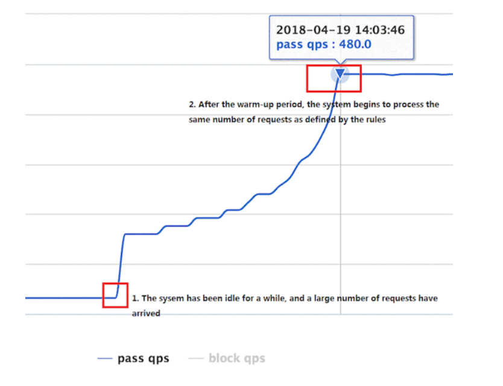
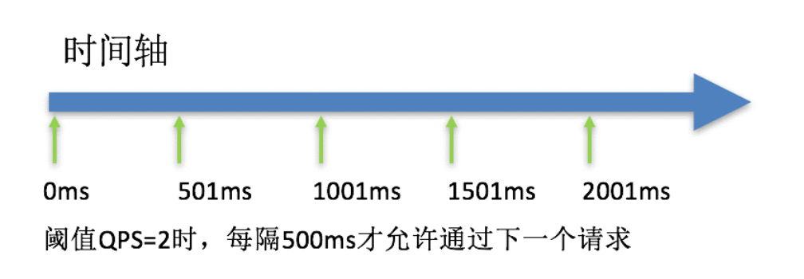
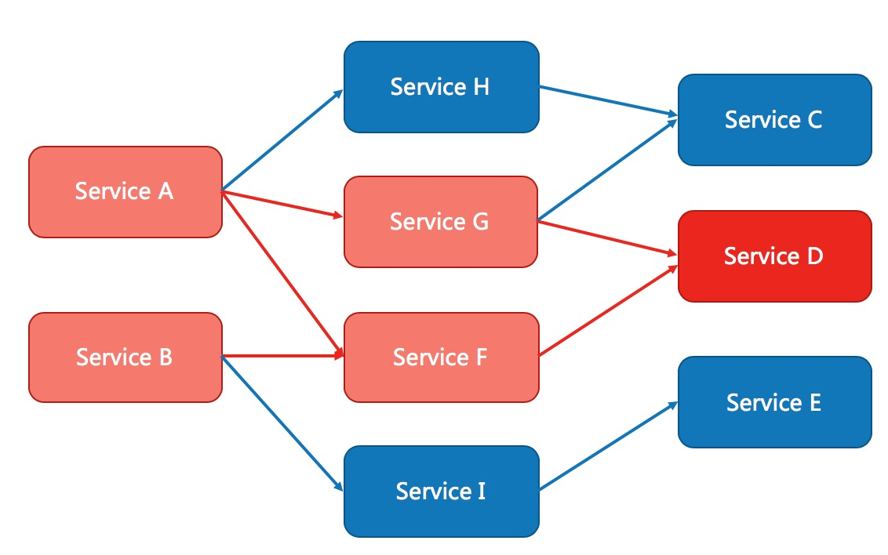
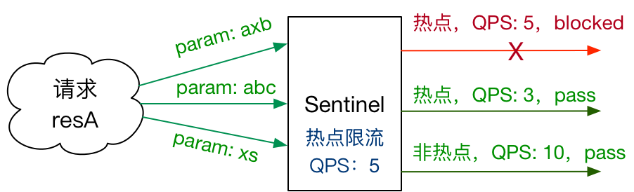

# Sentinel规则

Sentinel 的所有规则都可以在内存态中动态地查询及修改，修改之后立即生效。同时 Sentinel 也提供相关 API，供您来定制自己的规则策略。

Sentinel 支持以下几种规则：**流量控制规则**、**熔断降级规则**、**系统保护规则**、**来源访问控制规则** 和 **热点参数规则**。

## 一. 流量控制规则 (FlowRule)

限流的直接表现是在执行 `Entry nodeA = SphU.entry(资源名字)` 的时候抛出 `FlowException` 异常。`FlowException` 是 `BlockException` 的子类，您可以捕捉 `BlockException` 来自定义被限流之后的处理逻辑。

同一个资源可以对应多条限流规则。`FlowSlot` 会对该资源的所有限流规则依次遍历，直到有规则触发限流或者所有规则遍历完毕。

一条限流规则主要由下面几个因素组成，我们可以组合这些元素来实现不同的限流效果：

- `resource`：资源名，即限流规则的作用对象
- `count`: 限流阈值
- `grade`: 限流阈值类型，QPS 或线程数
- `strategy`: 根据调用关系选择策略

### 1.1 并发线程数流量控制

线程数限流用于保护业务线程数不被耗尽。例如，当应用所依赖的下游应用由于某种原因导致服务不稳定、响应延迟增加，对于调用者来说，意味着吞吐量下降和更多的线程数占用，极端情况下甚至导致线程池耗尽。为应对高线程占用的情况，业内有使用隔离的方案，比如通过不同业务逻辑使用不同线程池来隔离业务自身之间的资源争抢（线程池隔离），或者使用信号量来控制同时请求的个数（信号量隔离）。这种隔离方案虽然能够控制线程数量，但无法控制请求排队时间。当请求过多时排队也是无益的，直接拒绝能够迅速降低系统压力。Sentinel线程数限流不负责创建和管理线程池，而是简单统计当前请求上下文的线程个数，如果超出阈值，新的请求会被立即拒绝。

例子参见：[ThreadDemo](https://github.com/alibaba/Sentinel/blob/master/sentinel-demo/sentinel-demo-basic/src/main/java/com/alibaba/csp/sentinel/demo/flow/FlowThreadDemo.java)

### 1.2 QPS流量控制

当 QPS 超过某个阈值的时候，则采取措施进行流量控制。流量控制的手段包括下面 3 种，对应 `FlowRule` 中的 `controlBehavior` 字段：

1. 直接拒绝（`RuleConstant.CONTROL_BEHAVIOR_DEFAULT`）方式。该方式是默认的流量控制方式，当QPS超过任意规则的阈值后，新的请求就会被立即拒绝，拒绝方式为抛出`FlowException`。这种方式适用于对系统处理能力确切已知的情况下，比如通过压测确定了系统的准确水位时。具体的例子参见 [FlowqpsDemo](https://github.com/alibaba/Sentinel/blob/master/sentinel-demo/sentinel-demo-basic/src/main/java/com/alibaba/csp/sentinel/demo/flow/FlowQpsDemo.java)。

2. 冷启动（`RuleConstant.CONTROL_BEHAVIOR_WARM_UP`）方式。该方式主要用于系统长期处于低水位的情况下，当流量突然增加时，直接把系统拉升到高水位可能瞬间把系统压垮。通过"冷启动"，让通过的流量缓慢增加，在一定时间内逐渐增加到阈值上限，给冷系统一个预热的时间，避免冷系统被压垮的情况。具体的例子参见 [WarmUpFlowDemo](https://github.com/alibaba/Sentinel/blob/master/sentinel-demo/sentinel-demo-basic/src/main/java/com/alibaba/csp/sentinel/demo/flow/WarmUpFlowDemo.java)。

   通常冷启动的过程系统允许通过的 QPS 曲线如下图所示：



3. 匀速器（`RuleConstant.CONTROL_BEHAVIOR_RATE_LIMITER`）方式。这种方式严格控制了请求通过的间隔时间，也即是让请求以均匀的速度通过，对应的是漏桶算法。具体的例子参见 [PaceFlowDemo](https://github.com/alibaba/Sentinel/blob/master/sentinel-demo/sentinel-demo-basic/src/main/java/com/alibaba/csp/sentinel/demo/flow/PaceFlowDemo.java)。

   该方式的作用如下图所示：



## 二. 熔断降级

除了流量控制以外，对调用链路中不稳定的资源进行熔断降级也是保障高可用的重要措施之一。一个服务常常会调用别的模块，可能是另外的一个远程服务、数据库，或者第三方 API 等。例如，支付的时候，可能需要远程调用银联提供的 API；查询某个商品的价格，可能需要进行数据库查询。然而，这个被依赖服务的稳定性是不能保证的。如果依赖的服务出现了不稳定的情况，请求的响应时间变长，那么调用服务的方法的响应时间也会变长，线程会产生堆积，最终可能耗尽业务自身的线程池，服务本身也变得不可用。



现代微服务架构都是分布式的，由非常多的服务组成。不同服务之间相互调用，组成复杂的调用链路。以上的问题在链路调用中会产生放大的效果。复杂链路上的某一环不稳定，就可能会层层级联，最终导致整个链路都不可用。因此我们需要对不稳定的**弱依赖服务调用**进行熔断降级，暂时切断不稳定调用，避免局部不稳定因素导致整体的雪崩。熔断降级作为保护自身的手段，通常在客户端（调用端）进行配置。

### 2.1 熔断策略

Sentinel 提供以下几种熔断策略：

- 慢调用比例 (`SLOW_REQUEST_RATIO`)：选择以慢调用比例作为阈值，需要设置允许的慢调用 RT（即最大的响应时间），请求的响应时间大于该值则统计为慢调用。当单位统计时长（`statIntervalMs`）内请求数目大于设置的最小请求数目，并且慢调用的比例大于阈值，则接下来的熔断时长内请求会自动被熔断。经过熔断时长后熔断器会进入探测恢复状态（HALF-OPEN 状态），若接下来的一个请求响应时间小于设置的慢调用 RT 则结束熔断，若大于设置的慢调用 RT 则会再次被熔断。
- 异常比例 (`ERROR_RATIO`)：当单位统计时长（`statIntervalMs`）内请求数目大于设置的最小请求数目，并且异常的比例大于阈值，则接下来的熔断时长内请求会自动被熔断。经过熔断时长后熔断器会进入探测恢复状态（HALF-OPEN 状态），若接下来的一个请求成功完成（没有错误）则结束熔断，否则会再次被熔断。异常比率的阈值范围是 `[0.0, 1.0]`，代表 0% - 100%。
- 异常数 (`ERROR_COUNT`)：当单位统计时长内的异常数目超过阈值之后会自动进行熔断。经过熔断时长后熔断器会进入探测恢复状态（HALF-OPEN 状态），若接下来的一个请求成功完成（没有错误）则结束熔断，否则会再次被熔断。

注意异常降级**仅针对业务异常**，对 Sentinel 限流降级本身的异常（`BlockException`）不生效。为了统计异常比例或异常数，需要通过 `Tracer.trace(ex)` 记录业务异常。示例：

```java
Entry entry = null;
try {
  entry = SphU.entry(resource);

  // Write your biz code here.
  // <<BIZ CODE>>
} catch (Throwable t) {
  if (!BlockException.isBlockException(t)) {
    Tracer.trace(t);
  }
} finally {
  if (entry != null) {
    entry.exit();
  }
}
```

开源整合模块，如 Sentinel Dubbo Adapter, Sentinel Web Servlet Filter 或 `@SentinelResource` 注解会自动统计业务异常，无需手动调用。

### 2.1 熔断降级配置

熔断降级规则（DegradeRule）包含下面几个重要的属性：

|       Field        | 说明                                                         | 默认值     |
| :----------------: | :----------------------------------------------------------- | :--------- |
|      resource      | 资源名，即规则的作用对象                                     |            |
|       grade        | 熔断策略，支持慢调用比例/异常比例/异常数策略                 | 慢调用比例 |
|       count        | 慢调用比例模式下为慢调用临界 RT（超出该值计为慢调用）；异常比例/异常数模式下为对应的阈值 |            |
|     timeWindow     | 熔断时长，单位为 s                                           |            |
|  minRequestAmount  | 熔断触发的最小请求数，请求数小于该值时即使异常比率超出阈值也不会熔断（1.7.0 引入） | 5          |
|   statIntervalMs   | 统计时长（单位为 ms），如 60*1000 代表分钟级（1.8.0 引入）   | 1000 ms    |
| slowRatioThreshold | 慢调用比例阈值，仅慢调用比例模式有效（1.8.0 引入）           |            |

## 三. 系统自适应保护

Sentinel 系统自适应保护从整体维度对应用入口流量进行控制，结合应用的 Load、总体平均 RT、入口 QPS 和线程数等几个维度的监控指标，让系统的入口流量和系统的负载达到一个平衡，让系统尽可能跑在最大吞吐量的同时保证系统整体的稳定性。

在开始之前，先回顾一下 Sentinel 做系统自适应保护的目的：

- 保证系统不被拖垮
- 在系统稳定的前提下，保持系统的吞吐量

长期以来，系统自适应保护的思路是根据硬指标，即系统的负载 (load1) 来做系统过载保护。当系统负载高于某个阈值，就禁止或者减少流量的进入；当 load 开始好转，则恢复流量的进入。这个思路给我们带来了不可避免的两个问题：

- load 是一个“果”，如果根据 load 的情况来调节流量的通过率，那么就始终有延迟性。也就意味着通过率的任何调整，都会过一段时间才能看到效果。当前通过率是使 load 恶化的一个动作，那么也至少要过 1 秒之后才能观测到；同理，如果当前通过率调整是让 load 好转的一个动作，也需要 1 秒之后才能继续调整，这样就浪费了系统的处理能力。所以我们看到的曲线，总是会有抖动。
- 恢复慢。想象一下这样的一个场景（真实），出现了这样一个问题，下游应用不可靠，导致应用 RT 很高，从而 load 到了一个很高的点。过了一段时间之后下游应用恢复了，应用 RT 也相应减少。这个时候，其实应该大幅度增大流量的通过率；但是由于这个时候 load 仍然很高，通过率的恢复仍然不高。

[TCP BBR](https://en.wikipedia.org/wiki/TCP_congestion_control#TCP_BBR) 的思想给了我们一个很大的启发。我们应该根据系统能够处理的请求，和允许进来的请求，来做平衡，而不是根据一个间接的指标（系统 load）来做限流。最终我们追求的目标是 **在系统不被拖垮的情况下，提高系统的吞吐率，而不是 load 一定要到低于某个阈值**。如果我们还是按照固有的思维，超过特定的 load 就禁止流量进入，系统 load 恢复就放开流量，这样做的结果是无论我们怎么调参数，调比例，都是按照果来调节因，都无法取得良好的效果。

Sentinel 在系统自适应保护的做法是，用 load1 作为启动控制流量的值，而允许通过的流量由处理请求的能力，即请求的响应时间以及当前系统正在处理的请求速率来决定。

系统保护规则是从应用级别的入口流量进行控制，从单台机器的总体 Load、RT、入口 QPS 和线程数四个维度监控应用数据，让系统尽可能跑在最大吞吐量的同时保证系统整体的稳定性。入口流量指的是进入应用的流量（`EntryType.IN`），比如 Web 服务或 Dubbo 服务端接收的请求，都属于入口流量。

系统规则支持以下的阈值类型：

- **Load**（仅对 Linux/Unix-like 机器生效）：当系统 load1 超过阈值，且系统当前的并发线程数超过系统容量时才会触发系统保护。系统容量由系统的 `maxQps * minRt` 计算得出。设定参考值一般是 `CPU cores * 2.5`。
- **CPU usage**（1.5.0+ 版本）：当系统 CPU 使用率超过阈值即触发系统保护（取值范围 0.0-1.0）。
- **RT**：当单台机器上所有入口流量的平均 RT 达到阈值即触发系统保护，单位是毫秒。
- **线程数**：当单台机器上所有入口流量的并发线程数达到阈值即触发系统保护。
- **入口 QPS**：当单台机器上所有入口流量的 QPS 达到阈值即触发系统保护。

## 四. 热点参数限流

何为热点？热点即经常访问的数据。很多时候我们希望统计某个热点数据中访问频次最高的 Top K 数据，并对其访问进行限制。比如：

- 商品 ID 为参数，统计一段时间内最常购买的商品 ID 并进行限制
- 用户 ID 为参数，针对一段时间内频繁访问的用户 ID 进行限制

热点参数限流会统计传入参数中的热点参数，并根据配置的限流阈值与模式，对包含热点参数的资源调用进行限流。热点参数限流可以看做是一种特殊的流量控制，仅对包含热点参数的资源调用生效。



Sentinel 利用 LRU 策略统计最近最常访问的热点参数，结合令牌桶算法来进行参数级别的流控。

### 4.1 热点参数规则

热点参数规则（`ParamFlowRule`）类似于流量控制规则（`FlowRule`）：


|       属性        | 说明                                                         | 默认值   |
| :---------------: | :----------------------------------------------------------- | :------- |
|     resource      | 资源名，必填                                                 |          |
|       count       | 限流阈值，必填                                               |          |
|       grade       | 限流模式                                                     | QPS 模式 |
|   durationInSec   | 统计窗口时间长度（单位为秒），1.6.0 版本开始支持             | 1s       |
|  controlBehavior  | 流控效果（支持快速失败和匀速排队模式），1.6.0 版本开始支持   | 快速失败 |
| maxQueueingTimeMs | 最大排队等待时长（仅在匀速排队模式生效），1.6.0 版本开始支持 | 0ms      |
|     paramIdx      | 热点参数的索引，必填，对应 `SphU.entry(xxx, args)` 中的参数索引位置 |          |
| paramFlowItemList | 参数例外项，可以针对指定的参数值单独设置限流阈值，不受前面 `count` 阈值的限制。**仅支持基本类型和字符串类型** |          |
|    clusterMode    | 是否是集群参数流控规则                                       | `false`  |
|   clusterConfig   | 集群流控相关配置                                             |          |