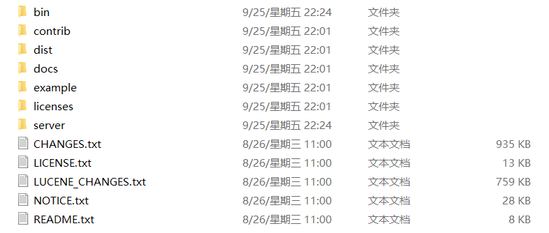
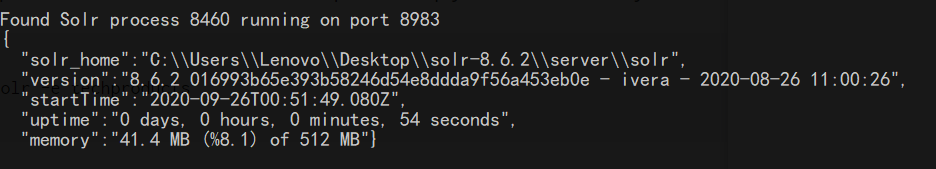

# Solr安装与配置

从Solr8开始，Solr的安装包中就内置了Jetty容器，不再依赖外部容器（类似于Tomcat），换句话说，只要系统中安装了JRE，Solr可以直接运行。

## 一. 目录结构

下载Solr-8.6.2后解压，会发现下面目录结构：



- bin/：内部包含Solr启动的脚本
  - solr/solr.cmd：这个脚本用于启动和停止Solr。在SolrCloud模式下运行时，还可以创建集合或核心、配置身份验证和使用配置文件
  - post：它提供简单的命令行接口，用于将对Solr索引进行操作（增删查改）
  - solr.in.sh/solr.in.cmd：这些分别是Linux和Windows系统的属性文件。 在此配置Java，Jetty和Solr的系统级属性。 这使您可以将所有属性设置在一个位置。
  - install_solr_services.sh：用于将Solr以服务的形式安装到Solr中。
- contrib/：内部包含了Solr插件
- dist/：内部包含Solr所依赖的jar
- docs/：内部包含一个链接互联网的Solr文档
- licenses/：目录包括Sol使用的第三方库的所有许可证
- server/：这个文件夹是Solr的核心
  - solr-webapp：Solr管理界面
  - lib：依赖的Jetty容器
  - logs：
  - solr/configsets：内部包含简单的配置案例

## 二. 启动与停止

Solr提供了`bin/solr.*`的脚本文件用于开启和停止Solr应用，以及创建Core或者Collection、配置身份验证、检查系统状态。

**启动Solr**

```shell
./bin/solr start #windows环境运行solr.cmd，下同
./bin/solr start -p 8000 #在指定端口上启动Solr
```

该命令将在后台启动Solr，脚本会在Solr正确启动后返回提示符。

**查看运行状态**

```shell
./bin/solr status
```



**停止Solr**

```shell
./bin/solr stop -p 8983  #根据端口号关闭Solr
./bin/solr stop -all #停止所有Solr实例
```

**重启Solr**

重启命令需要指定一个端口号，它不仅能重启指定端口上正在运行的Solr，还能在该端口未被Solr占用时启动起来：

```shell
./bin/solr restart -p 8983
```

Solr脚本的其他用法请参考：[<https://lucene.apache.org/solr/guide/8_6/solr-control-script-reference.html#solr-control-script-reference>](https://lucene.apache.org/solr/guide/8_6/solr-control-script-reference.html#solr-control-script-reference)

## 三. 创建Solr实例

我们可以使用`bin/solr`脚本创建实例

```shell'
./bin/solr create -c 实例名称
```

## 三. SolrHome

默认情况Solr启动时所依赖的SolrHome是`server/solr`，这个目录中包含Solr所依赖的配置信息以及Solr的索引文件，SolrHome的目录结构布局在单节点模式下和Cloud模式下有一点不同：

单节点模式：

```xml
<solr-home-directory>/
   solr.xml
   core_name1/
      core.properties
      conf/
         solrconfig.xml
         managed-schema
      data/
   core_name2/
      core.properties
      conf/
         solrconfig.xml
         managed-schema
      data/
```

SolrCloud模式：

```xml
<solr-home-directory>/
   solr.xml
   core_name1/
      core.properties
      data/
   core_name2/
      core.properties
      data/
```

在SolrHome中你会看到这些文件：

- solr.xml：指定Solr服务器实例的配置选项。更多信息参考 [Solr Cores and solr.xml](https://lucene.apache.org/solr/guide/8_6/solr-cores-and-solr-xml.html#solr-cores-and-solr-xml).
- core实例
  - core.properties：为每个core定义特定的属性，例如：core实例名称、core所在的collection等。更多信息请参考： [Defining core.properties](https://lucene.apache.org/solr/guide/8_6/defining-core-properties.html#defining-core-properties)
  - solrconfig.xml：用于配置高级行为。例如，您可以为数据目录指定另一个位置。更过信息请参考： [Configuring solrconfig.xml](https://lucene.apache.org/solr/guide/8_6/configuring-solrconfig-xml.html#configuring-solrconfig-xml)
  - managed-schema（schema.xml）：描述您将要求Solr索引的信息。它将一个document定义为字段的集合。您需要同时定义字段类型和字段本身。字段类型定义功能强大，包括关于Solr如何处理传入字段值和查询值的信息。有关Solr模式的更多信息，请参阅文档、[Documents, Fields, and Schema Design](https://lucene.apache.org/solr/guide/8_6/documents-fields-and-schema-design.html#documents-fields-and-schema-design)和 [Schema API](https://lucene.apache.org/solr/guide/8_6/schema-api.html#schema-api)。
  - data/：这个文件用于存储当前实例的索引文件