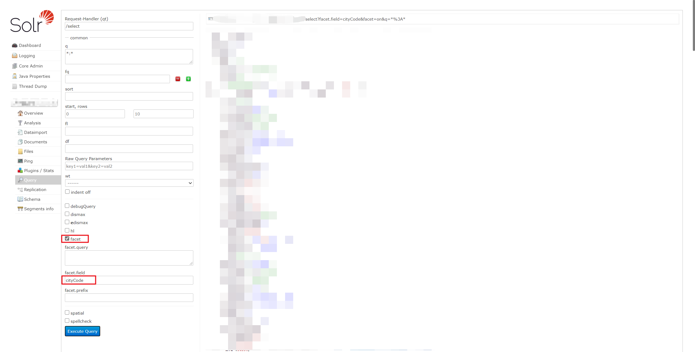

# Facet查询

> [Solr Facet技术的应用与研究 - 美团技术团队 (meituan.com)](https://tech.meituan.com/2014/06/09/solr-facet.html)

## 一. 理解Facet查询

学生可以按班级来分类、可以按性别来分类、可以身高来分类、可以按年龄来分类.可以按考试分数来分类、可以按兴趣爱好分类、可以按出生地址分类等，上 面所说的班级、性别、身高、年龄、考试分数、兴趣爱好、出生地址等，这些都是把学生进行归类分组的一个个维度。那有些同学就要问了，这不就是分组吗?他跟分组有什么区别?乍看貌似Facet跟Group是一个概念，其实Facet跟Group还是有点区别的，比如，按考试分数统计，我们一般不会说统计60分有几人，61分有几人，62 分有几人，63 分有几.....直到100分， 实际我们一般会这样统计: 60分以下有几人，60~ 70分有几人，70~ 80分有几人，80~ 90分有几人，90~ 100分有几人。这里说的60分以下、60~ 70分、70~ 80、80~ 90、90~ 100表示的是分数段，即数字范围，不是简简单单地按照某个域进行分组的，甚至会有更复杂的维度统计。比如，我要你统计各个分数段男生多少人、女生多少人，这其实就是多个查询条件组合成一个维度。 说到这儿，我想大家应该都豁然开朗了，Facet 即维度不仅仅是建立在某个域上，它可以建立在对某个域进行函数计算后得到的计算值上，它还可以建立在某个查询条件上，该查询条件你可以任意组合，这是Group分组所办不到的。如果你仅仅是对某个域进行Facet统计，那就跟Group类似了。你可以把Facet理解为Group的火力升级版，功能更强大!

## 二. 初识Facet查询

假如我们需要查询每个城市有多少条数据，我们可以使用

```java
http://localhost/solr/test/select?facet.field=cityCode&facet=on&q=*:*
```

Solr客户端：



其中`facet=on`表示开启facet查询，`facet.field=cityCode`表示查询每个城市发货的商品数量，查询结果如下：

```json
{
    "responseHeader": {
        "status": 0,
        "QTime": 1,
        "params": {
            "q": "*:*",
            "facet.field": "cityCode",
            "facet": "on"
        }
    },
    "response": {
        "numFound": 590,
        "start": 0,
        "numFoundExact": true,
        "docs": []
    },
    "facet_counts": {
        "facet_queries": {},
        "facet_fields": {
            "cityCode": [
                "310100",
                320,
                "320500",
                200,
                "320200",
                70
            ]
        },
        "facet_ranges": {},
        "facet_intervals": {},
        "facet_heatmaps": {}
    }
}
```

上面示例中我们演示了Solr中Facet查询的最基本形式：在指定域上执行Facet查询，在这种Facet查询中，会对域的域值进行分组统计，当然如果该域配置了分词器，那么就是对域的域值分词后得到的每个唯一Term 进行分组统计。

上例中我们使用的是一个cityCode（单值字段）进行的查询，我们还可以使用商品的`tags`进行Facet查询，得到的是打有指定标签的数量。我们还可以对纯文本域进行Facet。一般纯文本域需要进行分词处理，但可能会包含一些噪声词，比如停用词之类的，也许会干扰你的Facet查询，因此你需要对文本域配置停用词过滤器。

## 三. Facet查询参数

| 参数                   | 值                   | 描述                                                         |
| ---------------------- | -------------------- | ------------------------------------------------------------ |
| facet                  | true/false           | 如果设置为true，则此参数将在查询响应中启用facet参数          |
| facet.field            | 任意的index=true的域 | 表示对哪个域进行facet query，此参数可以指定多次              |
| facet.sort             | index/count          | Count按照统计顺序大小进行排序，或者按照term字母表顺序排序，默认值为count |
| facet.limit            | >=-1的Integer数字    | 表示每个facet组中只返回前N项，此参数可以对每个Facet域进行设置 |
| facet.mincount         | >=0 的Integer数字    | 表示统计每一项数字的最小值，此参数可以对每个Facet域进行设置  |
| facet.method           | enum/fc/fcs          | method = enum时会遍历索引中的所有Term,计算这些Term的交集。method-fc(即FileCache的缩写)时会遍历匹配Facet查询的所有文档，然后找出包含该Term的文档。当域包含很多唯一值时使用fc 执行速度会更快些，当域包含的唯一值只是几个， 那么使用enum方式会更快些。对于所有域(oolean域除外)，facet.method 默认值是fc。fcs会对单值Stingied 域提供基于每个段文件的Field Cache (域缓存)，当你的索引数据需要频繁更新时，对于SingFilid 使用fes,执行性能会更好。 它还可以接收一个本地参数， 即通过指定 处理不同段文件的线程数参数来加快 Facer的执行速度。此参数可以对每个Facet域进行设置 |
| facet.enum.cache.minDf | >=0 的Integer        | 高级参数:表示Term至少匹配多少个Document才启用域缓存，若此参数设置为0,则表示始终都启用域缓存，默认值就是零。若此参数设置为大于零，则可以减少内存占用，但确是以减缓Facet查询速度为代价的。一般这个值推荐设置为20 ~ 50,它并不影响最终的Facet返回结果，只是影响Facet查询性能。此参数可以对每个Facet域进行设置 |
| facet.prefix           | 任意字符串           | 表示只对指定前缀的Term进行Facet查询，对于想要查找相似Term或用于构建autocomplete功能时会有用 |
| facet.missing          | true/false           | 表示是否对空值Term也进行Facet统计，默认值false               |
| facet.offset           | >=0 的Integer数字    | 用于指定Facet查询返回结果集的偏移量，偏移量从零开始计算。当你需要对Facet查询返回的结果集进行分页时会有用 |
| facet.threads          | Integer数字          | 用于指定当对多个域执行Facet查询时使用的处理线程个数，默认值为零，表示默认情况下，会使用单线程串行的方式执行每个域上的Facet查询。此参数设置为正数，则表示会创建指定数量的线程以多线程并行的方式去执行Facet查询。设置为负数即表示线程数不受限制。当你有多个域需要执行Facet查询时，采用多线程方式明显会加快Facet查询速度。注意:此参数只适用于Field FacetQuery,并且当你的Solr查询并发量很大时请不要开启此参数 |

facet.field参数可以指定多次，比如向下面这样：

```shell
&facet.field=tags&facet.field=type
```

有些facet参数支持对每个域单独设置，基本语法如下：

```shell
f.<fieldName>.<FacetParameter>=<value>
```

其中`<fieldName>`表示域名称，`<FacetParameter>`表示Facet参数名称，`<value>`表示参数对应的值。

## 四. Query Facet

除了可以对任何的索引域进行Facet查询以外，你还可以对任意的子查询统计匹配的索引文档总个数，而后你能根据统计的数量进行分析。Solr提供了这种功能，它被称为QueryFacet。

假如我们要查询，上海、武汉、杭州三个城市中价格在200~500之间的酒店数量，我们可以通过四个独立的查询去解决问题：

```shell
//查询价格坐落在200~500的所有酒店
select?q=*:*&fq=price:[200 TO 500]
//查询上海价格坐落在200~500的所有酒店
select?q=*:*&fq=price:[200 TO 500]&city:上海
//查询武汉价格坐落在200~500的所有酒店
select?q=*:*&fq=price:[200 TO 500]&city:武汉
//查询杭州价格坐落在200~500的所有酒店
select?q=*:*&fq=price:[200 TO 500]&city:杭州
```

这样的查询方式显然扩展性不足，我们可以使用QueryFacet进行查询：

```shell
select?q=*:*&fq=price:[200 TO 500]&facet=true&facet.query=city:上海&facet.query=city:武汉&facet.query=city:杭州
```

正如你看到的多个子查询可以通过`facet.query`参数结合成一个查询请求。同理也可以将多个价格区间组合成一个Query请求：

```shell
select?q=*:*&rows=0&facet=true&facet.query=price:[* TO 5]&facet.query=price:[5 TO 10]&facet.query=price:[10 TO 15]
```

查询返回结果：

```json
"facet_counts": {
    "facet_queries": {
        "price:[* TO 5]": 43,
        "price:[5 TO 10]": 231,
        "price:[10 TO 15]": 21,
    },
    "facet_fields": {},
    "facet_ranges": {},
    "facet_intervals": {},
    "facet_heatmaps": {}
}
```

尽管我们的示例非常简单，但它完全演示了基于任意查询构建Face Query的灵活性，因为Solr提供了很多强大的查询功能，比如Need Qucey (转换查询)、Function Query (函数查询) 、Facet Query (维度查询)。想象一下， 可以借助Facet Query实现方圆N千米之内的地理位置区间范围(比如`5千米以内`、`5~10千米`、`10~20千米`)查询。你还可以通过一个自定 义的相关性评分Function生成一个Function Query，而后基于Function Query计算结果值构建一个Facet Query。你可以基于任何域、任何Query或动态计算值构建一个查询，又可以基于任何查询构建一个Facet 查询，如何使用它完全靠你的想象力。

尽管Query Facet是极其灵活的，但有时候让人不爽的是，你需要显式指定每个想要基于它统计的值。为此，Solr 为Facet Range Query ( Facet区间范围查询)提供了便利，它使得你在基于数字或日期值进行Facet Range Query时变得更加简单。

## 五. Range Facet

Range Facet，顾名思义，它表示Facet区间范围查询，一般用于对数字或日期的区间范围查询。这类似于我们普通的区间范围查询，但Facet Query会统计每个区间匹配的索引文档总数。以前当你有多个区间范围时可能需要指定3个`facet.query`参数来实现，通过Range Facet可以简化你的查询。使用示例如下所示:

```shell
select?q=*:*&facet=true&facet.range=price&facet.range.start=0&facet.range.end=1000&facet.range.gap=200
```

上面示例中`facet.range`参数表示对哪个域执行Facer区间查询，`facet.range.start` 参数表示区间的上限值，`facet.range.end`表示区间的下限值。`facet.range.gap`参数按照每个区间分布多少个值进行自动区间划分。

返回的查询结果如下：

```json
"facet_counts": {
    "facet_queries": {},
    "facet_fields": {},
    "facet_ranges": {
        "projectTotalUnoccupiedArea": {
            "counts": [
                "0",
                45,
                "200",
                10,
                "400",
                9,
                "600",
                54,
                "800",
                12
            ],
            "gap": 200,
            "start": 0,
            "end": 1000
        }
    },
    "facet_intervals": {},
    "facet_heatmaps": {}
}
```

### Range Facet可选参数

| 参数                | 值                                                           | 描述                                                         |
| ------------------- | ------------------------------------------------------------ | ------------------------------------------------------------ |
| facet.range         | 任何index=true的数字域或date域的名称                         | 指定你需要在哪个域上面执行Facet Range Query，此参数可以指定多次 |
| facet.range.start   | 数字域或date域的区间范围上的最小值                           | 区域范围的上界值，此参数可以对每个Facet域进行设置            |
| facet.range.end     | 数字域或date域的区间范围上的最大值                           | 区域范围的下界值，此参数可以对每个Facet域进行设置            |
| facet.range.gap     | 对于date域而言，gap值可以为DateMath表达式，例如：`+ 1DAY`、`+ 2MONTHS` 、`+ 1HOUR`；对于数字域你只需要指定一个数字即可 | gap即表示区间递增的公差，用于按照指定的gap (间隔)对`[facet.range.start, facet.range.end]`区间进行自动划分，生成多个子区间，此参数可以对每个Facet域进行设置 |
| facet.range.hardend | true/false                                                   | 表示含义还是举例说明吧，比如你`facet.date.start =2015-01-01`，而`facet.date.end = 2015-09-20`，假如你`facet.date.gap= + 1MONTH`即表示按一个月把start与end之间的时间根据gap值分成9份，如果`hardend`为true, 那最后一份的时间范围是2015-09-01至2015-09-20，如果`hardend`为false,那最后一份的时间范围 就是2015-09-01至2015-10-01，即直接无视end参数的限制，严格按照gap的间隔来算，此参数可以对每个Facet域进行设置 |
| facet.range.other   | before/after/between/all/none                                | before:表示需要对start之前的日期做个统计；after:表示需要对end之后的日期做个统计；between:表示需要对start与end之间的日期做个统计；none:表示不做任何汇总统计；all:表示before,after,between都需要做统计，此参数可以对个Facet域进行设置 |
| facet.range.include | lower/upper/edge/outer/all                                   | lower：表示划分的所有子区间都包含上限值即最小值；upper：表示划分的所有子区间都包含下限值即最大值；edge：表示划分的第一个子区间包含上限值即最小值，最后一个子区间包含下限值即最大值；outer：表示当你的 `facet.range.other` 参数设置为 before或after时，是否包含before和 after这两个边界值；all：表示分别指定上面4个参数；此参数可以指定多次，且可以对每个域进行单独设置 |

其中`facet.range.other`它相当于一个汇总信息，当我们进行如下查询时：

```shell
select?q=*:*&facet=true&facet.range=price&facet.range.start=0&facet.range.end=500&facet.range.gap=200&facet.range.other=between
```

它会返回如下结果：

```json
"facet_ranges": {
    "price": {
        "counts": [
            "0",
            62,
            "200",
            164,
            "400",
            244
        ],
        "gap": 200,
        "between": 470,//新增一个between字段
        "start": 0,
        "end": 600
    }
},
```

## 六. Facet Filter

在上面的查询中我们会统计所有区域的价格分段数量，如果我们需要查询“上海“市的所有价格分段数量，那么就可以使用Facet Filter：

```shell
select?q=*:*&facet=true&facet.range=price&facet.range.start=0&facet.range.end=1000&facet.range.gap=200&fq=city:上海
```

我们在之前的基础上加入`fq=city:上海`条件，就是为了过滤出所有`city=上海`的文档然后在进行Facet统计。

## 七. Multiselect Faceting

当我们发起一个Facet Query,Facet返回Facet名称可能并不是我们想要的，为此，Solr允许你在Facet Query结果返回之前修改Facet的显示名称，以更友好的名称返回给用户。对于那些已经被Filter Query过滤掉的Document，Solr也允许将其纳入Facet统计之内，Solr中将这种功能称为Multiselect Faceting。Filter Query能过滤查询结果集中将要返回的索引文档，但并不影响最终统计的索引文档总个数，看起来就像Filter Query并没有起作用一样。在本节中，我们将介绍关于key、tag以及exclude的概念和使用，它们启用Facet中非常有用的重命名以及多选功能。

### 7.1 key

所有的Facet (维度)都有一个方便开发者区分它们彼此的名称，如果是Field Facet或Range Facet，那么Facet的名称就是Field的名称，如果是Query Facet,那么Facet的名称就是query的查询表达式或者Facet Value或Function动态计算的值。通过使用key这个本地参数，你可以很容易的**对任何Facet名称进行重命名**，具体请看下面的示例：

```shell
select?q=*:*&rows=0&facet=true&facet.query={!key="price<=5"}price:[* TO 5]&facet.query={!key="5<=price<=10"}price:[5 TO 10]&facet.query={!key="10<=price<=15"}price:[10 TO 15]
```

最终返回的查询结果如下：

```json
"facet_counts": {
    "facet_queries": {
        "price<=5": 43,
        "5<=price<=10": 231,
        "10<=price<=15": 21
    },
    "facet_fields": {},
    "facet_ranges": {},
    "facet_intervals": {},
    "facet_heatmaps": {}
}
```

### 7.2 tag 和 ex

当一个Filter Query应用到一个Solr Query请求上时，最终返回的结果集是求Query查询返回的结果集与Filter Query查询返回的结果集之间的交集。默认情况下，Facet Query也是这种查询机制。不符合Filter Query的Facet Value已经被排除在外，不会纳入Facet查询统计，这在大多数情况下是有用的。

但是这种查询机制仍然存在问题，比如你想查询统计”湖北”省的所有数据，你可能会应用一个Filter Query：`fq = city:上海`。此时其它地区的数据数量就不会统计了，如果你仍然希望能够统计其它地区的数据，那么你就需要**Facet Exclusion**功能。Facet Exclusion功能允许你将那些已经被应用在域Facet Query之上的任意Filter Query移除掉的索引文档重新添加到Facet查询统计中。这样在统计Facet数量的时候可以完全忽略任意Filter Query的影响，而应用于Facet Query之上的Filter Query将只会影响最终返回的索引文档，但并不影响每个Facet统计的文档总个数。实现这种功能你需要tag和ex这两个本地参数。

下面示例演示如何使用这两个参数实现Multiselect Faceting：

```shell
select?q=*:*&facet=true
&facet.field={!ex=tagCity}province
&facet.query={!ex=tagPrice,tagCity}price:[* TO 500]
&facet.query={!ex=tagPrice,tagCity}price:[500 TO 1000]
&facet.query={!ex=tagPrice,tagCity}price:[1000 TO 1500]
&fq={!tag=tagCity}city:上海
&fq={!tag=tagPrice}price:[1000 TO 1500]
```

上面的示例中重点是我们为Filter Query定义了一个标签，将 “city:上海” 定义了 “tagCityCode” 标签；“price:[1000 TO 1500]”定义了“tagPrice”标签，这些标签名称是随意取的。然后在每个Query Facet上通过`ex`参数（exclusion的意思）来应用我们刚刚打的标签，应用一个标签的含义就是当前Facet Query在统计数据时忽略标签指代的Filter Query对数据个数的影响，但是Facet Query最终返回的索引文档仍然会进行过滤。

在上面的示例中，统计省级的文档个数时，不受“fq=city:上海”的影响，但是会过滤出price在1000到1500的数据进行统计，最终结果就是所有省内价格在1000到1500的文档个数；统计价格区间内文档个数时，既不受“fq=city:上海”的影响也不受“fq=price:[1000 TO 1500]”的影响，也就是返回的是全国的价格区间内的文档个数。

最终返回结果：

```json
"facet_counts": {
        "facet_queries": {
            "{!ex=tagPrice,tagCity}price:[* TO 500]": 3423,
            "{!ex=tagPrice,tagCity}price:[500 TO 1000]": 1123,
            "{!ex=tagPrice,tagCity}price:[1000 TO 1500]": 1276
        },
        "facet_fields": {
            "province": [
                "上海",
                321,
                "浙江",
                123,
                "江苏",
                ...
            ]
        },
        "facet_ranges": {},
        "facet_intervals": {},
        "facet_heatmaps": {}
    }
```

### 7.3 ex参数的应用意义

我以搜索酒店为例，假如你进入一个某某门户上海酒店页，它可能会展示上海市所有区的酒店数量：

> 静安区（331） 普陀区（543）长宁区（123）浦东新区（1341）青浦区（134）

假设我们需要查看“静安区“的酒店，但是默认情况下Filter Query会影响Facet Query，那么在你点击”静安区“时，其它区的数据就不显示了（因为受到Filter Query影响都变成0了），此时如果我们好像获取所有区的数量就需要用到`ex`和`tag`参数了。