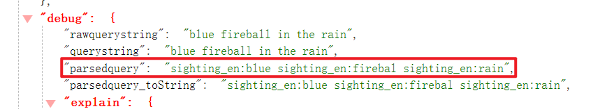

# 高亮查询

需要注意的是，Solr高亮器在执行之前，它需要首先访问域的原始文本及域值，要想访问域的原始文本，那么该域必须是`stored=true`

在Solr中使用高亮不需要做太多预先的配置工作，它是开箱即用。下面的代码演示了如何开启高亮功能：

```shell
select?q=blue fireball in the rain&df=sighting_en&wt=json&rows=10&hl=true
```

我们只需要通过`hl=true`即可开启高亮功能，`df=sighting_en`用于指定需要高亮的域查询结果如下：

Solr返回的高亮部分内容在“highlighting”属性中

```json
{
    "responseHeader": {
        "status": 0,
        "QTime": 13
    },
    "response": {
        "numFound": 9708,
        "start": 0,
        "numFoundExact": true,
        "docs": [
            {
                "id": "20041130/20041204/lancaster/oh/fireball/2bbc6dc90efcbb8fb8f54ba23e07bd0a",
                "sighted_at_dt": "2004-11-29T16:00:00Z",
                "month_s": "November",
                "reported_at_dt": "2004-12-03T16:00:00Z",
                "city_s": "Lancaster",
                "state_s": "OH",
                "location_s": "Lancaster, OH",
                "shape_s": "fireball",
                "duration_s": "5 seconds",
                "sighting_en": "Bright blue fireball in the distance during a rain storm. Not a lightning storm, no thunder. No relevant towers or objects in the area.",
                "_version_": 1696658940961488897
            },
            ...
        ]
    },
    "highlighting": {
        "20041130/20041204/lancaster/oh/fireball/2bbc6dc90efcbb8fb8f54ba23e07bd0a": {
            "sighting_en": [
                "Bright <em>blue</em> <em>fireball</em> in the distance during a <em>rain</em> storm. "
            ]
        },
        ...
    }
}
```

## 一. Encoder & Formatter

`hl. formatter`参数用于指定采用什么formatter来指定对高亮Term进行格式化，默认实现是`hl.formatter = simple`，这种方式对于使用HTML标签来包裹高亮Term比较适用，设置两头的包裹HTML标签你可以使用`hl.simple.pre`和`hI.simple.post`这两个参数，比如你想要使用css美化高亮Term,那么你在查询请求中如下所示添加2个请求参数:

```shell
&hl.simple.pre=<span style="color:red">
&hl.simple.post=</span>
```

这样高亮Term就被格式化成`<span style="color:red">term</span>`。Encoder组件负责在每个Fragment传递给Formatter组件之前对特殊字符进行编码，当
你想要生成HTML标签格式的高亮Fragment时, HTML Encoder会转义HTML字符实体比如双引号(")会转义成`&quot;`。


## 二. Facet & Highlighting

高亮查询还可以结合Facet查询使用：

```shell
select?q=blue fireball in the rain
&df=sighting_en
&wt=json
&rows=10
&hl=true
&hl.fl=sighting_en
&facet=true
&facet.limit=4
&facet.field=shape_s
&facet.field=location_s
&facet.field=month_s
```

查询结果：

```json
{
    "responseHeader": {
        "status": 0,
        "QTime": 73
    },
    "response": {
        "numFound": 9708,
        "start": 0,
        "numFoundExact": true,
        "docs": [
            {
                "id": "20041130/20041204/lancaster/oh/fireball/2bbc6dc90efcbb8fb8f54ba23e07bd0a",
                "sighted_at_dt": "2004-11-29T16:00:00Z",
                "month_s": "November",
                "reported_at_dt": "2004-12-03T16:00:00Z",
                "city_s": "Lancaster",
                "state_s": "OH",
                "location_s": "Lancaster, OH",
                "shape_s": "fireball",
                "duration_s": "5 seconds",
                "sighting_en": "Bright blue fireball in the distance during a rain storm. Not a lightning storm, no thunder. No relevant towers or objects in the area.",
                "_version_": 1696658940961488897
            },
            ...
        ]
    },
    "facet_counts": {
        "facet_queries": {},
        "facet_fields": {
            "shape_s": [
                "fireball",
                1746,
                "light",
                1495,
                "triangle",
                781,
                "circle",
                761
            ],
            "location_s": [
                "Seattle, WA",
                88,
                "Phoenix, AZ",
                69,
                "Portland, OR",
                46,
                "Houston, TX",
                44
            ],
            "month_s": [
                "July",
                1146,
                "August",
                1062,
                "November",
                924,
                "October",
                909
            ]
        },
        "facet_ranges": {},
        "facet_intervals": {},
        "facet_heatmaps": {}
    },
    "highlighting": {
        "20041130/20041204/lancaster/oh/fireball/2bbc6dc90efcbb8fb8f54ba23e07bd0a": {
            "sighting_en": [
                "Bright <em>blue</em> <em>fireball</em> in the distance during a <em>rain</em> storm. "
            ]
        },
        ...
    }
}
```

当你单击Shape下的light分类，想要了解该分类下的信息时，会在之前的Facet请求上追加一个fq参数即”fq = shape_s: light”，在Facet Query上应用Filter Query 我们上一章已经讲解过，这里的重点是Highlighting。此时相当于在上一次查询的基础之上查询shape = light的索引文档，换句话说，此时light就相当于查询关键字，那么也就意味着此时高亮器也应该将Facet查询返回的“light”也进行高亮，然而，当我们应用了Filter Query之后，Highlighter高亮器并没有对我们的“light”这个Term进行高亮，这是因为“light"是在Filter Query查询中，并不存在于q参数的主查询中。我们需要做的是如何在不改变查询的基础之上控制高亮器使用的查询Term，在Solr中你可以通过指定`hl.q`参数来实现。下面的示例演示如何使用`hl.q`参数将light这个Term添加高亮器使用的Query中:

```shell
select?
q=blue fireball in the rain
&df=sighting_en
&wt=json
&rows=10
&hl=true
&hl.fl=sighting_en
&facet=true
&facet.limit=4
&facet.field=shape_s
&facet.filed=location_s
&facet.filed=month_s
&hl.q=blue fireball in the ranin light
&fq=shape_s:light
```

这里我们通过`hl.q`参数将light这个Term加入了高亮匹配Term中，这样只要索引文档中也包含了light这个Term，那么最终返回的高亮片段中也可能会包含“light”。

上面的高亮示例中我们的主查询表示匹配索引文档中包含blue、fireball、rain其中任意一个Term。此时如何打开查询的调试模式(debug = true)，你会发现在查询时分词处理完成之后，执行了:

```shell
sighting_en:blue OR sighting_en:firebal OR sighting_en:rain
```




这个查询匹配了9706个索引文档。假设我期望查询索引文档中包含“blue fireball”这个短语，而不是包含“blue”和“fireball”这两个Term，此时Solr应该正确的高亮了“blue fireball”短语，而不高亮单独的“blue”和“fireball”。即如何在高亮查询中使用Phrase Query对短语进行高亮，此时你需要使用FastVectorHighlighter高亮器，关于FastVectorHighlighter高亮器的内容请看下一小节。

## 三. 高亮参数

| 参数名称                   | 描述                                                         | 默认值                   |
| -------------------------- | ------------------------------------------------------------ | ------------------------ |
| hl                         | 表示是否为你的查询开启高亮功能                               | false                    |
| hl.snippets                | 为每个域生成的高亮片段最大个数                               | 1                        |
| hl.fl                      | 为哪些域生成高亮片段，多个域名称之间采用逗号分隔             | 如果未设置会以df参数为准 |
| hl.fragmenter              | 指定使用什么Fragmenter组件来生成Fragment，Fragmenter 组件需要在solrconfig.xml 中注册 | gap                      |
| hl.fragsize                | 设置每个fragment的目标长度,并不是一个严格的字符最大限制      | 100                      |
| hl.q                       | 用于高亮的查询，你可以添加与q参数的主查询不同的额外的 Term   | 没有默认值               |
| hl.alternateField          | 当没有生成任何高亮片段时，指定一个存储域（即stored = true的域）用于显示 | 没有默认值               |
| hl.formatter               | 指定使用哪种 Formatter组件，Formatter组件需要在solrconfig.xml中注册 | simple                   |
| hl.simple.pre              | 为每个高亮Term的开头添加的高亮标签，一般是在solrconfig.xml中注册HTML中的标签 | `<em>`                   |
| hl.simple.post             | 为每个高亮Term的末尾添加的高亮标签，一般是HTML中的标签，与hl.simple.pre搭配使用 | `</em>`                  |
| hl.requireFieldMatch       | 当对多个域进行高亮，如果此参数设置为true，则表示查询结果不为空才会执行高亮，如果此参数设置为false，则表示它可能匹配某个域，但是却对另一个域进行高亮。如果hl.fl参数使用了通配符，那就表示自动设置此参数为true。如果你查询的是所有域，那么还是将此参数设置为false吧，这样便于你清楚到底是哪些域匹配了搜索关键字 | false                    |
| hl.max AnalyzedChars       | 当Fragmenter对一个大文本域进行分词时需要设置最大支持对多长的字符进行分词处理。如果不想做任何限制，那么请设置为-1 | 51200                    |
| hl.usePhraseHighlighter    | 如果设置为true，则表示高亮器只对匹配的短语进行高亮，匹配的单个Term不进行高亮,且 Solr会使用Lucene 中的SpanScorer去对Phrase进行打分 | false                    |
| hl.mergeContiguous         | 若此参数设置为true，那么Solr会将相邻的Fragment合并为一个Fragment | false(为了向后兼容)      |
| hl.highlightMultiTerm      | 若此参数设置为true，即表示启用高亮器对range/wildcard/fuzzy/prefix这些查询的支持 | false                    |
| hl.preserveMulti           | 若此参数设置为true，则表示对多值域的每个值执行高亮处理,不管该值是否与搜索关键字匹配。并且返回的高亮结果会保留多值域的原始域值的添加顺序 | false                    |
| hl.maxMultiValuedToExamine | 限制最多对多少个多值域的域值进行检查                         | Integer.MAX_VALUE        |
| hl.maxMultiValuedToMatch   | 限制最后有多少个多值域的域值匹配，当hl.maxMultiValuedToExamine参数也设置了，那么哪个参数先达到限制就终止 | Integer.MAX_VALUE        |
| hl.maxAlternateFieldLength | 设置hl.alternateField参数指定的域的字符最大长度，设置为小于等于零的数值表示不做限制 | 无限制                   |
| hl.highlightAlternate      | 如果此参数设置为true且设置了hl.alternateField,Solr会显示整个alternate field并显示高亮，如果hl.maxAlternateFieldLength =N参数设置了，那么Solr会返回最多N个字符作为高亮摘要。如果此参数设置为false，或者hl.alternateField参数指定的可选域没有匹配搜索关键字，那么会直接显示可选域的域值文本但不包含高亮片段 | true                     |
| hl.tag.pre                 | 与hl.simple.pre参数类似，用于PostingsHighlighter 高亮组件    | `<em>`                   |
| hl.tag.post                | 与hl.simple.post，用于PostingsHighlighter 高亮组件           | `</em>`                  |
| hl.phraseLimit             | 用于提升FastVectorHighlighter高亮器的执行性能，表示最多对多少短语进行匹配 | Integer.MAX_VALUE        |
| hl.fragListBuilder         | 用于指定使用什么类型SolrFragListBuilder。其他可选值有single、simple，single它会将整个域值当作一个高亮片段 | weighted                 |
| hl.fragmentsBuilder        | fragments builder主要负责格式化Fragment，它默认会<em>和</em>装饰高亮Term。用于指定使用什么类型SolrFragmentsBuilder。 | default                  |
| hl.regex.slop              | 表示hl.fragsize会发生变化以适应正则表达式的因子，默认值是0.6，意思是如果hl.fragsize = 100那么fragment的大小会从40 ～160。当你使用Regex-Fragmenter时此参数会有用 | 0.6                      |
| hl.regex.pattern           | 当你使用RegexFragmenter时需要用到的正则表达式，根据指定的正则表达式来匹配 | 无默认值                 |
| hl.regex.maxAnalyzedChars  | 当你使用RegexFragmenter时需要用到此参数，用于限制RegexFragmenter只处理限定字符长度范围内的域值进行处理 | 10000                    |
| hl.boundaryScanner         | 用于配置如何确定Fragment的边界，默认是以字符级别来划分边界，可选值有breakIterator 、simple。SimpleBoundaryScanner会根据hl.fragsize参数决定的关键字的起始偏移量和结束偏移量，重新计算摘要的起始偏移量。关于如何在solrconfig.xml中配置BoundaryScanner请接着往下看 | simple                   |
| hl.bs.maxScan              | 用于指定SimpleBoundaryScanner边界扫描器扫描字符的长度        | 10                       |
| hl.bs.chars                | 用于指定能够确定Fragment边界的字符                           | .,!?\t\\n 以及空格       |
| hl.bs.type                 | 决定BreakIterator 怎么划分界定符，可选值有:CHARACTER、WORD、SENTENCE、LINE、WHOLE。SENTENCE是按句子来划分 | WORD                     |
| hl.bs.language             | 当你使用BreakIteratorBoundaryScanner时会需要此参数,用于指定Local使用什么本地语言 | 空字符串                 |
| hl.bs.country              | 当你使用BreakIteratorBoundaryScanner时会需要此参数，用于为Local类指定国家信息 | 空字符串                 |

上面表格中的参数你都可以单独每个域进行设置，举个例子，假如你有title和 body这两个域，title通常是一些比较短的域，所以一般一个高亮片段就够了，但是你可能希望为body域生成3个高亮片段,那么可以这样处理：

```shell
f.body.hl.snippets=3	
```

通常，你可以在域级别去覆盖全局的高亮参数，设置语法为：`f.<fieldname>.<highlight-param>`。

## 四. FastVectorHighlighter

使用默认的高亮器最大的问题就是对于大文本域执行高亮查询会非常慢。导致查询速度慢的主要原因就是它需要在查询时对域值文本进行重新分词。为了解决这个问题，Solr提供了FastVectorHighlighter快速高亮器，它的执行速度比默认高亮器要快，因为它跳过了在生成Fragment阶段需要重新分词的步骤。

默认高亮器性能问题并不是很突出，在我们的UFO示例中甚至很难重现这种问题,默认高亮器通常运行速度很快，甚至当你将每页返回的索引文档大小设置为50，性能问题依然不是很突出。但是如果你每页返回的索引文档成千上万了，又或者需要同时对多个域进行高亮，那么此时默认高亮器的性能就显现出来了，变得越来越慢，尽管当默认高亮器运行速度很慢时我们可以使用FastVectorHighlighter高亮器来救急，但是并不意味着默认高亮器就100%不适合于你的应用，也并不意味着FastVectorHighlighter高亮器在任何时候都比默认高亮器优秀。

FastVectorHighlighter高亮器在高亮时需要访问每个Term的位置信息以及偏移量信息，所以它依赖于你在索引创建时就提前计算好并存储到索引结构中。因此，使用FastVectorHighlighter高亮器时，任何需要高亮的域都必须在索引创建时启用termVectors ,termPositions、termOffsets。在我们的示例中，如果我们想要为sighting_en域启用FastVectorHighlighter高亮器，那么需要如下进行定义:

```xml
<field name="sighting_en" type="text_en" indexed="true" stored="true" trutermVectors="true" termPositions="true" termoffsets="true"/>
```

这看起来似乎很简单，但是修改完域的定义之后，别忘了，你需要对所有索引文档重新建立索引，这样才能使你的设置立即生效。但是带来更大的问题是这些属性会使得你的索引体积变得臃肿，对于UFO示例来说，开启那3个属性重建索引之后，索引体积由原来的69MB增加到109MB，这种索引体积的增长对于小数据集来说可能微不足道，但是对于大规模的索引文档来说，那简直就是灾难。存储vectors、positions、offsets这些信息同时还会稍微减缓你索引创建的速度，在高吞吐量环境下要求能够近实时搜索时这可能会是一个问题。

这看起来似乎很简单，但是修改完域的定义之后，别忘了，你需要对所有索引文档重新建立索引，这样才能使你的设置立即生效。但是带来更大的问题是这些属性会使得你的索引体积变得臃肿，对于UFO示例来说，开启那3个属性重建索引之后，索引体积由原来的69MB增加到109MB，这种索引体积的增长对于小数据集来说可能微不足道，但是对于大规模的索引文档来说，那简直就是灾难。存储vectors、positions、offsets这些信息同时还会稍微减缓你索引创建的速度，在高吞吐量环境下要求能够近实时搜索时这可能会是一个问题。

想要使用FastVectorHighlighter高亮器，你需要首先在schema.xml中修改域的定义启用那3个属性，然后重新启动Solr Server服务，紧接着你需要对所有索引文档重新创建索引。想要激活FastVectorHighlighter高亮器，你需要传递hl.useFastVectorHighlighter参数并将其设置为true，hl.useFastVectorHighlighter参数使用示例如下所示:

```shell
select?q=blue fireball in the rain
&df=sighting_en
&wt=json
&rows=10
&hl=true
&hl.useFastVectorHighlighter=true
```

在上面的查询示例中，我们的高亮返回结果会将整个查询短语进行高亮，而不仅仅只是对单个高亮Term进行高亮，这也是FastVectorHighlighter高亮器与默认高亮器相比，它的另一个优势。


