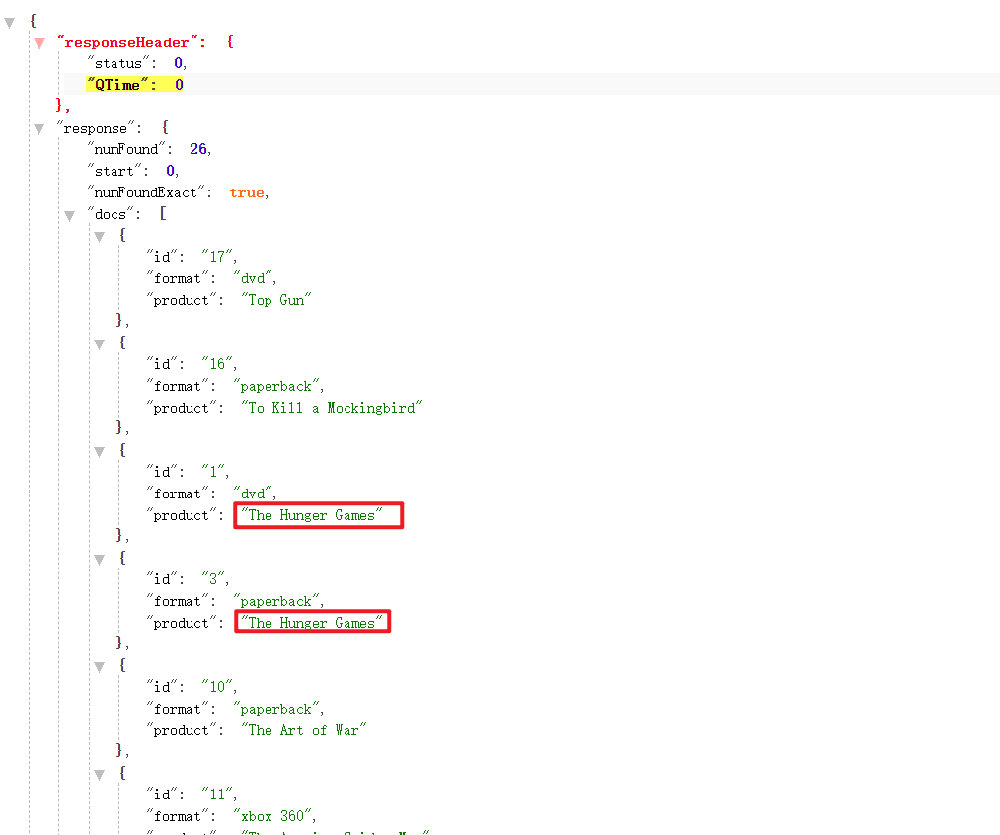

# Solr Group 分组

假设你正在访问一个电商网站准备买T恤，它可能会返回很多相同的T恤，它们只是尺码和颜色不一样，如果这些颜色、尺寸等细节信息不同的数据全部平铺在列表页这肯定不会有好的用户体验，正确的情况下相同的衣服只展示一次，而它们之间不同的差异（尺码、颜色等）由详情页去展示。

## 一. 按照字段分组

例如我们在一个默认查询中，相同的商品会平铺显示：

```shell
select?
q=*:*
&fl=id,product,format
&sort=product desc
```

结果如下：



此时我们可以使用`group`对名称相同的数据进行分组，`group=true`用于开启分组查询，`group.filed=product`用于指明分组查询的域为`product`，`group.limit=1`用于指明**每个分组最多返回一个文档**：

需要注意的是，当开启分组查询后，`rows`参数就会用来约束返回的组数，而不是文档数了。

```shell
select?
q=*:*
&fl=id,product,format
&group=true
&group.field=product
&group.limit=1
&rows=2
```

查询结果如下：

```json
"product": {
            "matches": 26,
            "groups": [
                {
                    "groupValue": "The Hunger Games",
                    "doclist": {
                        "numFound": 2,
                        "start": 0,
                        "numFoundExact": true,
                        "docs": [
                            {
                                "id": "1",
                                "format": "dvd",
                                "product": "The Hunger Games"
                            }
                        ]
                    }
                },
                {
                    "groupValue": "Dance Dance Revolution",
                    "doclist": {
                        "numFound": 1,
                        "start": 0,
                        "numFoundExact": true,
                        "docs": [
                            {
                                "id": "2",
                                "format": "xbox 360",
                                "product": "Dance Dance Revolution"
                            }
                        ]
                    }
                }
           ]
}
```

在上面我们使用了`group.limit=1`让每个分组都只返回一个文档，达到了一个“去重”的效果，如果我们并不需要每个分组下的额外信息（numFound、numFoundExact等），我们可以通过`group.main=true`参数来合并每个分组，从而形成一个扁平化的列表：

```shell
select?
q=*:*
&fl=id,product,format
&group=true
&group.field=product
&group.limit=1
&group.main=true
```

查询结果：

```json
"response": {
        "numFound": 26,
        "start": 0,
        "numFoundExact": true,
        "docs": [
            {
                "id": "1",
                "format": "dvd",
                "product": "The Hunger Games"
            },
            {
                "id": "2",
                "format": "xbox 360",
                "product": "Dance Dance Revolution"
            },
         ]
}
```

需要注意的是，如果我们在多域分组的情况下如果指定`group.main=true`那么只会返回一个组的数据。

目前为止我们仅仅只对单个域进行分组，Solr Group还支持对多个域进行分组，例如：我们分别使用product和type两个域进行分组：

```shell
select?
q=*:*
&fl=id,product,format
&group=true
&group.field=product
&group.field=type
&group.limit=1
```

查询结果：

```json
{
    "responseHeader": {
        "status": 0,
        "QTime": 1
    },
    "grouped": {
        "product": {
            "matches": 26,
            "groups": [
                {
                    "groupValue": "The Hunger Games",
                    "doclist": {
                        "numFound": 2,
                        "start": 0,
                        "numFoundExact": true,
                        "docs": [
                            {
                                "id": "1",
                                "format": "dvd",
                                "product": "The Hunger Games"
                            }
                        ]
                    }
                },
                ...
            ]
        },
        "type": {
            "matches": 26,
            "groups": [
                {
                    "groupValue": "Movies",
                    "doclist": {
                        "numFound": 11,
                        "start": 0,
                        "numFoundExact": true,
                        "docs": [
                            {
                                "id": "1",
                                "format": "dvd",
                                "product": "The Hunger Games"
                            }
                        ]
                    }
                },
                ...
            ]
        }
    }
}
```

如果我们需要在组内简化分数据，类似于`group.main=true`的组内平铺，我们可以添加一个`group.format=simple`参数：

```shell
select?
q=*:*
&fl=id,product,format
&group=true
&group.field=product
&group.field=type
&group.limit=1
&group.format=simple
```

查询结果：

```json
{
    "responseHeader": {
        "status": 0,
        "QTime": 1
    },
    "grouped": {
        "product": {
            "matches": 26,
            "doclist": {
                "numFound": 26,
                "start": 0,
                "numFoundExact": true,
                "docs": [
                    {
                        "id": "1",
                        "format": "dvd",
                        "product": "The Hunger Games"
                    },
                    {
                        "id": "2",
                        "format": "xbox 360",
                        "product": "Dance Dance Revolution"
                    },
                    ...
                ]
            }
        },
        "type": {
            "matches": 26,
            "doclist": {
                "numFound": 26,
                "start": 0,
                "numFoundExact": true,
                "docs": [
                    {
                        "id": "1",
                        "format": "dvd",
                        "product": "The Hunger Games"
                    },
                    {
                        "id": "2",
                        "format": "xbox 360",
                        "product": "Dance Dance Revolution"
                    },
                    ...
                ]
            }
        }
    }
}
```

## 二. 按照任意Query分组

通过前面的章节了解到，我们可以通过`group.field`参数对指定的域进行分组，从而达到对分组域的每个特定值下匹配的索引文档进行收缩折叠。如果`group.limit`参数设置为1，还可以实现对每个分组下重复索引文档进行“删除”。你除了可以对提前指定域的域值进行分组之外，还可以动态的对任意查询进行分组，你可以定义多个Query，同时对多个Query进行分组，就好比对多个域进行分组。为了演示Solr Group 的这种功能，让我们尝试对3个Query进行分组：一个查询匹配所有type = Movies 的产品，一个查询所有包含“games”关键字的，一个查询所有包含“The Hunger Games”这个短语的。请动手执行如下查询示例:

```shell
/select?
sort=porpularity asc
&fl=id,type,format,product
&group.limit=2
&q=*:*
&group=true
&group.query=type:Movies
&group.query=games
&group.query="The Hunger Games"
```

