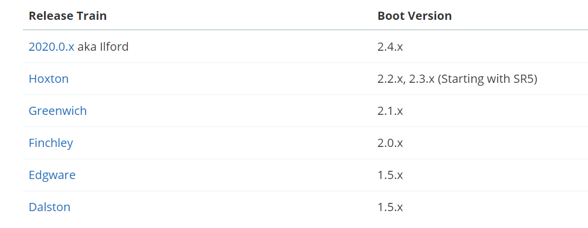

# SpringCloud简介

## 一. 微服务与SpringCloud的关系

微服务是一个架构思维模式，它是为了降低复杂系统的内部耦合性，提升系统的可维护性。而系统拆分后会带来很多问题：负载均衡、服务发现与注册、服务远程调用、服务熔断等一系列问题。而SpringCloud针对这些问题提供了一整套完整的解决方案，我们只需要开箱即用，关注业务逻辑即可。

## 二. SpringCloud主要项目

- Spring Cloud Config
- Spring Cloud Netflix
- Spring Cloud Bus
- Spring Cloud Cloudfoundry
- Spring Cloud Open Service Broker
- Spring Cloud Cluster
- Spring Cloud Consul
- Spring Cloud Security
- Spring Cloud Sleuth
- Spring Cloud Data Flow
- Spring Cloud Stream
- Spring Cloud Stream App Starters
- Spring Cloud Task
- Spring Cloud Task App Starters
- Spring Cloud Zookeeper
- Spring Cloud AWS
- Spring Cloud Connectors
- Spring Cloud Starters
- Spring Cloud CLI
- Spring Cloud Contract
- Spring Cloud Gateway
- Spring Cloud OpenFeign
- Spring Cloud Pipelines
- Spring Cloud Function

## 三. SpringCloud与SpringBoot的兼容关系

参考：[Spring Cloud](https://spring.io/projects/spring-cloud)

