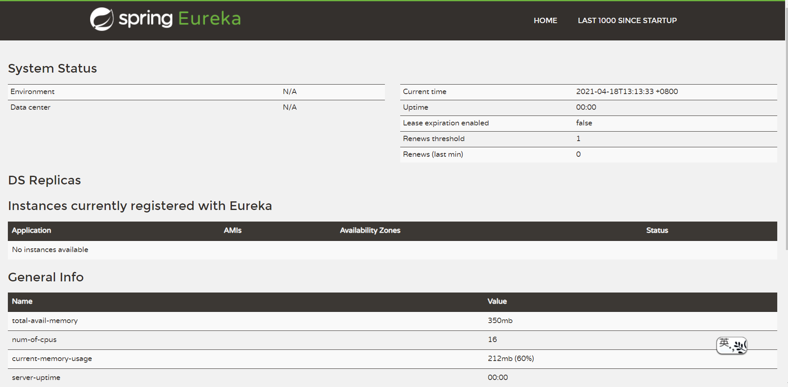
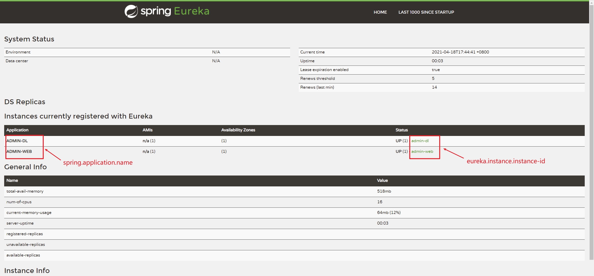
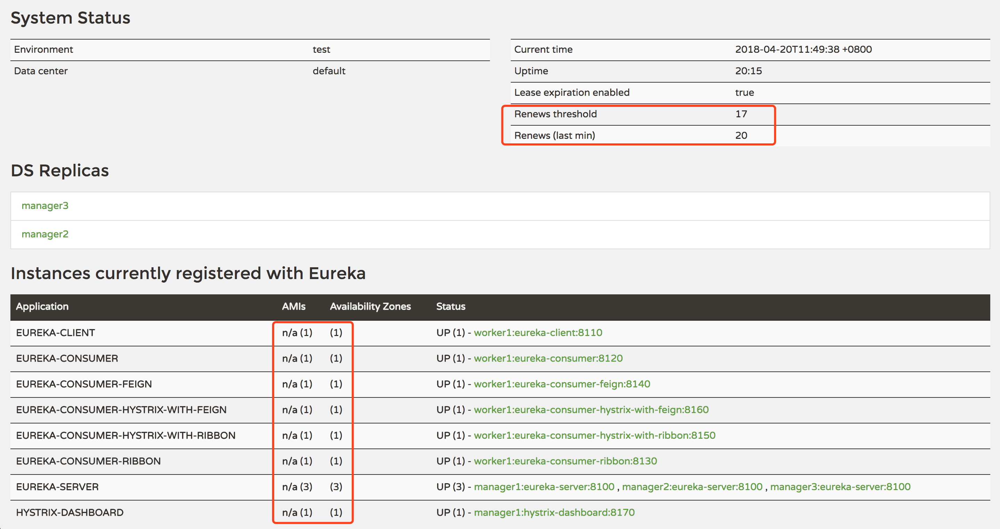

# Eureka环境搭建

Spring Cloud 提供了多种服务注册与发现的实现方式，例如：Eureka、Consul、Zookeeper。

Spring Cloud 支持得最好的是 Eureka，其次是 Consul，再次是 Zookeeper。

## 一. Eureka是什么

Eureka是Netflix的子模块之一，也是一个核心的模块，Eureka 采用了 C-S（客户端/服务端）的设计架构，也就是 Eureka 由两个组件组成：Eureka 服务端和 Eureka 客户端。

Eureka Server(一个独立的项目) 用于注册服务以及实现服务的负载平衡和故障转移，它是服务的注册中心，Eureka Client（我们的微服务） 它是用于与Eureka Server交互，获取其上注册的服务，使得交互变得非常简单，只需要通过服务标识符即可拿到服务。

## 二. Eureka与spring-cloud的关系：

Eureka 是 Netflix 公司开发的（一家做版权视频和云服务的公司），Spring Cloud 封装了 Netflix 公司开发的Eureka 模块来实现服务注册和发现，也就是说 Spring Cloud 对 Netflix Eureka 做了二次封装；

目前Eureka已经停止更新

## 三. Eureka和Zookeeper的区别

**Zookeeper** **保证 CP**

在 ZooKeeper 中，当 master 节点因为网络故障与其他节点失去联系时，剩余节点会重新进行 leader 选举，但是问题在于，选举 leader 需要一定时间, 且选举期间整个 ZooKeeper 集群都是不可用的，这就导致在选举期间注册服务瘫痪。在云部署的环境下，因网络问题使得 ZooKeeper 集群失去 master 节点是大概率事件，虽然服务最终能够恢复，但是在选举时间内导致服务注册长期不可用是难以容忍的。

**Eureka** **保证 AP**

Eureka 优先保证可用性，Eureka 各个节点是平等的，某几个节点挂掉不会影响正常节点的工作，剩余的节点依然可以提供注册和查询服务。而 Eureka 的客户端在向某个 Eureka 注册或时如果发现连接失败，则会自动切换至其它节点，只要有一台 Eureka 还在，就能保证注册服务可用(保证可用性)，只不过查到的信息可能不是最新的(不保证强一致性)。

所以 Eureka 在网络故障导致部分节点失去联系的情况下，只要有一个节点可用， 那么注册和查询服务就可以正常使用，而不会像 zookeeper 那样使整个注册服务瘫痪，Eureka 优先保证了可用性；

## 四. Eureka搭建

Spring Cloud 要使用 Eureka 注册中心非常简单和方便，Spring Cloud 中的 

Eureka 服务注册中心实际上也是一个 Spring Boot 工程，我们只需通过引入相关依赖和注解配置就能让 Spring Boot 构建的微服务应用轻松地与 Eureka 进行整合。 

第一步：创建SpringBoot项目

第二步：在项目中添加Spring-Cloud-Eureka依赖

```xml
<dependency>
    <groupId>org.springframework.cloud</groupId>
    <artifactId>spring-cloud-starter-netflix-eureka-server</artifactId>
</dependency>
<dependency>
    <groupId>org.springframework.boot</groupId>
    <artifactId>spring-boot-starter-web</artifactId>
</dependency>
```

版本继承至你当前项目，父工程中引入的`spring-cloud-dependencies`中引入的版本。

第三步：修改启动类

```java
@SpringBootApplication
@EnableEurekaServer
public class SpringCloudQaEurekaApplication {

    public static void main(String[] args) {
        SpringApplication.run(SpringCloudQaEurekaApplication.class, args);
    }

}
```

在SpringBoot启动类上新增`@EnableEurekaServer`注解。

第四步：修改配置文件

```yml
server:
  port: 8761 #web页面端口
eureka:
  instance:
    hostname: localhost #注册中心的hostname
  client:
    register-with-eureka: false #不将当前项目注册进Eureka
    fetch-registry: false #不订阅其他服务（不从注册中心中拉取其它服务信息）
    service-url:
      defaultZone: http://localhost:8761/eureka
```

第五步：启动注册中心

启动SpringBoot启动类即可完成注册中心的启动



## 五. 注册和订阅Eureka

第一步：在服务中添加Eureka客户端依赖

```xml
<dependency>
    <groupId>org.springframework.cloud</groupId>
    <artifactId>spring-cloud-starter-netflix-eureka-client</artifactId>
</dependency>
```

第二步：在启动类上加入`@EnableEurekaClient`注解

```java
@SpringBootApplication
@EnableEurekaClient
public class AdminDlApplication {
    public static void main(String[] args) {
        SpringApplication.run(AdminDlApplication.class, args);
    }
}
```

第三步：配置Eureka

```yml
spring:
  application:
    #spring的应用名称，这里需要指定，不然在Eureka管理页面，Application name 则会显示“UNKNOW”
    name: admin-dl
eureka:
  instance:
    #每间隔2s，向服务端发送一次心跳，证明自己依然"存活"
    lease-renewal-interval-in-seconds: 2
    #告诉服务端，如果我10s之内没有给你发心跳，就代表我故障了，将我踢出掉
    lease-expiration-duration-in-seconds: 10
    #告诉服务端，服务实例以IP作为链接，而不是取机器名
    prefer-ip-address: true
    #告诉服务端，服务实例的名字
    instance-id: admin-dl
  client:
    service-url:
      defaultZone: http://localhost:8761/eureka
```



## 六. Eureka的保护机制

Eureka Server 在运行期间会去统计心跳失败比例在 15 分钟之内是否低于 85%，如果低于 85%，Eureka Server 会将这些实例保护起来，让这些实例不会过期，但是在保护期内如果服务刚好这个服务提供者非正常下线了，此时服务消费者就会拿到一个无效的服务实例，此时会调用失败，对于这个问题需要服务消费者端要有一些容错机制，如重试，断路器等。

我们在单机测试的时候很容易满足心跳失败比例在 15 分钟之内低于 85%，这个时候就会触发 Eureka 的保护机制，一旦开启了保护机制，则服务注册中心维护的服务实例就不是那么准确了，此时我们可以使用`eureka.server.enable-self-preservation=false`来关闭保护机制，这样可以确保注册中心中不可用的实例被及时的剔除（**不推荐**）。

自我保护模式被激活的条件是：在 1 分钟后，`Renews (last min) < Renews threshold`。

这两个参数的意思：

- `Renews threshold`：**Eureka Server 期望每分钟收到客户端实例续约的总数**。
- `Renews (last min)`：**Eureka Server 最后 1 分钟收到客户端实例续约的总数**。

具体的值，我们可以在 Eureka Server 界面可以看到：



可以看到，我们部署了 3 个 Eureka Server（自注册模式），另外，又部署 7 个服务，注册到 Eureka Server 集群，参数值分别为：

- `Renews threshold`：17
- `Renews (last min)`：20

下面说下`Renews threshold`和`Renews threshold`具体计算方式。

Renews threshold 计算代码：

```java
this.expectedNumberOfRenewsPerMin = count * 2;
this.numberOfRenewsPerMinThreshold = (int) (this.expectedNumberOfRenewsPerMin * serverConfig.getRenewalPercentThreshold());
```

`count`表示服务的数量，如果 Eureka Server 开启自注册模式，也算一个服务，比如我们上面的示例，`count`的值就是 10（3 个自注册服务 + 7 个独立服务），`serverConfig.getRenewalPercentThreshold()`默认是 0.85（可以通过`eureka.server.renewal-percent-threshold`配置）。

所以，根据上面的分析，我们可以计算出`Renews threshold`的值：`(int)(10 * 2 * 0.85) = (int)17 = 17`。

`Renews (last min)`计算方式：`count * 2`，数值 2 表示每 30 秒 1 个心跳，每分钟 2 个心跳的固定频率因子，所以具体值为：`10 * 2 = 20`。

如果在 1 分钟后，`Renews (last min) < Renews threshold`，默认需等待 5 分钟（可以通过`eureka.server.wait-time-in-ms-when-sync-empty`配置），即 5 分钟后你会看到下面的提示信息：


解决方式有三种：

- 关闭自我保护模式（`eureka.server.enable-self-preservation`设为`false`），**不推荐**。
- 降低`renewalPercentThreshold`的比例（`eureka.server.renewal-percent-threshold`设置为`0.5`以下，比如`0.49`），**不推荐**。
- 部署多个 Eureka Server 并开启其客户端行为（`eureka.client.register-with-eureka`不要设为`false`，默认为`true`），**推荐**。

Eureka 的自我保护模式是有意义的，该模式被激活后，它不会从注册列表中剔除因长时间没收到心跳导致租期过期的服务，而是等待修复，直到心跳恢复正常之后，它自动退出自我保护模式。这种模式旨在避免因网络分区故障导致服务不可用的问题。例如，两个客户端实例 C1 和 C2 的连通性是良好的，但是由于网络故障，C2 未能及时向 Eureka 发送心跳续约，这时候 Eureka 不能简单的将 C2 从注册表中剔除。因为如果剔除了，C1 就无法从 Eureka 服务器中获取 C2 注册的服务，但是这时候 C2 服务是可用的。

所以，Eureka 的自我保护模式最好还是开启它。