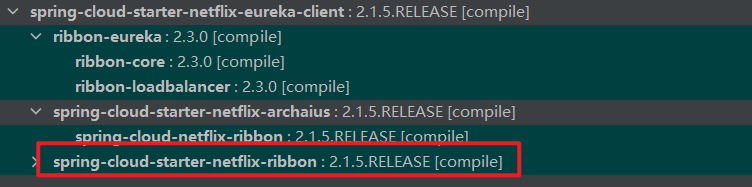
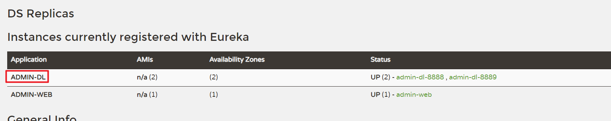
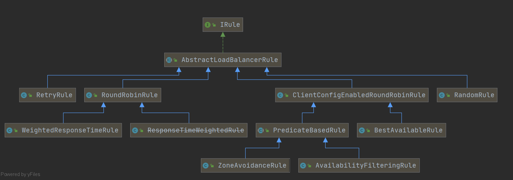

# Spring Cloud Ribbon

Spring Cloud Ribbon是基于Netflix Ribbon实现的一套客户端负载均衡器；

Ribbon是Netflix公司发布的开源项目，主要功能是提供客户端的负载均衡算法，它会从eureka中获取一个可用的服务端清单，通过心跳检测来剔除故障的服务端节点以保证清单中都是可以正常访问的服务端节点。

当客户端发送请求，则Ribbon负载均衡器按某种算法（比如轮询、权重、 最小连接数等）从维护的可用服务端清单中取出一台服务端的地址，然后进行请求；

Spring Cloud 对 Ribbon 做了二次封装，可以让我们使用 RestTemplate 的服务请求，自动转换成客户端负载均衡的服务调用。Ribbon 支持多种负载均衡算法，还支持自定义的负载均衡算法。

## 一. 传统的Rest服务调用

假设现在我们有两个服务`admin-web`、`admin-dl`，假如我们需要在`admin-web`调用`admin-dl`中的`/article/getById`服务。

### 1.1 admin-dl

admin-dl中提供的服务：

```java
@RestController
@RequestMapping("/article")
@Slf4j
public class ArticleController {

    @GetMapping("/getById")
    public ArticleDTO getById() {
        log.info("/article/getById服务被调用");
        ArticleDTO articleDTO = new ArticleDTO();
        articleDTO.setId(1);
        articleDTO.setTitle("测试文章");
        return articleDTO;
    }
}
```

### 1.2 admin-web

我们在admin-web中配置`RestTemplate`用于调用`admin-dl`的HTTP服务：

```java
import org.springframework.context.annotation.Bean;
import org.springframework.context.annotation.Configuration;
import org.springframework.web.client.RestTemplate;

/**
 * @author: Jindong.Tian
 * @date: 2021-04-20
 **/
@Configuration
public class RestConfig {

    @Bean
    public RestTemplate restTemplate(){
        return new RestTemplate();
    }
}
```

此时我们在admin-web定义`/admin/getArticleById`接口供前端使用，并在接口中调用`admin-dl`中的服务：

```java
import cn.bigcoder.springcloud.qa.service.dto.ArticleDTO;
import lombok.extern.slf4j.Slf4j;
import org.springframework.beans.factory.annotation.Autowired;
import org.springframework.http.ResponseEntity;
import org.springframework.web.bind.annotation.RequestMapping;
import org.springframework.web.bind.annotation.RestController;
import org.springframework.web.client.RestTemplate;

/**
 * @author: Jindong.Tian
 * @date: 2021-04-20
 **/
@RestController
@RequestMapping("/admin")
@Slf4j
public class AdminController {

    @Autowired
    private RestTemplate restTemplate;

    @RequestMapping("/getArticleById")
    public ArticleDTO getArticleById() {
        ResponseEntity<ArticleDTO> responseEntity = restTemplate.getForEntity("http://localhost:8888/article/getById", ArticleDTO.class);
        return responseEntity.getBody();
    }
}
```

此时一个HTTP直连服务调用就完成了。

## 二. 使用Ribbon实现客户端负载均衡

在上文中我们通过直连URL，实现了服务调用，但是这样肯定不是我们想要的，在微服务中每一个服务都可能随着业务的发展而横向扩展（集群），前面我们已经搭建一个服务注册中心，同时也向这个服务注册中心注册了服务，接下来我们就可以发现和消费服务了，这其中服务的**发现由 eureka 客户端实现**，而**服务的消费由 Ribbon 实现**，也就是说服务的调用需要 eureka 客户端和 Ribbon，两者配合起来才能实现； 

衡，服务的故障切换等；

Ribbon 是一个基于 HTTP 和 TCP 的客户端负载均衡器，当使用 Ribbon 对服务进行访问的时候，它会扩展 Eureka 客户端的服务发现功能，实现从Eureka 

注册中心中获取服务端列表，并通过 Eureka 客户端来确定服务端是否己经启动。 

Ribbon 在 Eureka 客户端服务发现的基础上，实现了对服务实例的选择策略， 从而实现对服务的负载均衡消费。 

接下来我们来让服务消费者去消费服务： 

我们前面搭建了服务消费者项目，接下来我们就可以使用该服务消费者通过注册

**第一步：引入依赖**

```xml
<dependency>
    <groupId>org.springframework.cloud</groupId>
    <artifactId>spring-cloud-starter-netflix-eureka-client</artifactId>
</dependency>
```

由于后序我们需要使用Ribbon已经被Eureka Client所以依赖了，这里我们就不用显示依赖`Ribbon`依赖了（注意：这里的SpringCloud的版本是Greenwich.SR6）。



**第二步：生产者和消费注册和订阅Eureka**

在 [Eureka环境搭建](_2Eureka环境搭建.md) 中已经完整描述了注册中心的订阅配置，此处不再赘述。

**第三步：修改RestTemplate配置**

我们只需要在RestTemplate上加上`@LoadBalance`注解即可

```java
import org.springframework.cloud.client.loadbalancer.LoadBalanced;
import org.springframework.context.annotation.Bean;
import org.springframework.context.annotation.Configuration;
import org.springframework.web.client.RestTemplate;

/**
 * @author: Jindong.Tian
 * @date: 2021-04-20
 **/
@Configuration
public class RestConfig {

    @Bean
    @LoadBalanced
    public RestTemplate restTemplate(){
        return new RestTemplate();
    }
}
```

**第四步：将调用远程服务URL的`Host`改为SpringCloud应用名称**

```java
@RequestMapping("/getArticleById")
public ArticleDTO getArticleById() {
    ResponseEntity<ArticleDTO> responseEntity = restTemplate.getForEntity("http://admin-dl/article/getById", ArticleDTO.class);
    return responseEntity.getBody();
}
```



这样Ribbon就能根据注册中心注册的服务URL，进行客户端负载均衡，实现远程调用。在上面的示例中`admin-dl`服务提供者有两个实例，admin-web会根据客户端负载均衡的策略去选择一个实例调用。

## 三. Ribbon源码结构



`com.netflix.loadbalancer.IRule`接口定义了Ribbon负载均衡的统一接口，所有负载均衡算法都会实现该接口，如果我们需要实现自己的负载均衡算法，只需要实现该接口即可。

### 3.1 负载均衡实现

| 负载均衡实现               | 策略                                                         |
| -------------------------- | ------------------------------------------------------------ |
| RandomRule                 | 随机                                                         |
| RoundRobinRule             | 轮询                                                         |
| AvailabilityFilteringRule  | 先过滤掉由于多次访问故障的服务，以及并发连接数超过阈值的服务，然后对剩下的服务按照轮询策略进行访问 |
| WeightedResponseTimeRule   | 根据平均响应时间计算所有服务的权重，响应时间越快服务权重就越大被选中的概率即越高，如果服务刚启动时统计信息不足，则使用RoundRobinRule策略，待统计信息足够会切换到该WeightedResponseTimeRule策略 |
| RetryRule                  | 先按照RoundRobinRule策略分发，如果分发到的服务不能访问，则在指定时间内进行重试，然后分发其他可用的服务 |
| BestAvailableRule          | 先过滤掉由于多次访问故障的服务，然后选择一个并发量最小的服务 |
| ZoneAvoidanceRule （默认） | 综合判断服务节点所在区域的性能和服务节点的可用性，来决定选择哪个服务 |

### 3.2 配置负载均衡实现

默认情况下会采用`ZoneAvoidanceRule `负载均衡算法（Greenwich.SR6版本），如果我们需要定义其它内置算法，甚至是自定义负载均衡算法，我们只需要将`IRule`实例注册到Spring容器中即可：

```java
@Bean
public IRule iRule(){
    return new RoundRobinRule();
}
```

