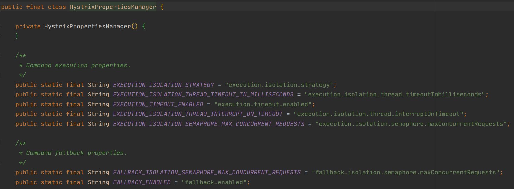

# Spring Cloud Hystrix

Hystrix被称为熔断器，它是一个用于处理分布式系统的延迟和容错的开源库，在分布式系统里，许多服务之间通过远程调用实现信息交互，调用时不可避免会出现调用失败，比如超时、异常等原因导致调用失败，Hystrix能够保证在一个服务出问题的情况下，不会导致整体服务失败，避免级联故障（服务雪崩），以提高分布式系统的弹性。

## 一. 基本使用

**第一步：服务消费者引入依赖**

```xml
<dependency>
    <groupId>org.springframework.cloud</groupId>
    <artifactId>spring-cloud-starter-netflix-hystrix</artifactId>
</dependency>
```

**第二步：启动类加上`@EnableCircuitBreaker `注解**

启动类上加上`@EnableCircuitBreaker`注解以开启断路器，由于`@SpringCloudApplication`和`@EnableHystrix`都继承该注解，所以以上三种注解都可以实现开始断路器的功能。

```java
@SpringBootApplication
@EnableFeignClients("cn.bigcoder.springcloud.qa.admin")
@EnableEurekaClient
@EnableCircuitBreaker
public class AdminWebApplication {

    public static void main(String[] args) {
        SpringApplication.run(AdminWebApplication.class, args);
    }

}
```

**第三步：在调用远程服务（消费者）的方法上加入`@HystrixCommand`注解**

在调用远程服务（消费者）的方法上加入`@HystrixCommand`注解，并提供一个服务降级后的调用方法。

```java
@RequestMapping("/getArticleById2")
@HystrixCommand(fallbackMethod = "articleFallback")
public ArticleDTO getArticleById2(Integer id) {
    ArticleDTO articleDTO = articleService.getById(id);
    return articleDTO;
}

public ArticleDTO articleFallback(Integer id) {
    return new ArticleDTO();
}
```

## 二. 熔断器配置

### 2.1 Hystrix超时降级

当调用超时或者抛出异常时会使用降级方法兜底，我们可以修改服务的超时时间（默认是1s）：

```java
@RequestMapping("/getArticleById2")
@HystrixCommand(fallbackMethod = "articleFallback",commandProperties = {
        @HystrixProperty(name = "execution.timeout.enabled",value = "true"),
        @HystrixProperty(name = "execution.isolation.thread.timeoutInMilliseconds",value = "5000")
})
public ArticleDTO getArticleById2(Integer id) {
    ArticleDTO articleDTO = articleService.getById(id);
    return articleDTO;
}
```

需要注意的是：如果`hystrix.command.default.execution.timeout.enabled`为`true`，则会有两个配置方法超时的配置，一个就是ribbon的`ReadTimeout`，一个就是熔断器`hystrix`的`timeoutInMilliseconds`，此时谁的值小谁生效；如果`hystrix.command.default.execution.timeout.enabled`为false，则熔断器不进行超时熔断，而是根据ribbon的`ReadTimeout`抛出的异常而熔断，也就是取决于ribbon的`ConnectTimeout`，配置的是请求服务的超时时间，除非服务找不到，或者网络原因，这个时间才会生效；

```properties
ribbon.ReadTimeout=6000
ribbon.ConnectTimeout=3000
```

`hystrix`还有很多其它配置，配置名称可以参考`com.netflix.hystrix.contrib.javanica.conf.HystrixPropertiesManager`类：



我们还可以通过注解修改服务的超时时间，我们还可以有个配置文件设置服务默认的超时时间：

```properties
ribbon.ReadTimeout=6000
ribbon.ConnectTimeout=3000
hystrix.command.default.execution.timeout.enabled=true
hystrix.command.default.execution.isolation.thread.timeoutInMilliseconds=5000
```

### 2.2 Hystrix异常处理

我们在调用服务提供者时，服务提供者可能抛出异常，我们自己也可能抛异常，默认情况下方法抛了异常会自动进行服务降级，交给服务降级中的方法去处理；

当我们自己发生异常后，只需要在服务降级方法中添加一个 Throwable 类型的 ：

```java
@RequestMapping("/getArticleById2")
@HystrixCommand(fallbackMethod = "articleFallback", commandProperties = {
        @HystrixProperty(name = "execution.timeout.enabled", value = "true"),
        @HystrixProperty(name = "execution.isolation.thread.timeoutInMilliseconds", value = "2000")
})
public ArticleDTO getArticleById2(Integer id) {
    ArticleDTO articleDTO = articleService.getById(id);
    return articleDTO;
}

public ArticleDTO articleFallback(Integer id, Throwable throwable) {
    ArticleDTO articleDTO = new ArticleDTO();
    articleDTO.setId(id);
    articleDTO.setTitle("服务降级！！！！,error："+throwable.getMessage());
    return articleDTO;
}
```

当然远程服务发生了异常也可以获取到异常信息；

```json
{
	"id": 3,
	"title": "服务降级！！！！,error：status 500 reading IArticleService#getById(Integer)",
	"content": null
}
```

如果我们需要指定特定异常不降级时，只需要通过`ignoreExceptions`配置即可：

```java
@RequestMapping("/getArticleById2")
@HystrixCommand(fallbackMethod = "articleFallback",
        ignoreExceptions = RuntimeException.class)
public ArticleDTO getArticleById2(Integer id) {
    ArticleDTO articleDTO = articleService.getById(id);
    return articleDTO;
}
```

### 2.3 Hystrix限流

hystrix限流就是限制你某个微服务的使用量（可用线程数、缓存任务量）。hystrix通过线程池的方式来管理微服务的调用，它默认是一个线程池（大小10个） 管理你的所有微服务，你可以给某个微服务开辟新的线程池：

```java
@RequestMapping("/getArticleById3")
@HystrixCommand(fallbackMethod = "articleFallback",
        threadPoolKey = "article",
        threadPoolProperties = {
                @HystrixProperty(name = "coreSize", value = "2"),
                @HystrixProperty(name = "maxQueueSize", value = "1")},
        commandProperties = {
                @HystrixProperty(name = "execution.timeout.enabled", value = "true"),
                @HystrixProperty(name = "execution.isolation.thread.timeoutInMilliseconds", value = "5000")
        })
public ArticleDTO getArticleById3(Integer id) throws InterruptedException {
    ArticleDTO articleDTO = articleService.getById(id);
    Thread.sleep(4000);
    return articleDTO;
}

public ArticleDTO articleFallback(Integer id, Throwable throwable) {
    ArticleDTO articleDTO = new ArticleDTO();
    articleDTO.setId(id);
    articleDTO.setTitle("服务降级！！！！,error：" + throwable.getMessage());
    return articleDTO;
}
```

上面接口中我们将超时时间设置5s，并在代码中sleep 4s，这样我们可以模拟用户请求，我们快速访问该接口，当访问第四次时，触发限流降级：

```java
{
	"id": 3,
	"title": "服务降级！！！！,error：Task java.util.concurrent.FutureTask@665bf6c4 rejected from java.util.concurrent.ThreadPoolExecutor@235ef23d[Running, pool size = 2, active threads = 2, queued tasks = 1, completed tasks = 4]",
	"content": null
}
```

## 三. Hystrix整合Feign

feign 默认是支持hystrix的， 但是在Spring cloud Dalston 版本之后就默认关闭了，现在要使用首先得打开他，在配置文件加上如下配置:

```properties
feign.hystrix.enabled=true
```

然后在Feign接口中，通过fallback属性指定降级实现类：

```java
@FeignClient(value = "admin-dl", fallback = ArticleServiceFallback.class)
public interface IArticleService {

    @PostMapping("/article/getById")
    ArticleDTO getById(Integer id);
}
```

```java
@Component
public class ArticleServiceFallback implements IArticleService {

    @Override
    public ArticleDTO getById(Integer id) {
        ArticleDTO articleDTO = new ArticleDTO();
        articleDTO.setTitle("服务降级啦");
        return articleDTO;
    }
}
```

当Feign接口整合Hystrix时需要拿到远程服务调用的异常信息可以通过`fallbackFactory`去实现：

第一步：创建FallbackFactory

```java
@Component
public class ArticleServiceFallbackFactory implements FallbackFactory<IArticleService> {

    @Override
    public IArticleService create(Throwable throwable) {
        return new IArticleService() {
            @Override
            public ArticleDTO getByIdError(Integer id) {
                ArticleDTO articleDTO = new ArticleDTO();
                articleDTO.setTitle("服务降级啦.error：" + throwable.getMessage());
                return articleDTO;
            }
        };
    }
}
```

第二步：配置fallbackFactory

```java
@FeignClient(value = "admin-dl", fallbackFactory = ArticleServiceFallbackFactory.class)
public interface IArticleService {

    @PostMapping("/article/getByIdError")
    ArticleDTO getByIdError(Integer id);
}
```

## 四. Hystrix相关配置

### 4.1 Execution相关的属性的配置

- hystrix.command.default.execution.isolation.strategy：隔离策略，默认是`Thread`, 可选`Thread｜Semaphore（信号量）`
- hystrix.command.default.execution.isolation.thread.timeoutInMilliseconds：执行的超时时间，默认1000ms
- hystrix.command.default.execution.timeout.enabled：执行是否启用超时，默认启用true
- hystrix.command.default.execution.isolation.thread.interruptOnTimeout：发生超时是是否中断，默认true
- hystrix.command.default.execution.isolation.semaphore.maxConcurrentRequests 最大并发请求数，默认10，该参数当使用ExecutionIsolationStrategy.SEMAPHORE策略时才有效。如果达到最大并发请求数，请求会被拒绝。理论上选择semaphore size的原则和选择thread size一致，但选用semaphore时每次执行的单元要比较小且执行速度快（ms级别），否则的话应该用thread。semaphore应该占整个容器（tomcat）的线程池的一小部分。 Fallback相关的属性 这些参数可以应用于Hystrix的THREAD和SEMAPHORE策略；
- hystrix.command.default.fallback.isolation.semaphore.maxConcurrentRequest：如果并发数达到该设置值，请求会被拒绝和抛出异常并且fallback不会被调用。默认10
- hystrix.command.default.fallback.enabled：当执行失败或者请求被拒绝，是否会尝试调用hystrixCommand.getFallback() 。默认true

### 4.2 Circuit Breaker相关的属性 

- hystrix.command.default.circuitBreaker.enabled：用来跟踪circuit的健康性，如果未达标则让request短路。默认true
- hystrix.command.default.circuitBreaker.requestVolumeThreshold：一个rolling window内最小的请求数。如果设为20，那么当一个rolling window的时间内（比如说1个rolling window是10秒）收到19个请求， 即使19个请求都失败，也不会触发circuit break。默认20
   hystrix.command.default.circuitBreaker.sleepWindowInMilliseconds 触发短路的时间值，当该值设为5000时，则当触发circuit break后的5000毫秒内都会拒绝request，也就是5000毫秒后才会关闭circuit。 默认5000

- hystrix.command.default.circuitBreaker.errorThresholdPercentage：错误比率阀值，如果错误率>=该 值，circuit会被打开，并短路所有请求触发fallback。默认50

- hystrix.command.default.circuitBreaker.forceOpen：强制打开熔断器，如果打开这个开关，那么拒绝所有request，默认false
- hystrix.command.default.circuitBreaker.forceClosed：强制关闭熔断器，如果这个开关打开，circuit将 一直关闭且忽略circuitBreaker.errorThresholdPercentage

### 4.3 Metrics相关参数

- hystrix.command.default.metrics.rollingStats.timeInMilliseconds：设置统计的时间窗口值的，毫秒值，circuit break 的打开会根据1个rolling window的统计来计算。若rolling window被设为10000毫秒，则rolling window会被分成n个buckets，每个bucket包含success，failure，timeout，rejection的次数的统计信息。默认10000
- hystrix.command.default.metrics.rollingStats.numBuckets：设置一个rolling window被划分的数 量，若numBuckets＝10，rolling window＝10000，那么一个bucket的时间即1秒。必须符合rolling window % numberBuckets == 0。默认10
- hystrix.command.default.metrics.rollingPercentile.enabled：执行时是否enable指标的计算和跟踪， 默认true
- hystrix.command.default.metrics.rollingPercentile.timeInMilliseconds：设置rolling percentile window的时间，默认60000
- hystrix.command.default.metrics.rollingPercentile.numBuckets：设置rolling percentile window的numberBuckets。逻辑同上。默认6
- hystrix.command.default.metrics.rollingPercentile.bucketSize：如果bucket size＝100，window ＝10s，若这10s里有500次执行，只有最后100次执行会被统计到bucket里去。增加该值会增加内存开销以及排序 的开销。默认100
- hystrix.command.default.metrics.healthSnapshot.intervalInMilliseconds：记录health 快照（用 来统计成功和错误绿）的间隔，默认500ms

### 4.4 Request Context 相关参数

- hystrix.command.default.requestCache.enabled：默认true，需要重载getCacheKey()，返回null时不缓存
- hystrix.command.default.requestLog.enabled：记录日志到HystrixRequestLog，默认true

### 4.5  Collapser Properties 相关参数

- hystrix.collapser.default.maxRequestsInBatch：单次批处理的最大请求数，达到该数量触发批处理，默认 Integer.MAX_VALUE
- hystrix.collapser.default.timerDelayInMilliseconds：触发批处理的延迟，也可以为创建批处理的时间 ＋该值，默认10
- hystrix.collapser.default.requestCache.enabled：是否对HystrixCollapser.execute() and HystrixCollapser.queue()的cache，默认true
   ThreadPool 相关参数

### 4.6 ThreadPool相关参数

线程数默认值10适用于大部分情况（有时可以设置得更小），如果需要设置得更大，那有个基本得公式可以 follow： requests per second at peak when healthy × 99th percentile latency in seconds + some breathing room 每秒最大支撑的请求数 (99%平均响应时间 + 缓存值) 比如：每秒能处理1000个请求，99%的请求响应时间是60ms，那么公式是： 1000 （0.060+0.012）基本得原则时保持线程池尽可能小，他主要是为了释放压力，防止资源被阻塞。 当一切都是正常的时候，线程池一般仅会有1到2个线程激活来提供服务

- hystrix.threadpool.default.coreSize：并发执行的最大线程数，默认10
- hystrix.threadpool.default.maxQueueSize：BlockingQueue的最大队列数，当设为－1，会使用SynchronousQueue，值为正时使用LinkedBlcokingQueue。该设置只会在初始化时有效，之后不能修改threadpool的queue size，除非reinitialising thread executor。默认－1。
- hystrix.threadpool.default.queueSizeRejectionThreshold：即使maxQueueSize没有达到，达到 queueSizeRejectionThreshold该值后，请求也会被拒绝。因为maxQueueSize不能被动态修改，这个参数将允 许我们动态设置该值。if maxQueueSize == ­1，该字段将不起作用
- hystrix.threadpool.default.keepAliveTimeMinutes：如果corePoolSize和maxPoolSize设成一样（默认 实现）该设置无效。如果通过plugin（https://github.com/Netflix/Hystrix/wiki/Plugins）使用自定义 实现，该设置才有用，默认1.
- hystrix.threadpool.default.metrics.rollingStats.timeInMilliseconds：线程池统计指标的时间，默 认10000
- hystrix.threadpool.default.metrics.rollingStats.numBuckets：将rolling window划分为n个 buckets，默认10；

