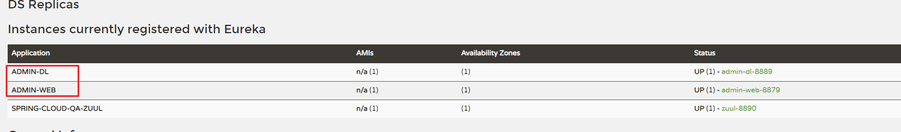
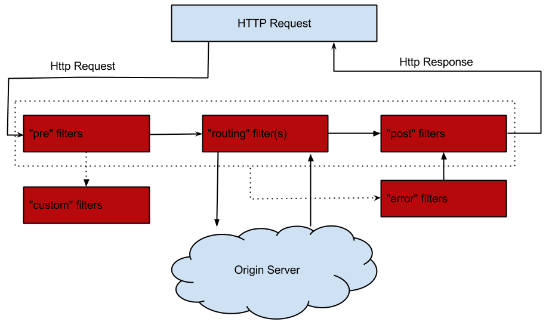

# Spring Cloud Zuul

前面的文章我们介绍了，Eureka用于服务的注册于发现，Feign支持服务的调用以及均衡负载，Hystrix处理服务的熔断防止故障扩散，Spring Cloud Config服务集群配置中心，似乎一个微服务框架已经完成了。

我们还是少考虑了一个问题，外部的应用如何来访问内部各种各样的微服务呢？在微服务架构中，后端服务往往不直接开放给调用端，而是通过一个API网关根据请求的url，路由到相应的服务。当添加API网关后，在第三方调用端和服务提供方之间就创建了一面墙，这面墙直接与调用方通信进行权限控制，后将请求均衡分发给后台服务端。

## 一. 为什么需要API Gateway

### 1.1 简化客户端调用复杂度

在微服务架构模式下后端服务的实例数一般是动态的，对于客户端而言很难发现动态改变的服务实例的访问地址信息。因此在基于微服务的项目中为了简化前端的调用逻辑，通常会引入API Gateway作为轻量级网关，同时API Gateway中也会实现相关的认证逻辑从而简化内部服务之间相互调用的复杂度。

### 1.2 数据裁剪以及聚合

通常而言不同的客户端对于显示时对于数据的需求是不一致的，比如手机端或者Web端又或者在低延迟的网络环境或者高延迟的网络环境。

因此为了优化客户端的使用体验，API Gateway可以对通用性的响应数据进行裁剪以适应不同客户端的使用需求。同时还可以将多个API调用逻辑进行聚合，从而减少客户端的请求数，优化客户端用户体验

### 1.3 多渠道支持

当然我们还可以针对不同的渠道和客户端提供不同的API Gateway,对于该模式的使用由另外一个大家熟知的方式叫Backend for front-end, 在Backend for front-end模式当中，我们可以针对不同的客户端分别创建其BFF，进一步了解BFF可以参考这篇文章：[Pattern: Backends For Frontends](http://samnewman.io/patterns/architectural/bff/)


### 1.4 遗留系统的微服务化改造

对于系统而言进行微服务改造通常是由于原有的系统存在或多或少的问题，比如技术债务，代码质量，可维护性，可扩展性等等。API Gateway的模式同样适用于这一类遗留系统的改造，通过微服务化的改造逐步实现对原有系统中的问题的修复，从而提升对于原有业务响应力的提升。通过引入抽象层，逐步使用新的实现替换旧的实现。


Spring Cloud Zuul路由是微服务架构的不可或缺的一部分，提供动态路由，监控，弹性，安全等的边缘服务。Zuul是Netflix出品的一个基于JVM路由和服务端的负载均衡器。

下面我们通过代码来了解Zuul是如何工作的

## 二. 简单使用

第一步：新建一个网关模块

第二步：添加依赖

```xml
<dependency>
	<groupId>org.springframework.cloud</groupId>
	<artifactId>spring-cloud-starter-zuul</artifactId>
</dependency>
```

第三步：配置文件修改

```yml
server:
  port: 8890
spring:
  application:
    #是eureka注册中心首页的Application这一栏
    name: spring-cloud-qa-zuul
eureka:
  client:
    service-url:
      #eureka注册中心的连接地址
      defaultZone: http://localhost:8761/eureka
  instance:
    #告诉服务端，服务实例的id，id必须要唯一，是eureka注册中心首页的Status这一栏
    instance-id: zuul-8890
    #告诉服务端，如果我10s之内没有给你发心跳，就代表我故障了，将我踢出掉
    lease-expiration-duration-in-seconds: 10
    #每间隔2s，向服务端发送一次心跳，证明自己依然"存活"
    lease-renewal-interval-in-seconds: 2
    #告诉服务端，服务实例以IP作为链接，而不是取机器名
    prefer-ip-address: true
```

第四步：启动类上加入`EnableZuulProxy`注解

```java
@SpringBootApplication
@EnableZuulProxy
public class SpringCloudZuulApplication {

    public static void main(String[] args) {
        SpringApplication.run(SpringCloudZuulApplication.class, args);
    }

}
```

测试在我们注册中心中注册两个服务`admin-web`、`admin-dl`：



在admin-web中拥有：`/admin/getArticleById`接口，在admin-dl中拥有：`/article/getById`接口，启动好网关后，我们就可以以`http://{网关地址}/{服务名称}/{接口}`的形式访问网关代理的所有服务：

```shell
http://localhost:8890/admin-web/admin/getArticleById?id=3
http://localhost:8890/admin-dl/article/getById?id=3
```

###  映射配置

在实际开发中我们不会使用服务名称进行访问，因为服务名称是不会对外暴露的，我们会将每一个服务映射到不同的路径上：

```yml
zuul:
  routes:
    admin-web:
      service-id: admin-web
      path: /portal/**
    admin-dl:
      service-id: admin-dl
      path: /article/**
  #禁用服务名访问
  ignored-services: admin-web,admin-dl
```

在上面的配置中，我们将原先`admin-web`服务下的所有接口全部映射到了`/portal`下，将`admin-dl`服务下的所有接口映射到了`/article`下，并通过`ignored-services`禁用了所有服务名访问。

可能有时候我们的接口调用需要一定的规范，比如调用微服务的API URL前缀需要加上/api 对于这种情况，zuul也考虑到了并给出了解决方案：

```yml
zuul:
  prefix: /api
```

这样我们访问`admin-web`的接口就需要通过如下路径访问了：

```shell
http://localhost:8890/api/portal/*
```

#### path配置

| 通配符 | 含义               | 举例       | 说明                                                         |
| ------ | ------------------ | ---------- | ------------------------------------------------------------ |
| ？     | 匹配任意单个字符   | /portal/?  | 匹配   /admin-web/a,   /admin-web/b,   /admin-web/c 等       |
| *      | 匹配任意数量的字符 | /portal/*  | 匹配   /admin-web/aaa,   /admin-web/bbb,   /admin-web/ccc 等； 无法匹配   /admin-web/a/b/c |
| **     | 匹配任意数量的字符 | /portal/** | 匹配   /admin-web/aaa,   /admin-web/bbb,   /admin-web/ccc 等；也可以匹配   /admin-web/a/b/c |

#### 禁用指定模式的访问

```yml
zuul:
  ignored-patterns: /article/**
```

禁用所有`/article`开头的路由访问

## 三. 过滤器

Zuul 中的过滤器跟我们之前使用的 javax.servlet.Filter 不一样，javax.servlet.Filter 只有一种类型，可以通过配置 urlPatterns 来拦截对应的请求。

而 Zuul 中的过滤器总共有 4 种类型，且每种类型都有对应的使用场景。

### 3.1 过滤器类型

- pre

可以在请求被路由之前调用。适用于身份认证的场景，认证通过后再继续执行下面的流程。

- route

在路由请求时被调用。适用于灰度发布场景，在将要路由的时候可以做一些自定义的逻辑。

- post

在 route 和 error 过滤器之后被调用。这种过滤器将请求路由到达具体的服务之后执行。适用于需要添加响应头，记录响应日志等应用场景。

- error

处理请求时发生错误时被调用。在执行过程中发送错误时会进入 error 过滤器，可以用来统一记录错误信息。

### 3.2 请求的生命周期



通过上面的图可以清楚地知道整个执行的顺序，请求发过来首先到 pre 过滤器，再到 routing 过滤器，最后到 post 过滤器，任何一个过滤器有异常都会进入 error 过滤器。

