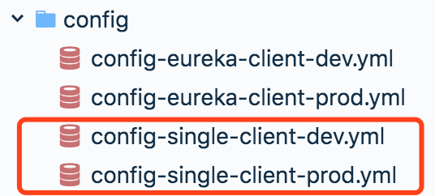
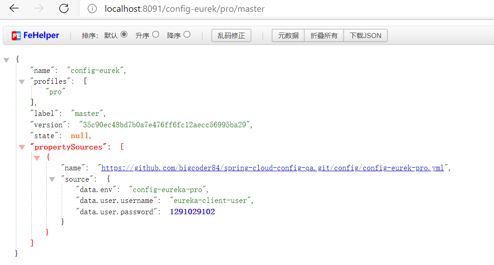
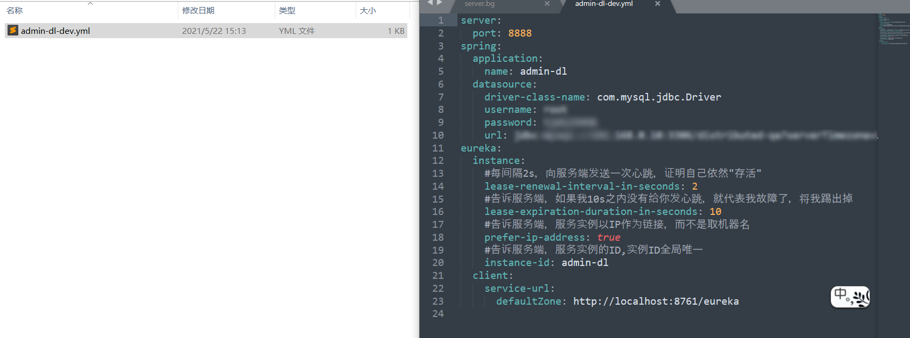
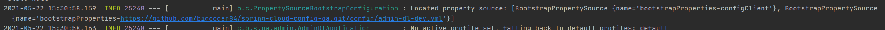
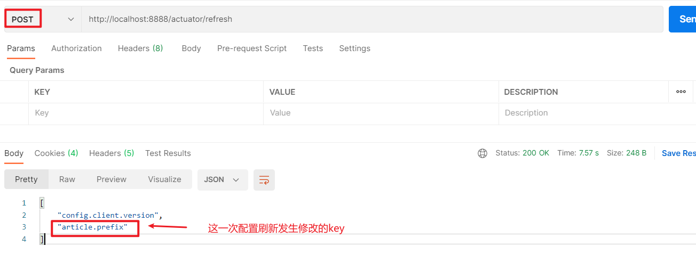
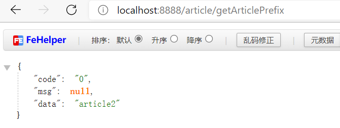

# Spring Cloud Config

> [Spring Cloud Config 实现配置中心，看这一篇就够了 - 风的姿态 - 博客园 (cnblogs.com)](https://www.cnblogs.com/fengzheng/p/11242128.html)

Spring Cloud Config 是 Spring Cloud 家族中最早的配置中心，虽然后来又发布了 Consul 可以代替配置中心功能，但是 Config 依然适用于 Spring Cloud 项目，通过简单的配置即可实现功能。

配置文件是我们再熟悉不过的了，尤其是 Spring Boot 项目，除了引入相应的 maven 包之外，剩下的工作就是完善配置文件了，例如 mysql、redis 、security 相关的配置。除了项目运行的基础配置之外，还有一些配置是与我们业务有关系的，比如说七牛存储、短信相关、邮件相关，或者一些业务上的开关。

对于一些简单的项目来说，我们一般都是直接把相关配置放在单独的配置文件中，以 properties 或者 yml 的格式出现，更省事儿的方式是直接放到 application.properties 或 application.yml 中。但是这样的方式有个明显的问题，那就是，当修改了配置之后，必须重启服务，否则配置无法生效。

目前有一些用的比较多的开源的配置中心，比如携程的 Apollo、蚂蚁金服的 disconf 等，对比 Spring Cloud Config，这些配置中心功能更加强大。有兴趣的可以拿来试一试。

**接下来**，我们开始在 Spring Boot 项目中集成 Spring Cloud Config，并以 github 作为配置存储。除了 git 外，还可以用数据库、svn、本地文件等作为存储。主要从以下三块来说一下 Config 的使用。

1. 基础版的配置中心（不集成 Eureka）;

2. 结合 Eureka 版的配置中心;

3. 实现配置的自动刷新；

## 一. 创建配置中心服务端

最简单的配置中心，就是启动一个服务作为服务方，之后各个需要获取配置的服务作为客户端来这个服务方获取配置。

**第一步：创建一个Git仓库**



配置文件内容大致如下：

```yml
data:
  env: config-eureka-dev
  user:
    username: eureka-client-user
    password: 1291029102
```

**第二步：创建SpringBoot项目作为config server**

**第三步：在项目中引入`Spring Cloud config`依赖**

```xml
<dependency>
    <groupId>org.springframework.boot</groupId>
    <artifactId>spring-boot-starter-web</artifactId>
</dependency>
<dependency>
    <groupId>org.springframework.cloud</groupId>
    <artifactId>spring-cloud-config-server</artifactId>
</dependency>
```

**第四步：配置config server 连接Git仓库**

```yml
server:
  port: 8091
spring:
  application:
    # 应用名称
    name: config-single-server
  cloud:
    config:
      server:
        git:
          #配置中心拉取git仓库到本地的位置
          basedir: C:\Users\JindongTian\Desktop\config-cache
          #配置文件所在仓库
          uri: git@github.com:bigcoder84/spring-cloud-config-qa.git
          username: bigcoder84
          password: *********
          #配置文件分支
          default-label: master
          #配置文件所在根目录
          search-paths: config
          skip-ssl-validation: true
```

**第五步：在启动类上加上`@EnableConfigServer`注解**

启动Config Server后我们可以通过下列模式，去访问Git中存储的配置文件了：

```txt
/{application}/{profile}[/{label}]
/{application}-{profile}.yml
/{label}/{application}-{profile}.yml
/{application}-{profile}.properties
/{label}/{application}-{profile}.properties
```

- {application} 就是应用名称，对应到配置文件上来，就是配置文件的名称部分，例如我上面创建的配置文件。

- {profile} 就是配置文件的版本，我们的项目有开发版本、测试环境版本、生产环境版本，对应到配置文件上来就是以 application-{profile}.yml 加以区分，例如application-dev.yml、application-sit.yml、application-prod.yml。

- {label} 表示 git 分支，默认是 master 分支，如果项目是以分支做区分也是可以的，那就可以通过不同的 label 来控制访问不同的配置文件了。

上面的 5 条规则中，我们只看前三条，因为我这里的配置文件都是 yml 格式的。根据这三条规则，我们可以通过以下地址查看配置文件内容:

http://localhost:8091/config-single-client/dev/master

http://localhost:8091/config-single-client/prod

http://localhost:8091/config-single-client-dev.yml

http://localhost:8091/config-single-client-prod.yml

http://localhost:8091/master/config-single-client-prod.yml

通过访问以上地址，如果可以正常返回数据，则说明配置中心服务端一切正常。



## 二. 配置中心客户端

配置中心服务端好了，配置数据准备好了，接下来，就要在我们的项目中使用它了。

**第一步：引入依赖**

```xml
<!-- spring cloud config 客户端包 -->
<dependency>
    <groupId>org.springframework.cloud</groupId>
    <artifactId>spring-cloud-starter-config</artifactId>
</dependency>
```

**第二步：创建`bootstrap.yml/bootstrap.properties`文件，用于引导SpringBoot启动获取配置中心配置**

```yml
spring:
  application:
    name: admin-dl
  cloud:
    config:
      profile: dev
      label: master
      uri: http://localhost:8091
```

在上文提到了，配置文件在注册中心中需要三个属性（`application`、`profile`、`label`）才能唯一确定，所以在bootstrap配置文件中需要指定这三个属性以及配置中心地址，去告诉SpringBoot在引导时去获取哪一个配置文件。

**第三步：将配置文件push到Spring Cloud Config依赖的Git仓库中，然后重启配置中心**



**第四步：启动客户端服务**

通过客户端的启动日志我们可以看到，在启动时会先去注册中心中拉取配置信息，然后通过拉取的配置信息再去进行SpringBoot初始化流程。



## 三. 引入Spring Cloud Config后配置文件的优先级

### 3.1 Spring Boot的配置优先级

命令行参数 > 操作系统环境变量 > 应用外的配置文件 > 应用内的配置文件

这里命令行参数设置的优先级是最高的，方便部署不同环境。

### 3.2 引入Spring Cloud Config后的优先级

加入springcloud的配置中心后，优先级并不是想象中的命令行最高优先级。

我实验后得到的优先级有：配置中心 > 命令行参数 > 本地application.yml > 本地bootstrap.yml

它的设计者认为，配置中心就是最高优先级的，不允许外部修改。

如果想要覆盖，可在远程配置中加下面配置

```javascript
spring:
  cloud:
    config:
      allowOverride: true
      overrideNone: true
      overrideSystemProperties: false
```

## 四. Spring Cloud Config自动刷新

Spring Cloud Config 依赖于Git仓库，并且在项目启动时加载配置内容这一机制，导致了它存在一个缺陷，修改配置文件内容后，不会自动刷新。例如我们上面的项目，当服务已经启动的时候，去修改 Git仓库中的配置文件内容，这时候，再次刷新页面，对不起，还是旧的配置内容，新内容不会主动刷新过来。并且就算配置中心中的内容刷新后，依赖于配置中心的客户端在运行时也不会随着配置中心的更新而更新。

### 4.1 局部刷新

很多场景下，需要在运行期间动态调整配置，如果配置发生了修改，微服务要如何实现配置的动态刷新呢？

Spring Boot 的actuator提供了一个刷新端点/refresh，添加依赖spring-boot-starter-actuator，可用于配置的刷新；

**第一步：添加`actuator`依赖**

```xml
<dependency>
    <groupId>org.springframework.boot</groupId>
    <artifactId>spring-boot-starter-actuator</artifactId>
</dependency>
```

**第二步：在Controller上添加注解@RefreshScope，添加这个注解的类会在配置更新时得到特殊的处理**

```java
package cn.bigcoder.springcloud.qa.admin.controller;

import cn.bigcoder.springcloud.qa.admin.dto.ArticleDTO;
import cn.bigcoder.springcloud.qa.common.dto.JsonReturn;
import lombok.extern.slf4j.Slf4j;
import org.springframework.beans.factory.annotation.Value;
import org.springframework.cloud.context.config.annotation.RefreshScope;
import org.springframework.web.bind.annotation.PostMapping;
import org.springframework.web.bind.annotation.RequestMapping;
import org.springframework.web.bind.annotation.RestController;

/**
 * @author: Jindong.Tian
 * @date: 2021-03-21
 **/
@RestController
@RequestMapping("/article")
@Slf4j
@RefreshScope
public class ArticleController {

    @Value("${article.prefix}")
    private String ARTICLE_PREFIX;
    
    @RequestMapping("/getArticlePrefix")
    public JsonReturn getArticlePrefix() {
        return JsonReturn.successInstance(ARTICLE_PREFIX);
    }
}
```

**第三步：打开web访问端点**

```properties
management.endpoints.web.exposure.include=*
```

由于当前项目的配置全部有配置中心托管，所以我们只需要更改Config Server所依赖的Git仓库中的配置文件即可。

**第四步：手动刷新配置**

在手动刷新之前我们通过[http://localhost:8888/article/getArticlePrefix](http://localhost:8888/article/getArticlePrefix)查看配置文件中的`article.prefix`的值为"article"：


我们修改Git仓库中`article.prefix`的值为”article2“，然后通过[localhost:8888/actuator/refresh](http://localhost:8888/actuator/refresh)手动刷新配置，需要注意的是该接口只允许使用POST方式请求，所以我们需要借助Postman去请求：



然后我们再次查看`article.prefix`值验证刷新成功：



### 4.2 配置全局刷新

前面使用`/actuator/refresh`端点手动刷新配置虽然可以实现刷新，如果只有一个 client 端的话，那我们用Git webhook ，或设置手动刷新都不算太费事，但是如果端比较多的话呢，一个一个去手动刷新未免有点复杂。这样的话，我们可以借助 Spring Cloud Bus 的广播功能，让 client 端都订阅配置更新事件，当配置更新时，触发其中一个端的更新事件，Spring Cloud Bus 就把此事件广播到其他订阅端，以此来达到批量更新。

> Spring Cloud Bus 将分布式系统的节点与轻量级消息代理链接。这可以用于广播状态更改（例如配置更改）或其他管理指令。一个关键的想法是，Bus 就像一个扩展的 Spring Boot 应用程序的分布式执行器，但也可以用作应用程序之间的通信渠道。

**第一步：搭建RabbitMQ**

Spring Cloud Bus 核心原理其实就是利用消息队列做广播，所以要先有个消息队列，目前官方支持 RabbitMQ 和 kafka。

这里用的是 RabbitMQ， 所以先要搭一套 RabbitMQ 环境。请自行准备环境，这里不再赘述。我是用 docker 直接创建的，然后安装了 rabbitmq-management 插件，这样就可以在浏览器访问 15672 查看 UI 管理界面了。

**第二步：Config项目添加依赖（服务端）**

```xml
<dependency>
    <groupId>org.springframework.cloud</groupId>
    <artifactId>spring-cloud-starter-bus-amqp</artifactId>
</dependency>
<dependency>
    <groupId>org.springframework.cloud</groupId>
    <artifactId>spring-cloud-starter-bus-amqp</artifactId>
</dependency>
```

**第三步：配置文件添加（服务端）**

```properties
#配置rabbitmq
spring.rabbitmq.host=192.168.10.128
spring.rabbitmq.port=5672
spring.rabbitmq.username=guest
spring.rabbitmq.password=guest

#开启spring cloud bus，默认是开启的，也可以省略该配置
spring.cloud.bus.enabled=true

#打开所有的web访问端点
management.endpoints.web.exposure.include=*
```

**第四步：在Client端加入依赖**

```xml
<dependency>
    <groupId>org.springframework.cloud</groupId>
    <artifactId>spring-cloud-starter-bus-amqp</artifactId>
</dependency>
```

**第五步：配置Client端RabbitMQ相关配置**

```properties
#配置rabbitmq
spring.rabbitmq.host=192.168.10.128
spring.rabbitmq.port=5672
spring.rabbitmq.username=guest
spring.rabbitmq.password=guest
```

然后post方式请求地址：http://localhost:8888/actuator/bus-refresh （Config服务端）如果返回成功1，则RabbitMQ将收到消息，然后微服务会消费消息，config的所有客户端的微服务配置都会动态刷新；
