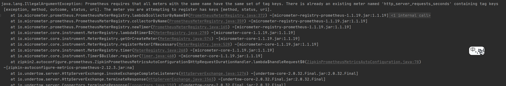
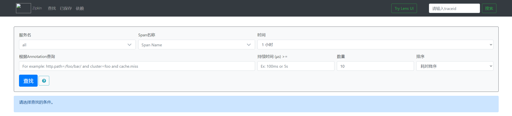
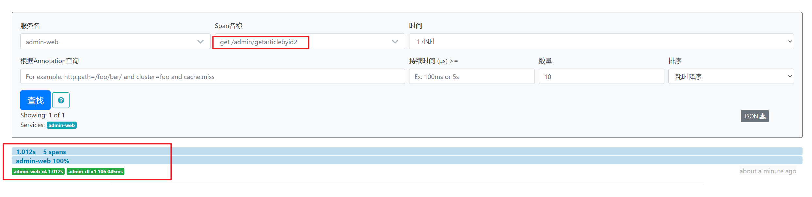

# Spring Cloud Sleuth + Zipkin

> 本文参考：[springcloud(十二)：使用Spring Cloud Sleuth和Zipkin进行分布式链路跟踪](http://www.ityouknow.com/springcloud/2018/02/02/spring-cloud-sleuth-zipkin.html)

随着业务发展，系统拆分导致系统调用链路愈发复杂一个前端请求可能最终需要调用很多次后端服务才能完成，当整个请求变慢或不可用时，我们是无法得知该请求是由某个或某些后端服务引起的，这时就需要解决如何快读定位服务故障点，以对症下药。于是就有了分布式系统调用跟踪的诞生。

现今业界分布式服务跟踪的理论基础主要来自于 Google 的一篇论文[《Dapper, a Large-Scale Distributed Systems Tracing Infrastructure》](https://research.google.com/pubs/pub36356.html)，使用最为广泛的开源实现是 Twitter 的 Zipkin，为了实现平台无关、厂商无关的分布式服务跟踪，CNCF 发布了布式服务跟踪标准 Open Tracing。国内，淘宝的“鹰眼”、京东的“Hydra”、大众点评的“CAT”、新浪的“Watchman”、唯品会的“Microscope”、窝窝网的“Tracing”都是这样的系统。

## 一. Spring Cloud Sleuth介绍

一般的，一个分布式服务跟踪系统，主要有三部分：数据收集、数据存储和数据展示。根据系统大小不同，每一部分的结构又有一定变化。譬如，对于大规模分布式系统，数据存储可分为实时数据和全量数据两部分，实时数据用于故障排查（troubleshooting），全量数据用于系统优化；数据收集除了支持平台无关和开发语言无关系统的数据收集，还包括异步数据收集（需要跟踪队列中的消息，保证调用的连贯性），以及确保更小的侵入性；数据展示又涉及到数据挖掘和分析。虽然每一部分都可能变得很复杂，但基本原理都类似。


服务追踪的追踪单元是从客户发起请求（request）抵达被追踪系统的边界开始，到被追踪系统向客户返回响应（response）为止的过程，称为一个“trace”。每个 trace 中会调用若干个服务，为了记录调用了哪些服务，以及每次调用的消耗时间等信息，在每次调用服务时，埋入一个调用记录，称为一个“span”。这样，若干个有序的 span 就组成了一个 trace。在系统向外界提供服务的过程中，会不断地有请求和响应发生，也就会不断生成 trace，把这些带有span 的 trace 记录下来，就可以描绘出一幅系统的服务拓扑图。附带上 span 中的响应时间，以及请求成功与否等信息，就可以在发生问题的时候，找到异常的服务；根据历史数据，还可以从系统整体层面分析出哪里性能差，定位性能优化的目标。

Spring Cloud Sleuth为服务之间调用提供链路追踪。通过Sleuth可以很清楚的了解到一个服务请求经过了哪些服务，每个服务处理花费了多长。从而让我们可以很方便的理清各微服务间的调用关系。此外Sleuth可以帮助我们：

- 耗时分析：通过Sleuth可以很方便的了解到每个采样请求的耗时，从而分析出哪些服务调用比较耗时;
- 可视化错误：对于程序未捕捉的异常，可以通过集成Zipkin服务界面上看到;
- 链路优化：对于调用比较频繁的服务，可以针对这些服务实施一些优化措施。

spring cloud sleuth可以结合zipkin，将信息发送到zipkin，利用zipkin的存储来存储信息，利用zipkin ui来展示数据。

这是Spring Cloud Sleuth的概念图：


## 二. Zipkin介绍

Zipkin 是一个开放源代码分布式的跟踪系统，由Twitter公司开源，它致力于收集服务的定时数据，以解决微服务架构中的延迟问题，包括数据的收集、存储、查找和展现。

每个服务向Zipkin报告计时数据，Zipkin会根据调用关系通过Zipkin UI生成依赖关系图，显示了多少跟踪请求通过每个服务，该系统让开发者可通过一个 Web 前端轻松的收集和分析数据，例如用户每次请求服务的处理时间等，可方便的监测系统中存在的瓶颈。

Zipkin提供了可插拔数据存储方式：In-Memory、MySQL、Cassandra以及Elasticsearch。接下来的测试为方便直接采用In-Memory方式进行存储，生产推荐Elasticsearch。

## 三. 搭建Zipkin Server

**第一步：创建一个SpringBoot项目**

**第二步：引入Zipkin依赖**

```xml
<dependencies>
    <dependency>
        <groupId>io.zipkin.java</groupId>
        <artifactId>zipkin-autoconfigure-ui</artifactId>
        <version>2.12.3</version>
    </dependency>

    <!-- zipkin-server -->
    <dependency>
        <groupId>io.zipkin.java</groupId>
        <artifactId>zipkin-server</artifactId>
        <version>2.12.3</version>
    </dependency>
</dependencies>
```

注意：这个里面有版本的兼容性问题，当前我们的`Spring Cloud G SR3`版本使用2.12.3便可以正常使用，如果使用`zipkin-server`的最新的版本，可能会启动失败；

**第三步：修改`application.yml`配置**

```yml
server:
  port: 8892
management:
  metrics:
    web:
      server:
        autoTimeRequests: false
```

`management.metrics.web.server.autoTimeRequests=false`是为了解决Zipin启动报错的问题：



**第四步：启动类加上`@EnableZipkinServer`注解**

```java
@SpringBootApplication
@EnableZipkinServer
public class SpringCloudZipkinApplication {

    public static void main(String[] args) {
        SpringApplication.run(SpringCloudZipkinApplication.class, args);
    }

}
```

**第五步：启动服务器**



## 四. 项目添加Zipkin支持

**第一步：在各模块中添加Zipkin依赖**

```xml
<dependency>
    <groupId>org.springframework.cloud</groupId>
    <artifactId>spring-cloud-starter-zipkin</artifactId>
</dependency>
```

Spring应用在监测到Java依赖包中有Sleuth和Zipkin后，会自动在RestTemplate的调用过程中向HTTP请求注入追踪信息，并向Zipkin Server发送这些信息。

**第二步：配置文件中添加如下配置**

```yml
spring:
  zipkin:
    base-url: http://localhost:8892
  sleuth:
    sampler:
      percentage: 1.0
```

`spring.zipkin.base-url`指定了Zipkin服务器的地址，`spring.sleuth.sampler.percentage`将采样比例设置为1.0，也就是全部都需要。

Spring Cloud Sleuth有一个Sampler策略，可以通过这个实现类来控制采样算法。采样器不会阻碍span相关id的产生，但是会对导出以及附加事件标签的相关操作造成影响。 Sleuth默认采样算法的实现是Reservoir sampling，具体的实现类是`PercentageBasedSampler`，默认的采样比例为: 0.1(即10%)。不过我们可以通过`spring.sleuth.sampler.percentage`来设置，所设置的值介于0.0到1.0之间，1.0则表示全部采集。

**第三步：进行验证**

微服务项目的每个模块都需要按照上面两部整合Zipkin，然后按照`Eureka->Zipkin->微服务1->微服务2`的顺序启动服务，访问`http://localhost:8879/admin/getArticleById`使得微服务链路走通，并上传数据到Zipkin。

访问Zipkin Web页面就可以链路跟踪信息：



## 五. Zipkin数据持久化

前面我们已经把分布式链路调用信息上传到 Zipkin Server 上，通过Zipkin server 的UI界面我们能看到调用链路信息，但是这些上传了的跟踪信息没有持久化保存，当Zipkin重启后分布式链路数据就全部清空了，因为Zipkin Server 默认数据是存储在内存中的，所以为了后续一直都能查看调用链路信息，最好是将这些信息持久化保存；

### 5.1 使用ElasticSearch持久化

ES的搭建过程这里不做赘述，这里只展示ES持久化的配置.

**第一步：添加依赖**

```xml
<dependency>
    <groupId>io.zipkin.java</groupId>
    <artifactId>zipkin-autoconfigure-storage-elasticsearch-http</artifactId>
    <version>2.8.4</version>
</dependency>
```

**第二步：添加如下配置**

```properties
zipkin.storage.type=elasticsearch
zipkin.storage.elasticsearch.cluster=elasticsearch
zipkin.storage.elasticsearch.hosts=http://localhost:9201
zipkin.storage.elasticsearch.index=zipkin
```

