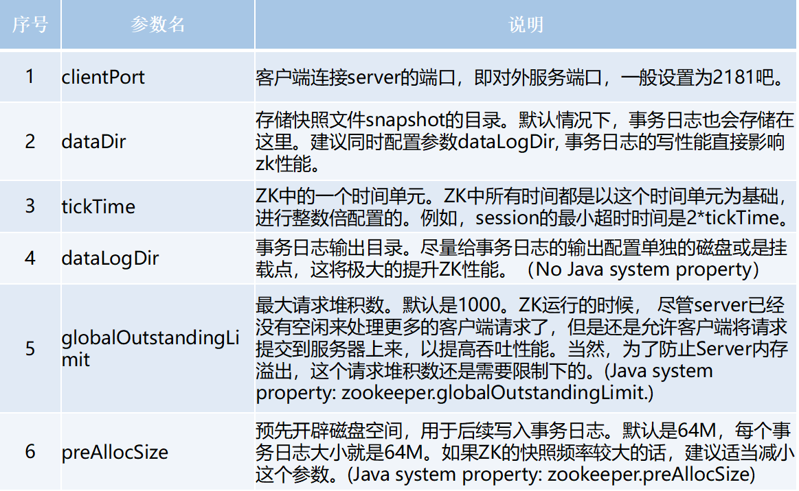
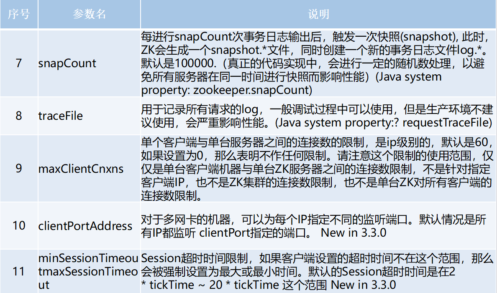
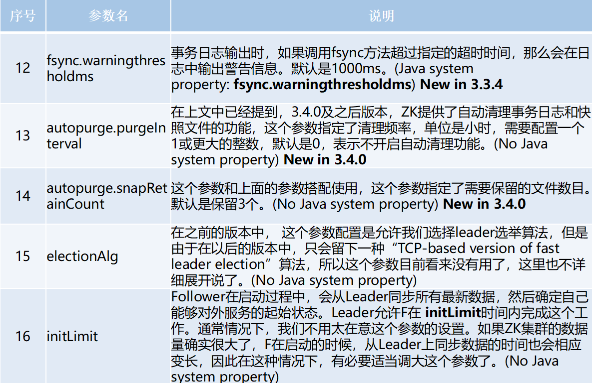
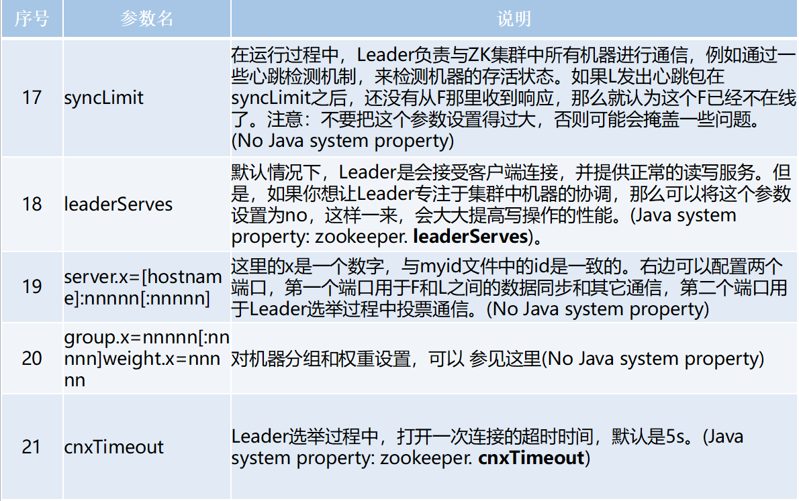
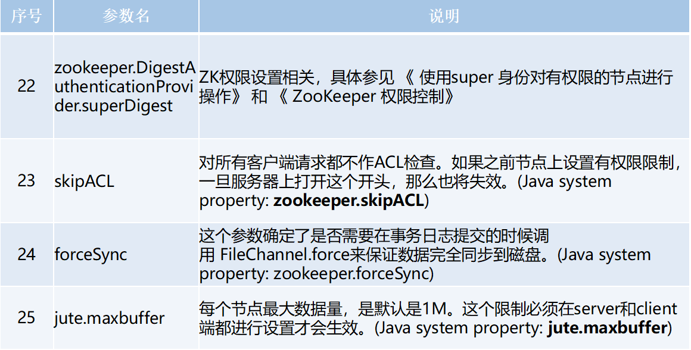

# Zookeeper安装

zookeeper有单机、伪集群、集群三种部署方式。

## 一. 单机模式

**第一步：下载Zookeeper**

> <https://zookeeper.apache.org/releases.html>

**第二步：解压**

```shell
tar -zxvf apache-zookeeper-3.6.1-bin.tar.gz -C /usr/local/
```

**第三步：配置文件**

进入解压后conf目录，创建一个`zoo.cfg`配置文件，可以复制`conf/zoo_sample.cfg`作为配置文件：

```shell
cp zoo_sample.cfg zoo.cfg
```

配置文件说明：











**第四步：启动**

进入bin目录下：

- 启动命令：`./zkServer.sh start`

- 停止命令：`./zkServer.sh stop`

- 重启命令：`./zkServer.sh restart`

- 状态查看命令：`./zkServer.sh status`