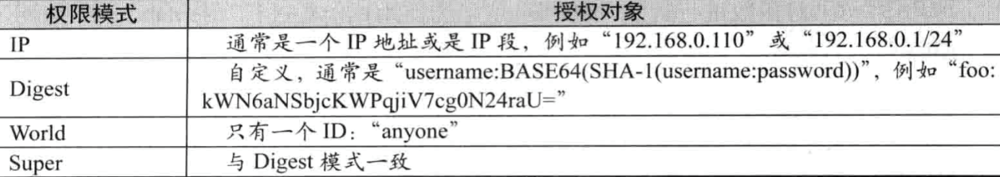

## Zookeeper的ACL权限控制

> 说明：本文转载至：<https://www.cnblogs.com/qlqwjy/p/10517231.html>

## 一. 简介

ACL 权限控制，使用：`scheme​:id:​perm `来标识，主要涵盖 3 个方面：

- 权限模式（Scheme）：授权的策略
- 授权对象（ID）:授权的对象
- 权限（Permission）:授予的权限

其特性如下：

- ZooKeeper的权限控制是基于每个znode节点的，需要对每个节点设置权限
- 每个znode支持设置多种权限控制方案和多个权限
- 节点不会继承父节点的权限，客户端无权访问某节点，但可能可以访问它的子节点

我们运行zookeeper bin目录下的zkCli.sh连接Zookeeper服务器，然后执行下列命令给`/test2`节点设置权限：

```shell
setAcl /test2 ip:128.0.0.1:crwda
```

### 1.1 授权模式（Scheme）

- **world**：它下面只有一个id, 叫`anyone`, world:anyone代表任何人
- **digest**：即用户名:密码这种方式认证，这也是业务系统中最常用的。它对应的id为username:BASE64(SHA1(password))，它需要先通过username:password形式验证。
- **host/ip**：它对应的id为客户机的IP地址，设置的时候可以设置一个ip段，比如ip:192.168.1.0/16,
  表示匹配前16个bit的IP段

### 1.2 给谁授权（ID）



### 1.3 授予什么权限（permission）

- **CREATE**（c）：允许创建子节点；
- **READ**（r）：允许从节点获取数据并列出其子节点；
- **WRITE**（w）：允许为节点设置数据；
- **DELETE**（d）：允许删除子节点；
- **ADMIN**（a）：允许为节点设置权限。

## 二. ACL相关命令

```shell
getAcl <path>     #读取ACL权限
setAcl <path> <acl>     #设置ACL权限
addauth <scheme> <auth>     #添加认证用户
```

## 三. 测试

### 3.1 word方式

```shell
[zk: localhost:2181(CONNECTED) 9] create /test1 test1-value    
Created /test1
[zk: localhost:2181(CONNECTED) 10] getAcl /test1  #创建的默认是所有用户都可以进行cdrwa
'world,'anyone
: cdrwa
[zk: localhost:2181(CONNECTED) 11] setAcl /test1 world:anyone:acd   #修改为所有人可以acd
cZxid = 0x400000007
ctime = Tue Mar 12 14:46:55 CST 2019
mZxid = 0x400000007
mtime = Tue Mar 12 14:46:55 CST 2019
pZxid = 0x400000007
cversion = 0
dataVersion = 0
aclVersion = 1
ephemeralOwner = 0x0
dataLength = 11
numChildren = 0
[zk: localhost:2181(CONNECTED) 12] getAcl /test1  #再次查询ACL权限
'world,'anyone
: cda
```

###  3.2 IP的方式

```shell
[zk: localhost:2181(CONNECTED) 13] create /test2 test2-value
Created /test2
[zk: localhost:2181(CONNECTED) 14] setAcl /test2 ip:127.0.0.1:crwda   #修改此IP具有所有权限
cZxid = 0x400000009
ctime = Tue Mar 12 14:51:58 CST 2019
mZxid = 0x400000009
mtime = Tue Mar 12 14:51:58 CST 2019
pZxid = 0x400000009
cversion = 0
dataVersion = 0
aclVersion = 1
ephemeralOwner = 0x0
dataLength = 11
numChildren = 0
[zk: localhost:2181(CONNECTED) 15] getAcl /test2
'ip,'127.0.0.1
: cdrwa
```

当然可以设置IP的时候使用多个ip的方式，比如:

```shell
[zk: localhost:2181(CONNECTED) 42] setAcl /t3 ip:192.168.0.164:cdwra,ip:127.0.0.1:cdwra
cZxid = 0x400000018
ctime = Tue Mar 12 15:12:59 CST 2019
mZxid = 0x400000018
mtime = Tue Mar 12 15:12:59 CST 2019
pZxid = 0x400000018
cversion = 0
dataVersion = 0
aclVersion = 1
ephemeralOwner = 0x0
dataLength = 2
numChildren = 0
[zk: localhost:2181(CONNECTED) 43] getAcl /t3
'ip,'192.168.0.164
: cdrwa
'ip,'127.0.0.1
: cdrwa
```

### 3.3 Digest

```shell
setAcl /test digest:用户名:密码:权限 
```

#### 3.3.1 生成密码:sha1加密之后base64编码

引入ZK客户端：

```xml
<dependency>
    <groupId>org.apache.zookeeper</groupId>
    <artifactId>zookeeper</artifactId>
    <version>3.5.8</version>
</dependency>
```

运行下列代码生成加密字符串：

```java
String encodeToString = DigestAuthenticationProvider.generateDigest("user:123456") 
//6DY5WhzOfGsWQ1XFuIyzxkpwdPo=
```

设置权限：

```shell
[zk: localhost:2181(CONNECTED) 7] setAcl /t6  digest:user:6DY5WhzOfGsWQ1XFuIyzxkpwdPo=:crwda  #授权
cZxid = 0x400000028
ctime = Tue Mar 12 15:50:02 CST 2019
mZxid = 0x400000028
mtime = Tue Mar 12 15:50:02 CST 2019
pZxid = 0x400000028
cversion = 0
dataVersion = 0
aclVersion = 1
ephemeralOwner = 0x0
dataLength = 4
numChildren = 0
[zk: localhost:2181(CONNECTED) 8] getAcl /t6
'digest,'user:6DY5WhzOfGsWQ1XFuIyzxkpwdPo=
: cdrwa
```

直接删除会不允许，也必须增加摘要之后才能删除：

```shell
[zk: localhost:2181(CONNECTED) 1] rmr /t6   #直接删除没权限
Authentication is not valid : /t6 
[zk: localhost:2181(CONNECTED) 2] addauth digest user:123456   #增加认证用户
[zk: localhost:2181(CONNECTED) 3] rmr /t6
[zk: localhost:2181(CONNECTED) 4] ls /
[t4, curator, test2, zookeeper, test1, t3]
```

