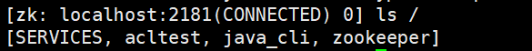
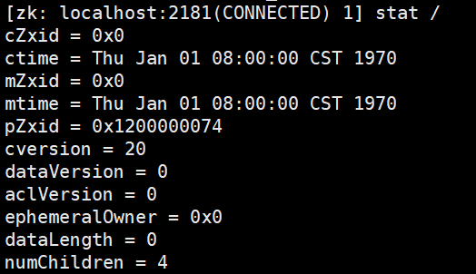
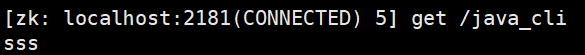

# 使用ZK客户端连接Zookeeper服务器

## 一. ZK客户端连接服务器

在Zookeeper中的bin目录下有一个`zkCli.sh`文件，它就是Zookeeper官方提供的客户端，它的启动方式有两种：

### 1.1 默认启动

```shell
./zkCli.sh #直接运行ZK客户端，默认连接的是本地的ZK服务器
```

### 1.2 指定IP启动

```shell
./zkCli.sh -server host:port
```

## 二. 使用户客户端对ZNode进行操作

### 2.1 查看所有命令

```shell
h  #h命令用于查看所有命令
```

### 2.2 列出根节点下所有的子节点信息

```shell
ls /
```



### 2.3 获取指定节点的状态信息

```shell
stat /
```




| **状态属性**   | **说明**                                                     |
| -------------- | ------------------------------------------------------------ |
| czxid          | 数据节点创建时的事务 ID                                      |
| ctime          | 数据节点创建时的时间                                         |
| mzxid          | 数据节点最后一次更新时的事务 ID                              |
| mtime          | 数据节点最后一次更新时的时间                                 |
| pzxid          | 数据节点的子节点最后一次被修改时的事务 ID                    |
| cversion       | 子节点的更改次数                                             |
| version        | 节点数据的更改次数                                           |
| aversion       | 节点的 ACL 的更改次数                                        |
| ephemeralOwner | 如果节点是临时节点，则表示创建该节点的会话的 SessionID；如果节点是持久节点，则该属性值为 0 |
| dataLength     | 数据内容的长度                                               |
| numChildren    | 数据节点当前的子节点个数                                     |

### 2.4 获取某个节点的数据内容

```shell
get /java_cli
```



### 2.5 创建节点

```shell
create [-s] [-e] path data acl
```

- -s 表示是顺序节点

- -e 标识是临时节点

- path 节点路径

- data 节点数据

- acl 节点权限

例如：

```shell
create /java_cli/ss ss
```

### 2.6 删除节点

删除单一节点，无法递归删除：

```shell
delete path
```

递归删除：

```shell
deleteall path
```

### 2.7 退出客户端

```shell
quit
```

