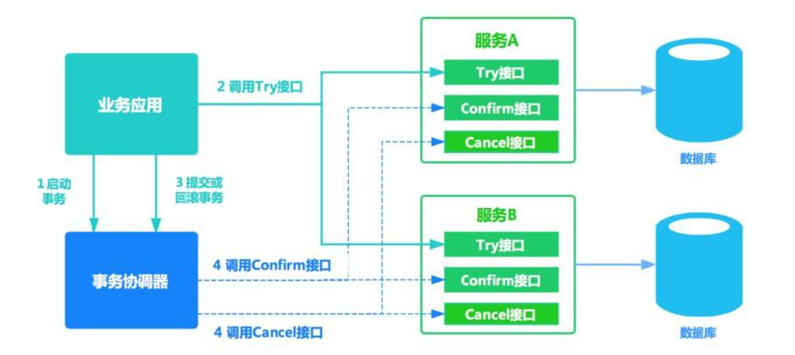

# tcc-transaction使用

[tcc-transactoin](https://github.com/changmingxie/tcc-transaction) 作为github开源tcc分布式事务框架，可以异步处理，也可以同步处理。本文使用Dubbo实现分布式系统间的RPC调用实现，官方也提供了tcc-transactoin-dubbo为Dubbo框架的TCC事务提供支持。

## 一. TCC事务三个阶段

TCC事务的三个阶段：

- Try: 尝试执行业务
  - 完成所有业务检查（一致性） 
  - 预留必须业务资源（准隔离性）
- Confirm: 确认执行业务
  - 真正执行业务 
  - 不作任何业务检查 
  - 只使用Try阶段预留的业务资源 
  - Confirm操作满足幂等性
- Cancel: 取消执行业务
  - 释放Try阶段预留的业务资源
  - Cancel操作满足幂等性

整体流程：



## 二. SpringBoot + Dubbo + tcc-transaction

### 2.1 引入依赖

```xml
<!--tcc-transaction整合dubbo核心包-->
<dependency>
    <groupId>org.mengyun</groupId>
    <artifactId>tcc-transaction-dubbo</artifactId>
    <version>${tcc-transaction.version}</version>
    <exclusions>
        <exclusion>
            <artifactId>dubbo</artifactId>
            <groupId>org.apache.dubbo</groupId>
        </exclusion>
    </exclusions>
</dependency>
<!--tcc-transaction核心包-->
<dependency>
    <groupId>org.mengyun</groupId>
    <artifactId>tcc-transaction-spring</artifactId>
    <version>${tcc-transaction.version}</version>
</dependency>
```

需要注意的是 `tcc-transaction` 官方并未将jar上传至Maven仓库，所以如果我们项目需要使用到 `tcc-transaction` 需要自己手动将 jar 包打入本地仓库或者私服中。

### 2.2 tcc-transaction 配置

```java
@Configuration
public class TccTransactionConfig {
    //没有持久化能力，仅可用于测试
    //@Bean("transactionRepository")
    //public TransactionRepository memoryStoreTransactionRepository(){
    //    MemoryStoreTransactionRepository repository = new MemoryStoreTransactionRepository();
    //    repository.setDomain("TCC:DUBBO:CAPITAL:");
    //    return repository;
    //}

    @Bean("transactionRepository")
    public TransactionRepository memoryStoreTransactionRepository2(JedisPool jedisPool) {
        RedisTransactionRepository repository = new RedisTransactionRepository();
        repository.setDomain("TCC:DUBBO:CAPITAL:");
        repository.setJedisPool(jedisPool);
        return repository;
    }
}
```

启动类加上注解：

```java
@SpringBootApplication
@EnableDubbo(scanBasePackages = "cn.bigcoder.demo.tcc.transaction.order.service")
@MapperScan("cn.bigcoder.demo.tcc.transaction.order.dao")
@ComponentScan("cn.bigcoder.demo.tcc.transaction")
@EnableTccTransaction //加上该注解，开启tcc事务
public class TccTransactionDubboOrderApplication {

    public static void main(String[] args) {
        SpringApplication.run(TccTransactionDubboOrderApplication.class, args);
    }

}
```

## 三. 业务代码引入TCC事务

在接口方法上加上@EnableTcc(1.7.x新增注解，1.6.x是@Compensable）将提供的接口标记为tcc接口:

```java
public interface CapitalTradeOrderService {
   @EnableTcc
   public String record(CapitalTradeOrderDto tradeOrderDto);

}
```

配置TCC事务的Try、Confirm、Cancel方法：

- asyncConfirm = false：是否异步处理confirm阶段，默认false，也就是同步处理
- asyncCancel = false：是否异步处理cancel阶段，默认false，也就是同步处理

```java
@Override
@Compensable(confirmMethod = "confirmRecord", cancelMethod = "cancelRecord", transactionContextEditor = DubboTransactionContextEditor.class)
@Transactional
public String record(CapitalTradeOrderDto tradeOrderDto) {
    ...
}
```

如果 `Try` 阶段成功，`Confirm` 阶段必须成功，如果 `Confirm` 阶段抛出异常，则会重试 `Confirm` 阶段

```java
@Transactional
public void confirmRecord(CapitalTradeOrderDto tradeOrderDto) {
    	//confirm阶段
}

@Transactional
public void cancelRecord(CapitalTradeOrderDto tradeOrderDto) {
    	//cancel阶段
}
```

这样一个基本的TCC事务就配置好了，具体项目配置可以参考 [bigcoder84/tcc-transaction-demo](https://github.com/bigcoder84/tcc-transaction-demo)，该项目是根据官方demo改造出来的tcc-transaction 示例。


本文参考至：

[快速开始 · changmingxie/tcc-transaction Wiki (github.com)](https://github.com/changmingxie/tcc-transaction/wiki/2-快速开始)

[TCC分布式事务之一](https://blog.csdn.net/a251628111/article/details/107203846)

