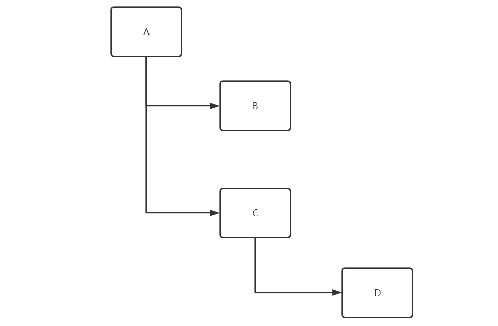
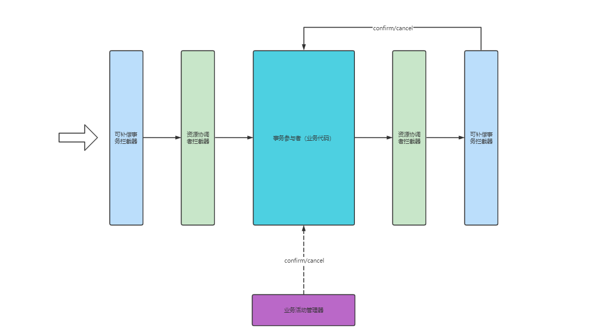
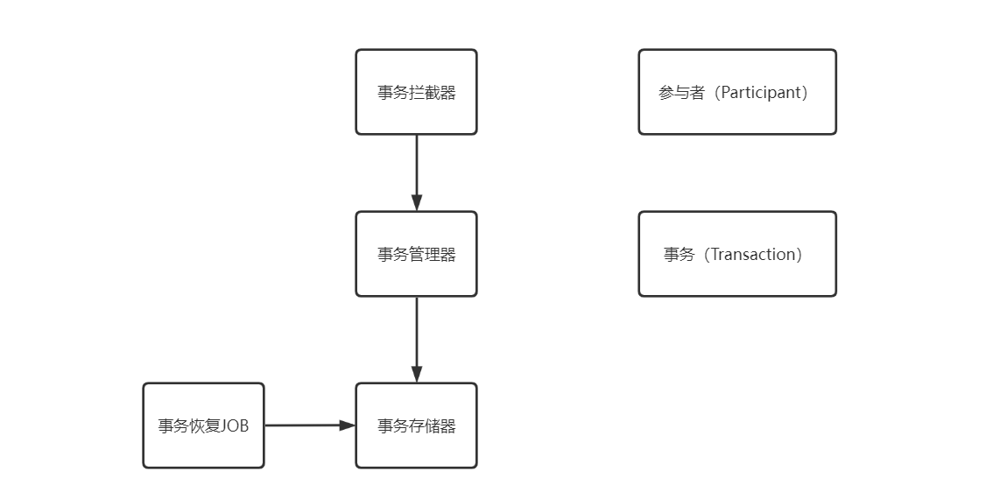
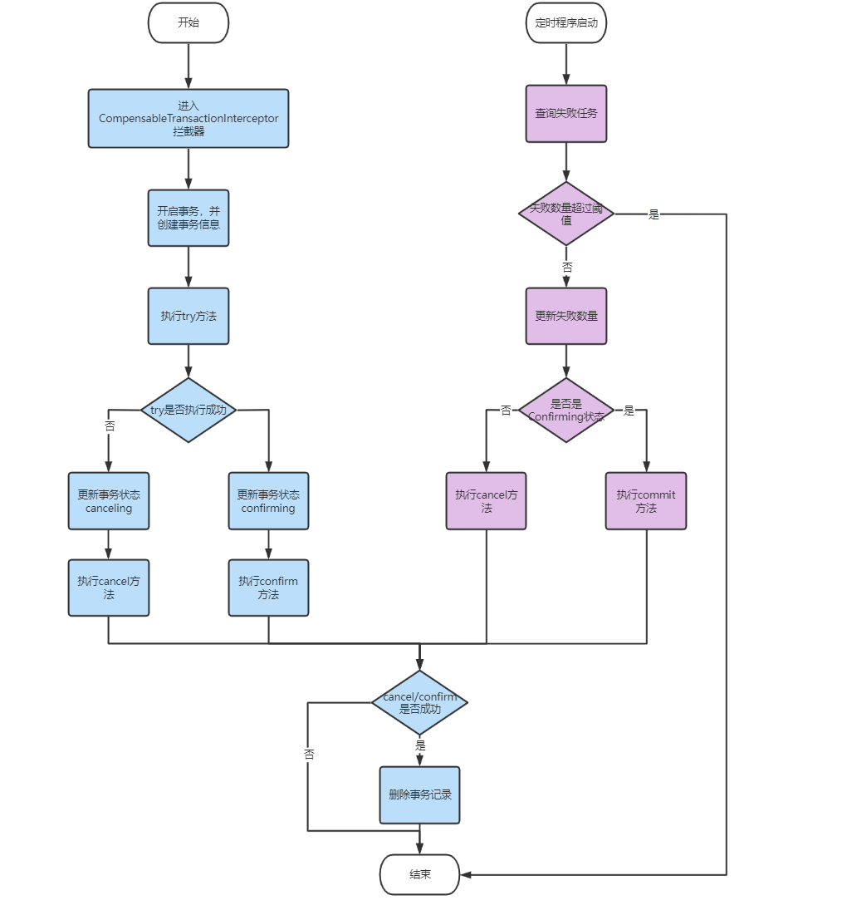
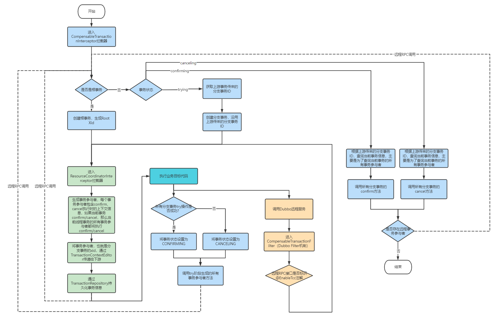

# tcc-transaction源码分析


本文主要介绍TCC的原理，以及从代码的角度上分析如何实现的；不涉及具体使用示例。本文通过分析[tcc-transaction](https://link.juejin.cn/?target=https%3A%2F%2Fgithub.com%2Fchangmingxie%2Ftcc-transaction)源码带大家了解TCC分布式事务的实现原理。

需要注意的是，本文所有代码都基于`master-1.7.x`分支，不同版本的源码会存在一定的差异。完整代码注释请参考：[bigcoder84/tcc-transaction](https://github.com/bigcoder84/tcc-transaction)

## 一. 概述

### 1.1 项目模块

本文分享 **TCC 实现**。主要涉及如下三个 Maven 项目：

- `tcc-transaction-core` ：tcc-transaction 底层实现。
- `tcc-transaction-api` ：tcc-transaction 使用 API。
- `tcc-transaction-spring` ：tcc-transaction Spring 支持。

本文基于`tcc-transaction 1.7.x`版本源码进行分析。

### 1.2 tcc-transaction中的概念

在详细分析框架源码之前，我们先定一些名词：

- 事务树：多级分布式事务类似于树状结构
  - 

- 根事务：事务树的根节点
- 分支事务：所有非根节点事务节点。在上图中，A就是整个分布式事务体系中的根事务节点，在A中会调用B、C两个下游服务，而B、C远程服务代码就是分布式事务的两个分支事务。
- 当前事务：当前正在执行代码所在的事务节点。
- 事务参与者：每一个事务参与者存在一个`confirm`和一个`cancel`方法。每一个事务节点都是一个事务参与者，每一个事务节点会维持自身以及孩子节点事务的事务参与者信息。例如我们在调用A方法时，会创建一个事务，我们称为TransactionA，并将A节点本身作为事务参与者放入TransactionA中，当A调用B、C两个服务时，会生成两个事务参与者放入TransactionA中，这样当A的try操作执行完毕后，TransactionA中就存在A、B、C三个事务参与者了，当TransactionA进行confirm/cancel操作时，会同时对三个事务参与者执行confirm/cancel操作。
- 事务存储器：存储事务上下文信息，可以有多种实现（Redis、DB、Memory）

## 二. TCC-Transaction 原理

在 TCC 里，一个业务活动可以有多个事务，每个业务操作归属于不同的事务，即一个事务可以包含多个业务操作。TCC-Transaction 将每个业务操作抽象成**事务参与者**，每个事务可以包含多个**参与者**。

参与者需要声明 try / confirm / cancel 三个类型的方法，和 TCC 的操作一一对应。在程序里，通过 @Compensable 注解标记在 try 方法上，并填写对应的 confirm / cancel 方法，示例代码如下：

```java
@Compensable(confirmMethod = "confirmRecord", cancelMethod = "cancelRecord", transactionContextEditor = MethodTransactionContextEditor.class)
public String record(CapitalTradeOrderDto tradeOrderDto) {}

public void confirmRecord(CapitalTradeOrderDto tradeOrderDto) {}

public void cancelRecord(CapitalTradeOrderDto tradeOrderDto) {}
```

TCC-Transaction 有两个拦截器，通过对 @Compensable AOP 切面( 参与者 try 方法 )进行拦截，，透明化对参与者 confirm / cancel 方法调用，从而实现 TCC 。

以及拥有一个业务活动管理器（JOB），业务活动管理器控制业务活动的一致性，它登记业务活动中的操作，并在业务活动提交时确认所有的TCC型操作的confirm操作，在业务活动取消时调用所以TCC操作的cancel操作。

**简化**流程如下图：



第一个拦截器，可补偿事务拦截器，实现如下功能：

- 在 Try 阶段，创建事务。
- 在 Confirm / Cancel 阶段，对事务提交或回滚。

第二个拦截器，资源协调者拦截器，实现如下功能：

- 在 Try 阶段，添加参与者到事务中。当事务上下文不存在时，进行创建。
- 对事务进行传播，在远程调用服务的参与者时，会通过`TransactionContextEditor`传递事务给远程参与者。TransactionContextEditor有很多不同的实现。

实际拦截器对事务的处理会比上图复杂一些，在后文详细解析。

在 TCC-Transaction 代码实现上，组件分层如下图：



本文按照如下顺序分享：

- 「4. 事务拦截器」
- 「5. 事务管理器」
- 「6. 事务管理器」

内容是**自下而上**的方式分享，每个组件可以更加整体的被认识。当然这可能对你理解时产生一脸闷逼，所以推荐两种阅读方式：

## 三. 事务与参与者

在 TCC 里，**一个**事务(`org.mengyun.tcctransaction.Transaction`) 可以有**多个**参与者(`org.mengyun.tcctransaction.Participant`)参与业务活动。

### 3.1 事务

```java
package org.mengyun.tcctransaction;

/**
 * Created by changmingxie on 10/26/15.
 */
public class Transaction implements Serializable {

    private static final long serialVersionUID = 7291423944314337931L;
    /**
     * 事务创建时间
     */
    private final Date createTime = new Date();
    /**
     * 参与者集合
     */
    private final List<Participant> participants = new ArrayList<Participant>();
    /**
     * 附带属性映射
     */
    private final Map<String, Object> attachments = new ConcurrentHashMap<String, Object>();
    /**
     * 事务ID
     */
    private TransactionXid xid;
    /**
     * 事务状态
     */
    private TransactionStatus status;
    /**
     * 事务类型
     */
    private TransactionType transactionType;
    /**
     * 重试次数
     */
    private volatile int retriedCount = 0;
    /**
     * 最后更新时间
     */
    private Date lastUpdateTime = new Date();
    /**
     * 版本号
     */
    private long version = 0;
    /**
     * 根事务ID
     */
    private TransactionXid rootXid;


    /**
     * 添加参与者
     * @param participant
     */
    public void enlistParticipant(Participant participant) {
        participants.add(participant);
    }

    /**
     * 提交TCC事务
     */
    public void commit() {
        for (Participant participant : participants) {
            if (!participant.getStatus().equals(ParticipantStatus.CONFIRM_SUCCESS)) {
                participant.commit();
                participant.setStatus(ParticipantStatus.CONFIRM_SUCCESS);
            }
        }
    }

    /**
     * 回滚TCC事务
     */
    public void rollback() {
        for (Participant participant : participants) {
            if (!participant.getStatus().equals(ParticipantStatus.CANCEL_SUCCESS)) {
                participant.rollback();
                participant.setStatus(ParticipantStatus.CANCEL_SUCCESS);
            }
        }
    }
}

```

- xid，事务编号( TransactionXid )，用于唯一标识一个事务。使用 UUID 算法生成，**保证唯一性**。`org.mengyun.tcctransaction.api.TransactionXid` 实现 `javax.transaction.xa.Xid` 接口，实现代码如下：

```java
public class TransactionXid implements Xid, Serializable {

    private static final long serialVersionUID = -6817267250789142043L;
    private static byte[] CUSTOMIZED_TRANSACTION_ID = "UniqueIdentity".getBytes();
    /**
     * xid格式标识
     */
    private int formatId = 1;
    /**
     * 全局事务编号
     */
    private byte[] globalTransactionId;
    /**
     * 分支事务编号
     */
    private byte[] branchQualifier;
}
```

- status，事务状态( TransactionStatus )。`org.mengyun.tcctransaction.api.TransactionStatus` 实现代码如下：

```java
public enum TransactionStatus {

    /**
     * 尝试中
     */
    TRYING(1),
    /**
     * 确认中
     */
    CONFIRMING(2),
    /**
     * 取消中状态
     */
    CANCELLING(3),
    /**
     * 尝试成功
     */
    TRY_SUCCESS(11),
    /**
     * 尝试失败
     */
    TRY_FAILED(12);
}
```

- transactionType，事务类型( TransactionType )。`org.mengyun.tcctransaction.common.TransactionType` 实现代码如下：

```java
public enum TransactionType {

    /**
     * 根事务
     */
    ROOT(1),
    /**
     * 分支事务
     */
    BRANCH(2);
}
```

- retriedCount，重试次数。在 TCC 过程中，可能参与者异常崩溃，这个时候会进行重试直到成功或超过最大次数。
- version，版本号，用于乐观锁更新事务。在《事务存储器》详细解析。
- attachments，附带属性映射。 在《Dubbo 支持》详细解析。

- 提供 `#enlistParticipant()` 方法，添加事务参与者。
- 提供 `#commit()` 方法，调用参与者们提交事务。
- 提供 `#rollback()` 方法，调用参与者回滚事务。

### 3.2 参与者

```java
public class Participant implements Serializable {

    private static final long serialVersionUID = 4127729421281425247L;
    Class<? extends TransactionContextEditor> transactionContextEditorClass;

    private TransactionXid rootXid;
    /**
     * 事务编号
     */
    private TransactionXid xid;
    /**
     * 确认执行业务方法调用上下文
     */
    private InvocationContext confirmInvocationContext;
    /**
     * 取消执行业务方法
     */
    private InvocationContext cancelInvocationContext;
    private int status = ParticipantStatus.TRYING.getId();
```

- xid，参与者事务编号。通过 `TransactionXid.globalTransactionId` 属性，关联上其所属的事务。当参与者进行远程调用时，远程的**分支**事务的事务编号等于该参与者的事务编号。通过事务编号的关联，TCC Confirm / Cancel 阶段，使用参与者的事务编号和远程的**分支**事务进行关联，从而实现事务的提交和回滚，在「4.2 传播发起分支事务」 + 「5.2 可补偿事务拦截器」可以看到具体实现。
- confirmInvocationContext，确认执行业务方法调用上下文( InvocationContext )。`org.mengyun.tcctransaction.InvocationContext` 实现代码如下：

```java
public class InvocationContext implements Serializable {

    private static final long serialVersionUID = -7969140711432461165L;
    /**
     * 类
     */
    private Class targetClass;

    /**
     * 方法名
     */
    private String methodName;

    /**
     * 参数列表
     */
    private Class[] parameterTypes;

    /**
     * 参数数组
     */
    private Object[] args;
}
```

- InvocationContext，执行方法调用上下文，记录类、方法名、参数类型数组、参数数组。通过这些属性，可以执行提交 / 回滚事务。在 `org.mengyun.tcctransaction.Terminator` 会看到具体的代码实现。**本质上，TCC 通过多个参与者的 try / confirm / cancel 方法，实现事务的最终一致性**。

- cancelInvocationContext，取消执行业务方法调用上下文(InvocationContext)。

- transactionContextEditorClass，事务上下文编辑，在「5.1 Compensable」详细解析。

- 提交 `#commit()` 方法，提交参与者自己的事务。
- 提交 `#rollback()` 方法，回滚参与者自己的事务。

## 四. 事务管理器

`org.mengyun.tcctransaction.TransactionManager`，事务管理器，提供事务的获取、发起、提交、回滚，参与者的新增等等方法。

### 4.1 发起根事务

提供 `begin()` 方法，发起根事务。该方法在**调用方法类型为 MethodType.ROOT 并且 事务处于 Try 阶段**被调用。MethodType 在「5.2 可补偿事务拦截器」详细解析。

实现代码如下：

```java
 /**
  * 发起根事务
  * @return
  */
 public Transaction begin() {
     Transaction transaction = new Transaction(TransactionType.ROOT);
     // 注册事务
     registerTransaction(transaction);
     return transaction;
 }
```

- 调用 Transaction 构造方法，创建**根事务**。实现代码如下：

  ```java
  /**
   * 创建指定类型的根事务
   * @param transactionType
   */
  public Transaction(TransactionType transactionType) {
      this(null, transactionType);
  }
  
  public Transaction(Object uniqueIdentity, TransactionType transactionType) {
  
      this.xid = new TransactionXid(uniqueIdentity);
      this.status = TransactionStatus.TRYING;
      this.transactionType = transactionType;
  
      if (transactionType.equals(TransactionType.ROOT)) {
          this.rootXid = xid;
      }
  }
  ```

- 调用 `#registerTransaction(...)` 方法，注册事务到当前线程事务队列。实现代码如下：

  ```java
  private static final ThreadLocal<Deque<Transaction>> CURRENT = new ThreadLocal<Deque<Transaction>>();
  
  /**
   * 注册事务到当前线程事务队列
   * @param transaction
   */
  private void registerTransaction(Transaction transaction) {
  
      if (CURRENT.get() == null) {
          CURRENT.set(new LinkedList<Transaction>());
      }
  
      CURRENT.get().push(transaction);
  }
  ```

  - **可能有同学会比较好奇，为什么使用队列存储当前线程事务**？TCC-Transaction 支持**多个**的事务**独立存在**，后创建的事务先提交，类似 Spring 的`org.springframework.transaction.annotation.Propagation.REQUIRES_NEW` 。在下文，很快我们就会看到 TCC-Transaction 自己的 `org.mengyun.tcctransaction.api.Propagation` 。

### 4.2 创建分支事务

调用 `#propagationNewBegin(...)` 方法，创建**分支**事务。该方法在**调用方法类型为 MethodType.PROVIDER 并且 事务处于 Try 阶段**被调用。MethodType 在「5.2 可补偿事务拦截器」详细解析。

实现代码如下：

```java
/**
 * 发起分支事务。该方法在调用方法类型为 ParticipantRole.PROVIDER 并且 事务处于 Try 阶段被调用
 * @param transactionContext
 * @return
 */
public Transaction propagationNewBegin(TransactionContext transactionContext) {
    // 创建 分支事务
    Transaction transaction = new Transaction(transactionContext);
    //注册 事务
    registerTransaction(transaction);
    return transaction;
}
```

- 调用 Transaction 构造方法，创建**分支事务**。实现代码如下：

  ```java
  /**
   * 创建分支事务
   * @param transactionContext
   */
  public Transaction(TransactionContext transactionContext) {
      this.xid = transactionContext.getXid();
      this.rootXid = transactionContext.getRootXid();
  
      this.status = TransactionStatus.TRYING;
      this.transactionType = TransactionType.BRANCH;
  }
  ```

- 调用 `TransactionRepository#crete()` 方法，存储事务。为什么要存储**分支**事务，在「5.3 资源协调者拦截器」详细解析。

- 调用 `#registerTransaction(...)` 方法，注册事务到当前线程事务队列。

### 4.3 获取分支事务

调用 `#propagationExistBegin(...)` 方法，根据Xid获取**分支**事务。该方法在**调用方法类型为 MethodType.PROVIDER 并且 事务处于 Confirm / Cancel 阶段**被调用。MethodType 在「5.2 可补偿事务拦截器」详细解析。

```java
/**
 * 获取分支事务。该方法在调用方法类型为 ParticipantRole.PROVIDER 并且 事务处于 Confirm / Cancel 阶段被调用
 * @param transactionContext
 * @return
 * @throws NoExistedTransactionException
 */
public Transaction propagationExistBegin(TransactionContext transactionContext) throws NoExistedTransactionException {
    // 查询事务
    Transaction transaction = transactionRepository.findByXid(transactionContext.getXid());

    if (transaction != null) {
        registerTransaction(transaction);
        return transaction;
    } else {
        throw new NoExistedTransactionException();
    }
}
```

- 调用 `TransactionRepository#findByXid()` 方法，查询事务。
- 调用 `#registerTransaction(...)` 方法，注册事务到当前线程事务队列。
- 为什么此处是**分支**事务呢？结合 `#propagationNewBegin(...)` 思考下。

### 4.4 提交事务

调用 `#commit(...)` 方法，提交事务。该方法在**事务处于 Confirm / Cancel 阶段**被调用。

```java
public void commit(boolean asyncCommit) {
    // 获取事务
    final Transaction transaction = getCurrentTransaction();
    // 设置事务状态为confirm
    transaction.changeStatus(TransactionStatus.CONFIRMING);
    // 更新事务
    transactionRepository.update(transaction);

    if (asyncCommit) {
        try {
            Long statTime = System.currentTimeMillis();

            asyncTerminatorExecutorService.submit(new Runnable() {
                @Override
                public void run() {
                    commitTransaction(transaction);
                }
            });
            logger.debug("async submit cost time:" + (System.currentTimeMillis() - statTime));
        } catch (Throwable commitException) {
            logger.warn("compensable transaction async submit confirm failed, recovery job will try to confirm later.", commitException.getCause());
            //throw new ConfirmingException(commitException);
        }
    } else {
        // 提交事务
        commitTransaction(transaction);
    }
}
```

- asyncCommit：表示是否异步confirm，由业务开发者在`@Compensable`注解中指定。

- 调用 `#getCurrentTransaction()` 方法， 获取事务。实现代码如下：

  ```java
  /**
   * 获取当前线程 事务队列的队头事务
   * tips: registerTransaction是将事务注册到队列头部
   * @return
   */
  public Transaction getCurrentTransaction() {
      if (isTransactionActive()) {
          return CURRENT.get().peek();
      }
      return null;
  }
  ```

  - 为什么获得队列**头部**元素呢？该元素即是上文调用 `#registerTransaction(...)` 注册到队列头部。

- 调用 `Transaction#changeStatus(...)` 方法， **设置**事务状态为 CONFIRMING。

- 调用 `TransactionRepository#update(...)` 方法， **更新**事务。

- 调用 `Transaction#commit(...)` 方法， **提交**事务。

- 调用 `TransactionRepository#delete(...)` 方法，**删除**事务。

### 4.5 回滚事务

调用 `#rollback(...)` 方法，取消事务，和 `#commit()` 方法基本类似。该方法在**事务处于 Confirm / Cancel 阶段**被调用。

```java
public void rollback(boolean asyncRollback) {
    // 获取事务
    final Transaction transaction = getCurrentTransaction();
    // 设置事务状态为 CANCELLING
    transaction.changeStatus(TransactionStatus.CANCELLING);
    // 更新事务记录
    transactionRepository.update(transaction);

    if (asyncRollback) {
        // 是否是异步操作
        try {
            asyncTerminatorExecutorService.submit(new Runnable() {
                @Override
                public void run() {
                    rollbackTransaction(transaction);
                }
            });
        } catch (Throwable rollbackException) {
            logger.warn("compensable transaction async rollback failed, recovery job will try to rollback later.", rollbackException);
            throw new CancellingException(rollbackException);
        }
    } else {
        // 回滚事务
        rollbackTransaction(transaction);
    }
}
```

### 4.6 添加事务到事务管理器

调用 `#enlistParticipant(...)` 方法，添加参与者到事务。该方法在**事务处于 Try 阶段**被调用，在「5.3 资源协调者拦截器」有详细解析。

```java
/**
 * 添加参与者到事务
 * @param participant
 */
public void enlistParticipant(Participant participant) {
    Transaction transaction = this.getCurrentTransaction();
    //添加参与者
    transaction.enlistParticipant(participant);

    if (transaction.getVersion() == 0l) {
        // transaction.getVersion() 为零，这意味着之前从未持久化，需要调用 create 才能持久化。
        transactionRepository.create(transaction);
    } else {
        // 更新transaction
        transactionRepository.update(transaction);
    }
}
```

## 五. 事务拦截器

TCC-Transaction 基于 `org.mengyun.tcctransaction.api.@Compensable` + `org.aspectj.lang.annotation.@Aspect` **注解** **AOP 切面**实现业务方法的 TCC 事务声明**拦截**，同 Spring 的 `org.springframework.transaction.annotation.@Transactional` 的实现。

TCC-Transaction 有两个拦截器：

- `org.mengyun.tcctransaction.interceptor.CompensableTransactionInterceptor`，可补偿事务拦截器。
- `org.mengyun.tcctransaction.interceptor.ResourceCoordinatorInterceptor`，资源协调者拦截器。

在分享拦截器的实现之前，我们先一起看看 @Compensable 注解。

### 5.1 Compensable

```java
@Retention(RetentionPolicy.RUNTIME)
@Target({ElementType.METHOD})
public @interface Compensable {

    /**
     * 事务传播级别
     * @return
     */
    public Propagation propagation() default Propagation.REQUIRED;

    /**
     * confirm执行的方法名称
     * @return
     */
    public String confirmMethod() default "";

    /**
     * cancel执行的方法名称
     * @return
     */
    public String cancelMethod() default "";

    /**
     * 是否异步执行confirm
     * @return
     */
    public boolean asyncConfirm() default false;

    /**
     * 是否异步执行cancel
     * @return
     */
    public boolean asyncCancel() default false;

    /**
     * 事务上下文编辑器 默认实现是：DefaultTransactionContextEditor
     * @return
     */
    public Class<? extends TransactionContextEditor> transactionContextEditor() default NullableTransactionContextEditor.class;
}
```

- propagation，传播级别( Propagation )，默认 Propagation.REQUIRED。和 Spring 的 Propagation 除了缺少几个属性，基本一致。实现代码如下：

  ```java
  public enum Propagation {
      /**
       * 支持当前事务，如果当前没有事务，就新建一个事务。
       */
      REQUIRED(0),
      /**
       * 支持当前事务，如果当前没有事务，就以非事务方式执行。
       */
      SUPPORTS(1),
      /**
       * 支持当前事务，如果当前没有事务，就抛出异常。
       */
      MANDATORY(2),
      /**
       * 新建事务，如果当前存在事务，把当前事务挂起。
       */
      REQUIRES_NEW(3);
  
      private final int value;
  
      private Propagation(int value) {
          this.value = value;
      }
  
      public int value() {
          return this.value;
      }
  }
  ```

- confirmMethod，确认执行业务方法名。

- cancelMethod，取消执行业务方法名。

- TransactionContextEditor，事务上下文编辑器(TransactionContextEditor)，用于设置和获得事务上下文( TransactionContext)，在「5.3 资源协调者拦截器」可以看到被调用，此处只看它的代码实现。`org.mengyun.tcctransaction.api.TransactionContextEditor` 接口代码如下：

  ```java
  public interface TransactionContextEditor {
  
      /**
       * 从参数中获得事务上下文
       * @param target 对象
       * @param method 方法
       * @param args 参数
       * @return
       */
      public TransactionContext get(Object target, Method method, Object[] args);
  
      /**
       * 设置事务上下文到参数中
       * @param transactionContext
       * @param target
       * @param method
       * @param args
       */
      public void set(TransactionContext transactionContext, Object target, Method method, Object[] args);
  
  }
  ```

- NullableTransactionContextEditor：**默认**事务上下文编辑器，即无事务上下文编辑器实现。（1.2.x版本的tcc-transaction默认的事务上下文编辑器是`DefaultTransactionContextEditor`，也就是1.7.x版本的`ParameterTransactionContextEditor`），当无需进行事务传播时，可以使用该事务上下文编辑器。

  ```java
  public class NullableTransactionContextEditor  implements TransactionContextEditor {
  
      @Override
      public TransactionContext get(Object target, Method method, Object[] args) {
          return null;
      }
  
      @Override
      public void set(TransactionContext transactionContext, Object target, Method method, Object[] args) {
  
      }
  }
  ```

- ParameterTransactionContextEditor：

  ```java
  /**
   * 使用参数传递事务上下文
   */
  public class ParameterTransactionContextEditor implements TransactionContextEditor {
  
      /**
       * 获得事务上下文在方法参数里的位置
       * @param parameterTypes
       * @return
       */
      public static int getTransactionContextParamPosition(Class<?>[] parameterTypes) {
  
          int position = -1;
  
          for (int i = 0; i < parameterTypes.length; i++) {
              if (parameterTypes[i].equals(org.mengyun.tcctransaction.api.TransactionContext.class)) {
                  position = i;
                  break;
              }
          }
          return position;
      }
  
      public static boolean hasTransactionContextParameter(Class<?>[] parameterTypes) {
          return getTransactionContextParamPosition(parameterTypes) >= 0;
      }
  
  
      public static TransactionContext getTransactionContextFromArgs(Object[] args) {
  
          TransactionContext transactionContext = null;
  
          for (Object arg : args) {
              if (arg != null && org.mengyun.tcctransaction.api.TransactionContext.class.isAssignableFrom(arg.getClass())) {
  
                  transactionContext = (org.mengyun.tcctransaction.api.TransactionContext) arg;
              }
          }
  
          return transactionContext;
      }
  
      @Override
      public TransactionContext get(Object target, Method method, Object[] args) {
          int position = getTransactionContextParamPosition(method.getParameterTypes());
  
          if (position >= 0) {
              return (TransactionContext) args[position];
          } else {
              throw new RuntimeException("No TransactionContext parameter exist while get TransactionContext with ParameterTransactionContextEditor!");
          }
      }
  
  
      @Override
      public void set(TransactionContext transactionContext, Object target, Method method, Object[] args) {
  
          int position = getTransactionContextParamPosition(method.getParameterTypes());
          if (position >= 0) {
              args[position] = transactionContext;
          } else {
              throw new RuntimeException("No TransactionContext parameter exist while set TransactionContext with ParameterTransactionContextEditor!");
          }
      }
  }
  ```

- DubboTransactionContextEditor，Dubbo 事务上下文编辑器实现，通过 Dubbo 隐式传参方式获得事务上下文，在《Dubbo 支持》详细解析。

### 5.2 事务拦截器

先一起来看下事务拦截器对应的切面 `org.mengyun.tcctransaction.interceptor.CompensableTransactionAspect`，实现代码如下：

```java
@Aspect
public abstract class CompensableTransactionAspect {

    private CompensableTransactionInterceptor compensableTransactionInterceptor;

    public void setCompensableTransactionInterceptor(CompensableTransactionInterceptor compensableTransactionInterceptor) {
        this.compensableTransactionInterceptor = compensableTransactionInterceptor;
    }

    @Pointcut("@annotation(org.mengyun.tcctransaction.api.Compensable)")
    public void compensableTransactionPointcut() {

    }

    @Around("compensableTransactionPointcut()")
    public Object interceptCompensableMethod(ProceedingJoinPoint pjp) throws Throwable {
        // 获取目标方法
        Method method = ((MethodSignature) pjp.getSignature()).getMethod();
        // 获取目标方法的Compensable注解
        Compensable compensable = method.getAnnotation(Compensable.class);
        Class<? extends TransactionContextEditor> transactionContextEditor = NullableTransactionContextEditor.class;

        if (compensable != null) {
            transactionContextEditor = compensable.transactionContextEditor();
        }

        if (transactionContextEditor.equals(NullableTransactionContextEditor.class)
                && ParameterTransactionContextEditor.hasTransactionContextParameter(method.getParameterTypes())) {
            transactionContextEditor = ParameterTransactionContextEditor.class;
        }
        return compensableTransactionInterceptor.interceptCompensableMethod(new AspectJTransactionMethodJoinPoint(pjp, compensable, transactionContextEditor));
    }

    public abstract int getOrder();
}
```

在`tcc-transaction-spring`模块中`ConfigurableTransactionAspect`继承了`CompensableTransactionAspect`，在原先的基础上提供了可配置化的功能，需要注意的是该类 实现了`org.springframework.core.Ordered#getOrder`接口，这样就可以保证在整个AOP切面链中，“事务拦截器”位于“资源协调者拦截器”外层。

```java
@Aspect
public class ConfigurableTransactionAspect extends CompensableTransactionAspect implements Ordered {

    @Autowired
    private TransactionConfigurator transactionConfigurator;

    @PostConstruct
    public void init() {

        TransactionManager transactionManager = transactionConfigurator.getTransactionManager();

        CompensableTransactionInterceptor compensableTransactionInterceptor = new CompensableTransactionInterceptor();
        compensableTransactionInterceptor.setTransactionManager(transactionManager);

        this.setCompensableTransactionInterceptor(compensableTransactionInterceptor);
    }

    /**
     * 指定切面顺序，AOP可以看做一个同心圆，圆心就是我们被代理的方法，当切面类getOrder方法返回值越小，则切面越在外层
     * @return
     */
    @Override
    public int getOrder() {
        return Ordered.HIGHEST_PRECEDENCE;
    }

    public void setTransactionConfigurator(TransactionConfigurator transactionConfigurator) {
        this.transactionConfigurator = transactionConfigurator;
    }
}
```

- 通过 `org.aspectj.lang.annotation.@Pointcut` + `org.aspectj.lang.annotation.@Around` 注解，配置对 **@Compensable 注解的方法**进行拦截，调用 `CompensableTransactionInterceptor#interceptCompensableMethod(...)` 方法进行处理。

  ```java
  public Object interceptCompensableMethod(TransactionMethodJoinPoint pjp) throws Throwable {
      // 获得当前线程所在事务
      Transaction transaction = transactionManager.getCurrentTransaction();
      // 创建可补偿方法上下文
      CompensableMethodContext compensableMethodContext = new CompensableMethodContext(pjp, transaction);
  
      // if method is @Compensable and no transaction context and no transaction, then root
      // else if method is @Compensable and has transaction context and no transaction ,then provider
      switch (compensableMethodContext.getParticipantRole()) {
          case ROOT:
              // 根事务
              return rootMethodProceed(compensableMethodContext);
          case PROVIDER:
              // 分支事务
              return providerMethodProceed(compensableMethodContext);
          default:
              return compensableMethodContext.proceed();
      }
  }
  ```

  - 调用CompensableMethodContext构造器，创建可补偿方法上下文，代码如下：

    ```java
    public class CompensableMethodContext {
    
        /**
         * 方法切入点，用于执行目标业务方法
         */
        TransactionMethodJoinPoint pjp = null;
    
        private Transaction transaction = null;
    
        TransactionContext transactionContext = null;
    
        Compensable compensable = null;
    
        public CompensableMethodContext(TransactionMethodJoinPoint pjp, Transaction transaction) {
            this.pjp = pjp;
    
            this.transaction = transaction;
    
            this.compensable = pjp.getCompensable();
            // 获取开发者指定的TransactionContextEditor实例，然后调用其get方法，获取事务上下文
            this.transactionContext = FactoryBuilder.factoryOf(pjp.getTransactionContextEditorClass()).getInstance().get(pjp.getTarget(), pjp.getMethod(), pjp.getArgs());
        }
    }
    ```

  - 调用`CompensableMethodContext#getParticipantRole`方法获取事务参与者的角色：

    ```java
    /**
         *
         * 如果方法被@Compensable 注释，则表示需要tcc 事务，如果没有活动事务，则需要require new。
         * 如果方法不是@Compensable 注释，而是带有 TransactionContext 参数。
         *      如果有活动交易，这意味着需要参与者 tcc 交易。如果 transactionContext 为 null，则它将事务登记为 CONSUMER 角色，
         *      else 表示有另一个方法作为 Consumer 已经登记了事务，这个方法不需要登记。
         * @return
         */
        public ParticipantRole getParticipantRole() {
    
            //方法是@Compensable 注释的。当前没有活动事务 且 没有活动事务上下文，那么该方法需要将事务登记为 根事务
            if (compensable != null && transaction == null && transactionContext == null) {
                return ParticipantRole.ROOT;
            }
    
            // 方法是@Compensable 注释的。当前没有活动事务，但有活动事务上下文。这意味着有一个活跃的交易，需要更新交易并将交易登记为 PROVIDER 角色。
            if (compensable != null && transaction == null && transactionContext != null) {
                return ParticipantRole.PROVIDER;
            }
    
            //方法是@Compensable 注释的，并且有活动事务，但没有事务上下文。那么该方法需要将事务登记为消费者角色，它之前的角色可能是ROOT
            if (compensable != null && transaction != null && transactionContext == null) {
                return ParticipantRole.CONSUMER;
            }
    
    
            // 方法是@Compensable 注解，有活动事务，也有事务上下文。那么该方法需要将事务登记为 CONSUMER 角色，它之前的角色可能是 PROVIDER。
            if (compensable != null && transaction != null && transactionContext != null) {
                return ParticipantRole.CONSUMER;
            }
    
    
            // 方法没有@Compensable 注释，而是带有TransactionContext 参数。如果当前有一个活动事务并且事务上下文为空，然后需要使用 CONSUMER 角色登记事务。
            // 当Dubbo调用远程RPC服务时，transactionContext
            if (compensable == null && transaction != null && transactionContext == null) {
                return ParticipantRole.CONSUMER;
            }
    
            return ParticipantRole.NORMAL;
        } 
    ```

- 方法类型为 ParticipantRole.ROOT 时，创建**根事务**

  ```java
  /**
   * 发起根事务
   * @param compensableMethodContext
   * @return
   * @throws Throwable
   */
  private Object rootMethodProceed(CompensableMethodContext compensableMethodContext) throws Throwable {
      Object returnValue = null;
      Transaction transaction = null;
      boolean asyncConfirm = compensableMethodContext.getAnnotation().asyncConfirm();
      boolean asyncCancel = compensableMethodContext.getAnnotation().asyncCancel();
      try {
          // 创建根事务
          transaction = transactionManager.begin(compensableMethodContext.getUniqueIdentity());
          try {
              // 执行方法原逻辑
              returnValue = compensableMethodContext.proceed();
          } catch (Throwable tryingException) {
              // 回滚事务
              transactionManager.rollback(asyncCancel);
              throw tryingException;
          }
          // 提交事务
          transactionManager.commit(asyncConfirm);
      } finally {
          // 将事务从当前线程事务队列移除
          transactionManager.cleanAfterCompletion(transaction);
      }
      return returnValue;
  }
  ```

  - 调用 `TransactionManager#begin()` 方法，创建**根事务**，**TCC Try 阶段开始**。

  - 调用 `ProceedingJoinPoint#proceed()` 方法，执行方法**原逻辑(即Try逻辑)**。

  - 当原逻辑执行异常时，**TCC Try 阶段失败**，调用 `TransactionManager#rollback(...)` 方法，**TCC Cancel 阶段**，回滚事务。

  - 当原逻辑执行成功时，**TCC Try 阶段成功**，调用 `TransactionManager#commit(...)` 方法，**TCC Confirm 阶段**，提交事务。

  - 调用 `TransactionManager#cleanAfterCompletion(...)` 方法，将事务从当前线程事务队列移除，避免线程冲突。实现代码如下：

    ```java
    // TransactionManager.java
    public void cleanAfterCompletion(Transaction transaction) {
        if (isTransactionActive() && transaction != null) {
            Transaction currentTransaction = getCurrentTransaction();
            if (currentTransaction == transaction) {
                CURRENT.get().pop();
                if (CURRENT.get().size() == 0) {
                    CURRENT.remove();
                }
            } else {
                throw new SystemException("Illegal transaction when clean after completion");
            }
        }
    }
    ```

- 方法类型为 ParticipantRole.PROVIDER 时，发起**分支事务**

  ```java
  private Object providerMethodProceed(CompensableMethodContext compensableMethodContext) throws Throwable {
  
          Transaction transaction = null;
          boolean asyncConfirm = compensableMethodContext.getAnnotation().asyncConfirm();
          boolean asyncCancel = compensableMethodContext.getAnnotation().asyncCancel();
  
          try {
              switch (TransactionStatus.valueOf(compensableMethodContext.getTransactionContext().getStatus())) {
                  case TRYING:
                      // 发起分支事务
                      transaction = transactionManager.propagationNewBegin(compensableMethodContext.getTransactionContext());
                      Object result = null;
                      try {
                          // 执行业务代码
                          result = compensableMethodContext.proceed();
                          // 将状态变为 TRY_SUCCESS
                          transactionManager.changeStatus(TransactionStatus.TRY_SUCCESS, true);
                      } catch (Throwable e) {
                          transactionManager.changeStatus(TransactionStatus.TRY_FAILED);
                          throw e;
                      }
                      return result;
                  case CONFIRMING:
                      try {
                          // 获取分支事务
                          transaction = transactionManager.propagationExistBegin(compensableMethodContext.getTransactionContext());
                          // 提交事务
                          transactionManager.commit(asyncConfirm);
                      } catch (NoExistedTransactionException excepton) {
                          //the transaction has been commit,ignore it.
                          logger.info("no existed transaction found at CONFIRMING stage, will ignore and confirm automatically. transaction:" + JSON.toJSONString(transaction));
                      }
                      break;
                  case CANCELLING:
                      try {
                          int transactionStatusFromConsumer = compensableMethodContext.getTransactionContext().getParticipantStatus();
                          transaction = transactionManager.propagationExistBegin(compensableMethodContext.getTransactionContext());
  
                          // Only if transaction's status is at TRY_SUCCESS、TRY_FAILED、CANCELLING stage we can call rollback.
                          // If transactionStatusFromConsumer is TRY_SUCCESS, no mate current transaction is TRYING or not, also can rollback.
                          // transaction's status is TRYING while transactionStatusFromConsumer is TRY_SUCCESS may happen when transaction's changeStatus is async.
                          //只有事务状态在TRY_SUCCESS、TRY_FAILED、CANCELING阶段才可以调用rollback。
                          if (transaction.getStatus().equals(TransactionStatus.TRY_SUCCESS)
                                  || transaction.getStatus().equals(TransactionStatus.TRY_FAILED)
                                  || transaction.getStatus().equals(TransactionStatus.CANCELLING)
                                  || transactionStatusFromConsumer == ParticipantStatus.TRY_SUCCESS.getId()) {
                              // 回滚事务
                              transactionManager.rollback(asyncCancel);
                          } else {
                              //in this case, transaction's Status is TRYING and transactionStatusFromConsumer is TRY_FAILED
                              // this may happen if timeout exception throws during rpc call.
                              throw new IllegalTransactionStatusException("Branch transaction status is TRYING, cannot rollback directly, waiting for recovery job to rollback.");
                          }
  
                      } catch (NoExistedTransactionException exception) {
                          //the transaction has been rollback,ignore it.
                          logger.info("no existed transaction found at CANCELLING stage, will ignore and cancel automatically. transaction:" + JSON.toJSONString(transaction));
                      }
                      break;
              }
  
          } finally {
              // 将事务从当前线程事务队列移除
              transactionManager.cleanAfterCompletion(transaction);
          }
  
          // 如果是CONFIRMING 或 CANCEL 则返回空值
          Method method = compensableMethodContext.getMethod();
          return ReflectionUtils.getNullValue(method.getReturnType());
      }
  ```

  - Trying阶段**为什么要创建分支事务**？在**根事务**进行 Confirm / Cancel 时，调用**根事务**上的参与者们提交或回滚事务时，进行RPC调用远程参与者，远程事务参与者根据传播的事务ID，查询到当前事务上下文，然后进行事务的提交或回滚。

  - 当事务处于 TransactionStatus.TRYING 时，调用 `TransactionManager#propagationExistBegin(...)` 方法，创建**分支**事务。**分支**事务创建完成后，调用 `ProceedingJoinPoint#proceed()` 方法，执行方法**原逻辑( 即 Try 逻辑 )**。

  - 当事务处于 TransactionStatus.CONFIRMING 时，调用 `TransactionManager#commit()` 方法，提交事务。

  - 当事务处于 TransactionStatus.CANCELLING 时，调用 `TransactionManager#rollback()` 方法，提交事务。

  - 调用 `TransactionManager#cleanAfterCompletion(...)` 方法，将事务从当前线程事务队列移除，避免线程冲突。

  - 当事务处于 TransactionStatus.CONFIRMING / TransactionStatus.CANCELLING 时，调用 `ReflectionUtils#getNullValue(...)` 方法，返回空值。**为什么返回空值**？Confirm / Cancel 相关方法，是通过 AOP 切面调用，只调用，不处理返回值，但是又不能没有返回值，因此直接返回空。实现代码如下：

    ```java
    public static Object getNullValue(Class type) {
    
        if (boolean.class.equals(type)) {
            return false;
        } else if (byte.class.equals(type)) {
            return 0;
        } else if (short.class.equals(type)) {
            return 0;
        } else if (int.class.equals(type)) {
            return 0;
        } else if (long.class.equals(type)) {
            return 0;
        } else if (float.class.equals(type)) {
            return 0;
        } else if (double.class.equals(type)) {
            return 0;
        } else if (char.class.equals(type)) {
            return ' ';
        }
    
        return null;
    }
    ```

- 方法类型为 ParticipantRole.CONSUMER时，不发起新的事务，直接执行业务方法。

- 方法类型为 ParticipantRole.Normal 时，不进行事务处理。

### 5.3 资源协调者拦截器

先一起来看下资源协调者拦截器 对应的切面 `org.mengyun.tcctransaction.interceptor.ResourceCoordinatorAspect`，实现代码如下：

```java
/**
 * 资源协调者拦截器
 * Created by changmingxie on 11/8/15.
 */
@Aspect
public abstract class ResourceCoordinatorAspect {

    private ResourceCoordinatorInterceptor resourceCoordinatorInterceptor;

    @Pointcut("@annotation(org.mengyun.tcctransaction.api.Compensable) || execution(* *(org.mengyun.tcctransaction.api.TransactionContext,..))")
    public void transactionResourcePointcut() {

    }


    @Around("transactionResourcePointcut()")
    public Object interceptTransactionResourceMethodWithCompensableAnnotation(ProceedingJoinPoint pjp) throws Throwable {

        Method method = ((MethodSignature) pjp.getSignature()).getMethod();
        Compensable compensable = method.getAnnotation(Compensable.class);
        Class<? extends TransactionContextEditor> transactionContextEditor = NullableTransactionContextEditor.class;
        if (compensable != null) {
            // 获取事务上下文编辑器
            transactionContextEditor = compensable.transactionContextEditor();
        }
        if (transactionContextEditor.equals(NullableTransactionContextEditor.class)
                && ParameterTransactionContextEditor.hasTransactionContextParameter(method.getParameterTypes())) {
            transactionContextEditor = ParameterTransactionContextEditor.class;
        }
        return interceptTransactionContextMethod(new AspectJTransactionMethodJoinPoint(pjp, compensable, transactionContextEditor));
    }

    public Object interceptTransactionContextMethod(TransactionMethodJoinPoint pjp) throws Throwable {
        return resourceCoordinatorInterceptor.interceptTransactionContextMethod(pjp);
    }

    public void setResourceCoordinatorInterceptor(ResourceCoordinatorInterceptor resourceCoordinatorInterceptor) {
        this.resourceCoordinatorInterceptor = resourceCoordinatorInterceptor;
    }

    public abstract int getOrder();
}
```

- 通过 `org.aspectj.lang.annotation.@Pointcut` + `org.aspectj.lang.annotation.@Around` 注解，配置对 **@Compensable 注解的方法**进行拦截，调用 `ResourceCoordinatorInterceptor#interceptTransactionContextMethod(...)` 方法进行处理。

- **ResourceCoordinatorInterceptor 实现代码如下**：

  ```java
  public Object interceptTransactionContextMethod(TransactionMethodJoinPoint pjp) throws Throwable {
  
      Transaction transaction = transactionManager.getCurrentTransaction();
      if (transaction != null && transaction.getStatus().equals(TransactionStatus.TRYING)) {
          // 创建事务参与者，并将事务参与者添加至当前Transaction中
          Participant participant = enlistParticipant(pjp);
          if (participant != null) {
              Object result = null;
              try {
                  // 执行原方法逻辑
                  result = pjp.proceed(pjp.getArgs());
                  participant.setStatus(ParticipantStatus.TRY_SUCCESS);
              } catch (Throwable e) {
                  participant.setStatus(ParticipantStatus.TRY_FAILED);
                  throw e;
              }
              return result;
          }
      }
      return pjp.proceed(pjp.getArgs());
  }
  ```

  - 当事务处于 TransactionStatus.TRYING 时，调用 `#enlistParticipant(...)` 方法，添加事务参与者。

    ```java
    private Participant enlistParticipant(TransactionMethodJoinPoint pjp) {
    
        Transaction transaction = transactionManager.getCurrentTransaction();
        CompensableMethodContext compensableMethodContext = new CompensableMethodContext(pjp, transaction);
    
        if (compensableMethodContext.getParticipantRole().equals(ParticipantRole.NORMAL)) {
            return null;
        }
        // 获得 确认执行业务方法 和 取消执行业务方法
        String confirmMethodName = compensableMethodContext.getConfirmMethodName();
        String cancelMethodName = compensableMethodContext.getCancelMethodName();
        // 获取事务上下文编辑器
        Class<? extends TransactionContextEditor> transactionContextEditorClass = compensableMethodContext.getTransactionContextEditorClass();
        // 创建事务ID，这个事务ID是下游分支事务的事务ID，下游服务在创建分支事务时将沿用该ID。这样在数据结构上，所有事务节点都能关联起来。
        TransactionXid xid = new TransactionXid(transaction.getXid().getGlobalTransactionId());
    
        if (compensableMethodContext.getTransactionContext() == null) {
            //实例化 事务上下文编辑器，并设置事务上下文，这里面最重要的就是需要将rootXid、和分支事务xid传播到下游
            FactoryBuilder.factoryOf(transactionContextEditorClass).getInstance().set(new TransactionContext(transaction.getRootXid(), xid, TransactionStatus.TRYING.getId(), ParticipantStatus.TRYING.getId()), pjp.getTarget(), pjp.getMethod(), pjp.getArgs());
        }
        //获得声明 @Compensable 方法的实际类
        Class targetClass = ReflectionUtils.getDeclaringType(pjp.getTarget().getClass(), compensableMethodContext.getMethod().getName(), compensableMethodContext.getMethod().getParameterTypes());
    
        // 创建 确认执行方法调用上下文 和 取消执行方法调用上下文
        InvocationContext confirmInvocation = new InvocationContext(targetClass,
                confirmMethodName,
                compensableMethodContext.getMethod().getParameterTypes(), pjp.getArgs());
    
        InvocationContext cancelInvocation = new InvocationContext(targetClass,
                cancelMethodName,
                compensableMethodContext.getMethod().getParameterTypes(), pjp.getArgs());
    
        // 创建事务参与者
        Participant participant =
                new Participant(
                        transaction.getRootXid(),
                        xid,
                        confirmInvocation,
                        cancelInvocation,
                        transactionContextEditorClass);
        // 添加 事务参与者 到 事务
        transactionManager.enlistParticipant(participant);
        return participant;
    }
    ```

    - 调用 `#getCurrentTransaction()` 方法， 获取事务。
    - 调用 TransactionXid 构造方法，创建**分支**事务编号。
    - 调用 InvocationContext 构造方法，分别创建确认执行方法调用上下文和取消执行方法调用上下文。
    - 调用 `TransactionManager#enlistParticipant(...)` 方法，添加事务参与者到事务。
  
- 调用 `ProceedingJoinPoint#proceed(...)` 方法，执行方法原逻辑。

## 六. 事务存储器

在 TCC 的过程中，根据应用内存中的事务信息完成整个事务流程。但是实际业务场景中，将事务信息只放在应用内存中是远远不够可靠的。例如：

1. 应用进程异常崩溃，未完成的事务信息将丢失。
2. 应用进程集群，当提供远程服务调用时，事务信息需要集群内共享。
3. 发起事务的应用需要重启部署新版本，因为各种原因，有未完成的事务。

因此，TCC-Transaction 将事务信息添加到内存中的同时，会使用外部存储进行持久化。目前提供四种外部存储：

- JdbcTransactionRepository，JDBC 事务存储器
- RedisTransactionRepository，Redis 事务存储器
- ZooKeeperTransactionRepository，Zookeeper 事务存储器
- FileSystemTransactionRepository，File 事务存储器

### 6.1 序列化

在「3. 事务与参与者」，可以看到 Transaction 是一个比较复杂的对象，内嵌 Participant 数组，而 Participant 本身也是复杂的对象，内嵌了更多的其他对象，因此，存储器在持久化 Transaction 时，需要序列化后才能存储。

`org.mengyun.tcctransaction.serializer.ObjectSerializer`，对象序列化**接口**。实现代码如下：

```java
public interface ObjectSerializer<T> {

    byte[] serialize(T t);

    T deserialize(byte[] bytes);

}
```

目前提供 JdkSerializationSerializer、KryoTransactionSerializer、JacksonTransactionSerializer 等实现方式。开发者可以在配置TransactionRepository时指定序列化器：

```java
@Bean("transactionRepository")
public TransactionRepository memoryStoreTransactionRepository2(JedisPool jedisPool) {
    RedisTransactionRepository repository = new RedisTransactionRepository();
    repository.setDomain("TCC:DUBBO:INVENTORY:");
    repository.setRootDomain("TCC:DUBBO:ORDER");
    repository.setSerializer(new JacksonTransactionSerializer());
    repository.setJedisPool(jedisPool);
    return repository;
}
```

### 6.2 存储器

`org.mengyun.tcctransaction.TransactionRepository`，事务存储器**接口**。实现代码如下：

```java
public interface TransactionRepository {

    /**
     * 新增事务
     *
     * @param transaction 事务
     * @return 新增数量
     */
    int create(Transaction transaction);

    /**
     * 更新事务
     *
     * @param transaction 事务
     * @return 更新数量
     */
    int update(Transaction transaction);

    /**
     * 删除事务
     *
     * @param transaction 事务
     * @return 删除数量
     */
    int delete(Transaction transaction);

    /**
     * 获取事务
     *
     * @param xid 事务编号
     * @return 事务
     */
    Transaction findByXid(TransactionXid xid);

    /**
     * 获取超过指定时间的事务集合
     *
     * @param date 指定时间
     * @return 事务集合
     */
    List<Transaction> findAllUnmodifiedSince(Date date);
}
```

不同的存储器通过实现该接口，提供事务的增删改查功能。

## 七. 事务恢复

 **TCC 恢复**。主要涉及如下二个 package 路径下的类：

- `org.mengyun.tcctransaction.recover`
- - RecoverConfig，事务恢复配置**接口**
  - TransactionRecovery，事务恢复逻辑
- `org.mengyun.tcctransaction.spring.recover` ：
- - DefaultRecoverConfig，默认事务恢复配置**实现**
  - RecoverScheduledJob，事务恢复定时任务

事务信息被持久化到外部的存储器中。**事务存储是事务恢复的基础**。通过读取外部存储器中的异常事务，定时任务会按照一定频率对事务进行重试，直到事务完成或超过最大重试次数。

### 7.1 事务重试配置

```java
public interface RecoverFrequency {

    /**
     * 单个事务恢复最大重试次数。超过最大重试次数后，打出错误日志。
     */
    int getMaxRetryCount();

    int getFetchPageSize();

    /**
     * 恢复间隔时间
     * @return
     */
    int getRecoverDuration();

    /**
     * cron 表达式
     * @return
     */
    String getCronExpression();

    int getConcurrentRecoveryThreadCount();
}
```

- `#getMaxRetryCount()`，单个事务恢复最大重试次数。超过最大重试次数后，目前仅打出错误日志，下文会看到实现。
- `#getRecoverDuration()`，单个事务恢复重试的间隔时间，单位：秒。
- `#getCronExpression()`，定时任务 cron 表达式。
- `#getDelayCancelExceptions()`，延迟取消异常集合。

`org.mengyun.tcctransaction.recovery.DefaultRecoverFrequency`**默认**事务恢复配置实现，实现代码如下：

```java
public class DefaultRecoverFrequency implements RecoverFrequency {

    public static final RecoverFrequency INSTANCE = new DefaultRecoverFrequency();

    private int maxRetryCount = 30;

    private int recoverDuration = 30; //30 seconds

    /**
     * 每15s执行一次
     */
    private String cronExpression = "0/15 * * * * ? ";

    private int fetchPageSize = 500;

    private int concurrentRecoveryThreadCount = Runtime.getRuntime().availableProcessors() * 2;
}
```

- `maxRetryCount`，单个事务恢复最大重试次数 为 30。
- `recoverDuration`，单个事务恢复重试的间隔时间为 30 秒。
- `cronExpression`，定时任务 cron 表达式为 `"0/15 * * * * ?"`，每15s执行一次。

### 7.2 事务重试JOB

`org.mengyun.tcctransaction.spring.recover.RecoverScheduledJob`，事务恢复定时任务，基于 Quartz 实现调度，不断不断不断执行事务恢复。实现代码如下：

```java
/**
 * 事务重试JOB，事务恢复定时任务，基于 Quartz 实现调度，不断执行事务恢复
 * Created by changming.xie on 6/2/16.
 */
public class RecoverScheduledJob {

    private TransactionRecovery transactionRecovery;

    private Scheduler scheduler;

    private String jobName;

    private String triggerName;

    private String cronExpression;

    private int delayStartSeconds;


    public void init() {

        try {
            // JOB执行QuartzRecoveryTask#execute方法
            JobDetail jobDetail = JobBuilder.newJob(QuartzRecoveryTask.class).withIdentity(jobName).build();
            jobDetail.getJobDataMap().put(QuartzRecoveryTask.RECOVERY_INSTANCE_KEY, transactionRecovery);

            CronTrigger cronTrigger = TriggerBuilder.newTrigger().withIdentity(triggerName)
                    .withSchedule(CronScheduleBuilder.cronSchedule(cronExpression)
                            .withMisfireHandlingInstructionDoNothing()).build();
            // 启动任务调度
            scheduler.scheduleJob(jobDetail, cronTrigger);

            scheduler.startDelayed(delayStartSeconds);

        } catch (Exception e) {
            throw new SystemException(e);
        }
    }

}
```

创建的定时任务最终执行的是org.mengyun.tcctransaction.recovery.QuartzRecoveryTask方法：

```java
public class QuartzRecoveryTask implements Job {
    public final static String RECOVERY_INSTANCE_KEY = "transactionRecovery";

    @Override
    public void execute(JobExecutionContext context) throws JobExecutionException {
        TransactionRecovery transactionRecovery = (TransactionRecovery) context.getMergedJobDataMap().get(RECOVERY_INSTANCE_KEY);
        transactionRecovery.startRecover();
    }
}
```

**如果应用集群部署，会不会相同事务被多个定时任务同时重试**？

答案是不会，事务在重试时会乐观锁更新，同时只有一个应用节点能更新成功。

官方解释：多机部署下，所有机器都宕机，从异常中恢复时，所有的机器岂不是都可以查询到所有的需要恢复的服务？

当然极端情况下，Socket 调用超时时间大于事务重试间隔，第一个节点在重试某个事务，一直未执行完成，第二个节点已经可以重试。

ps：建议，Socket 调用超时时间小于事务重试间隔。

**是否定时任务和应用服务器解耦**？

蚂蚁金服的分布式事务服务 DTS 采用 client-server 模式：

- xts-client ：负责事务的创建、提交、回滚、记录。
- xts-server ：负责异常事务的恢复。

> FROM 《蚂蚁金融云 DTS 文档》 
> 分布式事务服务 (Distributed Transaction Service, DTS) 是一个分布式事务框架，用来保障在大规模分布式环境下事务的最终一致性。DTS 从架构上分为 xts-client 和 xts-server 两部分，前者是一个嵌入客户端应用的 JAR 包，主要负责事务数据的写入和处理；后者是一个独立的系统，主要负责异常事务的恢复。

### 7.3 异常事务恢复

上述JOB最终执行的是`org.mengyun.tcctransaction.recovery.TransactionRecovery#startRecover()`方法：

```java
/**
 * 恢复异常事务
 */
public void startRecover() {
    // 初始化
    ensureRecoveryInitialized();
    // 获取事务存储器
    TransactionRepository transactionRepository = transactionConfigurator.getTransactionRepository();

    if (transactionRepository instanceof SentinelTransactionRepository) {
        SentinelTransactionRepository sentinelTransactionRepository = (SentinelTransactionRepository) transactionRepository;
        if (!sentinelTransactionRepository.getSentinelController().degrade()) {
            startRecover(sentinelTransactionRepository.getWorkTransactionRepository());
        }
        // 开始恢复
        startRecover(sentinelTransactionRepository.getDegradedTransactionRepository());
    } else {
        startRecover(transactionRepository);
    }
}
```

startRecover的重载方法，通过创建恢复任务，然后将任务列表扔到线程池中并发执行：

```java
public void startRecover(TransactionRepository transactionRepository) {
    // 如果存储在内存，则使用默认的Lock；如果不是则获取默认的锁
    Lock recoveryLock = transactionRepository instanceof LocalStorable ? RecoveryLock.DEFAULT_LOCK : transactionConfigurator.getRecoveryLock();

    // 加锁
    if (recoveryLock.tryLock()) {
        try {
            String offset = null;
            int totalCount = 0;
            do {
                // 获取异常事务列表
                Page<Transaction> page = loadErrorTransactionsByPage(transactionRepository, offset);
                if (page.getData().size() > 0) {
                    // 并发恢复异常事务(线程池)
                    concurrentRecoveryErrorTransactions(transactionRepository, page.getData());
                    offset = page.getNextOffset();
                    totalCount += page.getData().size();
                } else {
                    break;
                }
            } while (true);

            logger.debug(String.format("total recovery count %d from repository:%s", totalCount, transactionRepository.getClass().getName()));
        } catch (Throwable e) {
            logger.error(String.format("recovery failed from repository:%s.", transactionRepository.getClass().getName()), e);
        } finally {
            recoveryLock.unlock();
        }
    }
}

/**
 * 恢复异常事务集合
 * @param transactionRepository
 * @param transactions
 * @throws InterruptedException
 * @throws ExecutionException
 */
private void concurrentRecoveryErrorTransactions(TransactionRepository transactionRepository, List<Transaction> transactions) throws InterruptedException, ExecutionException {

    initLogStatistics();

    List<RecoverTask> tasks = new ArrayList<>();
    for (Transaction transaction : transactions) {
        tasks.add(new RecoverTask(transactionRepository, transaction));
    }

    List<Future<Void>> futures = recoveryExecutorService.invokeAll(tasks, CONCURRENT_RECOVERY_TIMEOUT, TimeUnit.SECONDS);

    for (Future future : futures) {
        future.get();
    }
}
```

恢复任务最终执行的是`org.mengyun.tcctransaction.recovery.TransactionRecovery#recoverErrorTransaction`:

```java
private void recoverErrorTransaction(TransactionRepository transactionRepository, Transaction transaction) {

    if (transaction.getRetriedCount() > transactionConfigurator.getRecoverFrequency().getMaxRetryCount()) {
        //当单个事务超过最大重试次数时，不再重试，只打印异常。
        logSync.lock();
        try {
            if (triggerMaxRetryPrintCount.get() < logMaxPrintCount) {
                logger.error(String.format(
                        "recover failed with max retry count,will not try again. txid:%s, status:%s,retried count:%d,transaction content:%s",
                        transaction.getXid(),
                        transaction.getStatus().getId(),
                        transaction.getRetriedCount(),
                        JSON.toJSONString(transaction)));
                triggerMaxRetryPrintCount.incrementAndGet();
            } else if (triggerMaxRetryPrintCount.get() == logMaxPrintCount) {
                logger.error("Too many transaction's retried count max then MaxRetryCount during one page transactions recover process , will not print errors again!");
            }

        } finally {
            logSync.unlock();
        }

        return;
    }

    try {

        if (transaction.getTransactionType().equals(TransactionType.ROOT)) {
            // 如果是根事务
            switch (transaction.getStatus()) {
                case CONFIRMING:
                    commitTransaction(transactionRepository, transaction);
                    break;
                case CANCELLING:
                    rollbackTransaction(transactionRepository, transaction);
                    break;
                default:
                    //the transaction status is TRYING, ignore it.
                    break;

            }

        } else {
            // 如果是分支事务
            //transaction type is BRANCH
            switch (transaction.getStatus()) {
                case CONFIRMING:
                    commitTransaction(transactionRepository, transaction);
                    break;
                case CANCELLING:
                case TRY_FAILED:
                    rollbackTransaction(transactionRepository, transaction);
                    break;
                case TRY_SUCCESS:

                    if(transactionRepository.getRootDomain() == null) {
                        break;
                    }

                    //check the root transaction
                    Transaction rootTransaction = transactionRepository.findByRootXid(transaction.getRootXid());

                    if (rootTransaction == null) {
                        // In this case means the root transaction is already rollback.
                        // Need cancel this branch transaction.
                        rollbackTransaction(transactionRepository, transaction);
                    } else {
                        switch (rootTransaction.getStatus()) {
                            case CONFIRMING:
                                commitTransaction(transactionRepository, transaction);
                                break;
                            case CANCELLING:
                                rollbackTransaction(transactionRepository, transaction);
                                break;
                            default:
                                break;
                        }
                    }
                    break;
                default:
                    // the transaction status is TRYING, ignore it.
                    break;
            }

        }

    } catch (Throwable throwable) {

        if (throwable instanceof TransactionOptimisticLockException
                || ExceptionUtils.getRootCause(throwable) instanceof TransactionOptimisticLockException) {

            logger.warn(String.format(
                    "optimisticLockException happened while recover. txid:%s, status:%d,retried count:%d",
                    transaction.getXid(),
                    transaction.getStatus().getId(),
                    transaction.getRetriedCount()));
        } else {

            logSync.lock();
            try {
                if (recoveryFailedPrintCount.get() < logMaxPrintCount) {
                    logger.error(String.format("recover failed, txid:%s, status:%s,retried count:%d,transaction content:%s",
                            transaction.getXid(),
                            transaction.getStatus().getId(),
                            transaction.getRetriedCount(),
                            JSON.toJSONString(transaction)), throwable);
                    recoveryFailedPrintCount.incrementAndGet();
                } else if (recoveryFailedPrintCount.get() == logMaxPrintCount) {
                    logger.error("Too many transaction's recover error during one page transactions recover process , will not print errors again!");
                }
            } finally {
                logSync.unlock();
            }
        }
    }
}
```

- 当单个事务超过最大重试次数时，不再重试，只打印异常，此时需要**人工介入**解决。可以接入 ELK 收集日志监控报警。
- 当**分支事务**超过最大可重试时间时，不再重试。可能有同学和我一开始理解的是相同的，实际**分支事务**对应的应用服务器也可以重试**分支事务**，不是必须**根事务**发起重试，从而一起重试**分支事务**。这点要注意下。
- 当事务处于 TransactionStatus.CONFIRMING 状态时，提交事务，逻辑和 `TransactionManager#commit()` 类似。
- 当事务处于 TransactionStatus.CONFIRMING 状态，或者**事务类型为根事务**，回滚事务，逻辑和 `TransactionManager#rollback()` 类似。这里加判断的**事务类型为根事务**，用于处理延迟回滚异常的事务的回滚。

## 八. Dubbo实现

### 8.1 DubboTransactionContextEditor

[5.3 资源协调者拦截器] 在切面方法调用之前会尝试创建事务参与者，此时DubboTransactionContextEditor会通过Dubbo隐式传参的方式，将事务信息传递给下游服务：

```java
public class DubboTransactionContextEditor implements TransactionContextEditor {
    @Override
    public TransactionContext get(Object target, Method method, Object[] args) {

        String context = RpcContext.getContext().getAttachment(TransactionContextConstants.TRANSACTION_CONTEXT);

        if (StringUtils.isNotEmpty(context)) {
            return JSON.parseObject(context, TransactionContext.class);
        }

        return null;
    }

    @Override
    public void set(TransactionContext transactionContext, Object target, Method method, Object[] args) {

        RpcContext.getContext().setAttachment(TransactionContextConstants.TRANSACTION_CONTEXT, JSON.toJSONString(transactionContext));
    }
}
```

### 8.2 CompensableTransactionFilter

在tcc-transaction与Dubbo整合后，当前事务代码在调用远程RPC服务之前，会创建一个事务参与者（内部包含confirm、cancel上下文信息）并放入当前事务中保存，这样就可以在当前事务回滚时通知下游分支事务进行回滚操作。而创建Dubbo事务参与者的逻辑就是通过Dubbo Filter机制去实现（Dubbo Filter具体参见：[调用拦截扩展 | Apache Dubbo](https://dubbo.apache.org/zh/docs/v2.7/dev/impls/filter/)）。

DubboTransactionContextEditor中，会对Dubbo RPC方法进行拦截，拦截后通过`ResourceCoordinatorAspect#interceptTransactionContextMethod`方法创建事务参与者，并传播分支事务ID：

```java
package org.mengyun.tcctransaction.dubbo.filter;
/**
 * Dubbo Filter机制，在调用远程调用Dubbo下游服务之前会进入
 */
@Activate(group = {Constants.CONSUMER})
public class CompensableTransactionFilter implements Filter {

    @Override
    public Result invoke(Invoker<?> invoker, Invocation invocation) throws RpcException {
        Method method = null;

        try {

            method = invoker.getInterface().getMethod(invocation.getMethodName(), invocation.getParameterTypes());

            if (ParameterTransactionContextEditor.hasTransactionContextParameter(invocation.getParameterTypes())) {
                // in this case, will handler by ResourceCoordinatorAspect
                return invoker.invoke(invocation);
            }

            EnableTcc enableTcc = method.getAnnotation(EnableTcc.class);

            if (enableTcc != null) {
                DubboInvokeProceedingJoinPoint pjp = new DubboInvokeProceedingJoinPoint(invoker, invocation, null, DubboTransactionContextEditor.class);
                return (Result) FactoryBuilder.factoryOf(ResourceCoordinatorAspect.class).getInstance().interceptTransactionContextMethod(pjp);
            } else {
                return invoker.invoke(invocation);
            }

        } catch (Throwable e) {
            throw new SystemException(e);
        }
    }
}
```

## 九. 总结

事务拦截器和事务恢复JOB，共同保证TCC事务最终一致性：


TCC依赖于事务记录，在开始TCC事务前标记创建此记录，这样在服务宕机等意外情况下，还能通过JOB保证事务状态最终恢复一致性。因为存在失败重试的逻辑，所以cancel、commit方法必须实现幂等。其实在分布式开发中，凡是涉及到写操作的地方都应该实现幂等。

事务拦截器和资源协调者拦截器协作完成TCC事务：



图中蓝色代表事务拦截器的代码逻辑、绿色代表资源协调者拦截器的代码逻辑、紫色代表Dubbo Filter代码逻辑。

事务拦截器主要完成根事务/分支事务的创建，以及事务confirm/cancel的逻辑。**资源协调者拦截器主要用于创建事务参与者并将事务参与者放入事务记录中**。这样上游事务通知当前事务进行confirm/cancel时，可以查出对应的事务上下文，恢复执行现场。

> 本文参考至：
>
> [TCC-Transaction原理 - 掘金 (juejin.cn)](https://juejin.cn/post/6969550902084501511)
>
> [分布式事务中间件 TCC-Transaction 源码解析合集 (qq.com)](https://mp.weixin.qq.com/s/IQAXfv8RPKHyAN35E7J4QQ)
>
> [tcc-transaction深入理解__再见阿郎_的专栏-CSDN博客](https://blog.csdn.net/FU250/article/details/106427151)