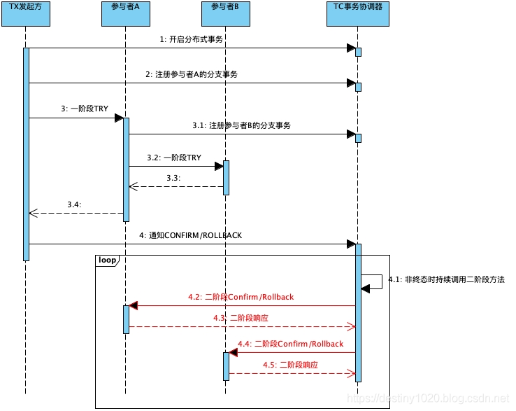
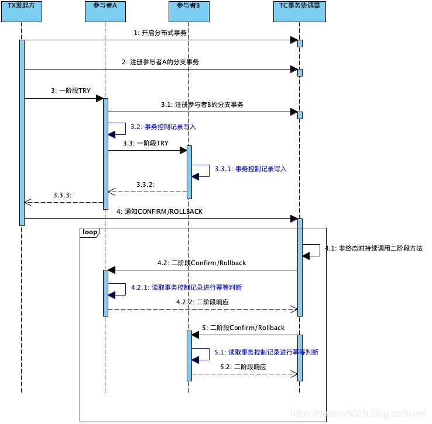
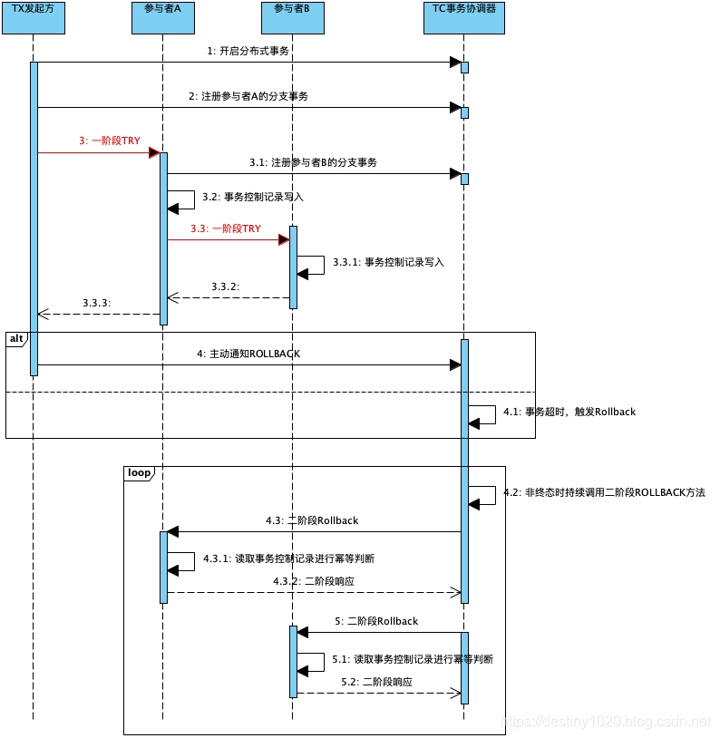
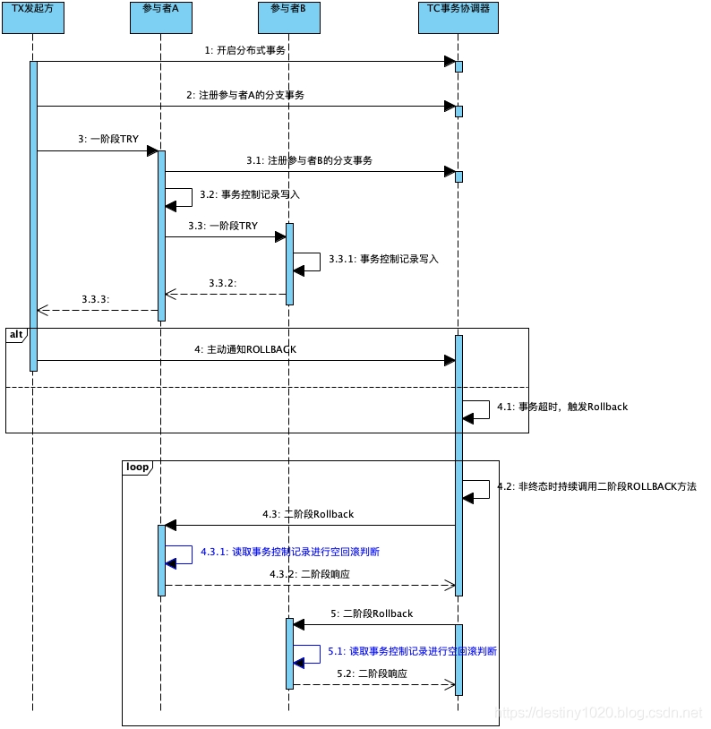
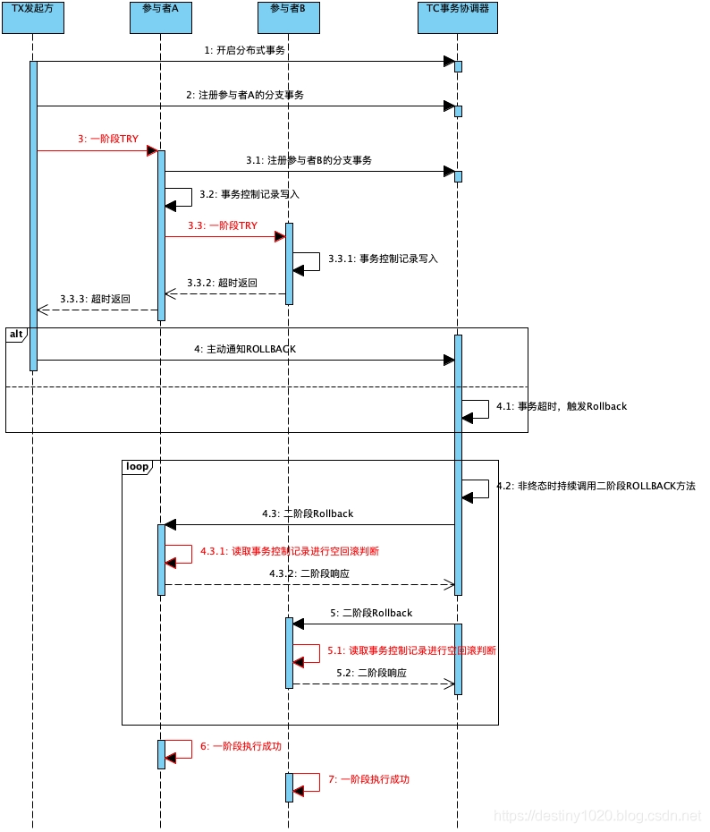
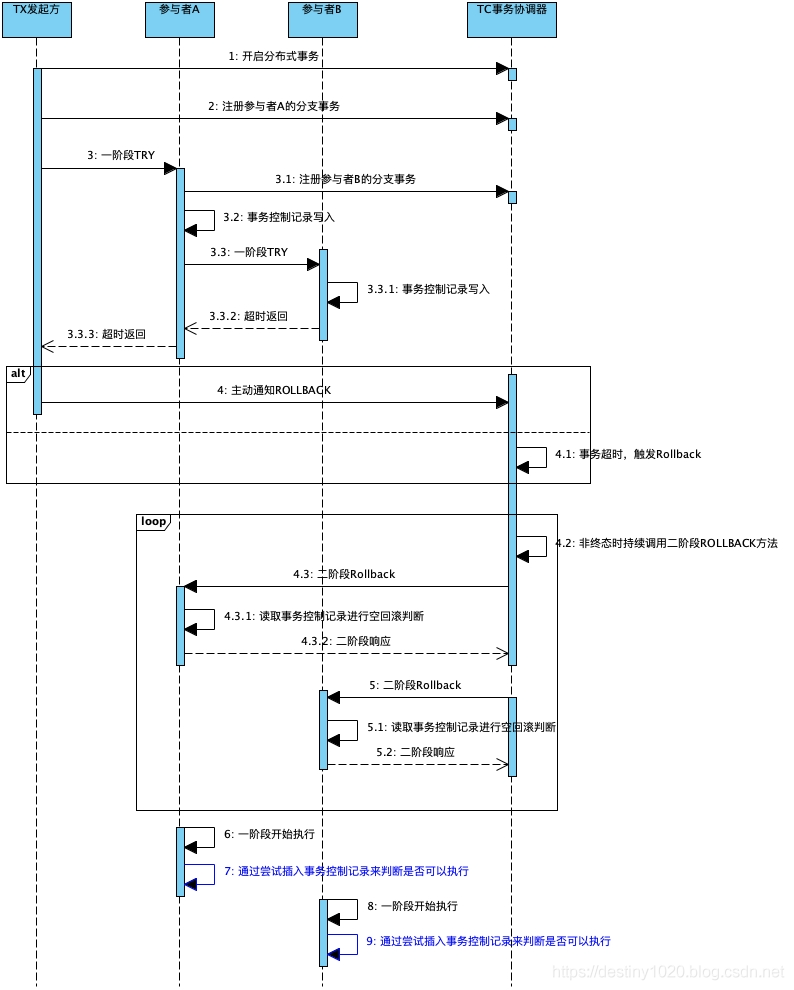

# TCC事务异常情况

在分布式系统中，随时随地都需要面对网络超时，网络重发和服务器宕机等问题。所以分布式事务框架作为搭载在分布式系统之上的一个框架型应用也绕不开这些问题。具体而言，有以下常见问题：

1. 幂等处理
2. 空回滚
3. 资源悬挂

## 一. 幂等处理

### 1.1 产生原因

因为网络抖动等原因，分布式事务框架可能会**重复调用同一个分布式事务中的一个分支事务的二阶段接口**。所以分支事务的二阶段接口Confirm/Cancel需要能够保证幂等性。如果二阶段接口不能保证幂等性，则会产生严重的问题，造成资源的重复使用或者重复释放，进而导致业务故障。

从上图中红色部分可以看到：如果当TC调用参与者的二阶段方法时，发生了异常(TC本身异常或者网络异常丢失结果)。此时TC无法感知到调用的结果。为了保证分布式事务能够走到终态，此时TC会按照一定的规则重复调用参与者的二阶段方法。

### 1.2 应对策略

对于幂等类型的问题，通常的手段是引入幂等字段进行防重放攻击。对于分布式事务框架中的幂等问题，同样可以祭出这一利器。我们可以通过增加一张事务状态控制表来实现，这个表的关键字段有以下几个：

1. 主事务ID
2. 分支事务ID
3. 分支事务状态

其中1和2构成表的联合主键来唯一标识一笔分布式事务中的一条分支事务。3用来标识该分支事务的状态，一共有3种状态：

1. INIT(I) - 初始化

2. CONFIRMED© - 已提交

3. ROLLBACKED® - 已回滚

幂等记录的插入时机是参与者的Try方法，此时的分支事务状态会被初始化为INIT。然后当二阶段的Confirm/Cancel执行时会将其状态置为CONFIRMED/ROLLBACKED。

当TC重复调用二阶段接口时，参与者会先获取事务状态控制表的对应记录查看其事务状态。如果状态已经为CONFIRMED/ROLLBACKED，那么表示参与者已经处理完其分内之事，不需要再次执行，可以直接返回幂等成功的结果给TC，帮助其推进分布式事务。增加了幂等记录的写入和读取判断后，时序图如下(蓝色部分)：

## 二. 空回滚

### 2.1 产生原因

先来说定义，当没有调用参与方Try方法的情况下，就调用了二阶段的Cancel方法，Cancel方法需要有办法识别出此时Try有没有执行。如果Try还没执行，表示这个Cancel操作是无效的，即本次Cancel属于空回滚；如果Try已经执行，那么执行的是正常的回滚逻辑。

如上图所示，红色部分的一阶段Try可能失败。

首先发起方在调用参与者之前，会向TC申请开始一笔分布式事务。然后发起方调用参与者的一阶段方法，在调用实际发生之前，一般会有切面拦截器感知到此次Try调用，然后写入一条分支事务记录。紧接着，在实际调用参与者的Try方法时发生了异常。异常原因可以是发起方宕机，网络抖动等。

总而言之，就是**Try方法没有执行成功，然而此时这笔分布式事务和分支事务已经落库**。有两种情况会触发分布式事务的回滚：

1. 发起方认为当前分布式事务无法成功，主动通知TC回滚

2. TC发现分布式事务超时，被动触发回滚

触发回滚操作后，TC会对该分布式事务关联的分支事务调用其二阶段Cancel。在执行Cancel时，Try还未执行成功，触发空回滚。如果不对空回滚加以防范的话，可能会造成资源的无效释放。即在没有预留资源的情况下就释放资源，造成故障。

### 2.2 应对策略

可以发现，要应对空回滚的问题，就需要让参与者在二阶段的Cancel方法中有办法识别到一阶段的Try是否已经执行。

很显然，可以继续利用事务状态控制表来实现这个功能。

前面提到过为了保证幂等性，当Try方法被成功执行后，会插入一条记录，标识该分支事务处于INIT状态。所以后续当二阶段的Cancel方法被调用时，可以通过查询控制表的对应记录进行判断。如果记录存在且状态为INIT，就表示一阶段已成功执行，可以正常执行回滚操作，释放预留的资源；如果记录不存在则表示一阶段未执行，本次为空回滚，不释放任何资源。

## 三. 资源悬挂

### 3.1 产生原因

悬挂，顾名思义，是有一些资源被悬挂起来后续无法处理了。那么什么场景下才会出现这种现象呢？

上一节中提到过空回滚，指的是当一阶段Try未执行成功，而二阶段Cancel就因TC回滚整个分布式事务而被调用。

但是考虑一种极端情况，当分布式事务到终态后，参与者的一阶段Try才被执行，此时参与者会根据业务需求预留相关资源。预留资源只有当前事务才能使用，然而此时分布式事务已经走到终态，后续再没有任何手段能够处理这些预留资源。至此，就形成了资源悬挂。

这种一阶段比二阶段执行的还晚的情况看似不可能，但是仔细考虑RPC调用的时序，其实这种情况在复杂多变的网络中是完全可能的，下面的时序展示了这种可能性：

1. 发起方通过RPC调用参与者一阶段Try，但是发生网络阻塞导致RPC超时
2. RPC超时后，TC会回滚分布式事务(可能是发起方主动通知TC回滚或者是TC发现事务超时后回滚)，调用已注册的各个参与方的二阶段Cancel
3. 参与方空回滚后，发起方对参与者的一阶段Try才开始执行，进行资源预留从而形成悬挂

使用时序图来描述，红色部分为产生资源悬挂的关键步骤：

### 3.2 应对策略

资源悬挂的本质原因在于，一阶段和二阶段的执行顺序没有被严格地保证。所以相应的解决方案还是通过读取**事务状态控制表**的事务状态。

前面在幂等方案的讨论中说过：

> 幂等记录的插入时机是参与者的Try方法，此时的分支事务状态会被初始化为INIT。然后当二阶段的Confirm/Cancel执行时会将其状态置为CONFIRMED/ROLLBACKED。

由于悬挂的产生背景是一阶段方法根本就未执行，所以此时事务控制记录是不存在的，需要在二阶段中处理ROLLBACK的情况(因为超时后触发回滚不可能存在二阶段为CONFIRM)。

处理方案为在判断为空回滚的场景下(体现在对应一阶段事务控制记录不存在)，插入一条状态为ROLLBACKED的控制记录。

那么下次当一阶段Try抵达执行的时候，首先会尝试插入状态为INIT的事务控制记录。如果插入失败，表示当前分支事务的记录已经存在，Try无需继续执行。有几种可能性会导致此情形：

1. 一阶段Try重复请求，网络抖动情况可能发生，可以理解为命中幂等
2. 二阶段插入了防悬挂记录，一阶段不可继续执行

时序图描述如下，蓝色部分为防止资源悬挂增加的检查项：

> 本文转载至：[[分布式事务-TCC\] 2. TCC的异常场景及应对机制_不忘初心，好好沉淀-CSDN博客_tcc 超时](https://blog.csdn.net/dm_vincent/article/details/92432059)
