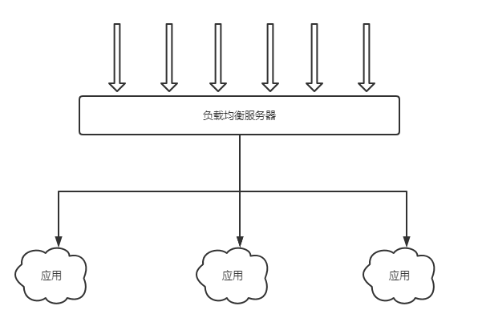

# 集群、分布式、微服务的区别与联系

## 一. 集群

集群：同一个应用部署在多个服务器上，然后使用负载均衡将用户请求分发至集群节点之中。

需要解决的问题：集群节点之间的Session共享。

## 二. 分布式

分布式：将一个大的系统划分为多个业务模块，业务模块分别**部署到不同的机器上**，各个业务模块之间通过接口进行数据交互。区别分布式的方式是根据不同机器不同业务。**分布式更多的是部署层面的概念**，强调的是每一个业务模块部署到不同服务器上。

需要解决的问题：分布式部署需要解决分布式事务。

## 三. 微服务

微服务的设计是为了不因为某个模块的升级和BUG影响现有的系统业务。**微服务与分布式的细微差别是，微服务的应用不一定是分散在多个服务器上，它也可以是同一个服务器**。

**一句话说明白三者的区别**：去饭店吃饭就是一个完整的业务，饭店的厨师、配菜师、传菜员、服务员就是分布式；厨师、配菜师、传菜员和服务员都不止一个人，这就是集群；分布式就是微服务的一种表现形式，分布式是部署层面，微服务是设计层面

