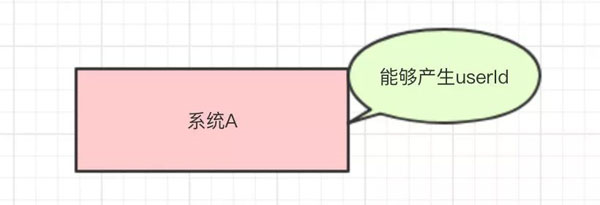
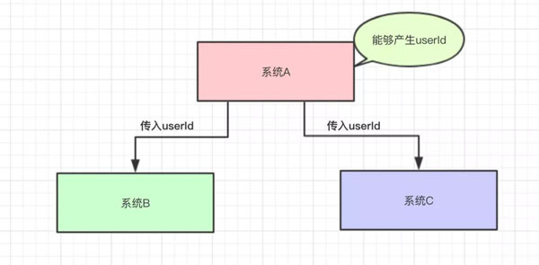
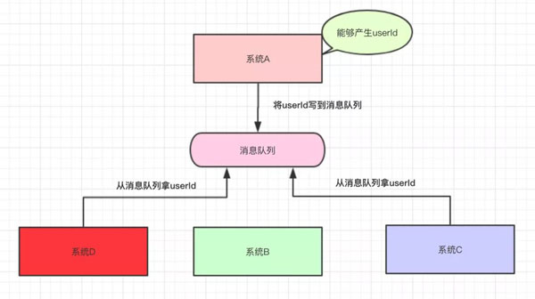
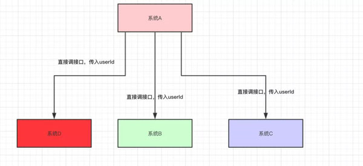
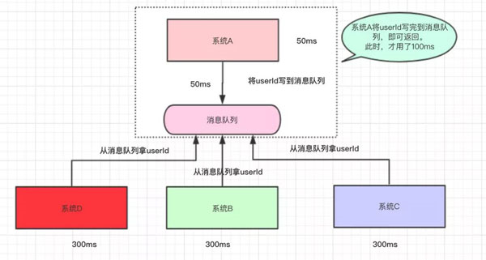
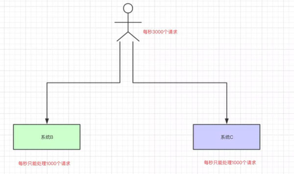
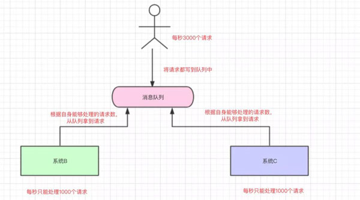

# 消息队列可以解决哪些问题

> 说明：本文转载至：<https://developer.51cto.com/art/201904/595020.htm>

为什么要用消息队列，也就是在问：用了消息队列有什么好处。我们看看以下的场景：

## 一. 消息队列的应用

### 1.1解耦

现在我有一个系统A，系统A可以产生一个userId：



然后，现在有系统B和系统C都需要这个userId去做相关的操作:



写成伪代码可能是这样的：

```java
public class SystemA {  
    // 系统B和系统C的依赖  
    SystemB systemB = new SystemB();  
    SystemC systemC = new SystemC();  
    // 系统A独有的数据userId  
    private String userId = "Java3y";  
    public void doSomething() {  
        // 系统B和系统C都需要拿着系统A的userId去操作其他的事  
        systemB.SystemBNeed2do(userId);  
        systemC.SystemCNeed2do(userId);  
    }  
} 
```

ok，一切平安无事度过了几个天。

某一天，系统B的负责人告诉系统A的负责人，现在系统B的SystemBNeed2do(String userId)这个接口不再使用了，让系统A别去调它了。

于是，系统A的负责人说"好的，那我就不调用你了。"，于是就把调用系统B接口的代码给删掉了：

```java
public void doSomething() {  
  // 系统A不再调用系统B的接口了  
  //systemB.SystemBNeed2do(userId);  
  systemC.SystemCNeed2do(userId);  
} 
```

又过了几天，系统D的负责人接了个需求，也需要用到系统A的userId，于是就跑去跟系统A的负责人说："老哥，我要用到你的userId，你调一下我的接口吧"

于是系统A说："没问题的，这就搞".....

时间飞逝：

-  又过了几天，系统E的负责人过来了，告诉系统A，需要userId。
-  又过了几天，系统B的负责人过来了，告诉系统A，还是重新掉那个接口吧。
-  又过了几天，系统F的负责人过来了，告诉系统A，需要userId。
-  ……

于是系统A的负责人，每天都被这给骚扰着，改来改去，改来改去…….

还有另外一个问题，调用系统C的时候，如果系统C挂了，系统A还得想办法处理。如果调用系统D时，由于网络延迟，请求超时了，那系统A是反馈fail还是重试？？

然后，公司招来一个大佬，大佬经过几天熟悉，上来就说：将系统A的userId写到消息队列中，这样系统A就不用经常改动了。为什么呢？下面我们来一起看看：



系统A将userId写到消息队列中，系统C和系统D从消息队列中拿数据。这样有什么好处？

-  系统A只负责把数据写到队列中，谁想要或不想要这个数据(消息)，系统A一点都不关心。
-  即便现在系统D不想要userId这个数据了，系统B又突然想要userId这个数据了，都跟系统A无关，系统A一点代码都不用改。
-  系统D拿userId不再经过系统A，而是从消息队列里边拿。系统D即便挂了或者请求超时，都跟系统A无关，只跟消息队列有关。

这样一来，系统A与系统B、C、D都解耦了。

### 1.2异步

我们再来看看下面这种情况：系统A还是直接调用系统B、C、D：



假设系统A运算出userId具体的值需要50ms，调用系统B的接口需要300ms，调用系统C的接口需要300ms，调用系统D的接口需要300ms。那么这次请求就需要50+300+300+300=950ms

并且我们得知，系统A做的是主要的业务，而系统B、C、D是非主要的业务。比如系统A处理的是订单下单，而系统B是订单下单成功了，那发送一条短信告诉具体的用户此订单已成功，而系统C和系统D也是处理一些小事而已。

那么此时，为了提高用户体验和吞吐量，其实可以异步地调用系统B、C、D的接口。所以，我们可以弄成是这样的：



系统A执行完了以后，将userId写到消息队列中，然后就直接返回了(至于其他的操作，则异步处理)。

-  本来整个请求需要用950ms(同步)
-  现在将调用其他系统接口异步化，从请求到返回只需要100ms(异步)

(例子可能举得不太好，但我觉得说明到点子上就行了，见谅。)

### 1.3削峰/限流

我们再来一个场景，现在我们每个月要搞一次大促，大促期间的并发可能会很高的，比如每秒3000个请求。假设我们现在有两台机器处理请求，并且每台机器只能每次处理1000个请求。



那多出来的1000个请求，可能就把我们整个系统给搞崩了…所以，有一种办法，我们可以写到消息队列中：



系统B和系统C根据自己的能够处理的请求数去消息队列中拿数据，这样即便有每秒有8000个请求，那只是把请求放在消息队列中，去拿消息队列的消息由系统自己去控制，这样就不会把整个系统给搞崩。

## 二.使用消息队列带来的问题

### 2.1 高可用

无论是我们使用消息队列来做解耦、异步还是削峰，消息队列肯定不能是单机的。试着想一下，如果是单机的消息队列，万一这台机器挂了，那我们整个系统几乎就是不可用了。

所以，当我们项目中使用消息队列，都是得集群/分布式的。要做集群/分布式就必然希望该消息队列能够提供现成的支持，而不是自己写代码手动去实现。

### 2.2 数据丢失问题

我们将数据写到消息队列上，系统B和C还没来得及取消息队列的数据，就挂掉了。如果没有做任何的措施，我们的数据就丢了。

学过Redis的都知道，Redis可以将数据持久化磁盘上，万一Redis挂了，还能从磁盘从将数据恢复过来。同样地，消息队列中的数据也需要存在别的地方，这样才尽可能减少数据的丢失。

那存在哪呢？

-  磁盘？
-  数据库？
-  Redis？
-  分布式文件系统？

同步存储还是异步存储？

