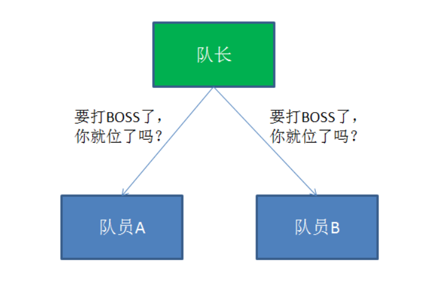
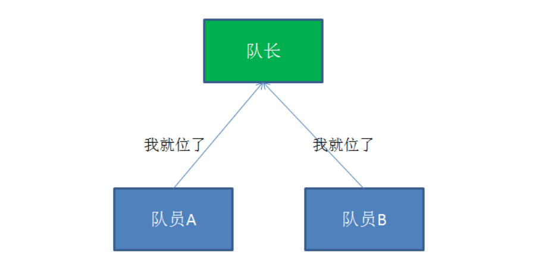
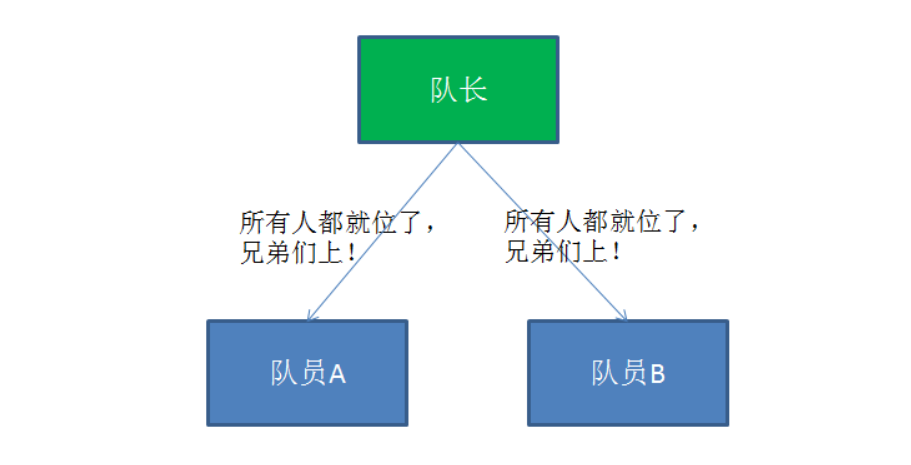
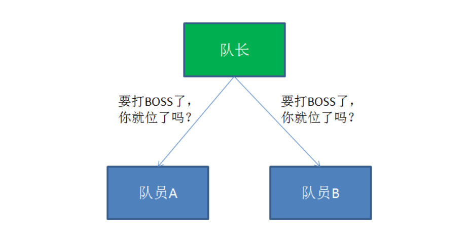
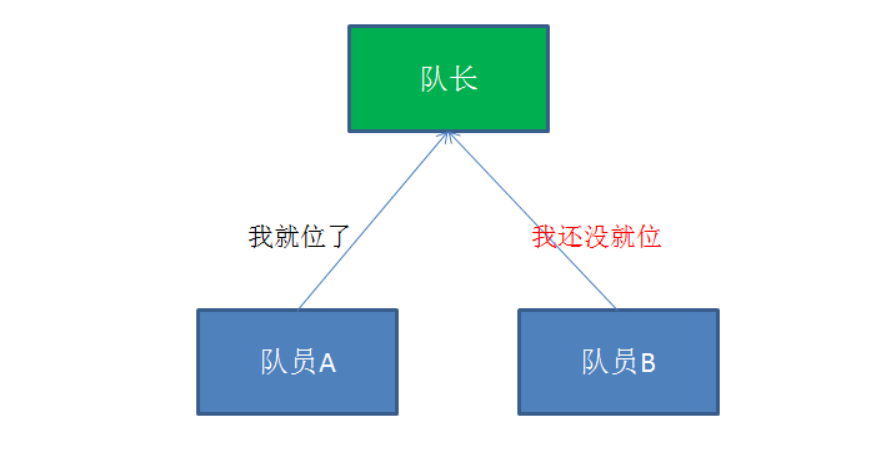
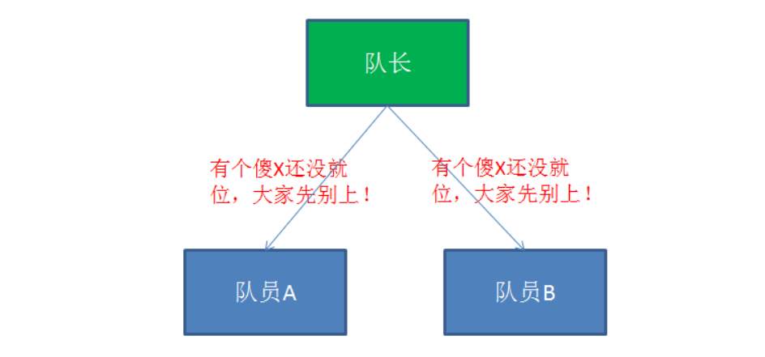
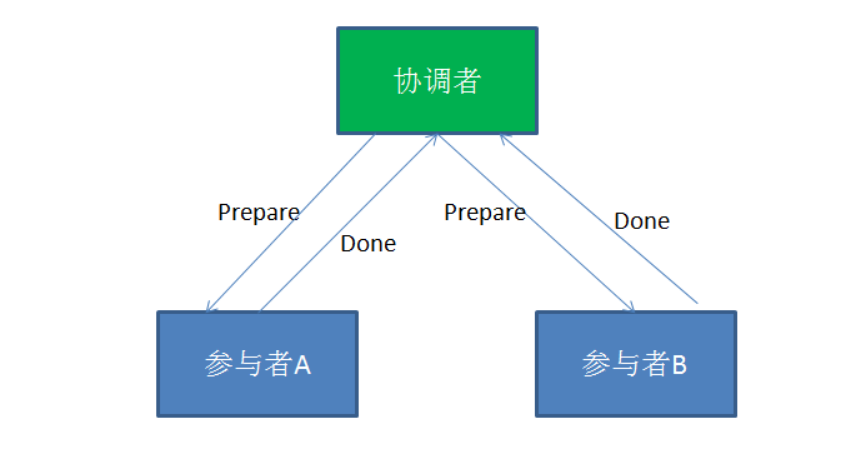
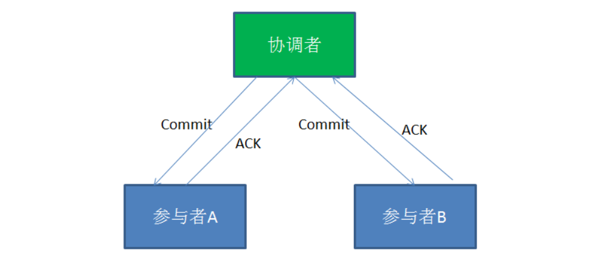
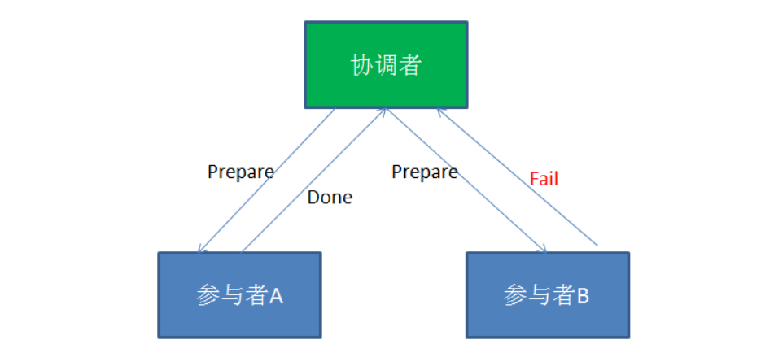
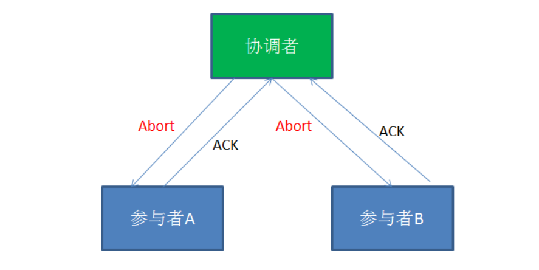

# 什么是分布式事务

> 说明：本文精简转载至：<https://blog.csdn.net/bjweimengshu/article/details/79607522>

分布式事务用于在分布式系统中保证不同节点之间的数据一致性。分布式事务的实现有很多种，最具有代表性的是由**Oracle Tuxedo**系统提出的**XA**分布式事务协议。

XA协议包含**两阶段提交（2PC）**和**三阶段提交（3PC）**两种实现，这里我们重点介绍两阶段提交的具体过程。

玩过魔兽世界的小伙伴都知道，副本组团在打BOSS的时候，为了方便队长与队员之间的协作，队长可以发起一个就为确认的操作：

当队员收到就位确认提示后，如果已经就位，就选择“是”，如果还没就位，就选择“否”。

当队长收到了所有人的就位确认，就会向所有队员们发布消息，告诉他们开始打BOSS。

相应的，在队长发起就位确认的时候，有可能某些队员还并没有就位：

以上就是魔兽世界当中组团打BOSS的确认流程。这个流程和XA分布式事务协议的两阶段提交非常相似。

那么XA协议究竟是什么样子呢？在XA协议中包含着两个角色：**事务协调者**和**事务参与者**。让我们来看一看他们之间的交互流程：

**第一阶段：**

在XA分布式事务的第一阶段，作为事务协调者的节点会首先向所有的参与者节点发送Prepare请求。

在接到Prepare请求之后，每一个参与者节点会各自执行与事务有关的数据更新，写入Undo Log和Redo Log。如果参与者执行成功，暂时不提交事务，而是向事务协调节点返回“完成”消息。

当事务协调者接到了所有参与者的返回消息，整个分布式事务将会进入第二阶段。

**第二阶段：**

在XA分布式事务的第二阶段，如果事务协调节点在之前所收到都是正向返回，那么它将会向所有事务参与者发出Commit请求。

接到Commit请求之后，事务参与者节点会各自进行本地的事务提交，并释放锁资源。当本地事务完成提交后，将会向事务协调者返回“完成”消息。

当事务协调者接收到所有事务参与者的“完成”反馈，整个分布式事务完成。

以上所描述的是XA两阶段提交的正向流程，接下来我们看一看失败情况的处理流程：

**第一阶段：**

**第二阶段：**

在XA的第一阶段，如果某个事务参与者反馈失败消息，说明该节点的本地事务执行不成功，必须回滚。

是在第二阶段，事务协调节点向所有的事务参与者发送Abort请求。接收到Abort请求之后，各个事务参与者节点需要在本地进行事务的回滚操作，回滚操作依照Undo Log来进行。以上就是XA两阶段提交协议的详细过程。

XA两阶段提交虽然解决了分布式事务数据一致性问题，但仍然存在很多不足的地方：

## XA两阶段提交的不足

**1.性能问题**

XA协议遵循强一致性。在事务执行过程中，各个节点占用着数据库资源，只有当所有节点准备完毕，事务协调者才会通知提交，参与者提交后释放资源。这样的过程有着非常明显的性能问题。

**2.协调者单点故障问题**

事务协调者是整个XA模型的核心，一旦事务协调者节点挂掉，参与者收不到提交或是回滚通知，参与者会一直处于中间状态无法完成事务。

**3.丢失消息导致的不一致问题。**

在XA协议的第二个阶段，如果发生局部网络问题，一部分事务参与者收到了提交消息，另一部分事务参与者没收到提交消息，那么就导致了节点之间数据的不一致。

如果避免XA两阶段提交的种种问题呢？有许多其他的分布式事务方案可供选择：

**1.XA三阶段提交**

XA三阶段提交在两阶段提交的基础上增加了CanCommit阶段，并且引入了超时机制。一旦事物参与者迟迟没有接到协调者的commit请求，会自动进行本地commit。这样有效解决了协调者单点故障的问题。但是性能问题和不一致的问题仍然没有根本解决。

**2.MQ事务**

利用消息中间件来异步完成事务的后一半更新，实现系统的最终一致性。这个方式避免了像XA协议那样的性能问题。

**3.TCC事务**

TCC事务是Try、Commit、Cancel三种指令的缩写，其逻辑模式类似于XA两阶段提交，但是实现方式是在代码层面来人为实现。  