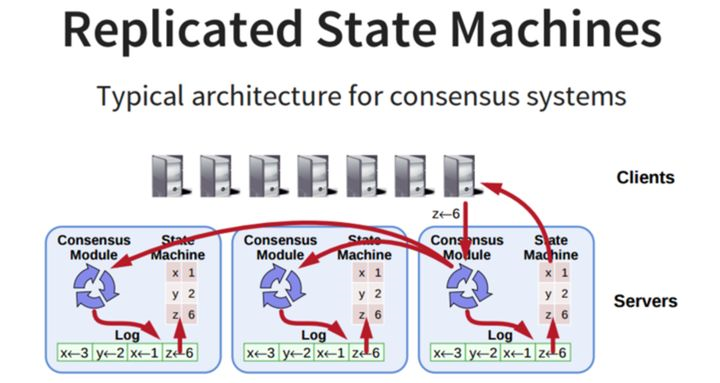

# Raft协议

[Raft (thesecretlivesofdata.com)](http://thesecretlivesofdata.com/raft/)

分布式存储系统通常通过维护多个副本来进行容错，提高系统的可用性。要实现此目标，就必须要解决分布式存储系统的最核心问题：**维护多个副本的一致性**。

首先需要解释一下什么是一致性（consensus）,它是**构建具有容错性（fault-tolerant）的分布式系统的基础**。 在一个具有一致性的性质的集群里面，同一时刻所有的结点对存储在其中的某个值都有相同的结果，即对其共享的存储保持一致。集群具有自动恢复的性质，当少数结点失效的时候不影响集群的正常工作，当大多数集群中的结点失效的时候，集群则会停止服务（不会返回一个错误的结果）。

一致性协议就是用来干这事的，**用来保证即使在部分(确切地说是小部分)副本宕机的情况下，系统仍然能正常对外提供服务**。一致性协议通常基于replicated state machines，即所有结点都从同一个state出发，都经过同样的一些操作序列（log），最后到达同样的state。

## 架构

系统中每个结点有三个组件：

> - 状态机：当我们说一致性的时候，实际就是在说要保证这个状态机的一致性。状态机会从log里面取出所有的命令，然后执行一遍，得到的结果就是我们对外提供的保证了一致性的数据。
> - Log：保存了所有修改记录
> - 一致性模块：一致性模块算法就是用来保证写入的log的命令的一致性，这也是raft算法核心内容

协议内容

Raft协议将一致性协议的核心内容分拆成为几个关键阶段，以简化流程，提高协议的可理解性。

**Leader election**

Raft协议的每个副本都会处于三种状态之一：Leader、Follower、Candidate。

> **Leader**：所有请求的处理者，Leader副本接受client的更新请求，本地处理后再同步至多个其他副本；
> **Follower**：请求的被动更新者，从Leader接受更新请求，然后写入本地日志文件
> **Candidate**：如果Follower副本在一段时间内没有收到Leader副本的心跳，则判断Leader可能已经故障，此时启动选主过程，此时副本会变成Candidate状态，直到选主结束。

时间被分为很多连续的随机长度的term，term有唯一的id。每个term一开始就进行选主：

1. Follower将自己维护的current_term_id加1。
2. 然后将自己的状态转成Candidate
3. 发送RequestVoteRPC消息(带上current_term_id) 给 其它所有server

这个过程会有三种结果：