# 云原生下的开发测试最佳实践

> 本文转载至：[云原生下的开发测试实践-阿里云开发者社区 (aliyun.com)](https://developer.aliyun.com/article/763319)

## 测试环境管理之困与阿里巴巴的解决之道

在云原生时代下，软件的迭代速度越来越快，对测试的要求也越来越高，很多开发者开始使用Kubernetes来管理测试环境。在这个过程中，开发者会遇到很多困难，其中最主要的两个问题是：一、本地环境与Kubernetes集群网络不通问题；二、共用测试环境时，相互干扰的问题。

在阿里巴巴内部，我们主要通过扁平的内网IP和项目环境两个机制来解决以上痛点。扁平的内网IP主要是基于CNI(Conteinre Network Interface) 机制改造Kubernetes的IP逻辑实现的，可以使集群中的每个Pod分配到的IP与本地机器分配到的IP处于一个大的网络环境下，这样就可以解决本地环境和集群之间互通的问题。项目环境是基于RPC、消息中间件的虚拟环境，从表面上看，每个项目环境都是一套独立完整的测试环境，由一系列服务组成集群，而实际上，除了个别当前使用者想要测试的服务，其余服务都是通过路由系统和消息中间件虚拟出来的，指向公共基础环境的相应服务。这样操作的好处是，第一不会占用大量的开发资源；第二，不会影响公共基础环境的稳定性。

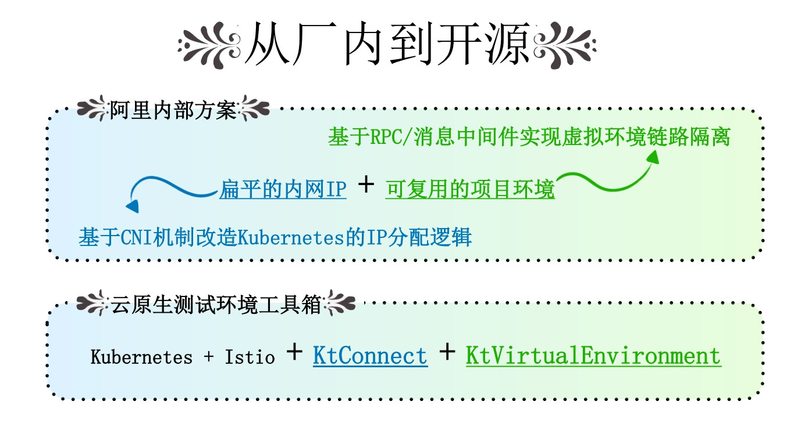

阿里巴巴的这种测试环境带来的测试体验非常爽，本地与集群双向互通，每个子项目都可以独占一个“项目环境”，彼此不会干扰。但是这种测试环境管理方式实施起来比较复杂，只适合大型的集团公司，我们希望将这种测试体验以 “更轻”的方式实现，普惠更多开发者。于是云效团队推出了云原生测试环境工具箱，主要包括kt-connect和kt-virtual-environment这两个开源工具。

## 通过kt-connect解决本地与集群双向互通问题

首先，我们来聊一聊如何使用Kubernetes测试环境开源工具箱中的kt-connect解决 “本地与集群双向互通”的问题。

我们假设有一位主人公叫“程序员小黑”，他所在公司采用了微服务相关的技术实践。小黑在做本地开发的过程中，会遇到两种联调场景，即我需要联调其它服务和其它服务调用我。

我们先来看第一个场景：联调其它服务。前面讲到本地环境和K8S集群中的网络是相互隔离的，那么在本地完成代码开发后，如何高效的与其它服务进行联调呢？最“简单粗暴”的一种方式，就是在本地完整的部署一套测试环境，这种方式的优点很明显，效率最高，而且没有外部依赖。缺点也同样明显，一是对开发人员的素质要求非常高，二是要占用大量本地的开发资源，对本地开发机的性能要求很高。第二种方式是利用Kubernetes等工具在本地部署一套K8S集群，这种方式可以在一定程度上降低开发人员“上手成本”，但是也同样存在占用大量本地开发资源的问题。还有一种处理方式是利用VPN调用K8S集群中的服务，这种方式存在两个问题，一个是本地的服务调用是脱离了Istio的流量控制的，第二个问题VPN这种方式只解决了本地到集群的通讯，对于回调这种方式是解决不了的。

那么，有没有更简单的方式呢？答案是肯定的，通过KT-Connect工具可以让开发者一键建立本地到Kubernetes集群的网络连接。开发者只需要运行一个“connect”命令，就可以自动在集群中创建一个代理容器，并且通过这个代理容器建立本地与集群的VPN连接，同时KT-Connect也会内置DNS服务，本地服务可以直接通过服务的名称进行服务调用，就好像本地的程序运行在K8S集群中一样。 在KT-Connect中，我们给这个代理容器取了一个名字“shadow pod”，即“影子”。它就像是本地服务在集群中的影子，通过它来完成本地服务与集群中服务的相互调用。

接下来，我们来看第二个场景：其它服务调用我。在联调时，小黑不仅需要调用其它人的服务，同时作为服务的生产者又会被其它服务调用。这时只打通本地到集群的服务是不能满足联调测试需求的，必须同时让集群中的服务也可以访问本地的服务。

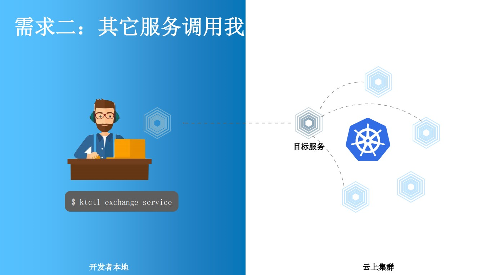

这就需要使用KT-Connect 的第二个命令——“Exchange”。Exchange（交换）命令会在集群内部署一个代理容器，并替换集群中指定服务的目标容器，从而将发往该服务的所有流量拦截并转发到本地端口。这是一种“完全替换”，这就意味着在同一时间点，只有一位开发者可以将他本地的服务加入到集群中。为了解决这个问题，KT-Connect提供了第三个命令——Mesh（混合）。当我们在本地运营“Mesh”命令后，我们同样会把本地服务加入到集群里面，但是会保持原有的目标服务状态不变，并且本地服务会继承目标服务中所有的标签。依照K8S本身服务发现的原理，请求流量会被随机地转发到原有服务或本地的服务。同时配合Istio的流量规则，就可以让所有正常流量依然保持对原应用的访问，而只对一些有特殊标记的的请求转发到本地。从而可以实现在一套公用测试环境的基础上各自独立的完成本地的集成联调。

## KT-Connect背后的原理

我们通过KT-Connect的“connect”“Exchange” “Mesh”命令实现了本地到集群的双向网络互通，看起来似乎很神奇，其实背后并没有什么黑科技。我们只是综合利用了Kubernetes原有的特性及SSH这个我们经常会用到的网络协议，通过Kubectl的端口转发可以实现将集群中服务的端口映射到本地，通过SSH协议建立本地与集群之间的隧道。

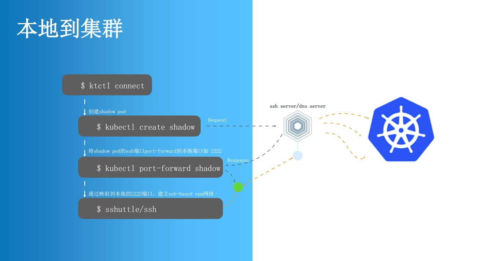

以“Connect”命令为例，了解一下KT-Connect背后的原理。如上图所示，当开发者在本地运行“Connect”命令后，首先会创建一个代理容器（shadow pod），这个代理容器会运行“SSH Server”和“DNS Server”。当代理容器启动成功之后，就可以通过“port-forward”将代理容器的22端口转映射到本地，如2222端口。此时，本地服务就可以通过本地的2222端口建立与集群内部的连接。

“Exchange”和与“Connect”命令背后的原理类似，我们也会先创建一个代理容器，并通过“port-forward”将代理容器的端口映射到本地。然后根据Exchange的目标服务，判断将代理容器的哪一个端口的请求全部转发到本地的特定端口。

“Mesh”与“Exchange”的最大的差异在于“Exchange”会将原应用的副本数直接降到0，会将集群内所有对原应用的流量全部转发到本地。而 “Mesh”则是在保持原有应用Pod不变的前提下，创建一个新的代理容器并且继承原应用的所有标签，还会增加一个随机的version标签。这时我们就可以通过Istio规则， 精确控制流量。

如前文所述，通过KT-Connect我们可以实现从本地到集群的双向互通。我们可以看到这样一个有趣的场景：小黑A可以通过“Mesh”命令把本地服务加入到测试环境里，并且可以让集群中一部分特定的流量转发到本地，这样他可以与集群中的其它服务进行联调。小黑B通过“Connect”命令连接到集群，直接在本地进行测试。在某些情况下，小黑B需要依赖的服务刚好是小黑A正在开发的版本，小黑B只要按照Istio的流量规则设置可以调用小黑A服务的值，就可以跟小黑A的服务进行联调。对于小黑C，他既需要调用集群中的服务，又需要集群中的服务回调到本地，所以他在本地既运营了 “Connect”又运行了“Mesh”。

上文描述的其实是一种理想情况，需要建立在我们的测试环境是一种稳定状态的基础之上。但在现实情况下，由于频繁的代码变更测试环境往往处于一种不太稳定的状态。接下来我们会介绍如何使用云原生测试环境工具箱中的kt-virtual-environment打造稳定的测试环境，让开发者可以更好地进行协同研发工作。

## 共用测试环境相互干扰问题及常见解决方案

在一个中大规模研发团队负责的项目中，往往一个系统里包含许多(微)服务，而且服务之间存在链式依赖，难以独立启动运行。这时就很容易出现“共用测试环境相互干扰”的问题，比如一个开发者重新部署、重启测试环境时，可能会打断所有正在测试的开发者；一个开发者提交了有BUG的代码，所有开发者都可能受影响；一个开发者为了排查问题，单步调试测试环境服务时，所有开发者测试请求会被拦截。

如何来解决这个问题呢？以往的思路是准备多套测试环境。虽然这种方式可以暂时缓解开发过程中的相互影响，但是这会带来额外的资源分配和管理问题，特别是当没有那么多并行开发时会产生非常严重的资源浪费。

于是出现了一种“改进”方法，企业通过用helm或自制工具自动化地快速创建一套环境，用完即删。该方法在一定程度上解决闲置资源回收的问题，但是也没有那么“完美”。在实际操作过程中，环境的创建其实并没有那么“快速”，往往需要等待几分钟甚至几十分钟的时间。而且如果为每个子项目的成员分别拉一套环境，资源浪费依然严重。

在多人协同场景下，如何做到测试环境不相互干扰又不产生极大的资源浪费呢？在阿里巴巴内部主要通过“项目环境”的方案解决。

“项目环境”的本质是基于路由隔离实现的一个“虚拟环境”。我们通过一个实例来简单了解一下。

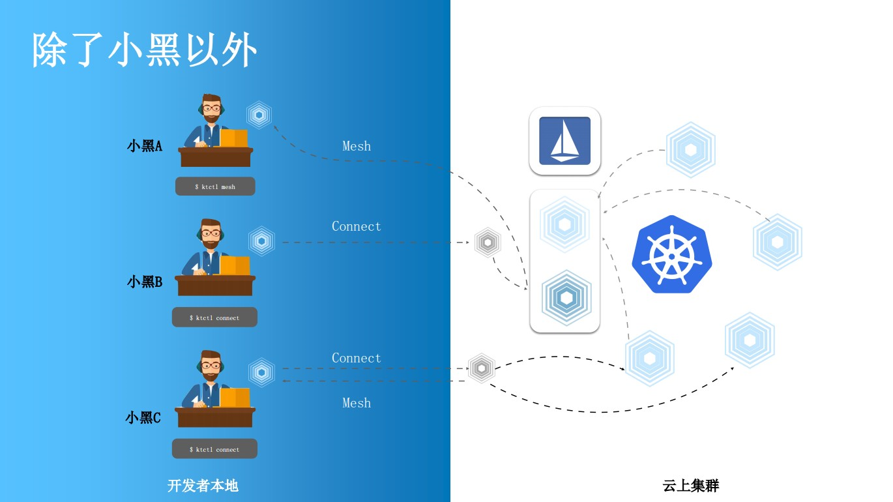

如上图中蓝色部分所示，由服务A、服务B、服务C、服务D组成一个完整的测试环境，我们称为“公共基础环境”（也称默认环境）。当某位开发者需要进行项目开发的时候，他不需要把应用或服务部署到公共基础环境中，而是单拉出来一部分资源（服务C和服务D）并复用部分公共基础环境资源（服务A和服务B）形成 “项目环境”。这样操作的好处是，第一不会占用大量的开发资源；第二，不会影响公共基础环境的稳定性。

我们主要通过打“环境标”的形式形成独立的“隔离域”，比如[dev]代表公共基础服务实例的标签值，[dev.proj]代表项目环境的服务实例。同一个环境标形成一个独立的“隔离域”，这是基于路由规则实现的。如果服务请求是来自一个有环境标的服务实例，它的服务请求会优先寻找跟它具有相同环境标的实例，如果没有，会寻找它上一级的环境标，这叫做“路由兜底”。比如上图中服务请求来自带有[dev.proj]环境标的实例C，需要调用服务B，但是发现没有带环境标[dev.proj]的服务B，于是寻找带有上一级环境标[dev]的服务B。

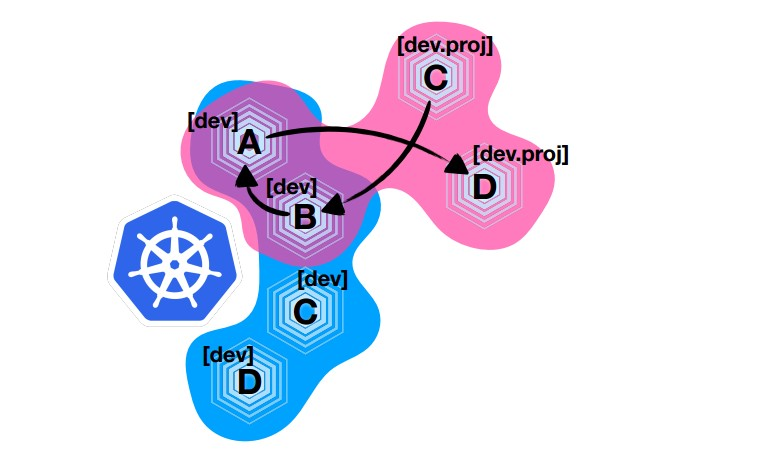

我们还可以将本地开发机加入项目环境。比如开发者“小黑”在本地启动了一个服务实例C，他给这个服务实例打的环境标是[dev.proj.local]，通过前面介绍路由规则我们了解到带环境标的服务发出的请求会优先寻找带相同环境标的服务，如果找不到则会寻找带有上一级环境标的服务，于是服务C[dev.proj.local]、服务D[dev.proj]和公共基础环境中服务A[dev]、服务B[dev]就组成了一个新的的“项目环境”（图中红色部分）。

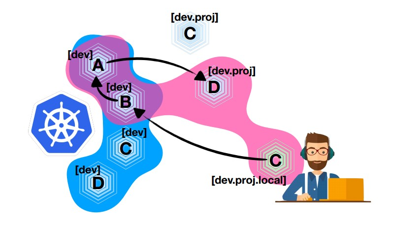

这时“小黑”的同事也加入了项目，他在本地启动了一个服务A，如果他没有对这个服务打“环境标”的话，他会默认使用“公共基础环境”进行测试。这时小黑在他自己的“项目环境”中的任何调试都不会影响到小黑的同事，反之亦然。

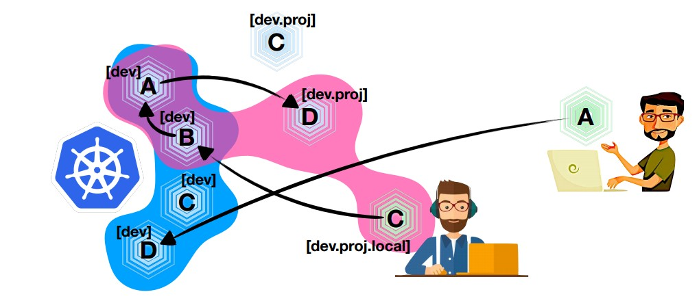

后来小黑的同事和小黑加入了同一个子项目，他们之间需要“联调”。这时，小黑的同事只要给他本地的服务打上一个和小黑的“项目环境”相同的环境标即可，如上图红色部分。

总结一下前面介绍的概念：“隔离域”是由路由规则形成的虚拟边界；每个“环境标”都会形成一个独立的“隔离域”；“隔离域”之间可以存在部分或完全重合；“隔离域”的成员会随集群中服务实例所带“环境标”动态变化。

## 如何使用kt-virtual-environment 打造项目环境

kt-virtual-environment是一种基于Service Mesh的微服务环境复用工具，源于阿里巴巴内部的项目环境实践。通过Pod上的虚拟环境标签，kt-virtual-environment能够自动将测试环境网络动态隔离成多个虚拟隔离域，同时以简单规则在隔离域间局部复用Pod实例，从而达到只需很少资源成本即可创建大量不同微服务版本组合的独立测试环境的目的。

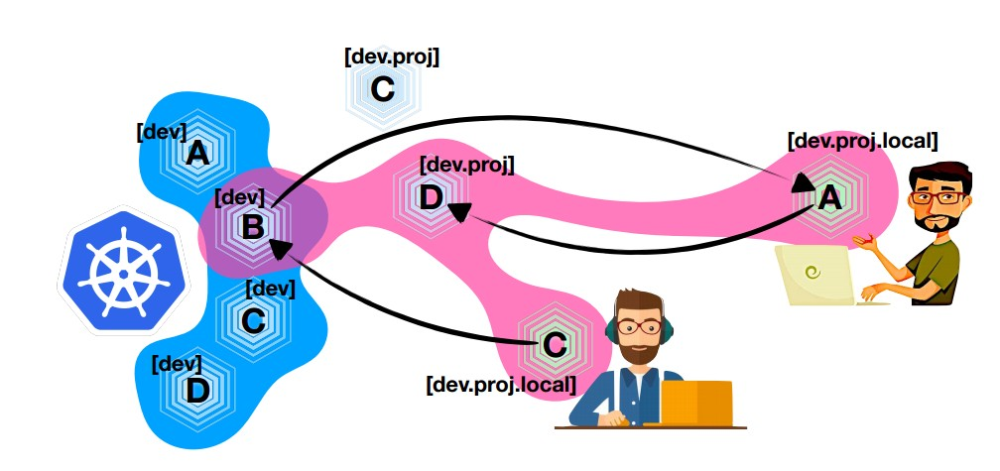

下面我们来了解一下如何使用kt-virtual-environment打造项目环境。通过前面的介绍，我们知道相同的“环境标”会形成一个独立的“隔离域”。所以首先我们需要为服务实例打上环境标，在kt-virtual-environment中是通过为为pod（或容器）添加约定的Label的方式实现的。在服务调用过程中，需要为应用程序添加一些逻辑，才能让“环境标”顺利在上下文之间传递，这个过程类似SkyWalking、Zipkin等链路追踪工具的SDK端所做的事情，让“环境标”通过HTTP头在请求链路上一直保持传递。第三步，我们需要在集群中配置Virtual Environment类型的资源实例，详细配置的结构如上图所示。

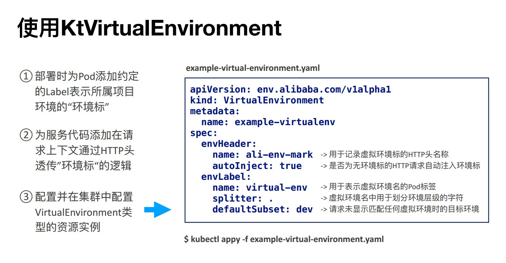

kt-virtual-environment实现的基本原理是：观察并持续监听环境中的所有服务和开发资源，动态生成Service Mesh控制面规则，实现核心隔离逻辑 。当前kt-virtual-environment仅支持基于Istio的规则，未来会增加基于其它 控制面的Service Mesh规则的实现。

## 阿里巴巴使用项目环境的最佳实践

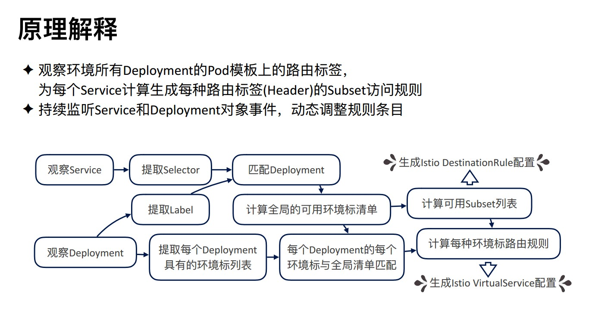

“项目环境”在阿里巴巴内部已近发展多年，下面我将一些优秀的实践分享给大家。理论上，“环境标”的层级可以无限多，但是我们的经验是最好不要超过三级。因为三层的“环境标”基本上可以满足95%以上的研发场景。

以三层环境标实现的项目环境举例。第一层一般只有一个环境标，比如[dev]，这是对应默认隔离域（公共环境）使用的环境标，这样做会让整个路由规则比较简单，大家不用猜测“路由兜底”最后会“兜”到哪里去。这个顶级的[dev]环境标对应的测试环境是不需要开发者自己去部署的，一般是通过“流水线”等自动化工具部署的稳定版本。对于某个子项目，我们可以基于顶级环境标建立一个二级环境标，如[dev.proj1]，这样会形成这个子项目的隔离域（项目环境）。在这个隔离域中，只需要开发者自己部署需要改动的服务实例即可，其它不需要改动的服务实例可以复用公共环境中实例。有的时候，某位开发者可能要对某服务进行比较大的改动或者他不希望这个服务被其它同事访问到，他可以基于“项目环境”再创建一个“个人环境”。在这个个人环境中，他既可以调用子项目中的服务，也可以调试本地开发的新的服务版本，并且不会影响到其他开发者。以上，是我们比较推荐的项目环境的用法。

总结：

云原生测试环境工具箱共包含两款独立的工具：kt-connect和kt-virtual-environment。kt-connect是一款本地工具，主要是帮助开发者打通本地和集群网络，实现本地加入隔离域。kt-virtual-environment是一种基于Service Mesh的微服务环境复用工具，通过观察并持续监听环境中的所有服务和开发资源，动态生成Service Mesh控制面规则，实现核心隔离逻辑 。只需要一次性部署，开发者不会频繁使用到。目前两款工具已经开源，大家可以进入Github社区进行下载使用。

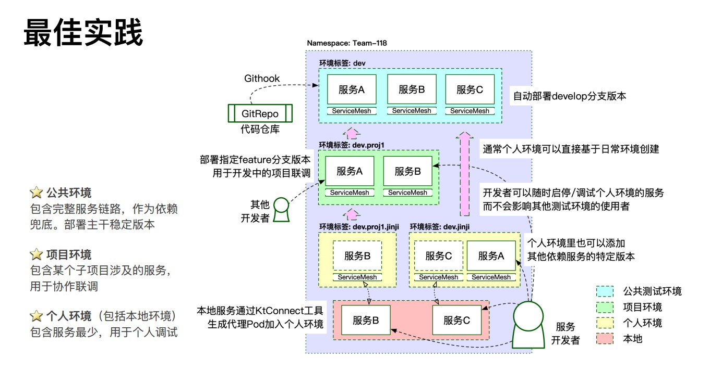