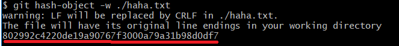

## Git 内部原理 - Git 对象

#### Git对象

​	Git 是一个内容寻址文件系统。  这意味着，Git 的核心部分是一个简单的键值对数据库（key-value data store）。 你可以向该数据库插入任意类型的内容，它会返回一个键值，通过该键值可以在任意时刻再次检索（retrieve）该内容。 

​	我们可以通过`hash-object`这个底层命令向Git这个“数据库”中保存数据了。

##### **准备工作**

​		初始化一个git仓库：

```shell
$ git init test
```

​		我们进入到.git目录下，查看objects文件夹的结构：

```shell
$ cd .git
$ find objects
```


​	我们可以看到objects目录下，只有两个空的文件夹：info、pack

##### 向”数据库“中存入数据

​	我们先在git的工作目录中创建一个文件，例如`hello.txt`，然后我们能通过`hash-object`命令将这个文件写入“数据库”。

```shell
$ git hash-object -w ./helle.txt
# -w 选项表示 hash-object此时用于存储数据对象；若不指定此项，则该命令仅返回对应的键值。
```

​	或者我们可以使用`标准输入`存入数据

```shell
$ echo 'Hello World!' | git hash-object -w --stdin
# --stdin 该选项指示 hash-object 命令从标准输入读取内容；若不指定此选项，则须在命令尾部给出待存储文件的路径。
```



​	我们可以看到将文件存入后，系统会返回一个SHA-1的哈希值。一个文件对应一条内容，以该内容加上特定头部信息一起的 SHA-1 校验和为文件命名。 校验和的**前两个字符用于命名子目录，余下的 38 个字符则用作文件名。**

​	我们再次进入.git目录执行`find objects`即可看到刚刚我们保存的hello.txt文件（第一次初始化的git仓库，.git/objects目录下只有pack、info这两个文件夹）


##### 从”数据库“中取出数据

​	可以通过 `cat-file` 命令从 Git 那里取回数据。 这个命令简直就是一把剖析 Git 对象的瑞士军刀。 为 `cat-file` 指定 `-p` 选项可指示该命令自动判断内容的类型，并为我们显示格式友好的内容：

```shell
$ git cat-file -p 802992c4220de19a90767f3000a79a31b98d0df7
# -p 指示该命令自动判断内容的类型	
```


##### Git objects的理解

​	在将文件存入Git objects中时，文件名并没有被保存，仅保存了文件的内容。 **上述类型的对象我们称之为数据对象（blob object）**。 利用 `cat-file -t` 命令，可以让 Git 告诉我们其内部存储的任何对象类型，只要给定该对象的 SHA-1 值：

```shell
$ git cat-file -t 802992c4220de19a90767f3000a79a31b98d0df7
# -t 指示cat-file命令返回该对象的类型（type）
```


