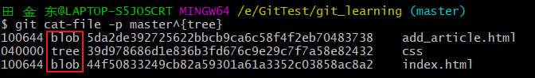
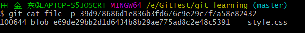

## Git中的树对象

​	在[Git对象](./Git对象)中我们了解到，Git仓库相当于一个Key—Value数据库，我们可以通过`hash-object`命令向“数据库”中存入文件，然后通过存入文件时返回的SHA-1码取出文件。但是在这个数据库中有一个致命的问题，那就是并没保存原先的文件名，所以Git就因此产生树对象。

#### 了解树对象

​	 Git 以一种类似于 UNIX 文件系统的方式存储内容，但作了些许简化。 所有内容均以树对象和数据对象的形式存储。 **一个树对象包含了一条或多条树对象记录（tree entry），每条记录含有一个指向数据对象或者子树对象的 SHA-1 指针，以及相应的模式、类型、文件名信息。** 例如，某项目当前对应的最新树对象可能是这样的：

​	

这个项目根目录下包含`README`、`Rakefile`文件和`lib`文件夹，在lib文件夹中有一个`simplegit.rb`文件。

我们可以通过将`树对象`理解为Git的“文件夹”，每一个树对象可以引用若干个文件对象（blob），和若干个树对象（tree）。

#### 查看Git的树对象

```shell
$ git cat-file -p master^{tree}
# master^{tree} 语法表示 master 分支上最新的提交所指向的树对象
```



​	我们可以看到，在`git_learning`这个仓库中，master分支最新的tree有三条记录，第一条和第三条指向一个文件对象，而第二条记录指向一个树对象，所以`css`是一个文件夹。

​	我们查看第二条所指向的树对象：



​	可以看到这个树对象中只有一条记录，指向一个`文件对象`，文件名叫`style.css`

