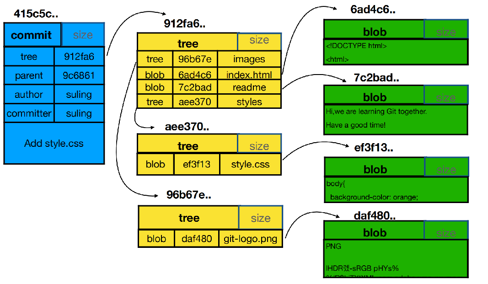
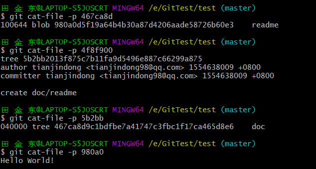
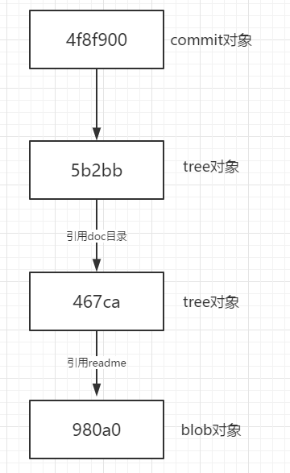

## 提交对象（commit）

​	前面我们提到了`tree`的概念，它解决了文件名的保存以及文件夹的层次结构的问题。但是我们每次提交都相当于保存了一个`树对象`，而每一次的提交都不一定修改了项目下的所有文件，那么就意味着总有一些树对象是可以在下次提交中重用的。若想重用这些快照树，那么就必须记住以往创建的所有树对象。 并且，你也完全不知道是谁保存了这些快照，在什么时刻保存的，以及为什么保存这些快照。 而以上这些，正是提交对象（commit object）能为你保存的基本信息。

​	下面我们给出一个提交对象、tree对象、blob对象的基本关系图：



在上面的这个commit对象中，保存了`作者`、`提交者`、`提交信息`、`父提交对象`、此次提交的`根树对象`。


#### Git对象的理解

问题：新建一个仓库，在仓库中创建doc/readme文件，然后放入暂存区，放入暂存区后，此时Git仓库中有多少个对象？提交后Git仓库有多少个对象？

**第一步：创建一个仓库**

```shell
$ git init test
```

**第二步：新建doc/readme**

```shell
$ mkdir doc
$ touch readme
```

在doc放入暂存区之前，查看`.git/objects`：发现并没有任何对象。

**第三步：将doc/readme放入暂存区，查看创建了几个对象**

```shell
$ git add doc/
```

此时我们查看`.git/objects`：

```shell
$ find .git/bojects
```


我们发现有一个对象，通过`git cat-file -t 980a0d5f19`可以看出这个对象是一个blob对象。

**第四步：提交此次变更，然后查看此次变更后一共产生了多少个对象**

```shell
$ git commit -m 'create doc/readme'
$ find .git/objects
```


此时我们看到一共创建了4个对象，我们使用`cat-file`命令查看对象的内容：



下图就是这四个对象的继承图：

